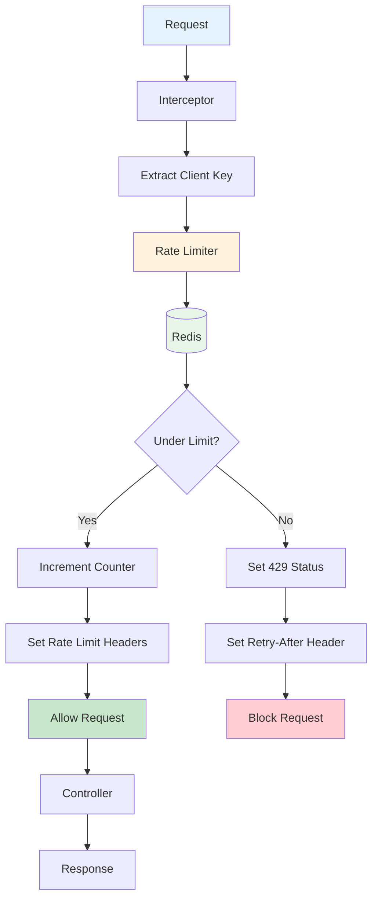

# How to Implement Sliding Window Rate Limiting in Spring

Author: [nawazdhandala](https://www.github.com/nawazdhandala)

Tags: Java, Spring Boot, Rate Limiting, Sliding Window, API, Security, Redis, Performance

Description: Learn how to implement sliding window rate limiting in Spring Boot to protect your APIs from abuse. This guide covers the algorithm, Redis-based implementation, and integration with Spring MVC interceptors.

---

> Fixed window rate limiting has a known flaw: traffic can spike at window boundaries. A user could make 100 requests at 11:59 and another 100 at 12:00, effectively getting 200 requests in two minutes while staying within a "100 per minute" limit. Sliding window rate limiting solves this problem.

Rate limiting protects your APIs from abuse and ensures fair usage. The sliding window algorithm provides smoother rate limiting by considering a rolling time window instead of fixed intervals.

---

## Understanding Sliding Window Rate Limiting

The sliding window algorithm combines elements of fixed window and sliding log approaches. It uses the previous window's count to weight the current period, preventing boundary spikes.

### The Algorithm

```
current_weight = (window_size - time_in_current_window) / window_size
effective_count = (previous_window_count * current_weight) + current_window_count

if effective_count >= limit:
    reject request
else:
    allow request and increment current window count
```

### Visual Example

```
Time: 11:30 (30 seconds into current minute)
Previous minute (11:00-11:59): 60 requests
Current minute (12:00-present): 20 requests
Limit: 100 requests per minute

Weight for previous window: (60 - 30) / 60 = 0.5
Effective count: (60 * 0.5) + 20 = 50

50 < 100, so request is allowed
```

---

## In-Memory Implementation

For single-server deployments, an in-memory implementation works well:

```java
// SlidingWindowRateLimiter.java
// Thread-safe sliding window rate limiter
package com.example.ratelimit;

import java.util.concurrent.ConcurrentHashMap;
import java.util.concurrent.atomic.AtomicLong;
import java.util.concurrent.locks.ReentrantLock;

public class SlidingWindowRateLimiter {

    private final int maxRequests;  // Maximum requests per window
    private final long windowSizeMs;  // Window size in milliseconds

    // Store window data per client key
    private final ConcurrentHashMap<String, WindowData> windows = new ConcurrentHashMap<>();

    public SlidingWindowRateLimiter(int maxRequests, long windowSizeMs) {
        this.maxRequests = maxRequests;
        this.windowSizeMs = windowSizeMs;
    }

    public boolean tryAcquire(String clientKey) {
        long now = System.currentTimeMillis();
        long currentWindow = now / windowSizeMs;  // Current window identifier

        // Get or create window data for this client
        WindowData data = windows.computeIfAbsent(clientKey, k -> new WindowData());

        data.lock.lock();
        try {
            // Calculate which window the previous count belongs to
            long previousWindow = currentWindow - 1;

            // Reset previous window count if it is stale
            if (data.windowId < previousWindow) {
                data.previousCount = 0;
                data.currentCount.set(0);
                data.windowId = currentWindow;
            }
            // Rotate windows if we moved to a new window
            else if (data.windowId < currentWindow) {
                data.previousCount = data.currentCount.get();
                data.currentCount.set(0);
                data.windowId = currentWindow;
            }

            // Calculate time position within current window (0.0 to 1.0)
            long windowStart = currentWindow * windowSizeMs;
            double positionInWindow = (double)(now - windowStart) / windowSizeMs;

            // Weight for previous window contribution
            double previousWeight = 1.0 - positionInWindow;

            // Calculate effective request count
            double effectiveCount = (data.previousCount * previousWeight)
                                  + data.currentCount.get();

            // Check if under limit
            if (effectiveCount < maxRequests) {
                data.currentCount.incrementAndGet();
                return true;  // Request allowed
            } else {
                return false;  // Rate limit exceeded
            }

        } finally {
            data.lock.unlock();
        }
    }

    // Returns remaining requests in current window
    public int getRemainingRequests(String clientKey) {
        long now = System.currentTimeMillis();
        long currentWindow = now / windowSizeMs;

        WindowData data = windows.get(clientKey);
        if (data == null) {
            return maxRequests;
        }

        data.lock.lock();
        try {
            long windowStart = currentWindow * windowSizeMs;
            double positionInWindow = (double)(now - windowStart) / windowSizeMs;
            double previousWeight = 1.0 - positionInWindow;

            long previousCount = (data.windowId == currentWindow - 1)
                ? data.previousCount
                : 0;

            double effectiveCount = (previousCount * previousWeight)
                                  + data.currentCount.get();

            return Math.max(0, (int)(maxRequests - effectiveCount));

        } finally {
            data.lock.unlock();
        }
    }

    // Internal class to hold window data per client
    private static class WindowData {
        final ReentrantLock lock = new ReentrantLock();
        volatile long windowId = 0;  // Current window identifier
        long previousCount = 0;  // Count from previous window
        AtomicLong currentCount = new AtomicLong(0);  // Count in current window
    }
}
```

---

## Redis-Based Implementation

For distributed systems with multiple servers, use Redis to share rate limit state:

```java
// RedisRateLimiter.java
// Distributed sliding window rate limiter using Redis
package com.example.ratelimit;

import org.springframework.data.redis.core.StringRedisTemplate;
import org.springframework.data.redis.core.script.RedisScript;
import org.springframework.stereotype.Component;

import java.time.Duration;
import java.util.Arrays;
import java.util.List;

@Component
public class RedisRateLimiter {

    private final StringRedisTemplate redisTemplate;
    private final RedisScript<List> rateLimitScript;

    public RedisRateLimiter(StringRedisTemplate redisTemplate) {
        this.redisTemplate = redisTemplate;
        this.rateLimitScript = createRateLimitScript();
    }

    private RedisScript<List> createRateLimitScript() {
        // Lua script for atomic sliding window rate limiting
        String script = """
            -- Keys: [1] = rate limit key prefix
            -- Args: [1] = max requests, [2] = window size in seconds, [3] = current timestamp

            local key_prefix = KEYS[1]
            local max_requests = tonumber(ARGV[1])
            local window_size = tonumber(ARGV[2])
            local now = tonumber(ARGV[3])

            -- Calculate current and previous window
            local current_window = math.floor(now / window_size)
            local previous_window = current_window - 1

            local current_key = key_prefix .. ':' .. current_window
            local previous_key = key_prefix .. ':' .. previous_window

            -- Get counts from both windows
            local current_count = tonumber(redis.call('GET', current_key) or '0')
            local previous_count = tonumber(redis.call('GET', previous_key) or '0')

            -- Calculate position in current window (0.0 to 1.0)
            local window_start = current_window * window_size
            local position = (now - window_start) / window_size

            -- Weight for previous window
            local previous_weight = 1 - position

            -- Calculate effective count
            local effective_count = (previous_count * previous_weight) + current_count

            if effective_count >= max_requests then
                -- Rate limited
                local retry_after = window_size - (now - window_start)
                return {0, math.ceil(effective_count), math.ceil(retry_after)}
            else
                -- Increment current window and set expiry
                redis.call('INCR', current_key)
                redis.call('EXPIRE', current_key, window_size * 2)
                local remaining = max_requests - effective_count - 1
                return {1, math.floor(remaining), 0}
            end
            """;

        return RedisScript.of(script, List.class);
    }

    public RateLimitResult tryAcquire(String clientKey, int maxRequests, Duration windowSize) {
        long now = System.currentTimeMillis() / 1000;  // Unix timestamp in seconds
        long windowSizeSeconds = windowSize.getSeconds();

        List<Long> result = redisTemplate.execute(
            rateLimitScript,
            List.of("ratelimit:" + clientKey),
            String.valueOf(maxRequests),
            String.valueOf(windowSizeSeconds),
            String.valueOf(now)
        );

        boolean allowed = result.get(0) == 1;
        int remaining = result.get(1).intValue();
        int retryAfter = result.get(2).intValue();

        return new RateLimitResult(allowed, remaining, retryAfter);
    }

    // Result object containing rate limit decision and metadata
    public record RateLimitResult(
        boolean allowed,
        int remaining,
        int retryAfterSeconds
    ) {}
}
```

---

## Spring MVC Integration

Integrate the rate limiter with Spring MVC using an interceptor:

```java
// RateLimitInterceptor.java
// Spring MVC interceptor for rate limiting
package com.example.ratelimit;

import jakarta.servlet.http.HttpServletRequest;
import jakarta.servlet.http.HttpServletResponse;
import org.springframework.http.HttpStatus;
import org.springframework.stereotype.Component;
import org.springframework.web.servlet.HandlerInterceptor;

import java.time.Duration;

@Component
public class RateLimitInterceptor implements HandlerInterceptor {

    private final RedisRateLimiter rateLimiter;

    // Configuration
    private static final int MAX_REQUESTS = 100;
    private static final Duration WINDOW_SIZE = Duration.ofMinutes(1);

    public RateLimitInterceptor(RedisRateLimiter rateLimiter) {
        this.rateLimiter = rateLimiter;
    }

    @Override
    public boolean preHandle(
            HttpServletRequest request,
            HttpServletResponse response,
            Object handler) throws Exception {

        // Extract client identifier (IP address or API key)
        String clientKey = extractClientKey(request);

        // Check rate limit
        RedisRateLimiter.RateLimitResult result =
            rateLimiter.tryAcquire(clientKey, MAX_REQUESTS, WINDOW_SIZE);

        // Set rate limit headers
        response.setHeader("X-RateLimit-Limit", String.valueOf(MAX_REQUESTS));
        response.setHeader("X-RateLimit-Remaining", String.valueOf(result.remaining()));

        if (!result.allowed()) {
            // Request is rate limited
            response.setHeader("Retry-After", String.valueOf(result.retryAfterSeconds()));
            response.setStatus(HttpStatus.TOO_MANY_REQUESTS.value());
            response.getWriter().write(
                "{\"error\":\"Rate limit exceeded\",\"retry_after\":" +
                result.retryAfterSeconds() + "}"
            );
            return false;  // Stop request processing
        }

        return true;  // Continue with request
    }

    private String extractClientKey(HttpServletRequest request) {
        // Try API key first
        String apiKey = request.getHeader("X-API-Key");
        if (apiKey != null && !apiKey.isEmpty()) {
            return "api:" + apiKey;
        }

        // Fall back to IP address
        String forwardedFor = request.getHeader("X-Forwarded-For");
        if (forwardedFor != null && !forwardedFor.isEmpty()) {
            // Take the first IP in the chain
            return "ip:" + forwardedFor.split(",")[0].trim();
        }

        return "ip:" + request.getRemoteAddr();
    }
}
```

Register the interceptor in your configuration:

```java
// WebConfig.java
// Register the rate limit interceptor
package com.example.config;

import com.example.ratelimit.RateLimitInterceptor;
import org.springframework.context.annotation.Configuration;
import org.springframework.web.servlet.config.annotation.InterceptorRegistry;
import org.springframework.web.servlet.config.annotation.WebMvcConfigurer;

@Configuration
public class WebConfig implements WebMvcConfigurer {

    private final RateLimitInterceptor rateLimitInterceptor;

    public WebConfig(RateLimitInterceptor rateLimitInterceptor) {
        this.rateLimitInterceptor = rateLimitInterceptor;
    }

    @Override
    public void addInterceptors(InterceptorRegistry registry) {
        registry.addInterceptor(rateLimitInterceptor)
            .addPathPatterns("/api/**")  // Apply to API endpoints
            .excludePathPatterns("/api/health", "/api/metrics");  // Exclude health checks
    }
}
```

---

## Rate Limit Flow

The following diagram shows how requests flow through the rate limiting system:



---

## Annotation-Based Rate Limiting

For more granular control, use custom annotations:

```java
// RateLimit.java
// Custom annotation for method-level rate limiting
package com.example.ratelimit;

import java.lang.annotation.ElementType;
import java.lang.annotation.Retention;
import java.lang.annotation.RetentionPolicy;
import java.lang.annotation.Target;

@Target({ElementType.METHOD, ElementType.TYPE})
@Retention(RetentionPolicy.RUNTIME)
public @interface RateLimit {
    int maxRequests() default 100;  // Max requests per window
    int windowSeconds() default 60;  // Window size in seconds
    String key() default "";  // Custom key expression (SpEL supported)
}
```

```java
// RateLimitAspect.java
// Aspect to handle @RateLimit annotation
package com.example.ratelimit;

import jakarta.servlet.http.HttpServletRequest;
import org.aspectj.lang.ProceedingJoinPoint;
import org.aspectj.lang.annotation.Around;
import org.aspectj.lang.annotation.Aspect;
import org.aspectj.lang.reflect.MethodSignature;
import org.springframework.http.HttpStatus;
import org.springframework.stereotype.Component;
import org.springframework.web.context.request.RequestContextHolder;
import org.springframework.web.context.request.ServletRequestAttributes;
import org.springframework.web.server.ResponseStatusException;

import java.time.Duration;

@Aspect
@Component
public class RateLimitAspect {

    private final RedisRateLimiter rateLimiter;

    public RateLimitAspect(RedisRateLimiter rateLimiter) {
        this.rateLimiter = rateLimiter;
    }

    @Around("@annotation(rateLimit)")
    public Object enforceRateLimit(ProceedingJoinPoint joinPoint, RateLimit rateLimit)
            throws Throwable {

        // Get current request
        ServletRequestAttributes attrs =
            (ServletRequestAttributes) RequestContextHolder.getRequestAttributes();
        HttpServletRequest request = attrs.getRequest();

        // Build rate limit key
        String clientKey = buildKey(request, joinPoint, rateLimit);

        // Check rate limit
        RedisRateLimiter.RateLimitResult result = rateLimiter.tryAcquire(
            clientKey,
            rateLimit.maxRequests(),
            Duration.ofSeconds(rateLimit.windowSeconds())
        );

        if (!result.allowed()) {
            throw new ResponseStatusException(
                HttpStatus.TOO_MANY_REQUESTS,
                "Rate limit exceeded. Retry after " + result.retryAfterSeconds() + " seconds"
            );
        }

        // Proceed with the method call
        return joinPoint.proceed();
    }

    private String buildKey(HttpServletRequest request, ProceedingJoinPoint joinPoint,
                           RateLimit rateLimit) {
        MethodSignature signature = (MethodSignature) joinPoint.getSignature();
        String methodName = signature.getDeclaringTypeName() + "." + signature.getName();

        // Use custom key if provided, otherwise use method name + client IP
        if (!rateLimit.key().isEmpty()) {
            return rateLimit.key() + ":" + getClientIp(request);
        }

        return methodName + ":" + getClientIp(request);
    }

    private String getClientIp(HttpServletRequest request) {
        String forwardedFor = request.getHeader("X-Forwarded-For");
        if (forwardedFor != null) {
            return forwardedFor.split(",")[0].trim();
        }
        return request.getRemoteAddr();
    }
}
```

Use the annotation on your controllers:

```java
// ApiController.java
// Controller with rate limited endpoints
package com.example.controller;

import com.example.ratelimit.RateLimit;
import org.springframework.web.bind.annotation.*;

@RestController
@RequestMapping("/api")
public class ApiController {

    // Default rate limit: 100 requests per minute
    @RateLimit
    @GetMapping("/data")
    public String getData() {
        return "data";
    }

    // Strict rate limit: 10 requests per minute
    @RateLimit(maxRequests = 10, windowSeconds = 60)
    @PostMapping("/expensive-operation")
    public String expensiveOperation() {
        return "result";
    }

    // Custom key for per-user rate limiting
    @RateLimit(maxRequests = 50, windowSeconds = 60, key = "user-api")
    @GetMapping("/user/{userId}")
    public String getUserData(@PathVariable String userId) {
        return "user data";
    }
}
```

---

## Testing Rate Limiting

Write tests to verify your rate limiter works correctly:

```java
// RateLimiterTest.java
// Unit tests for sliding window rate limiter
package com.example.ratelimit;

import org.junit.jupiter.api.BeforeEach;
import org.junit.jupiter.api.Test;
import static org.assertj.core.api.Assertions.*;

class SlidingWindowRateLimiterTest {

    private SlidingWindowRateLimiter rateLimiter;

    @BeforeEach
    void setUp() {
        // 10 requests per second for testing
        rateLimiter = new SlidingWindowRateLimiter(10, 1000);
    }

    @Test
    void shouldAllowRequestsUnderLimit() {
        String clientKey = "test-client";

        // First 10 requests should be allowed
        for (int i = 0; i < 10; i++) {
            assertThat(rateLimiter.tryAcquire(clientKey))
                .as("Request %d should be allowed", i + 1)
                .isTrue();
        }
    }

    @Test
    void shouldRejectRequestsOverLimit() {
        String clientKey = "test-client";

        // Use up the limit
        for (int i = 0; i < 10; i++) {
            rateLimiter.tryAcquire(clientKey);
        }

        // 11th request should be rejected
        assertThat(rateLimiter.tryAcquire(clientKey))
            .as("Request over limit should be rejected")
            .isFalse();
    }

    @Test
    void shouldTrackClientsIndependently() {
        // Client A uses their limit
        for (int i = 0; i < 10; i++) {
            rateLimiter.tryAcquire("client-a");
        }

        // Client B should still have their full quota
        assertThat(rateLimiter.tryAcquire("client-b")).isTrue();
    }

    @Test
    void shouldReportRemainingRequests() {
        String clientKey = "test-client";

        assertThat(rateLimiter.getRemainingRequests(clientKey)).isEqualTo(10);

        rateLimiter.tryAcquire(clientKey);
        assertThat(rateLimiter.getRemainingRequests(clientKey)).isEqualTo(9);
    }
}
```

---

## Best Practices

### 1. Use Appropriate Rate Limits

Different endpoints need different limits:

```java
// Strict limit for authentication
@RateLimit(maxRequests = 5, windowSeconds = 60)
@PostMapping("/login")
public void login() { }

// More generous limit for reads
@RateLimit(maxRequests = 1000, windowSeconds = 60)
@GetMapping("/data")
public void getData() { }
```

### 2. Return Useful Headers

Always include rate limit headers so clients can adapt:

```
X-RateLimit-Limit: 100
X-RateLimit-Remaining: 45
X-RateLimit-Reset: 1706123456
Retry-After: 30
```

### 3. Handle Redis Failures Gracefully

```java
public RateLimitResult tryAcquire(String clientKey, int maxRequests, Duration windowSize) {
    try {
        // Normal Redis rate limiting
        return executeRateLimitScript(clientKey, maxRequests, windowSize);
    } catch (Exception e) {
        log.warn("Redis rate limiter failed, falling back to allow", e);
        // Fail open - allow request if Redis is down
        return new RateLimitResult(true, maxRequests, 0);
    }
}
```

### 4. Consider Different Keys for Different Use Cases

```java
// Per IP rate limiting
String ipKey = "ip:" + request.getRemoteAddr();

// Per user rate limiting
String userKey = "user:" + authenticatedUser.getId();

// Per endpoint rate limiting
String endpointKey = "endpoint:" + request.getRequestURI() + ":" + ipKey;
```

---

## Conclusion

Sliding window rate limiting provides smoother, more accurate rate limiting than fixed window approaches. Key takeaways:

- The algorithm weighs previous window counts to prevent boundary spikes
- Use Redis for distributed systems with multiple servers
- Return rate limit headers so clients know their status
- Apply different limits to different endpoints based on their cost
- Fail open if your rate limiting infrastructure goes down

With proper rate limiting, your APIs stay responsive even under heavy load or attack.

---

*Need to monitor your rate limits? [OneUptime](https://oneuptime.com) provides real-time dashboards for tracking rate limit hits, helping you tune limits and identify potential abuse.*

**Related Reading:**
- [How to Implement Sliding Window Rate Limiting in Rust](https://oneuptime.com/blog/post/2026-01-25-sliding-window-rate-limiting-rust/view)
- [How to Build Rate Limiting Without External Services in Node.js](https://oneuptime.com/blog/post/2026-01-06-nodejs-rate-limiting-no-external-services/view)
