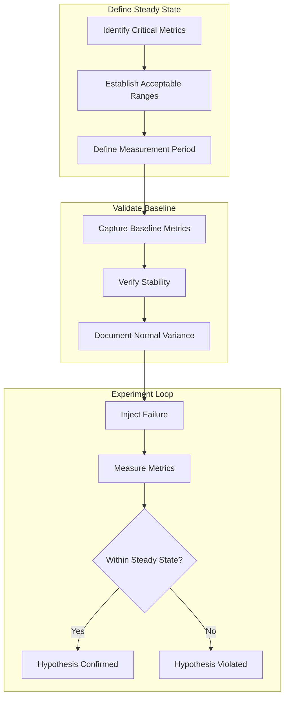
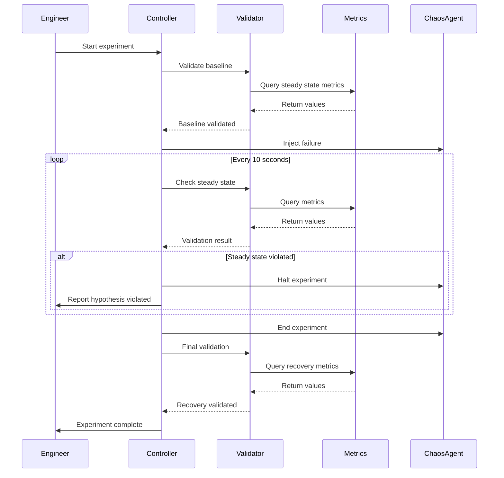

# How to Implement Steady State Hypothesis

Author: [nawazdhandala](https://www.github.com/nawazdhandala)

Tags: Chaos Engineering, Steady State Hypothesis, SRE, Resilience Testing, Observability, Metrics

Description: Learn how to define and validate steady state hypotheses to create meaningful chaos experiments that prove system resilience.

---

## What is a Steady State Hypothesis?

A steady state hypothesis defines what "normal" looks like for your system. Before you inject failures, you need a clear definition of acceptable behavior. The hypothesis establishes baseline metrics that should remain within bounds even when things go wrong.

The concept comes from the scientific method. You form a hypothesis about your system's behavior, inject a failure, and observe whether the hypothesis holds. If your system maintains steady state during the experiment, it validates your resilience assumptions. If steady state breaks, you have found a weakness to fix.

## The Steady State Framework



## Defining Your Steady State

Start by identifying the metrics that matter most to your users and business:

```python
# steady_state.py
# Define and validate steady state hypotheses

from dataclasses import dataclass, field
from typing import List, Dict, Optional, Callable
from enum import Enum
from datetime import datetime, timedelta

class MetricType(Enum):
    COUNTER = "counter"
    GAUGE = "gauge"
    HISTOGRAM = "histogram"

class Comparison(Enum):
    LESS_THAN = "lt"
    LESS_THAN_OR_EQUAL = "lte"
    GREATER_THAN = "gt"
    GREATER_THAN_OR_EQUAL = "gte"
    BETWEEN = "between"

@dataclass
class SteadyStateMetric:
    """A single metric that defines part of steady state."""
    name: str
    description: str
    query: str  # PromQL or similar
    metric_type: MetricType
    comparison: Comparison
    threshold: float
    upper_threshold: Optional[float] = None  # For BETWEEN comparisons
    tolerance_percent: float = 0.0  # Allow some variance

@dataclass
class SteadyStateHypothesis:
    """Complete hypothesis for a chaos experiment."""
    name: str
    description: str
    metrics: List[SteadyStateMetric]
    measurement_window_seconds: int = 60
    min_data_points: int = 5

    def to_dict(self) -> Dict:
        """Serialize hypothesis for storage."""
        return {
            "name": self.name,
            "description": self.description,
            "metrics": [
                {
                    "name": m.name,
                    "query": m.query,
                    "comparison": m.comparison.value,
                    "threshold": m.threshold,
                    "upper_threshold": m.upper_threshold,
                    "tolerance_percent": m.tolerance_percent
                }
                for m in self.metrics
            ],
            "measurement_window_seconds": self.measurement_window_seconds
        }

# Example: API Service Steady State
api_steady_state = SteadyStateHypothesis(
    name="API Service Steady State",
    description="API should maintain low latency and error rates under normal operation",
    metrics=[
        SteadyStateMetric(
            name="Error Rate",
            description="Percentage of requests returning 5xx errors",
            query='sum(rate(http_requests_total{status=~"5.."}[1m])) / sum(rate(http_requests_total[1m]))',
            metric_type=MetricType.GAUGE,
            comparison=Comparison.LESS_THAN,
            threshold=0.01,  # 1% error rate
            tolerance_percent=10  # Allow 10% variance
        ),
        SteadyStateMetric(
            name="P99 Latency",
            description="99th percentile response time",
            query='histogram_quantile(0.99, rate(http_request_duration_seconds_bucket[1m]))',
            metric_type=MetricType.HISTOGRAM,
            comparison=Comparison.LESS_THAN,
            threshold=2.0,  # 2 seconds
            tolerance_percent=20
        ),
        SteadyStateMetric(
            name="Availability",
            description="Percentage of successful health checks",
            query='avg_over_time(up{job="api"}[1m])',
            metric_type=MetricType.GAUGE,
            comparison=Comparison.GREATER_THAN_OR_EQUAL,
            threshold=0.99,  # 99% availability
            tolerance_percent=0
        ),
        SteadyStateMetric(
            name="Throughput",
            description="Requests per second",
            query='sum(rate(http_requests_total[1m]))',
            metric_type=MetricType.GAUGE,
            comparison=Comparison.BETWEEN,
            threshold=100,  # Minimum 100 RPS
            upper_threshold=10000,  # Maximum 10K RPS
            tolerance_percent=25
        )
    ],
    measurement_window_seconds=60,
    min_data_points=6
)
```

## Validating the Hypothesis

Before running experiments, validate that your system actually achieves steady state under normal conditions:

```python
# steady_state_validator.py
# Validate steady state before and during experiments

import asyncio
from dataclasses import dataclass
from typing import List, Dict, Tuple
from datetime import datetime

@dataclass
class ValidationResult:
    """Result of steady state validation."""
    metric_name: str
    current_value: float
    threshold: float
    within_bounds: bool
    variance_from_threshold: float
    timestamp: datetime

class SteadyStateValidator:
    """Validate steady state hypotheses against live metrics."""

    def __init__(self, metrics_client, hypothesis: SteadyStateHypothesis):
        self.metrics = metrics_client
        self.hypothesis = hypothesis

    async def validate_baseline(self, duration_seconds: int = 300) -> Dict:
        """
        Validate that the system is in steady state before an experiment.
        Collects data for the specified duration and checks stability.
        """
        results = {
            "valid": True,
            "start_time": datetime.utcnow().isoformat(),
            "duration_seconds": duration_seconds,
            "metrics": {}
        }

        # Collect samples over the duration
        samples = {m.name: [] for m in self.hypothesis.metrics}
        sample_interval = duration_seconds // self.hypothesis.min_data_points

        for _ in range(self.hypothesis.min_data_points):
            for metric in self.hypothesis.metrics:
                value = await self.metrics.query(metric.query)
                samples[metric.name].append(value)
            await asyncio.sleep(sample_interval)

        # Analyze each metric
        for metric in self.hypothesis.metrics:
            metric_samples = samples[metric.name]
            avg_value = sum(metric_samples) / len(metric_samples)
            variance = max(metric_samples) - min(metric_samples)
            variance_percent = (variance / avg_value * 100) if avg_value > 0 else 0

            within_bounds = self._check_bounds(avg_value, metric)
            stable = variance_percent <= metric.tolerance_percent

            results["metrics"][metric.name] = {
                "average": avg_value,
                "min": min(metric_samples),
                "max": max(metric_samples),
                "variance_percent": variance_percent,
                "within_bounds": within_bounds,
                "stable": stable,
                "threshold": metric.threshold
            }

            if not within_bounds or not stable:
                results["valid"] = False

        return results

    async def validate_during_experiment(self) -> Tuple[bool, List[ValidationResult]]:
        """
        Check if steady state holds at a single point in time.
        Called repeatedly during chaos experiments.
        """
        results = []
        all_valid = True

        for metric in self.hypothesis.metrics:
            current_value = await self.metrics.query(metric.query)
            within_bounds = self._check_bounds(current_value, metric)

            variance = abs(current_value - metric.threshold) / metric.threshold * 100

            result = ValidationResult(
                metric_name=metric.name,
                current_value=current_value,
                threshold=metric.threshold,
                within_bounds=within_bounds,
                variance_from_threshold=variance,
                timestamp=datetime.utcnow()
            )
            results.append(result)

            if not within_bounds:
                all_valid = False

        return all_valid, results

    def _check_bounds(self, value: float, metric: SteadyStateMetric) -> bool:
        """Check if a value is within the metric's acceptable bounds."""
        # Apply tolerance
        effective_threshold = metric.threshold * (1 + metric.tolerance_percent / 100)

        if metric.comparison == Comparison.LESS_THAN:
            return value < effective_threshold
        elif metric.comparison == Comparison.LESS_THAN_OR_EQUAL:
            return value <= effective_threshold
        elif metric.comparison == Comparison.GREATER_THAN:
            return value > metric.threshold * (1 - metric.tolerance_percent / 100)
        elif metric.comparison == Comparison.GREATER_THAN_OR_EQUAL:
            return value >= metric.threshold * (1 - metric.tolerance_percent / 100)
        elif metric.comparison == Comparison.BETWEEN:
            lower = metric.threshold * (1 - metric.tolerance_percent / 100)
            upper = metric.upper_threshold * (1 + metric.tolerance_percent / 100)
            return lower <= value <= upper

        return False
```

## Experiment Lifecycle with Steady State



## Practical Examples

### Database Failover Hypothesis

```python
# database_failover_hypothesis.py
# Steady state for database failover experiments

database_failover_hypothesis = SteadyStateHypothesis(
    name="Database Failover Resilience",
    description=(
        "When the primary database fails, the system should maintain "
        "acceptable performance through automatic failover"
    ),
    metrics=[
        SteadyStateMetric(
            name="Write Success Rate",
            description="Percentage of write operations that succeed",
            query='sum(rate(db_operations_total{operation="write",status="success"}[1m])) / sum(rate(db_operations_total{operation="write"}[1m]))',
            metric_type=MetricType.GAUGE,
            comparison=Comparison.GREATER_THAN_OR_EQUAL,
            threshold=0.95,  # 95% of writes succeed
            tolerance_percent=0
        ),
        SteadyStateMetric(
            name="Read Latency P95",
            description="95th percentile read latency",
            query='histogram_quantile(0.95, rate(db_read_duration_seconds_bucket[1m]))',
            metric_type=MetricType.HISTOGRAM,
            comparison=Comparison.LESS_THAN,
            threshold=0.5,  # 500ms
            tolerance_percent=50  # Allow degradation during failover
        ),
        SteadyStateMetric(
            name="Connection Pool Availability",
            description="Available connections in pool",
            query='db_pool_available_connections / db_pool_total_connections',
            metric_type=MetricType.GAUGE,
            comparison=Comparison.GREATER_THAN,
            threshold=0.1,  # At least 10% available
            tolerance_percent=0
        )
    ],
    measurement_window_seconds=30,  # Faster feedback during failover
    min_data_points=3
)
```

### Cache Degradation Hypothesis

```python
# cache_degradation_hypothesis.py
# Steady state when cache becomes unavailable

cache_degradation_hypothesis = SteadyStateHypothesis(
    name="Cache Degradation Graceful Fallback",
    description=(
        "When the cache layer fails, the system should continue operating "
        "by falling back to the database with acceptable latency increase"
    ),
    metrics=[
        SteadyStateMetric(
            name="Request Success Rate",
            description="Overall request success rate",
            query='sum(rate(http_requests_total{status!~"5.."}[1m])) / sum(rate(http_requests_total[1m]))',
            metric_type=MetricType.GAUGE,
            comparison=Comparison.GREATER_THAN_OR_EQUAL,
            threshold=0.99,  # 99% success
            tolerance_percent=0
        ),
        SteadyStateMetric(
            name="P99 Latency",
            description="99th percentile latency with degraded cache",
            query='histogram_quantile(0.99, rate(http_request_duration_seconds_bucket[1m]))',
            metric_type=MetricType.HISTOGRAM,
            comparison=Comparison.LESS_THAN,
            threshold=5.0,  # 5 seconds - allow for DB fallback
            tolerance_percent=0
        ),
        SteadyStateMetric(
            name="Database Query Rate",
            description="Queries hitting database directly",
            query='sum(rate(db_queries_total[1m]))',
            metric_type=MetricType.GAUGE,
            comparison=Comparison.LESS_THAN,
            threshold=10000,  # Don't overwhelm database
            tolerance_percent=10
        )
    ],
    measurement_window_seconds=60,
    min_data_points=6
)
```

## Integrating with Chaos Tools

Connect your steady state validator with chaos engineering tools:

```python
# chaos_experiment_runner.py
# Run chaos experiments with steady state validation

import asyncio
from typing import Dict, Optional
from datetime import datetime

class ChaosExperimentRunner:
    """Run chaos experiments with integrated steady state validation."""

    def __init__(self, chaos_client, validator: SteadyStateValidator,
                 event_tracker, alert_client):
        self.chaos = chaos_client
        self.validator = validator
        self.events = event_tracker
        self.alerts = alert_client

    async def run_experiment(self, experiment_config: Dict) -> Dict:
        """
        Execute a chaos experiment with steady state checks.

        Args:
            experiment_config: Experiment definition including attack type and parameters

        Returns:
            Experiment results including steady state validation
        """
        experiment_id = experiment_config["id"]
        results = {
            "experiment_id": experiment_id,
            "hypothesis": self.validator.hypothesis.name,
            "start_time": None,
            "end_time": None,
            "baseline_valid": False,
            "steady_state_maintained": True,
            "violations": [],
            "final_state": None
        }

        # Step 1: Validate baseline
        print(f"Validating baseline for {self.validator.hypothesis.name}...")
        baseline = await self.validator.validate_baseline(duration_seconds=300)
        results["baseline_valid"] = baseline["valid"]
        results["baseline_metrics"] = baseline["metrics"]

        if not baseline["valid"]:
            print("Baseline validation failed - system not in steady state")
            results["aborted_reason"] = "baseline_invalid"
            return results

        # Step 2: Start experiment
        results["start_time"] = datetime.utcnow().isoformat()
        print(f"Starting chaos experiment: {experiment_config['name']}")

        attack_id = await self.chaos.execute_attack(experiment_config)
        self.events.record_experiment_start(
            experiment_id=experiment_id,
            name=experiment_config["name"],
            targets=experiment_config["targets"],
            attack_type=experiment_config["attack_type"],
            parameters=experiment_config["parameters"]
        )

        # Step 3: Monitor steady state during experiment
        experiment_duration = experiment_config.get("duration_seconds", 60)
        check_interval = 10
        checks = experiment_duration // check_interval

        try:
            for i in range(checks):
                await asyncio.sleep(check_interval)

                valid, validation_results = await self.validator.validate_during_experiment()

                if not valid:
                    results["steady_state_maintained"] = False
                    violations = [
                        {
                            "metric": r.metric_name,
                            "value": r.current_value,
                            "threshold": r.threshold,
                            "timestamp": r.timestamp.isoformat()
                        }
                        for r in validation_results
                        if not r.within_bounds
                    ]
                    results["violations"].extend(violations)

                    # Check if we should halt
                    if self._should_halt(violations):
                        print("Critical violation detected - halting experiment")
                        await self.chaos.halt_attack(attack_id)
                        results["halted_early"] = True
                        break

        finally:
            # Ensure attack is stopped
            await self.chaos.ensure_attack_stopped(attack_id)

        # Step 4: Validate recovery
        results["end_time"] = datetime.utcnow().isoformat()
        print("Experiment ended - validating recovery...")

        await asyncio.sleep(30)  # Allow recovery time

        final_state = await self.validator.validate_baseline(duration_seconds=60)
        results["final_state"] = final_state
        results["recovered"] = final_state["valid"]

        # Record results
        self.events.record_experiment_end(
            experiment_id=experiment_id,
            success=results["steady_state_maintained"] and results["recovered"],
            impact_metrics=results.get("violations", []),
            recovery_time_seconds=30  # Time to recovery validation
        )

        return results

    def _should_halt(self, violations: list) -> bool:
        """Determine if violations warrant halting the experiment."""
        # Halt if any critical metric is violated significantly
        for violation in violations:
            if violation["metric"] in ["Error Rate", "Availability"]:
                variance = abs(violation["value"] - violation["threshold"]) / violation["threshold"]
                if variance > 0.5:  # 50% variance from threshold
                    return True
        return False
```

## Best Practices

**Be specific about thresholds**: Vague thresholds like "low latency" are useless. Define exact numbers based on SLOs.

**Include tolerance for variance**: Production systems have natural fluctuations. Build in reasonable tolerance to avoid false failures.

**Validate before every experiment**: Never assume steady state. System conditions change constantly.

**Document the reasoning**: Explain why each threshold was chosen so future engineers understand the context.

**Review and update regularly**: As systems evolve, steady state definitions must evolve too. Schedule quarterly reviews.

**Start conservative**: It is better to have strict thresholds and relax them than to miss real problems.

---

A well-defined steady state hypothesis transforms chaos engineering from random destruction into scientific experimentation. By establishing clear metrics and thresholds before injecting failures, you create experiments that provide actionable insights. When the hypothesis holds, you gain confidence in your resilience. When it breaks, you have precise data about what failed and by how much. Either outcome moves your reliability forward.
