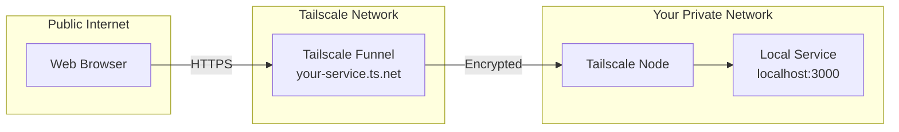
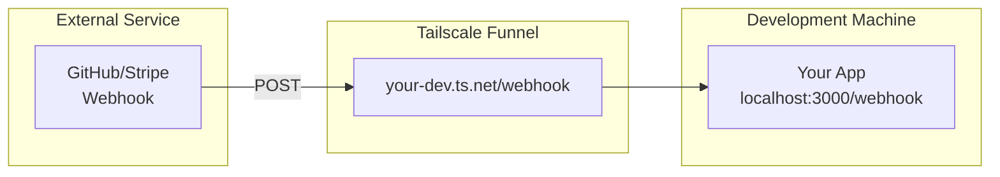
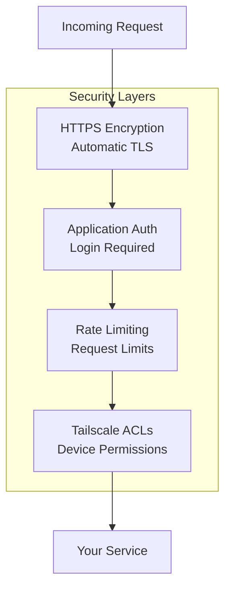

# How to Use Tailscale Funnel for Service Publishing

Author: [nawazdhandala](https://www.github.com/nawazdhandala)

Tags: Tailscale, VPN, Networking, Service Publishing, Security, DevOps

Description: Learn how to expose local services to the public internet securely using Tailscale Funnel without opening firewall ports.

---

Tailscale Funnel lets you publish services running on your private network to the public internet without opening firewall ports or configuring NAT. Traffic flows through Tailscale's network, giving you HTTPS endpoints with valid certificates automatically. This guide covers setting up Funnel for various use cases.

## Understanding Tailscale Funnel Architecture

Funnel creates a secure path from the public internet to your local service through Tailscale's relay infrastructure.



## Prerequisites

Before using Funnel, you need:
- A Tailscale account with Funnel enabled
- Tailscale client installed on your machine
- A service running locally that you want to expose
- Admin access to your Tailscale admin console

### Enabling Funnel in Admin Console

First, enable Funnel for your tailnet in the admin console.

1. Go to your Tailscale admin console
2. Navigate to DNS settings
3. Enable MagicDNS if not already enabled
4. Go to Access Controls (ACLs)
5. Add Funnel permissions to your policy

```json
{
  "acls": [
    // Your existing ACLs
  ],
  "nodeAttrs": [
    {
      "target": ["autogroup:members"],
      "attr": ["funnel"]
    }
  ]
}
```

## Installing and Configuring Tailscale

Install Tailscale on your server or development machine.

```bash
# On Ubuntu/Debian
curl -fsSL https://tailscale.com/install.sh | sh

# On macOS with Homebrew
brew install tailscale

# Start Tailscale and authenticate
sudo tailscale up

# Verify connection
tailscale status
```

## Basic Funnel Setup

Start exposing a local service with Funnel.

```bash
# Expose a local web server running on port 3000
tailscale funnel 3000

# The command outputs your public URL
# Example: https://your-machine.tail-scale.ts.net/

# Expose on a specific port (443 is default)
tailscale funnel --bg 3000

# Run in foreground with verbose output
tailscale funnel --verbose 3000
```

## Configuring Funnel for Specific Services

### Exposing a Development Server

Perfect for sharing work in progress with teammates or clients.

```bash
# Start your development server
npm run dev  # Runs on localhost:3000

# In another terminal, expose it with Funnel
tailscale funnel 3000

# Share the URL: https://your-machine.your-tailnet.ts.net/
```

### Exposing Multiple Paths

Route different paths to different local services.

```bash
# Expose main app on root path
tailscale funnel --set-path / 3000

# Expose API on /api path
tailscale funnel --set-path /api 8080

# Expose static files on /static path
tailscale funnel --set-path /static 8000
```

### Running Funnel as a Background Service

For production use, run Funnel in the background.

```bash
# Start Funnel in background mode
tailscale funnel --bg 3000

# Check Funnel status
tailscale funnel status

# Stop Funnel
tailscale funnel off

# View current Funnel configuration
tailscale funnel status --json
```

## Funnel Configuration File

For complex setups, use a configuration file approach through the serve command.

```bash
# Create a serve configuration
tailscale serve --bg https / http://localhost:3000
tailscale serve --bg https /api http://localhost:8080

# Then enable Funnel for the serve endpoints
tailscale funnel on

# View the full configuration
tailscale serve status
tailscale funnel status
```

## Practical Use Cases

### Webhook Development

Receive webhooks from external services during development.



```bash
# Start your webhook handler
python webhook_server.py  # Runs on port 5000

# Expose it with Funnel
tailscale funnel 5000

# Configure external service to send webhooks to:
# https://your-machine.your-tailnet.ts.net/webhook
```

### Demo Environments

Share demo environments with clients without deploying to staging.

```bash
# Start your demo application
docker-compose up  # Frontend on 3000, backend on 8080

# Expose both services
tailscale serve --bg https / http://localhost:3000
tailscale serve --bg https /api http://localhost:8080
tailscale funnel on

# Share with clients:
# https://demo.your-tailnet.ts.net/
```

### CI/CD Preview Environments

Create preview environments for pull requests.

```bash
#!/bin/bash
# preview-deploy.sh

# Build and start the preview app
docker build -t preview-$PR_NUMBER .
docker run -d -p 3000:3000 --name preview-$PR_NUMBER preview-$PR_NUMBER

# Expose with Funnel
tailscale funnel 3000

# Get the URL
PREVIEW_URL=$(tailscale funnel status | grep https | awk '{print $1}')

# Post the URL to the PR
gh pr comment $PR_NUMBER --body "Preview available at: $PREVIEW_URL"
```

### Home Lab Services

Expose self-hosted services securely.

```bash
# Expose your home media server
tailscale funnel 8096  # Jellyfin

# Expose home automation dashboard
tailscale funnel 8123  # Home Assistant

# Expose personal wiki
tailscale funnel 3000  # Wiki.js
```

## Security Considerations

Funnel exposes services to the public internet. Follow these security practices.



### Best Practices

```bash
# Only expose services that require public access
# Avoid exposing:
# - Admin panels without authentication
# - Database interfaces
# - Internal monitoring tools

# Use application-level authentication
# Example: Add basic auth to nginx
location / {
    auth_basic "Restricted";
    auth_basic_user_file /etc/nginx/.htpasswd;
    proxy_pass http://localhost:3000;
}

# Monitor access logs
tailscale funnel status --json | jq '.connections'

# Disable Funnel when not needed
tailscale funnel off
```

### Configuring ACLs for Funnel

Restrict which devices can use Funnel.

```json
{
  "nodeAttrs": [
    {
      "target": ["tag:servers"],
      "attr": ["funnel"]
    }
  ],
  "tagOwners": {
    "tag:servers": ["group:devops"]
  }
}
```

## Comparing Funnel to Alternatives

| Feature | Tailscale Funnel | ngrok | Cloudflare Tunnel |
|---------|------------------|-------|-------------------|
| Setup Complexity | Low | Low | Medium |
| Custom Domains | ts.net subdomain | Paid | Yes |
| HTTPS Certificates | Automatic | Automatic | Automatic |
| Authentication | Application level | Built-in options | Built-in options |
| Integration | Tailscale network | Standalone | Cloudflare ecosystem |
| Pricing | Included in Tailscale | Free tier limited | Free tier available |

## Troubleshooting Common Issues

### Funnel Not Working

```bash
# Check Tailscale is connected
tailscale status

# Verify Funnel is enabled for your tailnet
tailscale funnel status

# Check if MagicDNS is enabled
tailscale debug prefs | grep -i magic

# Verify the local service is running
curl http://localhost:3000

# Check for ACL issues
tailscale debug funnel
```

### Connection Timeouts

```bash
# Check your service is binding to localhost
netstat -tlnp | grep 3000

# If binding to 127.0.0.1, try 0.0.0.0
# Some frameworks need explicit binding

# Test local connectivity first
curl -v http://localhost:3000/

# Check Tailscale logs
sudo journalctl -u tailscaled -f
```

### SSL Certificate Issues

```bash
# Certificates are managed automatically
# If issues occur, restart Tailscale
sudo systemctl restart tailscaled

# Verify DNS is resolving correctly
dig your-machine.your-tailnet.ts.net

# Check certificate status
tailscale cert --help
```

## Automating Funnel with Systemd

Create a systemd service to automatically start Funnel.

```ini
# /etc/systemd/system/tailscale-funnel.service

[Unit]
Description=Tailscale Funnel for Local Service
After=network.target tailscaled.service
Requires=tailscaled.service

[Service]
Type=simple
ExecStart=/usr/bin/tailscale funnel 3000
Restart=always
RestartSec=10

[Install]
WantedBy=multi-user.target
```

```bash
# Enable and start the service
sudo systemctl daemon-reload
sudo systemctl enable tailscale-funnel
sudo systemctl start tailscale-funnel

# Check status
sudo systemctl status tailscale-funnel
```

---

Tailscale Funnel provides a secure, simple way to expose local services to the internet. It eliminates the complexity of port forwarding, dynamic DNS, and certificate management. Use it for development webhooks, sharing demos, or exposing home lab services. Remember that Funnel makes services publicly accessible, so always implement proper authentication and only expose services that need public access.
