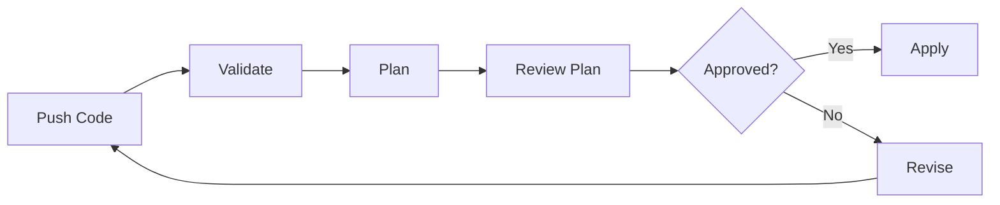

# How to Run Terraform with GitLab CI

Author: [nawazdhandala](https://www.github.com/nawazdhandala)

Tags: GitLab CI, Terraform, Infrastructure as Code, DevOps, Cloud, IaC

Description: Learn how to run Terraform with GitLab CI for automated infrastructure management, including plan reviews, state management, and secure credential handling.

---

Infrastructure as Code brings version control to your cloud resources. Running Terraform through GitLab CI ensures every infrastructure change goes through review, testing, and approval before applying. This guide shows you how to build a robust Terraform pipeline with plan previews, state management, and security controls.

## Basic Terraform Pipeline

Start with a simple pipeline that plans and applies Terraform.

```yaml
image:
  name: hashicorp/terraform:1.7
  entrypoint: [""]

stages:
  - validate
  - plan
  - apply

variables:
  TF_ROOT: ${CI_PROJECT_DIR}/terraform

cache:
  key: ${CI_COMMIT_REF_SLUG}
  paths:
    - ${TF_ROOT}/.terraform

before_script:
  - cd ${TF_ROOT}
  - terraform init

validate:
  stage: validate
  script:
    - terraform validate
    - terraform fmt -check

plan:
  stage: plan
  script:
    - terraform plan -out=tfplan
  artifacts:
    paths:
      - ${TF_ROOT}/tfplan
    expire_in: 1 week

apply:
  stage: apply
  script:
    - terraform apply -auto-approve tfplan
  dependencies:
    - plan
  when: manual
  only:
    - main
```

## Terraform Workflow

Here's the typical GitLab CI Terraform flow:



## Merge Request Plans

Show Terraform plans in merge requests for review.

```yaml
plan-mr:
  stage: plan
  script:
    - terraform plan -out=tfplan
    # Generate plan output for MR comment
    - terraform show -no-color tfplan > plan.txt
  artifacts:
    paths:
      - ${TF_ROOT}/tfplan
      - ${TF_ROOT}/plan.txt
    reports:
      terraform: ${TF_ROOT}/tfplan
  rules:
    - if: $CI_MERGE_REQUEST_IID
```

GitLab displays the plan diff directly in the merge request when using the Terraform report.

## State Management

Use GitLab's managed Terraform state for collaboration.

```hcl
# terraform/backend.tf
terraform {
  backend "http" {
    # GitLab will provide these via CI variables
  }
}
```

```yaml
variables:
  TF_STATE_NAME: default
  TF_ADDRESS: ${CI_API_V4_URL}/projects/${CI_PROJECT_ID}/terraform/state/${TF_STATE_NAME}

before_script:
  - cd ${TF_ROOT}
  - |
    terraform init \
      -backend-config="address=${TF_ADDRESS}" \
      -backend-config="lock_address=${TF_ADDRESS}/lock" \
      -backend-config="unlock_address=${TF_ADDRESS}/lock" \
      -backend-config="username=gitlab-ci-token" \
      -backend-config="password=${CI_JOB_TOKEN}" \
      -backend-config="lock_method=POST" \
      -backend-config="unlock_method=DELETE"
```

For external state storage (S3, GCS):

```yaml
variables:
  TF_BACKEND_BUCKET: "terraform-state-bucket"
  TF_BACKEND_KEY: "${CI_PROJECT_PATH}/${TF_STATE_NAME}.tfstate"

before_script:
  - cd ${TF_ROOT}
  - |
    terraform init \
      -backend-config="bucket=${TF_BACKEND_BUCKET}" \
      -backend-config="key=${TF_BACKEND_KEY}" \
      -backend-config="region=${AWS_REGION}"
```

## Credentials Management

Handle cloud credentials securely.

```yaml
variables:
  # AWS credentials from CI variables
  AWS_ACCESS_KEY_ID: ${AWS_ACCESS_KEY_ID}
  AWS_SECRET_ACCESS_KEY: ${AWS_SECRET_ACCESS_KEY}
  AWS_DEFAULT_REGION: us-east-1

# Or use OIDC for keyless authentication
plan:
  stage: plan
  id_tokens:
    AWS_OIDC_TOKEN:
      aud: https://gitlab.example.com
  script:
    # Exchange OIDC token for AWS credentials
    - |
      export $(printf "AWS_ACCESS_KEY_ID=%s AWS_SECRET_ACCESS_KEY=%s AWS_SESSION_TOKEN=%s" \
        $(aws sts assume-role-with-web-identity \
          --role-arn ${AWS_ROLE_ARN} \
          --role-session-name "gitlab-${CI_JOB_ID}" \
          --web-identity-token ${AWS_OIDC_TOKEN} \
          --query "Credentials.[AccessKeyId,SecretAccessKey,SessionToken]" \
          --output text))
    - terraform plan -out=tfplan
```

## Multi-Environment Infrastructure

Manage multiple environments with workspaces or directories.

### Using Workspaces

```yaml
variables:
  TF_ROOT: ${CI_PROJECT_DIR}/terraform

.terraform-base:
  before_script:
    - cd ${TF_ROOT}
    - terraform init
    - terraform workspace select ${ENVIRONMENT} || terraform workspace new ${ENVIRONMENT}

plan-staging:
  extends: .terraform-base
  stage: plan
  variables:
    ENVIRONMENT: staging
  script:
    - terraform plan -var-file=envs/staging.tfvars -out=tfplan-staging
  artifacts:
    paths:
      - ${TF_ROOT}/tfplan-staging

plan-production:
  extends: .terraform-base
  stage: plan
  variables:
    ENVIRONMENT: production
  script:
    - terraform plan -var-file=envs/production.tfvars -out=tfplan-production
  artifacts:
    paths:
      - ${TF_ROOT}/tfplan-production
```

### Using Directories

```yaml
.terraform-env:
  image:
    name: hashicorp/terraform:1.7
    entrypoint: [""]
  before_script:
    - cd ${TF_ROOT}/${ENVIRONMENT}
    - terraform init

plan-staging:
  extends: .terraform-env
  variables:
    ENVIRONMENT: staging
  script:
    - terraform plan -out=tfplan

plan-production:
  extends: .terraform-env
  variables:
    ENVIRONMENT: production
  script:
    - terraform plan -out=tfplan
```

## Security Scanning

Scan Terraform code for security issues.

```yaml
stages:
  - security
  - validate
  - plan
  - apply

tfsec:
  stage: security
  image:
    name: aquasec/tfsec:latest
    entrypoint: [""]
  script:
    - tfsec ${TF_ROOT} --format json --out tfsec-report.json
  artifacts:
    reports:
      sast: tfsec-report.json
  allow_failure: true

checkov:
  stage: security
  image:
    name: bridgecrew/checkov:latest
    entrypoint: [""]
  script:
    - checkov -d ${TF_ROOT} --output-file-path . --output junitxml
  artifacts:
    reports:
      junit: results_junitxml.xml
  allow_failure: true

infracost:
  stage: security
  image:
    name: infracost/infracost:latest
    entrypoint: [""]
  script:
    - infracost breakdown --path ${TF_ROOT} --format json --out-file infracost.json
    - infracost output --path infracost.json --format table
  artifacts:
    paths:
      - infracost.json
```

## Approval Gates

Require approval before applying to production.

```yaml
apply-production:
  stage: apply
  script:
    - terraform apply -auto-approve tfplan-production
  dependencies:
    - plan-production
  environment:
    name: production
  rules:
    - if: $CI_COMMIT_BRANCH == "main"
      when: manual
  # Require specific approvers
  needs:
    - job: plan-production
      artifacts: true
```

Configure protected environments in GitLab for additional approval controls.

## Drift Detection

Detect infrastructure drift with scheduled pipelines.

```yaml
drift-check:
  stage: plan
  script:
    - terraform plan -detailed-exitcode -out=tfplan
  rules:
    - if: $CI_PIPELINE_SOURCE == "schedule"
  after_script:
    # Alert if drift detected (exit code 2)
    - |
      if [ $CI_JOB_STATUS == "failed" ]; then
        curl -X POST ${SLACK_WEBHOOK} \
          -H "Content-Type: application/json" \
          -d '{"text":"Infrastructure drift detected in '${CI_PROJECT_NAME}'"}'
      fi
```

Schedule this job to run daily to catch manual changes.

## Module Testing

Test Terraform modules before publishing.

```yaml
stages:
  - lint
  - test
  - publish

lint:
  stage: lint
  script:
    - terraform fmt -check -recursive
    - terraform validate

test-module:
  stage: test
  image:
    name: hashicorp/terraform:1.7
    entrypoint: [""]
  script:
    - cd tests
    - terraform init
    - terraform plan
    - terraform apply -auto-approve
    - terraform destroy -auto-approve
  variables:
    TF_VAR_test_mode: "true"

publish-module:
  stage: publish
  script:
    # Publish to GitLab Terraform Registry
    - |
      curl --header "JOB-TOKEN: ${CI_JOB_TOKEN}" \
        --upload-file module.tar.gz \
        "${CI_API_V4_URL}/projects/${CI_PROJECT_ID}/packages/terraform/modules/my-module/aws/1.0.0/file"
  rules:
    - if: $CI_COMMIT_TAG
```

## Complete Production Pipeline

Here's a full Terraform pipeline for production use:

```yaml
image:
  name: hashicorp/terraform:1.7
  entrypoint: [""]

stages:
  - security
  - validate
  - plan
  - apply
  - destroy

variables:
  TF_ROOT: ${CI_PROJECT_DIR}/terraform
  TF_STATE_NAME: ${CI_COMMIT_REF_SLUG}

cache:
  key: terraform-${CI_COMMIT_REF_SLUG}
  paths:
    - ${TF_ROOT}/.terraform

.terraform-init:
  before_script:
    - cd ${TF_ROOT}
    - |
      terraform init \
        -backend-config="address=${CI_API_V4_URL}/projects/${CI_PROJECT_ID}/terraform/state/${TF_STATE_NAME}" \
        -backend-config="lock_address=${CI_API_V4_URL}/projects/${CI_PROJECT_ID}/terraform/state/${TF_STATE_NAME}/lock" \
        -backend-config="unlock_address=${CI_API_V4_URL}/projects/${CI_PROJECT_ID}/terraform/state/${TF_STATE_NAME}/lock" \
        -backend-config="username=gitlab-ci-token" \
        -backend-config="password=${CI_JOB_TOKEN}" \
        -backend-config="lock_method=POST" \
        -backend-config="unlock_method=DELETE"

security-scan:
  stage: security
  image:
    name: aquasec/tfsec:latest
    entrypoint: [""]
  script:
    - tfsec ${TF_ROOT} --soft-fail

validate:
  extends: .terraform-init
  stage: validate
  script:
    - terraform validate
    - terraform fmt -check

plan:
  extends: .terraform-init
  stage: plan
  script:
    - terraform plan -out=tfplan
    - terraform show -json tfplan > tfplan.json
  artifacts:
    paths:
      - ${TF_ROOT}/tfplan
      - ${TF_ROOT}/tfplan.json
    reports:
      terraform: ${TF_ROOT}/tfplan.json
    expire_in: 7 days

apply:
  extends: .terraform-init
  stage: apply
  script:
    - terraform apply -auto-approve tfplan
  dependencies:
    - plan
  environment:
    name: ${CI_COMMIT_REF_SLUG}
    on_stop: destroy
  rules:
    - if: $CI_COMMIT_BRANCH == "main"
      when: manual
    - if: $CI_MERGE_REQUEST_IID
      when: manual

destroy:
  extends: .terraform-init
  stage: destroy
  script:
    - terraform destroy -auto-approve
  environment:
    name: ${CI_COMMIT_REF_SLUG}
    action: stop
  rules:
    - if: $CI_MERGE_REQUEST_IID
      when: manual
  variables:
    GIT_STRATEGY: none
```

---

Running Terraform through GitLab CI brings discipline to infrastructure changes. Every modification goes through code review, security scanning, and plan approval before touching cloud resources. Start with a basic plan-and-apply workflow, then add security scanning, drift detection, and multi-environment support as your infrastructure grows.
