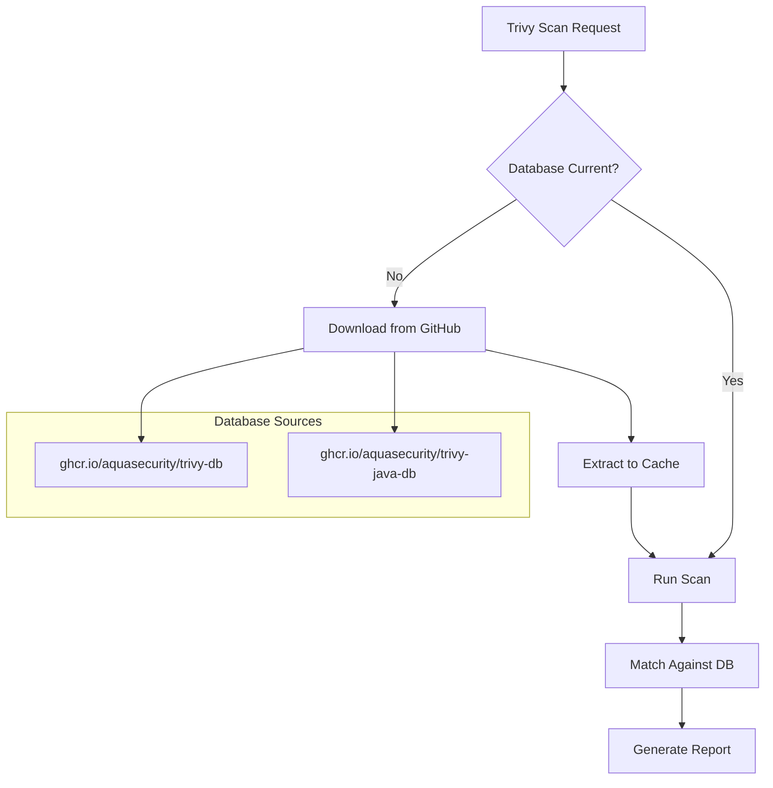
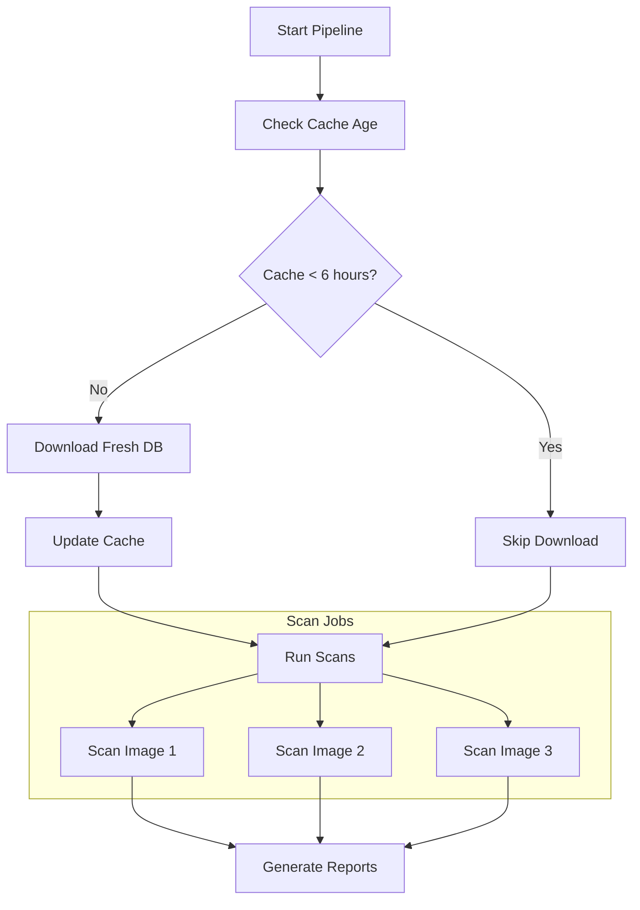

# How to Configure Trivy DB Updates

Author: [nawazdhandala](https://www.github.com/nawazdhandala)

Tags: Trivy, Security, Vulnerability Database, DevSecOps, CI/CD, Database Updates

Description: Learn how to configure and manage Trivy vulnerability database updates for accurate and efficient security scanning.

---

> Trivy's vulnerability database is its brain. Without current data, you cannot detect recent CVEs. Proper database configuration ensures accurate scans while optimizing for speed and reliability in CI/CD pipelines.

The vulnerability landscape changes daily. New CVEs are published, existing ones are updated with fixes, and severity scores are revised. Keeping your Trivy database current is essential for meaningful security scanning.

---

## Understanding Trivy Databases

Trivy uses multiple databases for different types of scans:

| Database | Purpose | Size | Update Frequency |
|----------|---------|------|------------------|
| trivy-db | OS and language vulnerabilities | ~40MB | Every 6 hours |
| trivy-java-db | Java-specific vulnerabilities | ~200MB | Every 6 hours |
| trivy-checks | Misconfiguration checks | ~10MB | With releases |



---

## Default Update Behavior

By default, Trivy checks for database updates before each scan.

```bash
# Default behavior: check for updates, download if stale
trivy image nginx:latest

# Output shows database status
2026-01-28T10:00:00.000Z  INFO  Need to update DB
2026-01-28T10:00:00.000Z  INFO  Downloading DB...
2026-01-28T10:00:05.000Z  INFO  Vulnerability DB downloaded
```

The database is cached locally and reused until it expires (default: 12 hours).

---

## Controlling Update Behavior

### Skip Updates

Skip database updates when you want faster scans with cached data.

```bash
# Skip database update check entirely
trivy image --skip-db-update nginx:latest

# Skip Java database update (for Java scans)
trivy image --skip-java-db-update myapp:latest
```

Use this when:
- Running multiple scans in quick succession
- Database was recently updated
- Operating in air-gapped environments

### Force Download

Force a fresh database download regardless of cache state.

```bash
# Download database only (do not scan)
trivy image --download-db-only

# Download Java database only
trivy image --download-java-db-only

# Force fresh download before scan
trivy image --reset nginx:latest
```

---

## Database Location and Caching

### Default Cache Location

```bash
# Linux/macOS
~/.cache/trivy/

# Contents
~/.cache/trivy/db/          # Main vulnerability DB
~/.cache/trivy/java-db/     # Java vulnerability DB
~/.cache/trivy/fanal/       # File analysis cache
```

### Custom Cache Directory

```bash
# Set custom cache directory
trivy image --cache-dir /opt/trivy-cache nginx:latest

# Or use environment variable
export TRIVY_CACHE_DIR=/opt/trivy-cache
trivy image nginx:latest
```

### Cache Configuration

```yaml
# trivy.yaml
# Database and cache configuration

cache:
  dir: /opt/trivy-cache

db:
  # Skip update check (use cached)
  skip-update: false

  # Database download URL (for mirrors)
  repository: ghcr.io/aquasecurity/trivy-db

  # Java database URL
  java-repository: ghcr.io/aquasecurity/trivy-java-db
```

---

## CI/CD Optimization

### Pre-download Database

Download the database once at the start of your pipeline.

```yaml
# GitHub Actions
name: Security Scan

jobs:
  security:
    runs-on: ubuntu-latest
    steps:
      - name: Download Trivy DB
        run: |
          # Download database once
          trivy image --download-db-only
          trivy image --download-java-db-only

      - name: Scan Image 1
        run: trivy image --skip-db-update image1:latest

      - name: Scan Image 2
        run: trivy image --skip-db-update image2:latest

      - name: Scan Image 3
        run: trivy image --skip-db-update image3:latest
```

### Cache Database Between Runs

```yaml
# GitHub Actions with caching
name: Security Scan

jobs:
  security:
    runs-on: ubuntu-latest
    steps:
      - name: Cache Trivy DB
        uses: actions/cache@v4
        with:
          path: ~/.cache/trivy
          key: trivy-db-${{ github.run_id }}
          restore-keys: |
            trivy-db-

      - name: Update DB if needed
        run: trivy image --download-db-only

      - name: Run scans
        run: |
          trivy image --skip-db-update image1:latest
          trivy image --skip-db-update image2:latest
```

### GitLab CI with Shared Cache

```yaml
# .gitlab-ci.yml
variables:
  TRIVY_CACHE_DIR: /cache/trivy

stages:
  - prepare
  - scan

download-db:
  stage: prepare
  image: aquasec/trivy:latest
  script:
    - trivy image --download-db-only
    - trivy image --download-java-db-only
  cache:
    key: trivy-db
    paths:
      - /cache/trivy/

scan-images:
  stage: scan
  image: aquasec/trivy:latest
  needs: [download-db]
  parallel:
    matrix:
      - IMAGE: [image1:latest, image2:latest, image3:latest]
  script:
    - trivy image --skip-db-update $IMAGE
  cache:
    key: trivy-db
    paths:
      - /cache/trivy/
    policy: pull  # Read-only access to cache
```

---

## Air-Gapped Environments

For environments without internet access, pre-download and transfer the database.

### Download Database on Connected System

```bash
# On system with internet access
# Download the OCI artifact containing the database
oras pull ghcr.io/aquasecurity/trivy-db:2 -o ./trivy-db/

# For Java database
oras pull ghcr.io/aquasecurity/trivy-java-db:1 -o ./trivy-java-db/

# Or use Trivy directly
trivy image --download-db-only --cache-dir ./trivy-cache
```

### Transfer and Use in Air-Gapped Environment

```bash
# Transfer trivy-cache directory to air-gapped system
# Then run scans using the local cache

trivy image --skip-db-update \
  --cache-dir /path/to/trivy-cache \
  nginx:latest
```

### Host Your Own Mirror

```bash
# Set up internal registry mirror
# Push databases to internal registry
oras push internal-registry.company.com/trivy/trivy-db:2 \
  ./trivy-db/*

# Configure Trivy to use internal mirror
trivy image \
  --db-repository internal-registry.company.com/trivy/trivy-db \
  nginx:latest
```

---

## Database Update Workflow



---

## Scheduled Database Updates

Keep your database current with scheduled updates.

### Cron Job

```bash
#!/bin/bash
# /etc/cron.d/trivy-db-update
# Update Trivy database every 6 hours

0 */6 * * * root /usr/local/bin/trivy image --download-db-only \
  --cache-dir /opt/trivy-cache \
  >> /var/log/trivy-db-update.log 2>&1
```

### Kubernetes CronJob

```yaml
# trivy-db-update.yaml
apiVersion: batch/v1
kind: CronJob
metadata:
  name: trivy-db-update
spec:
  schedule: "0 */6 * * *"  # Every 6 hours
  jobTemplate:
    spec:
      template:
        spec:
          containers:
          - name: trivy
            image: aquasec/trivy:latest
            command:
            - trivy
            - image
            - --download-db-only
            volumeMounts:
            - name: trivy-cache
              mountPath: /root/.cache/trivy
          volumes:
          - name: trivy-cache
            persistentVolumeClaim:
              claimName: trivy-cache-pvc
          restartPolicy: OnFailure
```

---

## Monitoring Database Health

### Check Database Age

```bash
# Check when database was last updated
trivy image --skip-db-update --debug nginx:latest 2>&1 | grep -i "db"

# Or check the metadata file
cat ~/.cache/trivy/db/metadata.json | jq '.DownloadedAt'
```

### Wrapper Script with Validation

```bash
#!/bin/bash
# trivy-with-db-check.sh
# Validate database freshness before scanning

CACHE_DIR="${TRIVY_CACHE_DIR:-$HOME/.cache/trivy}"
MAX_AGE_HOURS=12

# Check database age
if [ -f "$CACHE_DIR/db/metadata.json" ]; then
    DOWNLOADED_AT=$(jq -r '.DownloadedAt' "$CACHE_DIR/db/metadata.json")
    DOWNLOADED_TS=$(date -d "$DOWNLOADED_AT" +%s 2>/dev/null || date -j -f "%Y-%m-%dT%H:%M:%S" "$DOWNLOADED_AT" +%s)
    CURRENT_TS=$(date +%s)
    AGE_HOURS=$(( (CURRENT_TS - DOWNLOADED_TS) / 3600 ))

    echo "Database age: ${AGE_HOURS} hours"

    if [ "$AGE_HOURS" -gt "$MAX_AGE_HOURS" ]; then
        echo "Database is stale, updating..."
        trivy image --download-db-only
    else
        echo "Database is current, skipping update"
    fi
else
    echo "No database found, downloading..."
    trivy image --download-db-only
fi

# Run the actual scan
trivy image --skip-db-update "$@"
```

---

## Troubleshooting Database Issues

### Database Download Failures

```bash
# Enable debug logging
trivy image --debug nginx:latest

# Common issues:
# 1. Network timeout - increase timeout
trivy image --timeout 30m nginx:latest

# 2. Proxy issues - configure proxy
export HTTP_PROXY=http://proxy.company.com:8080
export HTTPS_PROXY=http://proxy.company.com:8080
trivy image nginx:latest

# 3. Rate limiting - use authenticated requests
export TRIVY_USERNAME=your-github-username
export TRIVY_PASSWORD=your-github-token
trivy image nginx:latest
```

### Corrupted Database

```bash
# Clear the cache and redownload
rm -rf ~/.cache/trivy/db/
trivy image --download-db-only

# Or use the reset flag
trivy image --reset nginx:latest
```

### Version Mismatch

```bash
# Check Trivy version
trivy version

# Database schema changes between major versions
# Clear cache after upgrading Trivy
rm -rf ~/.cache/trivy/
trivy image nginx:latest
```

---

## Configuration Reference

```yaml
# trivy.yaml - Complete database configuration

db:
  # Skip vulnerability DB update
  skip-update: false

  # Download DB only (no scan)
  download-only: false

  # DB repository URL
  repository: ghcr.io/aquasecurity/trivy-db

  # Repository for Java DB
  java-repository: ghcr.io/aquasecurity/trivy-java-db

cache:
  # Cache directory path
  dir: ~/.cache/trivy

  # Clear cache before scan
  clear: false

# Timeout for database operations
timeout: 5m

# Enable debug output
debug: false
```

---

## Best Practices

1. **Pre-download in CI/CD**: Download database once at pipeline start, skip for subsequent scans

2. **Cache Between Runs**: Use CI/CD caching to avoid repeated downloads

3. **Schedule Updates**: For persistent environments, update database every 6-12 hours

4. **Monitor Freshness**: Alert if database becomes too stale

5. **Mirror for Air-Gap**: Host internal mirrors for disconnected environments

6. **Version Lock in Production**: Consider pinning database versions for reproducible scans

---

## Conclusion

Proper database configuration balances accuracy with performance. By pre-downloading databases, caching effectively, and monitoring freshness, you can maintain accurate vulnerability detection without slowing down your CI/CD pipeline.

For air-gapped environments, setting up internal mirrors ensures you can still benefit from regular vulnerability updates while maintaining network isolation.

---

*Need to monitor your security scanning infrastructure? [OneUptime](https://oneuptime.com) provides comprehensive monitoring for your DevSecOps pipelines.*

**Related Reading:**
- [How to Use Trivy for Filesystem Scanning](https://oneuptime.com/blog/post/2026-01-28-trivy-filesystem-scanning/view)
- [How to Debug Trivy Scanning Issues](https://oneuptime.com/blog/post/2026-01-28-trivy-debug-scanning-issues/view)
