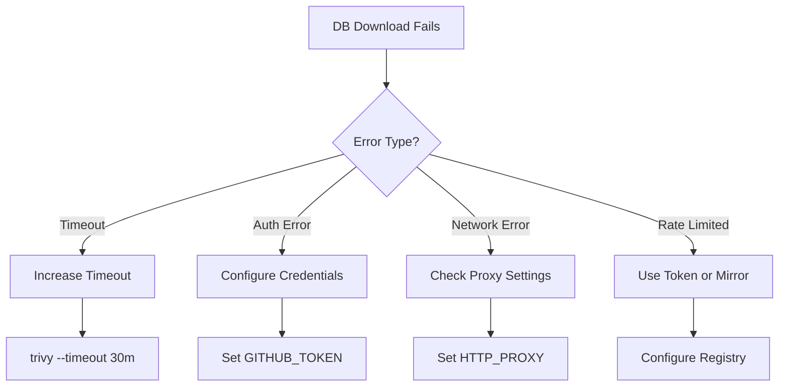
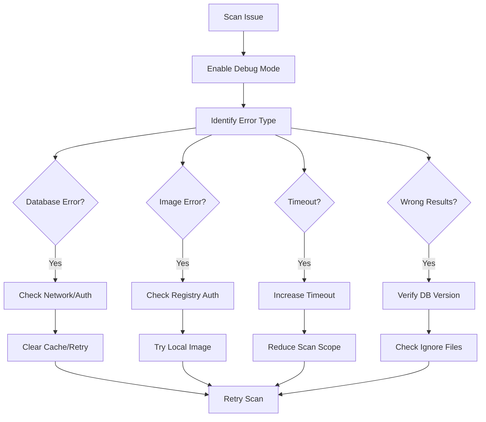

# How to Debug Trivy Scanning Issues

Author: [nawazdhandala](https://www.github.com/nawazdhandala)

Tags: Trivy, Security, Debugging, Troubleshooting, DevSecOps, CI/CD

Description: Learn how to diagnose and fix common Trivy scanning issues including database problems, timeout errors, and false positives.

---

> Security scanners are only useful when they work reliably. When Trivy scans fail or produce unexpected results, you need to diagnose the issue quickly. This guide covers common problems and their solutions.

Every DevSecOps engineer has faced a failing Trivy scan at the worst possible time. Understanding how to debug these issues transforms frustrating blockers into quick fixes.

---

## Enable Debug Logging

The first step in any debugging session is enabling verbose output.

```bash
# Enable debug mode
trivy image --debug nginx:latest

# Or set environment variable
export TRIVY_DEBUG=true
trivy image nginx:latest
```

Debug output shows:
- Database update status
- File detection process
- Vulnerability matching logic
- Timing information

```bash
$ trivy image --debug nginx:latest
2026-01-28T10:00:00.000Z DEBUG  Cache dir: /root/.cache/trivy
2026-01-28T10:00:00.100Z DEBUG  DB update check...
2026-01-28T10:00:00.200Z DEBUG  DB is up to date
2026-01-28T10:00:00.300Z DEBUG  Detecting OS...
2026-01-28T10:00:00.400Z DEBUG  Detected OS: debian 12
2026-01-28T10:00:00.500Z DEBUG  Scanning packages...
```

---

## Common Issues and Solutions

### Issue 1: Database Download Failures



**Symptoms:**
```
FATAL  failed to download vulnerability DB
```

**Solutions:**

```bash
# 1. Increase timeout for slow connections
trivy image --timeout 30m nginx:latest

# 2. Configure proxy for corporate networks
export HTTP_PROXY=http://proxy.company.com:8080
export HTTPS_PROXY=http://proxy.company.com:8080
export NO_PROXY=localhost,127.0.0.1
trivy image nginx:latest

# 3. Authenticate to avoid rate limiting
export GITHUB_TOKEN=your_github_token
trivy image nginx:latest

# 4. Use a mirror registry
trivy image --db-repository your-registry.com/trivy-db nginx:latest

# 5. Clear corrupted cache and retry
rm -rf ~/.cache/trivy/db/
trivy image nginx:latest
```

---

### Issue 2: Image Pull Failures

**Symptoms:**
```
FATAL  failed to pull image
```

**Solutions:**

```bash
# 1. Check image exists
docker pull nginx:latest

# 2. Authenticate to private registry
export TRIVY_USERNAME=your_username
export TRIVY_PASSWORD=your_password
trivy image private-registry.com/myapp:latest

# 3. Use Docker credentials
# Trivy reads from ~/.docker/config.json
docker login private-registry.com
trivy image private-registry.com/myapp:latest

# 4. Scan local image instead
docker pull nginx:latest
trivy image --input nginx.tar nginx:latest

# 5. Skip TLS verification (development only)
trivy image --insecure private-registry.com/myapp:latest
```

---

### Issue 3: Timeout During Scan

**Symptoms:**
```
FATAL  context deadline exceeded
```

**Solutions:**

```bash
# 1. Increase overall timeout
trivy image --timeout 60m large-image:latest

# 2. Skip database update (use cached)
trivy image --skip-db-update nginx:latest

# 3. Scan specific layers only
trivy image --ignore-unfixed nginx:latest

# 4. Reduce scan scope
trivy image --vuln-type os nginx:latest  # OS packages only
trivy image --vuln-type library nginx:latest  # Libraries only

# 5. Use parallel scanning for multiple images
# Pre-download DB once
trivy image --download-db-only

# Then scan without DB update
for img in image1 image2 image3; do
    trivy image --skip-db-update $img &
done
wait
```

---

### Issue 4: No Vulnerabilities Detected

**Symptoms:**
```
Total: 0 (UNKNOWN: 0, LOW: 0, MEDIUM: 0, HIGH: 0, CRITICAL: 0)
```

**Possible Causes and Solutions:**

```bash
# 1. Unsupported OS - check what Trivy detects
trivy image --debug nginx:latest 2>&1 | grep "Detected OS"

# 2. Outdated database - force refresh
trivy image --reset nginx:latest

# 3. Image uses scratch base - no OS packages
# This is expected for distroless images
trivy image --vuln-type library gcr.io/distroless/static:latest

# 4. Check if files are detected
trivy image --debug nginx:latest 2>&1 | grep -i "analyzing"

# 5. Scan filesystem instead of image
docker create --name temp nginx:latest
docker export temp | tar -xf - -C ./extracted/
docker rm temp
trivy fs ./extracted/
```

---

### Issue 5: False Positives

**Symptoms:**
Trivy reports vulnerabilities that do not actually affect your application.

**Solutions:**

```bash
# 1. Check vulnerability details
trivy image --format json nginx:latest | \
  jq '.Results[].Vulnerabilities[] | select(.VulnerabilityID == "CVE-2023-12345")'

# 2. Verify the vulnerable function is used
# Check if the vulnerable code path exists in your application

# 3. Create ignore file for confirmed false positives
cat > .trivyignore << EOF
# False positive: function not used in our code
CVE-2023-12345

# Mitigated by network policy
CVE-2023-67890
EOF

trivy image --ignorefile .trivyignore nginx:latest

# 4. Ignore with expiration date
echo "exp:2024-06-01 CVE-2023-11111" >> .trivyignore

# 5. Filter by status (ignore unfixed)
trivy image --ignore-unfixed nginx:latest
```

---

### Issue 6: Missing Vulnerabilities

**Symptoms:**
Known CVEs are not being reported.

**Solutions:**

```bash
# 1. Check database freshness
trivy image --debug nginx:latest 2>&1 | grep -i "database"

# Check metadata
cat ~/.cache/trivy/db/metadata.json

# 2. Force database update
trivy image --reset nginx:latest

# 3. Check if CVE is in supported database
# Trivy may not track all vulnerability sources

# 4. Check severity filter
trivy image --severity CRITICAL,HIGH,MEDIUM,LOW,UNKNOWN nginx:latest

# 5. Verify package version detection
trivy image --format json nginx:latest | \
  jq '.Results[].Packages[] | select(.Name == "openssl")'
```

---

## Debugging Workflow



---

## CI/CD Debugging

### GitHub Actions

```yaml
# .github/workflows/debug-trivy.yaml
name: Debug Trivy Scan

on: workflow_dispatch

jobs:
  debug:
    runs-on: ubuntu-latest
    steps:
      - name: Debug environment
        run: |
          echo "Runner info:"
          uname -a
          df -h
          free -m

      - name: Install Trivy with debug
        run: |
          curl -sfL https://raw.githubusercontent.com/aquasecurity/trivy/main/contrib/install.sh | sh -s -- -b /usr/local/bin
          trivy version

      - name: Check network connectivity
        run: |
          curl -I https://ghcr.io/v2/
          curl -I https://github.com

      - name: Download DB with debug
        run: |
          trivy image --debug --download-db-only 2>&1 | tee db-download.log

      - name: Run scan with debug
        run: |
          trivy image --debug nginx:latest 2>&1 | tee scan.log

      - name: Upload logs
        uses: actions/upload-artifact@v4
        if: always()
        with:
          name: trivy-debug-logs
          path: |
            db-download.log
            scan.log
```

### GitLab CI

```yaml
# .gitlab-ci.yml
debug-trivy:
  stage: debug
  image: aquasec/trivy:latest
  script:
    - trivy --version
    - trivy image --debug --download-db-only 2>&1 | tee db.log
    - trivy image --debug nginx:latest 2>&1 | tee scan.log
  artifacts:
    when: always
    paths:
      - "*.log"
```

---

## Performance Troubleshooting

### Measure Scan Time

```bash
# Time the entire scan
time trivy image nginx:latest

# Break down by phase
trivy image --debug nginx:latest 2>&1 | grep -E "^\d{4}-\d{2}-\d{2}"
```

### Optimize Slow Scans

```bash
# 1. Pre-download database
trivy image --download-db-only

# 2. Use cache directory on fast storage
trivy image --cache-dir /dev/shm/trivy-cache nginx:latest

# 3. Scan only what you need
trivy image --vuln-type os nginx:latest  # Skip library scan
trivy image --scanners vuln nginx:latest  # Skip misconfig scan

# 4. Skip specific checks
trivy image --skip-files "*.jar" nginx:latest

# 5. Use server mode for repeated scans
trivy server --listen 0.0.0.0:8080 &
trivy client --remote http://localhost:8080 nginx:latest
```

---

## Debugging Script

```bash
#!/bin/bash
# trivy-debug.sh - Comprehensive Trivy debugging

set -e

IMAGE=${1:-nginx:latest}
LOG_DIR="./trivy-debug-$(date +%Y%m%d-%H%M%S)"
mkdir -p "$LOG_DIR"

echo "=== Trivy Debug Report ===" | tee "$LOG_DIR/report.txt"
echo "Image: $IMAGE" | tee -a "$LOG_DIR/report.txt"
echo "Date: $(date)" | tee -a "$LOG_DIR/report.txt"
echo "" | tee -a "$LOG_DIR/report.txt"

# Version info
echo "=== Trivy Version ===" | tee -a "$LOG_DIR/report.txt"
trivy version | tee -a "$LOG_DIR/report.txt"
echo "" | tee -a "$LOG_DIR/report.txt"

# Database info
echo "=== Database Status ===" | tee -a "$LOG_DIR/report.txt"
if [ -f ~/.cache/trivy/db/metadata.json ]; then
    cat ~/.cache/trivy/db/metadata.json | tee -a "$LOG_DIR/report.txt"
else
    echo "No database found" | tee -a "$LOG_DIR/report.txt"
fi
echo "" | tee -a "$LOG_DIR/report.txt"

# Network test
echo "=== Network Connectivity ===" | tee -a "$LOG_DIR/report.txt"
curl -sI https://ghcr.io/v2/ | head -5 | tee -a "$LOG_DIR/report.txt"
echo "" | tee -a "$LOG_DIR/report.txt"

# Disk space
echo "=== Disk Space ===" | tee -a "$LOG_DIR/report.txt"
df -h ~/.cache/trivy 2>/dev/null || echo "Cache dir not found" | tee -a "$LOG_DIR/report.txt"
echo "" | tee -a "$LOG_DIR/report.txt"

# Run debug scan
echo "=== Debug Scan ===" | tee -a "$LOG_DIR/report.txt"
trivy image --debug "$IMAGE" 2>&1 | tee "$LOG_DIR/debug-scan.log"

# JSON output
echo "=== JSON Output ===" | tee -a "$LOG_DIR/report.txt"
trivy image --format json "$IMAGE" > "$LOG_DIR/results.json" 2>&1

echo ""
echo "Debug logs saved to: $LOG_DIR"
echo "Files:"
ls -la "$LOG_DIR"
```

---

## Getting Help

### Check Trivy Documentation

```bash
# Built-in help
trivy --help
trivy image --help

# Specific command help
trivy config --help
trivy fs --help
```

### Report Issues

When reporting issues to the Trivy project, include:

1. Trivy version: `trivy version`
2. OS and architecture: `uname -a`
3. Debug log output
4. Minimal reproduction steps
5. Expected vs actual behavior

```bash
# Generate issue report
echo "## Environment" > issue-report.md
trivy version >> issue-report.md
echo "" >> issue-report.md
echo "## Debug Output" >> issue-report.md
trivy image --debug nginx:latest 2>&1 >> issue-report.md
```

---

## Best Practices

1. **Always Check Debug Output First**: Most issues become obvious with `--debug`

2. **Keep Database Fresh**: Stale databases cause missed vulnerabilities

3. **Document Ignores**: Every `.trivyignore` entry should have a comment

4. **Monitor Scan Times**: Track performance to catch regressions

5. **Test in Isolation**: Reproduce issues outside CI/CD when possible

6. **Update Regularly**: New Trivy versions fix bugs and add features

---

## Conclusion

Debugging Trivy issues follows a predictable pattern: enable debug logging, identify the error category, and apply the appropriate fix. Most problems fall into database, network, or configuration categories.

When scans fail, resist the urge to skip them. Instead, diagnose the root cause. A working security scanner is worth the debugging time.

---

*Need monitoring for your security scanning infrastructure? [OneUptime](https://oneuptime.com) provides alerts when your DevSecOps pipelines encounter issues.*

**Related Reading:**
- [How to Configure Trivy DB Updates](https://oneuptime.com/blog/post/2026-01-28-trivy-db-updates/view)
- [How to Configure Trivy Severity Filtering](https://oneuptime.com/blog/post/2026-01-28-trivy-severity-filtering/view)
