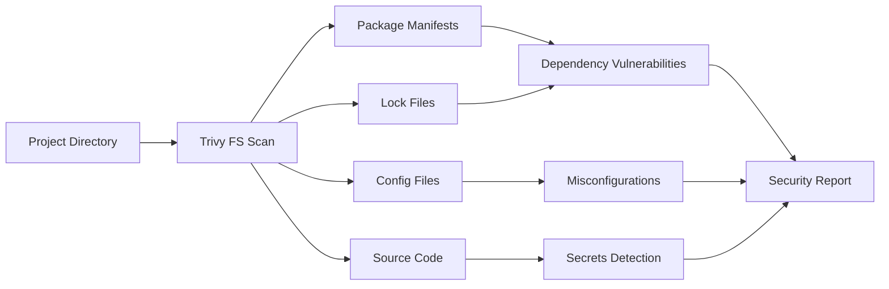
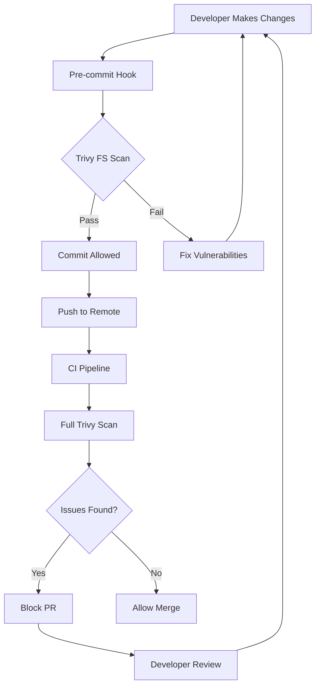

# How to Use Trivy for Filesystem Scanning

Author: [nawazdhandala](https://www.github.com/nawazdhandala)

Tags: Trivy, Security, Filesystem Scanning, DevSecOps, Vulnerability Scanning, Code Security

Description: Learn how to use Trivy to scan local filesystems and project directories for vulnerabilities in dependencies and misconfigurations.

---

> Container scanning is great, but what about your source code before it becomes an image? Trivy filesystem scanning analyzes your project directories directly, catching vulnerabilities in dependencies before you build.

Shift-left security means finding issues early. Filesystem scanning lets developers check their code for vulnerable dependencies on their local machine, before committing or building images.

---

## What is Filesystem Scanning?

Filesystem scanning analyzes a directory to find:

- Vulnerable dependencies in package manifests (package.json, requirements.txt, go.mod, etc.)
- Misconfigurations in IaC files (Terraform, Kubernetes YAML, Dockerfiles)
- Secrets accidentally committed to the repository
- License compliance issues



---

## Basic Filesystem Scanning

### Scan Current Directory

```bash
# Scan the current directory
trivy fs .

# Scan a specific directory
trivy fs /path/to/project

# Scan with specific severity threshold
trivy fs --severity CRITICAL,HIGH .
```

### Scan Output Example

```bash
$ trivy fs ./my-node-project/

package-lock.json (npm)
=======================
Total: 12 (CRITICAL: 2, HIGH: 4, MEDIUM: 6)

+---------------------+------------------+----------+-------------------+---------------+
|      LIBRARY        | VULNERABILITY ID | SEVERITY | INSTALLED VERSION | FIXED VERSION |
+---------------------+------------------+----------+-------------------+---------------+
| lodash              | CVE-2021-23337   | CRITICAL | 4.17.15           | 4.17.21       |
| axios               | CVE-2021-3749    | HIGH     | 0.21.0            | 0.21.2        |
| minimist            | CVE-2021-44906   | CRITICAL | 1.2.5             | 1.2.6         |
+---------------------+------------------+----------+-------------------+---------------+

Dockerfile (dockerfile)
=======================
Tests: 8 (SUCCESSES: 5, FAILURES: 3)

MEDIUM: Specify version for base image
────────────────────────────────────────
 Dockerfile:1
────────────────────────────────────────
   1 │ FROM node:latest
────────────────────────────────────────
```

---

## Scanning Different Project Types

### Node.js Projects

Trivy scans package.json and lock files for npm vulnerabilities.

```bash
# Scan Node.js project
trivy fs ./nodejs-app/

# Files detected:
# - package.json
# - package-lock.json
# - yarn.lock
# - pnpm-lock.yaml
```

Example vulnerable package.json:

```json
{
  "name": "my-app",
  "dependencies": {
    "lodash": "4.17.15",
    "axios": "0.21.0",
    "express": "4.17.1"
  }
}
```

### Python Projects

```bash
# Scan Python project
trivy fs ./python-app/

# Files detected:
# - requirements.txt
# - Pipfile.lock
# - poetry.lock
# - setup.py
```

Example vulnerable requirements.txt:

```text
# requirements.txt
Django==2.2.0
requests==2.25.0
PyYAML==5.3
```

### Go Projects

```bash
# Scan Go project
trivy fs ./go-app/

# Files detected:
# - go.mod
# - go.sum
```

### Java Projects

```bash
# Scan Java project
trivy fs ./java-app/

# Files detected:
# - pom.xml
# - build.gradle
# - gradle.lockfile
```

### Ruby Projects

```bash
# Scan Ruby project
trivy fs ./ruby-app/

# Files detected:
# - Gemfile.lock
# - .gemspec files
```

---

## Comprehensive Scanning

### Scan for Everything

```bash
# Scan for vulnerabilities, misconfigurations, and secrets
trivy fs --scanners vuln,misconfig,secret .
```

### Individual Scanner Options

```bash
# Vulnerabilities only (default)
trivy fs --scanners vuln .

# Misconfigurations only (Terraform, K8s, Dockerfile)
trivy fs --scanners misconfig .

# Secrets detection only
trivy fs --scanners secret .

# License scanning
trivy fs --scanners license .
```

---

## Filtering and Exclusions

### Skip Directories

```bash
# Skip common directories that slow down scanning
trivy fs --skip-dirs node_modules,vendor,.git .

# Skip test directories
trivy fs --skip-dirs "**/test/**,**/tests/**,**/__tests__/**" .
```

### Skip Files

```bash
# Skip specific files
trivy fs --skip-files "*.test.js,*.spec.ts" .

# Skip lock files (scan manifests only)
trivy fs --skip-files "**/package-lock.json,**/yarn.lock" .
```

### Configuration File

```yaml
# trivy.yaml
# Filesystem scanning configuration

scan:
  # Scanners to enable
  scanners:
    - vuln
    - misconfig
    - secret

# Directories to skip
skip-dirs:
  - node_modules
  - vendor
  - .git
  - dist
  - build

# Files to skip
skip-files:
  - "**/*.test.js"
  - "**/*.spec.ts"
  - "**/test/**"

# Severity filter
severity:
  - CRITICAL
  - HIGH
  - MEDIUM
```

Run with configuration:

```bash
trivy fs --config trivy.yaml .
```

---

## CI/CD Integration

### GitHub Actions

```yaml
# .github/workflows/security.yaml
name: Security Scan

on:
  push:
    branches: [main]
  pull_request:
    branches: [main]

jobs:
  trivy-fs-scan:
    runs-on: ubuntu-latest
    steps:
      - name: Checkout code
        uses: actions/checkout@v4

      - name: Run Trivy filesystem scan
        uses: aquasecurity/trivy-action@master
        with:
          scan-type: 'fs'
          scan-ref: '.'
          severity: 'CRITICAL,HIGH'
          exit-code: '1'

      - name: Run Trivy for misconfigurations
        uses: aquasecurity/trivy-action@master
        with:
          scan-type: 'config'
          scan-ref: '.'
          severity: 'CRITICAL,HIGH'
          exit-code: '1'
```

### Pre-commit Hook

```yaml
# .pre-commit-config.yaml
repos:
  - repo: local
    hooks:
      - id: trivy-fs
        name: Trivy Filesystem Scan
        entry: trivy fs --severity CRITICAL,HIGH --exit-code 1 .
        language: system
        pass_filenames: false
        stages: [commit]
```

Install and use:

```bash
pip install pre-commit
pre-commit install
# Now trivy runs before each commit
```

### Makefile Integration

```makefile
# Makefile
.PHONY: security scan-deps scan-config scan-secrets

# Run all security scans
security: scan-deps scan-config scan-secrets

# Scan dependencies for vulnerabilities
scan-deps:
	trivy fs --scanners vuln --severity CRITICAL,HIGH .

# Scan configuration files
scan-config:
	trivy fs --scanners misconfig --severity CRITICAL,HIGH .

# Scan for secrets
scan-secrets:
	trivy fs --scanners secret .

# Quick scan (critical only)
scan-quick:
	trivy fs --severity CRITICAL --exit-code 1 .
```

---

## Scanning Workflow



---

## Output Formats

### Table Format (Default)

```bash
trivy fs --format table .
```

### JSON Format

```bash
# JSON output for processing
trivy fs --format json --output results.json .

# Parse with jq
cat results.json | jq '.Results[].Vulnerabilities[] | {id: .VulnerabilityID, pkg: .PkgName, severity: .Severity}'
```

### SARIF Format (GitHub Security)

```bash
# Generate SARIF for GitHub Security tab
trivy fs --format sarif --output results.sarif .
```

### Custom Template

```bash
# Use custom template
trivy fs --format template --template "@contrib/html.tpl" --output report.html .
```

---

## Secrets Detection

Trivy can find accidentally committed secrets.

```bash
# Enable secret scanning
trivy fs --scanners secret .
```

### Example Findings

```bash
$ trivy fs --scanners secret ./project/

config/database.yml (secrets)
=============================
Total: 2 (CRITICAL: 2)

+----------+----------------------------+----------+
| CATEGORY |         DESCRIPTION        | SEVERITY |
+----------+----------------------------+----------+
| AWS      | AWS Access Key ID          | CRITICAL |
| Generic  | Private Key                | CRITICAL |
+----------+----------------------------+----------+
```

### Custom Secret Patterns

```yaml
# trivy-secret.yaml
# Custom secret detection rules

rules:
  - id: custom-api-key
    category: CustomSecrets
    title: Custom API Key
    severity: HIGH
    regex: 'MYCOMPANY_API_KEY[=:]\s*["\']?([A-Za-z0-9]{32})["\']?'

  - id: internal-token
    category: CustomSecrets
    title: Internal Service Token
    severity: CRITICAL
    regex: 'INTERNAL_TOKEN[=:]\s*["\']?([A-Za-z0-9-]{36})["\']?'
```

Run with custom rules:

```bash
trivy fs --scanners secret --secret-config trivy-secret.yaml .
```

---

## License Scanning

Check dependencies for license compliance.

```bash
# Enable license scanning
trivy fs --scanners license .

# Output shows licenses per package
trivy fs --scanners license --format json . | jq '.Results[].Licenses'
```

### License Policy

```yaml
# trivy.yaml
# License policy configuration

license:
  # Forbidden licenses (fail scan if found)
  forbidden:
    - GPL-3.0
    - AGPL-3.0

  # Restricted licenses (warning)
  restricted:
    - LGPL-2.1
    - MPL-2.0
```

---

## Scanning Monorepos

For large monorepos, scan specific subdirectories.

```bash
# Scan specific service
trivy fs ./services/api/

# Scan multiple services
for service in services/*/; do
    echo "Scanning $service"
    trivy fs --severity CRITICAL,HIGH "$service"
done
```

### Parallel Scanning

```bash
#!/bin/bash
# scan-monorepo.sh
# Parallel scanning for monorepos

SERVICES=$(ls -d services/*/)
MAX_PARALLEL=4

echo "$SERVICES" | xargs -P $MAX_PARALLEL -I {} \
    trivy fs --severity CRITICAL,HIGH --exit-code 0 {}
```

---

## Best Practices

1. **Scan Early**: Run filesystem scans before building images

2. **Use Lock Files**: Lock files provide accurate version information for scanning

3. **Exclude Build Artifacts**: Skip node_modules, vendor, dist directories

4. **Integrate Pre-commit**: Catch issues before they enter version control

5. **Different Thresholds**: Use CRITICAL only for pre-commit, full scan in CI

6. **Cache Database**: Pre-download Trivy database to speed up scans

---

## Troubleshooting

### Slow Scans

```bash
# Skip large directories
trivy fs --skip-dirs node_modules,vendor,.git .

# Use timeout
trivy fs --timeout 10m .
```

### Missing Vulnerabilities

```bash
# Ensure lock files exist - they provide accurate versions
npm install  # Creates package-lock.json
pip freeze > requirements.txt  # Creates pinned requirements

# Update Trivy database
trivy fs --reset .
```

### False Positives

```bash
# Create ignore file
echo "CVE-2023-12345" >> .trivyignore

# Run with ignore file
trivy fs --ignorefile .trivyignore .
```

---

## Conclusion

Filesystem scanning with Trivy brings security checks to the earliest point in your development workflow. By scanning project directories before building images, you catch vulnerable dependencies when they are easiest to fix.

Start with pre-commit hooks for immediate feedback. Add CI/CD integration for comprehensive checks. Use the various scanners to catch vulnerabilities, misconfigurations, and secrets before they reach production.

---

*Monitor your application security posture with [OneUptime](https://oneuptime.com). Get alerts when new vulnerabilities are discovered in your dependencies.*

**Related Reading:**
- [How to Implement Trivy for IaC Scanning](https://oneuptime.com/blog/post/2026-01-28-trivy-iac-scanning/view)
- [How to Debug Trivy Scanning Issues](https://oneuptime.com/blog/post/2026-01-28-trivy-debug-scanning-issues/view)
