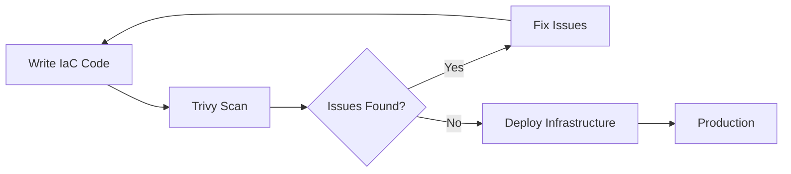
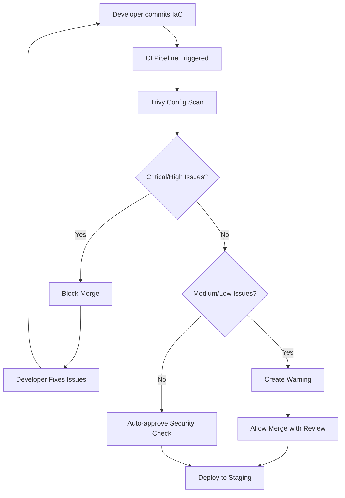

# How to Implement Trivy for IaC Scanning

Author: [nawazdhandala](https://www.github.com/nawazdhandala)

Tags: Trivy, Security, IaC, Terraform, Kubernetes, DevSecOps, Infrastructure as Code

Description: Learn how to use Trivy to scan your Infrastructure as Code files for security misconfigurations and vulnerabilities before deployment.

---

> Infrastructure as Code files define your cloud resources, but they can also define security holes. Trivy scans Terraform, CloudFormation, Kubernetes manifests, and more to catch misconfigurations before they reach production.

Security scanning should happen early in your development cycle. By integrating Trivy into your IaC workflow, you can identify issues when they are cheapest to fix - before deployment.

---

## What is IaC Scanning?

Infrastructure as Code scanning analyzes your configuration files to find security issues, compliance violations, and best practice deviations. Unlike runtime security tools, IaC scanners work on the source files themselves.



---

## Installing Trivy

Before scanning, install Trivy on your system. Choose the method that matches your environment.

### macOS

```bash
# Install via Homebrew
brew install trivy
```

### Linux

```bash
# Install via apt (Debian/Ubuntu)
sudo apt-get install wget apt-transport-https gnupg lsb-release
wget -qO - https://aquasecurity.github.io/trivy-repo/deb/public.key | sudo apt-key add -
echo deb https://aquasecurity.github.io/trivy-repo/deb $(lsb_release -sc) main | sudo tee -a /etc/apt/sources.list.d/trivy.list
sudo apt-get update
sudo apt-get install trivy
```

### Docker

```bash
# Run Trivy as a container
docker pull aquasec/trivy:latest
```

---

## Scanning Terraform Files

Terraform is one of the most common IaC tools. Trivy can scan both individual files and entire directories.

### Basic Terraform Scan

```bash
# Scan a directory containing Terraform files
trivy config ./terraform/

# Scan a specific file
trivy config main.tf
```

### Example Terraform File with Issues

```hcl
# main.tf - Example with security issues that Trivy will catch

# Issue: S3 bucket without encryption
resource "aws_s3_bucket" "data" {
  bucket = "my-application-data"
  acl    = "public-read"  # Trivy flags this - public access is risky
}

# Issue: Security group with overly permissive ingress
resource "aws_security_group" "web" {
  name = "web-server"

  ingress {
    from_port   = 0
    to_port     = 0
    protocol    = "-1"
    cidr_blocks = ["0.0.0.0/0"]  # Trivy flags this - allows all traffic
  }
}

# Issue: RDS instance without encryption
resource "aws_db_instance" "database" {
  allocated_storage = 20
  engine           = "mysql"
  instance_class   = "db.t3.micro"
  # Missing: storage_encrypted = true
}
```

### Trivy Output

```bash
$ trivy config ./terraform/

main.tf (terraform)
===================
Tests: 15 (SUCCESSES: 12, FAILURES: 3)
Failures: 3

MEDIUM: S3 bucket has public access enabled
════════════════════════════════════════════
S3 buckets should not be publicly accessible.

See https://avd.aquasec.com/misconfig/avd-aws-0086

────────────────────────────────────────────
 main.tf:5
────────────────────────────────────────────
   3 │ resource "aws_s3_bucket" "data" {
   4 │   bucket = "my-application-data"
   5 │   acl    = "public-read"
────────────────────────────────────────────
```

---

## Scanning Kubernetes Manifests

Trivy excels at scanning Kubernetes YAML files for security misconfigurations.

### Basic Kubernetes Scan

```bash
# Scan a directory of Kubernetes manifests
trivy config ./k8s/

# Scan a specific manifest
trivy config deployment.yaml
```

### Example Kubernetes Deployment with Issues

```yaml
# deployment.yaml - Example with security issues

apiVersion: apps/v1
kind: Deployment
metadata:
  name: web-app
spec:
  replicas: 3
  selector:
    matchLabels:
      app: web-app
  template:
    metadata:
      labels:
        app: web-app
    spec:
      containers:
      - name: web
        image: nginx:latest  # Trivy flags: avoid 'latest' tag
        securityContext:
          privileged: true   # Trivy flags: privileged containers are risky
          runAsRoot: true    # Trivy flags: running as root is dangerous
        ports:
        - containerPort: 80
```

### Secure Kubernetes Deployment

```yaml
# deployment-secure.yaml - Fixed version

apiVersion: apps/v1
kind: Deployment
metadata:
  name: web-app
spec:
  replicas: 3
  selector:
    matchLabels:
      app: web-app
  template:
    metadata:
      labels:
        app: web-app
    spec:
      securityContext:
        runAsNonRoot: true       # Enforce non-root user
        seccompProfile:
          type: RuntimeDefault   # Enable seccomp
      containers:
      - name: web
        image: nginx:1.25.3      # Use specific version tag
        securityContext:
          privileged: false      # Never run privileged
          allowPrivilegeEscalation: false
          readOnlyRootFilesystem: true
          capabilities:
            drop:
              - ALL              # Drop all capabilities
        ports:
        - containerPort: 80
        resources:               # Set resource limits
          limits:
            memory: "128Mi"
            cpu: "500m"
```

---

## Scanning Helm Charts

Helm charts can be scanned by pointing Trivy at the chart directory.

```bash
# Scan a Helm chart
trivy config ./charts/my-app/

# Scan with values file
helm template my-app ./charts/my-app/ -f values.yaml | trivy config -
```

---

## Scanning CloudFormation Templates

Trivy supports AWS CloudFormation templates in both JSON and YAML formats.

```bash
# Scan CloudFormation template
trivy config cloudformation.yaml
```

### Example CloudFormation with Issues

```yaml
# cloudformation.yaml
AWSTemplateFormatVersion: '2010-09-09'
Resources:
  MyBucket:
    Type: AWS::S3::Bucket
    Properties:
      BucketName: my-application-bucket
      # Missing: BucketEncryption configuration
      # Missing: PublicAccessBlockConfiguration

  MySecurityGroup:
    Type: AWS::EC2::SecurityGroup
    Properties:
      GroupDescription: Web server security group
      SecurityGroupIngress:
        - IpProtocol: tcp
          FromPort: 22
          ToPort: 22
          CidrIp: 0.0.0.0/0  # Trivy flags: SSH open to world
```

---

## CI/CD Integration

Integrate Trivy IaC scanning into your CI/CD pipeline to catch issues before merge.

### GitHub Actions

```yaml
# .github/workflows/iac-security.yaml
name: IaC Security Scan

on:
  pull_request:
    paths:
      - 'terraform/**'
      - 'k8s/**'
      - 'cloudformation/**'

jobs:
  trivy-scan:
    runs-on: ubuntu-latest
    steps:
      - name: Checkout code
        uses: actions/checkout@v4

      - name: Run Trivy IaC scan
        uses: aquasecurity/trivy-action@master
        with:
          scan-type: 'config'
          scan-ref: '.'
          severity: 'CRITICAL,HIGH'
          exit-code: '1'  # Fail the build on findings
          format: 'table'

      - name: Upload Trivy results
        uses: github/codeql-action/upload-sarif@v3
        if: always()
        with:
          sarif_file: 'trivy-results.sarif'
```

### GitLab CI

```yaml
# .gitlab-ci.yml
stages:
  - security

trivy-iac-scan:
  stage: security
  image:
    name: aquasec/trivy:latest
    entrypoint: [""]
  script:
    - trivy config --exit-code 1 --severity HIGH,CRITICAL ./
  rules:
    - changes:
        - terraform/**/*
        - k8s/**/*
```

---

## Configuration File

Create a Trivy configuration file to standardize scanning across your team.

```yaml
# trivy.yaml
# Trivy configuration for IaC scanning

# Severity levels to report
severity:
  - CRITICAL
  - HIGH
  - MEDIUM

# Exit code when vulnerabilities are found
exit-code: 1

# Output format
format: table

# Misconfiguration scanning options
misconfiguration:
  # File patterns to scan
  include-non-failures: false

  # Skip specific checks by ID
  skip-checks:
    - AVD-KSV-0001  # Skip specific check if needed

# Ignore unfixed vulnerabilities
ignore-unfixed: true
```

Run Trivy with the configuration file:

```bash
trivy config --config trivy.yaml ./terraform/
```

---

## Scanning Workflow



---

## Custom Policies with Rego

Trivy supports custom policies written in Rego for organization-specific requirements.

```rego
# policy/custom-checks.rego
# Custom policy: Require specific tags on all resources

package custom.terraform.required_tags

import future.keywords.in

deny[msg] {
    resource := input.resource[_]
    not resource.tags.environment
    msg := sprintf("Resource %s is missing required 'environment' tag", [resource.name])
}

deny[msg] {
    resource := input.resource[_]
    not resource.tags.owner
    msg := sprintf("Resource %s is missing required 'owner' tag", [resource.name])
}
```

Run Trivy with custom policies:

```bash
trivy config --policy ./policy/ --namespaces custom ./terraform/
```

---

## Output Formats

Trivy supports multiple output formats for different use cases.

```bash
# Table format for human reading
trivy config --format table ./terraform/

# JSON format for programmatic processing
trivy config --format json --output results.json ./terraform/

# SARIF format for GitHub Security tab
trivy config --format sarif --output results.sarif ./terraform/

# JUnit format for CI systems
trivy config --format template --template "@contrib/junit.tpl" ./terraform/
```

---

## Best Practices

1. **Scan Early**: Run Trivy in pre-commit hooks for immediate feedback
2. **Block Critical Issues**: Configure CI to fail on CRITICAL and HIGH severity findings
3. **Version Pin**: Use specific image tags and module versions, not 'latest'
4. **Least Privilege**: Always follow the principle of least privilege in security groups and IAM
5. **Encrypt Everything**: Enable encryption for storage, databases, and data in transit
6. **Document Exceptions**: When skipping checks, document the business justification

---

## Conclusion

IaC scanning with Trivy catches security misconfigurations before they reach production. By integrating Trivy into your development workflow and CI/CD pipeline, you create a security gate that prevents insecure infrastructure from being deployed.

Start with the basics - scan your Terraform and Kubernetes files locally. Then integrate into CI/CD to make security scanning automatic. Your infrastructure will be more secure, and your team will learn secure patterns through the immediate feedback.

---

*Want to monitor the security of your deployed infrastructure? [OneUptime](https://oneuptime.com) provides comprehensive monitoring and alerting for your cloud resources.*

**Related Reading:**
- [How to Configure Trivy Severity Filtering](https://oneuptime.com/blog/post/2026-01-28-trivy-severity-filtering/view)
- [How to Debug Trivy Scanning Issues](https://oneuptime.com/blog/post/2026-01-28-trivy-debug-scanning-issues/view)
