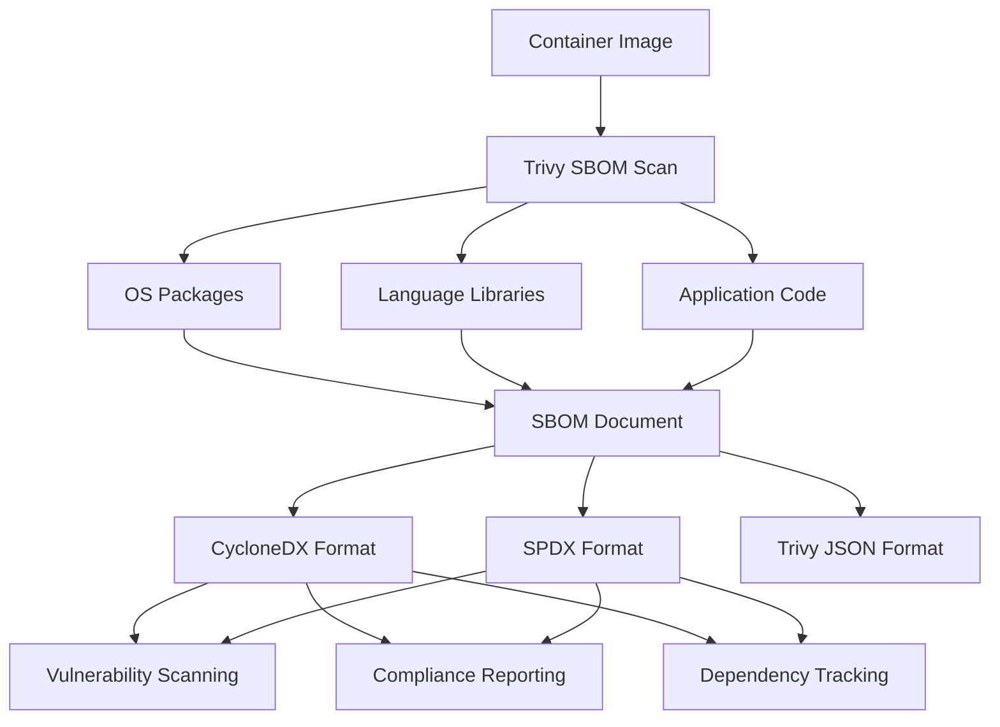
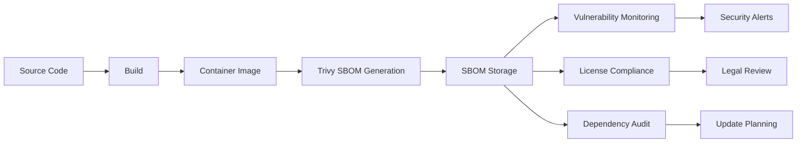

# How to Implement Trivy SBOM Generation

Author: [nawazdhandala](https://www.github.com/nawazdhandala)

Tags: Trivy, SBOM, Security, Software Supply Chain, CycloneDX, SPDX, DevSecOps

Description: Learn how to generate Software Bill of Materials using Trivy for complete visibility into your application dependencies.

---

> A Software Bill of Materials (SBOM) is a complete inventory of components in your software. Trivy can generate SBOMs in industry-standard formats, helping you track dependencies, respond to vulnerabilities, and meet compliance requirements.

When Log4Shell hit, organizations with SBOMs could quickly identify affected systems. Those without spent weeks manually auditing codebases. SBOM generation is no longer optional - it is essential for modern software supply chain security.

---

## What is an SBOM?

An SBOM lists every component in your software - operating system packages, language libraries, and their versions. Think of it as an ingredients list for your application.



---

## SBOM Formats Supported

Trivy supports three major SBOM formats:

| Format | Use Case | Standard Body |
|--------|----------|---------------|
| CycloneDX | Security-focused, vulnerability tracking | OWASP |
| SPDX | License compliance, legal requirements | Linux Foundation |
| Trivy JSON | Trivy-native format for internal use | Aqua Security |

---

## Generating SBOMs with Trivy

### CycloneDX Format

CycloneDX is ideal for security workflows and vulnerability management.

```bash
# Generate CycloneDX SBOM for a container image
trivy image --format cyclonedx --output sbom.cdx.json nginx:1.25

# Generate CycloneDX for a filesystem
trivy fs --format cyclonedx --output sbom.cdx.json ./my-application/

# Generate CycloneDX for a Git repository
trivy repo --format cyclonedx --output sbom.cdx.json https://github.com/org/repo
```

Example CycloneDX output structure:

```json
{
  "bomFormat": "CycloneDX",
  "specVersion": "1.5",
  "version": 1,
  "metadata": {
    "timestamp": "2026-01-28T10:30:00Z",
    "tools": [
      {
        "vendor": "aquasecurity",
        "name": "trivy",
        "version": "0.50.0"
      }
    ],
    "component": {
      "type": "container",
      "name": "nginx",
      "version": "1.25"
    }
  },
  "components": [
    {
      "type": "library",
      "name": "openssl",
      "version": "3.0.11",
      "purl": "pkg:deb/debian/openssl@3.0.11"
    }
  ]
}
```

### SPDX Format

SPDX is preferred for license compliance and software composition analysis.

```bash
# Generate SPDX SBOM in JSON format
trivy image --format spdx-json --output sbom.spdx.json nginx:1.25

# Generate SPDX SBOM in tag-value format
trivy image --format spdx --output sbom.spdx nginx:1.25
```

Example SPDX output structure:

```json
{
  "spdxVersion": "SPDX-2.3",
  "dataLicense": "CC0-1.0",
  "SPDXID": "SPDXRef-DOCUMENT",
  "name": "nginx-1.25",
  "documentNamespace": "https://aquasecurity.github.io/trivy",
  "creationInfo": {
    "created": "2026-01-28T10:30:00Z",
    "creators": [
      "Tool: trivy-0.50.0"
    ]
  },
  "packages": [
    {
      "SPDXID": "SPDXRef-Package-openssl",
      "name": "openssl",
      "versionInfo": "3.0.11",
      "downloadLocation": "NOASSERTION"
    }
  ]
}
```

---

## Scanning Different Targets

### Container Images

```bash
# Local image
trivy image --format cyclonedx --output sbom.json myapp:latest

# Remote image from registry
trivy image --format cyclonedx --output sbom.json gcr.io/project/image:tag

# Image from tarball
trivy image --format cyclonedx --output sbom.json --input image.tar
```

### Filesystem Directories

```bash
# Scan application directory
trivy fs --format cyclonedx --output sbom.json ./src/

# Scan with specific file patterns
trivy fs --format cyclonedx --output sbom.json \
  --skip-dirs node_modules \
  --skip-files "*.test.js" \
  ./
```

### Git Repositories

```bash
# Public repository
trivy repo --format cyclonedx --output sbom.json https://github.com/org/repo

# Specific branch
trivy repo --format cyclonedx --output sbom.json \
  --branch main \
  https://github.com/org/repo

# Private repository with token
GITHUB_TOKEN=your_token trivy repo --format cyclonedx --output sbom.json \
  https://github.com/org/private-repo
```

---

## CI/CD Integration

### GitHub Actions

```yaml
# .github/workflows/sbom.yaml
name: Generate SBOM

on:
  push:
    branches: [main]
  release:
    types: [published]

jobs:
  sbom:
    runs-on: ubuntu-latest
    steps:
      - name: Checkout
        uses: actions/checkout@v4

      - name: Build image
        run: docker build -t myapp:${{ github.sha }} .

      - name: Generate SBOM
        uses: aquasecurity/trivy-action@master
        with:
          image-ref: 'myapp:${{ github.sha }}'
          format: 'cyclonedx'
          output: 'sbom.cdx.json'

      - name: Upload SBOM as artifact
        uses: actions/upload-artifact@v4
        with:
          name: sbom
          path: sbom.cdx.json

      - name: Attach SBOM to release
        if: github.event_name == 'release'
        uses: softprops/action-gh-release@v1
        with:
          files: sbom.cdx.json
```

### GitLab CI

```yaml
# .gitlab-ci.yml
stages:
  - build
  - sbom

variables:
  IMAGE_TAG: $CI_REGISTRY_IMAGE:$CI_COMMIT_SHA

build:
  stage: build
  script:
    - docker build -t $IMAGE_TAG .
    - docker push $IMAGE_TAG

generate-sbom:
  stage: sbom
  image: aquasec/trivy:latest
  script:
    - trivy image --format cyclonedx --output sbom.cdx.json $IMAGE_TAG
    - trivy image --format spdx-json --output sbom.spdx.json $IMAGE_TAG
  artifacts:
    paths:
      - sbom.cdx.json
      - sbom.spdx.json
    expire_in: 1 year
```

---

## SBOM Workflow



---

## Scanning SBOMs for Vulnerabilities

Once you have an SBOM, you can scan it for vulnerabilities without access to the original image.

```bash
# Generate SBOM
trivy image --format cyclonedx --output sbom.cdx.json nginx:1.25

# Later: scan the SBOM for new vulnerabilities
trivy sbom sbom.cdx.json

# Scan with severity filtering
trivy sbom --severity CRITICAL,HIGH sbom.cdx.json

# Output vulnerability results as JSON
trivy sbom --format json --output vulns.json sbom.cdx.json
```

This is useful for:
- Continuous monitoring of shipped software
- Scanning without rebuilding images
- Sharing scan capabilities with teams that do not have image access

---

## Converting Between Formats

Convert SBOMs between formats using Trivy's SBOM scanning capability.

```bash
# Convert CycloneDX to SPDX
trivy sbom --format spdx-json --output sbom.spdx.json sbom.cdx.json

# Convert SPDX to CycloneDX
trivy sbom --format cyclonedx --output sbom.cdx.json sbom.spdx.json
```

---

## SBOM Storage and Management

### Store SBOMs with Images

```bash
# Using cosign to attach SBOM to image
cosign attach sbom --sbom sbom.cdx.json myregistry.io/myapp:v1.0.0

# Verify SBOM attachment
cosign verify-attestation --type cyclonedx myregistry.io/myapp:v1.0.0
```

### Store in OCI Registry

```bash
# Push SBOM as OCI artifact
oras push myregistry.io/myapp:v1.0.0-sbom \
  sbom.cdx.json:application/vnd.cyclonedx+json

# Pull SBOM later
oras pull myregistry.io/myapp:v1.0.0-sbom
```

### Database Storage

```python
# sbom_store.py
# Store SBOM in database for tracking
import json
import hashlib
from datetime import datetime

def store_sbom(sbom_path: str, image_name: str, db_connection):
    """Store SBOM with metadata for later retrieval"""
    with open(sbom_path, 'r') as f:
        sbom_data = json.load(f)

    # Calculate SBOM hash for deduplication
    sbom_hash = hashlib.sha256(
        json.dumps(sbom_data, sort_keys=True).encode()
    ).hexdigest()

    # Extract component count
    component_count = len(sbom_data.get('components', []))

    # Store in database
    db_connection.execute("""
        INSERT INTO sboms (
            image_name,
            sbom_hash,
            component_count,
            created_at,
            sbom_data
        ) VALUES (?, ?, ?, ?, ?)
    """, (
        image_name,
        sbom_hash,
        component_count,
        datetime.utcnow().isoformat(),
        json.dumps(sbom_data)
    ))

    return sbom_hash
```

---

## Compliance and Reporting

### Executive Order 14028 Compliance

US Executive Order 14028 requires SBOMs for software sold to the federal government.

```bash
# Generate compliant SBOM with required fields
trivy image --format spdx-json \
  --output sbom-compliant.spdx.json \
  myapp:v1.0.0

# Verify required SPDX fields are present
jq '.packages[] | {name, versionInfo, supplier, downloadLocation}' sbom-compliant.spdx.json
```

### NTIA Minimum Elements

The NTIA defines minimum elements for SBOMs:

```bash
# Validate SBOM has required elements
cat sbom.cdx.json | jq '
{
  supplier: .metadata.supplier,
  component_name: .metadata.component.name,
  version: .metadata.component.version,
  unique_identifiers: [.components[].purl],
  dependency_relationships: .dependencies,
  author: .metadata.authors,
  timestamp: .metadata.timestamp
}
'
```

---

## Automating SBOM Updates

Create a scheduled job to regenerate SBOMs and check for new vulnerabilities.

```yaml
# .github/workflows/sbom-monitor.yaml
name: SBOM Monitor

on:
  schedule:
    - cron: '0 6 * * *'  # Daily at 6 AM

jobs:
  monitor:
    runs-on: ubuntu-latest
    strategy:
      matrix:
        image:
          - myapp:production
          - myapp:staging
    steps:
      - name: Pull image
        run: docker pull ${{ matrix.image }}

      - name: Generate fresh SBOM
        run: |
          trivy image --format cyclonedx \
            --output sbom-${{ matrix.image }}.json \
            ${{ matrix.image }}

      - name: Scan for new vulnerabilities
        run: |
          trivy sbom --severity CRITICAL,HIGH \
            --exit-code 1 \
            sbom-${{ matrix.image }}.json
        continue-on-error: true

      - name: Notify on new vulnerabilities
        if: failure()
        uses: slackapi/slack-github-action@v1
        with:
          payload: |
            {
              "text": "New vulnerabilities found in ${{ matrix.image }}"
            }
```

---

## Best Practices

1. **Generate at Build Time**: Create SBOMs during CI/CD, not as an afterthought

2. **Store with Artifacts**: Keep SBOMs alongside images in your registry

3. **Version Your SBOMs**: Use consistent naming that links SBOMs to specific releases

4. **Automate Monitoring**: Regularly rescan SBOMs for newly discovered vulnerabilities

5. **Use Standard Formats**: CycloneDX or SPDX ensure interoperability with other tools

6. **Include in Releases**: Attach SBOMs to GitHub/GitLab releases for customer access

---

## Conclusion

SBOM generation with Trivy provides complete visibility into your software components. By generating SBOMs at build time and continuously monitoring them for vulnerabilities, you can respond quickly when new security issues are discovered.

Start by adding SBOM generation to your CI/CD pipeline. Store the SBOMs with your release artifacts. Then set up automated scanning to catch new vulnerabilities in already-shipped software.

---

*Track your software supply chain security with [OneUptime](https://oneuptime.com). Monitor your applications and get alerted when dependencies have known vulnerabilities.*

**Related Reading:**
- [How to Configure Trivy DB Updates](https://oneuptime.com/blog/post/2026-01-28-trivy-db-updates/view)
- [How to Use Trivy for Filesystem Scanning](https://oneuptime.com/blog/post/2026-01-28-trivy-filesystem-scanning/view)
