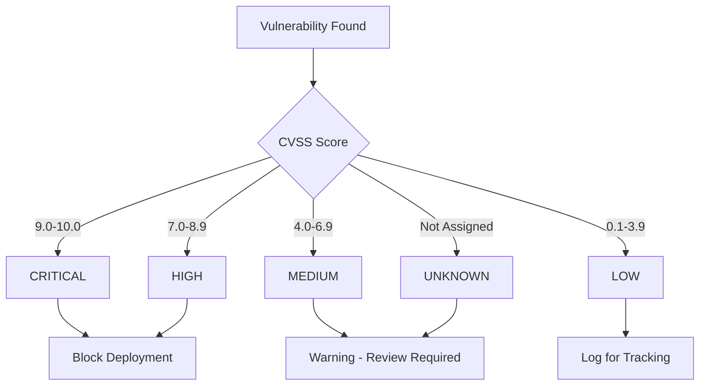
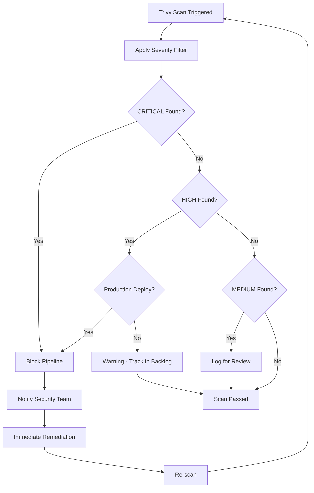

# How to Configure Trivy Severity Filtering

Author: [nawazdhandala](https://www.github.com/nawazdhandala)

Tags: Trivy, Security, Vulnerability Management, DevSecOps, CI/CD, Filtering

Description: Learn how to configure Trivy severity filtering to focus on the vulnerabilities that matter most to your organization.

---

> Not all vulnerabilities are created equal. Trivy's severity filtering lets you focus on critical issues first, customize thresholds for different environments, and avoid alert fatigue from low-priority findings.

Security scanning without filtering creates noise. Teams get overwhelmed by hundreds of LOW severity findings while CRITICAL vulnerabilities slip through. Proper severity configuration ensures you fix what matters.

---

## Understanding Severity Levels

Trivy uses five severity levels based on CVSS scores and vulnerability databases.

| Severity | CVSS Score | Description |
|----------|------------|-------------|
| CRITICAL | 9.0 - 10.0 | Immediate action required - active exploits likely |
| HIGH | 7.0 - 8.9 | Serious vulnerability - prioritize fixing |
| MEDIUM | 4.0 - 6.9 | Moderate risk - plan to fix |
| LOW | 0.1 - 3.9 | Minor risk - fix when convenient |
| UNKNOWN | N/A | Severity not yet assigned |



---

## Basic Severity Filtering

### Command Line Filtering

The `--severity` flag filters which vulnerabilities appear in results.

```bash
# Show only CRITICAL vulnerabilities
trivy image --severity CRITICAL nginx:latest

# Show CRITICAL and HIGH
trivy image --severity CRITICAL,HIGH nginx:latest

# Show everything except LOW
trivy image --severity CRITICAL,HIGH,MEDIUM nginx:latest

# Include UNKNOWN severity (unrated vulnerabilities)
trivy image --severity CRITICAL,HIGH,MEDIUM,UNKNOWN nginx:latest
```

### Exit Code Configuration

Combine severity filtering with exit codes to fail CI/CD pipelines appropriately.

```bash
# Exit with code 1 only if CRITICAL or HIGH found
trivy image --severity CRITICAL,HIGH --exit-code 1 nginx:latest

# Different exit codes for different scenarios
# Exit 0: No vulnerabilities at specified severity
# Exit 1: Vulnerabilities found at specified severity
```

---

## Configuration File Setup

Create a Trivy configuration file for consistent severity settings across your team.

```yaml
# trivy.yaml
# Standard severity configuration

# Report these severity levels
severity:
  - CRITICAL
  - HIGH
  - MEDIUM

# Exit with error code 1 when findings exist
exit-code: 1

# Output format
format: table

# Ignore vulnerabilities without fixes available
ignore-unfixed: false

# Timeout for scanning operations
timeout: 10m

# Cache directory location
cache-dir: /tmp/trivy-cache
```

Run Trivy with the configuration:

```bash
trivy image --config trivy.yaml nginx:latest
```

---

## Environment-Specific Filtering

Different environments have different risk tolerances. Configure severity thresholds accordingly.

### Development Environment

```yaml
# trivy-dev.yaml
# Lenient settings for development

severity:
  - CRITICAL    # Only block on critical issues

exit-code: 1

# Allow unfixed vulnerabilities in dev
ignore-unfixed: true

# Faster scans, less thorough
timeout: 5m
```

### Staging Environment

```yaml
# trivy-staging.yaml
# Moderate settings for staging

severity:
  - CRITICAL
  - HIGH

exit-code: 1

# Report unfixed but don't fail
ignore-unfixed: false

timeout: 10m
```

### Production Environment

```yaml
# trivy-prod.yaml
# Strict settings for production

severity:
  - CRITICAL
  - HIGH
  - MEDIUM

exit-code: 1

# All vulnerabilities matter in prod
ignore-unfixed: false

# Thorough scanning
timeout: 15m
```

### Usage in CI/CD

```bash
# Determine environment and use appropriate config
if [ "$ENVIRONMENT" = "production" ]; then
    trivy image --config trivy-prod.yaml $IMAGE
elif [ "$ENVIRONMENT" = "staging" ]; then
    trivy image --config trivy-staging.yaml $IMAGE
else
    trivy image --config trivy-dev.yaml $IMAGE
fi
```

---

## CI/CD Pipeline Integration

### GitHub Actions with Severity Filtering

```yaml
# .github/workflows/security.yaml
name: Security Scan

on:
  push:
    branches: [main]
  pull_request:
    branches: [main]

jobs:
  trivy-scan:
    runs-on: ubuntu-latest
    steps:
      - name: Checkout
        uses: actions/checkout@v4

      - name: Build image
        run: docker build -t myapp:${{ github.sha }} .

      - name: Trivy scan (Critical only - must pass)
        uses: aquasecurity/trivy-action@master
        with:
          image-ref: 'myapp:${{ github.sha }}'
          severity: 'CRITICAL'
          exit-code: '1'
          format: 'table'

      - name: Trivy scan (All severities - informational)
        uses: aquasecurity/trivy-action@master
        if: always()  # Run even if previous step fails
        with:
          image-ref: 'myapp:${{ github.sha }}'
          severity: 'CRITICAL,HIGH,MEDIUM,LOW'
          exit-code: '0'
          format: 'sarif'
          output: 'trivy-results.sarif'

      - name: Upload to GitHub Security
        uses: github/codeql-action/upload-sarif@v3
        if: always()
        with:
          sarif_file: 'trivy-results.sarif'
```

### GitLab CI with Environment-Based Filtering

```yaml
# .gitlab-ci.yml
stages:
  - build
  - security

variables:
  IMAGE_TAG: $CI_REGISTRY_IMAGE:$CI_COMMIT_SHA

build:
  stage: build
  script:
    - docker build -t $IMAGE_TAG .
    - docker push $IMAGE_TAG

security-dev:
  stage: security
  image: aquasec/trivy:latest
  script:
    - trivy image --severity CRITICAL --exit-code 1 $IMAGE_TAG
  rules:
    - if: $CI_COMMIT_BRANCH != "main"

security-prod:
  stage: security
  image: aquasec/trivy:latest
  script:
    - trivy image --severity CRITICAL,HIGH --exit-code 1 $IMAGE_TAG
  rules:
    - if: $CI_COMMIT_BRANCH == "main"
```

---

## Filtering by Vulnerability Type

Beyond severity, filter by the type of vulnerability.

```bash
# Scan only for OS package vulnerabilities
trivy image --vuln-type os nginx:latest

# Scan only for language-specific vulnerabilities
trivy image --vuln-type library nginx:latest

# Scan for both (default behavior)
trivy image --vuln-type os,library nginx:latest
```

### Combined Filtering

```bash
# Critical OS vulnerabilities only
trivy image --severity CRITICAL --vuln-type os nginx:latest

# High and Critical library vulnerabilities
trivy image --severity CRITICAL,HIGH --vuln-type library python:3.11
```

---

## Ignoring Specific Vulnerabilities

Sometimes you need to ignore specific CVEs. Use the `.trivyignore` file.

```bash
# .trivyignore
# Ignore specific CVEs with comments explaining why

# CVE-2023-12345: False positive in our configuration
CVE-2023-12345

# CVE-2023-67890: Mitigated by network policy - no external access
CVE-2023-67890

# exp:2024-06-01: CVE-2023-11111: Temporary ignore until patch available
# The exp: prefix sets an expiration date
exp:2024-06-01 CVE-2023-11111
```

### Programmatic Ignore File

```yaml
# .trivyignore.yaml
# YAML format for more structured ignores

vulnerabilities:
  - id: CVE-2023-12345
    paths:
      - /usr/lib/python3.11/*
    reason: "False positive - function not used in our code"
    expires: 2024-12-31

  - id: CVE-2023-67890
    reason: "Mitigated by WAF rules"
    expires: 2024-06-30

misconfigurations:
  - id: AVD-KSV-0001
    reason: "Required for legacy application compatibility"
```

Run with ignore file:

```bash
trivy image --ignorefile .trivyignore nginx:latest
trivy image --ignorefile .trivyignore.yaml nginx:latest
```

---

## Severity Workflow



---

## Reporting with Severity

Generate reports filtered by severity for different audiences.

### Executive Summary (Critical Only)

```bash
# Brief report of critical issues for leadership
trivy image --severity CRITICAL --format json nginx:latest | \
  jq '{
    total_critical: [.Results[].Vulnerabilities // [] | .[] | select(.Severity == "CRITICAL")] | length,
    vulnerabilities: [.Results[].Vulnerabilities // [] | .[] | select(.Severity == "CRITICAL") | {id: .VulnerabilityID, package: .PkgName, title: .Title}]
  }'
```

### Technical Report (All Severities)

```bash
# Detailed report for engineering team
trivy image --severity CRITICAL,HIGH,MEDIUM,LOW \
  --format template \
  --template "@contrib/html.tpl" \
  --output security-report.html \
  nginx:latest
```

### Compliance Report

```bash
# SARIF format for compliance tools
trivy image --severity CRITICAL,HIGH,MEDIUM \
  --format sarif \
  --output compliance-report.sarif \
  nginx:latest
```

---

## Custom Severity Thresholds

Create a wrapper script for organization-specific severity rules.

```bash
#!/bin/bash
# trivy-scan.sh - Custom severity scanning with business logic

IMAGE=$1
ENVIRONMENT=${2:-development}

# Define thresholds per environment
case $ENVIRONMENT in
  production)
    BLOCK_ON="CRITICAL,HIGH"
    WARN_ON="MEDIUM"
    ;;
  staging)
    BLOCK_ON="CRITICAL"
    WARN_ON="HIGH,MEDIUM"
    ;;
  *)
    BLOCK_ON="CRITICAL"
    WARN_ON=""
    ;;
esac

# Check for blocking vulnerabilities
echo "Checking for blocking vulnerabilities ($BLOCK_ON)..."
trivy image --severity $BLOCK_ON --exit-code 1 --quiet $IMAGE
BLOCK_EXIT=$?

if [ $BLOCK_EXIT -ne 0 ]; then
  echo "ERROR: Blocking vulnerabilities found!"
  trivy image --severity $BLOCK_ON --format table $IMAGE
  exit 1
fi

# Check for warning vulnerabilities
if [ -n "$WARN_ON" ]; then
  echo "Checking for warning vulnerabilities ($WARN_ON)..."
  trivy image --severity $WARN_ON --exit-code 0 $IMAGE

  # Count warnings
  WARN_COUNT=$(trivy image --severity $WARN_ON --format json $IMAGE | \
    jq '[.Results[].Vulnerabilities // [] | .[]] | length')

  if [ "$WARN_COUNT" -gt 0 ]; then
    echo "WARNING: $WARN_COUNT vulnerabilities found at warning level"
  fi
fi

echo "Security scan passed for $ENVIRONMENT environment"
exit 0
```

---

## Best Practices

1. **Start Strict, Loosen as Needed**: Begin with CRITICAL only, then add HIGH once those are addressed

2. **Document Ignores**: Every ignored CVE should have a documented reason and expiration

3. **Different Environments, Different Thresholds**: Production should be stricter than development

4. **Review UNKNOWN Severity**: Unrated vulnerabilities might be new and serious

5. **Automate Reporting**: Generate severity-filtered reports for different stakeholders

6. **Track Trends**: Monitor vulnerability counts over time, not just pass/fail

---

## Conclusion

Severity filtering transforms Trivy from a noisy scanner into a practical security tool. By configuring appropriate thresholds for each environment and audience, you ensure critical vulnerabilities get immediate attention while maintaining a manageable backlog of lower-priority issues.

Start with blocking only CRITICAL vulnerabilities, then gradually tighten thresholds as your security posture improves. The goal is sustainable security improvement, not perfection on day one.

---

*Need to track your security metrics over time? [OneUptime](https://oneuptime.com) provides monitoring dashboards that can help visualize your security scanning trends.*

**Related Reading:**
- [How to Implement Trivy for IaC Scanning](https://oneuptime.com/blog/post/2026-01-28-trivy-iac-scanning/view)
- [How to Implement Trivy SBOM Generation](https://oneuptime.com/blog/post/2026-01-28-trivy-sbom-generation/view)
