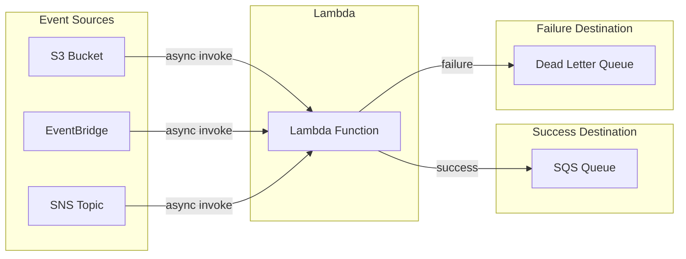
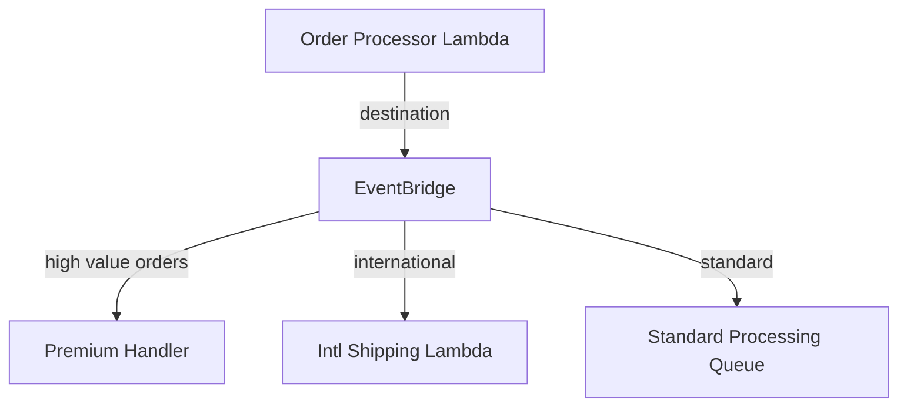
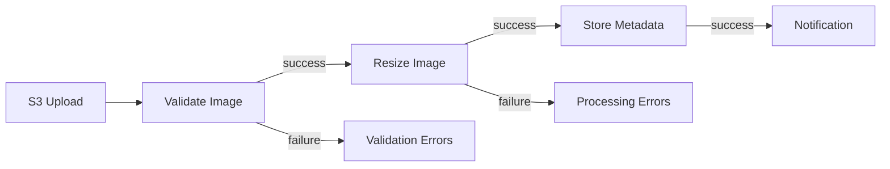
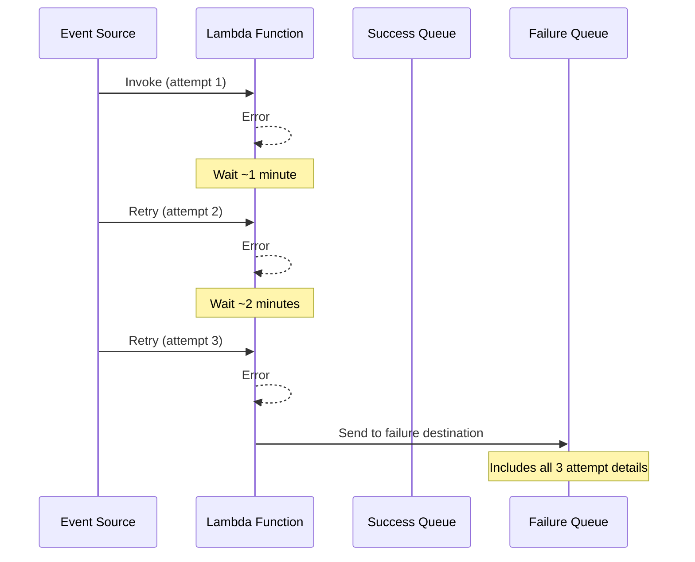

# How to Use Lambda Destinations

Author: [nawazdhandala](https://www.github.com/nawazdhandala)

Tags: AWS, Lambda, Serverless, Event-Driven, SQS, SNS, EventBridge

Description: Learn how to use Lambda Destinations to route function execution results to SQS, SNS, EventBridge, or other Lambda functions for robust event-driven architectures.

---

Lambda Destinations provide a clean way to route the results of asynchronous Lambda invocations without writing custom code. Instead of manually publishing to SQS or SNS inside your function, you configure destinations and let AWS handle the routing. This simplifies error handling, enables better observability, and reduces code complexity.

## What Are Lambda Destinations?

Lambda Destinations automatically send execution results to configured targets after asynchronous invocations complete. You can configure separate destinations for successful executions and failures, enabling sophisticated event-driven workflows.



## Destinations vs Dead Letter Queues

Lambda Destinations improve upon the older Dead Letter Queue (DLQ) feature:

| Feature | Dead Letter Queue | Destinations |
|---------|------------------|--------------|
| Trigger | Failures only | Success and failure |
| Targets | SQS, SNS only | SQS, SNS, EventBridge, Lambda |
| Payload | Original event only | Full execution context |
| Metadata | Limited | Includes response, error, timestamps |

The destination payload includes:

```json
{
  "version": "1.0",
  "timestamp": "2026-01-28T10:30:00.000Z",
  "requestContext": {
    "requestId": "abc-123",
    "functionArn": "arn:aws:lambda:us-east-1:123456789:function:my-function",
    "condition": "Success",
    "approximateInvokeCount": 1
  },
  "requestPayload": {
    "orderId": "order-456"
  },
  "responseContext": {
    "statusCode": 200,
    "executedVersion": "$LATEST"
  },
  "responsePayload": {
    "processed": true,
    "items": 5
  }
}
```

## Configuring Destinations with AWS CLI

### Success Destination to SQS

```bash
# Create SQS queue for successful executions
aws sqs create-queue --queue-name order-processing-success

# Get queue ARN
QUEUE_ARN=$(aws sqs get-queue-attributes \
  --queue-url https://sqs.us-east-1.amazonaws.com/123456789/order-processing-success \
  --attribute-names QueueArn \
  --query 'Attributes.QueueArn' \
  --output text)

# Configure success destination
aws lambda put-function-event-invoke-config \
  --function-name order-processor \
  --destination-config '{
    "OnSuccess": {
      "Destination": "'$QUEUE_ARN'"
    }
  }'
```

### Failure Destination to SNS

```bash
# Create SNS topic for failures
aws sns create-topic --name order-processing-failures

# Configure failure destination
aws lambda put-function-event-invoke-config \
  --function-name order-processor \
  --destination-config '{
    "OnFailure": {
      "Destination": "arn:aws:sns:us-east-1:123456789:order-processing-failures"
    }
  }'
```

### Both Success and Failure Destinations

```bash
aws lambda put-function-event-invoke-config \
  --function-name order-processor \
  --maximum-retry-attempts 2 \
  --maximum-event-age-in-seconds 3600 \
  --destination-config '{
    "OnSuccess": {
      "Destination": "arn:aws:sqs:us-east-1:123456789:order-success"
    },
    "OnFailure": {
      "Destination": "arn:aws:sqs:us-east-1:123456789:order-failures"
    }
  }'
```

## Configuring Destinations with Terraform

```hcl
# SQS queue for successful invocations
resource "aws_sqs_queue" "success" {
  name                      = "order-processing-success"
  message_retention_seconds = 86400

  tags = {
    Purpose = "Lambda success destination"
  }
}

# SQS queue for failed invocations
resource "aws_sqs_queue" "failure" {
  name                      = "order-processing-failures"
  message_retention_seconds = 1209600  # 14 days

  tags = {
    Purpose = "Lambda failure destination"
  }
}

# Lambda function
resource "aws_lambda_function" "order_processor" {
  function_name = "order-processor"
  role          = aws_iam_role.lambda.arn
  handler       = "index.handler"
  runtime       = "nodejs20.x"
  filename      = "function.zip"
}

# Configure destinations
resource "aws_lambda_function_event_invoke_config" "order_processor" {
  function_name = aws_lambda_function.order_processor.function_name

  # Retry configuration
  maximum_retry_attempts       = 2
  maximum_event_age_in_seconds = 3600

  destination_config {
    on_success {
      destination = aws_sqs_queue.success.arn
    }

    on_failure {
      destination = aws_sqs_queue.failure.arn
    }
  }
}

# IAM policy allowing Lambda to send to destinations
resource "aws_iam_role_policy" "lambda_destinations" {
  name = "lambda-destinations"
  role = aws_iam_role.lambda.id

  policy = jsonencode({
    Version = "2012-10-17"
    Statement = [
      {
        Effect = "Allow"
        Action = [
          "sqs:SendMessage"
        ]
        Resource = [
          aws_sqs_queue.success.arn,
          aws_sqs_queue.failure.arn
        ]
      }
    ]
  })
}
```

## Configuring Destinations with AWS SAM

```yaml
AWSTemplateFormatVersion: '2010-09-09'
Transform: AWS::Serverless-2016-10-31
Description: Lambda with destinations

Resources:
  # Success queue
  SuccessQueue:
    Type: AWS::SQS::Queue
    Properties:
      QueueName: order-processing-success

  # Failure queue
  FailureQueue:
    Type: AWS::SQS::Queue
    Properties:
      QueueName: order-processing-failures
      MessageRetentionPeriod: 1209600

  # Lambda function with destinations
  OrderProcessor:
    Type: AWS::Serverless::Function
    Properties:
      FunctionName: order-processor
      Handler: index.handler
      Runtime: nodejs20.x
      CodeUri: ./src
      EventInvokeConfig:
        MaximumRetryAttempts: 2
        MaximumEventAgeInSeconds: 3600
        DestinationConfig:
          OnSuccess:
            Type: SQS
            Destination: !GetAtt SuccessQueue.Arn
          OnFailure:
            Type: SQS
            Destination: !GetAtt FailureQueue.Arn
      Policies:
        - SQSSendMessagePolicy:
            QueueName: !GetAtt SuccessQueue.QueueName
        - SQSSendMessagePolicy:
            QueueName: !GetAtt FailureQueue.QueueName
```

## Using EventBridge as a Destination

EventBridge destinations enable sophisticated routing based on event content.



### Terraform Configuration

```hcl
# EventBridge event bus for Lambda destinations
resource "aws_cloudwatch_event_bus" "orders" {
  name = "order-events"
}

# Configure EventBridge as destination
resource "aws_lambda_function_event_invoke_config" "processor" {
  function_name = aws_lambda_function.order_processor.function_name

  destination_config {
    on_success {
      destination = aws_cloudwatch_event_bus.orders.arn
    }
  }
}

# Rule for high-value orders
resource "aws_cloudwatch_event_rule" "high_value" {
  name           = "high-value-orders"
  event_bus_name = aws_cloudwatch_event_bus.orders.name

  event_pattern = jsonencode({
    source      = ["lambda"]
    detail-type = ["Lambda Function Invocation Result - Success"]
    detail = {
      responsePayload = {
        orderTotal = [{
          numeric = [">=", 1000]
        }]
      }
    }
  })
}

resource "aws_cloudwatch_event_target" "high_value" {
  rule           = aws_cloudwatch_event_rule.high_value.name
  event_bus_name = aws_cloudwatch_event_bus.orders.name
  target_id      = "premium-handler"
  arn            = aws_lambda_function.premium_handler.arn
}
```

## Chaining Lambda Functions with Destinations

Destinations can invoke other Lambda functions, creating processing pipelines.



```hcl
# Step 1: Validate image
resource "aws_lambda_function" "validate" {
  function_name = "image-validate"
  # ... other config
}

# Step 2: Resize image
resource "aws_lambda_function" "resize" {
  function_name = "image-resize"
  # ... other config
}

# Step 3: Store metadata
resource "aws_lambda_function" "store_metadata" {
  function_name = "image-store-metadata"
  # ... other config
}

# Chain: validate -> resize
resource "aws_lambda_function_event_invoke_config" "validate" {
  function_name = aws_lambda_function.validate.function_name

  destination_config {
    on_success {
      destination = aws_lambda_function.resize.arn
    }
    on_failure {
      destination = aws_sqs_queue.validation_errors.arn
    }
  }
}

# Chain: resize -> store_metadata
resource "aws_lambda_function_event_invoke_config" "resize" {
  function_name = aws_lambda_function.resize.function_name

  destination_config {
    on_success {
      destination = aws_lambda_function.store_metadata.arn
    }
    on_failure {
      destination = aws_sqs_queue.processing_errors.arn
    }
  }
}

# Permission for validate to invoke resize
resource "aws_lambda_permission" "validate_to_resize" {
  statement_id  = "AllowValidateInvoke"
  action        = "lambda:InvokeFunction"
  function_name = aws_lambda_function.resize.function_name
  principal     = "lambda.amazonaws.com"
  source_arn    = aws_lambda_function.validate.arn
}
```

## Practical Example: Order Processing Pipeline

### Lambda Function Code

```javascript
// order-processor/index.js
exports.handler = async (event) => {
  console.log('Processing order:', JSON.stringify(event));

  const { orderId, items, customer } = event;

  // Validate order
  if (!orderId || !items || items.length === 0) {
    throw new Error('Invalid order: missing required fields');
  }

  // Calculate total
  const total = items.reduce((sum, item) => {
    return sum + (item.price * item.quantity);
  }, 0);

  // Simulate processing
  const processedOrder = {
    orderId,
    customerId: customer.id,
    itemCount: items.length,
    total,
    currency: 'USD',
    status: 'processed',
    processedAt: new Date().toISOString()
  };

  // Simulate occasional failures for testing
  if (Math.random() < 0.1) {
    throw new Error('Random processing failure');
  }

  console.log('Order processed successfully:', processedOrder);

  // Return value goes to success destination
  return processedOrder;
};
```

### Processing Success Events

```javascript
// success-handler/index.js
// Processes messages from success destination queue

exports.handler = async (event) => {
  for (const record of event.Records) {
    const body = JSON.parse(record.body);

    // Full destination payload structure
    const {
      requestContext,
      requestPayload,
      responsePayload
    } = body;

    console.log('Success event:', {
      requestId: requestContext.requestId,
      functionArn: requestContext.functionArn,
      originalOrder: requestPayload,
      processedResult: responsePayload
    });

    // Send confirmation email
    await sendConfirmationEmail(
      requestPayload.customer.email,
      responsePayload
    );

    // Update analytics
    await recordOrderMetrics(responsePayload);
  }
};
```

### Processing Failure Events

```javascript
// failure-handler/index.js
// Processes messages from failure destination queue

exports.handler = async (event) => {
  for (const record of event.Records) {
    const body = JSON.parse(record.body);

    const {
      requestContext,
      requestPayload,
      responseContext,
      responsePayload
    } = body;

    console.error('Failure event:', {
      requestId: requestContext.requestId,
      condition: requestContext.condition,
      approximateInvokeCount: requestContext.approximateInvokeCount,
      error: responsePayload
    });

    // Determine if retriable
    const isRetriable = requestContext.approximateInvokeCount < 3;

    if (isRetriable) {
      // Could requeue for manual retry
      await requeueForRetry(requestPayload, requestContext);
    } else {
      // Alert operations team
      await alertOperations({
        orderId: requestPayload.orderId,
        error: responsePayload,
        attempts: requestContext.approximateInvokeCount
      });
    }
  }
};
```

## Destination Invocation Patterns

### Asynchronous Invocation Required

Destinations only work with asynchronous invocations:

```javascript
// Invoke asynchronously - destinations will fire
const AWS = require('aws-sdk');
const lambda = new AWS.Lambda();

await lambda.invoke({
  FunctionName: 'order-processor',
  InvocationType: 'Event',  // Async - destinations work
  Payload: JSON.stringify({ orderId: '123' })
}).promise();

// Synchronous - destinations will NOT fire
await lambda.invoke({
  FunctionName: 'order-processor',
  InvocationType: 'RequestResponse',  // Sync - no destinations
  Payload: JSON.stringify({ orderId: '123' })
}).promise();
```

### Event Sources That Work with Destinations

| Event Source | Invocation Type | Destinations Work? |
|--------------|-----------------|-------------------|
| S3 | Async | Yes |
| SNS | Async | Yes |
| EventBridge | Async | Yes |
| CloudWatch Events | Async | Yes |
| API Gateway | Sync | No |
| SQS | Sync (polling) | No |
| Kinesis | Sync (polling) | No |

## Retry Behavior with Destinations

Configure retry attempts and event age alongside destinations:

```hcl
resource "aws_lambda_function_event_invoke_config" "processor" {
  function_name = aws_lambda_function.processor.function_name

  # Retry up to 2 times (3 total attempts)
  maximum_retry_attempts = 2

  # Discard events older than 1 hour
  maximum_event_age_in_seconds = 3600

  destination_config {
    on_success {
      destination = aws_sqs_queue.success.arn
    }
    on_failure {
      destination = aws_sqs_queue.failure.arn
    }
  }
}
```



## Best Practices

### 1. Use Destinations Instead of In-Function Publishing

```javascript
// Avoid: Publishing inside the function
exports.handler = async (event) => {
  const result = await processOrder(event);

  // Manual publishing couples function to infrastructure
  await sqs.sendMessage({
    QueueUrl: process.env.SUCCESS_QUEUE,
    MessageBody: JSON.stringify(result)
  }).promise();

  return result;
};

// Better: Let destinations handle routing
exports.handler = async (event) => {
  const result = await processOrder(event);
  return result;  // Destinations route automatically
};
```

### 2. Include Context in Return Values

```javascript
exports.handler = async (event) => {
  const result = await processOrder(event);

  // Include useful context for downstream processing
  return {
    ...result,
    sourceEventId: event.eventId,
    processingTimestamp: new Date().toISOString(),
    version: '1.0'
  };
};
```

### 3. Design for Idempotency

Destinations may deliver duplicate messages. Design handlers to be idempotent:

```javascript
exports.handler = async (event) => {
  for (const record of event.Records) {
    const { requestContext, responsePayload } = JSON.parse(record.body);

    // Use requestId for idempotency
    const processed = await checkIfProcessed(requestContext.requestId);
    if (processed) {
      console.log('Already processed:', requestContext.requestId);
      continue;
    }

    await processResult(responsePayload);
    await markAsProcessed(requestContext.requestId);
  }
};
```

### 4. Monitor Destination Delivery

```hcl
# CloudWatch alarm for destination failures
resource "aws_cloudwatch_metric_alarm" "destination_failures" {
  alarm_name          = "lambda-destination-failures"
  comparison_operator = "GreaterThanThreshold"
  evaluation_periods  = 1
  metric_name         = "DestinationDeliveryFailures"
  namespace           = "AWS/Lambda"
  period              = 300
  statistic           = "Sum"
  threshold           = 0

  dimensions = {
    FunctionName = aws_lambda_function.processor.function_name
  }

  alarm_actions = [aws_sns_topic.alerts.arn]
}
```

---

Lambda Destinations simplify event-driven architectures by separating routing logic from business logic. Instead of embedding SQS or SNS calls in your function code, you configure destinations declaratively and let AWS handle the plumbing. This results in cleaner functions, better observability, and more maintainable infrastructure. Use destinations whenever you need to route asynchronous Lambda results to other services.
