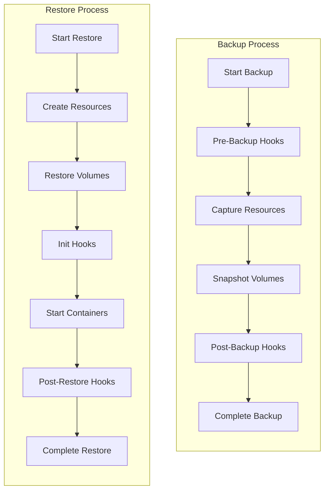
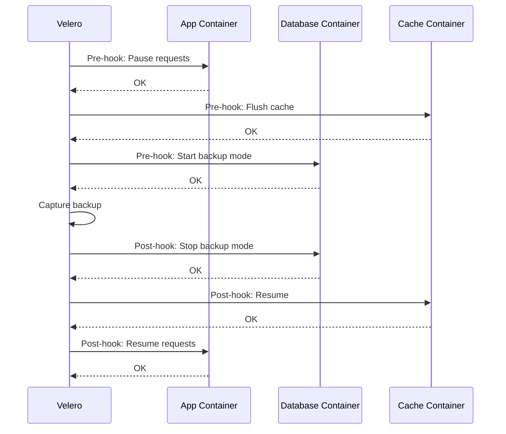

# How to Configure Velero Backup Hooks

Author: [nawazdhandala](https://www.github.com/nawazdhandala)

Tags: Velero, Kubernetes, Backup, Hooks, Database Backup

Description: Learn how to use Velero backup and restore hooks to ensure application-consistent backups by running pre and post backup commands.

---

Taking a backup while an application is actively writing data can lead to inconsistent or corrupted backups. Velero hooks provide a mechanism to execute commands inside containers before and after backup operations, allowing you to quiesce databases, flush caches, or perform any preparation needed for consistent backups.

## Understanding Velero Hooks

Velero supports four types of hooks that execute at different phases of the backup and restore lifecycle.



## Hook Types and Their Use Cases

- **Pre-backup hooks**: Run before the backup captures data. Use for database quiescing, flushing buffers, or pausing writes.
- **Post-backup hooks**: Run after the backup completes. Use for resuming writes, releasing locks, or sending notifications.
- **Init hooks**: Run during restore before containers start. Use for data preparation or migration scripts.
- **Post-restore hooks**: Run after restore completes. Use for cache warming, reindexing, or validation.

## Configuring Hooks via Pod Annotations

The simplest way to add hooks is through pod annotations. Velero reads these annotations during backup and restore operations.

### Basic Hook Annotation Structure

```yaml
# pod-with-hooks.yaml
apiVersion: v1
kind: Pod
metadata:
  name: database-pod
  annotations:
    # Pre-backup hook to freeze the database
    backup.velero.io/backup-volumes: data-volume
    pre.hook.backup.velero.io/container: database
    pre.hook.backup.velero.io/command: '["/bin/sh", "-c", "pg_ctl stop -m fast"]'
    pre.hook.backup.velero.io/timeout: 30s
    pre.hook.backup.velero.io/on-error: Fail

    # Post-backup hook to resume the database
    post.hook.backup.velero.io/container: database
    post.hook.backup.velero.io/command: '["/bin/sh", "-c", "pg_ctl start"]'
    post.hook.backup.velero.io/timeout: 60s
spec:
  containers:
  - name: database
    image: postgres:15
    volumeMounts:
    - name: data-volume
      mountPath: /var/lib/postgresql/data
  volumes:
  - name: data-volume
    persistentVolumeClaim:
      claimName: postgres-data
```

### PostgreSQL Backup Hooks

```yaml
# postgres-deployment-with-hooks.yaml
apiVersion: apps/v1
kind: Deployment
metadata:
  name: postgresql
  namespace: database
spec:
  replicas: 1
  selector:
    matchLabels:
      app: postgresql
  template:
    metadata:
      labels:
        app: postgresql
      annotations:
        # Specify which volumes to backup
        backup.velero.io/backup-volumes: postgres-data

        # Pre-backup: Create a consistent checkpoint and pause writes
        pre.hook.backup.velero.io/container: postgresql
        pre.hook.backup.velero.io/command: |
          ["/bin/bash", "-c", "psql -U postgres -c 'SELECT pg_start_backup($$velero-backup$$, false, false);'"]
        pre.hook.backup.velero.io/timeout: 60s
        pre.hook.backup.velero.io/on-error: Fail

        # Post-backup: Resume normal operations
        post.hook.backup.velero.io/container: postgresql
        post.hook.backup.velero.io/command: |
          ["/bin/bash", "-c", "psql -U postgres -c 'SELECT pg_stop_backup(false, true);'"]
        post.hook.backup.velero.io/timeout: 60s
    spec:
      containers:
      - name: postgresql
        image: postgres:15
        env:
        - name: POSTGRES_PASSWORD
          valueFrom:
            secretKeyRef:
              name: postgres-secret
              key: password
        volumeMounts:
        - name: postgres-data
          mountPath: /var/lib/postgresql/data
      volumes:
      - name: postgres-data
        persistentVolumeClaim:
          claimName: postgres-pvc
```

### MySQL Backup Hooks

```yaml
# mysql-deployment-with-hooks.yaml
apiVersion: apps/v1
kind: Deployment
metadata:
  name: mysql
  namespace: database
spec:
  replicas: 1
  selector:
    matchLabels:
      app: mysql
  template:
    metadata:
      labels:
        app: mysql
      annotations:
        backup.velero.io/backup-volumes: mysql-data

        # Pre-backup: Flush tables and lock for consistent backup
        pre.hook.backup.velero.io/container: mysql
        pre.hook.backup.velero.io/command: |
          ["/bin/bash", "-c", "mysql -u root -p$MYSQL_ROOT_PASSWORD -e 'FLUSH TABLES WITH READ LOCK; SYSTEM touch /tmp/backup-in-progress;'"]
        pre.hook.backup.velero.io/timeout: 120s
        pre.hook.backup.velero.io/on-error: Fail

        # Post-backup: Unlock tables
        post.hook.backup.velero.io/container: mysql
        post.hook.backup.velero.io/command: |
          ["/bin/bash", "-c", "mysql -u root -p$MYSQL_ROOT_PASSWORD -e 'UNLOCK TABLES;' && rm -f /tmp/backup-in-progress"]
        post.hook.backup.velero.io/timeout: 30s
    spec:
      containers:
      - name: mysql
        image: mysql:8.0
        env:
        - name: MYSQL_ROOT_PASSWORD
          valueFrom:
            secretKeyRef:
              name: mysql-secret
              key: root-password
        volumeMounts:
        - name: mysql-data
          mountPath: /var/lib/mysql
      volumes:
      - name: mysql-data
        persistentVolumeClaim:
          claimName: mysql-pvc
```

## Configuring Hooks via Backup Specification

For more complex scenarios or when you cannot modify pod annotations, define hooks directly in the Backup resource.

```yaml
# backup-with-hooks.yaml
apiVersion: velero.io/v1
kind: Backup
metadata:
  name: database-backup
  namespace: velero
spec:
  includedNamespaces:
    - database
  # File system backup for volumes
  defaultVolumesToFsBackup: true

  hooks:
    resources:
      # PostgreSQL hooks
      - name: postgres-hooks
        includedNamespaces:
          - database
        labelSelector:
          matchLabels:
            app: postgresql
        pre:
          - exec:
              container: postgresql
              command:
                - /bin/bash
                - -c
                - |
                  echo "Starting pre-backup hook"
                  # Wait for active transactions to complete
                  psql -U postgres -c "SELECT pg_start_backup('velero', false, false);"
                  echo "Backup mode started"
              onError: Fail
              timeout: 120s
        post:
          - exec:
              container: postgresql
              command:
                - /bin/bash
                - -c
                - |
                  echo "Stopping backup mode"
                  psql -U postgres -c "SELECT pg_stop_backup(false, true);"
                  echo "Post-backup hook completed"
              onError: Continue
              timeout: 60s

      # Redis hooks - flush to disk before backup
      - name: redis-hooks
        includedNamespaces:
          - cache
        labelSelector:
          matchLabels:
            app: redis
        pre:
          - exec:
              container: redis
              command:
                - /bin/sh
                - -c
                - redis-cli BGSAVE && sleep 5
              onError: Continue
              timeout: 30s
```

## Restore Hooks

Restore hooks help prepare your application after data is restored.

```yaml
# restore-with-hooks.yaml
apiVersion: velero.io/v1
kind: Restore
metadata:
  name: database-restore
  namespace: velero
spec:
  backupName: database-backup
  includedNamespaces:
    - database

  hooks:
    resources:
      # Run database migrations after restore
      - name: post-restore-migration
        includedNamespaces:
          - database
        labelSelector:
          matchLabels:
            app: application
        postHooks:
          - exec:
              container: app
              command:
                - /bin/bash
                - -c
                - |
                  echo "Running post-restore migrations"
                  cd /app && ./manage.py migrate --noinput
                  echo "Migrations completed"
              execTimeout: 300s
              waitTimeout: 60s
              onError: Continue

      # Init hook runs before main container starts
      - name: database-init
        includedNamespaces:
          - database
        labelSelector:
          matchLabels:
            app: postgresql
        postHooks:
          - init:
              initContainers:
                - name: restore-prep
                  image: postgres:15
                  command:
                    - /bin/bash
                    - -c
                    - |
                      echo "Preparing restored database"
                      # Fix permissions after restore
                      chown -R postgres:postgres /var/lib/postgresql/data
                      chmod 700 /var/lib/postgresql/data
                  volumeMounts:
                    - name: postgres-data
                      mountPath: /var/lib/postgresql/data
```

## Advanced Hook Patterns

### Conditional Hooks Based on Backup Type

```yaml
# scheduled-backup-with-conditional-hooks.yaml
apiVersion: velero.io/v1
kind: Schedule
metadata:
  name: database-full-backup
  namespace: velero
spec:
  schedule: "0 2 * * 0"  # Weekly full backup
  template:
    includedNamespaces:
      - database
    defaultVolumesToFsBackup: true
    hooks:
      resources:
        - name: full-backup-hooks
          includedNamespaces:
            - database
          labelSelector:
            matchLabels:
              app: postgresql
          pre:
            - exec:
                container: postgresql
                command:
                  - /bin/bash
                  - -c
                  - |
                    # Full backup preparation - more comprehensive
                    echo "Preparing for full backup"
                    psql -U postgres -c "CHECKPOINT;"
                    psql -U postgres -c "VACUUM ANALYZE;"
                    psql -U postgres -c "SELECT pg_start_backup('velero-full', false, false);"
                onError: Fail
                timeout: 300s
```

### Multi-Container Hook Coordination



```yaml
# multi-container-hooks.yaml
apiVersion: apps/v1
kind: Deployment
metadata:
  name: web-application
  namespace: production
spec:
  template:
    metadata:
      annotations:
        # Mark volumes for backup
        backup.velero.io/backup-volumes: app-data,upload-data

        # First: Application pauses incoming requests
        pre.hook.backup.velero.io/container: nginx
        pre.hook.backup.velero.io/command: '["/bin/sh", "-c", "touch /tmp/maintenance.flag"]'
        pre.hook.backup.velero.io/timeout: 10s

        # Application writes in-flight data
        pre.hook.backup.velero.io/container: app
        pre.hook.backup.velero.io/command: |
          ["/bin/sh", "-c", "curl -X POST localhost:8080/admin/flush-buffers"]
        pre.hook.backup.velero.io/timeout: 30s
        pre.hook.backup.velero.io/on-error: Continue

        # Post-backup: Resume operations
        post.hook.backup.velero.io/container: nginx
        post.hook.backup.velero.io/command: '["/bin/sh", "-c", "rm -f /tmp/maintenance.flag"]'
        post.hook.backup.velero.io/timeout: 10s
```

### Error Handling and Notifications

```yaml
# hooks-with-notifications.yaml
apiVersion: velero.io/v1
kind: Backup
metadata:
  name: critical-backup
  namespace: velero
spec:
  includedNamespaces:
    - critical-app
  hooks:
    resources:
      - name: backup-with-alerts
        includedNamespaces:
          - critical-app
        labelSelector:
          matchLabels:
            tier: database
        pre:
          - exec:
              container: postgres
              command:
                - /bin/bash
                - -c
                - |
                  # Attempt to start backup mode
                  if ! psql -U postgres -c "SELECT pg_start_backup('velero', false, false);" 2>/tmp/hook-error.log; then
                    # Send alert on failure
                    curl -X POST "https://alerts.example.com/webhook" \
                      -H "Content-Type: application/json" \
                      -d '{"text": "Pre-backup hook failed for PostgreSQL", "severity": "critical"}'
                    cat /tmp/hook-error.log
                    exit 1
                  fi
                  echo "Backup mode started successfully"
              onError: Fail
              timeout: 120s
        post:
          - exec:
              container: postgres
              command:
                - /bin/bash
                - -c
                - |
                  psql -U postgres -c "SELECT pg_stop_backup(false, true);"
                  # Send success notification
                  curl -X POST "https://alerts.example.com/webhook" \
                    -H "Content-Type: application/json" \
                    -d '{"text": "Database backup completed successfully", "severity": "info"}'
              onError: Continue
              timeout: 60s
```

## Testing Hooks

Validate your hooks before relying on them for production backups.

```bash
#!/bin/bash
# test-backup-hooks.sh
# Script to test backup hooks without running a full backup

NAMESPACE="database"
POD_SELECTOR="app=postgresql"
CONTAINER="postgresql"

# Get the pod name
POD=$(kubectl get pod -n $NAMESPACE -l $POD_SELECTOR -o jsonpath='{.items[0].metadata.name}')

echo "Testing pre-backup hook on pod: $POD"

# Test the pre-backup command
kubectl exec -n $NAMESPACE $POD -c $CONTAINER -- /bin/bash -c "
  echo 'Testing pre-backup hook'
  psql -U postgres -c 'SELECT pg_start_backup(\"test\", false, false);'
"

if [ $? -eq 0 ]; then
  echo "Pre-backup hook executed successfully"
else
  echo "Pre-backup hook failed!"
  exit 1
fi

# Wait a moment
sleep 5

# Test the post-backup command
kubectl exec -n $NAMESPACE $POD -c $CONTAINER -- /bin/bash -c "
  echo 'Testing post-backup hook'
  psql -U postgres -c 'SELECT pg_stop_backup(false, true);'
"

if [ $? -eq 0 ]; then
  echo "Post-backup hook executed successfully"
else
  echo "Post-backup hook failed!"
  exit 1
fi

echo "All hooks tested successfully"
```

```bash
# Run a test backup and monitor hook execution
velero backup create hook-test-backup \
    --include-namespaces database \
    --default-volumes-to-fs-backup

# Watch the backup progress and hook execution
velero backup describe hook-test-backup --details

# Check logs for hook output
velero backup logs hook-test-backup | grep -i hook
```

## Hook Timeout and Error Handling

Configure appropriate timeouts and error handling strategies.

| Hook Type | Recommended Timeout | On Error Strategy |
|-----------|--------------------|--------------------|
| Pre-backup (database quiesce) | 60-120s | Fail |
| Pre-backup (cache flush) | 30s | Continue |
| Post-backup (resume operations) | 30-60s | Continue |
| Post-restore (migrations) | 300-600s | Continue |

```yaml
# Timeout and error handling example
annotations:
  # Critical hook - fail backup if it fails
  pre.hook.backup.velero.io/command: '["/scripts/critical-prep.sh"]'
  pre.hook.backup.velero.io/timeout: 120s
  pre.hook.backup.velero.io/on-error: Fail

  # Non-critical hook - continue even if it fails
  post.hook.backup.velero.io/command: '["/scripts/cleanup.sh"]'
  post.hook.backup.velero.io/timeout: 30s
  post.hook.backup.velero.io/on-error: Continue
```

---

Velero hooks are essential for achieving application-consistent backups, especially for stateful applications like databases. By properly configuring pre and post-backup hooks, you ensure that your backed-up data is in a consistent state and can be reliably restored. Remember to test your hooks regularly, set appropriate timeouts, and choose the right error handling strategy based on how critical each hook is to your backup integrity.
