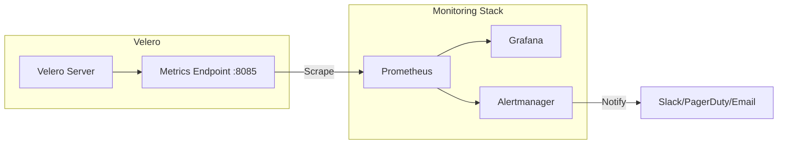
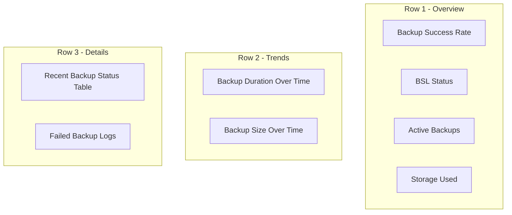

# How to Monitor Velero Backup Status

Author: [nawazdhandala](https://www.github.com/nawazdhandala)

Tags: Velero, Kubernetes, Backup, Monitoring, Prometheus, Observability

Description: Learn how to monitor Velero backup operations using Prometheus metrics, Grafana dashboards, and alerting to ensure backup reliability.

---

Running backups is only half the battle. Without proper monitoring, you will not know if your backups are succeeding, how long they take, or when storage is running low. Velero exposes Prometheus metrics that provide visibility into backup operations, allowing you to build dashboards and alerts that keep you informed about your backup health.

## Velero Metrics Overview

Velero exposes metrics on port 8085 by default. These metrics cover backup operations, restore operations, and storage location status.



## Enabling and Accessing Velero Metrics

Velero metrics are enabled by default. Verify the metrics endpoint is accessible:

```bash
# Port-forward to access metrics locally
kubectl port-forward -n velero deployment/velero 8085:8085

# View raw metrics
curl http://localhost:8085/metrics

# Filter for velero-specific metrics
curl http://localhost:8085/metrics | grep ^velero_
```

Key metrics exposed by Velero:

```
# Backup metrics
velero_backup_total                    # Total number of backups
velero_backup_success_total            # Successful backups
velero_backup_partial_failure_total    # Partially failed backups
velero_backup_failure_total            # Failed backups
velero_backup_duration_seconds         # Backup duration histogram
velero_backup_items_total              # Items backed up per backup
velero_backup_tarball_size_bytes       # Size of backup tarball

# Restore metrics
velero_restore_total                   # Total restores
velero_restore_success_total           # Successful restores
velero_restore_partial_failure_total   # Partially failed restores
velero_restore_failure_total           # Failed restores

# Volume metrics
velero_volume_snapshot_success_total   # Successful volume snapshots
velero_volume_snapshot_failure_total   # Failed volume snapshots

# Storage location metrics
velero_backup_storage_location_available  # BSL availability status
```

## Configuring Prometheus to Scrape Velero

### Service and ServiceMonitor Setup

```yaml
# velero-metrics-service.yaml
apiVersion: v1
kind: Service
metadata:
  name: velero-metrics
  namespace: velero
  labels:
    app.kubernetes.io/name: velero
spec:
  ports:
    - name: metrics
      port: 8085
      targetPort: 8085
      protocol: TCP
  selector:
    app.kubernetes.io/name: velero
---
# velero-servicemonitor.yaml (for Prometheus Operator)
apiVersion: monitoring.coreos.com/v1
kind: ServiceMonitor
metadata:
  name: velero
  namespace: velero
  labels:
    release: prometheus
spec:
  namespaceSelector:
    matchNames:
      - velero
  selector:
    matchLabels:
      app.kubernetes.io/name: velero
  endpoints:
    - port: metrics
      interval: 30s
      path: /metrics
```

### Prometheus Scrape Config (without Operator)

```yaml
# prometheus-config.yaml
scrape_configs:
  - job_name: 'velero'
    kubernetes_sd_configs:
      - role: pod
        namespaces:
          names:
            - velero
    relabel_configs:
      # Only scrape pods with velero label
      - source_labels: [__meta_kubernetes_pod_label_app_kubernetes_io_name]
        action: keep
        regex: velero
      # Use the metrics port
      - source_labels: [__meta_kubernetes_pod_container_port_number]
        action: keep
        regex: "8085"
      # Set instance label to pod name
      - source_labels: [__meta_kubernetes_pod_name]
        target_label: instance
```

## Building a Velero Monitoring Dashboard

Create a comprehensive Grafana dashboard for Velero monitoring.

```json
{
  "dashboard": {
    "title": "Velero Backup Monitoring",
    "uid": "velero-backup-monitoring",
    "panels": [
      {
        "title": "Backup Success Rate (24h)",
        "type": "stat",
        "gridPos": {"h": 4, "w": 6, "x": 0, "y": 0},
        "targets": [
          {
            "expr": "sum(increase(velero_backup_success_total[24h])) / sum(increase(velero_backup_total[24h])) * 100",
            "legendFormat": "Success Rate"
          }
        ],
        "fieldConfig": {
          "defaults": {
            "unit": "percent",
            "thresholds": {
              "mode": "absolute",
              "steps": [
                {"color": "red", "value": null},
                {"color": "yellow", "value": 90},
                {"color": "green", "value": 99}
              ]
            }
          }
        }
      },
      {
        "title": "Backup Status by Schedule",
        "type": "table",
        "gridPos": {"h": 8, "w": 12, "x": 0, "y": 4},
        "targets": [
          {
            "expr": "velero_backup_last_status",
            "format": "table",
            "instant": true
          }
        ]
      },
      {
        "title": "Backup Duration Trend",
        "type": "timeseries",
        "gridPos": {"h": 8, "w": 12, "x": 12, "y": 4},
        "targets": [
          {
            "expr": "histogram_quantile(0.95, sum(rate(velero_backup_duration_seconds_bucket[1h])) by (le, schedule))",
            "legendFormat": "{{schedule}} - p95"
          }
        ]
      },
      {
        "title": "Failed Backups (Last 7 Days)",
        "type": "timeseries",
        "gridPos": {"h": 8, "w": 12, "x": 0, "y": 12},
        "targets": [
          {
            "expr": "increase(velero_backup_failure_total[1d])",
            "legendFormat": "Failures"
          },
          {
            "expr": "increase(velero_backup_partial_failure_total[1d])",
            "legendFormat": "Partial Failures"
          }
        ]
      },
      {
        "title": "Backup Storage Location Status",
        "type": "stat",
        "gridPos": {"h": 4, "w": 6, "x": 6, "y": 0},
        "targets": [
          {
            "expr": "velero_backup_storage_location_available",
            "legendFormat": "{{name}}"
          }
        ],
        "fieldConfig": {
          "defaults": {
            "mappings": [
              {"type": "value", "options": {"0": {"text": "Unavailable", "color": "red"}}},
              {"type": "value", "options": {"1": {"text": "Available", "color": "green"}}}
            ]
          }
        }
      }
    ]
  }
}
```

### Key Dashboard Panels



## Prometheus Alert Rules for Velero

Create alerts for critical backup conditions:

```yaml
# velero-alerts.yaml
apiVersion: monitoring.coreos.com/v1
kind: PrometheusRule
metadata:
  name: velero-alerts
  namespace: velero
  labels:
    release: prometheus
spec:
  groups:
    - name: velero.rules
      rules:
        # Alert when backup storage location is unavailable
        - alert: VeleroBackupStorageLocationUnavailable
          expr: velero_backup_storage_location_available == 0
          for: 5m
          labels:
            severity: critical
          annotations:
            summary: "Velero backup storage location unavailable"
            description: "Backup storage location {{ $labels.name }} has been unavailable for 5 minutes. Backups cannot be stored."

        # Alert when no successful backups in 24 hours
        - alert: VeleroNoRecentBackup
          expr: |
            time() - velero_backup_last_successful_timestamp > 86400
          for: 1h
          labels:
            severity: warning
          annotations:
            summary: "No successful Velero backup in 24 hours"
            description: "Schedule {{ $labels.schedule }} has not completed a successful backup in over 24 hours."

        # Alert on backup failures
        - alert: VeleroBackupFailed
          expr: increase(velero_backup_failure_total[1h]) > 0
          for: 0m
          labels:
            severity: critical
          annotations:
            summary: "Velero backup failed"
            description: "A Velero backup has failed in the last hour. Check velero backup logs for details."

        # Alert on partial failures
        - alert: VeleroBackupPartiallyFailed
          expr: increase(velero_backup_partial_failure_total[1h]) > 0
          for: 0m
          labels:
            severity: warning
          annotations:
            summary: "Velero backup partially failed"
            description: "A Velero backup completed with partial failures. Some resources may not have been backed up."

        # Alert when backup duration exceeds threshold
        - alert: VeleroBackupTooSlow
          expr: |
            histogram_quantile(0.95, sum(rate(velero_backup_duration_seconds_bucket[1h])) by (le, schedule)) > 3600
          for: 0m
          labels:
            severity: warning
          annotations:
            summary: "Velero backup taking too long"
            description: "Backup schedule {{ $labels.schedule }} is taking longer than 1 hour to complete."

        # Alert when backup success rate drops
        - alert: VeleroLowBackupSuccessRate
          expr: |
            (
              sum(increase(velero_backup_success_total[24h])) /
              sum(increase(velero_backup_total[24h]))
            ) < 0.9
          for: 1h
          labels:
            severity: warning
          annotations:
            summary: "Velero backup success rate below 90%"
            description: "The backup success rate over the last 24 hours is {{ $value | humanizePercentage }}."
```

## Custom Metrics and Recording Rules

Create recording rules for efficient querying:

```yaml
# velero-recording-rules.yaml
apiVersion: monitoring.coreos.com/v1
kind: PrometheusRule
metadata:
  name: velero-recording-rules
  namespace: velero
spec:
  groups:
    - name: velero.recordings
      interval: 1m
      rules:
        # Pre-calculate backup success rate
        - record: velero:backup_success_rate:24h
          expr: |
            sum(increase(velero_backup_success_total[24h])) /
            sum(increase(velero_backup_total[24h]))

        # Track backup duration by schedule
        - record: velero:backup_duration_seconds:p95_1h
          expr: |
            histogram_quantile(0.95,
              sum(rate(velero_backup_duration_seconds_bucket[1h])) by (le, schedule)
            )

        # Track average backup size
        - record: velero:backup_size_bytes:avg_1h
          expr: |
            avg(velero_backup_tarball_size_bytes) by (schedule)
```

## Monitoring Backup Storage Capacity

Track storage usage to prevent running out of space:

```bash
#!/bin/bash
# check-backup-storage.sh
# Script to check backup storage usage and report metrics

# AWS S3 storage check
check_s3_storage() {
    BUCKET=$1
    TOTAL_SIZE=$(aws s3 ls s3://$BUCKET --recursive --summarize | grep "Total Size" | awk '{print $3}')
    OBJECT_COUNT=$(aws s3 ls s3://$BUCKET --recursive --summarize | grep "Total Objects" | awk '{print $3}')

    echo "velero_storage_used_bytes{provider=\"aws\",bucket=\"$BUCKET\"} $TOTAL_SIZE"
    echo "velero_storage_object_count{provider=\"aws\",bucket=\"$BUCKET\"} $OBJECT_COUNT"
}

# Azure Blob storage check
check_azure_storage() {
    CONTAINER=$1
    ACCOUNT=$2
    TOTAL_SIZE=$(az storage blob list --container-name $CONTAINER --account-name $ACCOUNT --query "[].properties.contentLength" -o tsv | awk '{sum+=$1} END {print sum}')

    echo "velero_storage_used_bytes{provider=\"azure\",container=\"$CONTAINER\"} $TOTAL_SIZE"
}

# GCS storage check
check_gcs_storage() {
    BUCKET=$1
    TOTAL_SIZE=$(gsutil du -s gs://$BUCKET | awk '{print $1}')

    echo "velero_storage_used_bytes{provider=\"gcp\",bucket=\"$BUCKET\"} $TOTAL_SIZE"
}

# Run checks based on provider
case $PROVIDER in
    aws) check_s3_storage $BUCKET ;;
    azure) check_azure_storage $CONTAINER $ACCOUNT ;;
    gcp) check_gcs_storage $BUCKET ;;
esac
```

## Integration with External Monitoring

### Sending Alerts to Slack

```yaml
# alertmanager-config.yaml
receivers:
  - name: 'velero-slack'
    slack_configs:
      - api_url: 'https://hooks.slack.com/services/xxx/yyy/zzz'
        channel: '#backup-alerts'
        username: 'Velero Monitor'
        icon_emoji: ':floppy_disk:'
        title: '{{ .GroupLabels.alertname }}'
        text: |
          *Alert:* {{ .GroupLabels.alertname }}
          *Severity:* {{ .CommonLabels.severity }}
          *Description:* {{ .CommonAnnotations.description }}
          *Runbook:* https://wiki.example.com/velero/{{ .GroupLabels.alertname }}

route:
  group_by: ['alertname']
  receiver: 'velero-slack'
  routes:
    - match:
        alertname: VeleroBackupFailed
      receiver: 'velero-slack'
      repeat_interval: 1h
    - match:
        alertname: VeleroBackupStorageLocationUnavailable
      receiver: 'velero-slack'
      repeat_interval: 15m
```

### Creating Status Page Integration

```python
# velero_status_reporter.py
# Script to report Velero status to external status page

import requests
from prometheus_client.parser import text_string_to_metric_families

PROMETHEUS_URL = "http://prometheus:9090"
STATUS_PAGE_API = "https://api.statuspage.io/v1"
API_KEY = "your-api-key"
COMPONENT_ID = "velero-backup-component"

def get_velero_metrics():
    """Fetch Velero metrics from Prometheus"""
    query = 'velero_backup_last_status'
    response = requests.get(
        f"{PROMETHEUS_URL}/api/v1/query",
        params={'query': query}
    )
    return response.json()

def calculate_status():
    """Determine overall backup status"""
    metrics = get_velero_metrics()

    # Check if any backups failed recently
    failed = any(
        m['value'][1] == '0'  # 0 indicates failure
        for m in metrics['data']['result']
    )

    if failed:
        return 'partial_outage'
    return 'operational'

def update_status_page(status):
    """Update external status page"""
    requests.patch(
        f"{STATUS_PAGE_API}/pages/your-page/components/{COMPONENT_ID}",
        headers={'Authorization': f'OAuth {API_KEY}'},
        json={'component': {'status': status}}
    )

if __name__ == '__main__':
    status = calculate_status()
    update_status_page(status)
    print(f"Updated status page: {status}")
```

## Quick Health Check Commands

Useful commands for manual monitoring:

```bash
# Check overall backup status
velero backup get

# Get detailed status of recent backups
velero backup describe $(velero backup get -o jsonpath='{.items[-1].metadata.name}')

# Check backup storage locations
velero backup-location get

# View backup schedules and their last run
velero schedule get

# Quick metrics check
kubectl exec -n velero deployment/velero -- wget -qO- http://localhost:8085/metrics | grep velero_backup_success_total

# Check for any failed backups in last 24h
velero backup get --selector velero.io/schedule-name=daily-backup | grep -E "Failed|PartiallyFailed"
```

---

Monitoring Velero backups is essential for maintaining confidence in your disaster recovery capabilities. By implementing Prometheus metrics collection, Grafana dashboards, and alerting rules, you create visibility into your backup operations and receive immediate notification when issues arise. Regular monitoring also helps you understand backup trends, optimize schedules, and plan storage capacity before problems occur.
