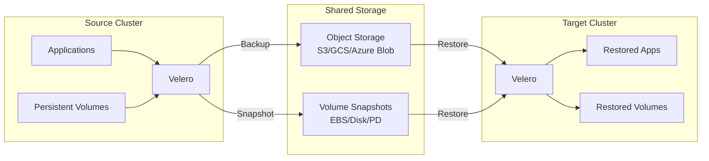
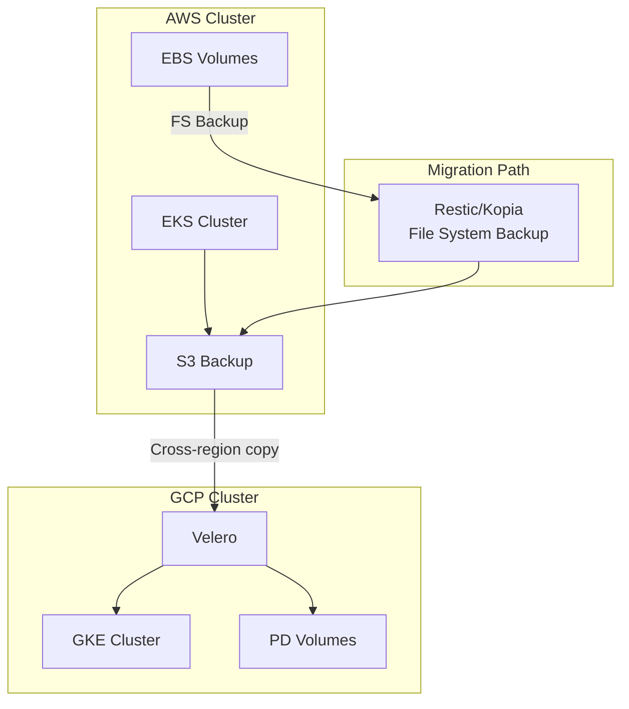
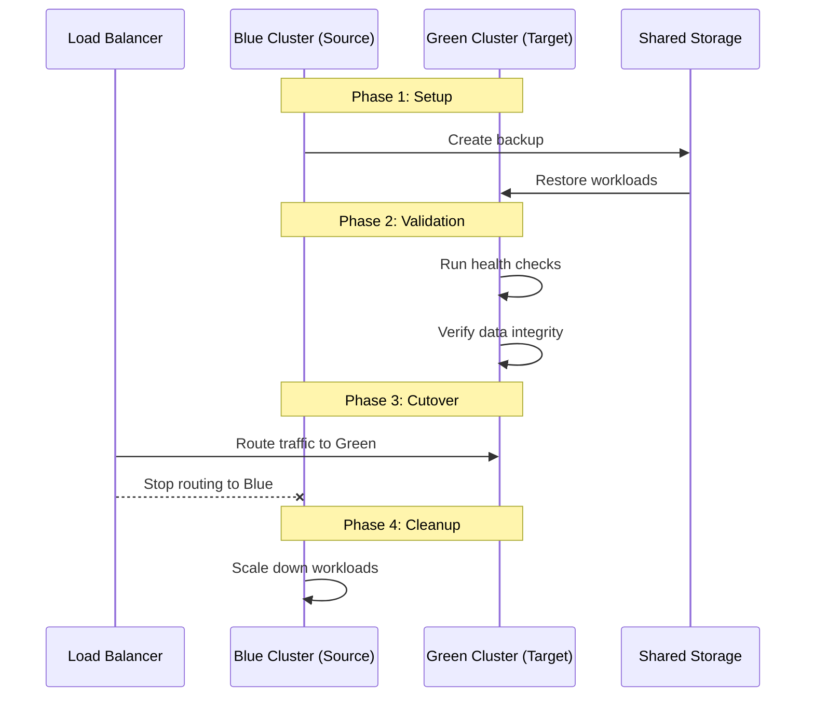

# How to Implement Velero Cross-Cluster Migration

Author: [nawazdhandala](https://www.github.com/nawazdhandala)

Tags: Velero, Kubernetes, Migration, Disaster Recovery, Multi-Cluster

Description: Learn how to migrate Kubernetes workloads between clusters using Velero for disaster recovery, cloud migration, and cluster upgrades.

---

Migrating Kubernetes workloads between clusters is a common requirement for disaster recovery drills, cloud provider migrations, and cluster upgrades. Velero provides a straightforward mechanism for capturing workloads from a source cluster and restoring them to a target cluster, handling both Kubernetes resources and persistent volume data.

## Cross-Cluster Migration Architecture

Understanding the migration flow helps plan for successful workload transfers.



## Prerequisites for Cross-Cluster Migration

Before starting a migration, ensure both clusters meet these requirements:

```bash
# On both clusters, verify Velero is installed and healthy
velero version

# Check that both clusters can access the same backup storage
velero backup-location get

# Verify storage location is available
velero backup-location get default -o yaml | grep phase
# Should show: phase: Available

# For volume migration, ensure compatible storage classes exist
kubectl get storageclass
```

### Shared Storage Configuration

Both clusters must access the same object storage for backup data:

```yaml
# source-cluster-bsl.yaml
apiVersion: velero.io/v1
kind: BackupStorageLocation
metadata:
  name: migration-storage
  namespace: velero
spec:
  provider: aws
  objectStorage:
    bucket: velero-migration-bucket
    prefix: cluster-migration
  config:
    region: us-east-1
  # Source cluster has read-write access
  accessMode: ReadWrite
---
# target-cluster-bsl.yaml
apiVersion: velero.io/v1
kind: BackupStorageLocation
metadata:
  name: migration-storage
  namespace: velero
spec:
  provider: aws
  objectStorage:
    bucket: velero-migration-bucket
    prefix: cluster-migration
  config:
    region: us-east-1
  # Target cluster can be read-write or read-only
  # Use ReadOnly to prevent accidental backup overwrites
  accessMode: ReadOnly
```

## Basic Cluster Migration Workflow

### Step 1: Create Backup on Source Cluster

```bash
# Create a comprehensive backup of the namespace to migrate
velero backup create migration-backup-$(date +%Y%m%d) \
    --include-namespaces production \
    --include-cluster-resources=true \
    --storage-location migration-storage \
    --snapshot-volumes=true \
    --wait

# Verify backup completed successfully
velero backup describe migration-backup-$(date +%Y%m%d) --details

# Check that all resources were captured
velero backup logs migration-backup-$(date +%Y%m%d) | grep -E "^(Backed up|level=error)"
```

### Step 2: Verify Backup on Target Cluster

```bash
# On target cluster, sync backup metadata from storage
# Velero automatically syncs every minute, or force a sync:
velero backup-location get

# Wait for backup to appear
velero backup get

# Verify backup details match expectations
velero backup describe migration-backup-20260128 --details
```

### Step 3: Restore on Target Cluster

```bash
# Create restore from the migration backup
velero restore create migration-restore \
    --from-backup migration-backup-20260128 \
    --include-namespaces production

# Monitor restore progress
velero restore describe migration-restore --details -w

# Check for any restore warnings or errors
velero restore logs migration-restore
```

## Handling Cross-Cloud Migrations

Migrating between different cloud providers requires additional considerations.



### Using File System Backup for Cross-Cloud Migration

Volume snapshots are cloud-specific. Use file system backup for portability:

```bash
# On source cluster - create backup with file system backup for volumes
velero backup create cross-cloud-migration \
    --include-namespaces production \
    --storage-location shared-storage \
    --default-volumes-to-fs-backup \
    --wait

# This uses restic/kopia to backup volume contents to object storage
# which can be restored on any cluster regardless of cloud provider
```

### Storage Class Mapping

Map storage classes between clusters:

```bash
# On target cluster, restore with storage class mapping
velero restore create cross-cloud-restore \
    --from-backup cross-cloud-migration \
    --include-namespaces production \
    --storage-class-mappings "gp2:pd-standard,io1:pd-ssd"
```

```yaml
# Alternatively, define mapping in restore spec
apiVersion: velero.io/v1
kind: Restore
metadata:
  name: cross-cloud-restore
  namespace: velero
spec:
  backupName: cross-cloud-migration
  includedNamespaces:
    - production
  # Map AWS storage classes to GCP equivalents
  storageClassMapping:
    gp2: pd-standard
    gp3: pd-balanced
    io1: pd-ssd
    io2: pd-extreme
```

## Namespace and Resource Transformations

Migrations often require modifying resources during restore.

### Namespace Renaming

```bash
# Migrate to a different namespace
velero restore create namespace-migration \
    --from-backup production-backup \
    --include-namespaces production \
    --namespace-mappings production:production-migrated

# Migrate multiple namespaces
velero restore create multi-ns-migration \
    --from-backup full-backup \
    --include-namespaces app-prod,db-prod,cache-prod \
    --namespace-mappings "app-prod:app-v2,db-prod:db-v2,cache-prod:cache-v2"
```

### Selective Resource Migration

```bash
# Migrate only stateless workloads (exclude PVCs)
velero restore create stateless-migration \
    --from-backup app-backup \
    --include-namespaces production \
    --include-resources deployments,services,configmaps,secrets,ingresses \
    --exclude-resources persistentvolumeclaims

# Migrate only specific labeled resources
velero restore create labeled-migration \
    --from-backup production-backup \
    --selector "app.kubernetes.io/part-of=ecommerce"
```

## Database Migration Strategies

Special handling for stateful applications ensures data consistency.

### Pre-Migration Preparation

```yaml
# database-migration-backup.yaml
apiVersion: velero.io/v1
kind: Backup
metadata:
  name: database-migration
  namespace: velero
spec:
  includedNamespaces:
    - database
  # Use file system backup for volume data
  defaultVolumesToFsBackup: true
  storageLocation: migration-storage

  # Pre-backup hook to create consistent database dump
  hooks:
    resources:
      - name: postgres-prep
        includedNamespaces:
          - database
        labelSelector:
          matchLabels:
            app: postgresql
        pre:
          - exec:
              container: postgresql
              command:
                - /bin/bash
                - -c
                - |
                  # Stop accepting new connections
                  psql -U postgres -c "ALTER DATABASE mydb CONNECTION LIMIT 0;"
                  # Wait for existing connections to complete
                  sleep 30
                  # Create checkpoint for consistent state
                  psql -U postgres -c "CHECKPOINT;"
              onError: Fail
              timeout: 120s
```

### Post-Migration Validation

```bash
#!/bin/bash
# validate-database-migration.sh
# Script to validate database migration

NAMESPACE=$1
DB_POD=$(kubectl get pod -n $NAMESPACE -l app=postgresql -o jsonpath='{.items[0].metadata.name}')

echo "Validating database migration..."

# Check database is running
kubectl exec -n $NAMESPACE $DB_POD -- pg_isready -U postgres
if [ $? -ne 0 ]; then
    echo "ERROR: Database is not ready"
    exit 1
fi

# Check table count matches expected
TABLE_COUNT=$(kubectl exec -n $NAMESPACE $DB_POD -- \
    psql -U postgres -d mydb -t -c "SELECT COUNT(*) FROM information_schema.tables WHERE table_schema = 'public';")

echo "Table count: $TABLE_COUNT"

# Run application-specific checks
kubectl exec -n $NAMESPACE $DB_POD -- \
    psql -U postgres -d mydb -c "SELECT COUNT(*) FROM users;"

echo "Database migration validation complete"
```

## Multi-Cluster Migration Patterns

### Blue-Green Cluster Migration



### Implementation Script

```bash
#!/bin/bash
# blue-green-migration.sh
# Automated blue-green cluster migration

SOURCE_CONTEXT="blue-cluster"
TARGET_CONTEXT="green-cluster"
NAMESPACE="production"
BACKUP_NAME="migration-$(date +%Y%m%d-%H%M%S)"

echo "=== Blue-Green Cluster Migration ==="
echo "Source: $SOURCE_CONTEXT"
echo "Target: $TARGET_CONTEXT"
echo "Namespace: $NAMESPACE"
echo ""

# Phase 1: Create backup on source cluster
echo "Phase 1: Creating backup..."
kubectl config use-context $SOURCE_CONTEXT
velero backup create $BACKUP_NAME \
    --include-namespaces $NAMESPACE \
    --default-volumes-to-fs-backup \
    --wait

BACKUP_STATUS=$(velero backup get $BACKUP_NAME -o jsonpath='{.status.phase}')
if [ "$BACKUP_STATUS" != "Completed" ]; then
    echo "ERROR: Backup failed with status: $BACKUP_STATUS"
    exit 1
fi
echo "Backup completed successfully"

# Phase 2: Restore on target cluster
echo "Phase 2: Restoring to target cluster..."
kubectl config use-context $TARGET_CONTEXT

# Wait for backup to sync
sleep 60

velero restore create ${BACKUP_NAME}-restore \
    --from-backup $BACKUP_NAME \
    --wait

RESTORE_STATUS=$(velero restore get ${BACKUP_NAME}-restore -o jsonpath='{.status.phase}')
if [ "$RESTORE_STATUS" != "Completed" ]; then
    echo "ERROR: Restore failed with status: $RESTORE_STATUS"
    exit 1
fi
echo "Restore completed successfully"

# Phase 3: Validate deployment
echo "Phase 3: Validating deployment..."
kubectl wait --for=condition=Ready pods --all -n $NAMESPACE --timeout=300s

echo "Migration completed successfully"
echo "Next steps:"
echo "1. Run application-specific validation tests"
echo "2. Update DNS/load balancer to point to green cluster"
echo "3. Monitor application health"
echo "4. Decommission blue cluster after validation period"
```

## Handling Cluster-Specific Resources

Some resources require special handling during migration.

### Excluding Cluster-Specific Resources

```bash
# Exclude resources that are cluster-specific
velero backup create portable-backup \
    --include-namespaces production \
    --exclude-resources \
        nodes,\
        events,\
        endpoints,\
        endpointslices,\
        limitranges,\
        resourcequotas

# On restore, exclude resources that should be cluster-managed
velero restore create migration-restore \
    --from-backup portable-backup \
    --exclude-resources \
        storageclasses,\
        persistentvolumes
```

### Resource Transformation Hooks

```yaml
# Use ConfigMap for resource transformations
apiVersion: v1
kind: ConfigMap
metadata:
  name: velero-restore-action-config
  namespace: velero
  labels:
    velero.io/plugin-config: ""
    velero.io/change-pvc-node-selector: RestoreItemAction
data:
  # Transform annotations during restore
  transformations: |
    - operation: remove
      path: /metadata/annotations/kubernetes.io~1last-applied-configuration
    - operation: remove
      path: /metadata/annotations/kubectl.kubernetes.io~1last-applied-configuration
```

## Migration Monitoring and Rollback

### Monitoring Migration Progress

```bash
#!/bin/bash
# monitor-migration.sh
# Monitor migration progress across clusters

SOURCE_CONTEXT=$1
TARGET_CONTEXT=$2
NAMESPACE=$3

echo "=== Migration Status Monitor ==="

# Check source cluster
echo "Source Cluster ($SOURCE_CONTEXT):"
kubectl config use-context $SOURCE_CONTEXT
kubectl get pods -n $NAMESPACE --no-headers | wc -l
echo "pods running"

# Check target cluster
echo ""
echo "Target Cluster ($TARGET_CONTEXT):"
kubectl config use-context $TARGET_CONTEXT
kubectl get pods -n $NAMESPACE --no-headers | wc -l
echo "pods running"

# Compare resource counts
echo ""
echo "Resource Comparison:"
for RESOURCE in deployments services configmaps secrets pvc; do
    kubectl config use-context $SOURCE_CONTEXT
    SOURCE_COUNT=$(kubectl get $RESOURCE -n $NAMESPACE --no-headers 2>/dev/null | wc -l)

    kubectl config use-context $TARGET_CONTEXT
    TARGET_COUNT=$(kubectl get $RESOURCE -n $NAMESPACE --no-headers 2>/dev/null | wc -l)

    echo "$RESOURCE: Source=$SOURCE_COUNT, Target=$TARGET_COUNT"
done
```

### Rollback Procedure

```bash
#!/bin/bash
# rollback-migration.sh
# Rollback a failed migration

TARGET_CONTEXT=$1
NAMESPACE=$2

echo "Rolling back migration in namespace: $NAMESPACE"

kubectl config use-context $TARGET_CONTEXT

# Scale down all deployments
kubectl get deployments -n $NAMESPACE -o name | \
    xargs -I {} kubectl scale {} --replicas=0 -n $NAMESPACE

# Delete restored resources
kubectl delete namespace $NAMESPACE --wait=false

# Remove finalizers if namespace is stuck
kubectl get namespace $NAMESPACE -o json | \
    jq '.spec.finalizers = []' | \
    kubectl replace --raw "/api/v1/namespaces/$NAMESPACE/finalize" -f -

echo "Rollback complete. Source cluster remains operational."
```

## Post-Migration Checklist

After completing the migration, verify these items:

```markdown
## Migration Verification Checklist

### Infrastructure
- [ ] All pods are running and healthy
- [ ] Services have correct endpoints
- [ ] Ingress/LoadBalancers have external IPs
- [ ] PersistentVolumeClaims are bound
- [ ] Storage classes are compatible

### Application
- [ ] Application responds to health checks
- [ ] Database connections are working
- [ ] External service integrations are functional
- [ ] Scheduled jobs are running

### Data
- [ ] Database record counts match
- [ ] File storage contents verified
- [ ] Cache is properly populated

### Security
- [ ] Secrets are properly restored
- [ ] Service accounts have correct permissions
- [ ] Network policies are in place
- [ ] TLS certificates are valid

### Monitoring
- [ ] Metrics are being collected
- [ ] Logs are flowing to aggregation
- [ ] Alerts are configured and working
```

---

Cross-cluster migration with Velero enables powerful disaster recovery capabilities and simplifies infrastructure changes like cloud migrations and cluster upgrades. Success depends on careful planning, proper storage configuration between clusters, and thorough testing of the migration process before executing it in production. Regular migration drills help ensure your team is prepared when you need to move workloads quickly in response to an incident or planned maintenance.
