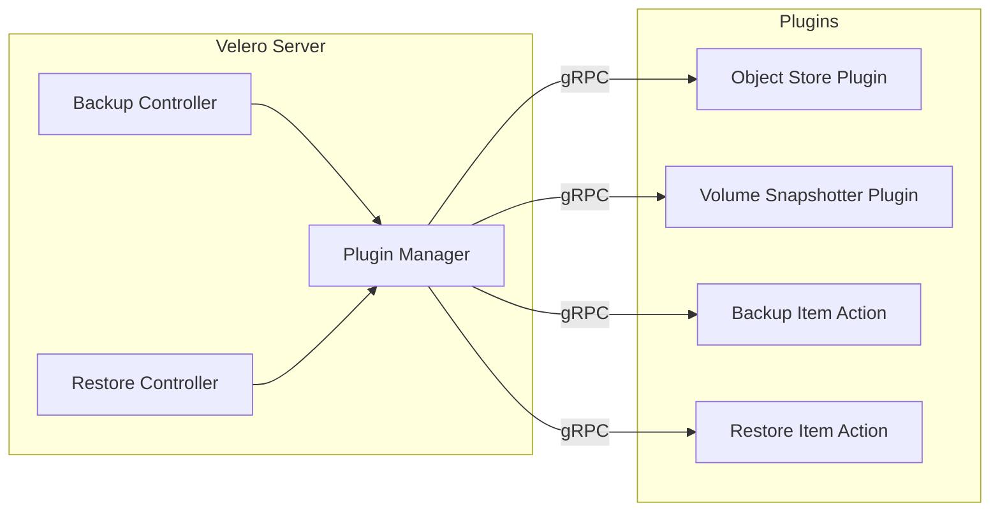
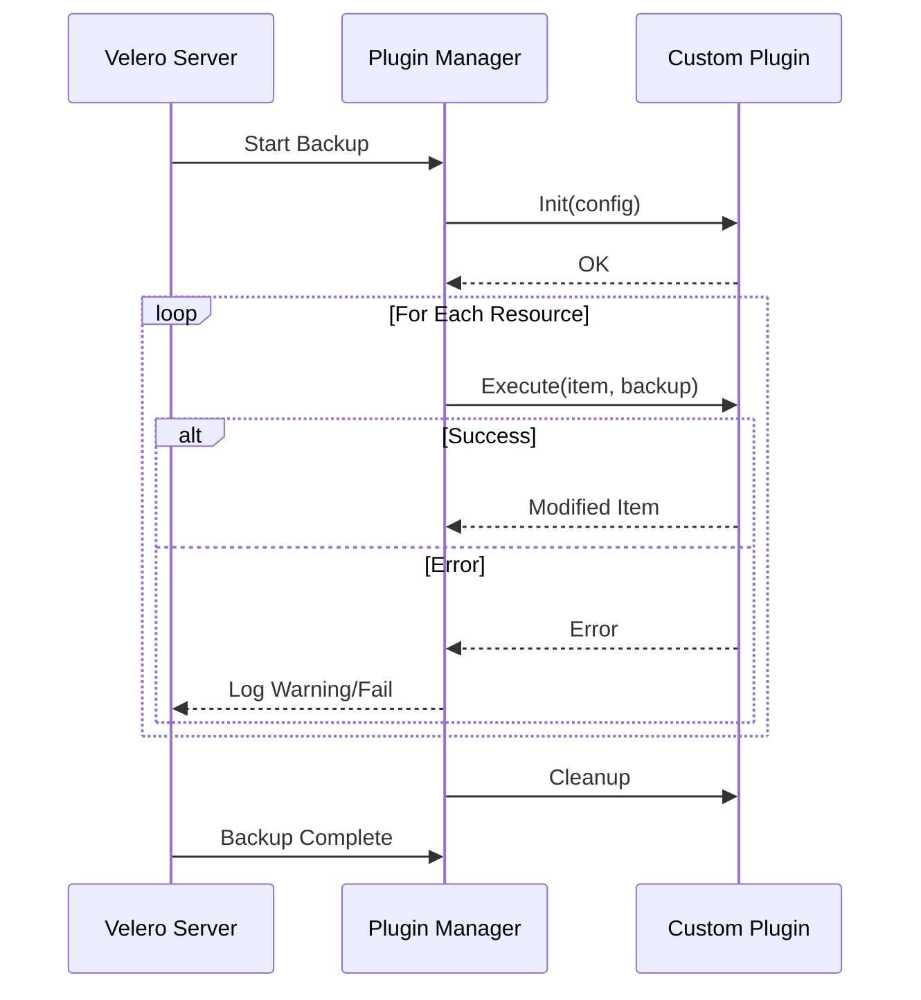

# How to Build Velero Custom Plugins

Author: [nawazdhandala](https://www.github.com/nawazdhandala)

Tags: Velero, Kubernetes, Backup, Plugin Development, Go

Description: Learn how to extend Velero's backup and restore capabilities by building custom plugins for object stores, volume snapshotters, and backup item actions.

---

Velero provides a robust plugin system that allows you to extend its functionality beyond the built-in features. Whether you need to integrate with a proprietary storage backend, add custom transformation logic during backups, or implement specialized restore procedures, custom plugins give you the flexibility to adapt Velero to your specific requirements.

## Understanding Velero's Plugin Architecture

Velero uses a gRPC-based plugin system that communicates with external processes. This design provides isolation between the core Velero server and your custom code, allowing plugins to be developed, deployed, and updated independently.



## Plugin Types in Velero

Velero supports several plugin interfaces that you can implement:

- **ObjectStore**: Handles storage operations for backup files
- **VolumeSnapshotter**: Manages volume snapshot creation and restoration
- **BackupItemAction**: Modifies resources during backup
- **RestoreItemAction**: Modifies resources during restore
- **DeleteItemAction**: Handles cleanup when backups are deleted

## Setting Up Your Plugin Development Environment

Before building a plugin, you need to set up your Go development environment with the required dependencies.

```go
// go.mod - Plugin module configuration
module github.com/yourorg/velero-plugin-example

go 1.21

require (
    github.com/vmware-tanzu/velero v1.12.0
    github.com/sirupsen/logrus v1.9.3
    k8s.io/apimachinery v0.28.0
)
```

Create the basic project structure:

```bash
# Create the plugin project directory structure
mkdir -p velero-plugin-example/{objectstore,volumesnapshotter,backupitemaction}

# Initialize the Go module
cd velero-plugin-example
go mod init github.com/yourorg/velero-plugin-example
go mod tidy
```

## Building a Custom Object Store Plugin

The ObjectStore interface allows you to implement custom storage backends for Velero backups.

```go
// objectstore/custom_store.go
package objectstore

import (
    "io"
    "time"

    "github.com/sirupsen/logrus"
    veleroplugin "github.com/vmware-tanzu/velero/pkg/plugin/framework"
)

// CustomObjectStore implements the ObjectStore interface
// for a custom storage backend
type CustomObjectStore struct {
    log      logrus.FieldLogger
    config   map[string]string
    bucket   string
    endpoint string
}

// Init initializes the plugin with configuration from the BackupStorageLocation
func (c *CustomObjectStore) Init(config map[string]string) error {
    c.config = config
    c.bucket = config["bucket"]
    c.endpoint = config["endpoint"]

    c.log.WithFields(logrus.Fields{
        "bucket":   c.bucket,
        "endpoint": c.endpoint,
    }).Info("Initializing custom object store")

    // Perform any necessary connection setup here
    return nil
}

// PutObject uploads an object to the storage backend
func (c *CustomObjectStore) PutObject(bucket, key string, body io.Reader) error {
    c.log.WithFields(logrus.Fields{
        "bucket": bucket,
        "key":    key,
    }).Debug("Uploading object")

    // Implement your storage upload logic here
    // This could be writing to a custom API, proprietary storage, etc.
    return nil
}

// ObjectExists checks if an object exists in the storage backend
func (c *CustomObjectStore) ObjectExists(bucket, key string) (bool, error) {
    c.log.WithFields(logrus.Fields{
        "bucket": bucket,
        "key":    key,
    }).Debug("Checking object existence")

    // Implement existence check logic
    return true, nil
}

// GetObject retrieves an object from the storage backend
func (c *CustomObjectStore) GetObject(bucket, key string) (io.ReadCloser, error) {
    c.log.WithFields(logrus.Fields{
        "bucket": bucket,
        "key":    key,
    }).Debug("Retrieving object")

    // Implement your storage download logic here
    return nil, nil
}

// ListCommonPrefixes lists common prefixes (directories) in a bucket
func (c *CustomObjectStore) ListCommonPrefixes(bucket, prefix, delimiter string) ([]string, error) {
    c.log.WithFields(logrus.Fields{
        "bucket":    bucket,
        "prefix":    prefix,
        "delimiter": delimiter,
    }).Debug("Listing common prefixes")

    // Return list of prefixes
    return []string{}, nil
}

// ListObjects returns a list of objects in the bucket with the given prefix
func (c *CustomObjectStore) ListObjects(bucket, prefix string) ([]string, error) {
    c.log.WithFields(logrus.Fields{
        "bucket": bucket,
        "prefix": prefix,
    }).Debug("Listing objects")

    // Return list of object keys
    return []string{}, nil
}

// DeleteObject removes an object from the storage backend
func (c *CustomObjectStore) DeleteObject(bucket, key string) error {
    c.log.WithFields(logrus.Fields{
        "bucket": bucket,
        "key":    key,
    }).Debug("Deleting object")

    // Implement deletion logic
    return nil
}

// CreateSignedURL generates a pre-signed URL for temporary access
func (c *CustomObjectStore) CreateSignedURL(bucket, key string, ttl time.Duration) (string, error) {
    c.log.WithFields(logrus.Fields{
        "bucket": bucket,
        "key":    key,
        "ttl":    ttl,
    }).Debug("Creating signed URL")

    // Generate and return a signed URL
    return "", nil
}
```

## Building a Backup Item Action Plugin

Backup Item Actions allow you to modify resources as they are backed up. This is useful for adding annotations, transforming data, or including additional related resources.

```go
// backupitemaction/secret_encryptor.go
package backupitemaction

import (
    "encoding/base64"

    "github.com/sirupsen/logrus"
    "github.com/vmware-tanzu/velero/pkg/plugin/velero"
    corev1api "k8s.io/api/core/v1"
    "k8s.io/apimachinery/pkg/apis/meta/v1/unstructured"
    "k8s.io/apimachinery/pkg/runtime"
)

// SecretEncryptorAction encrypts secrets during backup
// for additional security in transit and at rest
type SecretEncryptorAction struct {
    log           logrus.FieldLogger
    encryptionKey []byte
}

// AppliesTo returns the resources this action should process
func (s *SecretEncryptorAction) AppliesTo() (velero.ResourceSelector, error) {
    return velero.ResourceSelector{
        IncludedResources: []string{"secrets"},
    }, nil
}

// Execute processes each secret during backup
func (s *SecretEncryptorAction) Execute(
    item runtime.Unstructured,
    backup *velero.Backup,
) (runtime.Unstructured, []velero.ResourceIdentifier, error) {

    s.log.Info("Processing secret for backup")

    // Convert the unstructured item to a Secret
    secret := new(corev1api.Secret)
    if err := runtime.DefaultUnstructuredConverter.FromUnstructured(
        item.UnstructuredContent(),
        secret,
    ); err != nil {
        return nil, nil, err
    }

    // Add a backup annotation
    if secret.Annotations == nil {
        secret.Annotations = make(map[string]string)
    }
    secret.Annotations["velero.io/backup-timestamp"] = backup.Status.StartTimestamp.String()

    // Encrypt each secret data field
    for key, value := range secret.Data {
        encrypted := s.encryptData(value)
        secret.Data[key] = encrypted
        s.log.WithField("key", key).Debug("Encrypted secret data")
    }

    // Convert back to unstructured
    secretMap, err := runtime.DefaultUnstructuredConverter.ToUnstructured(secret)
    if err != nil {
        return nil, nil, err
    }

    return &unstructured.Unstructured{Object: secretMap}, nil, nil
}

// encryptData encrypts the data using the configured encryption key
func (s *SecretEncryptorAction) encryptData(data []byte) []byte {
    // This is a placeholder - use proper encryption in production
    // Consider using AES-GCM or similar authenticated encryption
    encoded := base64.StdEncoding.EncodeToString(data)
    return []byte(encoded)
}
```

## Creating the Plugin Main Entry Point

The main.go file serves as the entry point that registers all your plugins with Velero.

```go
// main.go
package main

import (
    "github.com/sirupsen/logrus"
    "github.com/vmware-tanzu/velero/pkg/plugin/framework"

    "github.com/yourorg/velero-plugin-example/backupitemaction"
    "github.com/yourorg/velero-plugin-example/objectstore"
)

func main() {
    // Create a new plugin server with the plugin name
    // This name must match what you configure in Velero
    framework.NewServer().
        // Register the object store plugin
        RegisterObjectStore(
            "yourorg.io/custom-object-store",
            newCustomObjectStore,
        ).
        // Register the backup item action plugin
        RegisterBackupItemAction(
            "yourorg.io/secret-encryptor",
            newSecretEncryptorAction,
        ).
        Serve()
}

// Factory function for the object store plugin
func newCustomObjectStore(logger logrus.FieldLogger) (interface{}, error) {
    return &objectstore.CustomObjectStore{}, nil
}

// Factory function for the backup item action plugin
func newSecretEncryptorAction(logger logrus.FieldLogger) (interface{}, error) {
    return &backupitemaction.SecretEncryptorAction{}, nil
}
```

## Building and Packaging the Plugin

Create a Dockerfile to build and package your plugin:

```dockerfile
# Dockerfile for building the Velero plugin
FROM golang:1.21-alpine AS builder

# Install build dependencies
RUN apk add --no-cache git make

WORKDIR /go/src/github.com/yourorg/velero-plugin-example

# Copy go mod files first for better caching
COPY go.mod go.sum ./
RUN go mod download

# Copy source code and build
COPY . .
RUN CGO_ENABLED=0 GOOS=linux go build -o /output/velero-plugin-example .

# Final image - uses Velero's plugin base image
FROM velero/velero-plugin-for-aws:v1.8.0 AS base

# Copy our plugin binary to the plugins directory
COPY --from=builder /output/velero-plugin-example /plugins/

# The entrypoint is inherited from the base image
USER 65532:65532
```

Build and push the image:

```bash
# Build the plugin container image
docker build -t yourregistry/velero-plugin-example:v1.0.0 .

# Push to your container registry
docker push yourregistry/velero-plugin-example:v1.0.0
```

## Deploying the Custom Plugin

Configure Velero to use your custom plugin by adding it to the Velero deployment:

```yaml
# velero-deployment-patch.yaml
apiVersion: apps/v1
kind: Deployment
metadata:
  name: velero
  namespace: velero
spec:
  template:
    spec:
      # Init container copies plugin binary to shared volume
      initContainers:
      - name: custom-plugin
        image: yourregistry/velero-plugin-example:v1.0.0
        imagePullPolicy: Always
        volumeMounts:
        - name: plugins
          mountPath: /target
        # Copy the plugin binary to the plugins directory
        command:
        - /bin/sh
        - -c
        - cp /plugins/* /target/
      containers:
      - name: velero
        # Add the plugin directory to the args
        args:
        - server
        - --features=EnableCSI
        volumeMounts:
        - name: plugins
          mountPath: /plugins
      volumes:
      - name: plugins
        emptyDir: {}
```

Create a BackupStorageLocation that uses your custom object store:

```yaml
# custom-backup-storage-location.yaml
apiVersion: velero.io/v1
kind: BackupStorageLocation
metadata:
  name: custom-storage
  namespace: velero
spec:
  # Reference your custom plugin
  provider: yourorg.io/custom-object-store
  objectStorage:
    bucket: my-backup-bucket
  config:
    endpoint: "https://storage.example.com"
    region: "us-east-1"
```

## Testing Your Plugin

Create a simple test backup to verify your plugin works:

```bash
# Create a test namespace with some resources
kubectl create namespace plugin-test
kubectl create configmap test-config -n plugin-test --from-literal=key=value
kubectl create secret generic test-secret -n plugin-test --from-literal=password=secret123

# Create a backup using your custom storage location
velero backup create test-backup \
    --include-namespaces plugin-test \
    --storage-location custom-storage

# Check the backup status
velero backup describe test-backup --details

# View the plugin logs for debugging
kubectl logs -n velero deployment/velero -c velero | grep -i plugin
```

## Plugin Lifecycle and Error Handling



## Best Practices for Plugin Development

When building Velero plugins, keep these recommendations in mind:

**Implement Proper Error Handling**: Always return meaningful errors that help operators diagnose issues. Log extensively during development and keep important operational logs in production.

**Make Plugins Idempotent**: Your plugin actions should produce the same result when executed multiple times. This is crucial for retry scenarios and partial failures.

**Handle Large Resources**: When processing large ConfigMaps, Secrets, or other resources, stream data rather than loading everything into memory.

**Version Your Plugins**: Use semantic versioning and maintain compatibility with multiple Velero versions when possible.

```go
// Example of robust error handling in a plugin
func (p *MyPlugin) Execute(item runtime.Unstructured, backup *velero.Backup) (runtime.Unstructured, []velero.ResourceIdentifier, error) {
    // Log the start of processing with context
    p.log.WithFields(logrus.Fields{
        "kind":      item.GetObjectKind().GroupVersionKind().Kind,
        "name":      item.GetName(),
        "namespace": item.GetNamespace(),
    }).Info("Processing resource")

    // Wrap errors with context for easier debugging
    result, err := p.processItem(item)
    if err != nil {
        return nil, nil, fmt.Errorf("failed to process %s/%s: %w",
            item.GetNamespace(), item.GetName(), err)
    }

    return result, nil, nil
}
```

---

Building custom Velero plugins opens up possibilities for integrating with any storage backend or implementing specialized backup and restore logic for your Kubernetes workloads. By following the plugin interfaces and best practices outlined here, you can extend Velero to meet your organization's specific requirements while maintaining the reliability that production backup systems demand. Start with a simple plugin, test thoroughly in a non-production environment, and iterate based on your operational needs.
