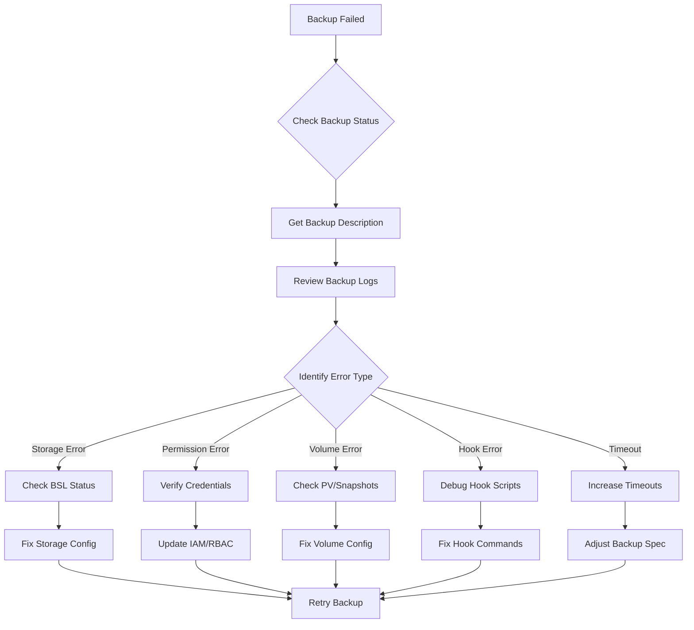

# How to Debug Velero Backup Failures

Author: [nawazdhandala](https://www.github.com/nawazdhandala)

Tags: Velero, Kubernetes, Backup, Troubleshooting, Debugging

Description: A practical guide to diagnosing and resolving common Velero backup failures including storage issues, permission errors, and volume snapshot problems.

---

When Velero backups fail, quick diagnosis and resolution are critical to maintaining your disaster recovery capabilities. This guide covers systematic approaches to identifying backup failures, understanding error messages, and implementing fixes for the most common issues encountered in production environments.

## Backup Failure Investigation Workflow

Follow a structured approach when investigating backup failures.



## Initial Diagnosis Commands

Start with these commands to gather information about the failure:

```bash
# List all backups and their status
velero backup get

# Get detailed information about a specific failed backup
velero backup describe failed-backup-name --details

# View the backup logs for error messages
velero backup logs failed-backup-name

# Check the Velero server logs for additional context
kubectl logs -n velero deployment/velero --tail=500

# Check for any Kubernetes events related to Velero
kubectl get events -n velero --sort-by='.lastTimestamp' | tail -20

# Check backup storage location status
velero backup-location get
```

## Storage-Related Failures

Storage issues are among the most common causes of backup failures.

### Backup Storage Location Unavailable

```bash
# Check BSL status
velero backup-location get

# Output showing unavailable BSL:
# NAME      PROVIDER   BUCKET              PHASE         LAST VALIDATED
# default   aws        velero-backups      Unavailable   2024-01-28 10:00:00

# Describe the BSL for more details
kubectl describe backupstoragelocation default -n velero

# Common causes:
# 1. Invalid credentials
# 2. Bucket does not exist
# 3. Network connectivity issues
# 4. Incorrect region configuration
```

### Fixing AWS S3 Storage Issues

```bash
# Verify the bucket exists and is accessible
aws s3 ls s3://velero-backups

# Check IAM permissions
aws sts get-caller-identity

# Test write access
aws s3 cp /tmp/test.txt s3://velero-backups/test.txt
aws s3 rm s3://velero-backups/test.txt

# If credentials are expired, update the secret
kubectl create secret generic cloud-credentials \
    -n velero \
    --from-file=cloud=./credentials-velero \
    --dry-run=client -o yaml | kubectl apply -f -

# Restart Velero to pick up new credentials
kubectl rollout restart deployment/velero -n velero
```

### Fixing Azure Storage Issues

```bash
# Check if storage account is accessible
az storage account show --name velerobackupsprod --resource-group velero-rg

# Verify container exists
az storage container show --name velero --account-name velerobackupsprod

# Test blob access
az storage blob list --container-name velero --account-name velerobackupsprod --num-results 1

# Update credentials if needed
kubectl create secret generic cloud-credentials \
    -n velero \
    --from-file=cloud=./credentials-velero-azure \
    --dry-run=client -o yaml | kubectl apply -f -
```

### Fixing GCP Storage Issues

```bash
# Verify bucket access
gsutil ls gs://velero-backups

# Check service account permissions
gcloud projects get-iam-policy PROJECT_ID \
    --flatten="bindings[].members" \
    --filter="bindings.members:serviceAccount:velero@PROJECT_ID.iam.gserviceaccount.com"

# Test write access
echo "test" | gsutil cp - gs://velero-backups/test.txt
gsutil rm gs://velero-backups/test.txt

# Regenerate service account key if needed
gcloud iam service-accounts keys create new-key.json \
    --iam-account velero@PROJECT_ID.iam.gserviceaccount.com

# Update the secret
kubectl create secret generic cloud-credentials \
    -n velero \
    --from-file=cloud=./new-key.json \
    --dry-run=client -o yaml | kubectl apply -f -
```

## Permission and RBAC Errors

Velero needs proper Kubernetes RBAC permissions to backup all resources.

### Diagnosing Permission Issues

```bash
# Check Velero service account permissions
kubectl auth can-i --list --as=system:serviceaccount:velero:velero

# Look for permission denied errors in logs
velero backup logs failed-backup | grep -i "forbidden\|denied\|permission"

# Common error pattern:
# level=error msg="Error getting resource" error="secrets is forbidden:
# User \"system:serviceaccount:velero:velero\" cannot list resource
# \"secrets\" in API group \"\" at the cluster scope"
```

### Fixing RBAC Issues

```yaml
# velero-rbac-fix.yaml
apiVersion: rbac.authorization.k8s.io/v1
kind: ClusterRole
metadata:
  name: velero-extended
rules:
  # Add permissions for resources that failed
  - apiGroups: [""]
    resources: ["secrets", "configmaps", "persistentvolumeclaims"]
    verbs: ["get", "list", "watch", "create", "update", "patch", "delete"]
  - apiGroups: ["apps"]
    resources: ["deployments", "statefulsets", "daemonsets", "replicasets"]
    verbs: ["get", "list", "watch", "create", "update", "patch", "delete"]
  # Add custom resource permissions if needed
  - apiGroups: ["your.custom.api"]
    resources: ["customresources"]
    verbs: ["get", "list", "watch", "create", "update", "patch", "delete"]
---
apiVersion: rbac.authorization.k8s.io/v1
kind: ClusterRoleBinding
metadata:
  name: velero-extended
subjects:
  - kind: ServiceAccount
    name: velero
    namespace: velero
roleRef:
  kind: ClusterRole
  name: velero-extended
  apiGroup: rbac.authorization.k8s.io
```

```bash
# Apply the RBAC fix
kubectl apply -f velero-rbac-fix.yaml

# Verify permissions
kubectl auth can-i list secrets --as=system:serviceaccount:velero:velero
```

## Volume Snapshot Failures

Volume snapshots can fail due to various reasons including CSI driver issues and storage class problems.

### Diagnosing Volume Snapshot Issues

```bash
# Check if volume snapshots are being created
kubectl get volumesnapshots -A

# Look for snapshot-related errors
velero backup logs failed-backup | grep -i "snapshot\|volume\|pvc"

# Check VolumeSnapshotLocation configuration
velero snapshot-location get

# Examine CSI driver status
kubectl get pods -n kube-system | grep csi

# Check for CSI driver errors
kubectl logs -n kube-system -l app=csi-controller --tail=100
```

### Common Volume Snapshot Fixes

```yaml
# volume-snapshot-class.yaml
# Ensure VolumeSnapshotClass exists and is properly configured
apiVersion: snapshot.storage.k8s.io/v1
kind: VolumeSnapshotClass
metadata:
  name: velero-snapshot-class
  labels:
    velero.io/csi-volumesnapshot-class: "true"
driver: ebs.csi.aws.com  # Match your CSI driver
deletionPolicy: Delete
parameters:
  # Add any provider-specific parameters
```

```bash
# If using file system backup instead of snapshots
velero backup create backup-with-fs \
    --include-namespaces application \
    --default-volumes-to-fs-backup

# Opt specific PVCs into file system backup via annotation
kubectl annotate pvc data-pvc backup.velero.io/backup-volumes=data-pvc -n application
```

### Handling Stuck Snapshots

```bash
# Find stuck snapshots
kubectl get volumesnapshots -A | grep -v "true"

# Delete stuck snapshot
kubectl delete volumesnapshot stuck-snapshot -n namespace

# If snapshot content is stuck
kubectl get volumesnapshotcontents | grep -v "true"
kubectl delete volumesnapshotcontent stuck-content

# Force delete if normal deletion hangs
kubectl patch volumesnapshotcontent stuck-content \
    -p '{"metadata":{"finalizers":null}}' --type=merge
```

## Hook Execution Failures

Backup and restore hooks can fail, causing partial or complete backup failures.

### Debugging Hook Failures

```bash
# Check for hook errors in backup logs
velero backup logs failed-backup | grep -i "hook"

# Common hook error patterns:
# "error running pre backup hook"
# "hook command failed with exit code 1"
# "hook timed out"

# View hook annotations on affected pods
kubectl get pod problematic-pod -n namespace -o yaml | grep -A5 "hook.backup.velero.io"
```

### Testing Hooks Manually

```bash
# Get the exact hook command from pod annotations
HOOK_CMD=$(kubectl get pod database-pod -n database \
    -o jsonpath='{.metadata.annotations.pre\.hook\.backup\.velero\.io/command}')

echo "Hook command: $HOOK_CMD"

# Test the hook command directly
kubectl exec -n database database-pod -- /bin/sh -c "$HOOK_CMD"

# Check exit code
echo "Exit code: $?"
```

### Fixing Common Hook Issues

```yaml
# Common fix: Increase hook timeout
apiVersion: apps/v1
kind: Deployment
metadata:
  name: database
spec:
  template:
    metadata:
      annotations:
        # Increase timeout for slow database operations
        pre.hook.backup.velero.io/timeout: 300s
        # Change error handling if hook is non-critical
        pre.hook.backup.velero.io/on-error: Continue
        # Ensure correct container is targeted
        pre.hook.backup.velero.io/container: database
```

## Timeout and Resource Issues

Large backups or resource-constrained environments can cause timeouts.

### Identifying Timeout Issues

```bash
# Check for timeout errors
velero backup logs timed-out-backup | grep -i "timeout\|deadline"

# Check Velero resource usage
kubectl top pod -n velero

# View current timeout settings
kubectl get deployment velero -n velero -o yaml | grep -A5 "args:"
```

### Adjusting Timeouts and Resources

```yaml
# velero-deployment-resources.yaml
apiVersion: apps/v1
kind: Deployment
metadata:
  name: velero
  namespace: velero
spec:
  template:
    spec:
      containers:
      - name: velero
        args:
          - server
          - --features=EnableCSI
          # Increase default timeout for large backups
          - --default-backup-ttl=720h
          - --resource-timeout=10m
          - --default-item-operation-timeout=4h
        resources:
          requests:
            memory: "512Mi"
            cpu: "500m"
          limits:
            memory: "2Gi"
            cpu: "2000m"
```

### Splitting Large Backups

```bash
# Instead of one large backup, create multiple smaller ones
# By namespace
velero backup create app-tier-backup \
    --include-namespaces app-frontend,app-backend \
    --ttl 168h

velero backup create data-tier-backup \
    --include-namespaces databases,cache \
    --ttl 168h

# By label selector
velero backup create critical-apps \
    --selector priority=critical \
    --ttl 168h

velero backup create standard-apps \
    --selector priority=standard \
    --ttl 168h
```

## Network and Connectivity Issues

Network problems can prevent Velero from reaching storage or snapshotting volumes.

### Diagnosing Network Issues

```bash
# Test network connectivity from Velero pod
kubectl exec -n velero deployment/velero -- wget -O- https://s3.amazonaws.com --timeout=10

# Check for network policies blocking traffic
kubectl get networkpolicies -n velero

# Test DNS resolution
kubectl exec -n velero deployment/velero -- nslookup s3.amazonaws.com

# Check if proxy settings are needed
kubectl get deployment velero -n velero -o yaml | grep -i proxy
```

### Fixing Network Configuration

```yaml
# velero-network-policy.yaml
apiVersion: networking.k8s.io/v1
kind: NetworkPolicy
metadata:
  name: velero-egress
  namespace: velero
spec:
  podSelector:
    matchLabels:
      app.kubernetes.io/name: velero
  policyTypes:
    - Egress
  egress:
    # Allow DNS
    - to: []
      ports:
        - protocol: UDP
          port: 53
    # Allow HTTPS to storage
    - to: []
      ports:
        - protocol: TCP
          port: 443
```

```yaml
# Add proxy configuration if needed
# velero-proxy-config.yaml
apiVersion: apps/v1
kind: Deployment
metadata:
  name: velero
  namespace: velero
spec:
  template:
    spec:
      containers:
      - name: velero
        env:
          - name: HTTP_PROXY
            value: "http://proxy.example.com:8080"
          - name: HTTPS_PROXY
            value: "http://proxy.example.com:8080"
          - name: NO_PROXY
            value: "10.0.0.0/8,172.16.0.0/12,192.168.0.0/16,.cluster.local"
```

## Creating a Troubleshooting Runbook

Document common issues and fixes for your team:

```bash
#!/bin/bash
# velero-troubleshoot.sh
# Automated troubleshooting script for Velero backups

BACKUP_NAME=$1

if [ -z "$BACKUP_NAME" ]; then
    echo "Usage: $0 <backup-name>"
    exit 1
fi

echo "=== Velero Backup Troubleshooting Report ==="
echo "Backup: $BACKUP_NAME"
echo "Generated: $(date)"
echo ""

echo "=== Backup Status ==="
velero backup describe $BACKUP_NAME

echo ""
echo "=== Backup Logs (last 50 lines) ==="
velero backup logs $BACKUP_NAME | tail -50

echo ""
echo "=== Error Summary ==="
velero backup logs $BACKUP_NAME | grep -i "error\|fail\|denied\|timeout" | head -20

echo ""
echo "=== Storage Location Status ==="
velero backup-location get

echo ""
echo "=== Velero Pod Status ==="
kubectl get pods -n velero

echo ""
echo "=== Recent Velero Events ==="
kubectl get events -n velero --sort-by='.lastTimestamp' | tail -10

echo ""
echo "=== Recommendations ==="
# Check for common issues and provide recommendations
if velero backup logs $BACKUP_NAME | grep -q "storage location"; then
    echo "- Check backup storage location credentials and connectivity"
fi

if velero backup logs $BACKUP_NAME | grep -q "timeout"; then
    echo "- Consider increasing timeout values or splitting the backup"
fi

if velero backup logs $BACKUP_NAME | grep -q "hook"; then
    echo "- Review and test backup hooks manually"
fi

if velero backup logs $BACKUP_NAME | grep -q "permission\|forbidden"; then
    echo "- Review RBAC permissions for Velero service account"
fi
```

---

Effective troubleshooting of Velero backup failures requires a systematic approach that examines storage connectivity, permissions, volume snapshots, hooks, and resource constraints. By maintaining detailed logs, implementing monitoring alerts, and documenting common issues, you can quickly identify and resolve backup failures before they impact your disaster recovery readiness. Regular backup testing in non-production environments helps catch configuration issues early and builds confidence in your backup strategy.
