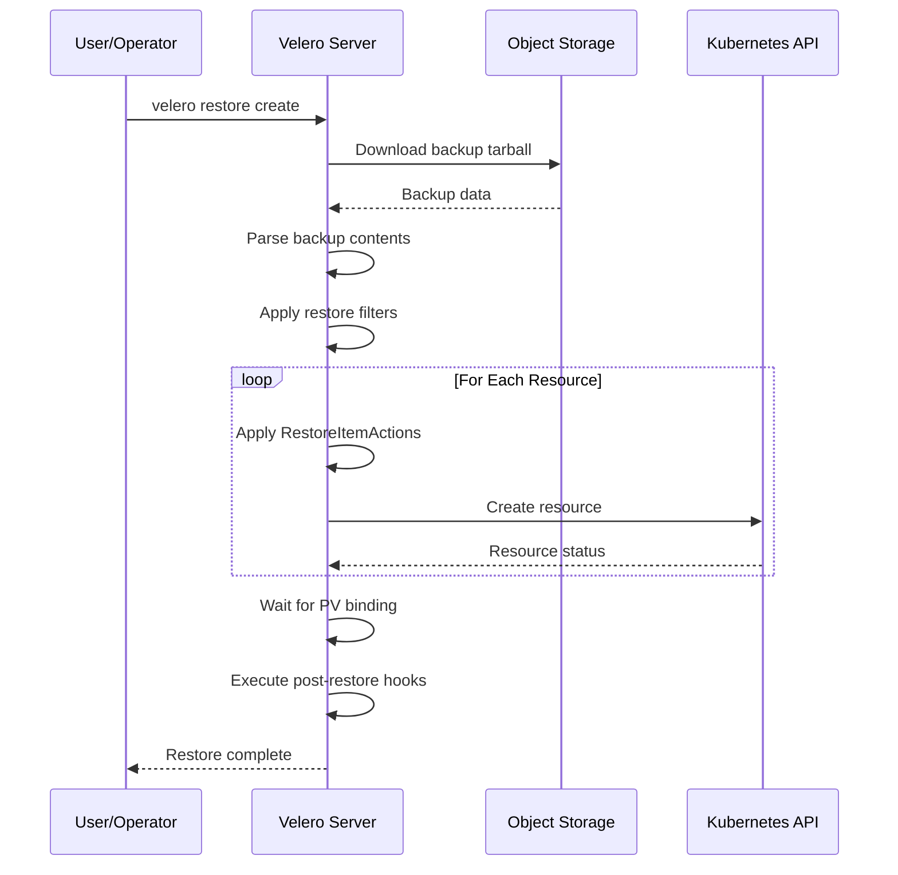
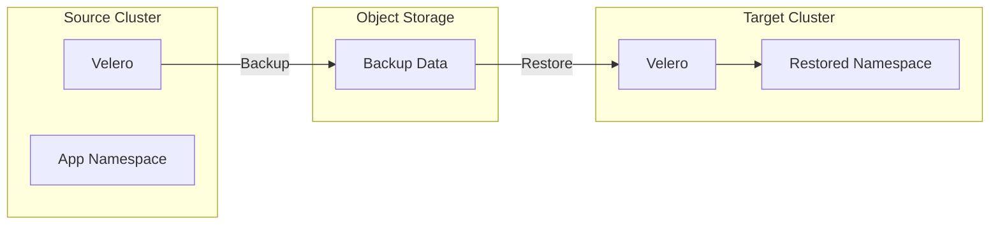
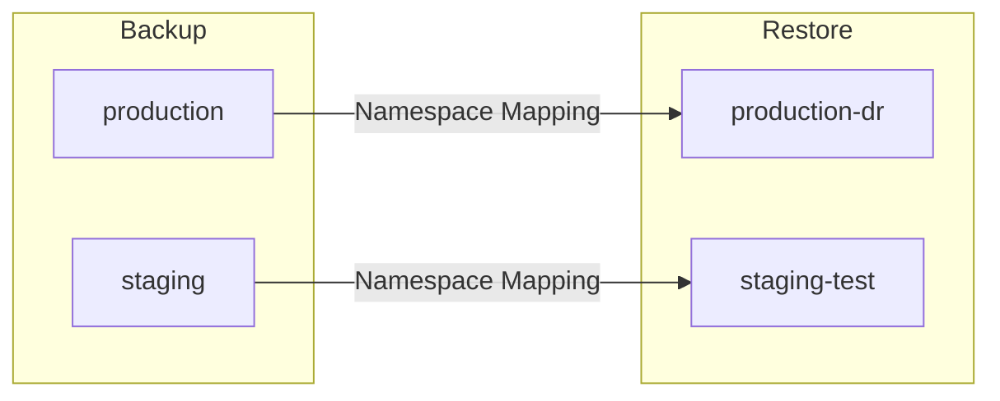

# How to Restore Kubernetes Applications with Velero

Author: [nawazdhandala](https://www.github.com/nawazdhandala)

Tags: Velero, Kubernetes, Backup, Disaster Recovery, Restore

Description: Learn how to restore Kubernetes applications, namespaces, and cluster resources using Velero with practical examples for various recovery scenarios.

---

Backups are only valuable when you can restore from them. Velero provides flexible restore capabilities that allow you to recover entire namespaces, specific resources, or even transform resources during restoration. Understanding these options helps you prepare for various disaster recovery scenarios and minimize downtime during incidents.

## Understanding Velero's Restore Process

When you initiate a restore, Velero follows a specific workflow to recreate your resources in the correct order with proper dependency handling.



## Basic Restore Operations

Start with fundamental restore commands that cover common scenarios.

### Restoring a Complete Backup

```bash
# List available backups to find the one you need
velero backup get

# View details of a specific backup
velero backup describe production-backup-20260128 --details

# Restore the entire backup to the same cluster
velero restore create --from-backup production-backup-20260128

# Watch restore progress
velero restore describe production-backup-20260128-restore --details

# Check restore logs for any issues
velero restore logs production-backup-20260128-restore
```

### Restoring Specific Namespaces

```bash
# Restore only specific namespaces from a cluster-wide backup
velero restore create namespace-restore \
    --from-backup full-cluster-backup \
    --include-namespaces app-production,app-staging

# Restore a namespace with a new name (useful for testing)
velero restore create test-restore \
    --from-backup production-backup \
    --include-namespaces production \
    --namespace-mappings production:production-test
```

### Restoring Specific Resources

```bash
# Restore only deployments and services
velero restore create partial-restore \
    --from-backup app-backup \
    --include-resources deployments,services

# Restore specific labeled resources
velero restore create labeled-restore \
    --from-backup app-backup \
    --selector app=frontend,tier=web

# Exclude certain resources from restore
velero restore create selective-restore \
    --from-backup full-backup \
    --exclude-resources persistentvolumeclaims,secrets
```

## Restoring to a Different Cluster

Cross-cluster restoration requires additional considerations for cluster-specific resources.



### Configuring the Target Cluster

```bash
# On the target cluster, configure Velero to read from the same storage
# but set to read-only mode to prevent accidental backup overwrites
velero install \
    --provider aws \
    --plugins velero/velero-plugin-for-aws:v1.8.0 \
    --bucket velero-backups-prod \
    --backup-location-config region=us-east-1 \
    --secret-file ./credentials-velero \
    --restore-only

# Or modify existing backup storage location
kubectl patch backupstoragelocation default \
    -n velero \
    --type merge \
    --patch '{"spec":{"accessMode":"ReadOnly"}}'
```

### Performing Cross-Cluster Restore

```bash
# Sync backup metadata from storage
velero backup get

# Restore with cluster-specific adjustments
velero restore create cross-cluster-restore \
    --from-backup source-cluster-backup \
    --include-namespaces application \
    --exclude-cluster-scoped-resources

# Map storage classes between clusters
velero restore create storage-mapped-restore \
    --from-backup backup-name \
    --include-namespaces data-tier \
    --storage-class-mappings gp2:standard-rwo,io1:premium-rwo
```

## Handling Persistent Volumes During Restore

Persistent volume restoration requires special attention to ensure data integrity and proper binding.

### Volume Restore Options

```yaml
# restore-with-volumes.yaml
apiVersion: velero.io/v1
kind: Restore
metadata:
  name: app-restore-with-volumes
  namespace: velero
spec:
  backupName: app-backup-with-snapshots
  includedNamespaces:
    - database
  # Restore PVs from snapshots
  restorePVs: true
  # Preserve the original node affinity
  preserveNodePorts: true
  # Wait for additional items to become ready
  itemOperationTimeout: 1h
```

### Restoring Volumes with File System Backup

```bash
# For backups that used file system backup (restic/kopia)
velero restore create fs-restore \
    --from-backup fs-backup \
    --include-namespaces stateful-apps

# Check volume restore progress
kubectl get podvolumerestores -n velero -w

# View detailed status of volume restores
velero restore describe fs-restore --details | grep -A 20 "Phase:"
```

### Handling Storage Class Differences

```bash
# When restoring to a cluster with different storage classes
velero restore create mapped-restore \
    --from-backup source-backup \
    --include-namespaces databases \
    --storage-class-mappings "aws-ebs-gp2:azure-disk-premium,aws-efs:azure-file"
```

## Resource Conflict Resolution

When restoring to a cluster with existing resources, you need a strategy for handling conflicts.

### Restore Policy Options

```bash
# Default behavior - skip existing resources
velero restore create safe-restore \
    --from-backup backup-name \
    --existing-resource-policy none

# Update existing resources (merge)
velero restore create update-restore \
    --from-backup backup-name \
    --existing-resource-policy update

# Use restore item actions to handle specific conflicts
velero restore create custom-restore \
    --from-backup backup-name \
    --include-namespaces application
```

### Selective Resource Updates

```yaml
# restore-with-policy.yaml
apiVersion: velero.io/v1
kind: Restore
metadata:
  name: selective-update-restore
  namespace: velero
spec:
  backupName: application-backup
  includedNamespaces:
    - production
  # Only restore specific resource types
  includedResources:
    - configmaps
    - secrets
    - deployments
  # Update existing resources
  existingResourcePolicy: update
  # Exclude certain resources that should not be overwritten
  excludedResources:
    - persistentvolumeclaims
```

## Partial Restore Scenarios

Real-world recovery often requires restoring only portions of an application.

### Restoring Configuration Only

```bash
# Restore only ConfigMaps and Secrets (configuration data)
velero restore create config-restore \
    --from-backup full-backup \
    --include-namespaces application \
    --include-resources configmaps,secrets

# Verify restored configurations
kubectl get configmaps -n application
kubectl get secrets -n application
```

### Restoring Workloads Without Data

```bash
# Restore Deployments and Services but not PVCs
# Useful when you want to connect to existing databases
velero restore create workload-restore \
    --from-backup full-backup \
    --include-namespaces application \
    --include-resources deployments,services,ingresses \
    --exclude-resources persistentvolumeclaims,persistentvolumes
```

### Single Resource Restore

```bash
# For surgical restoration of specific resources
# First, extract the backup to examine contents
velero backup download backup-name

# Extract and examine
tar -xvf backup-name.tar.gz
ls backup-name/resources/

# Restore only specific resources using labels
velero restore create single-deployment-restore \
    --from-backup full-backup \
    --include-namespaces production \
    --include-resources deployments \
    --selector app=critical-service
```

## Namespace Transformation During Restore

Namespace mappings allow you to restore resources to different namespaces.



```bash
# Restore production to a DR namespace
velero restore create dr-restore \
    --from-backup production-backup \
    --include-namespaces production,monitoring \
    --namespace-mappings production:production-dr,monitoring:monitoring-dr

# Restore for testing in isolated namespace
velero restore create test-restore \
    --from-backup production-backup \
    --include-namespaces production \
    --namespace-mappings production:testing-$(date +%Y%m%d)
```

## Post-Restore Verification

Always verify that restored applications are functioning correctly.

```bash
#!/bin/bash
# post-restore-verification.sh
# Script to verify restore completion and application health

RESTORE_NAME=$1
NAMESPACE=$2

echo "Checking restore status..."
velero restore describe $RESTORE_NAME

# Wait for restore to complete
while true; do
    STATUS=$(velero restore get $RESTORE_NAME -o jsonpath='{.status.phase}')
    if [ "$STATUS" == "Completed" ] || [ "$STATUS" == "PartiallyFailed" ]; then
        echo "Restore finished with status: $STATUS"
        break
    fi
    echo "Restore status: $STATUS - waiting..."
    sleep 10
done

# Check for any warnings or errors
echo "Checking restore logs for issues..."
velero restore logs $RESTORE_NAME | grep -E "(error|warning|failed)" || echo "No errors found"

# Verify pods are running
echo "Verifying pod status in $NAMESPACE..."
kubectl get pods -n $NAMESPACE
kubectl wait --for=condition=Ready pods --all -n $NAMESPACE --timeout=300s

# Check PVC bindings
echo "Verifying PVC bindings..."
kubectl get pvc -n $NAMESPACE

# Run application-specific health checks
echo "Running application health checks..."
kubectl get endpoints -n $NAMESPACE | grep -v "none"

# Summary
echo "=== Restore Summary ==="
velero restore describe $RESTORE_NAME --details | tail -30
```

## Restore Troubleshooting

Common issues and their solutions during restore operations.

### Debugging Failed Restores

```bash
# Get detailed restore information
velero restore describe failed-restore --details

# Check restore logs for errors
velero restore logs failed-restore

# Look for partial failures
velero restore describe failed-restore -o yaml | grep -A 10 "warnings:"

# Check Velero server logs
kubectl logs -n velero deployment/velero --tail=100

# Examine specific resource failures
kubectl get events -n velero --sort-by='.lastTimestamp'
```

### Common Restore Issues

```yaml
# Issue: PVC stuck in Pending
# Solution: Check storage class mapping
apiVersion: velero.io/v1
kind: Restore
metadata:
  name: fix-storage-class
  namespace: velero
spec:
  backupName: backup-name
  # Map old storage class to one that exists in target cluster
  storageClassMapping:
    old-storage-class: new-storage-class
---
# Issue: Resources not being restored due to conflicts
# Solution: Check existing resources and decide on policy
# First, backup existing state
# kubectl get all -n namespace -o yaml > existing-state.yaml
# Then restore with update policy
apiVersion: velero.io/v1
kind: Restore
metadata:
  name: force-update-restore
  namespace: velero
spec:
  backupName: backup-name
  existingResourcePolicy: update
```

### Validating Data Integrity

```bash
# For database applications, validate data after restore
# Example: PostgreSQL data verification

# Get pod name
PG_POD=$(kubectl get pod -n database -l app=postgresql -o jsonpath='{.items[0].metadata.name}')

# Connect and verify data
kubectl exec -n database $PG_POD -- psql -U postgres -c "SELECT COUNT(*) FROM important_table;"

# Compare with expected count from backup metadata
velero backup describe backup-name --details | grep "items backed up"
```

## Automating Restore Testing

Regular restore testing ensures your backup strategy actually works.

```yaml
# restore-test-cronjob.yaml
apiVersion: batch/v1
kind: CronJob
metadata:
  name: weekly-restore-test
  namespace: velero
spec:
  # Run every Sunday at 2 AM
  schedule: "0 2 * * 0"
  jobTemplate:
    spec:
      template:
        spec:
          serviceAccountName: velero
          containers:
          - name: restore-test
            image: velero/velero:v1.12.0
            command:
            - /bin/sh
            - -c
            - |
              # Find latest backup
              BACKUP=$(velero backup get -o json | jq -r '.items | sort_by(.metadata.creationTimestamp) | last | .metadata.name')

              # Create test restore
              velero restore create test-restore-$(date +%Y%m%d) \
                --from-backup $BACKUP \
                --include-namespaces test-app \
                --namespace-mappings test-app:restore-test-$(date +%Y%m%d)

              # Wait and verify
              sleep 300
              kubectl get pods -n restore-test-$(date +%Y%m%d)

              # Cleanup test namespace
              kubectl delete namespace restore-test-$(date +%Y%m%d)
          restartPolicy: OnFailure
```

---

Mastering Velero restore operations is essential for maintaining business continuity. Whether you need to recover from a complete cluster failure, restore a single misconfigured application, or migrate workloads between clusters, understanding the various restore options and their implications ensures you can respond effectively to any recovery scenario. Regular restore testing validates your backup strategy and builds confidence in your disaster recovery capabilities.
