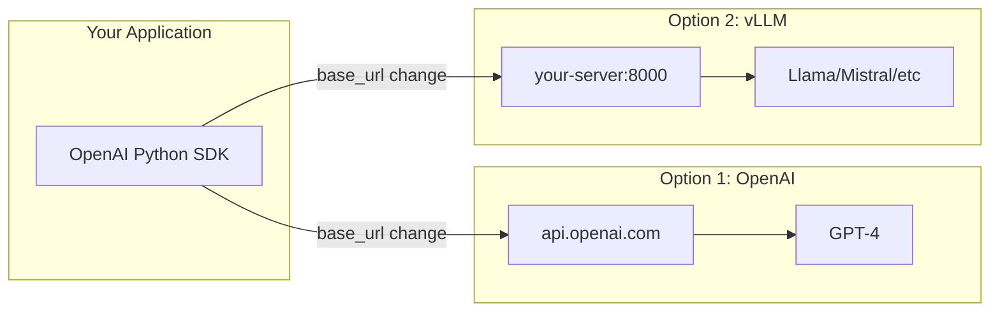
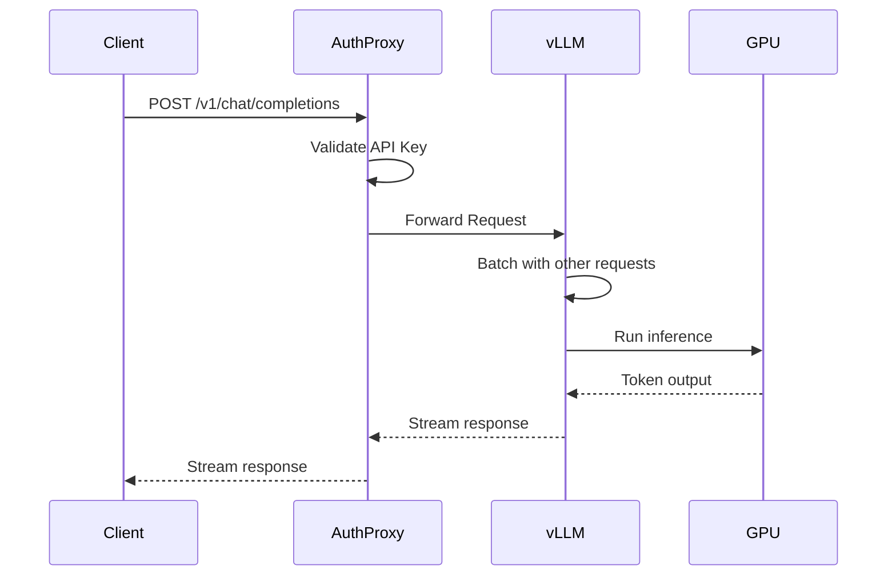

# How to Implement vLLM with OpenAI-Compatible API

Author: [nawazdhandala](https://www.github.com/nawazdhandala)

Tags: vLLM, OpenAI, LLM, AI/ML, API, Inference

Description: Learn how to deploy vLLM as a drop-in replacement for OpenAI API with high-throughput inference for production workloads.

---

vLLM is a high-throughput inference engine that can serve open-source LLMs with an OpenAI-compatible API. This means you can swap out OpenAI for a self-hosted solution without changing your application code. This guide covers installation, configuration, and production deployment patterns.

## Why vLLM for OpenAI API Compatibility

The value proposition is straightforward: use the same client libraries and code you wrote for OpenAI, but point them at your own infrastructure running open-source models.



## Installing vLLM

vLLM requires a CUDA-capable GPU. Here are the installation options:

```bash
# Option 1: pip install (requires CUDA 11.8 or 12.1)
pip install vllm

# Option 2: From source for latest features
git clone https://github.com/vllm-project/vllm.git
cd vllm
pip install -e .

# Option 3: Docker (recommended for production)
docker pull vllm/vllm-openai:latest

# Verify installation
python -c "import vllm; print(vllm.__version__)"
```

## Starting the OpenAI-Compatible Server

Launch vLLM with the OpenAI-compatible API endpoint:

```bash
# Basic launch with Llama 3.2
python -m vllm.entrypoints.openai.api_server \
    --model meta-llama/Llama-3.2-3B-Instruct \
    --host 0.0.0.0 \
    --port 8000

# With GPU memory optimization
python -m vllm.entrypoints.openai.api_server \
    --model meta-llama/Llama-3.2-3B-Instruct \
    --host 0.0.0.0 \
    --port 8000 \
    --gpu-memory-utilization 0.9 \
    --max-model-len 4096

# Multi-GPU with tensor parallelism
python -m vllm.entrypoints.openai.api_server \
    --model meta-llama/Llama-3.2-70B-Instruct \
    --tensor-parallel-size 4 \
    --host 0.0.0.0 \
    --port 8000
```

## Using with OpenAI Python SDK

The entire point is compatibility. Here is how to switch your existing code:

```python
from openai import OpenAI

# Point to your vLLM server instead of OpenAI
client = OpenAI(
    base_url="http://localhost:8000/v1",
    api_key="not-needed"  # vLLM doesn't require auth by default
)

# Chat completions work exactly like OpenAI
response = client.chat.completions.create(
    model="meta-llama/Llama-3.2-3B-Instruct",
    messages=[
        {"role": "system", "content": "You are a helpful assistant."},
        {"role": "user", "content": "Explain container orchestration."}
    ],
    temperature=0.7,
    max_tokens=500
)

print(response.choices[0].message.content)

# Streaming also works
stream = client.chat.completions.create(
    model="meta-llama/Llama-3.2-3B-Instruct",
    messages=[{"role": "user", "content": "Write a haiku about Kubernetes"}],
    stream=True
)

for chunk in stream:
    if chunk.choices[0].delta.content:
        print(chunk.choices[0].delta.content, end="", flush=True)
```

## Completions API (Legacy Format)

vLLM also supports the older completions endpoint:

```python
# Text completions (non-chat format)
response = client.completions.create(
    model="meta-llama/Llama-3.2-3B-Instruct",
    prompt="The three pillars of observability are:",
    max_tokens=200,
    temperature=0.5
)

print(response.choices[0].text)
```

## Production Configuration

For production deployments, consider these configuration options:

```bash
# Production launch script
python -m vllm.entrypoints.openai.api_server \
    --model meta-llama/Llama-3.2-3B-Instruct \
    --host 0.0.0.0 \
    --port 8000 \
    --gpu-memory-utilization 0.85 \
    --max-model-len 8192 \
    --max-num-seqs 256 \
    --disable-log-requests \
    --enable-prefix-caching \
    --uvicorn-log-level warning
```

Key parameters explained:

| Parameter | Purpose | Recommendation |
|-----------|---------|----------------|
| `--gpu-memory-utilization` | VRAM allocation percentage | 0.85-0.95 for dedicated GPU |
| `--max-model-len` | Maximum context length | Match your use case |
| `--max-num-seqs` | Concurrent request batching | Higher for throughput |
| `--enable-prefix-caching` | Cache common prefixes | Enable for repeated prompts |
| `--quantization` | awq, gptq, squeezellm | Reduces memory, slight quality loss |

## Docker Deployment

Here is a production-ready Docker Compose setup:

```yaml
# docker-compose.yml
version: '3.8'

services:
  vllm:
    image: vllm/vllm-openai:latest
    ports:
      - "8000:8000"
    volumes:
      # Cache downloaded models
      - ./model-cache:/root/.cache/huggingface
    environment:
      - HUGGING_FACE_HUB_TOKEN=${HF_TOKEN}
    deploy:
      resources:
        reservations:
          devices:
            - driver: nvidia
              count: all
              capabilities: [gpu]
    command: >
      --model meta-llama/Llama-3.2-3B-Instruct
      --host 0.0.0.0
      --port 8000
      --gpu-memory-utilization 0.9
      --max-model-len 4096
    healthcheck:
      test: ["CMD", "curl", "-f", "http://localhost:8000/health"]
      interval: 30s
      timeout: 10s
      retries: 3
    restart: unless-stopped

  # Optional: nginx reverse proxy for SSL termination
  nginx:
    image: nginx:alpine
    ports:
      - "443:443"
    volumes:
      - ./nginx.conf:/etc/nginx/nginx.conf:ro
      - ./certs:/etc/nginx/certs:ro
    depends_on:
      - vllm
```

## Implementing Authentication

vLLM does not include built-in authentication. Use a reverse proxy or API gateway:

```python
# FastAPI wrapper with API key authentication
from fastapi import FastAPI, HTTPException, Header, Request
from fastapi.responses import StreamingResponse
import httpx

app = FastAPI()
VLLM_URL = "http://localhost:8000"
VALID_API_KEYS = {"sk-your-secret-key", "sk-another-key"}

async def proxy_request(request: Request, path: str):
    async with httpx.AsyncClient() as client:
        response = await client.request(
            method=request.method,
            url=f"{VLLM_URL}{path}",
            headers={"Content-Type": "application/json"},
            content=await request.body(),
            timeout=120.0
        )
        return response

@app.api_route("/v1/{path:path}", methods=["GET", "POST"])
async def authenticated_proxy(
    request: Request,
    path: str,
    authorization: str = Header(None)
):
    # Validate API key
    if not authorization or not authorization.startswith("Bearer "):
        raise HTTPException(status_code=401, detail="Missing API key")

    api_key = authorization.replace("Bearer ", "")
    if api_key not in VALID_API_KEYS:
        raise HTTPException(status_code=403, detail="Invalid API key")

    # Forward to vLLM
    response = await proxy_request(request, f"/v1/{path}")

    return StreamingResponse(
        content=response.iter_bytes(),
        status_code=response.status_code,
        headers=dict(response.headers)
    )

# Run with: uvicorn auth_proxy:app --port 8001
```

## Request Flow Architecture



## Monitoring and Metrics

vLLM exposes Prometheus metrics for observability:

```bash
# Enable metrics endpoint
python -m vllm.entrypoints.openai.api_server \
    --model meta-llama/Llama-3.2-3B-Instruct \
    --port 8000 \
    --enable-metrics
```

```python
# Query metrics in Python
import requests

metrics = requests.get("http://localhost:8000/metrics").text

# Key metrics to monitor:
# - vllm:num_requests_running - Current batch size
# - vllm:num_requests_waiting - Queue depth
# - vllm:gpu_cache_usage_perc - KV cache utilization
# - vllm:avg_generation_throughput_toks_per_s - Tokens/second
```

## Load Testing

Before production, verify performance under load:

```python
# load_test.py - Simple concurrent load test
import asyncio
import time
from openai import AsyncOpenAI

client = AsyncOpenAI(
    base_url="http://localhost:8000/v1",
    api_key="test"
)

async def single_request(request_id: int):
    start = time.time()
    response = await client.chat.completions.create(
        model="meta-llama/Llama-3.2-3B-Instruct",
        messages=[{"role": "user", "content": f"Request {request_id}: Explain DNS in one paragraph."}],
        max_tokens=200
    )
    elapsed = time.time() - start
    tokens = response.usage.completion_tokens
    return elapsed, tokens

async def load_test(num_requests: int, concurrency: int):
    semaphore = asyncio.Semaphore(concurrency)

    async def limited_request(i):
        async with semaphore:
            return await single_request(i)

    start = time.time()
    results = await asyncio.gather(*[limited_request(i) for i in range(num_requests)])
    total_time = time.time() - start

    total_tokens = sum(r[1] for r in results)
    avg_latency = sum(r[0] for r in results) / len(results)

    print(f"Total requests: {num_requests}")
    print(f"Concurrency: {concurrency}")
    print(f"Total time: {total_time:.2f}s")
    print(f"Throughput: {num_requests/total_time:.2f} req/s")
    print(f"Token throughput: {total_tokens/total_time:.2f} tok/s")
    print(f"Average latency: {avg_latency:.2f}s")

# Run: python load_test.py
asyncio.run(load_test(num_requests=100, concurrency=10))
```

## Switching Models Without Code Changes

One major benefit is hot-swapping models. Your application only needs to know the model name:

```python
import os
from openai import OpenAI

# Configuration via environment
VLLM_URL = os.getenv("LLM_BASE_URL", "http://localhost:8000/v1")
MODEL_NAME = os.getenv("LLM_MODEL", "meta-llama/Llama-3.2-3B-Instruct")

client = OpenAI(base_url=VLLM_URL, api_key="unused")

def get_completion(prompt: str) -> str:
    """Model-agnostic completion function."""
    response = client.chat.completions.create(
        model=MODEL_NAME,
        messages=[{"role": "user", "content": prompt}]
    )
    return response.choices[0].message.content

# Switch models by changing environment variables:
# LLM_MODEL=mistralai/Mistral-7B-Instruct-v0.2
# LLM_MODEL=Qwen/Qwen2-7B-Instruct
```

---

vLLM with OpenAI API compatibility gives you the best of both worlds: the familiar OpenAI interface your team already knows, running on infrastructure you control. Start with the basic server setup, validate performance with load testing, add authentication via a proxy layer, and monitor with Prometheus metrics. The migration path from OpenAI is straightforward since changing the base URL is often all it takes to switch between providers.
