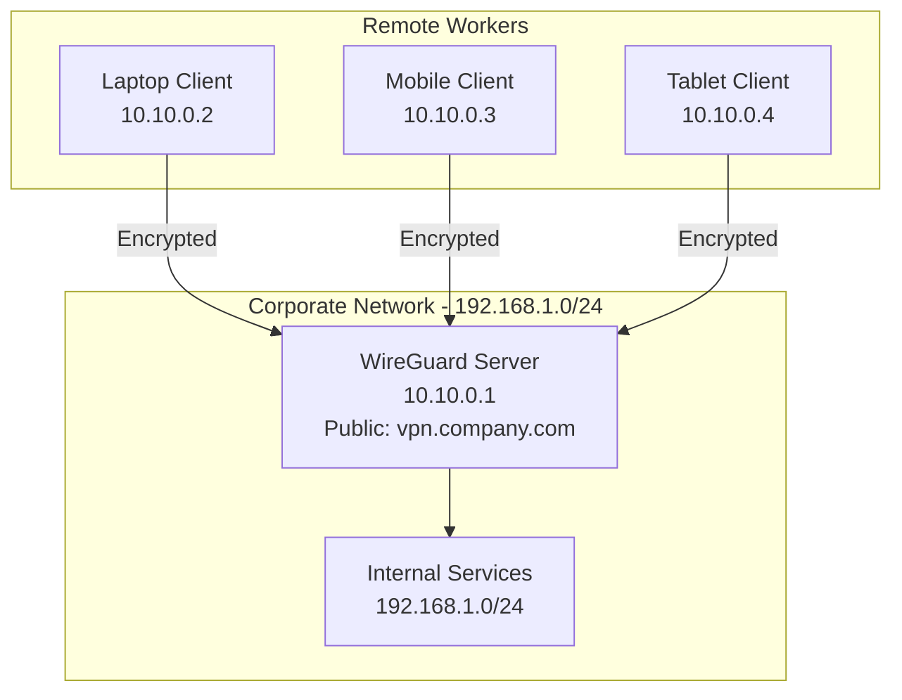
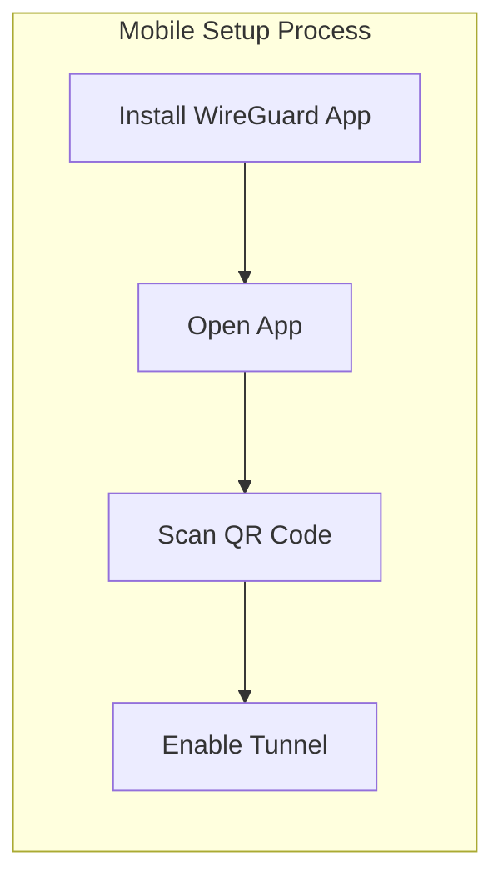

# How to Implement WireGuard Road Warrior Setup

Author: [nawazdhandala](https://www.github.com/nawazdhandala)

Tags: WireGuard, VPN, Remote Access, Security, Networking, Mobile

Description: A complete guide to setting up WireGuard VPN for remote workers connecting from laptops and mobile devices to your corporate network.

---

A road warrior VPN setup allows remote workers to securely connect to your network from anywhere. WireGuard is perfect for this use case - it is fast, lightweight, and works great on mobile devices. This guide covers setting up a WireGuard server and configuring clients for laptops, phones, and tablets.

## Road Warrior Architecture

In a road warrior setup, a central VPN server accepts connections from multiple remote clients. Each client gets a unique key pair and IP address.



## Setting Up the WireGuard Server

Start by configuring your central VPN server.

### Installing WireGuard

```bash
# On Ubuntu/Debian
sudo apt update
sudo apt install wireguard wireguard-tools qrencode

# qrencode is optional but useful for mobile client setup

# On RHEL/CentOS
sudo dnf install epel-release
sudo dnf install wireguard-tools qrencode
```

### Generating Server Keys

```bash
# Create config directory with proper permissions
sudo mkdir -p /etc/wireguard
cd /etc/wireguard
umask 077

# Generate server key pair
wg genkey | sudo tee server_private.key | wg pubkey | sudo tee server_public.key

# View the keys (you'll need the public key for clients)
cat server_private.key
cat server_public.key
```

### Server Configuration

Create the server configuration file.

```bash
sudo nano /etc/wireguard/wg0.conf
```

```ini
# /etc/wireguard/wg0.conf

[Interface]
# Server's private key
PrivateKey = SERVER_PRIVATE_KEY_HERE
# VPN subnet address for the server
Address = 10.10.0.1/24
# Port to listen on
ListenPort = 51820
# Save configuration changes automatically
SaveConfig = false

# Enable NAT for client traffic to reach internal network
PostUp = iptables -t nat -A POSTROUTING -s 10.10.0.0/24 -o eth0 -j MASQUERADE
PostUp = iptables -A FORWARD -i wg0 -j ACCEPT
PostUp = iptables -A FORWARD -o wg0 -j ACCEPT
PostDown = iptables -t nat -D POSTROUTING -s 10.10.0.0/24 -o eth0 -j MASQUERADE
PostDown = iptables -D FORWARD -i wg0 -j ACCEPT
PostDown = iptables -D FORWARD -o wg0 -j ACCEPT

# Client configurations will be added below
```

### Enable IP Forwarding

```bash
# Enable immediately
sudo sysctl -w net.ipv4.ip_forward=1

# Make permanent
echo "net.ipv4.ip_forward = 1" | sudo tee -a /etc/sysctl.conf
sudo sysctl -p
```

### Configure Firewall

```bash
# Using ufw
sudo ufw allow 51820/udp
sudo ufw allow in on wg0
sudo ufw reload

# Using firewalld
sudo firewall-cmd --permanent --add-port=51820/udp
sudo firewall-cmd --permanent --add-masquerade
sudo firewall-cmd --reload
```

## Creating Client Configurations

For each road warrior client, generate a unique key pair and configuration.

### Client Key Generation Script

```bash
#!/bin/bash
# generate-client.sh - Create a new WireGuard client

CLIENT_NAME=$1
CLIENT_IP=$2
SERVER_PUBLIC_KEY=$(cat /etc/wireguard/server_public.key)
SERVER_ENDPOINT="vpn.company.com:51820"
DNS_SERVER="192.168.1.1"  # Internal DNS server

if [ -z "$CLIENT_NAME" ] || [ -z "$CLIENT_IP" ]; then
    echo "Usage: $0 <client_name> <client_ip>"
    echo "Example: $0 john-laptop 10.10.0.2"
    exit 1
fi

# Create client directory
CLIENT_DIR="/etc/wireguard/clients/$CLIENT_NAME"
sudo mkdir -p "$CLIENT_DIR"
cd "$CLIENT_DIR"

# Generate client keys
umask 077
wg genkey | sudo tee private.key | wg pubkey | sudo tee public.key
CLIENT_PRIVATE=$(cat private.key)
CLIENT_PUBLIC=$(cat public.key)

# Create client configuration
sudo tee "$CLIENT_NAME.conf" << EOF
[Interface]
# Client's private key
PrivateKey = $CLIENT_PRIVATE
# Client's VPN IP address
Address = $CLIENT_IP/32
# DNS servers to use when connected
DNS = $DNS_SERVER

[Peer]
# Server's public key
PublicKey = $SERVER_PUBLIC_KEY
# Server's public endpoint
Endpoint = $SERVER_ENDPOINT
# Route all traffic through VPN (full tunnel)
# Use 10.10.0.0/24, 192.168.1.0/24 for split tunnel
AllowedIPs = 0.0.0.0/0
# Keep connection alive behind NAT
PersistentKeepalive = 25
EOF

# Generate QR code for mobile clients
qrencode -t ansiutf8 < "$CLIENT_NAME.conf"
qrencode -t png -o "$CLIENT_NAME.png" < "$CLIENT_NAME.conf"

echo ""
echo "Client configuration created: $CLIENT_DIR/$CLIENT_NAME.conf"
echo "QR code saved: $CLIENT_DIR/$CLIENT_NAME.png"
echo ""
echo "Add this peer configuration to the server:"
echo ""
echo "[Peer]"
echo "# $CLIENT_NAME"
echo "PublicKey = $CLIENT_PUBLIC"
echo "AllowedIPs = $CLIENT_IP/32"
```

### Adding Clients to Server

After generating a client, add their peer configuration to the server.

```bash
# Run the client generation script
sudo ./generate-client.sh john-laptop 10.10.0.2
sudo ./generate-client.sh jane-phone 10.10.0.3
sudo ./generate-client.sh bob-tablet 10.10.0.4
```

Update the server configuration with peer entries.

```ini
# Add to /etc/wireguard/wg0.conf

[Peer]
# john-laptop
PublicKey = JOHNS_PUBLIC_KEY_HERE
AllowedIPs = 10.10.0.2/32

[Peer]
# jane-phone
PublicKey = JANES_PUBLIC_KEY_HERE
AllowedIPs = 10.10.0.3/32

[Peer]
# bob-tablet
PublicKey = BOBS_PUBLIC_KEY_HERE
AllowedIPs = 10.10.0.4/32
```

## Configuring Laptop Clients

### Linux Client

```bash
# Install WireGuard
sudo apt install wireguard

# Copy configuration from server
# (securely transfer john-laptop.conf)
sudo cp john-laptop.conf /etc/wireguard/wg0.conf
sudo chmod 600 /etc/wireguard/wg0.conf

# Connect
sudo wg-quick up wg0

# Verify connection
sudo wg show
ping 10.10.0.1
```

### macOS Client

```bash
# Install via Homebrew
brew install wireguard-tools

# Or download from App Store: WireGuard

# Import configuration
# GUI: Open WireGuard app -> Import Tunnel from File
# CLI: Create /usr/local/etc/wireguard/wg0.conf

sudo wg-quick up wg0
```

### Windows Client

1. Download WireGuard from wireguard.com
2. Install and open the application
3. Click "Import tunnel(s) from file"
4. Select the .conf file
5. Click "Activate"

## Configuring Mobile Clients

### iOS and Android Setup

Both iOS and Android have official WireGuard apps.



1. Install the WireGuard app from App Store or Play Store
2. Open the app and tap the + button
3. Select "Scan from QR code"
4. Scan the QR code generated by the script
5. Toggle the tunnel on

### Generating QR Codes

```bash
# Generate QR code in terminal
qrencode -t ansiutf8 < /etc/wireguard/clients/jane-phone/jane-phone.conf

# Generate PNG file for sharing
qrencode -t png -o jane-phone-qr.png < /etc/wireguard/clients/jane-phone/jane-phone.conf
```

## Split Tunnel vs Full Tunnel

Choose based on your security requirements.

### Full Tunnel (All Traffic)

All client traffic goes through the VPN.

```ini
# In client configuration
[Peer]
AllowedIPs = 0.0.0.0/0, ::/0
```

Pros:
- All traffic is encrypted
- Client IP appears as VPN server IP
- Protection on untrusted networks

Cons:
- Higher bandwidth usage on server
- Slower for non-corporate traffic

### Split Tunnel (Selective Traffic)

Only corporate traffic goes through the VPN.

```ini
# In client configuration
[Peer]
# Only route to VPN network and internal network
AllowedIPs = 10.10.0.0/24, 192.168.1.0/24
```

Pros:
- Better performance for personal browsing
- Lower server bandwidth usage

Cons:
- Personal traffic is not protected
- Potential data leakage

## Managing Road Warrior Users

### Adding a New User

```bash
# 1. Generate client configuration
sudo ./generate-client.sh new-employee 10.10.0.10

# 2. Add peer to server config
sudo nano /etc/wireguard/wg0.conf

# 3. Reload WireGuard (no downtime)
sudo wg syncconf wg0 <(sudo wg-quick strip wg0)

# 4. Securely share config with user
# - Email encrypted archive
# - Share QR code in person
# - Use secure file sharing
```

### Revoking Access

```bash
# Remove peer from server config
sudo nano /etc/wireguard/wg0.conf
# Delete the [Peer] section for the user

# Reload configuration
sudo wg syncconf wg0 <(sudo wg-quick strip wg0)

# Verify peer is removed
sudo wg show wg0 peers

# Delete client files
sudo rm -rf /etc/wireguard/clients/former-employee/
```

### Monitoring Connected Clients

```bash
# Show all peers with connection info
sudo wg show wg0

# Example output:
# peer: ABC123...
#   endpoint: 203.0.113.50:54321
#   allowed ips: 10.10.0.2/32
#   latest handshake: 2 minutes, 30 seconds ago
#   transfer: 15.24 MiB received, 8.92 MiB sent

# Parse connection status
sudo wg show wg0 dump | awk '{print $1, $4, $5}'
```

### Automated User Management Script

```bash
#!/bin/bash
# wg-user-manager.sh

show_usage() {
    echo "Usage: $0 [add|remove|list|status] [username] [ip]"
    echo "  add <username> <ip>    - Add new user"
    echo "  remove <username>      - Remove user"
    echo "  list                   - List all users"
    echo "  status                 - Show connection status"
}

case $1 in
    add)
        if [ -z "$2" ] || [ -z "$3" ]; then
            show_usage
            exit 1
        fi
        ./generate-client.sh "$2" "$3"
        echo "Remember to add peer to server config and reload"
        ;;
    remove)
        if [ -z "$2" ]; then
            show_usage
            exit 1
        fi
        echo "Removing user: $2"
        sudo rm -rf "/etc/wireguard/clients/$2"
        echo "Remember to remove peer from server config and reload"
        ;;
    list)
        ls -1 /etc/wireguard/clients/
        ;;
    status)
        sudo wg show wg0
        ;;
    *)
        show_usage
        ;;
esac
```

## Security Hardening

### Rate Limiting Connections

```bash
# Limit new connections with iptables
sudo iptables -A INPUT -p udp --dport 51820 -m state --state NEW -m recent --set
sudo iptables -A INPUT -p udp --dport 51820 -m state --state NEW -m recent --update --seconds 60 --hitcount 10 -j DROP
```

### Using Pre-Shared Keys

Add an extra layer of security with pre-shared keys.

```bash
# Generate pre-shared key
wg genpsk > preshared.key

# Add to client config
[Peer]
PublicKey = SERVER_PUBLIC_KEY
PresharedKey = PRESHARED_KEY_HERE
Endpoint = vpn.company.com:51820
AllowedIPs = 0.0.0.0/0

# Add to server peer config
[Peer]
PublicKey = CLIENT_PUBLIC_KEY
PresharedKey = PRESHARED_KEY_HERE
AllowedIPs = 10.10.0.2/32
```

### Key Rotation Schedule

Rotate client keys periodically for security.

```bash
#!/bin/bash
# rotate-client-key.sh

CLIENT=$1
CLIENT_DIR="/etc/wireguard/clients/$CLIENT"

# Generate new keys
cd "$CLIENT_DIR"
wg genkey | tee new_private.key | wg pubkey > new_public.key

# Update client config with new private key
# Update server config with new public key
# Redistribute configuration to user

echo "New keys generated for $CLIENT"
echo "Update server config and redistribute client config"
```

---

A WireGuard road warrior setup provides secure remote access with minimal overhead. The lightweight protocol works well on mobile devices with limited battery and bandwidth. Start with a few users, establish your key management process, and scale up as needed. Remember to maintain an inventory of issued keys and revoke access promptly when employees leave.
