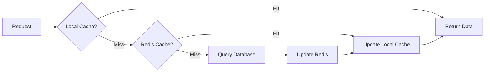

# How to Implement Multi-Level Caching in Spring Boot

Author: [nawazdhandala](https://www.github.com/nawazdhandala)

Tags: Java, Spring Boot, Caching, Redis, Caffeine, Performance, Spring Cache

Description: Learn how to implement multi-level caching in Spring Boot using local (Caffeine) and distributed (Redis) caches. This guide covers cache configuration, invalidation strategies, and best practices for optimal performance.

---

Caching is one of the most effective ways to improve application performance. A single cache layer helps, but combining a fast local cache with a shared distributed cache gives you the best of both worlds: sub-millisecond local access for hot data and cross-instance consistency for less frequently accessed items.

This guide shows you how to implement a two-level caching strategy in Spring Boot using Caffeine for local caching and Redis for distributed caching.

---

## Why Multi-Level Caching?

Each caching layer has trade-offs:

| Cache Type | Latency | Shared Across Instances | Memory Cost |
|------------|---------|-------------------------|-------------|
| Local (Caffeine) | ~1ms | No | Uses JVM heap |
| Distributed (Redis) | ~5-10ms | Yes | Separate infrastructure |
| Database | ~50-100ms | Yes | N/A |

Multi-level caching checks the local cache first (fastest), then the distributed cache, and finally the database. This approach minimizes latency while maintaining consistency across application instances.



---

## Setting Up Dependencies

Add the required dependencies:

```xml
<!-- pom.xml -->
<dependencies>
    <!-- Spring Boot Cache Starter -->
    <dependency>
        <groupId>org.springframework.boot</groupId>
        <artifactId>spring-boot-starter-cache</artifactId>
    </dependency>

    <!-- Caffeine for local caching -->
    <dependency>
        <groupId>com.github.ben-manes.caffeine</groupId>
        <artifactId>caffeine</artifactId>
    </dependency>

    <!-- Redis for distributed caching -->
    <dependency>
        <groupId>org.springframework.boot</groupId>
        <artifactId>spring-boot-starter-data-redis</artifactId>
    </dependency>

    <!-- Jackson for JSON serialization in Redis -->
    <dependency>
        <groupId>com.fasterxml.jackson.core</groupId>
        <artifactId>jackson-databind</artifactId>
    </dependency>
</dependencies>
```

---

## Configuring Cache Properties

Define cache configuration in `application.yml`:

```yaml
# application.yml
spring:
  cache:
    type: none  # We'll configure custom cache managers

  redis:
    host: ${REDIS_HOST:localhost}
    port: ${REDIS_PORT:6379}
    password: ${REDIS_PASSWORD:}
    timeout: 2000ms
    lettuce:
      pool:
        max-active: 10
        max-idle: 5
        min-idle: 2

# Custom cache configuration
cache:
  local:
    # Maximum entries in local cache
    max-size: 10000
    # Time to live for local cache entries
    ttl-seconds: 300
  distributed:
    # Time to live for Redis cache entries
    ttl-seconds: 3600
```

---

## Building the Multi-Level Cache Manager

Create a custom cache manager that combines both cache layers:

```java
// MultiLevelCacheConfig.java
// Configuration for two-level caching with Caffeine and Redis
package com.example.config;

import com.github.benmanes.caffeine.cache.Caffeine;
import org.springframework.beans.factory.annotation.Value;
import org.springframework.cache.CacheManager;
import org.springframework.cache.annotation.EnableCaching;
import org.springframework.cache.caffeine.CaffeineCacheManager;
import org.springframework.context.annotation.Bean;
import org.springframework.context.annotation.Configuration;
import org.springframework.context.annotation.Primary;
import org.springframework.data.redis.cache.RedisCacheConfiguration;
import org.springframework.data.redis.cache.RedisCacheManager;
import org.springframework.data.redis.connection.RedisConnectionFactory;
import org.springframework.data.redis.serializer.GenericJackson2JsonRedisSerializer;
import org.springframework.data.redis.serializer.RedisSerializationContext;

import java.time.Duration;
import java.util.concurrent.TimeUnit;

@Configuration
@EnableCaching
public class MultiLevelCacheConfig {

    @Value("${cache.local.max-size:10000}")
    private int localCacheMaxSize;

    @Value("${cache.local.ttl-seconds:300}")
    private int localCacheTtlSeconds;

    @Value("${cache.distributed.ttl-seconds:3600}")
    private int distributedCacheTtlSeconds;

    // Local cache manager using Caffeine
    @Bean
    public CacheManager localCacheManager() {
        CaffeineCacheManager cacheManager = new CaffeineCacheManager();
        cacheManager.setCaffeine(Caffeine.newBuilder()
            .maximumSize(localCacheMaxSize)
            .expireAfterWrite(localCacheTtlSeconds, TimeUnit.SECONDS)
            .recordStats());  // Enable statistics for monitoring
        return cacheManager;
    }

    // Distributed cache manager using Redis
    @Bean
    public CacheManager redisCacheManager(RedisConnectionFactory connectionFactory) {
        // Configure JSON serialization for cached objects
        GenericJackson2JsonRedisSerializer serializer = new GenericJackson2JsonRedisSerializer();

        RedisCacheConfiguration config = RedisCacheConfiguration.defaultCacheConfig()
            .entryTtl(Duration.ofSeconds(distributedCacheTtlSeconds))
            .serializeValuesWith(
                RedisSerializationContext.SerializationPair.fromSerializer(serializer)
            )
            .disableCachingNullValues();  // Do not cache null values

        return RedisCacheManager.builder(connectionFactory)
            .cacheDefaults(config)
            .build();
    }

    // Primary cache manager that combines both levels
    @Bean
    @Primary
    public CacheManager multiLevelCacheManager(
            CacheManager localCacheManager,
            CacheManager redisCacheManager) {
        return new MultiLevelCacheManager(localCacheManager, redisCacheManager);
    }
}
```

---

## Multi-Level Cache Manager Implementation

Create a custom CacheManager that orchestrates both cache layers:

```java
// MultiLevelCacheManager.java
// Custom cache manager that combines local and distributed caches
package com.example.cache;

import org.springframework.cache.Cache;
import org.springframework.cache.CacheManager;

import java.util.Collection;
import java.util.concurrent.ConcurrentHashMap;
import java.util.concurrent.ConcurrentMap;

public class MultiLevelCacheManager implements CacheManager {

    private final CacheManager localCacheManager;
    private final CacheManager distributedCacheManager;
    private final ConcurrentMap<String, Cache> cacheMap = new ConcurrentHashMap<>();

    public MultiLevelCacheManager(
            CacheManager localCacheManager,
            CacheManager distributedCacheManager) {
        this.localCacheManager = localCacheManager;
        this.distributedCacheManager = distributedCacheManager;
    }

    @Override
    public Cache getCache(String name) {
        return cacheMap.computeIfAbsent(name, this::createMultiLevelCache);
    }

    @Override
    public Collection<String> getCacheNames() {
        return cacheMap.keySet();
    }

    private Cache createMultiLevelCache(String name) {
        Cache localCache = localCacheManager.getCache(name);
        Cache distributedCache = distributedCacheManager.getCache(name);
        return new MultiLevelCache(name, localCache, distributedCache);
    }
}
```

---

## Multi-Level Cache Implementation

Implement the Cache interface with two-level lookup and write-through:

```java
// MultiLevelCache.java
// Cache implementation that checks local cache first, then distributed
package com.example.cache;

import org.slf4j.Logger;
import org.slf4j.LoggerFactory;
import org.springframework.cache.Cache;

import java.util.concurrent.Callable;

public class MultiLevelCache implements Cache {

    private static final Logger log = LoggerFactory.getLogger(MultiLevelCache.class);

    private final String name;
    private final Cache localCache;
    private final Cache distributedCache;

    public MultiLevelCache(String name, Cache localCache, Cache distributedCache) {
        this.name = name;
        this.localCache = localCache;
        this.distributedCache = distributedCache;
    }

    @Override
    public String getName() {
        return name;
    }

    @Override
    public Object getNativeCache() {
        return this;
    }

    @Override
    public ValueWrapper get(Object key) {
        // Try local cache first (fastest)
        ValueWrapper localValue = localCache.get(key);
        if (localValue != null) {
            log.debug("Cache hit (local): {} - {}", name, key);
            return localValue;
        }

        // Try distributed cache
        ValueWrapper distributedValue = distributedCache.get(key);
        if (distributedValue != null) {
            log.debug("Cache hit (distributed): {} - {}", name, key);
            // Populate local cache for future requests
            localCache.put(key, distributedValue.get());
            return distributedValue;
        }

        log.debug("Cache miss: {} - {}", name, key);
        return null;
    }

    @Override
    public <T> T get(Object key, Class<T> type) {
        // Try local cache first
        T localValue = localCache.get(key, type);
        if (localValue != null) {
            return localValue;
        }

        // Try distributed cache
        T distributedValue = distributedCache.get(key, type);
        if (distributedValue != null) {
            // Populate local cache
            localCache.put(key, distributedValue);
            return distributedValue;
        }

        return null;
    }

    @Override
    public <T> T get(Object key, Callable<T> valueLoader) {
        // Try local cache first
        ValueWrapper localValue = localCache.get(key);
        if (localValue != null) {
            return (T) localValue.get();
        }

        // Try distributed cache
        ValueWrapper distributedValue = distributedCache.get(key);
        if (distributedValue != null) {
            T value = (T) distributedValue.get();
            localCache.put(key, value);
            return value;
        }

        // Cache miss - load value and populate both caches
        try {
            T value = valueLoader.call();
            put(key, value);
            return value;
        } catch (Exception e) {
            throw new ValueRetrievalException(key, valueLoader, e);
        }
    }

    @Override
    public void put(Object key, Object value) {
        // Write to both caches (write-through)
        localCache.put(key, value);
        distributedCache.put(key, value);
        log.debug("Cache put: {} - {}", name, key);
    }

    @Override
    public void evict(Object key) {
        // Evict from both caches
        localCache.evict(key);
        distributedCache.evict(key);
        log.debug("Cache evict: {} - {}", name, key);
    }

    @Override
    public void clear() {
        // Clear both caches
        localCache.clear();
        distributedCache.clear();
        log.info("Cache cleared: {}", name);
    }

    @Override
    public boolean evictIfPresent(Object key) {
        boolean evicted = localCache.evictIfPresent(key);
        evicted |= distributedCache.evictIfPresent(key);
        return evicted;
    }

    @Override
    public boolean invalidate() {
        boolean invalidated = localCache.invalidate();
        invalidated |= distributedCache.invalidate();
        return invalidated;
    }
}
```

---

## Using the Cache in Services

Apply caching to your service methods:

```java
// ProductService.java
// Service with multi-level caching
package com.example.service;

import com.example.entity.Product;
import com.example.repository.ProductRepository;
import org.springframework.cache.annotation.CacheEvict;
import org.springframework.cache.annotation.CachePut;
import org.springframework.cache.annotation.Cacheable;
import org.springframework.stereotype.Service;

import java.util.List;

@Service
public class ProductService {

    private final ProductRepository productRepository;

    public ProductService(ProductRepository productRepository) {
        this.productRepository = productRepository;
    }

    // Cache product lookups - checks local cache, then Redis, then DB
    @Cacheable(value = "products", key = "#productId")
    public Product getProduct(String productId) {
        log.info("Loading product from database: {}", productId);
        return productRepository.findById(productId)
            .orElseThrow(() -> new ProductNotFoundException(productId));
    }

    // Cache list queries with a separate cache
    @Cacheable(value = "productsByCategory", key = "#category")
    public List<Product> getProductsByCategory(String category) {
        log.info("Loading products by category from database: {}", category);
        return productRepository.findByCategory(category);
    }

    // Update cache when product is modified
    @CachePut(value = "products", key = "#product.id")
    public Product updateProduct(Product product) {
        log.info("Updating product: {}", product.getId());
        Product updated = productRepository.save(product);

        // Also invalidate category cache since product might have changed category
        // This is handled separately via CacheEvict or programmatic eviction
        return updated;
    }

    // Evict from cache when product is deleted
    @CacheEvict(value = "products", key = "#productId")
    public void deleteProduct(String productId) {
        log.info("Deleting product: {}", productId);
        productRepository.deleteById(productId);
    }

    // Evict all products from cache
    @CacheEvict(value = "products", allEntries = true)
    public void clearProductCache() {
        log.info("Clearing all product cache entries");
    }
}
```

---

## Cache Invalidation Across Instances

When running multiple application instances, you need to invalidate local caches when data changes. Use Redis pub/sub for cache invalidation events:

```java
// CacheInvalidationPublisher.java
// Publishes cache invalidation events to Redis
package com.example.cache;

import org.springframework.data.redis.core.RedisTemplate;
import org.springframework.stereotype.Component;

@Component
public class CacheInvalidationPublisher {

    private static final String CACHE_INVALIDATION_CHANNEL = "cache:invalidation";

    private final RedisTemplate<String, Object> redisTemplate;

    public CacheInvalidationPublisher(RedisTemplate<String, Object> redisTemplate) {
        this.redisTemplate = redisTemplate;
    }

    // Publish invalidation event for a specific key
    public void publishInvalidation(String cacheName, Object key) {
        CacheInvalidationEvent event = new CacheInvalidationEvent(cacheName, key.toString());
        redisTemplate.convertAndSend(CACHE_INVALIDATION_CHANNEL, event);
    }

    // Publish invalidation for all entries in a cache
    public void publishClearCache(String cacheName) {
        CacheInvalidationEvent event = new CacheInvalidationEvent(cacheName, null);
        redisTemplate.convertAndSend(CACHE_INVALIDATION_CHANNEL, event);
    }
}
```

```java
// CacheInvalidationListener.java
// Listens for cache invalidation events and clears local cache
package com.example.cache;

import com.github.benmanes.caffeine.cache.Cache;
import org.springframework.cache.CacheManager;
import org.springframework.data.redis.connection.Message;
import org.springframework.data.redis.connection.MessageListener;
import org.springframework.stereotype.Component;

@Component
public class CacheInvalidationListener implements MessageListener {

    private final CacheManager localCacheManager;

    public CacheInvalidationListener(CacheManager localCacheManager) {
        this.localCacheManager = localCacheManager;
    }

    @Override
    public void onMessage(Message message, byte[] pattern) {
        try {
            CacheInvalidationEvent event = deserialize(message.getBody());

            org.springframework.cache.Cache cache = localCacheManager.getCache(event.getCacheName());
            if (cache != null) {
                if (event.getKey() != null) {
                    // Evict specific key
                    cache.evict(event.getKey());
                    log.debug("Evicted local cache entry: {} - {}", event.getCacheName(), event.getKey());
                } else {
                    // Clear entire cache
                    cache.clear();
                    log.debug("Cleared local cache: {}", event.getCacheName());
                }
            }
        } catch (Exception e) {
            log.error("Failed to process cache invalidation event", e);
        }
    }

    private CacheInvalidationEvent deserialize(byte[] body) {
        // Deserialize using Jackson or your preferred method
        ObjectMapper mapper = new ObjectMapper();
        return mapper.readValue(body, CacheInvalidationEvent.class);
    }
}
```

Configure Redis listener:

```java
// RedisConfig.java
// Configure Redis pub/sub for cache invalidation
package com.example.config;

import com.example.cache.CacheInvalidationListener;
import org.springframework.context.annotation.Bean;
import org.springframework.context.annotation.Configuration;
import org.springframework.data.redis.connection.RedisConnectionFactory;
import org.springframework.data.redis.listener.ChannelTopic;
import org.springframework.data.redis.listener.RedisMessageListenerContainer;

@Configuration
public class RedisConfig {

    @Bean
    public RedisMessageListenerContainer redisMessageListenerContainer(
            RedisConnectionFactory connectionFactory,
            CacheInvalidationListener cacheInvalidationListener) {

        RedisMessageListenerContainer container = new RedisMessageListenerContainer();
        container.setConnectionFactory(connectionFactory);
        container.addMessageListener(
            cacheInvalidationListener,
            new ChannelTopic("cache:invalidation")
        );
        return container;
    }
}
```

---

## Cache Statistics and Monitoring

Expose cache metrics for monitoring:

```java
// CacheMetricsService.java
// Service to collect and expose cache statistics
package com.example.cache;

import com.github.benmanes.caffeine.cache.stats.CacheStats;
import io.micrometer.core.instrument.Gauge;
import io.micrometer.core.instrument.MeterRegistry;
import jakarta.annotation.PostConstruct;
import org.springframework.cache.CacheManager;
import org.springframework.cache.caffeine.CaffeineCache;
import org.springframework.stereotype.Component;

@Component
public class CacheMetricsService {

    private final CacheManager localCacheManager;
    private final MeterRegistry meterRegistry;

    public CacheMetricsService(
            CacheManager localCacheManager,
            MeterRegistry meterRegistry) {
        this.localCacheManager = localCacheManager;
        this.meterRegistry = meterRegistry;
    }

    @PostConstruct
    public void registerMetrics() {
        // Register metrics for each cache
        localCacheManager.getCacheNames().forEach(this::registerCacheMetrics);
    }

    private void registerCacheMetrics(String cacheName) {
        org.springframework.cache.Cache cache = localCacheManager.getCache(cacheName);
        if (cache instanceof CaffeineCache) {
            com.github.benmanes.caffeine.cache.Cache<Object, Object> caffeineCache =
                ((CaffeineCache) cache).getNativeCache();

            // Hit rate
            Gauge.builder("cache_hit_rate", caffeineCache,
                    c -> c.stats().hitRate())
                .tag("cache", cacheName)
                .description("Cache hit rate")
                .register(meterRegistry);

            // Miss rate
            Gauge.builder("cache_miss_rate", caffeineCache,
                    c -> c.stats().missRate())
                .tag("cache", cacheName)
                .description("Cache miss rate")
                .register(meterRegistry);

            // Eviction count
            Gauge.builder("cache_evictions", caffeineCache,
                    c -> c.stats().evictionCount())
                .tag("cache", cacheName)
                .description("Cache eviction count")
                .register(meterRegistry);

            // Size
            Gauge.builder("cache_size", caffeineCache,
                    c -> c.estimatedSize())
                .tag("cache", cacheName)
                .description("Estimated cache size")
                .register(meterRegistry);
        }
    }

    // Get cache statistics for a specific cache
    public CacheStatistics getStatistics(String cacheName) {
        org.springframework.cache.Cache cache = localCacheManager.getCache(cacheName);
        if (cache instanceof CaffeineCache) {
            CacheStats stats = ((CaffeineCache) cache).getNativeCache().stats();
            return CacheStatistics.builder()
                .cacheName(cacheName)
                .hitCount(stats.hitCount())
                .missCount(stats.missCount())
                .hitRate(stats.hitRate())
                .evictionCount(stats.evictionCount())
                .loadSuccessCount(stats.loadSuccessCount())
                .loadFailureCount(stats.loadFailureCount())
                .averageLoadPenalty(stats.averageLoadPenalty())
                .build();
        }
        return null;
    }
}
```

---

## Best Practices

1. **Choose appropriate TTLs** - Local cache TTL should be shorter than distributed cache TTL to ensure freshness

2. **Size local caches carefully** - Local caches use JVM heap; monitor memory usage

3. **Handle cache failures gracefully** - If Redis is down, fall back to local cache or database

4. **Use cache key prefixes** - Prevent key collisions between different data types

5. **Monitor cache hit rates** - Low hit rates indicate ineffective caching

6. **Implement cache warming** - Pre-populate caches on startup for predictable performance

7. **Test cache invalidation** - Verify that updates propagate correctly across instances

---

## Conclusion

Multi-level caching combines the speed of local caches with the consistency of distributed caches. Caffeine provides sub-millisecond local access for hot data, while Redis ensures all application instances see the same cached values. Start with simple caching and add the second level when you need either better performance or cross-instance consistency.

---

*Caching is a key part of application performance. [OneUptime](https://oneuptime.com) helps you monitor cache hit rates, latency, and resource usage so you can tune your caching strategy based on real production data.*

**Related Reading:**
- [How to Build Full-Text Search with Elasticsearch in Spring](https://oneuptime.com/blog/post/2026-01-28-elasticsearch-full-text-search-spring/view)
- [How to Integrate Redis with Spring Boot for Session and Cache](https://oneuptime.com/blog/post/2026-01-21-redis-spring-boot-integration/view)
