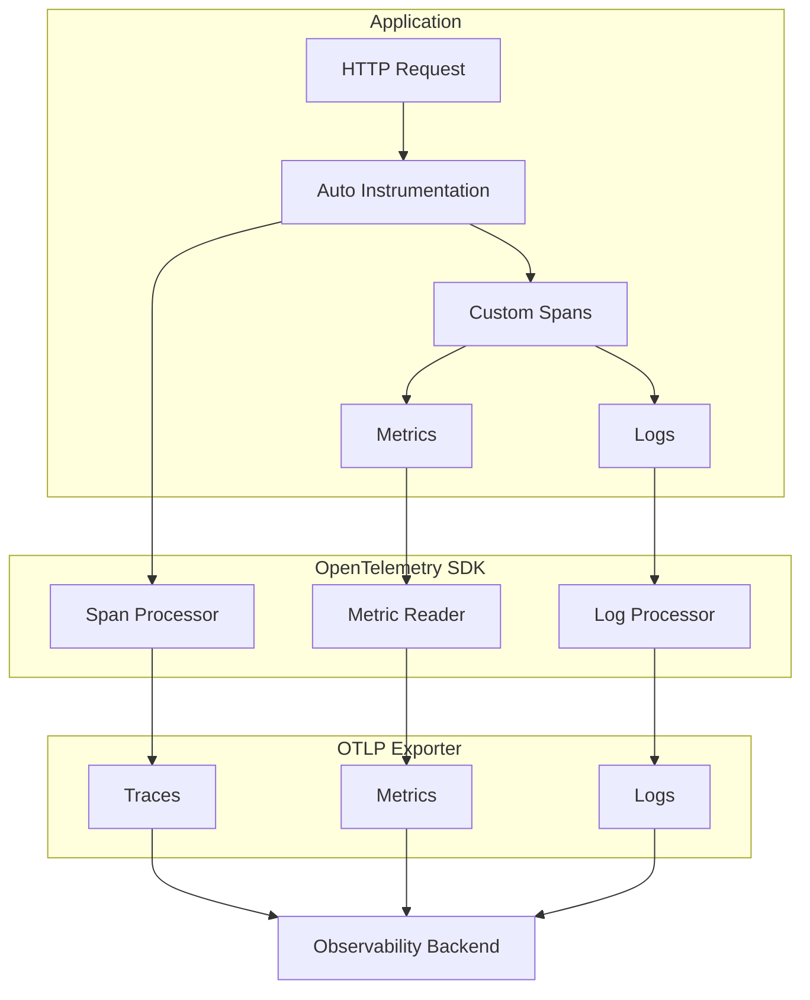

# How to Instrument .NET Apps with OpenTelemetry

Author: [nawazdhandala](https://www.github.com/nawazdhandala)

Tags: .NET, C#, OpenTelemetry, Observability, Tracing, Metrics, Logging, ASP.NET Core

Description: A practical guide to instrumenting .NET applications with OpenTelemetry for distributed tracing, metrics collection, and structured logging. Covers both automatic and manual instrumentation patterns.

---

OpenTelemetry has become the standard for application observability. It provides a vendor-neutral way to collect traces, metrics, and logs from your .NET applications. This guide shows you how to set up comprehensive instrumentation that gives you visibility into your application's behavior.

For background on OpenTelemetry concepts, see our guide on [traces and spans](https://oneuptime.com/blog/post/2025-08-27-traces-and-spans-in-opentelemetry/view).

## Setting Up OpenTelemetry

### Install Required Packages

```bash
dotnet add package OpenTelemetry.Extensions.Hosting
dotnet add package OpenTelemetry.Instrumentation.AspNetCore
dotnet add package OpenTelemetry.Instrumentation.Http
dotnet add package OpenTelemetry.Instrumentation.SqlClient
dotnet add package OpenTelemetry.Exporter.OpenTelemetryProtocol
dotnet add package OpenTelemetry.Exporter.Console
```

### Basic Configuration

Configure OpenTelemetry in your `Program.cs`:

```csharp
using OpenTelemetry.Logs;
using OpenTelemetry.Metrics;
using OpenTelemetry.Resources;
using OpenTelemetry.Trace;

var builder = WebApplication.CreateBuilder(args);

// Define resource attributes that identify your service
var serviceName = builder.Configuration["ServiceName"] ?? "order-service";
var serviceVersion = builder.Configuration["ServiceVersion"] ?? "1.0.0";

var resourceBuilder = ResourceBuilder.CreateDefault()
    .AddService(serviceName, serviceVersion: serviceVersion)
    .AddAttributes(new Dictionary<string, object>
    {
        ["deployment.environment"] = builder.Environment.EnvironmentName,
        ["host.name"] = Environment.MachineName
    });

// Configure OpenTelemetry
builder.Services.AddOpenTelemetry()
    .ConfigureResource(resource => resource.AddService(serviceName, serviceVersion: serviceVersion))
    .WithTracing(tracing =>
    {
        tracing
            .SetResourceBuilder(resourceBuilder)
            // Automatic instrumentation
            .AddAspNetCoreInstrumentation(options =>
            {
                // Filter out health check endpoints from traces
                options.Filter = context =>
                    !context.Request.Path.StartsWithSegments("/health");
            })
            .AddHttpClientInstrumentation()
            .AddSqlClientInstrumentation(options =>
            {
                options.SetDbStatementForText = true;
                options.RecordException = true;
            })
            // Export configuration
            .AddOtlpExporter(options =>
            {
                options.Endpoint = new Uri(
                    builder.Configuration["Otlp:Endpoint"] ?? "http://localhost:4317");
            });

        // Add console exporter in development
        if (builder.Environment.IsDevelopment())
        {
            tracing.AddConsoleExporter();
        }
    })
    .WithMetrics(metrics =>
    {
        metrics
            .SetResourceBuilder(resourceBuilder)
            .AddAspNetCoreInstrumentation()
            .AddHttpClientInstrumentation()
            .AddRuntimeInstrumentation()
            .AddOtlpExporter(options =>
            {
                options.Endpoint = new Uri(
                    builder.Configuration["Otlp:Endpoint"] ?? "http://localhost:4317");
            });
    });

// Configure logging to use OpenTelemetry
builder.Logging.AddOpenTelemetry(logging =>
{
    logging.SetResourceBuilder(resourceBuilder);
    logging.IncludeFormattedMessage = true;
    logging.IncludeScopes = true;
    logging.AddOtlpExporter(options =>
    {
        options.Endpoint = new Uri(
            builder.Configuration["Otlp:Endpoint"] ?? "http://localhost:4317");
    });
});

var app = builder.Build();
app.Run();
```

## Custom Tracing

While auto-instrumentation handles HTTP requests and database calls, you need manual instrumentation for business logic.

### Creating Custom Spans

```csharp
using System.Diagnostics;

public class OrderService
{
    // ActivitySource is the .NET equivalent of OpenTelemetry Tracer
    private static readonly ActivitySource ActivitySource = new("OrderService");

    private readonly AppDbContext _context;
    private readonly IPaymentService _paymentService;
    private readonly ILogger<OrderService> _logger;

    public OrderService(
        AppDbContext context,
        IPaymentService paymentService,
        ILogger<OrderService> logger)
    {
        _context = context;
        _paymentService = paymentService;
        _logger = logger;
    }

    public async Task<Order> CreateOrderAsync(CreateOrderRequest request)
    {
        // Start a new span for the entire operation
        using var activity = ActivitySource.StartActivity("CreateOrder");

        // Add attributes to help with debugging
        activity?.SetTag("order.customer_id", request.CustomerId);
        activity?.SetTag("order.items_count", request.Items.Count);

        try
        {
            // Validate the order
            await ValidateOrderAsync(request);

            // Process payment
            var paymentResult = await ProcessPaymentAsync(request);
            activity?.SetTag("payment.transaction_id", paymentResult.TransactionId);

            // Create order in database
            var order = await SaveOrderAsync(request, paymentResult);

            activity?.SetTag("order.id", order.Id.ToString());
            activity?.SetStatus(ActivityStatusCode.Ok);

            return order;
        }
        catch (Exception ex)
        {
            // Record the exception on the span
            activity?.SetStatus(ActivityStatusCode.Error, ex.Message);
            activity?.RecordException(ex);
            throw;
        }
    }

    private async Task ValidateOrderAsync(CreateOrderRequest request)
    {
        using var activity = ActivitySource.StartActivity("ValidateOrder");

        foreach (var item in request.Items)
        {
            var product = await _context.Products.FindAsync(item.ProductId);

            if (product is null)
            {
                activity?.SetStatus(ActivityStatusCode.Error, "Product not found");
                throw new ValidationException($"Product {item.ProductId} not found");
            }

            if (product.StockQuantity < item.Quantity)
            {
                activity?.SetStatus(ActivityStatusCode.Error, "Insufficient stock");
                throw new ValidationException($"Insufficient stock for {product.Name}");
            }
        }

        activity?.SetStatus(ActivityStatusCode.Ok);
    }

    private async Task<PaymentResult> ProcessPaymentAsync(CreateOrderRequest request)
    {
        using var activity = ActivitySource.StartActivity("ProcessPayment");
        activity?.SetTag("payment.amount", request.TotalAmount);
        activity?.SetTag("payment.method", request.PaymentMethod);

        var result = await _paymentService.ChargeAsync(
            request.PaymentMethod,
            request.TotalAmount);

        activity?.SetTag("payment.success", result.Success);

        if (!result.Success)
        {
            activity?.SetStatus(ActivityStatusCode.Error, result.ErrorMessage);
        }

        return result;
    }

    private async Task<Order> SaveOrderAsync(
        CreateOrderRequest request,
        PaymentResult payment)
    {
        using var activity = ActivitySource.StartActivity("SaveOrder");

        var order = new Order
        {
            Id = Guid.NewGuid(),
            CustomerId = request.CustomerId,
            PaymentTransactionId = payment.TransactionId,
            Status = OrderStatus.Confirmed,
            CreatedAt = DateTime.UtcNow
        };

        _context.Orders.Add(order);
        await _context.SaveChangesAsync();

        activity?.SetTag("order.id", order.Id.ToString());

        return order;
    }
}
```

### Register the ActivitySource

```csharp
builder.Services.AddOpenTelemetry()
    .WithTracing(tracing =>
    {
        tracing
            // Add your custom ActivitySource
            .AddSource("OrderService")
            .AddSource("PaymentService")
            .AddSource("InventoryService")
            // ... rest of configuration
    });
```

## Custom Metrics

Create business-specific metrics to track KPIs:

```csharp
using System.Diagnostics.Metrics;

public class OrderMetrics
{
    private readonly Counter<long> _ordersCreated;
    private readonly Histogram<double> _orderValue;
    private readonly Histogram<double> _orderProcessingTime;
    private readonly UpDownCounter<int> _activeOrders;

    public OrderMetrics(IMeterFactory meterFactory)
    {
        var meter = meterFactory.Create("OrderService");

        _ordersCreated = meter.CreateCounter<long>(
            "orders.created",
            unit: "orders",
            description: "Total number of orders created");

        _orderValue = meter.CreateHistogram<double>(
            "orders.value",
            unit: "usd",
            description: "Order value in USD");

        _orderProcessingTime = meter.CreateHistogram<double>(
            "orders.processing_time",
            unit: "ms",
            description: "Time to process an order");

        _activeOrders = meter.CreateUpDownCounter<int>(
            "orders.active",
            unit: "orders",
            description: "Number of orders being processed");
    }

    public void OrderCreated(string customerId, decimal value, string paymentMethod)
    {
        var tags = new TagList
        {
            { "customer.type", DetermineCustomerType(customerId) },
            { "payment.method", paymentMethod }
        };

        _ordersCreated.Add(1, tags);
        _orderValue.Record((double)value, tags);
    }

    public void RecordProcessingTime(double milliseconds, bool success)
    {
        var tags = new TagList
        {
            { "status", success ? "success" : "failure" }
        };

        _orderProcessingTime.Record(milliseconds, tags);
    }

    public void OrderProcessingStarted() => _activeOrders.Add(1);
    public void OrderProcessingCompleted() => _activeOrders.Add(-1);

    private string DetermineCustomerType(string customerId)
    {
        // Logic to determine customer type
        return "standard";
    }
}
```

### Using Metrics in Services

```csharp
public class OrderService
{
    private readonly OrderMetrics _metrics;
    private readonly Stopwatch _stopwatch = new();

    public OrderService(OrderMetrics metrics)
    {
        _metrics = metrics;
    }

    public async Task<Order> CreateOrderAsync(CreateOrderRequest request)
    {
        _metrics.OrderProcessingStarted();
        _stopwatch.Restart();

        try
        {
            var order = await ProcessOrderInternalAsync(request);

            _stopwatch.Stop();
            _metrics.OrderCreated(
                request.CustomerId,
                order.TotalAmount,
                request.PaymentMethod);
            _metrics.RecordProcessingTime(_stopwatch.ElapsedMilliseconds, success: true);

            return order;
        }
        catch
        {
            _stopwatch.Stop();
            _metrics.RecordProcessingTime(_stopwatch.ElapsedMilliseconds, success: false);
            throw;
        }
        finally
        {
            _metrics.OrderProcessingCompleted();
        }
    }
}
```

## Structured Logging with Trace Context

Correlate logs with traces for easier debugging:

```csharp
public class OrderService
{
    private readonly ILogger<OrderService> _logger;

    public async Task<Order> CreateOrderAsync(CreateOrderRequest request)
    {
        // Log with structured data - trace ID is automatically included
        _logger.LogInformation(
            "Creating order for customer {CustomerId} with {ItemCount} items",
            request.CustomerId,
            request.Items.Count);

        try
        {
            var order = await ProcessOrderAsync(request);

            _logger.LogInformation(
                "Order {OrderId} created successfully for {CustomerId}",
                order.Id,
                request.CustomerId);

            return order;
        }
        catch (ValidationException ex)
        {
            _logger.LogWarning(
                ex,
                "Validation failed for order from {CustomerId}: {Message}",
                request.CustomerId,
                ex.Message);
            throw;
        }
        catch (Exception ex)
        {
            _logger.LogError(
                ex,
                "Failed to create order for {CustomerId}",
                request.CustomerId);
            throw;
        }
    }
}
```

## Trace Context Propagation

For distributed systems, context propagation ensures traces span across services:

```csharp
public class ExternalServiceClient
{
    private readonly HttpClient _httpClient;
    private static readonly ActivitySource ActivitySource = new("ExternalServiceClient");

    public ExternalServiceClient(HttpClient httpClient)
    {
        _httpClient = httpClient;
    }

    public async Task<InventoryStatus> CheckInventoryAsync(int productId)
    {
        using var activity = ActivitySource.StartActivity("CheckInventory");
        activity?.SetTag("product.id", productId);

        // HttpClient instrumentation automatically propagates trace context
        // via W3C Trace Context headers (traceparent, tracestate)
        var response = await _httpClient.GetAsync($"/api/inventory/{productId}");

        response.EnsureSuccessStatusCode();

        return await response.Content.ReadFromJsonAsync<InventoryStatus>()
            ?? throw new InvalidOperationException("Invalid response");
    }
}
```

## Telemetry Flow



## Configuration for Production

```csharp
builder.Services.AddOpenTelemetry()
    .WithTracing(tracing =>
    {
        tracing
            .SetResourceBuilder(resourceBuilder)
            .AddAspNetCoreInstrumentation(options =>
            {
                // Skip health checks and metrics endpoints
                options.Filter = context =>
                    !context.Request.Path.StartsWithSegments("/health") &&
                    !context.Request.Path.StartsWithSegments("/metrics");

                // Enrich spans with additional info
                options.EnrichWithHttpRequest = (activity, request) =>
                {
                    activity.SetTag("http.request_id",
                        request.Headers["X-Request-Id"].FirstOrDefault());
                };
            })
            .AddHttpClientInstrumentation(options =>
            {
                // Filter out internal calls
                options.FilterHttpRequestMessage = request =>
                    !request.RequestUri?.Host.Contains("internal") ?? true;
            })
            // Use batch processing for better performance
            .AddOtlpExporter(options =>
            {
                options.Endpoint = new Uri(builder.Configuration["Otlp:Endpoint"]!);
                options.Protocol = OtlpExportProtocol.Grpc;
                options.BatchExportProcessorOptions = new()
                {
                    MaxQueueSize = 2048,
                    MaxExportBatchSize = 512,
                    ScheduledDelayMilliseconds = 5000
                };
            });

        // Add sampling for high-traffic services
        if (!builder.Environment.IsDevelopment())
        {
            tracing.SetSampler(new TraceIdRatioBasedSampler(0.1)); // 10% sampling
        }
    });
```

## Summary

| Telemetry Type | Purpose | .NET API |
|----------------|---------|----------|
| **Traces** | Request flow and timing | `ActivitySource`, `Activity` |
| **Metrics** | Counters, histograms, gauges | `Meter`, `Counter<T>`, `Histogram<T>` |
| **Logs** | Event details with context | `ILogger<T>` with OpenTelemetry export |

Key patterns for effective instrumentation:

- Use auto-instrumentation for HTTP, database, and framework calls
- Add custom spans for business operations with meaningful names
- Include relevant attributes (IDs, counts, statuses) on spans
- Create metrics for business KPIs, not just technical metrics
- Correlate logs with traces using structured logging
- Configure sampling and batching for production workloads

OpenTelemetry gives you complete visibility into your .NET applications. Combined with an observability backend, you can trace requests across services, monitor application health, and debug issues quickly.
