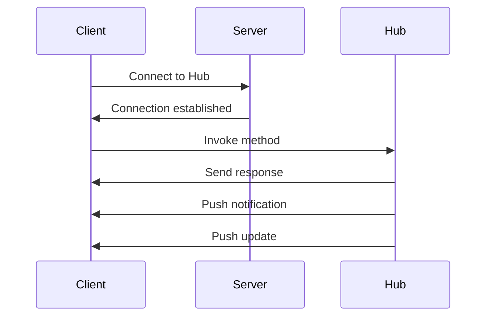
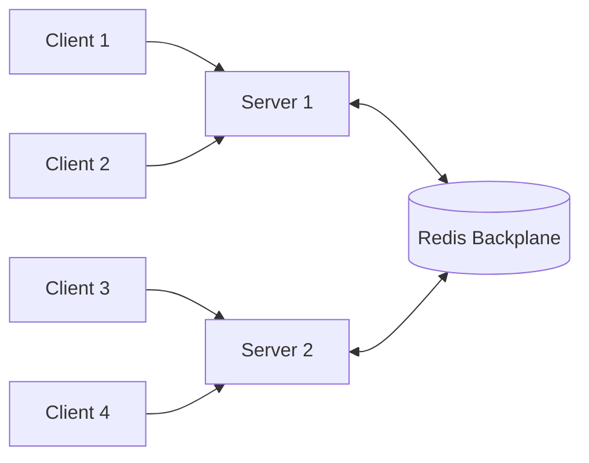

# How to Build Real-Time Apps with SignalR in .NET

Author: [nawazdhandala](https://www.github.com/nawazdhandala)

Tags: .NET, SignalR, Real-Time, WebSocket, C#, ASP.NET Core

Description: Learn how to build real-time web applications using SignalR in .NET with practical examples for notifications, live updates, and collaborative features.

---

Modern applications need real-time features. Chat messages should appear instantly. Dashboard metrics should update live. Collaborative tools need to sync changes across users immediately. SignalR makes building these features straightforward by abstracting away the complexity of WebSockets and providing automatic fallbacks for older browsers.

## How SignalR Works

SignalR establishes persistent connections between clients and your server. When the server needs to push data, it sends it through the existing connection without the client needing to poll.



SignalR automatically chooses the best transport: WebSockets when available, Server-Sent Events, or Long Polling as fallbacks.

## Setting Up SignalR

Add SignalR to your ASP.NET Core project:

```csharp
// Program.cs
var builder = WebApplication.CreateBuilder(args);

// Add SignalR services
builder.Services.AddSignalR();

var app = builder.Build();

// Map hub endpoint
app.MapHub<NotificationHub>("/hubs/notifications");

app.Run();
```

## Creating Your First Hub

A Hub is the server-side endpoint that clients connect to:

```csharp
// Hubs/NotificationHub.cs
using Microsoft.AspNetCore.SignalR;

public class NotificationHub : Hub
{
    private readonly ILogger<NotificationHub> _logger;

    public NotificationHub(ILogger<NotificationHub> logger)
    {
        _logger = logger;
    }

    // Called when a client connects
    public override async Task OnConnectedAsync()
    {
        _logger.LogInformation("Client connected: {ConnectionId}", Context.ConnectionId);

        // Notify others that a user joined
        await Clients.Others.SendAsync("UserJoined", Context.ConnectionId);

        await base.OnConnectedAsync();
    }

    // Called when a client disconnects
    public override async Task OnDisconnectedAsync(Exception? exception)
    {
        _logger.LogInformation("Client disconnected: {ConnectionId}", Context.ConnectionId);

        await Clients.Others.SendAsync("UserLeft", Context.ConnectionId);

        await base.OnDisconnectedAsync(exception);
    }

    // Method that clients can invoke
    public async Task SendMessage(string message)
    {
        // Send to all connected clients
        await Clients.All.SendAsync("ReceiveMessage", Context.ConnectionId, message);
    }
}
```

## JavaScript Client Setup

Connect from a browser:

```html
<!-- Include SignalR client library -->
<script src="https://cdnjs.cloudflare.com/ajax/libs/microsoft-signalr/8.0.0/signalr.min.js"></script>

<script>
// Create connection
const connection = new signalR.HubConnectionBuilder()
    .withUrl("/hubs/notifications")
    .withAutomaticReconnect()
    .configureLogging(signalR.LogLevel.Information)
    .build();

// Handle incoming messages
connection.on("ReceiveMessage", (userId, message) => {
    console.log(`${userId}: ${message}`);
    appendMessage(userId, message);
});

connection.on("UserJoined", (connectionId) => {
    console.log(`User joined: ${connectionId}`);
});

// Start connection
async function start() {
    try {
        await connection.start();
        console.log("Connected to SignalR hub");
    } catch (err) {
        console.error("Connection failed:", err);
        setTimeout(start, 5000);
    }
}

// Send a message
async function sendMessage(message) {
    try {
        await connection.invoke("SendMessage", message);
    } catch (err) {
        console.error("Failed to send message:", err);
    }
}

start();
</script>
```

## .NET Client Setup

Connect from another .NET application:

```csharp
// Install Microsoft.AspNetCore.SignalR.Client NuGet package
using Microsoft.AspNetCore.SignalR.Client;

var connection = new HubConnectionBuilder()
    .WithUrl("https://myapp.com/hubs/notifications")
    .WithAutomaticReconnect()
    .Build();

// Handle incoming messages
connection.On<string, string>("ReceiveMessage", (userId, message) =>
{
    Console.WriteLine($"{userId}: {message}");
});

// Handle reconnection
connection.Reconnecting += error =>
{
    Console.WriteLine("Reconnecting...");
    return Task.CompletedTask;
};

connection.Reconnected += connectionId =>
{
    Console.WriteLine($"Reconnected with ID: {connectionId}");
    return Task.CompletedTask;
};

// Start connection
await connection.StartAsync();

// Send messages
await connection.InvokeAsync("SendMessage", "Hello from .NET client");
```

## Using Groups

Groups let you send messages to subsets of connected clients:

```csharp
// Hubs/ChatHub.cs
public class ChatHub : Hub
{
    // Join a chat room
    public async Task JoinRoom(string roomName)
    {
        await Groups.AddToGroupAsync(Context.ConnectionId, roomName);

        await Clients.Group(roomName).SendAsync(
            "SystemMessage",
            $"{Context.ConnectionId} joined {roomName}");
    }

    // Leave a chat room
    public async Task LeaveRoom(string roomName)
    {
        await Groups.RemoveFromGroupAsync(Context.ConnectionId, roomName);

        await Clients.Group(roomName).SendAsync(
            "SystemMessage",
            $"{Context.ConnectionId} left {roomName}");
    }

    // Send message to a specific room
    public async Task SendToRoom(string roomName, string message)
    {
        await Clients.Group(roomName).SendAsync(
            "ReceiveMessage",
            Context.ConnectionId,
            message);
    }

    // Send private message
    public async Task SendPrivate(string connectionId, string message)
    {
        await Clients.Client(connectionId).SendAsync(
            "PrivateMessage",
            Context.ConnectionId,
            message);
    }
}
```

## Strongly-Typed Hubs

Define an interface for type-safe client method calls:

```csharp
// Interfaces/INotificationClient.cs
public interface INotificationClient
{
    Task ReceiveNotification(NotificationDto notification);
    Task OrderStatusChanged(Guid orderId, string status);
    Task UserTyping(string userName);
    Task UserStoppedTyping(string userName);
}

// DTOs/NotificationDto.cs
public record NotificationDto
{
    public string Title { get; init; } = string.Empty;
    public string Message { get; init; } = string.Empty;
    public string Type { get; init; } = "info";
    public DateTime Timestamp { get; init; }
}

// Hubs/TypedNotificationHub.cs
public class TypedNotificationHub : Hub<INotificationClient>
{
    public async Task NotifyOrderStatus(Guid orderId, string status)
    {
        // Compile-time safety for client method calls
        await Clients.All.OrderStatusChanged(orderId, status);
    }

    public async Task BroadcastNotification(NotificationDto notification)
    {
        await Clients.All.ReceiveNotification(notification);
    }

    public async Task StartTyping(string roomName)
    {
        var userName = Context.User?.Identity?.Name ?? "Anonymous";
        await Clients.OthersInGroup(roomName).UserTyping(userName);
    }
}
```

## Sending Messages from Outside Hubs

Use IHubContext to send messages from services or controllers:

```csharp
// Services/OrderService.cs
public class OrderService
{
    private readonly IHubContext<NotificationHub, INotificationClient> _hubContext;

    public OrderService(IHubContext<NotificationHub, INotificationClient> hubContext)
    {
        _hubContext = hubContext;
    }

    public async Task UpdateOrderStatusAsync(Guid orderId, string newStatus)
    {
        // Update in database...

        // Notify connected clients
        await _hubContext.Clients.All.OrderStatusChanged(orderId, newStatus);
    }
}

// Controllers/OrdersController.cs
[ApiController]
[Route("api/[controller]")]
public class OrdersController : ControllerBase
{
    private readonly IHubContext<NotificationHub> _hubContext;

    public OrdersController(IHubContext<NotificationHub> hubContext)
    {
        _hubContext = hubContext;
    }

    [HttpPost("{orderId}/ship")]
    public async Task<IActionResult> ShipOrder(Guid orderId)
    {
        // Process shipping...

        // Send notification
        await _hubContext.Clients.All.SendAsync("OrderShipped", orderId);

        return Ok();
    }
}
```

## User-Based Messaging

Associate connections with authenticated users:

```csharp
// Hubs/UserNotificationHub.cs
[Authorize]
public class UserNotificationHub : Hub<INotificationClient>
{
    // Get the authenticated user's ID
    private string UserId => Context.User?.FindFirst(ClaimTypes.NameIdentifier)?.Value
        ?? throw new InvalidOperationException("User not authenticated");

    public override async Task OnConnectedAsync()
    {
        // Add to user-specific group for targeting by user ID
        await Groups.AddToGroupAsync(Context.ConnectionId, $"user_{UserId}");
        await base.OnConnectedAsync();
    }
}

// Send to specific user from a service
public class NotificationService
{
    private readonly IHubContext<UserNotificationHub, INotificationClient> _hubContext;

    public NotificationService(IHubContext<UserNotificationHub, INotificationClient> hubContext)
    {
        _hubContext = hubContext;
    }

    public async Task NotifyUserAsync(string userId, NotificationDto notification)
    {
        // Send to all connections for this user
        await _hubContext.Clients.User(userId).ReceiveNotification(notification);

        // Or use the group approach
        await _hubContext.Clients.Group($"user_{userId}").ReceiveNotification(notification);
    }
}
```

## Scaling with Redis Backplane

For multiple server instances, use Redis to synchronize messages:

```csharp
// Program.cs
builder.Services.AddSignalR()
    .AddStackExchangeRedis(options =>
    {
        options.Configuration = builder.Configuration.GetConnectionString("Redis");
        options.Configuration.ChannelPrefix = RedisChannel.Literal("MyApp");
    });
```



## Handling Connection State

Track connection state for presence features:

```csharp
// Services/PresenceTracker.cs
public class PresenceTracker
{
    private readonly ConcurrentDictionary<string, HashSet<string>> _onlineUsers = new();

    public Task<bool> UserConnected(string userId, string connectionId)
    {
        var isNewUser = false;

        _onlineUsers.AddOrUpdate(
            userId,
            _ =>
            {
                isNewUser = true;
                return new HashSet<string> { connectionId };
            },
            (_, connections) =>
            {
                connections.Add(connectionId);
                return connections;
            });

        return Task.FromResult(isNewUser);
    }

    public Task<bool> UserDisconnected(string userId, string connectionId)
    {
        if (!_onlineUsers.TryGetValue(userId, out var connections))
        {
            return Task.FromResult(false);
        }

        connections.Remove(connectionId);

        if (connections.Count == 0)
        {
            _onlineUsers.TryRemove(userId, out _);
            return Task.FromResult(true); // User is now offline
        }

        return Task.FromResult(false);
    }

    public Task<string[]> GetOnlineUsers()
    {
        return Task.FromResult(_onlineUsers.Keys.ToArray());
    }
}
```

Use in your hub:

```csharp
public class PresenceHub : Hub
{
    private readonly PresenceTracker _tracker;

    public PresenceHub(PresenceTracker tracker)
    {
        _tracker = tracker;
    }

    public override async Task OnConnectedAsync()
    {
        var userId = Context.User?.Identity?.Name ?? Context.ConnectionId;
        var isNewUser = await _tracker.UserConnected(userId, Context.ConnectionId);

        if (isNewUser)
        {
            await Clients.Others.SendAsync("UserOnline", userId);
        }

        // Send current online users to the connecting client
        var onlineUsers = await _tracker.GetOnlineUsers();
        await Clients.Caller.SendAsync("OnlineUsersList", onlineUsers);

        await base.OnConnectedAsync();
    }

    public override async Task OnDisconnectedAsync(Exception? exception)
    {
        var userId = Context.User?.Identity?.Name ?? Context.ConnectionId;
        var isOffline = await _tracker.UserDisconnected(userId, Context.ConnectionId);

        if (isOffline)
        {
            await Clients.Others.SendAsync("UserOffline", userId);
        }

        await base.OnDisconnectedAsync(exception);
    }
}
```

## Error Handling

Handle errors gracefully:

```csharp
// Hubs/ChatHub.cs
public class ChatHub : Hub
{
    public async Task SendMessage(string roomName, string message)
    {
        if (string.IsNullOrWhiteSpace(message))
        {
            throw new HubException("Message cannot be empty");
        }

        if (message.Length > 1000)
        {
            throw new HubException("Message too long");
        }

        await Clients.Group(roomName).SendAsync("ReceiveMessage", Context.ConnectionId, message);
    }
}
```

Client-side error handling:

```javascript
connection.invoke("SendMessage", roomName, message)
    .catch(err => {
        if (err.message.includes("Message cannot be empty")) {
            showError("Please enter a message");
        } else {
            showError("Failed to send message");
        }
    });
```

## Summary

| Feature | Use Case |
|---------|----------|
| All clients | Broadcast announcements |
| Groups | Chat rooms, topic channels |
| User | Personal notifications |
| Caller | Response to invoker |
| Others | Notify except sender |

SignalR simplifies real-time communication in .NET applications. Start with basic hubs for simple notifications, add groups for room-based features, and use strongly-typed hubs for maintainability. When scaling horizontally, add a Redis backplane to keep all server instances synchronized. The patterns shown here provide a solid foundation for building interactive, real-time applications.
