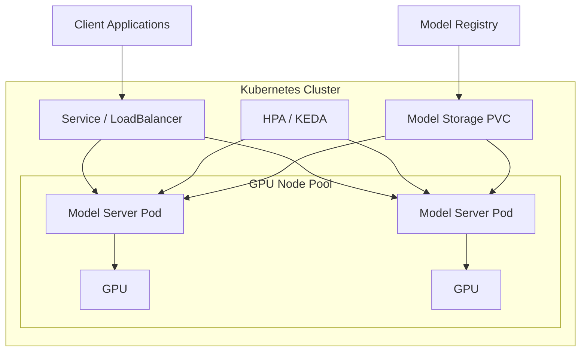

# Running Self-Hosted LLMs on Kubernetes: A Complete Guide

Author: [nawazdhandala](https://www.github.com/nawazdhandala)

Tags: Kubernetes, LLM, GPU, Docker, Machine Learning, AI, Self-Hosting, vLLM

Description: A comprehensive guide to deploying and running self-hosted large language models on Kubernetes, covering GPU access, model serving, and production best practices.

---

Running large language models (LLMs) in your own infrastructure gives you complete control over data privacy, latency, and costs. Kubernetes provides the orchestration layer needed to manage these resource-intensive workloads effectively. This guide walks you through everything you need to deploy self-hosted LLMs on Kubernetes.

## Why Self-Host LLMs?

Before diving into the technical details, consider the key reasons for self-hosting:

- **Data Privacy**: Sensitive data never leaves your infrastructure
- **Cost Control**: Predictable costs at scale compared to per-token API pricing
- **Latency**: Eliminate network round-trips to external APIs
- **Customization**: Fine-tune models for your specific use case
- **Availability**: No dependency on external service availability

## Architecture Overview

A typical self-hosted LLM deployment on Kubernetes involves several components:



## Prerequisites

Before you begin, ensure you have:

- A Kubernetes cluster (1.25+) with GPU nodes
- `kubectl` configured to access your cluster
- Helm 3.x installed
- GPU drivers installed on worker nodes
- At least one node with an NVIDIA GPU (16GB+ VRAM recommended)

## Step 1: Setting Up GPU Access in Kubernetes

GPU access is the foundation of LLM deployment. Kubernetes needs proper drivers and device plugins to recognize and allocate GPUs to pods.

### Install NVIDIA Device Plugin

The NVIDIA device plugin exposes GPUs as a schedulable resource in Kubernetes.

The following command installs the NVIDIA device plugin as a DaemonSet, which ensures the plugin runs on every GPU-enabled node in your cluster:

```bash
# Add the NVIDIA helm repository
helm repo add nvdp https://nvidia.github.io/k8s-device-plugin
helm repo update

# Install the device plugin
helm install nvidia-device-plugin nvdp/nvidia-device-plugin \
  --namespace kube-system \
  --set gfd.enabled=true
```

### Verify GPU Detection

After installation, verify that Kubernetes can see your GPUs.

This command shows the allocatable GPU resources across all nodes:

```bash
kubectl get nodes -o json | jq '.items[] | {name: .metadata.name, gpus: .status.allocatable["nvidia.com/gpu"]}'
```

You should see output similar to:

```json
{
  "name": "gpu-node-1",
  "gpus": "2"
}
```

### GPU Resource Requests

When creating pods that need GPU access, specify GPU requirements in the resource section.

The following manifest shows how to request one NVIDIA GPU for a pod:

```yaml
apiVersion: v1
kind: Pod
metadata:
  name: gpu-test
spec:
  containers:
  - name: cuda-container
    image: nvidia/cuda:12.0-base
    resources:
      limits:
        # Request exactly 1 GPU
        nvidia.com/gpu: 1
    command: ["nvidia-smi"]
  restartPolicy: Never
```

### GPU Sharing with Time-Slicing

For development environments or smaller models, you can share GPUs across multiple pods using time-slicing.

Create a ConfigMap that configures the NVIDIA device plugin to share each GPU across up to 4 pods:

```yaml
# gpu-sharing-config.yaml
apiVersion: v1
kind: ConfigMap
metadata:
  name: nvidia-device-plugin-config
  namespace: kube-system
data:
  config.yaml: |
    version: v1
    sharing:
      timeSlicing:
        # Allow up to 4 pods to share each GPU
        resources:
        - name: nvidia.com/gpu
          replicas: 4
```

Apply the configuration:

```bash
kubectl apply -f gpu-sharing-config.yaml
```

## Step 2: Choosing a Model Serving Framework

Several frameworks can serve LLMs in production. Here are the most popular options:

| Framework | Pros | Cons | Best For |
|-----------|------|------|----------|
| vLLM | Highest throughput, PagedAttention | Python-only | High-volume inference |
| Text Generation Inference (TGI) | Production-ready, Hugging Face integration | Resource intensive | Enterprise deployments |
| Ollama | Easy setup, multi-model support | Lower throughput | Development, small teams |
| llama.cpp | CPU support, low memory | Limited features | Resource-constrained environments |

For this guide, we'll focus on vLLM due to its excellent performance characteristics.

## Step 3: Deploying vLLM on Kubernetes

vLLM is a high-throughput LLM serving engine that uses PagedAttention for efficient memory management.

### Create a Namespace

Isolate LLM workloads in their own namespace for better resource management:

```bash
kubectl create namespace llm-serving
```

### Model Storage Setup

Large models need persistent storage. Create a PersistentVolumeClaim for model storage.

This PVC requests 100GB of storage, which is sufficient for most 7B-13B parameter models:

```yaml
# model-storage-pvc.yaml
apiVersion: v1
kind: PersistentVolumeClaim
metadata:
  name: model-storage
  namespace: llm-serving
spec:
  accessModes:
    # ReadWriteMany allows multiple pods to access the same models
    - ReadWriteMany
  resources:
    requests:
      storage: 100Gi
  # Use your cluster's storage class
  storageClassName: fast-ssd
```

Apply the PVC:

```bash
kubectl apply -f model-storage-pvc.yaml
```

### Download Models

Create a job to download models from Hugging Face.

This job downloads the Mistral-7B-Instruct model to the persistent volume. Replace the model name with your desired model:

```yaml
# model-downloader.yaml
apiVersion: batch/v1
kind: Job
metadata:
  name: model-downloader
  namespace: llm-serving
spec:
  template:
    spec:
      containers:
      - name: downloader
        image: python:3.11-slim
        command:
        - /bin/bash
        - -c
        - |
          pip install huggingface_hub
          python -c "
          from huggingface_hub import snapshot_download
          # Download Mistral-7B-Instruct-v0.2 to the models directory
          snapshot_download(
              repo_id='mistralai/Mistral-7B-Instruct-v0.2',
              local_dir='/models/mistral-7b-instruct',
              local_dir_use_symlinks=False
          )
          "
        volumeMounts:
        - name: model-storage
          mountPath: /models
        env:
        # Optional: Add Hugging Face token for gated models
        - name: HF_TOKEN
          valueFrom:
            secretKeyRef:
              name: huggingface-secret
              key: token
              optional: true
      volumes:
      - name: model-storage
        persistentVolumeClaim:
          claimName: model-storage
      restartPolicy: Never
  backoffLimit: 3
```

If you need to access gated models, create a secret with your Hugging Face token:

```bash
kubectl create secret generic huggingface-secret \
  --from-literal=token=your-hf-token \
  -n llm-serving
```

Run the download job:

```bash
kubectl apply -f model-downloader.yaml
kubectl wait --for=condition=complete job/model-downloader -n llm-serving --timeout=30m
```

### Deploy vLLM Server

Create the main vLLM deployment.

This deployment runs vLLM with optimized settings for production use. Key configurations include tensor parallelism, GPU memory utilization, and the maximum model length:

```yaml
# vllm-deployment.yaml
apiVersion: apps/v1
kind: Deployment
metadata:
  name: vllm-server
  namespace: llm-serving
  labels:
    app: vllm-server
spec:
  # Start with 1 replica, scale based on demand
  replicas: 1
  selector:
    matchLabels:
      app: vllm-server
  template:
    metadata:
      labels:
        app: vllm-server
    spec:
      containers:
      - name: vllm
        image: vllm/vllm-openai:latest
        args:
        # Path to the downloaded model
        - --model=/models/mistral-7b-instruct
        # Use all available GPUs for tensor parallelism
        - --tensor-parallel-size=1
        # Maximum GPU memory to use (90% recommended)
        - --gpu-memory-utilization=0.9
        # Maximum sequence length
        - --max-model-len=8192
        # Enable continuous batching
        - --enable-chunked-prefill
        # Serve on port 8000
        - --port=8000
        # Trust remote code if using custom models
        - --trust-remote-code
        ports:
        - containerPort: 8000
          name: http
        resources:
          limits:
            # Request 1 GPU
            nvidia.com/gpu: 1
            memory: 32Gi
          requests:
            memory: 16Gi
        volumeMounts:
        - name: model-storage
          mountPath: /models
          readOnly: true
        # Shared memory for PyTorch DataLoader
        - name: shm
          mountPath: /dev/shm
        readinessProbe:
          httpGet:
            path: /health
            port: 8000
          initialDelaySeconds: 60
          periodSeconds: 10
        livenessProbe:
          httpGet:
            path: /health
            port: 8000
          initialDelaySeconds: 120
          periodSeconds: 30
      volumes:
      - name: model-storage
        persistentVolumeClaim:
          claimName: model-storage
      - name: shm
        emptyDir:
          medium: Memory
          # Shared memory size for inter-process communication
          sizeLimit: 8Gi
      # Schedule on nodes with GPUs
      nodeSelector:
        nvidia.com/gpu.present: "true"
      tolerations:
      - key: nvidia.com/gpu
        operator: Exists
        effect: NoSchedule
```

Apply the deployment:

```bash
kubectl apply -f vllm-deployment.yaml
```

### Expose the Service

Create a service to access the LLM server.

This service exposes the vLLM server internally within the cluster on port 8000:

```yaml
# vllm-service.yaml
apiVersion: v1
kind: Service
metadata:
  name: vllm-server
  namespace: llm-serving
spec:
  selector:
    app: vllm-server
  ports:
  - port: 8000
    targetPort: 8000
    name: http
  type: ClusterIP
```

For external access, you can create an Ingress or LoadBalancer service:

```yaml
# vllm-ingress.yaml
apiVersion: networking.k8s.io/v1
kind: Ingress
metadata:
  name: vllm-ingress
  namespace: llm-serving
  annotations:
    # Use your ingress controller's annotations
    nginx.ingress.kubernetes.io/proxy-read-timeout: "3600"
    nginx.ingress.kubernetes.io/proxy-send-timeout: "3600"
spec:
  ingressClassName: nginx
  rules:
  - host: llm.your-domain.com
    http:
      paths:
      - path: /
        pathType: Prefix
        backend:
          service:
            name: vllm-server
            port:
              number: 8000
```

Apply the service and ingress:

```bash
kubectl apply -f vllm-service.yaml
kubectl apply -f vllm-ingress.yaml
```

## Step 4: Accessing the Model

vLLM exposes an OpenAI-compatible API, making it easy to integrate with existing applications.

### Test the Deployment

Verify the deployment is running by checking pod status and logs:

```bash
# Check pod status
kubectl get pods -n llm-serving

# View logs
kubectl logs -f deployment/vllm-server -n llm-serving
```

### Port Forward for Local Testing

For local testing, use port-forwarding to access the service:

```bash
kubectl port-forward svc/vllm-server 8000:8000 -n llm-serving
```

### API Examples

Once the service is running, you can interact with it using the OpenAI API format.

#### Using cURL

Send a chat completion request to the local endpoint:

```bash
curl http://localhost:8000/v1/chat/completions \
  -H "Content-Type: application/json" \
  -d '{
    "model": "/models/mistral-7b-instruct",
    "messages": [
      {"role": "user", "content": "Explain Kubernetes in simple terms"}
    ],
    "max_tokens": 500,
    "temperature": 0.7
  }'
```

#### Using Python

The OpenAI Python client works seamlessly with vLLM.

This example shows how to use the OpenAI client library to interact with your self-hosted model:

```python
from openai import OpenAI

# Point to your vLLM server
client = OpenAI(
    base_url="http://localhost:8000/v1",
    # vLLM doesn't require an API key, but the client needs one
    api_key="not-needed"
)

# Make a chat completion request
response = client.chat.completions.create(
    model="/models/mistral-7b-instruct",
    messages=[
        {"role": "system", "content": "You are a helpful assistant."},
        {"role": "user", "content": "What is Kubernetes?"}
    ],
    max_tokens=500,
    temperature=0.7
)

print(response.choices[0].message.content)
```

#### Streaming Responses

For real-time streaming responses:

```python
from openai import OpenAI

client = OpenAI(
    base_url="http://localhost:8000/v1",
    api_key="not-needed"
)

# Stream the response token by token
stream = client.chat.completions.create(
    model="/models/mistral-7b-instruct",
    messages=[{"role": "user", "content": "Write a haiku about containers"}],
    stream=True
)

for chunk in stream:
    if chunk.choices[0].delta.content:
        print(chunk.choices[0].delta.content, end="", flush=True)
```

#### Using JavaScript/TypeScript

The OpenAI Node.js SDK also works with vLLM:

```typescript
import OpenAI from 'openai';

// Configure client to use your self-hosted endpoint
const client = new OpenAI({
  baseURL: 'http://localhost:8000/v1',
  apiKey: 'not-needed'
});

async function chat() {
  const completion = await client.chat.completions.create({
    model: '/models/mistral-7b-instruct',
    messages: [
      { role: 'user', content: 'Explain microservices architecture' }
    ],
    max_tokens: 500
  });

  console.log(completion.choices[0].message.content);
}

chat();
```

## Step 5: Production Configuration

For production deployments, consider these additional configurations.

### Autoscaling with KEDA

Scale based on request queue length using KEDA (Kubernetes Event-driven Autoscaling).

First, install KEDA in your cluster:

```bash
helm repo add kedacore https://kedacore.github.io/charts
helm repo update
helm install keda kedacore/keda --namespace keda --create-namespace
```

Then create a ScaledObject that scales based on the pending requests metric:

```yaml
# vllm-keda.yaml
apiVersion: keda.sh/v1alpha1
kind: ScaledObject
metadata:
  name: vllm-scaler
  namespace: llm-serving
spec:
  scaleTargetRef:
    name: vllm-server
  minReplicaCount: 1
  maxReplicaCount: 5
  triggers:
  - type: prometheus
    metadata:
      # Scale based on pending requests
      serverAddress: http://prometheus.monitoring:9090
      metricName: vllm_pending_requests
      threshold: "10"
      query: |
        sum(vllm_num_requests_waiting{namespace="llm-serving"})
```

### Resource Quotas

Set resource quotas to prevent runaway costs.

This ResourceQuota limits the namespace to a maximum of 8 GPUs and 256GB of memory:

```yaml
# resource-quota.yaml
apiVersion: v1
kind: ResourceQuota
metadata:
  name: llm-serving-quota
  namespace: llm-serving
spec:
  hard:
    # Limit total GPUs in the namespace
    nvidia.com/gpu: "8"
    # Limit total memory
    limits.memory: 256Gi
```

### Network Policies

Restrict network access to the LLM service for security.

This network policy only allows traffic from pods with the `llm-client: allowed` label:

```yaml
# network-policy.yaml
apiVersion: networking.k8s.io/v1
kind: NetworkPolicy
metadata:
  name: vllm-network-policy
  namespace: llm-serving
spec:
  podSelector:
    matchLabels:
      app: vllm-server
  policyTypes:
  - Ingress
  ingress:
  # Only allow traffic from pods with this label
  - from:
    - podSelector:
        matchLabels:
          llm-client: allowed
    ports:
    - port: 8000
```

### Monitoring and Observability

vLLM exposes Prometheus metrics for monitoring. Create a ServiceMonitor to scrape these metrics.

For comprehensive LLM monitoring, including tracking response quality and latency, you might want to explore dedicated observability solutions. See our guide on [Monitoring LLM Applications with Openlit and OneUptime](https://oneuptime.com/blog/post/2024-09-13-monitoring-llm-with-openlit-and-oneuptime/view) for more details.

The following ServiceMonitor configures Prometheus to scrape vLLM metrics:

```yaml
# vllm-servicemonitor.yaml
apiVersion: monitoring.coreos.com/v1
kind: ServiceMonitor
metadata:
  name: vllm-monitor
  namespace: llm-serving
spec:
  selector:
    matchLabels:
      app: vllm-server
  endpoints:
  - port: http
    path: /metrics
    interval: 15s
```

Key metrics to monitor include:

- `vllm_num_requests_running`: Active requests being processed
- `vllm_num_requests_waiting`: Requests in the queue
- `vllm_gpu_cache_usage_perc`: GPU memory cache utilization
- `vllm_avg_generation_throughput_toks_per_s`: Token generation speed

## Step 6: Multi-Model Deployment

For serving multiple models, you can deploy multiple vLLM instances or use model routing.

### Multiple Deployments

Create separate deployments for each model, each with its own resource allocation:

```yaml
# llama-deployment.yaml
apiVersion: apps/v1
kind: Deployment
metadata:
  name: vllm-llama
  namespace: llm-serving
spec:
  replicas: 1
  selector:
    matchLabels:
      app: vllm-llama
  template:
    metadata:
      labels:
        app: vllm-llama
    spec:
      containers:
      - name: vllm
        image: vllm/vllm-openai:latest
        args:
        - --model=/models/llama-2-7b-chat
        - --port=8000
        # ... other args
        resources:
          limits:
            nvidia.com/gpu: 1
        volumeMounts:
        - name: model-storage
          mountPath: /models
      volumes:
      - name: model-storage
        persistentVolumeClaim:
          claimName: model-storage
```

### API Gateway for Model Routing

Use an API gateway to route requests to different models.

This Nginx configuration routes requests to different model backends based on the URL path:

```yaml
# model-router.yaml
apiVersion: v1
kind: ConfigMap
metadata:
  name: model-router-config
  namespace: llm-serving
data:
  nginx.conf: |
    upstream mistral {
      server vllm-mistral:8000;
    }
    upstream llama {
      server vllm-llama:8000;
    }

    server {
      listen 80;

      # Route to different models based on path
      location /v1/mistral/ {
        proxy_pass http://mistral/v1/;
      }

      location /v1/llama/ {
        proxy_pass http://llama/v1/;
      }
    }
```

## Troubleshooting

Common issues and solutions when running LLMs on Kubernetes.

### GPU Not Detected

If pods can't access GPUs, check the device plugin status:

```bash
# Check device plugin pods
kubectl get pods -n kube-system -l app=nvidia-device-plugin-daemonset

# Check node resources
kubectl describe node <gpu-node-name> | grep -A5 "Allocatable"
```

### Out of Memory Errors

If the model fails to load due to memory constraints, try reducing GPU memory utilization or the maximum sequence length:

```yaml
args:
  # Reduce GPU memory usage
  - --gpu-memory-utilization=0.8
  # Reduce max sequence length
  - --max-model-len=4096
```

### Slow Startup

Large models take time to load. Increase the readiness probe initial delay:

```yaml
readinessProbe:
  httpGet:
    path: /health
    port: 8000
  # Increase for larger models
  initialDelaySeconds: 300
  periodSeconds: 10
```

### Connection Timeouts

For long-running requests, configure appropriate timeouts in your ingress controller:

```yaml
annotations:
  # Allow up to 10 minutes for generation
  nginx.ingress.kubernetes.io/proxy-read-timeout: "600"
  nginx.ingress.kubernetes.io/proxy-send-timeout: "600"
```

## Security Considerations

When exposing LLMs, implement proper security measures.

### Authentication

Add authentication using an API gateway or sidecar proxy.

This example shows a simple API key validation using Nginx as a sidecar:

```yaml
# auth-sidecar.yaml
- name: auth-proxy
  image: nginx:alpine
  volumeMounts:
  - name: auth-config
    mountPath: /etc/nginx/conf.d
  ports:
  - containerPort: 80
```

### Rate Limiting

Implement rate limiting to prevent abuse.

This Nginx configuration limits each client IP to 10 requests per second:

```yaml
apiVersion: v1
kind: ConfigMap
metadata:
  name: ratelimit-config
data:
  nginx.conf: |
    limit_req_zone $binary_remote_addr zone=llm:10m rate=10r/s;

    server {
      location / {
        limit_req zone=llm burst=20;
        proxy_pass http://vllm-server:8000;
      }
    }
```

### Input Validation

Always validate and sanitize inputs before sending them to the model to prevent prompt injection attacks.

## Summary

Running self-hosted LLMs on Kubernetes requires careful attention to GPU management, resource allocation, and operational best practices. The key steps are:

1. **Set up GPU access** with the NVIDIA device plugin and proper resource requests
2. **Choose a serving framework** like vLLM based on your throughput and latency requirements
3. **Deploy the model server** with appropriate resource limits and health checks
4. **Expose the API** using services and ingress with proper timeouts
5. **Configure production settings** including autoscaling, monitoring, and security

With this foundation, you can serve LLMs at scale while maintaining control over your data and infrastructure.
