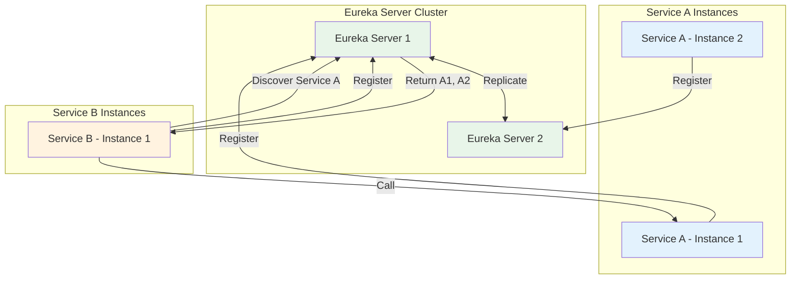

# How to Build a Service Registry with Eureka in Spring

Author: [nawazdhandala](https://www.github.com/nawazdhandala)

Tags: Java, Spring Boot, Eureka, Service Discovery, Microservices, Netflix OSS, Spring Cloud, Load Balancing

Description: Learn how to build a service registry with Netflix Eureka in Spring Boot. This guide covers server setup, client registration, service discovery, and high availability configurations for microservices.

---

> In a microservices architecture, services need to find each other. Hardcoding service locations does not scale. Netflix Eureka solves this by providing a service registry where services register themselves and discover other services dynamically. This guide shows you how to set up Eureka with Spring Boot.

Service discovery eliminates the need for manual configuration of service locations. When a new service instance starts, it registers with Eureka. When a service needs to call another service, it asks Eureka for available instances. This makes your system resilient to service restarts and scaling.

---

## Architecture Overview

Eureka follows a client-server model:



---

## Setting Up the Eureka Server

### Dependencies

Create a new Spring Boot project for the Eureka server:

```xml
<!-- pom.xml for Eureka Server -->
<dependencies>
    <!-- Eureka Server dependency -->
    <dependency>
        <groupId>org.springframework.cloud</groupId>
        <artifactId>spring-cloud-starter-netflix-eureka-server</artifactId>
    </dependency>

    <!-- Spring Boot Actuator for health checks -->
    <dependency>
        <groupId>org.springframework.boot</groupId>
        <artifactId>spring-boot-starter-actuator</artifactId>
    </dependency>
</dependencies>

<dependencyManagement>
    <dependencies>
        <!-- Spring Cloud BOM -->
        <dependency>
            <groupId>org.springframework.cloud</groupId>
            <artifactId>spring-cloud-dependencies</artifactId>
            <version>2023.0.0</version>
            <type>pom</type>
            <scope>import</scope>
        </dependency>
    </dependencies>
</dependencyManagement>
```

### Server Application

Enable the Eureka server with the `@EnableEurekaServer` annotation:

```java
// EurekaServerApplication.java
// Main application class for Eureka Server
package com.example.eurekaserver;

import org.springframework.boot.SpringApplication;
import org.springframework.boot.autoconfigure.SpringBootApplication;
import org.springframework.cloud.netflix.eureka.server.EnableEurekaServer;

@SpringBootApplication
@EnableEurekaServer  // Enables Eureka Server functionality
public class EurekaServerApplication {

    public static void main(String[] args) {
        SpringApplication.run(EurekaServerApplication.class, args);
    }
}
```

### Server Configuration

Configure the Eureka server in `application.yml`:

```yaml
# application.yml for Eureka Server
server:
  port: 8761  # Default Eureka port

spring:
  application:
    name: eureka-server

eureka:
  instance:
    hostname: localhost
  client:
    # Don't register itself (it's the server)
    register-with-eureka: false
    # Don't fetch registry (it is the registry)
    fetch-registry: false
    service-url:
      defaultZone: http://${eureka.instance.hostname}:${server.port}/eureka/
  server:
    # Disable self-preservation in development
    enable-self-preservation: false
    # Time to wait before cleaning up expired instances
    eviction-interval-timer-in-ms: 5000

management:
  endpoints:
    web:
      exposure:
        include: health,info
```

---

## Setting Up Eureka Clients

### Client Dependencies

Add the Eureka client dependency to your microservices:

```xml
<!-- pom.xml for Eureka Client (microservice) -->
<dependencies>
    <!-- Spring Boot Web -->
    <dependency>
        <groupId>org.springframework.boot</groupId>
        <artifactId>spring-boot-starter-web</artifactId>
    </dependency>

    <!-- Eureka Client -->
    <dependency>
        <groupId>org.springframework.cloud</groupId>
        <artifactId>spring-cloud-starter-netflix-eureka-client</artifactId>
    </dependency>

    <!-- Spring Boot Actuator -->
    <dependency>
        <groupId>org.springframework.boot</groupId>
        <artifactId>spring-boot-starter-actuator</artifactId>
    </dependency>
</dependencies>
```

### Client Application

The client automatically registers when Eureka client is on the classpath:

```java
// OrderServiceApplication.java
// Order service that registers with Eureka
package com.example.orderservice;

import org.springframework.boot.SpringApplication;
import org.springframework.boot.autoconfigure.SpringBootApplication;

@SpringBootApplication
public class OrderServiceApplication {

    public static void main(String[] args) {
        SpringApplication.run(OrderServiceApplication.class, args);
    }
}
```

### Client Configuration

Configure the Eureka client in `application.yml`:

```yaml
# application.yml for Order Service
server:
  port: 8081

spring:
  application:
    name: order-service  # Service name used for discovery

eureka:
  client:
    service-url:
      # Eureka server URL(s)
      defaultZone: http://localhost:8761/eureka/
    # How often to fetch the registry (seconds)
    registry-fetch-interval-seconds: 5
  instance:
    # Use IP address instead of hostname
    prefer-ip-address: true
    # Instance ID format
    instance-id: ${spring.application.name}:${server.port}
    # Heartbeat interval (seconds)
    lease-renewal-interval-in-seconds: 10
    # Time before instance is removed if no heartbeat
    lease-expiration-duration-in-seconds: 30

management:
  endpoints:
    web:
      exposure:
        include: health,info
  endpoint:
    health:
      show-details: always
```

---

## Service Discovery with Load Balancing

Use Spring Cloud LoadBalancer to call other services by name:

```java
// WebClientConfig.java
// Configure WebClient with load balancing
package com.example.orderservice.config;

import org.springframework.cloud.client.loadbalancer.LoadBalanced;
import org.springframework.context.annotation.Bean;
import org.springframework.context.annotation.Configuration;
import org.springframework.web.reactive.function.client.WebClient;

@Configuration
public class WebClientConfig {

    @Bean
    @LoadBalanced  // Enables service discovery and load balancing
    public WebClient.Builder loadBalancedWebClientBuilder() {
        return WebClient.builder();
    }
}
```

```java
// UserServiceClient.java
// Client that calls user-service by name
package com.example.orderservice.client;

import org.springframework.stereotype.Component;
import org.springframework.web.reactive.function.client.WebClient;
import reactor.core.publisher.Mono;

@Component
public class UserServiceClient {

    private final WebClient webClient;

    public UserServiceClient(WebClient.Builder webClientBuilder) {
        // Use service name instead of hardcoded URL
        // Eureka + LoadBalancer will resolve to actual instance
        this.webClient = webClientBuilder
            .baseUrl("http://user-service")  // Service name from Eureka
            .build();
    }

    public Mono<User> getUser(String userId) {
        return webClient.get()
            .uri("/users/{id}", userId)
            .retrieve()
            .bodyToMono(User.class);
    }

    public Mono<User> createUser(CreateUserRequest request) {
        return webClient.post()
            .uri("/users")
            .bodyValue(request)
            .retrieve()
            .bodyToMono(User.class);
    }
}
```

### Using RestTemplate (Alternative)

If you prefer RestTemplate over WebClient:

```java
// RestTemplateConfig.java
// Configure RestTemplate with load balancing
package com.example.orderservice.config;

import org.springframework.cloud.client.loadbalancer.LoadBalanced;
import org.springframework.context.annotation.Bean;
import org.springframework.context.annotation.Configuration;
import org.springframework.web.client.RestTemplate;

@Configuration
public class RestTemplateConfig {

    @Bean
    @LoadBalanced
    public RestTemplate restTemplate() {
        return new RestTemplate();
    }
}
```

```java
// UserServiceClient.java
// Using RestTemplate with service discovery
package com.example.orderservice.client;

import org.springframework.stereotype.Component;
import org.springframework.web.client.RestTemplate;

@Component
public class UserServiceClient {

    private final RestTemplate restTemplate;
    private static final String USER_SERVICE_URL = "http://user-service";

    public UserServiceClient(RestTemplate restTemplate) {
        this.restTemplate = restTemplate;
    }

    public User getUser(String userId) {
        // URL uses service name - resolved by Eureka
        return restTemplate.getForObject(
            USER_SERVICE_URL + "/users/{id}",
            User.class,
            userId
        );
    }
}
```

---

## High Availability Setup

For production, run multiple Eureka servers that replicate with each other:

### Eureka Server 1 Configuration

```yaml
# application-eureka1.yml
server:
  port: 8761

spring:
  application:
    name: eureka-server
  profiles: eureka1

eureka:
  instance:
    hostname: eureka1.example.com
  client:
    # Register with peer servers
    register-with-eureka: true
    fetch-registry: true
    service-url:
      # Point to peer Eureka server
      defaultZone: http://eureka2.example.com:8762/eureka/
  server:
    # Wait time before cleaning up in milliseconds
    wait-time-in-ms-when-sync-empty: 0
```

### Eureka Server 2 Configuration

```yaml
# application-eureka2.yml
server:
  port: 8762

spring:
  application:
    name: eureka-server
  profiles: eureka2

eureka:
  instance:
    hostname: eureka2.example.com
  client:
    register-with-eureka: true
    fetch-registry: true
    service-url:
      # Point to peer Eureka server
      defaultZone: http://eureka1.example.com:8761/eureka/
  server:
    wait-time-in-ms-when-sync-empty: 0
```

### Client Configuration for HA

Clients should list all Eureka servers:

```yaml
# application.yml for clients in HA setup
eureka:
  client:
    service-url:
      # List all Eureka servers
      defaultZone: http://eureka1.example.com:8761/eureka/,http://eureka2.example.com:8762/eureka/
```

---

## Custom Health Checks

Customize what health information Eureka reports:

```java
// CustomHealthIndicator.java
// Custom health check for Eureka
package com.example.orderservice.health;

import org.springframework.boot.actuate.health.Health;
import org.springframework.boot.actuate.health.HealthIndicator;
import org.springframework.stereotype.Component;

@Component
public class CustomHealthIndicator implements HealthIndicator {

    private final DatabaseConnection database;
    private final CacheConnection cache;

    public CustomHealthIndicator(DatabaseConnection database, CacheConnection cache) {
        this.database = database;
        this.cache = cache;
    }

    @Override
    public Health health() {
        // Check database connectivity
        if (!database.isConnected()) {
            return Health.down()
                .withDetail("database", "Not connected")
                .build();
        }

        // Check cache connectivity (degraded, not down)
        if (!cache.isConnected()) {
            return Health.status("DEGRADED")
                .withDetail("cache", "Not connected")
                .withDetail("database", "Connected")
                .build();
        }

        return Health.up()
            .withDetail("database", "Connected")
            .withDetail("cache", "Connected")
            .build();
    }
}
```

Configure Eureka to use the health endpoint:

```yaml
eureka:
  instance:
    health-check-url-path: /actuator/health
    status-page-url-path: /actuator/info
```

---

## Programmatic Service Discovery

Sometimes you need to discover services programmatically:

```java
// ServiceDiscoveryExample.java
// Programmatic service discovery
package com.example.orderservice.discovery;

import org.springframework.cloud.client.ServiceInstance;
import org.springframework.cloud.client.discovery.DiscoveryClient;
import org.springframework.stereotype.Component;
import org.slf4j.Logger;
import org.slf4j.LoggerFactory;

import java.util.List;

@Component
public class ServiceDiscoveryExample {

    private static final Logger log = LoggerFactory.getLogger(ServiceDiscoveryExample.class);

    private final DiscoveryClient discoveryClient;

    public ServiceDiscoveryExample(DiscoveryClient discoveryClient) {
        this.discoveryClient = discoveryClient;
    }

    // Get all registered service names
    public List<String> getAllServiceNames() {
        return discoveryClient.getServices();
    }

    // Get all instances of a specific service
    public List<ServiceInstance> getServiceInstances(String serviceName) {
        return discoveryClient.getInstances(serviceName);
    }

    // Get URL of a specific service instance
    public String getServiceUrl(String serviceName) {
        List<ServiceInstance> instances = discoveryClient.getInstances(serviceName);

        if (instances.isEmpty()) {
            log.warn("No instances found for service: {}", serviceName);
            return null;
        }

        // Get the first available instance
        ServiceInstance instance = instances.get(0);
        String url = instance.getUri().toString();

        log.info("Found {} instances for {}, using: {}",
            instances.size(), serviceName, url);

        return url;
    }

    // List all services and their instances
    public void logAllServices() {
        List<String> services = discoveryClient.getServices();

        for (String serviceName : services) {
            List<ServiceInstance> instances = discoveryClient.getInstances(serviceName);

            log.info("Service: {} has {} instance(s)", serviceName, instances.size());

            for (ServiceInstance instance : instances) {
                log.info("  - Instance: {} at {}",
                    instance.getInstanceId(),
                    instance.getUri());
            }
        }
    }
}
```

---

## Handling Service Unavailability

Implement fallbacks when services are unavailable:

```java
// ResilientUserClient.java
// Client with fallback handling
package com.example.orderservice.client;

import org.springframework.cloud.client.circuitbreaker.CircuitBreakerFactory;
import org.springframework.stereotype.Component;
import org.springframework.web.client.RestTemplate;
import org.slf4j.Logger;
import org.slf4j.LoggerFactory;

@Component
public class ResilientUserClient {

    private static final Logger log = LoggerFactory.getLogger(ResilientUserClient.class);

    private final RestTemplate restTemplate;
    private final CircuitBreakerFactory circuitBreakerFactory;

    public ResilientUserClient(
            RestTemplate restTemplate,
            CircuitBreakerFactory circuitBreakerFactory) {
        this.restTemplate = restTemplate;
        this.circuitBreakerFactory = circuitBreakerFactory;
    }

    public User getUser(String userId) {
        return circuitBreakerFactory.create("user-service")
            .run(
                // Primary call
                () -> restTemplate.getForObject(
                    "http://user-service/users/{id}",
                    User.class,
                    userId
                ),
                // Fallback when service is unavailable
                throwable -> {
                    log.warn("User service unavailable, returning cached/default user", throwable);
                    return getCachedUser(userId);
                }
            );
    }

    private User getCachedUser(String userId) {
        // Return cached data or a default user
        User defaultUser = new User();
        defaultUser.setId(userId);
        defaultUser.setName("Unknown User");
        return defaultUser;
    }
}
```

---

## Monitoring Eureka

### Eureka Dashboard

Access the Eureka dashboard at `http://localhost:8761` to see:
- Registered services and instances
- Instance health status
- Self-preservation mode status

### Metrics Endpoint

Add Micrometer for Eureka metrics:

```yaml
management:
  endpoints:
    web:
      exposure:
        include: health,info,metrics,prometheus
  metrics:
    tags:
      application: ${spring.application.name}
```

---

## Best Practices

### 1. Use Meaningful Service Names

```yaml
# Good: Clear, descriptive names
spring:
  application:
    name: order-service

# Avoid: Generic or abbreviated names
spring:
  application:
    name: svc1
```

### 2. Configure Appropriate Heartbeat Intervals

```yaml
eureka:
  instance:
    # Heartbeat every 10 seconds
    lease-renewal-interval-in-seconds: 10
    # Remove instance after 30 seconds without heartbeat
    lease-expiration-duration-in-seconds: 30
```

### 3. Enable Self-Preservation in Production

Self-preservation prevents Eureka from removing instances during network partitions:

```yaml
eureka:
  server:
    # Enable in production
    enable-self-preservation: true
    # Threshold for self-preservation
    renewal-percent-threshold: 0.85
```

### 4. Use Instance IDs for Uniqueness

```yaml
eureka:
  instance:
    # Unique ID for each instance
    instance-id: ${spring.application.name}:${random.value}
```

### 5. Prefer IP Addresses in Containers

```yaml
eureka:
  instance:
    # Use IP instead of hostname in Docker/Kubernetes
    prefer-ip-address: true
```

---

## Conclusion

Netflix Eureka provides robust service discovery for microservices. Key takeaways:

- Set up a Eureka server as your service registry
- Configure clients to register automatically
- Use `@LoadBalanced` for client-side load balancing
- Run multiple Eureka servers for high availability
- Implement fallbacks for service unavailability

With Eureka, your services can find each other dynamically without hardcoded URLs, making your system more resilient and easier to scale.

---

*Want to monitor your microservices? [OneUptime](https://oneuptime.com) provides comprehensive monitoring for Spring Boot applications, including service health tracking and alerting when services become unavailable.*

**Related Reading:**
- [How to Build API Gateways with Spring Cloud Gateway](https://oneuptime.com/blog/post/2026-01-24-api-gateway-spring-cloud/view)
- [How to Build Health Checks and Readiness Probes in Python for Kubernetes](https://oneuptime.com/blog/post/2025-01-06-python-health-checks-kubernetes/view)
