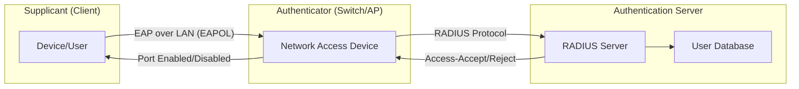
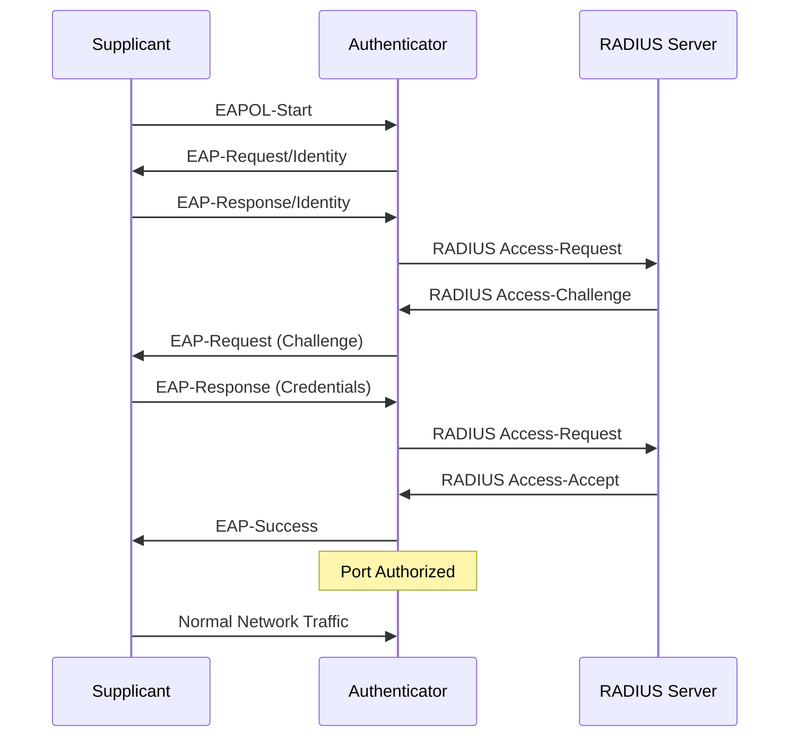
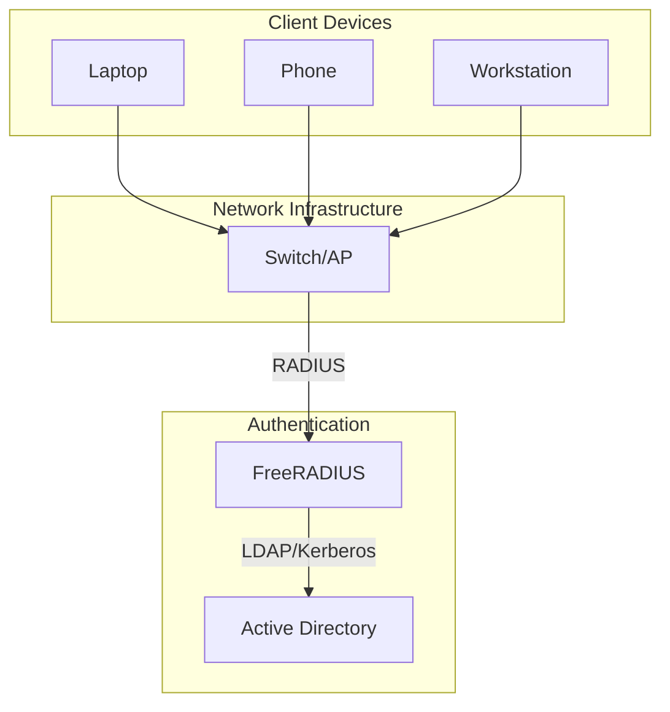
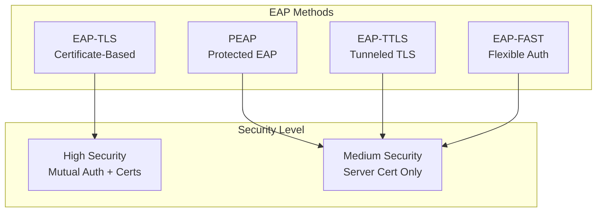
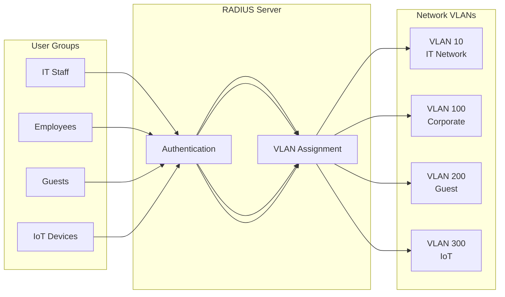
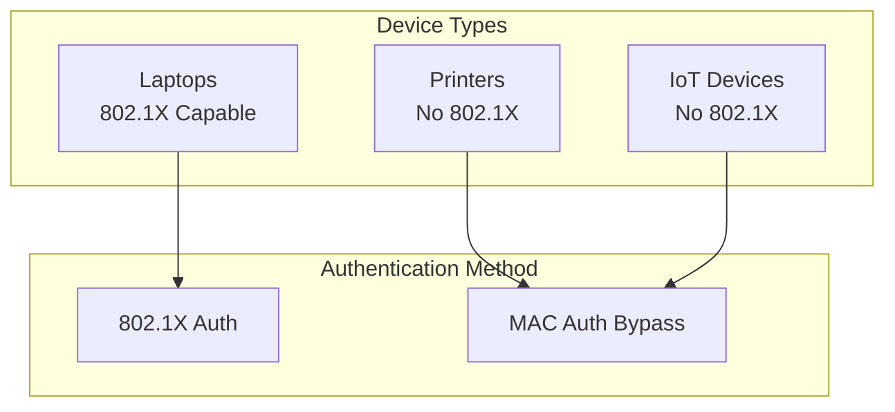
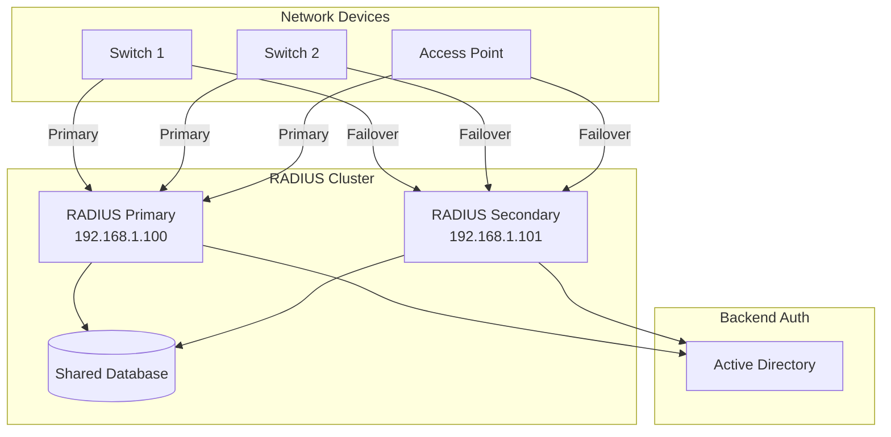
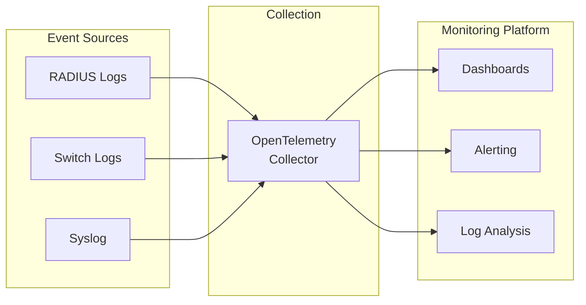

# How to Implement 802.1X Authentication

Author: [nawazdhandala](https://github.com/nawazdhandala)

Tags: 802.1X, Networking, Security, Authentication

Description: A comprehensive guide to implementing 802.1X port-based network access control, covering RADIUS configuration, supplicant setup, and real-world deployment scenarios for enterprise network security.

---

802.1X is an IEEE standard for port-based network access control (PNAC). It provides an authentication mechanism for devices trying to connect to a LAN or WLAN. If you want to ensure that only authorized devices and users can access your network, 802.1X is the gold standard.

## Understanding 802.1X Architecture

802.1X involves three key components working together:



### The Three Players

1. **Supplicant**: The client device requesting network access (laptop, phone, IoT device)
2. **Authenticator**: The network device controlling access (switch, wireless access point)
3. **Authentication Server**: Typically a RADIUS server that validates credentials

## The Authentication Flow

Here is how 802.1X authentication works step by step:



## Setting Up FreeRADIUS

FreeRADIUS is the most widely deployed RADIUS server. Here is how to set it up on Ubuntu/Debian:

### Installation

```bash
# Install FreeRADIUS and utilities
sudo apt update
sudo apt install freeradius freeradius-utils -y

# Check the installation
freeradius -v
```

### Basic Configuration

The main configuration files are located in `/etc/freeradius/3.0/`:

```bash
/etc/freeradius/3.0/
    radiusd.conf       # Main configuration
    clients.conf       # Network devices (authenticators)
    users              # Local user database
    mods-available/    # Available modules
    mods-enabled/      # Enabled modules
    sites-available/   # Virtual server configurations
    sites-enabled/     # Enabled virtual servers
```

### Configure RADIUS Clients (Authenticators)

Edit `/etc/freeradius/3.0/clients.conf` to add your network devices:

```bash
# Example: Adding a switch as a RADIUS client
client switch-floor1 {
    ipaddr = 192.168.1.10
    secret = YourSharedSecretHere123!
    shortname = floor1-switch
    nastype = cisco
}

# Example: Adding a wireless access point
client wireless-ap1 {
    ipaddr = 192.168.1.20
    secret = AnotherStrongSecret456!
    shortname = ap1
    nastype = other
}

# Allow a subnet of devices
client office-switches {
    ipaddr = 192.168.1.0/24
    secret = SubnetWideSecret789!
    shortname = office-net
}
```

### Configure Local Users

Edit `/etc/freeradius/3.0/users` for testing (use LDAP/AD for production):

```bash
# Basic user with password
john    Cleartext-Password := "password123"
        Reply-Message := "Welcome, John!"

# User with VLAN assignment
jane    Cleartext-Password := "securepass456"
        Tunnel-Type = VLAN,
        Tunnel-Medium-Type = IEEE-802,
        Tunnel-Private-Group-ID = "100"

# User with specific attributes
admin   Cleartext-Password := "adminpass789"
        Service-Type = Administrative-User,
        Tunnel-Type = VLAN,
        Tunnel-Medium-Type = IEEE-802,
        Tunnel-Private-Group-ID = "10"
```

### Testing the RADIUS Server

```bash
# Start FreeRADIUS in debug mode
sudo freeradius -X

# In another terminal, test authentication
radtest john password123 localhost 0 testing123

# Expected output for successful auth:
# Received Access-Accept Id 123 from 127.0.0.1:1812 to 127.0.0.1:58762 length 32
```

## Integrating with Active Directory

For enterprise environments, integrate FreeRADIUS with Active Directory:



### Install Required Modules

```bash
# Install LDAP and Kerberos modules
sudo apt install freeradius-ldap freeradius-krb5 -y

# Enable the LDAP module
sudo ln -s /etc/freeradius/3.0/mods-available/ldap /etc/freeradius/3.0/mods-enabled/ldap
```

### Configure LDAP Module

Edit `/etc/freeradius/3.0/mods-available/ldap`:

```bash
ldap {
    server = 'ldap://dc01.example.com'
    identity = 'CN=radius-svc,OU=Service Accounts,DC=example,DC=com'
    password = 'ServiceAccountPassword'
    base_dn = 'DC=example,DC=com'

    user {
        base_dn = "OU=Users,${..base_dn}"
        filter = "(sAMAccountName=%{%{Stripped-User-Name}:-%{User-Name}})"
    }

    group {
        base_dn = "OU=Groups,${..base_dn}"
        filter = "(objectClass=group)"
        membership_attribute = 'memberOf'
    }

    options {
        chase_referrals = yes
        rebind = yes
    }

    tls {
        require_cert = 'allow'
    }
}
```

### Configure Virtual Server for AD Authentication

Edit `/etc/freeradius/3.0/sites-available/default`:

```bash
authorize {
    preprocess

    # Check if user exists in AD
    ldap
    if (ok || updated) {
        update control {
            Auth-Type := ldap
        }
    }

    # Fall back to local users file
    files

    expiration
    logintime
}

authenticate {
    Auth-Type LDAP {
        ldap
    }
}

post-auth {
    # Log successful authentications
    exec

    # Apply VLAN based on AD group membership
    if (&LDAP-Group == "CN=IT-Staff,OU=Groups,DC=example,DC=com") {
        update reply {
            Tunnel-Type := VLAN
            Tunnel-Medium-Type := IEEE-802
            Tunnel-Private-Group-ID := "10"
        }
    }
    elsif (&LDAP-Group == "CN=Employees,OU=Groups,DC=example,DC=com") {
        update reply {
            Tunnel-Type := VLAN
            Tunnel-Medium-Type := IEEE-802
            Tunnel-Private-Group-ID := "100"
        }
    }
}
```

## Configuring Network Switches

### Cisco Switch Configuration

```bash
! Enable AAA
aaa new-model

! Configure RADIUS server
radius server RADIUS-PRIMARY
    address ipv4 192.168.1.100 auth-port 1812 acct-port 1813
    key YourSharedSecretHere123!

! Create server group
aaa group server radius DOT1X-SERVERS
    server name RADIUS-PRIMARY

! Configure authentication
aaa authentication dot1x default group DOT1X-SERVERS
aaa authorization network default group DOT1X-SERVERS
aaa accounting dot1x default start-stop group DOT1X-SERVERS

! Enable 802.1X globally
dot1x system-auth-control

! Configure interface for 802.1X
interface GigabitEthernet0/1
    description User Access Port
    switchport mode access
    switchport access vlan 100
    authentication port-control auto
    authentication periodic
    authentication timer reauthenticate 3600
    dot1x pae authenticator
    spanning-tree portfast
```

### HPE/Aruba Switch Configuration

```bash
# Enable RADIUS
radius-server host 192.168.1.100 key "YourSharedSecretHere123!"

# Configure AAA
aaa authentication port-access eap-radius
aaa port-access authenticator active

# Configure interface
interface 1
    aaa port-access authenticator
    aaa port-access authenticator client-limit 1
```

### Juniper Switch Configuration

```bash
# Configure RADIUS server
set access radius-server 192.168.1.100 secret "YourSharedSecretHere123!"
set access radius-server 192.168.1.100 port 1812

# Configure 802.1X
set protocols dot1x authenticator authentication-profile-name dot1x-profile
set protocols dot1x authenticator interface ge-0/0/1 supplicant multiple

# Configure authentication profile
set access profile dot1x-profile authentication-order radius
set access profile dot1x-profile radius authentication-server 192.168.1.100
```

## Configuring Supplicants (Client Devices)

### Linux Supplicant with wpa_supplicant

Create `/etc/wpa_supplicant/wpa_supplicant.conf`:

```bash
ctrl_interface=/var/run/wpa_supplicant
ctrl_interface_group=wheel

# Wired 802.1X configuration
network={
    key_mgmt=IEEE8021X
    eap=PEAP
    identity="john@example.com"
    password="password123"
    phase2="auth=MSCHAPV2"

    # Certificate validation
    ca_cert="/etc/ssl/certs/ca-certificates.crt"
    domain_suffix_match="example.com"
}
```

Start wpa_supplicant for wired interface:

```bash
# For wired interfaces
sudo wpa_supplicant -i eth0 -D wired -c /etc/wpa_supplicant/wpa_supplicant.conf -B

# Check authentication status
wpa_cli status
```

### Windows Supplicant Configuration (PowerShell)

```powershell
# Enable Wired AutoConfig service
Set-Service -Name "dot3svc" -StartupType Automatic
Start-Service -Name "dot3svc"

# Configure 802.1X on interface
$interfaceName = "Ethernet"

# Create 802.1X profile XML
$profileXml = @"
<?xml version="1.0"?>
<LANProfile xmlns="http://www.microsoft.com/networking/LAN/profile/v1">
    <MSM>
        <security>
            <OneXEnforced>true</OneXEnforced>
            <OneXEnabled>true</OneXEnabled>
            <OneX xmlns="http://www.microsoft.com/networking/OneX/v1">
                <EAPConfig>
                    <EapHostConfig xmlns="http://www.microsoft.com/provisioning/EapHostConfig">
                        <EapMethod>
                            <Type xmlns="http://www.microsoft.com/provisioning/EapCommon">25</Type>
                            <VendorId xmlns="http://www.microsoft.com/provisioning/EapCommon">0</VendorId>
                            <VendorType xmlns="http://www.microsoft.com/provisioning/EapCommon">0</VendorType>
                            <AuthorId xmlns="http://www.microsoft.com/provisioning/EapCommon">0</AuthorId>
                        </EapMethod>
                    </EapHostConfig>
                </EAPConfig>
            </OneX>
        </security>
    </MSM>
</LANProfile>
"@

# Save and apply profile
$profileXml | Out-File -FilePath "C:\temp\dot1x-profile.xml" -Encoding UTF8
netsh lan add profile filename="C:\temp\dot1x-profile.xml" interface="$interfaceName"
```

### macOS Supplicant Configuration

Create a configuration profile or use the command line:

```bash
# Create 802.1X configuration
sudo /usr/libexec/8021xd

# Configure via System Preferences or MDM
# Network > Advanced > 802.1X
```

For enterprise deployment, use Apple Configurator or MDM with this profile:

```xml
<?xml version="1.0" encoding="UTF-8"?>
<!DOCTYPE plist PUBLIC "-//Apple//DTD PLIST 1.0//EN" "http://www.apple.com/DTDs/PropertyList-1.0.dtd">
<plist version="1.0">
<dict>
    <key>PayloadContent</key>
    <array>
        <dict>
            <key>EAPClientConfiguration</key>
            <dict>
                <key>AcceptEAPTypes</key>
                <array>
                    <integer>25</integer>
                </array>
                <key>TLSTrustedServerNames</key>
                <array>
                    <string>radius.example.com</string>
                </array>
                <key>TTLSInnerAuthentication</key>
                <string>MSCHAPv2</string>
            </dict>
            <key>PayloadType</key>
            <string>com.apple.firstactiveethernet.managed</string>
            <key>SetupModes</key>
            <array>
                <string>System</string>
            </array>
        </dict>
    </array>
</dict>
</plist>
```

## EAP Methods Explained

Different EAP (Extensible Authentication Protocol) methods provide varying levels of security:



### EAP-TLS (Strongest Security)

Requires certificates on both client and server:

```bash
# FreeRADIUS EAP-TLS configuration
# Edit /etc/freeradius/3.0/mods-available/eap

eap {
    default_eap_type = tls

    tls-config tls-common {
        private_key_file = /etc/freeradius/3.0/certs/server.key
        certificate_file = /etc/freeradius/3.0/certs/server.pem
        ca_file = /etc/freeradius/3.0/certs/ca.pem

        # Require client certificates
        check_cert_cn = %{User-Name}

        # Certificate revocation
        check_crl = yes
        ca_path = /etc/freeradius/3.0/certs/crl
    }

    tls {
        tls = tls-common
    }
}
```

### EAP-PEAP (Most Common)

Uses server certificate with inner authentication:

```bash
# FreeRADIUS EAP-PEAP configuration
eap {
    default_eap_type = peap

    peap {
        tls = tls-common
        default_eap_type = mschapv2
        copy_request_to_tunnel = yes
        use_tunneled_reply = yes
        virtual_server = "inner-tunnel"
    }

    mschapv2 {
    }
}
```

## Certificate Management

### Generate Self-Signed Certificates (Testing Only)

```bash
# Navigate to certs directory
cd /etc/freeradius/3.0/certs

# Edit certificate configuration
# Edit ca.cnf and server.cnf with your details

# Generate CA certificate
make ca.pem

# Generate server certificate
make server.pem

# Generate client certificate (for EAP-TLS)
make client.pem

# Verify certificates
openssl verify -CAfile ca.pem server.pem
```

### Using Let's Encrypt Certificates

```bash
# Install certbot
sudo apt install certbot -y

# Get certificate
sudo certbot certonly --standalone -d radius.example.com

# Create symlinks for FreeRADIUS
sudo ln -sf /etc/letsencrypt/live/radius.example.com/fullchain.pem /etc/freeradius/3.0/certs/server.pem
sudo ln -sf /etc/letsencrypt/live/radius.example.com/privkey.pem /etc/freeradius/3.0/certs/server.key

# Set permissions
sudo chown freerad:freerad /etc/freeradius/3.0/certs/server.*
sudo chmod 640 /etc/freeradius/3.0/certs/server.*
```

## Dynamic VLAN Assignment

Assign VLANs based on user attributes or group membership:



### FreeRADIUS VLAN Assignment

```bash
# In /etc/freeradius/3.0/users

# IT Staff - VLAN 10
it-user Cleartext-Password := "password"
    Tunnel-Type = VLAN,
    Tunnel-Medium-Type = IEEE-802,
    Tunnel-Private-Group-ID = "10"

# Employees - VLAN 100
employee Cleartext-Password := "password"
    Tunnel-Type = VLAN,
    Tunnel-Medium-Type = IEEE-802,
    Tunnel-Private-Group-ID = "100"

# Guest users - VLAN 200 with bandwidth limit
guest Cleartext-Password := "guestpass"
    Tunnel-Type = VLAN,
    Tunnel-Medium-Type = IEEE-802,
    Tunnel-Private-Group-ID = "200",
    Session-Timeout = 3600
```

### Policy-Based VLAN Assignment

Create `/etc/freeradius/3.0/policy.d/vlan-assignment`:

```bash
# VLAN assignment based on username pattern
vlan_assignment {
    # IT users (username starts with 'it-')
    if (&User-Name =~ /^it-/) {
        update reply {
            Tunnel-Type := VLAN
            Tunnel-Medium-Type := IEEE-802
            Tunnel-Private-Group-ID := "10"
        }
    }

    # Contractors (username contains 'contractor')
    elsif (&User-Name =~ /contractor/) {
        update reply {
            Tunnel-Type := VLAN
            Tunnel-Medium-Type := IEEE-802
            Tunnel-Private-Group-ID := "150"
        }
    }

    # Default VLAN for everyone else
    else {
        update reply {
            Tunnel-Type := VLAN
            Tunnel-Medium-Type := IEEE-802
            Tunnel-Private-Group-ID := "100"
        }
    }
}
```

## MAC Authentication Bypass (MAB)

For devices that cannot perform 802.1X (printers, IoT devices):



### Cisco MAB Configuration

```bash
! Enable MAB on interface
interface GigabitEthernet0/1
    switchport mode access
    authentication port-control auto
    authentication order dot1x mab
    authentication priority dot1x mab
    mab
    dot1x pae authenticator
```

### FreeRADIUS MAB Configuration

Add MAC addresses to `/etc/freeradius/3.0/users`:

```bash
# Format: lowercase MAC with hyphens or colons
# Printer - static IP, specific VLAN
00-11-22-33-44-55 Cleartext-Password := "00-11-22-33-44-55"
    Tunnel-Type = VLAN,
    Tunnel-Medium-Type = IEEE-802,
    Tunnel-Private-Group-ID = "50"

# IoT device
aa-bb-cc-dd-ee-ff Cleartext-Password := "aa-bb-cc-dd-ee-ff"
    Tunnel-Type = VLAN,
    Tunnel-Medium-Type = IEEE-802,
    Tunnel-Private-Group-ID = "300"
```

### Database-Backed MAB

For large deployments, use SQL:

```sql
-- Create MAC address table
CREATE TABLE radcheck_mac (
    id INT AUTO_INCREMENT PRIMARY KEY,
    mac_address VARCHAR(17) NOT NULL,
    device_name VARCHAR(100),
    vlan_id INT,
    created_at TIMESTAMP DEFAULT CURRENT_TIMESTAMP
);

-- Insert devices
INSERT INTO radcheck_mac (mac_address, device_name, vlan_id)
VALUES ('00:11:22:33:44:55', 'HP Printer Floor 1', 50);
```

Configure FreeRADIUS SQL module to query this table:

```bash
# In /etc/freeradius/3.0/mods-available/sql

sql {
    driver = "rlm_sql_mysql"
    server = "localhost"
    login = "radius"
    password = "radiuspassword"
    radius_db = "radius"

    # Custom query for MAB
    authorize_check_query = "\
        SELECT mac_address as UserName, \
               mac_address as Cleartext-Password \
        FROM radcheck_mac \
        WHERE LOWER(REPLACE(mac_address, ':', '-')) = LOWER('%{User-Name}') \
        LIMIT 1"
}
```

## Monitoring and Troubleshooting

### Enable Detailed Logging

Edit `/etc/freeradius/3.0/radiusd.conf`:

```bash
log {
    destination = files
    file = /var/log/freeradius/radius.log
    auth = yes
    auth_badpass = yes
    auth_goodpass = yes
}
```

### Monitor Authentication in Real-Time

```bash
# Watch authentication logs
tail -f /var/log/freeradius/radius.log

# Run in debug mode
sudo freeradius -X

# Test specific user
radtest john password123 192.168.1.100 0 YourSharedSecretHere123!
```

### Common Issues and Solutions

**Issue: EAP negotiation fails**
```bash
# Check certificate validity
openssl x509 -in /etc/freeradius/3.0/certs/server.pem -noout -dates

# Verify certificate chain
openssl verify -CAfile ca.pem server.pem
```

**Issue: VLAN assignment not working**
```bash
# Check RADIUS attributes being sent
radtest -x john password123 localhost 0 testing123

# Verify switch is accepting RADIUS attributes
# On Cisco switch:
show authentication sessions interface Gi0/1 details
```

**Issue: Client cannot find RADIUS server**
```bash
# Test connectivity
nc -zv 192.168.1.100 1812

# Check firewall rules
sudo iptables -L -n | grep 1812

# Verify FreeRADIUS is listening
sudo ss -ulnp | grep 1812
```

### Monitoring Script

```bash
#!/bin/bash
# radius-health-check.sh

RADIUS_HOST="192.168.1.100"
RADIUS_SECRET="YourSharedSecretHere123!"
TEST_USER="healthcheck"
TEST_PASS="healthcheckpass"

# Test authentication
result=$(radtest $TEST_USER $TEST_PASS $RADIUS_HOST 0 $RADIUS_SECRET 2>&1)

if echo "$result" | grep -q "Access-Accept"; then
    echo "OK: RADIUS authentication working"
    exit 0
else
    echo "CRITICAL: RADIUS authentication failed"
    echo "$result"
    exit 2
fi
```

## High Availability Setup

For production environments, deploy redundant RADIUS servers:



### Cisco Switch with Multiple RADIUS Servers

```bash
! Configure multiple RADIUS servers
radius server RADIUS-PRIMARY
    address ipv4 192.168.1.100 auth-port 1812 acct-port 1813
    key PrimarySecret123!

radius server RADIUS-SECONDARY
    address ipv4 192.168.1.101 auth-port 1812 acct-port 1813
    key SecondarySecret456!

! Configure server group with failover
aaa group server radius DOT1X-SERVERS
    server name RADIUS-PRIMARY
    server name RADIUS-SECONDARY

! Set dead-time for failover
radius-server dead-criteria time 5 tries 3
radius-server deadtime 15
```

### Database Replication for FreeRADIUS

```sql
-- On primary MySQL server
GRANT REPLICATION SLAVE ON *.* TO 'repl'@'192.168.1.101' IDENTIFIED BY 'replpassword';

-- Configure replication for radius database
-- Ensures both RADIUS servers have consistent user data
```

## Security Best Practices

1. **Use EAP-TLS when possible** - Client certificates provide the strongest authentication
2. **Implement certificate pinning** - Prevent MITM attacks by validating server certificates
3. **Enable accounting** - Track who connected, when, and from where
4. **Regular certificate rotation** - Automate certificate renewal
5. **Network segmentation** - Use dynamic VLANs to isolate device types
6. **Monitor failed authentications** - Alert on brute force attempts
7. **Disable fallback to weaker methods** - Prevent downgrade attacks

### Security Monitoring Configuration

```bash
# /etc/freeradius/3.0/sites-available/default

post-auth {
    # Log all authentications
    Post-Auth-Type REJECT {
        # Alert on failed auth
        exec {
            program = "/usr/local/bin/auth-alert.sh"
            input_pairs = request
        }
        attr_filter.access_reject
    }
}
```

Alert script example:

```bash
#!/bin/bash
# /usr/local/bin/auth-alert.sh

USER="$1"
MAC="$2"
SWITCH="$3"

# Log failed attempt
logger -t radius-alert "Failed auth: User=$USER MAC=$MAC Switch=$SWITCH"

# Send alert for multiple failures (implement rate limiting)
# curl -X POST https://alerts.example.com/webhook -d "..."
```

## Integration with Network Monitoring

802.1X events should be monitored as part of your overall network observability:



Key metrics to track:
- Authentication success/failure rate
- Average authentication time
- Failed authentication attempts per user
- RADIUS server response time
- Certificate expiration warnings

---

802.1X authentication is essential for enterprise network security. Start with a pilot deployment on a single VLAN, test thoroughly with different device types, and gradually expand. The initial setup requires effort, but the security benefits of knowing exactly who and what is on your network are worth it.
