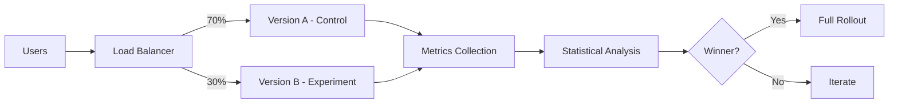
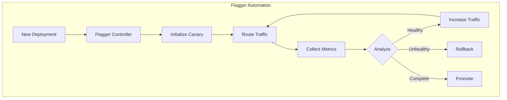
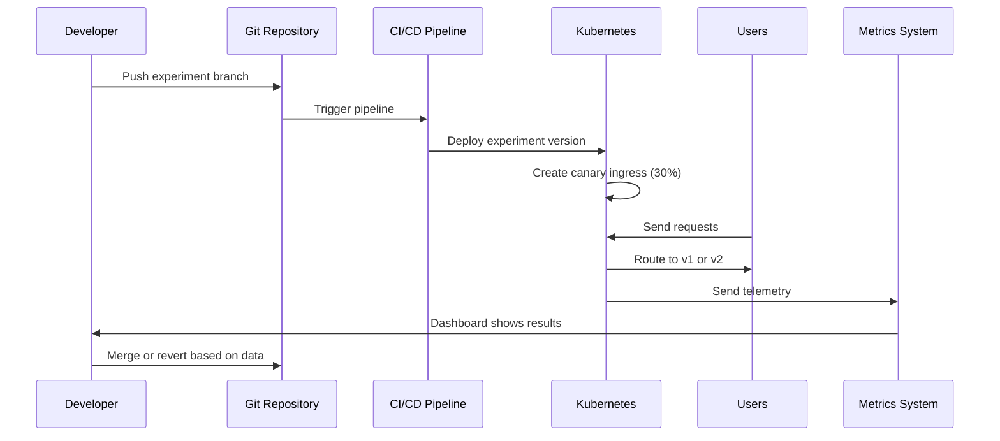
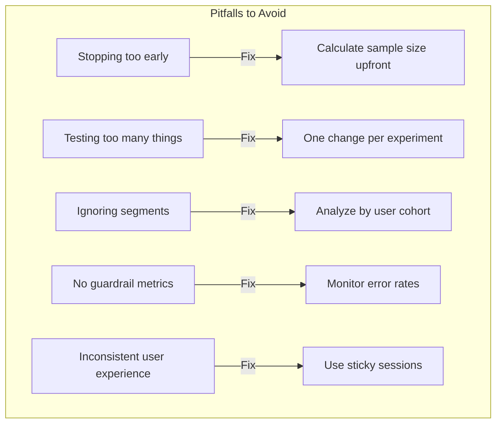

# How to Build A/B Testing Deployment

Author: [nawazdhandala](https://github.com/nawazdhandala)

Tags: Deployment, Testing, DevOps, Kubernetes

Description: A practical guide to implementing A/B testing deployment strategies in Kubernetes using traffic splitting, feature flags, and metrics-driven rollouts.

---

A/B testing in production lets you validate changes with real users before full rollout. Instead of guessing which version performs better, you let the data decide. This guide covers the infrastructure side of A/B testing, from basic traffic splitting to sophisticated metrics-driven deployments.

## What Is A/B Testing Deployment?

A/B testing deployment runs two or more versions of your application simultaneously, routing different users to different versions. You then measure key metrics to determine which version performs better.



Key differences from other deployment strategies:

| Strategy | Purpose | Traffic Split | Duration |
|----------|---------|---------------|----------|
| Blue-Green | Zero-downtime deployment | 0/100 or 100/0 | Minutes |
| Canary | Risk mitigation | 1-10% to new | Hours |
| A/B Testing | Feature validation | Any split | Days to weeks |

## Prerequisites

Before implementing A/B testing, you need:

1. A Kubernetes cluster (v1.21+)
2. An ingress controller that supports traffic splitting (Nginx, Istio, or Traefik)
3. A metrics collection system (Prometheus, OneUptime, or similar)
4. Clear success metrics defined for your experiment

## Method 1: Traffic Splitting with Ingress Nginx

The simplest approach uses Nginx ingress annotations to split traffic between two services. This method requires no additional tooling and works with any Kubernetes cluster running Nginx ingress.

### Step 1: Deploy Both Versions

Create two separate deployments for your control and experiment versions. The key is using different labels and service names so the ingress can route to each independently.

```yaml
# deployment-v1.yaml - Control version (Version A)
apiVersion: apps/v1
kind: Deployment
metadata:
  name: myapp-v1
  labels:
    app: myapp
    version: v1
spec:
  replicas: 3
  selector:
    matchLabels:
      app: myapp
      version: v1
  template:
    metadata:
      labels:
        app: myapp
        version: v1
    spec:
      containers:
        - name: myapp
          image: myapp:1.0.0
          ports:
            - containerPort: 8080
          # Add experiment tracking header to identify version in metrics
          env:
            - name: APP_VERSION
              value: "v1"
            - name: EXPERIMENT_GROUP
              value: "control"
---
# Service for Version A
apiVersion: v1
kind: Service
metadata:
  name: myapp-v1
spec:
  selector:
    app: myapp
    version: v1
  ports:
    - port: 80
      targetPort: 8080
```

Deploy the experiment version with the same structure but different image and labels:

```yaml
# deployment-v2.yaml - Experiment version (Version B)
apiVersion: apps/v1
kind: Deployment
metadata:
  name: myapp-v2
  labels:
    app: myapp
    version: v2
spec:
  replicas: 2
  selector:
    matchLabels:
      app: myapp
      version: v2
  template:
    metadata:
      labels:
        app: myapp
        version: v2
    spec:
      containers:
        - name: myapp
          image: myapp:2.0.0-experiment
          ports:
            - containerPort: 8080
          env:
            - name: APP_VERSION
              value: "v2"
            - name: EXPERIMENT_GROUP
              value: "experiment"
---
# Service for Version B
apiVersion: v1
kind: Service
metadata:
  name: myapp-v2
spec:
  selector:
    app: myapp
    version: v2
  ports:
    - port: 80
      targetPort: 8080
```

### Step 2: Configure Traffic Splitting

The Nginx ingress controller uses the `canary` annotations to split traffic. The primary ingress handles the control version, while a secondary ingress with canary annotations routes a percentage to the experiment.

```yaml
# ingress-primary.yaml - Routes to Version A by default
apiVersion: networking.k8s.io/v1
kind: Ingress
metadata:
  name: myapp-primary
  annotations:
    kubernetes.io/ingress.class: nginx
spec:
  rules:
    - host: myapp.example.com
      http:
        paths:
          - path: /
            pathType: Prefix
            backend:
              service:
                name: myapp-v1
                port:
                  number: 80
---
# ingress-canary.yaml - Routes 30% to Version B
apiVersion: networking.k8s.io/v1
kind: Ingress
metadata:
  name: myapp-canary
  annotations:
    kubernetes.io/ingress.class: nginx
    # Enable canary mode for this ingress
    nginx.ingress.kubernetes.io/canary: "true"
    # Send 30% of traffic to this version
    nginx.ingress.kubernetes.io/canary-weight: "30"
spec:
  rules:
    - host: myapp.example.com
      http:
        paths:
          - path: /
            pathType: Prefix
            backend:
              service:
                name: myapp-v2
                port:
                  number: 80
```

Apply the configurations:

```bash
# Deploy both versions
kubectl apply -f deployment-v1.yaml
kubectl apply -f deployment-v2.yaml

# Configure traffic splitting
kubectl apply -f ingress-primary.yaml
kubectl apply -f ingress-canary.yaml

# Verify the traffic split is working
kubectl describe ingress myapp-canary
```

### Step 3: Verify Traffic Distribution

Test that traffic is actually being split correctly by making multiple requests and checking which version responds:

```bash
# Make 100 requests and count responses from each version
for i in {1..100}; do
  curl -s https://myapp.example.com/version
done | sort | uniq -c

# Expected output (approximately):
# 70 v1
# 30 v2
```

## Method 2: Header-Based Routing for Targeted Testing

Sometimes you want specific users to always see the same version, which is essential for consistent user experience during testing. Header-based routing lets you target users by cookie, header, or other request attributes.

This approach adds a cookie or header check that overrides the weight-based routing, ensuring users see a consistent experience throughout their session.

```yaml
# ingress-header-based.yaml
apiVersion: networking.k8s.io/v1
kind: Ingress
metadata:
  name: myapp-canary
  annotations:
    kubernetes.io/ingress.class: nginx
    nginx.ingress.kubernetes.io/canary: "true"
    # Route based on cookie value first
    nginx.ingress.kubernetes.io/canary-by-cookie: "experiment-group"
    # Fall back to header if no cookie
    nginx.ingress.kubernetes.io/canary-by-header: "X-Experiment-Group"
    nginx.ingress.kubernetes.io/canary-by-header-value: "experiment"
    # Use weight for users without cookie/header
    nginx.ingress.kubernetes.io/canary-weight: "30"
spec:
  rules:
    - host: myapp.example.com
      http:
        paths:
          - path: /
            pathType: Prefix
            backend:
              service:
                name: myapp-v2
                port:
                  number: 80
```

Your application should set the experiment cookie on first visit to ensure consistent routing:

```javascript
// Express.js middleware to assign and persist experiment group
function assignExperimentGroup(req, res, next) {
  // Check if user already has an experiment group assigned
  if (!req.cookies['experiment-group']) {
    // Randomly assign to control or experiment (30% experiment)
    const group = Math.random() < 0.3 ? 'experiment' : 'control';

    // Set cookie that persists for 30 days
    res.cookie('experiment-group', group, {
      maxAge: 30 * 24 * 60 * 60 * 1000, // 30 days in milliseconds
      httpOnly: true,
      secure: true,
      sameSite: 'strict'
    });

    req.experimentGroup = group;
  } else {
    req.experimentGroup = req.cookies['experiment-group'];
  }

  next();
}
```

## Method 3: Istio Service Mesh for Advanced A/B Testing

Istio provides more sophisticated traffic management with weighted routing, fault injection, and detailed telemetry. This method is ideal for complex experiments involving multiple services or when you need fine-grained control over traffic policies.

### Install Istio

```bash
# Download and install Istio
curl -L https://istio.io/downloadIstio | sh -
cd istio-*
export PATH=$PWD/bin:$PATH

# Install with the default profile
istioctl install --set profile=default -y

# Enable sidecar injection for your namespace
kubectl label namespace default istio-injection=enabled
```

### Configure Virtual Service for A/B Testing

Istio uses VirtualService and DestinationRule resources to control traffic routing. The VirtualService defines routing rules, while DestinationRule defines version subsets.

```yaml
# destination-rule.yaml - Define version subsets
apiVersion: networking.istio.io/v1beta1
kind: DestinationRule
metadata:
  name: myapp
spec:
  host: myapp
  # Define subsets based on version labels
  subsets:
    - name: v1
      labels:
        version: v1
    - name: v2
      labels:
        version: v2
---
# virtual-service.yaml - Configure traffic splitting
apiVersion: networking.istio.io/v1beta1
kind: VirtualService
metadata:
  name: myapp
spec:
  hosts:
    - myapp
  http:
    # Route based on user ID header for sticky sessions
    - match:
        - headers:
            x-user-id:
              # Users with IDs ending in 0-2 get experiment (30%)
              regex: ".*[0-2]$"
      route:
        - destination:
            host: myapp
            subset: v2
    # Default route with weight-based splitting
    - route:
        - destination:
            host: myapp
            subset: v1
          weight: 70
        - destination:
            host: myapp
            subset: v2
          weight: 30
```

### Add Request Mirroring for Shadow Testing

Before running a real A/B test, you can mirror traffic to the new version without affecting users. This validates the new version handles production traffic correctly.

```yaml
# virtual-service-mirror.yaml - Mirror traffic for shadow testing
apiVersion: networking.istio.io/v1beta1
kind: VirtualService
metadata:
  name: myapp
spec:
  hosts:
    - myapp
  http:
    - route:
        - destination:
            host: myapp
            subset: v1
      # Mirror 100% of traffic to v2 (responses are discarded)
      mirror:
        host: myapp
        subset: v2
      mirrorPercentage:
        value: 100.0
```

## Method 4: Flagger for Automated A/B Testing

Flagger automates the entire A/B testing process, from traffic shifting to promotion based on metrics. It integrates with Prometheus, Datadog, or any metrics provider to make data-driven decisions automatically.



### Install Flagger

```bash
# Add Flagger Helm repository
helm repo add flagger https://flagger.app

# Install Flagger with Prometheus integration
helm upgrade -i flagger flagger/flagger \
  --namespace istio-system \
  --set meshProvider=istio \
  --set metricsServer=http://prometheus:9090
```

### Define the Canary Resource

The Canary resource tells Flagger how to run your A/B test, including which metrics to check and what thresholds define success.

```yaml
# canary.yaml - Automated A/B testing configuration
apiVersion: flagger.app/v1beta1
kind: Canary
metadata:
  name: myapp
spec:
  # Reference to the deployment to test
  targetRef:
    apiVersion: apps/v1
    kind: Deployment
    name: myapp

  # Service configuration
  service:
    port: 80
    targetPort: 8080

  # A/B testing configuration
  analysis:
    # How often to check metrics
    interval: 1m
    # Number of successful checks before promotion
    threshold: 10
    # Maximum traffic to route to canary
    maxWeight: 50
    # Traffic increment per interval
    stepWeight: 10

    # Metrics to evaluate
    metrics:
      # Request success rate must be above 99%
      - name: request-success-rate
        thresholdRange:
          min: 99
        interval: 1m

      # 99th percentile latency must be under 500ms
      - name: request-duration
        thresholdRange:
          max: 500
        interval: 1m

    # Custom metrics from Prometheus
    webhooks:
      - name: conversion-rate
        type: rollout
        url: http://flagger-loadtester/
        metadata:
          type: prometheus
          # Business metric: conversion rate should not drop
          query: |
            sum(rate(conversions_total{app="myapp",version="canary"}[5m]))
            /
            sum(rate(page_views_total{app="myapp",version="canary"}[5m]))
          thresholdRange:
            min: 0.05  # At least 5% conversion rate
```

### Monitor Flagger Progress

```bash
# Watch the canary status
kubectl get canary myapp -w

# Check Flagger logs for detailed analysis
kubectl logs -n istio-system deployment/flagger -f

# Example output during A/B test:
# myapp.default  Initialized
# myapp.default  New revision detected myapp-v2
# myapp.default  Routing 10% to canary
# myapp.default  Routing 20% to canary
# myapp.default  Routing 30% to canary
# myapp.default  Promotion completed! Routing 100% to new version
```

## Metrics Collection for A/B Testing

Good metrics are essential for meaningful A/B tests. You need both technical metrics (latency, errors) and business metrics (conversion, engagement).

### Instrument Your Application

Add metrics that identify the experiment version so you can compare performance:

```python
# Python example with Prometheus client
from prometheus_client import Counter, Histogram
import os

# Get version from environment variable set in deployment
app_version = os.getenv('APP_VERSION', 'unknown')
experiment_group = os.getenv('EXPERIMENT_GROUP', 'unknown')

# Counter for page views, labeled by version
page_views = Counter(
    'page_views_total',
    'Total page views',
    ['version', 'experiment_group', 'page']
)

# Counter for conversions (purchases, signups, etc.)
conversions = Counter(
    'conversions_total',
    'Total conversions',
    ['version', 'experiment_group', 'conversion_type']
)

# Histogram for response times
response_time = Histogram(
    'http_request_duration_seconds',
    'HTTP request duration',
    ['version', 'experiment_group', 'endpoint'],
    buckets=[0.01, 0.05, 0.1, 0.25, 0.5, 1.0, 2.5, 5.0]
)

# Track a page view
def track_page_view(page):
    page_views.labels(
        version=app_version,
        experiment_group=experiment_group,
        page=page
    ).inc()

# Track a conversion event
def track_conversion(conversion_type):
    conversions.labels(
        version=app_version,
        experiment_group=experiment_group,
        conversion_type=conversion_type
    ).inc()
```

### Prometheus Queries for Analysis

Use these queries to compare performance between versions:

```promql
# Success rate by version (should be similar or better for experiment)
sum(rate(http_requests_total{status=~"2.."}[5m])) by (version)
/
sum(rate(http_requests_total[5m])) by (version)

# P95 latency by version
histogram_quantile(0.95,
  sum(rate(http_request_duration_seconds_bucket[5m])) by (version, le)
)

# Conversion rate by version (the key business metric)
sum(rate(conversions_total[1h])) by (version)
/
sum(rate(page_views_total[1h])) by (version)

# Error rate comparison
sum(rate(http_requests_total{status=~"5.."}[5m])) by (version)
/
sum(rate(http_requests_total[5m])) by (version)
```

### Grafana Dashboard Configuration

Create a dashboard to visualize your A/B test results in real-time:

```json
{
  "title": "A/B Test Dashboard",
  "panels": [
    {
      "title": "Conversion Rate by Version",
      "type": "timeseries",
      "targets": [
        {
          "expr": "sum(rate(conversions_total[1h])) by (version) / sum(rate(page_views_total[1h])) by (version)",
          "legendFormat": "{{version}}"
        }
      ]
    },
    {
      "title": "P95 Latency by Version",
      "type": "timeseries",
      "targets": [
        {
          "expr": "histogram_quantile(0.95, sum(rate(http_request_duration_seconds_bucket[5m])) by (version, le))",
          "legendFormat": "{{version}}"
        }
      ]
    },
    {
      "title": "Traffic Distribution",
      "type": "piechart",
      "targets": [
        {
          "expr": "sum(rate(http_requests_total[5m])) by (version)",
          "legendFormat": "{{version}}"
        }
      ]
    }
  ]
}
```

## Statistical Significance

Running an A/B test without statistical rigor wastes time and can lead to wrong conclusions. Here is how to determine when you have enough data.

### Sample Size Calculator

Before starting your test, calculate the required sample size. This Python script helps determine how long to run your experiment:

```python
import math

def calculate_sample_size(
    baseline_rate,      # Current conversion rate (e.g., 0.05 for 5%)
    minimum_effect,     # Minimum improvement to detect (e.g., 0.1 for 10% relative)
    alpha=0.05,         # Significance level (false positive rate)
    power=0.80          # Statistical power (1 - false negative rate)
):
    """
    Calculate required sample size per variant for an A/B test.
    Uses the formula for comparing two proportions.
    """
    # Expected rate for the treatment group
    treatment_rate = baseline_rate * (1 + minimum_effect)

    # Pooled probability
    p_pooled = (baseline_rate + treatment_rate) / 2

    # Z-scores for alpha and power
    z_alpha = 1.96 if alpha == 0.05 else 2.58  # 95% or 99% confidence
    z_beta = 0.84 if power == 0.80 else 1.28   # 80% or 90% power

    # Sample size formula
    numerator = 2 * p_pooled * (1 - p_pooled) * (z_alpha + z_beta) ** 2
    denominator = (treatment_rate - baseline_rate) ** 2

    sample_size = math.ceil(numerator / denominator)

    return sample_size

# Example: 5% baseline conversion, want to detect 10% relative improvement
sample_size = calculate_sample_size(
    baseline_rate=0.05,
    minimum_effect=0.10
)
print(f"Required sample size per variant: {sample_size}")
# Output: Required sample size per variant: 31234

# With 1000 daily visitors, you need:
daily_visitors = 1000
days_needed = (sample_size * 2) / daily_visitors
print(f"Days to run experiment: {math.ceil(days_needed)}")
# Output: Days to run experiment: 63
```

### Analyze Results

After collecting data, determine if the difference is statistically significant:

```python
from scipy import stats

def analyze_ab_test(
    control_conversions,
    control_visitors,
    experiment_conversions,
    experiment_visitors
):
    """
    Analyze A/B test results using a chi-squared test.
    Returns whether the difference is statistically significant.
    """
    # Calculate conversion rates
    control_rate = control_conversions / control_visitors
    experiment_rate = experiment_conversions / experiment_visitors

    # Perform chi-squared test
    contingency_table = [
        [control_conversions, control_visitors - control_conversions],
        [experiment_conversions, experiment_visitors - experiment_conversions]
    ]
    chi2, p_value, dof, expected = stats.chi2_contingency(contingency_table)

    # Calculate relative improvement
    relative_improvement = (experiment_rate - control_rate) / control_rate * 100

    return {
        'control_rate': f"{control_rate:.2%}",
        'experiment_rate': f"{experiment_rate:.2%}",
        'relative_improvement': f"{relative_improvement:.1f}%",
        'p_value': p_value,
        'significant': p_value < 0.05,
        'recommendation': 'Deploy experiment' if p_value < 0.05 and relative_improvement > 0 else 'Keep control'
    }

# Example analysis
results = analyze_ab_test(
    control_conversions=500,
    control_visitors=10000,
    experiment_conversions=550,
    experiment_visitors=10000
)
print(results)
# Output:
# {
#   'control_rate': '5.00%',
#   'experiment_rate': '5.50%',
#   'relative_improvement': '10.0%',
#   'p_value': 0.0412,
#   'significant': True,
#   'recommendation': 'Deploy experiment'
# }
```

## Complete End-to-End Example

Let us put it all together with a complete example using Nginx ingress:



### Project Structure

```
myapp/
├── k8s/
│   ├── base/
│   │   ├── deployment.yaml
│   │   └── service.yaml
│   └── experiments/
│       ├── ab-test-checkout/
│       │   ├── deployment-experiment.yaml
│       │   ├── service-experiment.yaml
│       │   └── ingress-canary.yaml
│       └── README.md
├── src/
│   └── ...
└── .github/
    └── workflows/
        └── ab-test.yaml
```

### GitHub Actions Workflow for A/B Testing

This workflow automates the deployment and cleanup of A/B tests:

```yaml
# .github/workflows/ab-test.yaml
name: A/B Test Deployment

on:
  workflow_dispatch:
    inputs:
      experiment_name:
        description: 'Name of the experiment'
        required: true
      traffic_percentage:
        description: 'Percentage of traffic to experiment (1-50)'
        required: true
        default: '10'
      action:
        description: 'Action to perform'
        required: true
        type: choice
        options:
          - deploy
          - increase-traffic
          - rollback
          - promote

jobs:
  ab-test:
    runs-on: ubuntu-latest
    steps:
      - uses: actions/checkout@v4

      - name: Configure kubectl
        uses: azure/k8s-set-context@v4
        with:
          kubeconfig: ${{ secrets.KUBECONFIG }}

      - name: Deploy Experiment
        if: github.event.inputs.action == 'deploy'
        run: |
          # Build and push experiment image
          docker build -t myapp:experiment-${{ github.sha }} .
          docker push myapp:experiment-${{ github.sha }}

          # Update experiment deployment with new image
          kubectl set image deployment/myapp-experiment \
            myapp=myapp:experiment-${{ github.sha }}

          # Create or update canary ingress
          cat <<EOF | kubectl apply -f -
          apiVersion: networking.k8s.io/v1
          kind: Ingress
          metadata:
            name: myapp-canary
            annotations:
              nginx.ingress.kubernetes.io/canary: "true"
              nginx.ingress.kubernetes.io/canary-weight: "${{ github.event.inputs.traffic_percentage }}"
          spec:
            rules:
              - host: myapp.example.com
                http:
                  paths:
                    - path: /
                      pathType: Prefix
                      backend:
                        service:
                          name: myapp-experiment
                          port:
                            number: 80
          EOF

          echo "Experiment deployed with ${{ github.event.inputs.traffic_percentage }}% traffic"

      - name: Increase Traffic
        if: github.event.inputs.action == 'increase-traffic'
        run: |
          kubectl annotate ingress myapp-canary \
            nginx.ingress.kubernetes.io/canary-weight=${{ github.event.inputs.traffic_percentage }} \
            --overwrite

          echo "Traffic increased to ${{ github.event.inputs.traffic_percentage }}%"

      - name: Rollback Experiment
        if: github.event.inputs.action == 'rollback'
        run: |
          # Remove canary ingress
          kubectl delete ingress myapp-canary --ignore-not-found

          # Scale down experiment
          kubectl scale deployment myapp-experiment --replicas=0

          echo "Experiment rolled back"

      - name: Promote Experiment
        if: github.event.inputs.action == 'promote'
        run: |
          # Get experiment image
          EXPERIMENT_IMAGE=$(kubectl get deployment myapp-experiment \
            -o jsonpath='{.spec.template.spec.containers[0].image}')

          # Update primary deployment
          kubectl set image deployment/myapp myapp=$EXPERIMENT_IMAGE
          kubectl rollout status deployment/myapp

          # Remove canary infrastructure
          kubectl delete ingress myapp-canary --ignore-not-found
          kubectl scale deployment myapp-experiment --replicas=0

          echo "Experiment promoted to production"
```

## Best Practices

### 1. Define Clear Hypotheses

Before starting any A/B test, write down what you expect to happen:

```markdown
## Experiment: New Checkout Flow

**Hypothesis**: Simplifying the checkout from 3 pages to 1 will increase
conversion rate by at least 10%.

**Primary Metric**: Checkout completion rate
**Secondary Metrics**: Time to complete, cart abandonment rate
**Guardrail Metrics**: Error rate, page load time

**Traffic Split**: 70% control / 30% experiment
**Duration**: 2 weeks minimum (based on sample size calculation)
**Success Criteria**: p-value < 0.05, conversion improvement >= 10%
```

### 2. Avoid Common Pitfalls



### 3. Clean Up Experiments

Old experiments create technical debt. Set expiration dates and clean up:

```bash
# List all experiments older than 30 days
kubectl get ingress -l experiment=true \
  -o jsonpath='{range .items[?(@.metadata.creationTimestamp<"2024-12-01")]}{.metadata.name}{"\n"}{end}'

# Delete stale experiment resources
kubectl delete ingress,deployment,service -l experiment=checkout-v2
```

### 4. Document Everything

Keep a record of all experiments and their outcomes:

```yaml
# experiments/archive/checkout-simplification.yaml
experiment:
  name: checkout-simplification
  start_date: 2024-01-15
  end_date: 2024-01-29
  hypothesis: "Single-page checkout increases conversion by 10%"
  traffic_split: 70/30

results:
  control_conversion: 4.8%
  experiment_conversion: 5.3%
  relative_improvement: 10.4%
  p_value: 0.023
  statistical_significance: true

outcome: PROMOTED
notes: |
  Experiment was successful. New checkout deployed to 100% of traffic.
  Follow-up: Monitor for 2 weeks post-promotion.
```

---

A/B testing deployment lets you make data-driven decisions about your product. Start simple with Nginx canary annotations, then graduate to Istio or Flagger as your needs grow. The key is building the muscle memory around metrics collection, statistical analysis, and clean experiment management. Every feature you ship should be validated by real user behavior, not assumptions.
