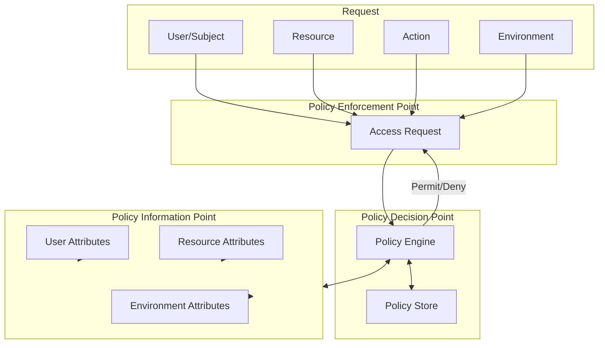
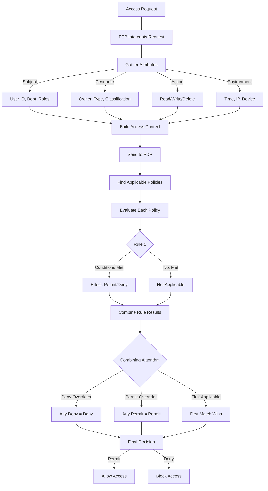

# How to Build ABAC Implementation

Author: [nawazdhandala](https://github.com/nawazdhandala)

Tags: Authorization, ABAC, Security, Access Control

Description: A practical guide to implementing Attribute-Based Access Control (ABAC) with policy engines, attribute evaluation, and real-world code examples.

---

Access control has evolved beyond simple role assignments. Attribute-Based Access Control (ABAC) lets you define fine-grained policies that evaluate multiple attributes at runtime: who is requesting access, what resource they want, what action they intend to perform, and under what conditions. This guide walks through building an ABAC system from scratch, covering the core components, policy structure, and evaluation logic.

## What Makes ABAC Different

Traditional Role-Based Access Control (RBAC) assigns permissions through roles. A user gets a role, and the role grants access. This works until you need context-aware decisions like "allow access only during business hours" or "permit editing only if the user owns the document."

ABAC evaluates attributes dynamically:

- **Subject attributes**: user ID, department, clearance level, group membership
- **Resource attributes**: owner, classification, creation date, sensitivity label
- **Action attributes**: read, write, delete, approve
- **Environment attributes**: time of day, IP address, device type, location

Policies combine these attributes with logical operators to produce access decisions.

## ABAC Architecture Overview



The architecture consists of four main components:

1. **Policy Enforcement Point (PEP)**: Intercepts access requests and enforces decisions
2. **Policy Decision Point (PDP)**: Evaluates policies against attributes and returns permit/deny
3. **Policy Information Point (PIP)**: Retrieves attributes from various sources
4. **Policy Administration Point (PAP)**: Manages and stores policies (not shown in flow)

## Defining the Attribute Model

Start by defining your attribute schema. Each attribute needs a name, type, and source.

```typescript
interface SubjectAttributes {
  userId: string;
  department: string;
  role: string[];
  clearanceLevel: number;
  manager: string | null;
}

interface ResourceAttributes {
  resourceId: string;
  resourceType: string;
  owner: string;
  classification: 'public' | 'internal' | 'confidential' | 'restricted';
  createdAt: Date;
}

interface ActionAttributes {
  action: 'read' | 'write' | 'delete' | 'approve' | 'share';
}

interface EnvironmentAttributes {
  currentTime: Date;
  ipAddress: string;
  deviceType: 'desktop' | 'mobile' | 'tablet';
  location: string;
  isVpnConnected: boolean;
}

interface AccessRequest {
  subject: SubjectAttributes;
  resource: ResourceAttributes;
  action: ActionAttributes;
  environment: EnvironmentAttributes;
}
```

## Writing ABAC Policies

Policies express rules as conditions over attributes. Here is a policy structure that supports complex logic:

```typescript
type Operator =
  | 'equals'
  | 'notEquals'
  | 'contains'
  | 'greaterThan'
  | 'lessThan'
  | 'in'
  | 'between';

interface Condition {
  attribute: string;      // e.g., "subject.department"
  operator: Operator;
  value: any;
}

interface Rule {
  conditions: Condition[];
  effect: 'permit' | 'deny';
  combineWith: 'AND' | 'OR';
}

interface Policy {
  id: string;
  name: string;
  description: string;
  target: {
    resourceTypes: string[];
    actions: string[];
  };
  rules: Rule[];
  ruleCombining: 'permitOverrides' | 'denyOverrides' | 'firstApplicable';
}
```

### Example Policy: Document Access

This policy controls access to documents based on multiple attributes:

```json
{
  "id": "policy-doc-001",
  "name": "Document Access Policy",
  "description": "Controls read/write access to documents based on ownership and classification",
  "target": {
    "resourceTypes": ["document"],
    "actions": ["read", "write", "delete"]
  },
  "rules": [
    {
      "id": "rule-owner-full-access",
      "description": "Document owners have full access",
      "conditions": [
        {
          "attribute": "subject.userId",
          "operator": "equals",
          "value": "${resource.owner}"
        }
      ],
      "effect": "permit",
      "combineWith": "AND"
    },
    {
      "id": "rule-confidential-clearance",
      "description": "Confidential docs require clearance level 3+",
      "conditions": [
        {
          "attribute": "resource.classification",
          "operator": "equals",
          "value": "confidential"
        },
        {
          "attribute": "subject.clearanceLevel",
          "operator": "lessThan",
          "value": 3
        }
      ],
      "effect": "deny",
      "combineWith": "AND"
    },
    {
      "id": "rule-business-hours",
      "description": "External access only during business hours",
      "conditions": [
        {
          "attribute": "environment.isVpnConnected",
          "operator": "equals",
          "value": false
        },
        {
          "attribute": "environment.currentTime",
          "operator": "between",
          "value": ["09:00", "17:00"]
        }
      ],
      "effect": "permit",
      "combineWith": "AND"
    }
  ],
  "ruleCombining": "denyOverrides"
}
```

## Building the Policy Decision Point

The PDP is the heart of your ABAC system. It loads policies, evaluates conditions, and returns decisions.

```typescript
class PolicyDecisionPoint {
  private policies: Policy[] = [];
  private pip: PolicyInformationPoint;

  constructor(pip: PolicyInformationPoint) {
    this.pip = pip;
  }

  loadPolicies(policies: Policy[]): void {
    this.policies = policies;
  }

  async evaluate(request: AccessRequest): Promise<'permit' | 'deny'> {
    // Find applicable policies based on target
    const applicablePolicies = this.policies.filter(policy =>
      policy.target.resourceTypes.includes(request.resource.resourceType) &&
      policy.target.actions.includes(request.action.action)
    );

    if (applicablePolicies.length === 0) {
      return 'deny'; // Default deny if no policy applies
    }

    // Evaluate each applicable policy
    const decisions: ('permit' | 'deny')[] = [];

    for (const policy of applicablePolicies) {
      const decision = await this.evaluatePolicy(policy, request);
      decisions.push(decision);
    }

    // Combine decisions (using deny-overrides as default)
    return decisions.includes('deny') ? 'deny' : 'permit';
  }

  private async evaluatePolicy(
    policy: Policy,
    request: AccessRequest
  ): Promise<'permit' | 'deny'> {
    const ruleResults: ('permit' | 'deny' | 'notApplicable')[] = [];

    for (const rule of policy.rules) {
      const result = await this.evaluateRule(rule, request);
      ruleResults.push(result);
    }

    // Apply rule combining algorithm
    switch (policy.ruleCombining) {
      case 'denyOverrides':
        return ruleResults.includes('deny') ? 'deny' : 'permit';
      case 'permitOverrides':
        return ruleResults.includes('permit') ? 'permit' : 'deny';
      case 'firstApplicable':
        const first = ruleResults.find(r => r !== 'notApplicable');
        return first === 'permit' ? 'permit' : 'deny';
      default:
        return 'deny';
    }
  }

  private async evaluateRule(
    rule: Rule,
    request: AccessRequest
  ): Promise<'permit' | 'deny' | 'notApplicable'> {
    const conditionResults: boolean[] = [];

    for (const condition of rule.conditions) {
      const result = await this.evaluateCondition(condition, request);
      conditionResults.push(result);
    }

    // Combine conditions based on AND/OR
    const allMatch = rule.combineWith === 'AND'
      ? conditionResults.every(r => r === true)
      : conditionResults.some(r => r === true);

    if (!allMatch) {
      return 'notApplicable';
    }

    return rule.effect;
  }

  private async evaluateCondition(
    condition: Condition,
    request: AccessRequest
  ): Promise<boolean> {
    // Resolve attribute value from request
    const actualValue = this.resolveAttribute(condition.attribute, request);
    const expectedValue = this.resolveValue(condition.value, request);

    switch (condition.operator) {
      case 'equals':
        return actualValue === expectedValue;
      case 'notEquals':
        return actualValue !== expectedValue;
      case 'contains':
        return Array.isArray(actualValue) && actualValue.includes(expectedValue);
      case 'greaterThan':
        return actualValue > expectedValue;
      case 'lessThan':
        return actualValue < expectedValue;
      case 'in':
        return Array.isArray(expectedValue) && expectedValue.includes(actualValue);
      case 'between':
        return actualValue >= expectedValue[0] && actualValue <= expectedValue[1];
      default:
        return false;
    }
  }

  private resolveAttribute(path: string, request: AccessRequest): any {
    const parts = path.split('.');
    let value: any = request;

    for (const part of parts) {
      value = value?.[part];
    }

    return value;
  }

  private resolveValue(value: any, request: AccessRequest): any {
    // Handle dynamic references like ${resource.owner}
    if (typeof value === 'string' && value.startsWith('${')) {
      const path = value.slice(2, -1);
      return this.resolveAttribute(path, request);
    }
    return value;
  }
}
```

## Implementing the Policy Information Point

The PIP fetches attributes from external sources when they are not included in the request:

```typescript
class PolicyInformationPoint {
  private userService: UserService;
  private resourceService: ResourceService;
  private contextService: ContextService;

  constructor(
    userService: UserService,
    resourceService: ResourceService,
    contextService: ContextService
  ) {
    this.userService = userService;
    this.resourceService = resourceService;
    this.contextService = contextService;
  }

  async getSubjectAttributes(userId: string): Promise<SubjectAttributes> {
    const user = await this.userService.findById(userId);
    return {
      userId: user.id,
      department: user.department,
      role: user.roles,
      clearanceLevel: user.clearanceLevel,
      manager: user.managerId
    };
  }

  async getResourceAttributes(
    resourceId: string,
    resourceType: string
  ): Promise<ResourceAttributes> {
    const resource = await this.resourceService.findById(resourceId, resourceType);
    return {
      resourceId: resource.id,
      resourceType: resourceType,
      owner: resource.ownerId,
      classification: resource.classification,
      createdAt: resource.createdAt
    };
  }

  getEnvironmentAttributes(req: Request): EnvironmentAttributes {
    return {
      currentTime: new Date(),
      ipAddress: req.ip,
      deviceType: this.contextService.detectDeviceType(req.headers['user-agent']),
      location: this.contextService.geolocate(req.ip),
      isVpnConnected: this.contextService.isVpnIp(req.ip)
    };
  }
}
```

## Building the Policy Enforcement Point

The PEP sits at your API boundary and intercepts requests:

```typescript
function abacMiddleware(pdp: PolicyDecisionPoint, pip: PolicyInformationPoint) {
  return async (req: Request, res: Response, next: NextFunction) => {
    try {
      // Build the access request from incoming HTTP request
      const accessRequest: AccessRequest = {
        subject: await pip.getSubjectAttributes(req.user.id),
        resource: await pip.getResourceAttributes(
          req.params.resourceId,
          req.params.resourceType
        ),
        action: {
          action: mapHttpMethodToAction(req.method)
        },
        environment: pip.getEnvironmentAttributes(req)
      };

      // Evaluate the request against policies
      const decision = await pdp.evaluate(accessRequest);

      if (decision === 'deny') {
        return res.status(403).json({
          error: 'Access denied',
          message: 'You do not have permission to perform this action'
        });
      }

      next();
    } catch (error) {
      return res.status(500).json({
        error: 'Authorization error',
        message: 'Failed to evaluate access request'
      });
    }
  };
}

function mapHttpMethodToAction(method: string): string {
  const mapping: Record<string, string> = {
    'GET': 'read',
    'POST': 'write',
    'PUT': 'write',
    'PATCH': 'write',
    'DELETE': 'delete'
  };
  return mapping[method] || 'read';
}
```

## Policy Evaluation Flow



## Advanced Policy Patterns

### Hierarchical Attribute Matching

Allow managers to access their direct reports' resources:

```json
{
  "id": "rule-manager-access",
  "description": "Managers can view direct reports documents",
  "conditions": [
    {
      "attribute": "subject.userId",
      "operator": "equals",
      "value": "${resource.owner.manager}"
    },
    {
      "attribute": "action.action",
      "operator": "equals",
      "value": "read"
    }
  ],
  "effect": "permit",
  "combineWith": "AND"
}
```

### Time-Based Access Windows

Restrict sensitive operations to maintenance windows:

```json
{
  "id": "rule-maintenance-window",
  "description": "Database writes only during maintenance window",
  "conditions": [
    {
      "attribute": "resource.resourceType",
      "operator": "equals",
      "value": "database"
    },
    {
      "attribute": "action.action",
      "operator": "in",
      "value": ["write", "delete"]
    },
    {
      "attribute": "environment.currentTime",
      "operator": "between",
      "value": ["02:00", "04:00"]
    }
  ],
  "effect": "permit",
  "combineWith": "AND"
}
```

### Multi-Factor Conditions

Require VPN and approved device for confidential data:

```json
{
  "id": "rule-confidential-access",
  "description": "Confidential data requires VPN and desktop",
  "conditions": [
    {
      "attribute": "resource.classification",
      "operator": "equals",
      "value": "confidential"
    },
    {
      "attribute": "environment.isVpnConnected",
      "operator": "equals",
      "value": true
    },
    {
      "attribute": "environment.deviceType",
      "operator": "equals",
      "value": "desktop"
    }
  ],
  "effect": "permit",
  "combineWith": "AND"
}
```

## Performance Considerations

ABAC policy evaluation can become expensive at scale. Here are strategies to keep it fast:

1. **Cache attribute lookups**: Subject and resource attributes rarely change mid-session. Cache them with short TTLs.

2. **Index policies by target**: Instead of iterating all policies, maintain an index by resource type and action.

3. **Short-circuit evaluation**: If a deny rule matches early, skip remaining rules when using deny-overrides.

4. **Precompile conditions**: Parse and validate policy conditions at load time, not evaluation time.

5. **Batch attribute fetches**: When evaluating multiple resources, batch your PIP queries.

```typescript
class CachedPIP extends PolicyInformationPoint {
  private cache: Map<string, { data: any; expiry: number }> = new Map();
  private ttlMs: number = 60000; // 1 minute

  async getSubjectAttributes(userId: string): Promise<SubjectAttributes> {
    const cacheKey = `subject:${userId}`;
    const cached = this.cache.get(cacheKey);

    if (cached && cached.expiry > Date.now()) {
      return cached.data;
    }

    const attributes = await super.getSubjectAttributes(userId);
    this.cache.set(cacheKey, {
      data: attributes,
      expiry: Date.now() + this.ttlMs
    });

    return attributes;
  }
}
```

## Testing Your ABAC Implementation

Write tests that cover policy edge cases:

```typescript
describe('Document Access Policy', () => {
  let pdp: PolicyDecisionPoint;

  beforeEach(() => {
    pdp = new PolicyDecisionPoint(mockPip);
    pdp.loadPolicies([documentAccessPolicy]);
  });

  it('permits owner to read their document', async () => {
    const request = createRequest({
      subject: { userId: 'user-123' },
      resource: { owner: 'user-123', classification: 'internal' },
      action: { action: 'read' }
    });

    const decision = await pdp.evaluate(request);
    expect(decision).toBe('permit');
  });

  it('denies low-clearance user from confidential docs', async () => {
    const request = createRequest({
      subject: { userId: 'user-456', clearanceLevel: 2 },
      resource: { owner: 'user-789', classification: 'confidential' },
      action: { action: 'read' }
    });

    const decision = await pdp.evaluate(request);
    expect(decision).toBe('deny');
  });

  it('denies access outside business hours without VPN', async () => {
    const request = createRequest({
      subject: { userId: 'user-456' },
      resource: { owner: 'user-789', classification: 'internal' },
      action: { action: 'read' },
      environment: {
        currentTime: new Date('2024-01-15T22:00:00'),
        isVpnConnected: false
      }
    });

    const decision = await pdp.evaluate(request);
    expect(decision).toBe('deny');
  });
});
```

## Migration Path from RBAC

If you have an existing RBAC system, migrate incrementally:

1. **Map roles to attribute sets**: Each role becomes a bundle of subject attributes.

2. **Convert role checks to policies**: `hasRole('admin')` becomes a policy with `subject.role contains 'admin'`.

3. **Add resource and environment attributes**: Gradually introduce context-aware rules.

4. **Run both systems in parallel**: Log ABAC decisions without enforcing them, compare with RBAC outcomes.

5. **Switch enforcement**: Once decision parity reaches your confidence threshold, enable ABAC enforcement.

---

ABAC gives you the flexibility to express authorization logic that RBAC cannot handle. The implementation effort is higher upfront, but the payoff comes when you need to answer "can this user do this action on this resource under these conditions" with a single policy evaluation. Start with a clear attribute model, build your PDP with testable components, and expand your policy set as requirements evolve.
