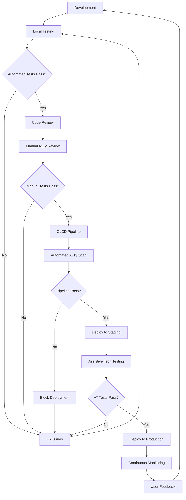

# How to Implement Accessibility Testing

Author: [nawazdhandala](https://github.com/nawazdhandala)

Tags: Testing, Accessibility, A11y, WebDevelopment

Description: A comprehensive guide to implementing accessibility testing in your development workflow to build inclusive applications for all users.

---

Building software that works for everyone is not just good ethics. It is good business. Over one billion people worldwide live with some form of disability. If your application excludes them, you are leaving users behind and potentially violating legal requirements like the ADA, Section 508, or the European Accessibility Act.

Accessibility testing ensures your application works for people who use screen readers, keyboard navigation, voice commands, or other assistive technologies. This guide covers the standards, tools, and workflows you need to make accessibility a first-class citizen in your development process.

## What is WCAG?

The Web Content Accessibility Guidelines (WCAG) are the international standard for web accessibility. Published by the W3C Web Accessibility Initiative (WAI), WCAG provides a framework for making web content more accessible.

### WCAG Principles: POUR

WCAG is organized around four core principles:

| Principle | Description | Examples |
|-----------|-------------|----------|
| **Perceivable** | Users must be able to perceive the information | Alt text for images, captions for videos, sufficient color contrast |
| **Operable** | Users must be able to operate the interface | Keyboard navigation, no seizure-inducing content, enough time to read |
| **Understandable** | Users must be able to understand the content | Clear language, predictable navigation, input assistance |
| **Robust** | Content must work with current and future technologies | Valid HTML, ARIA attributes, compatible with assistive tech |

### WCAG Conformance Levels

WCAG defines three levels of conformance:

- **Level A:** Minimum accessibility. Must be met or some users cannot access content at all.
- **Level AA:** Addresses the most common barriers. This is the standard most organizations target and what most laws require.
- **Level AAA:** Highest level of accessibility. Not required for entire sites but useful for specific content.

### Key WCAG Success Criteria to Know

Here are the most commonly tested criteria:

```text
Level A (Must Have):
- 1.1.1 Non-text Content: All images need alt text
- 2.1.1 Keyboard: All functionality available via keyboard
- 2.4.1 Bypass Blocks: Skip navigation links
- 4.1.1 Parsing: Valid HTML markup
- 4.1.2 Name, Role, Value: ARIA labels for custom components

Level AA (Should Have):
- 1.4.3 Contrast Minimum: 4.5:1 for normal text, 3:1 for large text
- 1.4.4 Resize Text: Content readable at 200% zoom
- 2.4.6 Headings and Labels: Descriptive headings
- 2.4.7 Focus Visible: Clear focus indicators
```

## Accessibility Testing Workflow

Here is how accessibility testing fits into your development lifecycle:



## Automated Accessibility Testing Tools

Automated tools catch approximately 30 to 50 percent of accessibility issues. They are fast and great for catching obvious problems, but they cannot replace human testing.

### axe-core: The Industry Standard

axe-core is the most widely used accessibility testing engine. It powers many other tools and browser extensions.

```javascript
// Install axe-core for your testing framework
// npm install @axe-core/playwright --save-dev

// Example: Playwright with axe-core
const { test, expect } = require("@playwright/test");
const AxeBuilder = require("@axe-core/playwright").default;

test.describe("Homepage Accessibility", () => {
  test("should have no automatically detectable accessibility issues", async ({
    page,
  }) => {
    // Navigate to the page you want to test
    await page.goto("https://your-app.com");

    // Run axe accessibility scan
    const accessibilityScanResults = await new AxeBuilder({ page })
      .withTags(["wcag2a", "wcag2aa", "wcag21a", "wcag21aa"]) // Test against WCAG 2.1 AA
      .analyze();

    // Assert no violations found
    expect(accessibilityScanResults.violations).toEqual([]);
  });

  test("should have accessible login form", async ({ page }) => {
    await page.goto("https://your-app.com/login");

    // Run axe on specific component
    const results = await new AxeBuilder({ page })
      .include("#login-form") // Only test the login form
      .analyze();

    // Log any violations for debugging
    if (results.violations.length > 0) {
      console.log("Accessibility violations found:");
      results.violations.forEach((violation) => {
        console.log(`- ${violation.id}: ${violation.description}`);
        console.log(`  Impact: ${violation.impact}`);
        console.log(`  Help: ${violation.helpUrl}`);
      });
    }

    expect(results.violations).toEqual([]);
  });
});
```

### Jest with jest-axe

For React component testing:

```javascript
// npm install jest-axe --save-dev

import React from "react";
import { render } from "@testing-library/react";
import { axe, toHaveNoViolations } from "jest-axe";

// Extend Jest matchers with accessibility assertions
expect.extend(toHaveNoViolations);

// Component to test
function LoginButton({ onClick, isLoading }) {
  return (
    <button
      onClick={onClick}
      disabled={isLoading}
      aria-busy={isLoading} // Announces loading state to screen readers
      aria-label={isLoading ? "Logging in, please wait" : "Log in to your account"}
    >
      {isLoading ? "Logging in..." : "Log In"}
    </button>
  );
}

describe("LoginButton", () => {
  it("should be accessible in default state", async () => {
    const { container } = render(<LoginButton onClick={() => {}} isLoading={false} />);

    // Run axe on the rendered component
    const results = await axe(container);

    // Assert no violations
    expect(results).toHaveNoViolations();
  });

  it("should be accessible in loading state", async () => {
    const { container } = render(<LoginButton onClick={() => {}} isLoading={true} />);

    const results = await axe(container);
    expect(results).toHaveNoViolations();
  });
});
```

### Cypress with cypress-axe

```javascript
// npm install cypress-axe axe-core --save-dev

// In cypress/support/e2e.js
import "cypress-axe";

// In your test file
describe("Dashboard Accessibility", () => {
  beforeEach(() => {
    cy.visit("/dashboard");
    cy.injectAxe(); // Inject axe-core into the page
  });

  it("should have no accessibility violations on load", () => {
    // Check entire page
    cy.checkA11y();
  });

  it("should have no violations after user interaction", () => {
    // Open a modal
    cy.get('[data-testid="open-settings"]').click();

    // Check the modal specifically
    cy.checkA11y('[role="dialog"]', {
      rules: {
        // Customize which rules to run
        "color-contrast": { enabled: true },
        "focus-management": { enabled: true },
      },
    });
  });

  it("should allow excluding known issues temporarily", () => {
    // Exclude elements with known issues (while you fix them)
    cy.checkA11y(null, {
      rules: {
        // Disable specific rules temporarily
        "landmark-one-main": { enabled: false },
      },
    });
  });
});
```

### Pa11y for Command Line Testing

Pa11y runs accessibility tests from the command line, making it perfect for CI/CD:

```bash
# Install pa11y globally or as a dev dependency
npm install -g pa11y

# Run a simple test
pa11y https://your-app.com

# Test against WCAG 2.1 AA
pa11y --standard WCAG2AA https://your-app.com

# Output as JSON for CI parsing
pa11y --reporter json https://your-app.com > a11y-results.json

# Test multiple pages with pa11y-ci
npm install -g pa11y-ci
```

Create a `.pa11yci` configuration file:

```json
{
  "defaults": {
    "standard": "WCAG2AA",
    "timeout": 60000,
    "wait": 1000,
    "runners": ["axe", "htmlcs"]
  },
  "urls": [
    "https://your-app.com/",
    "https://your-app.com/login",
    "https://your-app.com/dashboard",
    "https://your-app.com/settings",
    {
      "url": "https://your-app.com/checkout",
      "actions": [
        "click element #add-to-cart",
        "wait for element #cart-modal to be visible"
      ]
    }
  ]
}
```

## Manual Accessibility Testing

Automated tools cannot catch everything. Manual testing is essential for validating the real user experience.

### Keyboard Navigation Testing

Test that all interactive elements are reachable and usable with keyboard only:

```text
Keyboard Testing Checklist:

[ ] Tab through entire page - can you reach all interactive elements?
[ ] Is the focus order logical (left to right, top to bottom)?
[ ] Can you see where focus is at all times (visible focus indicator)?
[ ] Can you activate buttons and links with Enter key?
[ ] Can you toggle checkboxes and radio buttons with Space?
[ ] Can you close modals with Escape key?
[ ] Can you navigate dropdown menus with Arrow keys?
[ ] Does focus stay trapped inside open modals?
[ ] Does focus return to trigger element when modal closes?
[ ] Can you skip repetitive navigation with skip links?
```

### Screen Reader Testing

Test with actual screen readers. Here are the most common combinations:

| Screen Reader | Browser | Platform |
|--------------|---------|----------|
| NVDA | Firefox, Chrome | Windows |
| JAWS | Chrome, Edge | Windows |
| VoiceOver | Safari | macOS, iOS |
| TalkBack | Chrome | Android |
| Narrator | Edge | Windows |

Basic screen reader testing workflow:

```text
Screen Reader Testing Checklist:

[ ] Page title is announced on load
[ ] Headings are properly nested (h1 > h2 > h3)
[ ] Images have meaningful alt text (or alt="" for decorative)
[ ] Form fields have associated labels
[ ] Error messages are announced when they appear
[ ] Live regions announce dynamic content updates
[ ] Links describe their destination (not "click here")
[ ] Tables have proper headers (th elements)
[ ] Custom components announce their role and state
```

### Color and Contrast Testing

```javascript
// Example: Using a contrast checking function
function checkContrast(foreground, background) {
  // Calculate relative luminance
  function getLuminance(hex) {
    const rgb = hexToRgb(hex);
    const [r, g, b] = rgb.map((channel) => {
      const c = channel / 255;
      return c <= 0.03928 ? c / 12.92 : Math.pow((c + 0.055) / 1.055, 2.4);
    });
    return 0.2126 * r + 0.7152 * g + 0.0722 * b;
  }

  function hexToRgb(hex) {
    const result = /^#?([a-f\d]{2})([a-f\d]{2})([a-f\d]{2})$/i.exec(hex);
    return result
      ? [
          parseInt(result[1], 16),
          parseInt(result[2], 16),
          parseInt(result[3], 16),
        ]
      : null;
  }

  const l1 = getLuminance(foreground);
  const l2 = getLuminance(background);
  const lighter = Math.max(l1, l2);
  const darker = Math.min(l1, l2);
  const ratio = (lighter + 0.05) / (darker + 0.05);

  return {
    ratio: ratio.toFixed(2),
    passesAA: ratio >= 4.5, // Normal text
    passesAALarge: ratio >= 3, // Large text (18pt+ or 14pt bold)
    passesAAA: ratio >= 7,
  };
}

// Usage
const result = checkContrast("#333333", "#ffffff");
console.log(result);
// { ratio: "12.63", passesAA: true, passesAALarge: true, passesAAA: true }
```

## CI/CD Integration for Accessibility

Integrating accessibility testing into your CI/CD pipeline ensures issues are caught before they reach production.

### GitHub Actions Workflow

```yaml
# .github/workflows/accessibility.yml
name: Accessibility Tests

on:
  push:
    branches: [main, develop]
  pull_request:
    branches: [main]

jobs:
  accessibility:
    runs-on: ubuntu-latest

    steps:
      - name: Checkout code
        uses: actions/checkout@v4

      - name: Setup Node.js
        uses: actions/setup-node@v4
        with:
          node-version: "20"
          cache: "npm"

      - name: Install dependencies
        run: npm ci

      - name: Build application
        run: npm run build

      - name: Start application
        run: |
          npm run start &
          # Wait for server to be ready
          npx wait-on http://localhost:3000

      - name: Run Pa11y CI
        run: npx pa11y-ci

      - name: Run Playwright accessibility tests
        run: npx playwright test --project=accessibility

      - name: Upload accessibility report
        uses: actions/upload-artifact@v4
        if: always()
        with:
          name: accessibility-report
          path: |
            a11y-results/
            playwright-report/
          retention-days: 30

      - name: Comment on PR with results
        if: github.event_name == 'pull_request' && failure()
        uses: actions/github-script@v7
        with:
          script: |
            github.rest.issues.createComment({
              issue_number: context.issue.number,
              owner: context.repo.owner,
              repo: context.repo.repo,
              body: '## Accessibility Test Failed\n\nPlease review the accessibility report in the workflow artifacts and fix the violations before merging.'
            })
```

### GitLab CI Configuration

```yaml
# .gitlab-ci.yml
stages:
  - build
  - test
  - accessibility

accessibility_scan:
  stage: accessibility
  image: node:20
  services:
    - name: your-app-image:latest
      alias: app
  script:
    # Install testing tools
    - npm install -g pa11y-ci @axe-core/cli

    # Wait for app to be ready
    - npx wait-on http://app:3000 --timeout 60000

    # Run accessibility tests
    - pa11y-ci --config .pa11yci

    # Run axe CLI for additional coverage
    - axe http://app:3000 --save a11y-results.json

  artifacts:
    when: always
    paths:
      - a11y-results.json
    reports:
      junit: a11y-junit.xml

  rules:
    - if: '$CI_PIPELINE_SOURCE == "merge_request_event"'
    - if: '$CI_COMMIT_BRANCH == "main"'
```

### Pre-commit Hook for Accessibility

Catch issues before they even get committed:

```json
// package.json
{
  "husky": {
    "hooks": {
      "pre-commit": "npm run lint:a11y"
    }
  },
  "scripts": {
    "lint:a11y": "eslint --ext .jsx,.tsx src/ --rule 'jsx-a11y/alt-text: error' --rule 'jsx-a11y/anchor-is-valid: error'"
  }
}
```

## Practical Code Examples

### Accessible Form Component

```jsx
// AccessibleForm.jsx
import React, { useState, useRef } from "react";

function AccessibleForm() {
  const [errors, setErrors] = useState({});
  const [submitted, setSubmitted] = useState(false);
  const errorSummaryRef = useRef(null);

  const validateForm = (formData) => {
    const newErrors = {};

    if (!formData.get("email")) {
      newErrors.email = "Email address is required";
    } else if (!/\S+@\S+\.\S+/.test(formData.get("email"))) {
      newErrors.email = "Please enter a valid email address";
    }

    if (!formData.get("password")) {
      newErrors.password = "Password is required";
    } else if (formData.get("password").length < 8) {
      newErrors.password = "Password must be at least 8 characters";
    }

    return newErrors;
  };

  const handleSubmit = (event) => {
    event.preventDefault();
    const formData = new FormData(event.target);
    const newErrors = validateForm(formData);

    if (Object.keys(newErrors).length > 0) {
      setErrors(newErrors);
      // Move focus to error summary for screen reader announcement
      errorSummaryRef.current?.focus();
    } else {
      setErrors({});
      setSubmitted(true);
    }
  };

  return (
    <form onSubmit={handleSubmit} noValidate aria-label="Login form">
      {/* Error Summary: Announced to screen readers when errors occur */}
      {Object.keys(errors).length > 0 && (
        <div
          ref={errorSummaryRef}
          role="alert"
          aria-labelledby="error-summary-title"
          tabIndex={-1}
          className="error-summary"
        >
          <h2 id="error-summary-title">There are problems with your submission</h2>
          <ul>
            {Object.entries(errors).map(([field, message]) => (
              <li key={field}>
                <a href={`#${field}`}>{message}</a>
              </li>
            ))}
          </ul>
        </div>
      )}

      {/* Success message with live region */}
      {submitted && (
        <div role="status" aria-live="polite" className="success-message">
          Form submitted successfully!
        </div>
      )}

      {/* Email field with proper labeling and error association */}
      <div className="form-group">
        <label htmlFor="email">
          Email address
          <span aria-hidden="true"> *</span>
          <span className="visually-hidden"> (required)</span>
        </label>
        <input
          type="email"
          id="email"
          name="email"
          aria-required="true"
          aria-invalid={errors.email ? "true" : "false"}
          aria-describedby={errors.email ? "email-error" : "email-hint"}
          autoComplete="email"
        />
        <span id="email-hint" className="hint">
          We will never share your email with anyone else.
        </span>
        {errors.email && (
          <span id="email-error" className="error" role="alert">
            {errors.email}
          </span>
        )}
      </div>

      {/* Password field with visibility toggle */}
      <div className="form-group">
        <label htmlFor="password">
          Password
          <span aria-hidden="true"> *</span>
          <span className="visually-hidden"> (required)</span>
        </label>
        <div className="password-wrapper">
          <input
            type="password"
            id="password"
            name="password"
            aria-required="true"
            aria-invalid={errors.password ? "true" : "false"}
            aria-describedby={errors.password ? "password-error" : "password-requirements"}
            autoComplete="current-password"
          />
        </div>
        <span id="password-requirements" className="hint">
          Must be at least 8 characters long.
        </span>
        {errors.password && (
          <span id="password-error" className="error" role="alert">
            {errors.password}
          </span>
        )}
      </div>

      <button type="submit">Log In</button>
    </form>
  );
}

export default AccessibleForm;
```

### Accessible Modal Component

```jsx
// AccessibleModal.jsx
import React, { useEffect, useRef, useCallback } from "react";

function AccessibleModal({ isOpen, onClose, title, children }) {
  const modalRef = useRef(null);
  const previousActiveElement = useRef(null);

  // Store the element that triggered the modal
  useEffect(() => {
    if (isOpen) {
      previousActiveElement.current = document.activeElement;
    }
  }, [isOpen]);

  // Focus management: trap focus inside modal
  const handleKeyDown = useCallback(
    (event) => {
      if (event.key === "Escape") {
        onClose();
        return;
      }

      if (event.key !== "Tab") return;

      const focusableElements = modalRef.current?.querySelectorAll(
        'button, [href], input, select, textarea, [tabindex]:not([tabindex="-1"])'
      );

      if (!focusableElements || focusableElements.length === 0) return;

      const firstElement = focusableElements[0];
      const lastElement = focusableElements[focusableElements.length - 1];

      // Trap focus within modal
      if (event.shiftKey && document.activeElement === firstElement) {
        event.preventDefault();
        lastElement.focus();
      } else if (!event.shiftKey && document.activeElement === lastElement) {
        event.preventDefault();
        firstElement.focus();
      }
    },
    [onClose]
  );

  // Set up focus trap and restore focus on close
  useEffect(() => {
    if (isOpen) {
      // Focus the modal container
      modalRef.current?.focus();

      // Prevent body scroll
      document.body.style.overflow = "hidden";

      // Add keyboard listener
      document.addEventListener("keydown", handleKeyDown);
    }

    return () => {
      document.removeEventListener("keydown", handleKeyDown);
      document.body.style.overflow = "";

      // Restore focus to trigger element
      if (!isOpen && previousActiveElement.current) {
        previousActiveElement.current.focus();
      }
    };
  }, [isOpen, handleKeyDown]);

  if (!isOpen) return null;

  return (
    <>
      {/* Backdrop */}
      <div className="modal-backdrop" onClick={onClose} aria-hidden="true" />

      {/* Modal */}
      <div
        ref={modalRef}
        role="dialog"
        aria-modal="true"
        aria-labelledby="modal-title"
        tabIndex={-1}
        className="modal"
      >
        <header className="modal-header">
          <h2 id="modal-title">{title}</h2>
          <button
            type="button"
            onClick={onClose}
            aria-label="Close dialog"
            className="modal-close"
          >
            <span aria-hidden="true">&times;</span>
          </button>
        </header>

        <div className="modal-content">{children}</div>

        <footer className="modal-footer">
          <button type="button" onClick={onClose}>
            Cancel
          </button>
          <button type="button" className="primary">
            Confirm
          </button>
        </footer>
      </div>
    </>
  );
}

export default AccessibleModal;
```

### CSS for Accessibility

```css
/* Visually hidden but accessible to screen readers */
.visually-hidden {
  position: absolute;
  width: 1px;
  height: 1px;
  padding: 0;
  margin: -1px;
  overflow: hidden;
  clip: rect(0, 0, 0, 0);
  white-space: nowrap;
  border: 0;
}

/* Skip link for keyboard navigation */
.skip-link {
  position: absolute;
  top: -40px;
  left: 0;
  padding: 8px 16px;
  background: #000;
  color: #fff;
  z-index: 100;
}

.skip-link:focus {
  top: 0;
}

/* Focus indicators that meet WCAG requirements */
:focus {
  outline: 2px solid #005fcc;
  outline-offset: 2px;
}

/* Enhanced focus for better visibility */
:focus-visible {
  outline: 3px solid #005fcc;
  outline-offset: 3px;
}

/* Ensure focus is visible on all interactive elements */
button:focus,
a:focus,
input:focus,
select:focus,
textarea:focus {
  outline: 2px solid #005fcc;
  outline-offset: 2px;
}

/* Error states with color and icon (not just color) */
.error {
  color: #d32f2f;
  display: flex;
  align-items: center;
  gap: 4px;
}

.error::before {
  content: "";
  display: inline-block;
  width: 16px;
  height: 16px;
  background: url("error-icon.svg") no-repeat center;
}

/* Reduced motion for users who prefer it */
@media (prefers-reduced-motion: reduce) {
  *,
  *::before,
  *::after {
    animation-duration: 0.01ms !important;
    animation-iteration-count: 1 !important;
    transition-duration: 0.01ms !important;
  }
}

/* High contrast mode support */
@media (prefers-contrast: more) {
  :root {
    --text-color: #000;
    --bg-color: #fff;
    --border-color: #000;
  }

  button {
    border: 2px solid #000;
  }
}
```

## Accessibility Testing Checklist

Use this checklist for every feature you ship:

```text
Pre-Development:
[ ] Review designs for accessibility (color contrast, touch targets, focus states)
[ ] Identify interactive components that need ARIA attributes
[ ] Plan keyboard navigation flow

Development:
[ ] Use semantic HTML elements (button, nav, main, article, etc.)
[ ] Add alt text to all meaningful images
[ ] Associate form labels with inputs
[ ] Implement visible focus indicators
[ ] Add skip navigation link
[ ] Use ARIA only when native HTML is insufficient
[ ] Implement proper heading hierarchy

Automated Testing:
[ ] Run axe-core or similar tool
[ ] All automated tests pass with zero violations
[ ] Tests run in CI/CD pipeline

Manual Testing:
[ ] Navigate entire feature with keyboard only
[ ] Test with at least one screen reader
[ ] Verify color contrast meets WCAG AA (4.5:1)
[ ] Test at 200% zoom
[ ] Verify no content is lost when CSS is disabled
[ ] Test with reduced motion preference enabled

Documentation:
[ ] Document any known limitations
[ ] Create accessibility statement if public-facing
```

## Common Accessibility Mistakes and Fixes

| Mistake | Impact | Fix |
|---------|--------|-----|
| Missing alt text | Screen readers cannot describe images | Add descriptive alt text or alt="" for decorative images |
| Click handlers on divs | Not keyboard accessible | Use button or link elements instead |
| Poor color contrast | Users with low vision cannot read | Ensure 4.5:1 ratio for normal text |
| Missing form labels | Users do not know what to enter | Associate labels with inputs using for/id |
| Auto-playing media | Disrupts screen reader users | Add pause controls, honor prefers-reduced-motion |
| Focus traps | Users get stuck | Ensure focus can escape all components |
| Missing page titles | Users cannot identify the page | Add unique, descriptive title elements |
| Non-descriptive links | Users do not know where links go | Use descriptive text, not "click here" |

## Resources for Further Learning

Here are valuable resources for deepening your accessibility knowledge:

- [WCAG 2.2 Guidelines](https://www.w3.org/WAI/WCAG22/quickref/) - Official quick reference
- [WebAIM](https://webaim.org/) - Articles, tools, and training
- [A11y Project](https://www.a11yproject.com/) - Community-driven accessibility resource
- [Deque University](https://dequeuniversity.com/) - In-depth accessibility courses
- [MDN Accessibility Guide](https://developer.mozilla.org/en-US/docs/Web/Accessibility) - Developer documentation

## Final Thoughts

Accessibility is not a feature you add at the end. It is a quality attribute that should be built in from the start. By integrating accessibility testing into your development workflow, you ensure that your applications work for everyone.

Start small:

1. Add automated accessibility tests to your CI pipeline today
2. Test one feature with keyboard only this week
3. Try using a screen reader on your own application

Every improvement you make opens your application to more users. Accessibility testing is not just about compliance. It is about building better software for everyone.

---

**Related Reading:**

- [The Three Pillars of Observability](https://oneuptime.com/blog/post/2025-08-20-three-pillars-of-observability-logs-metrics-traces/view)
- [SRE Best Practices](https://oneuptime.com/blog/post/2025-11-28-sre-best-practices/view)
