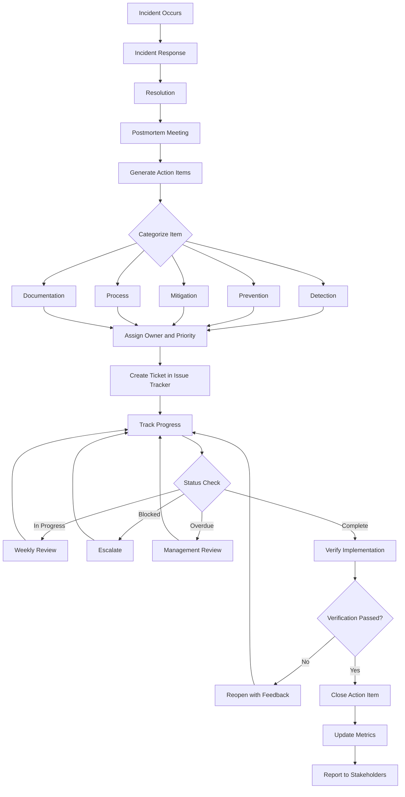
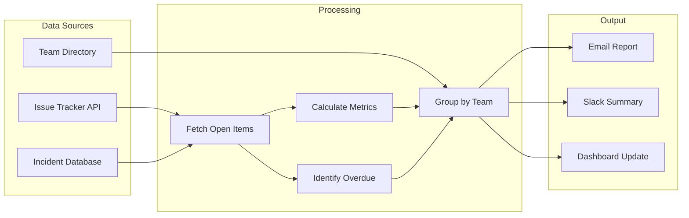
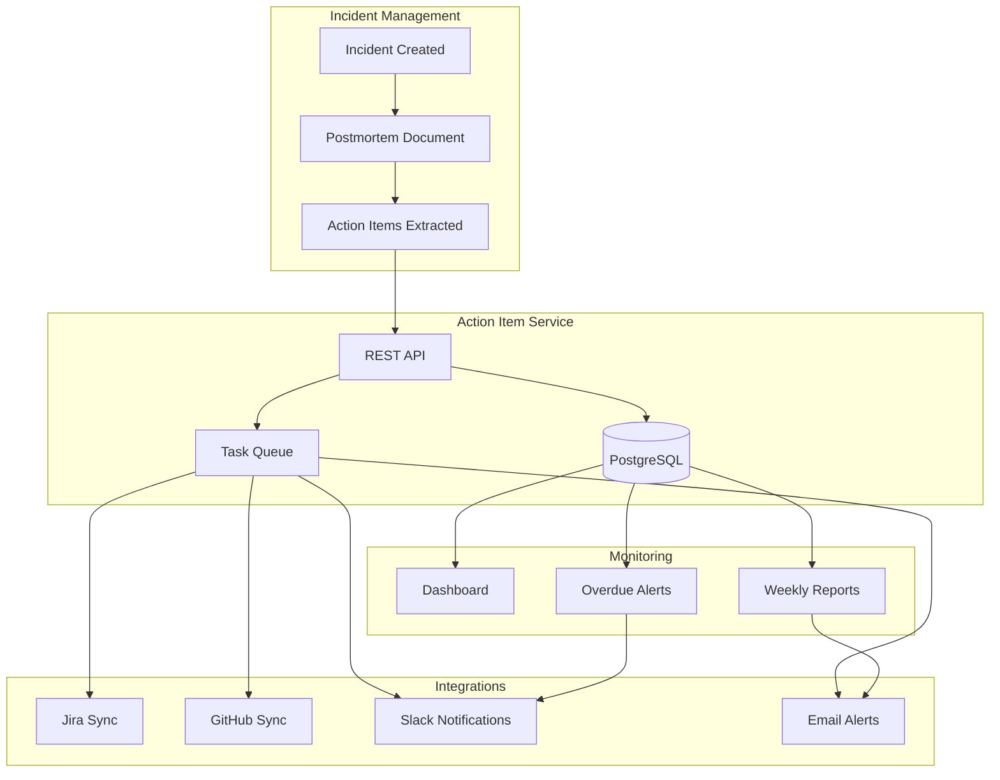

# How to Implement Action Item Tracking

Author: [nawazdhandala](https://github.com/nawazdhandala)

Tags: SRE, IncidentManagement, ActionItems, Tracking

Description: A practical guide to implementing action item tracking for incident follow-up that ensures remediation tasks are completed and future incidents are prevented.

---

After every incident, teams generate a list of action items to prevent recurrence. The challenge is not creating the list but ensuring those items get completed. Without proper tracking, action items drift into backlogs, get deprioritized, and eventually the same incident happens again.

This guide covers how to build a robust action item tracking system that integrates with your existing workflows and keeps remediation on track.

## Why Action Item Tracking Matters

Most teams conduct postmortems. Fewer teams follow through on the resulting action items. Studies show that 60% of post-incident action items never get completed. This creates a dangerous pattern where teams discuss improvements but never implement them.

Effective tracking delivers three outcomes:

- **Accountability**: Every item has an owner who is responsible for completion.
- **Visibility**: Leadership and stakeholders can see remediation progress.
- **Prevention**: Completed items reduce the likelihood of repeat incidents.

## Action Item Categorization

Not all action items are equal. Categorizing them helps teams prioritize and allocate resources effectively.

### By Type

| Category | Description | Examples |
|----------|-------------|----------|
| **Detection** | Improve how quickly issues are identified | Add monitoring, improve alerting, enhance logging |
| **Prevention** | Stop the incident from happening again | Code fixes, configuration changes, architecture improvements |
| **Mitigation** | Reduce impact when similar issues occur | Improve runbooks, add circuit breakers, implement graceful degradation |
| **Process** | Improve team workflows and procedures | Update on-call rotation, refine escalation paths, improve communication |
| **Documentation** | Capture knowledge for future reference | Update runbooks, document architecture decisions, improve onboarding materials |

### By Urgency

```python
# Action item urgency classification
# Use this to determine SLA for completion

class ActionItemUrgency:
    # Items that must be completed before the next on-call rotation
    CRITICAL = {
        "sla_days": 3,
        "description": "Immediate risk of recurrence",
        "examples": [
            "Fix authentication bypass vulnerability",
            "Add missing database failover",
            "Correct incorrect load balancer health check"
        ]
    }

    # Items that should be completed within the current sprint
    HIGH = {
        "sla_days": 14,
        "description": "Significant reliability improvement",
        "examples": [
            "Add end-to-end monitoring for payment flow",
            "Implement retry logic for third-party API calls",
            "Create runbook for database recovery"
        ]
    }

    # Items that should be completed within the current quarter
    MEDIUM = {
        "sla_days": 30,
        "description": "Reliability hardening",
        "examples": [
            "Increase test coverage for error handling",
            "Add capacity planning alerts",
            "Document disaster recovery procedures"
        ]
    }

    # Items that improve reliability but are not urgent
    LOW = {
        "sla_days": 90,
        "description": "Long-term improvements",
        "examples": [
            "Refactor legacy monitoring configuration",
            "Evaluate alternative service mesh solutions",
            "Create architecture diagrams"
        ]
    }
```

## Priority and Ownership Assignment

Every action item needs a clear owner and a realistic deadline. Here is a structured approach to assignment.

### The Assignment Framework

```yaml
# Action item assignment template
action_item:
  id: "INC-2024-001-AI-003"
  title: "Add circuit breaker for payment gateway"

  # Ownership
  owner: "jane.smith@company.com"
  backup_owner: "bob.jones@company.com"
  team: "payments"

  # Classification
  category: "mitigation"
  urgency: "high"

  # Timeline
  created_date: "2024-01-15"
  due_date: "2024-01-29"
  estimated_effort: "3 days"

  # Context
  incident_id: "INC-2024-001"
  description: |
    Payment gateway timeout caused cascading failures.
    Implement circuit breaker pattern to fail fast and
    prevent resource exhaustion during outages.

  # Acceptance criteria
  done_criteria:
    - "Circuit breaker implemented with 5s timeout"
    - "Fallback returns cached response or graceful error"
    - "Metrics exposed for circuit state transitions"
    - "Alert configured for circuit open state"
    - "Load test validates behavior under failure"
```

### Ownership Best Practices

1. **Single owner**: Every item has exactly one person accountable, even if work is shared.
2. **Skill match**: Assign to someone with the expertise to complete the work.
3. **Capacity check**: Verify the owner has bandwidth before assignment.
4. **Escalation path**: Define who to contact if the owner is blocked or unavailable.

## Action Item Tracking Workflow

The following diagram shows a complete workflow from incident to verified completion.



## Integration with Issue Trackers

Action items should live in your existing issue tracking system, not in a separate spreadsheet or document. This ensures they compete fairly for engineering time and have proper visibility.

### Jira Integration Example

```python
# Python script to create action items in Jira from postmortem
# Integrates with Jira REST API

import requests
from datetime import datetime, timedelta
from typing import Dict, List

class ActionItemJiraSync:
    def __init__(self, jira_url: str, api_token: str, project_key: str):
        self.jira_url = jira_url
        self.headers = {
            "Authorization": f"Bearer {api_token}",
            "Content-Type": "application/json"
        }
        self.project_key = project_key

    def create_action_item(self, item: Dict) -> str:
        """
        Create a Jira ticket for an action item.
        Returns the created ticket key.
        """
        # Calculate due date based on urgency
        urgency_to_days = {
            "critical": 3,
            "high": 14,
            "medium": 30,
            "low": 90
        }
        due_days = urgency_to_days.get(item["urgency"], 30)
        due_date = (datetime.now() + timedelta(days=due_days)).strftime("%Y-%m-%d")

        # Build the Jira issue payload
        payload = {
            "fields": {
                "project": {"key": self.project_key},
                "summary": item["title"],
                "description": self._format_description(item),
                "issuetype": {"name": "Task"},
                "priority": {"name": self._map_priority(item["urgency"])},
                "duedate": due_date,
                "assignee": {"name": item["owner"]},
                "labels": [
                    "action-item",
                    f"incident-{item['incident_id']}",
                    item["category"]
                ],
                # Custom field for incident reference
                "customfield_10100": item["incident_id"]
            }
        }

        response = requests.post(
            f"{self.jira_url}/rest/api/2/issue",
            headers=self.headers,
            json=payload
        )
        response.raise_for_status()

        return response.json()["key"]

    def _format_description(self, item: Dict) -> str:
        """Format the action item description for Jira."""
        return f"""
        h2. Background
        This action item was generated from incident {item['incident_id']}.

        h2. Description
        {item['description']}

        h2. Acceptance Criteria
        {self._format_criteria(item.get('done_criteria', []))}

        h2. Context
        * Category: {item['category']}
        * Urgency: {item['urgency']}
        * Estimated Effort: {item.get('estimated_effort', 'TBD')}
        """

    def _format_criteria(self, criteria: List[str]) -> str:
        """Format acceptance criteria as a checklist."""
        if not criteria:
            return "* Define acceptance criteria"
        return "\n".join(f"* {c}" for c in criteria)

    def _map_priority(self, urgency: str) -> str:
        """Map internal urgency to Jira priority."""
        mapping = {
            "critical": "Highest",
            "high": "High",
            "medium": "Medium",
            "low": "Low"
        }
        return mapping.get(urgency, "Medium")


# Example usage
if __name__ == "__main__":
    sync = ActionItemJiraSync(
        jira_url="https://company.atlassian.net",
        api_token="your-api-token",
        project_key="SRE"
    )

    action_item = {
        "incident_id": "INC-2024-001",
        "title": "Add circuit breaker for payment gateway",
        "description": "Implement circuit breaker to prevent cascading failures",
        "category": "mitigation",
        "urgency": "high",
        "owner": "jane.smith",
        "done_criteria": [
            "Circuit breaker implemented with 5s timeout",
            "Fallback returns graceful error",
            "Metrics exposed for circuit state"
        ]
    }

    ticket_key = sync.create_action_item(action_item)
    print(f"Created ticket: {ticket_key}")
```

### GitHub Issues Integration

```typescript
// TypeScript module for creating action items as GitHub issues
// Uses the GitHub REST API via Octokit

import { Octokit } from "@octokit/rest";

interface ActionItem {
  incidentId: string;
  title: string;
  description: string;
  category: "detection" | "prevention" | "mitigation" | "process" | "documentation";
  urgency: "critical" | "high" | "medium" | "low";
  owner: string;
  doneCriteria: string[];
}

interface GitHubConfig {
  owner: string;
  repo: string;
  token: string;
}

class ActionItemGitHubSync {
  private octokit: Octokit;
  private owner: string;
  private repo: string;

  constructor(config: GitHubConfig) {
    this.octokit = new Octokit({ auth: config.token });
    this.owner = config.owner;
    this.repo = config.repo;
  }

  // Create a GitHub issue for an action item
  async createActionItem(item: ActionItem): Promise<number> {
    const body = this.formatIssueBody(item);
    const labels = this.getLabels(item);

    const response = await this.octokit.issues.create({
      owner: this.owner,
      repo: this.repo,
      title: `[Action Item] ${item.title}`,
      body: body,
      labels: labels,
      assignees: [item.owner],
    });

    return response.data.number;
  }

  // Format the issue body with all relevant details
  private formatIssueBody(item: ActionItem): string {
    const criteriaList = item.doneCriteria
      .map((c) => `- [ ] ${c}`)
      .join("\n");

    return `
## Incident Reference
This action item was created from incident **${item.incidentId}**.

## Description
${item.description}

## Category
**${item.category}**

## Urgency
**${item.urgency}** - ${this.getUrgencyDescription(item.urgency)}

## Acceptance Criteria
${criteriaList}

---
*Generated by Action Item Tracking System*
    `.trim();
  }

  // Generate labels based on action item properties
  private getLabels(item: ActionItem): string[] {
    return [
      "action-item",
      `incident:${item.incidentId}`,
      `category:${item.category}`,
      `urgency:${item.urgency}`,
    ];
  }

  // Return SLA description for each urgency level
  private getUrgencyDescription(urgency: string): string {
    const descriptions: Record<string, string> = {
      critical: "Must be completed within 3 days",
      high: "Must be completed within 2 weeks",
      medium: "Must be completed within 30 days",
      low: "Should be completed within 90 days",
    };
    return descriptions[urgency] || "Timeline TBD";
  }
}

// Example usage
async function main() {
  const sync = new ActionItemGitHubSync({
    owner: "company",
    repo: "infrastructure",
    token: process.env.GITHUB_TOKEN || "",
  });

  const item: ActionItem = {
    incidentId: "INC-2024-001",
    title: "Add circuit breaker for payment gateway",
    description: "Implement circuit breaker to prevent cascading failures during gateway outages.",
    category: "mitigation",
    urgency: "high",
    owner: "janesmith",
    doneCriteria: [
      "Circuit breaker implemented with 5s timeout",
      "Fallback returns graceful error message",
      "Prometheus metrics exposed for circuit state",
      "Alert configured for circuit open state",
    ],
  };

  const issueNumber = await sync.createActionItem(item);
  console.log(`Created issue #${issueNumber}`);
}
```

## Progress Monitoring and Reporting

Visibility into action item status is essential for accountability. Build automated reporting to surface overdue items and track completion trends.

### Status Dashboard Metrics

Track these key metrics for your action item program:

```python
# Metrics calculation for action item tracking
# These power your reporting dashboard

from dataclasses import dataclass
from datetime import datetime, timedelta
from typing import List, Dict
from enum import Enum

class Status(Enum):
    OPEN = "open"
    IN_PROGRESS = "in_progress"
    BLOCKED = "blocked"
    COMPLETE = "complete"
    OVERDUE = "overdue"

@dataclass
class ActionItemMetrics:
    # Total counts by status
    total_open: int
    total_in_progress: int
    total_blocked: int
    total_complete: int
    total_overdue: int

    # Completion rates
    completion_rate_30d: float  # Percentage completed within SLA
    completion_rate_90d: float

    # Time metrics (in days)
    avg_time_to_close: float
    median_time_to_close: float

    # Aging
    items_over_30_days: int
    items_over_60_days: int
    items_over_90_days: int

def calculate_metrics(items: List[Dict]) -> ActionItemMetrics:
    """
    Calculate action item metrics from a list of items.
    Each item should have: status, created_date, closed_date, due_date
    """
    now = datetime.now()

    # Count by status
    status_counts = {s: 0 for s in Status}
    time_to_close = []
    aging_30 = 0
    aging_60 = 0
    aging_90 = 0

    completed_within_sla_30d = 0
    completed_within_sla_90d = 0
    total_completed_30d = 0
    total_completed_90d = 0

    for item in items:
        created = datetime.fromisoformat(item["created_date"])
        due = datetime.fromisoformat(item["due_date"])

        # Determine effective status
        if item["status"] == "complete":
            status_counts[Status.COMPLETE] += 1
            closed = datetime.fromisoformat(item["closed_date"])
            days_to_close = (closed - created).days
            time_to_close.append(days_to_close)

            # Check if completed within SLA
            if closed <= due:
                if (now - closed).days <= 30:
                    completed_within_sla_30d += 1
                if (now - closed).days <= 90:
                    completed_within_sla_90d += 1

            if (now - closed).days <= 30:
                total_completed_30d += 1
            if (now - closed).days <= 90:
                total_completed_90d += 1

        elif now > due:
            status_counts[Status.OVERDUE] += 1
        elif item["status"] == "blocked":
            status_counts[Status.BLOCKED] += 1
        elif item["status"] == "in_progress":
            status_counts[Status.IN_PROGRESS] += 1
        else:
            status_counts[Status.OPEN] += 1

        # Calculate aging for non-complete items
        if item["status"] != "complete":
            age = (now - created).days
            if age > 90:
                aging_90 += 1
            elif age > 60:
                aging_60 += 1
            elif age > 30:
                aging_30 += 1

    # Calculate averages
    avg_close = sum(time_to_close) / len(time_to_close) if time_to_close else 0
    sorted_close = sorted(time_to_close)
    median_close = sorted_close[len(sorted_close) // 2] if sorted_close else 0

    # Calculate completion rates
    rate_30d = (completed_within_sla_30d / total_completed_30d * 100) if total_completed_30d else 0
    rate_90d = (completed_within_sla_90d / total_completed_90d * 100) if total_completed_90d else 0

    return ActionItemMetrics(
        total_open=status_counts[Status.OPEN],
        total_in_progress=status_counts[Status.IN_PROGRESS],
        total_blocked=status_counts[Status.BLOCKED],
        total_complete=status_counts[Status.COMPLETE],
        total_overdue=status_counts[Status.OVERDUE],
        completion_rate_30d=rate_30d,
        completion_rate_90d=rate_90d,
        avg_time_to_close=avg_close,
        median_time_to_close=median_close,
        items_over_30_days=aging_30,
        items_over_60_days=aging_60,
        items_over_90_days=aging_90,
    )
```

### Weekly Status Report



### Automated Reporting Script

```python
# Weekly action item report generator
# Sends summary to Slack and email

import json
from datetime import datetime
from typing import Dict, List

def generate_weekly_report(metrics: Dict, items_by_team: Dict[str, List]) -> str:
    """
    Generate a weekly action item status report.
    Returns formatted markdown suitable for Slack or email.
    """
    report_date = datetime.now().strftime("%Y-%m-%d")

    report = f"""
# Action Item Weekly Report
Generated: {report_date}

## Summary Metrics

| Metric | Value |
|--------|-------|
| Open Items | {metrics['total_open']} |
| In Progress | {metrics['total_in_progress']} |
| Blocked | {metrics['total_blocked']} |
| Overdue | {metrics['total_overdue']} |
| Completed (30d) | {metrics['total_complete']} |
| SLA Compliance | {metrics['completion_rate_30d']:.1f}% |

## Aging Analysis

- Items over 30 days: {metrics['items_over_30_days']}
- Items over 60 days: {metrics['items_over_60_days']}
- Items over 90 days: {metrics['items_over_90_days']}

## Status by Team

"""

    # Add team breakdown
    for team, items in items_by_team.items():
        open_count = len([i for i in items if i['status'] == 'open'])
        overdue_count = len([i for i in items if i['status'] == 'overdue'])

        report += f"### {team}\n"
        report += f"- Open: {open_count}\n"
        report += f"- Overdue: {overdue_count}\n\n"

        # List overdue items
        overdue_items = [i for i in items if i['status'] == 'overdue']
        if overdue_items:
            report += "**Overdue Items:**\n"
            for item in overdue_items[:5]:  # Limit to top 5
                days_overdue = (datetime.now() - datetime.fromisoformat(item['due_date'])).days
                report += f"- [{item['id']}] {item['title']} ({days_overdue} days overdue)\n"
            report += "\n"

    report += """
## Action Required

1. Review and update blocked items
2. Escalate items over 60 days
3. Close completed items in the tracker

---
*Report generated by Action Item Tracking System*
"""

    return report


def send_to_slack(report: str, webhook_url: str) -> None:
    """Send the report to a Slack channel via webhook."""
    import requests

    # Convert markdown to Slack blocks for better formatting
    payload = {
        "blocks": [
            {
                "type": "section",
                "text": {
                    "type": "mrkdwn",
                    "text": report
                }
            }
        ]
    }

    requests.post(webhook_url, json=payload)
```

## Building a Complete Tracking System

Here is a reference architecture for a production action item tracking system.



## Best Practices Summary

1. **Categorize immediately**: Assign type and urgency during the postmortem while context is fresh.

2. **Single owner per item**: Shared ownership leads to no ownership. One person is accountable.

3. **Integrate with existing tools**: Use Jira, GitHub, or your existing tracker. Avoid spreadsheets.

4. **Set realistic deadlines**: Base SLAs on urgency but account for team capacity.

5. **Review weekly**: Regular status reviews catch blocked items before they age out.

6. **Escalate proactively**: Items over 30 days should trigger management visibility.

7. **Verify completion**: Do not close items without confirming the fix is deployed and validated.

8. **Track metrics over time**: Completion rate trends reveal systemic issues in your remediation process.

## Conclusion

Action item tracking transforms postmortems from documentation exercises into genuine reliability improvements. The key is treating action items with the same rigor as feature work: clear ownership, realistic timelines, visible progress, and verified completion.

Start with the basics. Create a standard template, integrate with your issue tracker, and establish a weekly review cadence. As your process matures, add automation for reporting and alerts. The goal is a system where no action item falls through the cracks and every incident makes your system more resilient.
