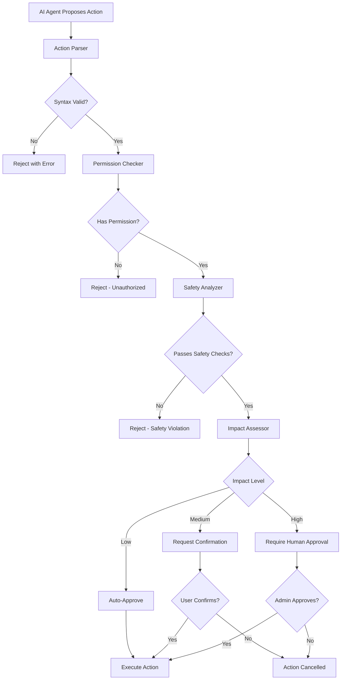
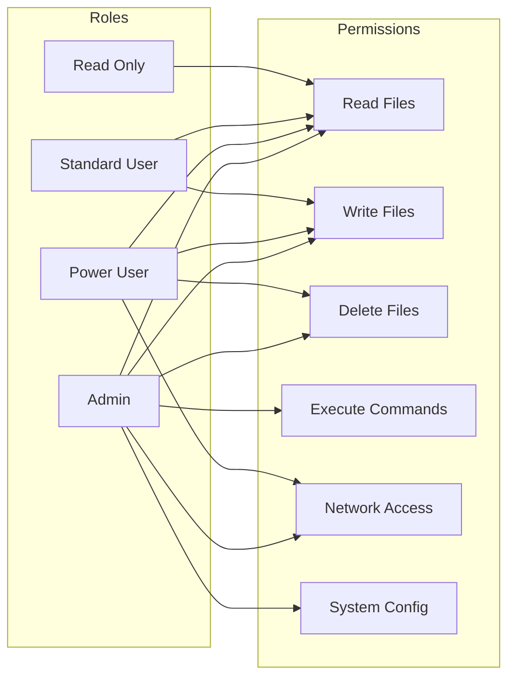
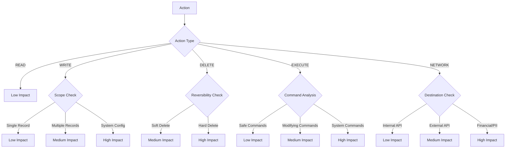
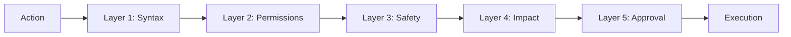

# How to Create Action Validation

Author: [nawazdhandala](https://github.com/nawazdhandala)

Tags: AI Agents, Action Validation, Safety, Quality Assurance

Description: Learn to implement action validation for AI agents with safety checks, permission verification, and impact assessment before execution.

---

AI agents are becoming increasingly powerful, capable of executing complex actions autonomously. However, with great power comes great responsibility. Action validation is a critical safety layer that ensures AI agents only perform actions that are safe, permitted, and aligned with user intentions. In this guide, we will explore how to build a robust action validation system for AI agents.

## Why Action Validation Matters

Before an AI agent executes any action - whether it is sending an email, modifying a database, or making an API call - we need to verify that:

1. The action is syntactically and semantically valid
2. The agent has permission to perform it
3. The potential impact is acceptable
4. Human approval is obtained when necessary

Without proper validation, AI agents can cause unintended consequences ranging from minor inconveniences to significant security breaches or data loss.

## Architecture Overview

Here is the high-level architecture of an action validation system:



## Core Components

### 1. Action Schema and Validation Rules

First, we need to define a clear schema for what constitutes a valid action. This provides the foundation for all subsequent validation.

```python
from dataclasses import dataclass
from typing import Any, Dict, List, Optional
from enum import Enum

class ActionType(Enum):
    READ = "read"
    WRITE = "write"
    DELETE = "delete"
    EXECUTE = "execute"
    NETWORK = "network"

class ResourceType(Enum):
    FILE = "file"
    DATABASE = "database"
    API = "api"
    SYSTEM = "system"
    EMAIL = "email"

@dataclass
class Action:
    """Represents an action proposed by an AI agent."""
    action_type: ActionType
    resource_type: ResourceType
    resource_id: str
    parameters: Dict[str, Any]
    context: Optional[Dict[str, Any]] = None

    def to_dict(self) -> Dict[str, Any]:
        return {
            "action_type": self.action_type.value,
            "resource_type": self.resource_type.value,
            "resource_id": self.resource_id,
            "parameters": self.parameters,
            "context": self.context
        }
```

Now let us create a validation rules engine:

```python
from abc import ABC, abstractmethod
from typing import Tuple

class ValidationRule(ABC):
    """Base class for all validation rules."""

    @abstractmethod
    def validate(self, action: Action) -> Tuple[bool, str]:
        """
        Validate an action against this rule.
        Returns (is_valid, message).
        """
        pass

class RequiredParametersRule(ValidationRule):
    """Ensures all required parameters are present."""

    REQUIRED_PARAMS = {
        (ActionType.WRITE, ResourceType.FILE): ["path", "content"],
        (ActionType.DELETE, ResourceType.FILE): ["path"],
        (ActionType.NETWORK, ResourceType.API): ["url", "method"],
        (ActionType.WRITE, ResourceType.DATABASE): ["table", "data"],
        (ActionType.EXECUTE, ResourceType.EMAIL): ["recipient", "subject", "body"],
    }

    def validate(self, action: Action) -> Tuple[bool, str]:
        key = (action.action_type, action.resource_type)
        required = self.REQUIRED_PARAMS.get(key, [])

        missing = [p for p in required if p not in action.parameters]

        if missing:
            return False, f"Missing required parameters: {missing}"
        return True, "All required parameters present"

class PathTraversalRule(ValidationRule):
    """Prevents path traversal attacks in file operations."""

    def validate(self, action: Action) -> Tuple[bool, str]:
        if action.resource_type != ResourceType.FILE:
            return True, "Not a file operation"

        path = action.parameters.get("path", "")

        # Check for path traversal patterns
        dangerous_patterns = ["../", "..\\", "/etc/", "/root/", "C:\\Windows"]

        for pattern in dangerous_patterns:
            if pattern in path:
                return False, f"Path traversal detected: {pattern}"

        return True, "Path is safe"

class SQLInjectionRule(ValidationRule):
    """Basic SQL injection prevention for database operations."""

    DANGEROUS_PATTERNS = [
        "'; DROP", "1=1", "OR 1=1", "UNION SELECT",
        "--", "/*", "*/", "xp_", "sp_"
    ]

    def validate(self, action: Action) -> Tuple[bool, str]:
        if action.resource_type != ResourceType.DATABASE:
            return True, "Not a database operation"

        # Check all string parameters
        for key, value in action.parameters.items():
            if isinstance(value, str):
                upper_value = value.upper()
                for pattern in self.DANGEROUS_PATTERNS:
                    if pattern.upper() in upper_value:
                        return False, f"Potential SQL injection in {key}"

        return True, "No SQL injection patterns detected"
```

### 2. Permission System

The permission system determines whether an agent has the authority to perform a specific action. Here is a role-based access control (RBAC) implementation:



```python
from typing import Set

class Permission:
    """Represents a specific permission."""
    def __init__(self, action_type: ActionType, resource_type: ResourceType):
        self.action_type = action_type
        self.resource_type = resource_type

    def __hash__(self):
        return hash((self.action_type, self.resource_type))

    def __eq__(self, other):
        return (self.action_type == other.action_type and
                self.resource_type == other.resource_type)

class Role:
    """Defines a role with associated permissions."""
    def __init__(self, name: str, permissions: Set[Permission]):
        self.name = name
        self.permissions = permissions

    def has_permission(self, permission: Permission) -> bool:
        return permission in self.permissions

# Define standard roles
ROLES = {
    "read_only": Role("read_only", {
        Permission(ActionType.READ, ResourceType.FILE),
        Permission(ActionType.READ, ResourceType.DATABASE),
    }),
    "standard_user": Role("standard_user", {
        Permission(ActionType.READ, ResourceType.FILE),
        Permission(ActionType.READ, ResourceType.DATABASE),
        Permission(ActionType.WRITE, ResourceType.FILE),
        Permission(ActionType.WRITE, ResourceType.DATABASE),
        Permission(ActionType.EXECUTE, ResourceType.EMAIL),
    }),
    "power_user": Role("power_user", {
        Permission(ActionType.READ, ResourceType.FILE),
        Permission(ActionType.READ, ResourceType.DATABASE),
        Permission(ActionType.WRITE, ResourceType.FILE),
        Permission(ActionType.WRITE, ResourceType.DATABASE),
        Permission(ActionType.DELETE, ResourceType.FILE),
        Permission(ActionType.DELETE, ResourceType.DATABASE),
        Permission(ActionType.NETWORK, ResourceType.API),
        Permission(ActionType.EXECUTE, ResourceType.EMAIL),
    }),
    "admin": Role("admin", {
        Permission(action_type, resource_type)
        for action_type in ActionType
        for resource_type in ResourceType
    }),
}

class PermissionChecker:
    """Checks if an agent has permission to perform an action."""

    def __init__(self, agent_role: str):
        self.role = ROLES.get(agent_role, ROLES["read_only"])

    def check(self, action: Action) -> Tuple[bool, str]:
        required_permission = Permission(action.action_type, action.resource_type)

        if self.role.has_permission(required_permission):
            return True, f"Permission granted for {self.role.name}"

        return False, f"Role {self.role.name} lacks permission for {action.action_type.value} on {action.resource_type.value}"
```

### 3. Safety Checks

Safety checks go beyond permissions to ensure actions do not cause harm even when technically allowed:

```python
from typing import List
import re

class SafetyCheck(ABC):
    """Base class for safety checks."""

    @abstractmethod
    def check(self, action: Action) -> Tuple[bool, str]:
        pass

class RateLimitCheck(SafetyCheck):
    """Prevents actions that exceed rate limits."""

    def __init__(self):
        self.action_counts: Dict[str, List[float]] = {}
        self.limits = {
            ActionType.NETWORK: (100, 60),  # 100 requests per 60 seconds
            ActionType.WRITE: (50, 60),      # 50 writes per 60 seconds
            ActionType.DELETE: (10, 60),     # 10 deletes per 60 seconds
            ActionType.EXECUTE: (20, 60),    # 20 executions per 60 seconds
        }

    def check(self, action: Action) -> Tuple[bool, str]:
        import time

        current_time = time.time()
        key = f"{action.action_type.value}"

        if key not in self.action_counts:
            self.action_counts[key] = []

        # Get limit for this action type
        max_count, window = self.limits.get(action.action_type, (1000, 60))

        # Clean old entries
        self.action_counts[key] = [
            t for t in self.action_counts[key]
            if current_time - t < window
        ]

        # Check limit
        if len(self.action_counts[key]) >= max_count:
            return False, f"Rate limit exceeded: {max_count} {action.action_type.value} actions per {window}s"

        # Record this action
        self.action_counts[key].append(current_time)
        return True, "Within rate limits"

class SensitiveDataCheck(SafetyCheck):
    """Detects and prevents exposure of sensitive data."""

    PATTERNS = {
        "api_key": r"[a-zA-Z0-9]{32,}",
        "password": r"password\s*[:=]\s*\S+",
        "credit_card": r"\b\d{4}[-\s]?\d{4}[-\s]?\d{4}[-\s]?\d{4}\b",
        "ssn": r"\b\d{3}[-\s]?\d{2}[-\s]?\d{4}\b",
        "email": r"[a-zA-Z0-9._%+-]+@[a-zA-Z0-9.-]+\.[a-zA-Z]{2,}",
    }

    def check(self, action: Action) -> Tuple[bool, str]:
        # Only check outbound data actions
        if action.action_type not in [ActionType.NETWORK, ActionType.EXECUTE]:
            return True, "Not an outbound action"

        content = str(action.parameters)

        for data_type, pattern in self.PATTERNS.items():
            if re.search(pattern, content, re.IGNORECASE):
                return False, f"Potential {data_type} exposure detected"

        return True, "No sensitive data patterns found"

class ResourceLimitCheck(SafetyCheck):
    """Ensures actions do not exceed resource limits."""

    MAX_FILE_SIZE = 100 * 1024 * 1024  # 100 MB
    MAX_BATCH_SIZE = 1000  # Maximum records in batch operations

    def check(self, action: Action) -> Tuple[bool, str]:
        # Check file size limits
        if action.resource_type == ResourceType.FILE:
            content = action.parameters.get("content", "")
            if len(content) > self.MAX_FILE_SIZE:
                return False, f"File content exceeds maximum size of {self.MAX_FILE_SIZE} bytes"

        # Check batch operation limits
        if action.resource_type == ResourceType.DATABASE:
            data = action.parameters.get("data", [])
            if isinstance(data, list) and len(data) > self.MAX_BATCH_SIZE:
                return False, f"Batch size exceeds maximum of {self.MAX_BATCH_SIZE} records"

        return True, "Within resource limits"
```

### 4. Impact Assessment

Impact assessment evaluates the potential consequences of an action and determines the appropriate approval level:



```python
from enum import IntEnum

class ImpactLevel(IntEnum):
    LOW = 1      # Auto-approve
    MEDIUM = 2   # Request user confirmation
    HIGH = 3     # Require explicit human approval

@dataclass
class ImpactAssessment:
    level: ImpactLevel
    reasons: List[str]
    reversible: bool
    affected_resources: int
    estimated_cost: float = 0.0

class ImpactAssessor:
    """Assesses the potential impact of an action."""

    # High-impact file paths
    SENSITIVE_PATHS = [
        "/etc/", "/var/", "/usr/", "/root/",
        "C:\\Windows", "C:\\Program Files",
        ".env", ".ssh", ".aws", "credentials"
    ]

    # High-impact database tables
    SENSITIVE_TABLES = [
        "users", "accounts", "payments", "transactions",
        "credentials", "permissions", "audit_log"
    ]

    # Dangerous system commands
    DANGEROUS_COMMANDS = [
        "rm -rf", "DROP TABLE", "DELETE FROM", "TRUNCATE",
        "shutdown", "reboot", "format", "mkfs"
    ]

    def assess(self, action: Action) -> ImpactAssessment:
        reasons = []
        level = ImpactLevel.LOW
        reversible = True
        affected_resources = 1

        # Assess based on action type
        if action.action_type == ActionType.READ:
            level = ImpactLevel.LOW
            reasons.append("Read-only operation")

        elif action.action_type == ActionType.DELETE:
            level = ImpactLevel.HIGH
            reversible = False
            reasons.append("Delete operations are irreversible")

        elif action.action_type == ActionType.WRITE:
            level = ImpactLevel.MEDIUM
            reasons.append("Write operation modifies data")

        # Check for sensitive resources
        level, reasons = self._check_sensitive_resources(action, level, reasons)

        # Check for batch operations
        if action.resource_type == ResourceType.DATABASE:
            data = action.parameters.get("data", [])
            if isinstance(data, list):
                affected_resources = len(data)
                if affected_resources > 100:
                    level = max(level, ImpactLevel.HIGH)
                    reasons.append(f"Large batch operation: {affected_resources} records")
                elif affected_resources > 10:
                    level = max(level, ImpactLevel.MEDIUM)
                    reasons.append(f"Batch operation: {affected_resources} records")

        # Check for dangerous patterns
        content = str(action.parameters).lower()
        for cmd in self.DANGEROUS_COMMANDS:
            if cmd.lower() in content:
                level = ImpactLevel.HIGH
                reversible = False
                reasons.append(f"Contains dangerous pattern: {cmd}")

        return ImpactAssessment(
            level=level,
            reasons=reasons,
            reversible=reversible,
            affected_resources=affected_resources
        )

    def _check_sensitive_resources(
        self, action: Action, current_level: ImpactLevel, reasons: List[str]
    ) -> Tuple[ImpactLevel, List[str]]:
        """Check if action targets sensitive resources."""

        # Check file paths
        if action.resource_type == ResourceType.FILE:
            path = action.parameters.get("path", "")
            for sensitive in self.SENSITIVE_PATHS:
                if sensitive in path:
                    current_level = max(current_level, ImpactLevel.HIGH)
                    reasons.append(f"Targets sensitive path: {sensitive}")
                    break

        # Check database tables
        if action.resource_type == ResourceType.DATABASE:
            table = action.parameters.get("table", "")
            if table.lower() in [t.lower() for t in self.SENSITIVE_TABLES]:
                current_level = max(current_level, ImpactLevel.HIGH)
                reasons.append(f"Targets sensitive table: {table}")

        return current_level, reasons
```

### 5. Approval Workflow

The approval workflow handles human-in-the-loop validation for medium and high impact actions:

```python
from datetime import datetime, timedelta
from typing import Optional, Callable
import uuid

@dataclass
class ApprovalRequest:
    id: str
    action: Action
    impact: ImpactAssessment
    requester: str
    created_at: datetime
    expires_at: datetime
    status: str = "pending"
    approver: Optional[str] = None
    approved_at: Optional[datetime] = None
    notes: Optional[str] = None

class ApprovalWorkflow:
    """Manages the approval workflow for high-impact actions."""

    def __init__(self):
        self.pending_requests: Dict[str, ApprovalRequest] = {}
        self.approval_callbacks: List[Callable] = []

    def request_approval(
        self,
        action: Action,
        impact: ImpactAssessment,
        requester: str,
        timeout_minutes: int = 30
    ) -> ApprovalRequest:
        """Create an approval request for an action."""

        request = ApprovalRequest(
            id=str(uuid.uuid4()),
            action=action,
            impact=impact,
            requester=requester,
            created_at=datetime.now(),
            expires_at=datetime.now() + timedelta(minutes=timeout_minutes)
        )

        self.pending_requests[request.id] = request
        self._notify_approvers(request)

        return request

    def approve(
        self,
        request_id: str,
        approver: str,
        notes: Optional[str] = None
    ) -> Tuple[bool, str]:
        """Approve a pending request."""

        request = self.pending_requests.get(request_id)

        if not request:
            return False, "Request not found"

        if request.status != "pending":
            return False, f"Request already {request.status}"

        if datetime.now() > request.expires_at:
            request.status = "expired"
            return False, "Request has expired"

        request.status = "approved"
        request.approver = approver
        request.approved_at = datetime.now()
        request.notes = notes

        # Trigger approval callbacks
        for callback in self.approval_callbacks:
            callback(request)

        return True, "Action approved"

    def deny(
        self,
        request_id: str,
        approver: str,
        notes: Optional[str] = None
    ) -> Tuple[bool, str]:
        """Deny a pending request."""

        request = self.pending_requests.get(request_id)

        if not request:
            return False, "Request not found"

        if request.status != "pending":
            return False, f"Request already {request.status}"

        request.status = "denied"
        request.approver = approver
        request.approved_at = datetime.now()
        request.notes = notes

        return True, "Action denied"

    def _notify_approvers(self, request: ApprovalRequest):
        """Send notifications to approvers."""
        print(f"""
        [APPROVAL REQUIRED]
        Request ID: {request.id}
        Action: {request.action.action_type.value} on {request.action.resource_type.value}
        Impact Level: {request.impact.level.name}
        Reasons: {', '.join(request.impact.reasons)}
        Reversible: {request.impact.reversible}
        Expires: {request.expires_at}

        To approve: workflow.approve("{request.id}", "your_username")
        To deny: workflow.deny("{request.id}", "your_username")
        """)
```

## Putting It All Together

Now let us combine all components into a unified action validator:

```python
@dataclass
class ValidationResult:
    is_valid: bool
    action: Action
    impact: Optional[ImpactAssessment]
    errors: List[str]
    warnings: List[str]
    requires_approval: bool
    approval_request: Optional[ApprovalRequest]

class ActionValidator:
    """Main class that orchestrates action validation."""

    def __init__(self, agent_role: str = "standard_user"):
        # Initialize validation rules
        self.rules = [
            RequiredParametersRule(),
            PathTraversalRule(),
            SQLInjectionRule(),
        ]

        # Initialize safety checks
        self.safety_checks = [
            RateLimitCheck(),
            SensitiveDataCheck(),
            ResourceLimitCheck(),
        ]

        # Initialize other components
        self.permission_checker = PermissionChecker(agent_role)
        self.impact_assessor = ImpactAssessor()
        self.approval_workflow = ApprovalWorkflow()

    def validate(self, action: Action, requester: str = "agent") -> ValidationResult:
        """Validate an action through all stages."""

        errors = []
        warnings = []

        # Stage 1: Validation Rules
        for rule in self.rules:
            is_valid, message = rule.validate(action)
            if not is_valid:
                errors.append(f"Validation failed: {message}")

        if errors:
            return ValidationResult(
                is_valid=False,
                action=action,
                impact=None,
                errors=errors,
                warnings=warnings,
                requires_approval=False,
                approval_request=None
            )

        # Stage 2: Permission Check
        has_permission, perm_message = self.permission_checker.check(action)
        if not has_permission:
            errors.append(f"Permission denied: {perm_message}")
            return ValidationResult(
                is_valid=False,
                action=action,
                impact=None,
                errors=errors,
                warnings=warnings,
                requires_approval=False,
                approval_request=None
            )

        # Stage 3: Safety Checks
        for check in self.safety_checks:
            is_safe, safety_message = check.check(action)
            if not is_safe:
                errors.append(f"Safety check failed: {safety_message}")

        if errors:
            return ValidationResult(
                is_valid=False,
                action=action,
                impact=None,
                errors=errors,
                warnings=warnings,
                requires_approval=False,
                approval_request=None
            )

        # Stage 4: Impact Assessment
        impact = self.impact_assessor.assess(action)

        # Add warnings based on impact
        if not impact.reversible:
            warnings.append("This action cannot be undone")
        if impact.affected_resources > 1:
            warnings.append(f"This will affect {impact.affected_resources} resources")

        # Stage 5: Determine approval requirements
        requires_approval = impact.level >= ImpactLevel.MEDIUM
        approval_request = None

        if impact.level == ImpactLevel.HIGH:
            approval_request = self.approval_workflow.request_approval(
                action=action,
                impact=impact,
                requester=requester,
                timeout_minutes=60
            )

        return ValidationResult(
            is_valid=True,
            action=action,
            impact=impact,
            errors=errors,
            warnings=warnings,
            requires_approval=requires_approval,
            approval_request=approval_request
        )
```

## Example Usage

Here is a complete example demonstrating the action validation system:

```python
# Create a validator with standard user permissions
validator = ActionValidator(agent_role="standard_user")

# Example 1: Safe read operation - should pass
read_action = Action(
    action_type=ActionType.READ,
    resource_type=ResourceType.FILE,
    resource_id="doc-123",
    parameters={"path": "/home/user/documents/report.txt"}
)

result = validator.validate(read_action)
print(f"Read action valid: {result.is_valid}")
# Output: Read action valid: True

# Example 2: Write with missing parameters - should fail
write_action = Action(
    action_type=ActionType.WRITE,
    resource_type=ResourceType.FILE,
    resource_id="file-456",
    parameters={"path": "/home/user/data.txt"}  # Missing 'content'
)

result = validator.validate(write_action)
print(f"Write action valid: {result.is_valid}")
print(f"Errors: {result.errors}")
# Output: Write action valid: False
# Errors: ['Validation failed: Missing required parameters: ['content']']

# Example 3: Path traversal attempt - should fail
malicious_action = Action(
    action_type=ActionType.WRITE,
    resource_type=ResourceType.FILE,
    resource_id="file-789",
    parameters={
        "path": "/home/user/../../../etc/passwd",
        "content": "malicious content"
    }
)

result = validator.validate(malicious_action)
print(f"Malicious action valid: {result.is_valid}")
print(f"Errors: {result.errors}")
# Output: Malicious action valid: False
# Errors: ['Validation failed: Path traversal detected: ../']

# Example 4: High-impact delete operation - requires approval
delete_action = Action(
    action_type=ActionType.DELETE,
    resource_type=ResourceType.DATABASE,
    resource_id="db-001",
    parameters={"table": "users", "where": "status='inactive'"}
)

# Need admin role for delete operations
admin_validator = ActionValidator(agent_role="admin")
result = admin_validator.validate(delete_action, requester="ai-agent-001")

print(f"Delete action valid: {result.is_valid}")
print(f"Requires approval: {result.requires_approval}")
print(f"Impact level: {result.impact.level.name}")
print(f"Warnings: {result.warnings}")
# Output: Delete action valid: True
# Requires approval: True
# Impact level: HIGH
# Warnings: ['This action cannot be undone']
```

## Best Practices

When implementing action validation for AI agents, consider the following best practices:

### 1. Defense in Depth

Apply multiple layers of validation. Even if one layer fails to catch an issue, others may catch it.



### 2. Fail Safe

When in doubt, deny the action. It is better to require additional confirmation than to allow a potentially harmful action.

```python
class FailSafePolicy:
    """Default deny policy for uncertain situations."""

    @staticmethod
    def evaluate(confidence: float, threshold: float = 0.95) -> bool:
        """Only allow actions when confidence exceeds threshold."""
        return confidence >= threshold
```

### 3. Comprehensive Logging

Log all validation decisions for audit and debugging purposes.

```python
import logging
from datetime import datetime

class ValidationLogger:
    def __init__(self):
        self.logger = logging.getLogger("action_validation")
        self.logger.setLevel(logging.INFO)

    def log_validation(self, action: Action, result: ValidationResult):
        log_entry = {
            "timestamp": datetime.now().isoformat(),
            "action_type": action.action_type.value,
            "resource_type": action.resource_type.value,
            "resource_id": action.resource_id,
            "is_valid": result.is_valid,
            "errors": result.errors,
            "warnings": result.warnings,
            "impact_level": result.impact.level.name if result.impact else None,
            "requires_approval": result.requires_approval
        }

        if result.is_valid:
            self.logger.info(f"Action validated: {log_entry}")
        else:
            self.logger.warning(f"Action rejected: {log_entry}")
```

### 4. Configurable Policies

Make validation rules configurable to adapt to different environments and use cases.

```python
@dataclass
class ValidationPolicy:
    """Configurable validation policy."""

    # Permission settings
    default_role: str = "read_only"
    allow_role_escalation: bool = False

    # Safety settings
    max_file_size_mb: int = 100
    max_batch_size: int = 1000
    rate_limit_window_seconds: int = 60

    # Impact thresholds
    auto_approve_max_resources: int = 1
    require_approval_min_resources: int = 10

    # Approval settings
    approval_timeout_minutes: int = 30
    require_mfa_for_high_impact: bool = True

    @classmethod
    def from_config_file(cls, path: str) -> "ValidationPolicy":
        """Load policy from configuration file."""
        import json
        with open(path) as f:
            config = json.load(f)
        return cls(**config)
```

## Conclusion

Action validation is essential for building safe and reliable AI agent systems. By implementing comprehensive validation rules, permission systems, safety checks, impact assessment, and approval workflows, you can ensure that AI agents operate within acceptable boundaries while still being useful and autonomous.

The key takeaways are:

1. **Validate early and often** - Check actions at multiple stages before execution
2. **Use defense in depth** - Multiple validation layers catch different types of issues
3. **Assess impact** - Not all actions are equal; high-impact actions need more scrutiny
4. **Human in the loop** - For critical operations, always have a human approval step
5. **Log everything** - Comprehensive logging enables debugging and auditing
6. **Make it configurable** - Different environments have different risk tolerances

By following these principles and using the patterns demonstrated in this guide, you can build AI agents that are both powerful and safe.
