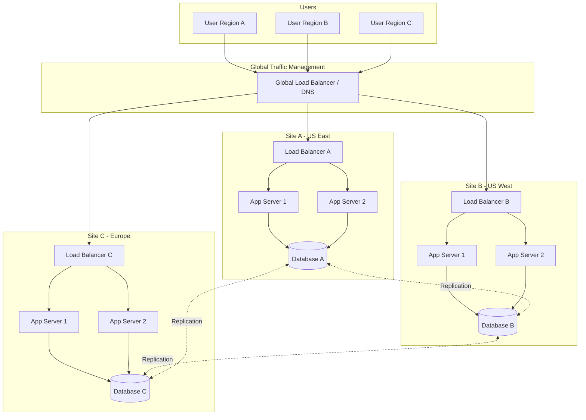
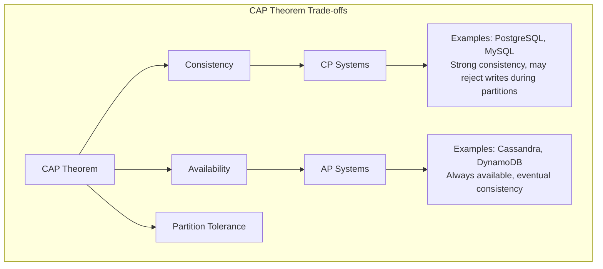
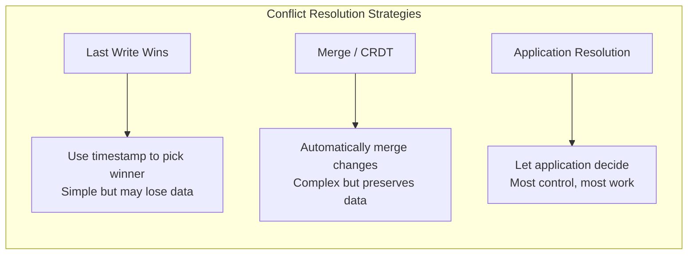
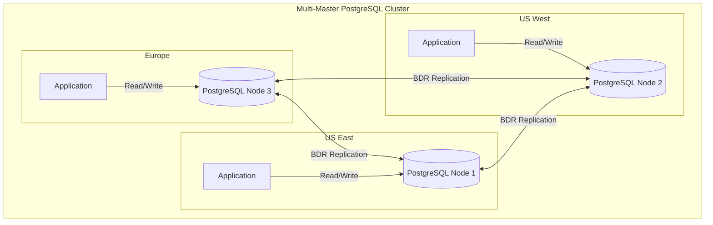
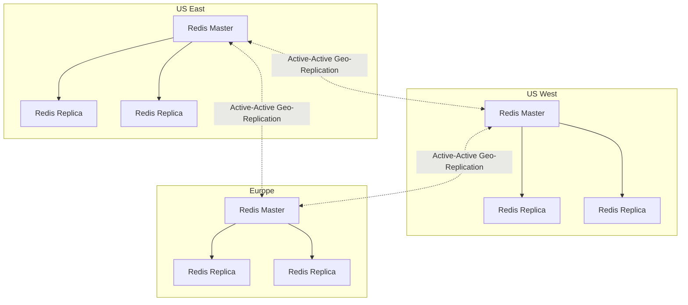

# How to Implement Active-Active Configuration

Author: [nawazdhandala](https://github.com/nawazdhandala)

Tags: High Availability, Architecture, Infrastructure, SRE

Description: Learn how to implement active-active configurations for maximum availability and load distribution.

---

Active-active configuration is the gold standard for high availability. Unlike active-passive setups where standby resources sit idle until needed, active-active keeps all nodes serving traffic simultaneously. This approach delivers better resource utilization, lower latency through geographic distribution, and near-zero downtime during failures.

## Understanding Active-Active Architecture

In an active-active setup, multiple independent sites or nodes handle production traffic concurrently. Each site is fully capable of serving the entire workload, and traffic is distributed across all active sites.



### Active-Active vs Active-Passive Comparison

| Aspect | Active-Active | Active-Passive |
|--------|---------------|----------------|
| Resource Utilization | All sites active (100%) | Standby idle (50%) |
| Failover Time | Seconds (automatic) | Minutes to hours |
| Cost Efficiency | Better ROI | Wasted standby capacity |
| Complexity | Higher | Lower |
| Data Consistency | Challenging | Simpler |
| Latency | Lower (geo-distributed) | Depends on user location |

## Multi-Site Active-Active Deployment

### Global Load Balancing Configuration

The first layer of an active-active setup is intelligent traffic distribution. Here is a DNS-based global load balancer configuration using AWS Route 53:

```hcl
# Terraform configuration for multi-region active-active with AWS Route 53
# This creates health checks and weighted routing across multiple regions

# Health check for US East region
resource "aws_route53_health_check" "us_east" {
  # FQDN of the regional endpoint to monitor
  fqdn              = "api-us-east.example.com"
  port              = 443
  type              = "HTTPS"
  resource_path     = "/health"

  # Check every 10 seconds for faster failover detection
  request_interval  = 10

  # Require 3 consecutive failures before marking unhealthy
  failure_threshold = 3

  tags = {
    Name = "us-east-health-check"
  }
}

# Health check for US West region
resource "aws_route53_health_check" "us_west" {
  fqdn              = "api-us-west.example.com"
  port              = 443
  type              = "HTTPS"
  resource_path     = "/health"
  request_interval  = 10
  failure_threshold = 3

  tags = {
    Name = "us-west-health-check"
  }
}

# Health check for Europe region
resource "aws_route53_health_check" "eu_west" {
  fqdn              = "api-eu-west.example.com"
  port              = 443
  type              = "HTTPS"
  resource_path     = "/health"
  request_interval  = 10
  failure_threshold = 3

  tags = {
    Name = "eu-west-health-check"
  }
}

# Primary DNS record with latency-based routing
# Route 53 automatically directs users to the lowest-latency healthy endpoint
resource "aws_route53_record" "us_east" {
  zone_id = aws_route53_zone.primary.zone_id
  name    = "api.example.com"
  type    = "A"

  # Latency routing sends users to the fastest responding region
  latency_routing_policy {
    region = "us-east-1"
  }

  # Unique identifier for this routing policy
  set_identifier  = "us-east"

  # Associate with health check for automatic failover
  health_check_id = aws_route53_health_check.us_east.id

  alias {
    name                   = aws_lb.us_east.dns_name
    zone_id                = aws_lb.us_east.zone_id
    evaluate_target_health = true
  }
}

resource "aws_route53_record" "us_west" {
  zone_id = aws_route53_zone.primary.zone_id
  name    = "api.example.com"
  type    = "A"

  latency_routing_policy {
    region = "us-west-2"
  }

  set_identifier  = "us-west"
  health_check_id = aws_route53_health_check.us_west.id

  alias {
    name                   = aws_lb.us_west.dns_name
    zone_id                = aws_lb.us_west.zone_id
    evaluate_target_health = true
  }
}

resource "aws_route53_record" "eu_west" {
  zone_id = aws_route53_zone.primary.zone_id
  name    = "api.example.com"
  type    = "A"

  latency_routing_policy {
    region = "eu-west-1"
  }

  set_identifier  = "eu-west"
  health_check_id = aws_route53_health_check.eu_west.id

  alias {
    name                   = aws_lb.eu_west.dns_name
    zone_id                = aws_lb.eu_west.zone_id
    evaluate_target_health = true
  }
}
```

### Application Layer Configuration

Each site needs identical application deployments. Here is a Kubernetes deployment designed for active-active:

```yaml
# Kubernetes Deployment for active-active application tier
# Deploy this manifest to each cluster/site
apiVersion: apps/v1
kind: Deployment
metadata:
  name: api-server
  namespace: production
  labels:
    app: api-server
    # Site identifier for observability and debugging
    site: ${SITE_NAME}
spec:
  # Run multiple replicas for local high availability
  replicas: 3

  selector:
    matchLabels:
      app: api-server

  # Rolling update strategy for zero-downtime deployments
  strategy:
    type: RollingUpdate
    rollingUpdate:
      # Allow one extra pod during updates
      maxSurge: 1
      # Always keep at least 2 pods running
      maxUnavailable: 0

  template:
    metadata:
      labels:
        app: api-server
        site: ${SITE_NAME}
    spec:
      # Spread pods across availability zones
      topologySpreadConstraints:
        - maxSkew: 1
          topologyKey: topology.kubernetes.io/zone
          whenUnsatisfiable: DoNotSchedule
          labelSelector:
            matchLabels:
              app: api-server

      # Avoid scheduling multiple pods on the same node
      affinity:
        podAntiAffinity:
          preferredDuringSchedulingIgnoredDuringExecution:
            - weight: 100
              podAffinityTerm:
                labelSelector:
                  matchLabels:
                    app: api-server
                topologyKey: kubernetes.io/hostname

      containers:
        - name: api-server
          image: myregistry/api-server:v2.1.0

          ports:
            - containerPort: 8080
              name: http

          env:
            # Site-specific configuration
            - name: SITE_ID
              value: ${SITE_NAME}

            # Database connection string for local region
            - name: DATABASE_URL
              valueFrom:
                secretKeyRef:
                  name: db-credentials
                  key: url

            # Enable distributed tracing for cross-site debugging
            - name: OTEL_EXPORTER_OTLP_ENDPOINT
              value: "http://otel-collector:4317"

          # Readiness probe ensures traffic only goes to healthy pods
          readinessProbe:
            httpGet:
              path: /health/ready
              port: 8080
            initialDelaySeconds: 5
            periodSeconds: 5
            failureThreshold: 3

          # Liveness probe restarts unhealthy pods
          livenessProbe:
            httpGet:
              path: /health/live
              port: 8080
            initialDelaySeconds: 15
            periodSeconds: 10
            failureThreshold: 3

          resources:
            requests:
              cpu: "500m"
              memory: "512Mi"
            limits:
              cpu: "2000m"
              memory: "2Gi"
---
# Pod Disruption Budget ensures availability during maintenance
apiVersion: policy/v1
kind: PodDisruptionBudget
metadata:
  name: api-server-pdb
  namespace: production
spec:
  # Always keep at least 2 pods running
  minAvailable: 2
  selector:
    matchLabels:
      app: api-server
```

## Data Synchronization Challenges

The hardest part of active-active is keeping data consistent across sites. Different use cases require different strategies.

### The CAP Theorem Reality



### Conflict Resolution Strategies

When the same data is modified at multiple sites simultaneously, conflicts occur. Here are common resolution strategies:



Here is an example of implementing last-write-wins in application code:

```python
# Python implementation of Last-Write-Wins conflict resolution
# Each record includes a vector clock for accurate ordering

from dataclasses import dataclass
from datetime import datetime
from typing import Dict, Any, Optional
import json

@dataclass
class VersionedRecord:
    """
    A record with versioning information for conflict resolution.

    Attributes:
        data: The actual record data
        timestamp: When this version was created (UTC)
        site_id: Which site created this version
        vector_clock: Logical clock for causal ordering
    """
    data: Dict[str, Any]
    timestamp: datetime
    site_id: str
    vector_clock: Dict[str, int]

    def to_json(self) -> str:
        """Serialize for storage or transmission."""
        return json.dumps({
            "data": self.data,
            "timestamp": self.timestamp.isoformat(),
            "site_id": self.site_id,
            "vector_clock": self.vector_clock
        })

    @classmethod
    def from_json(cls, json_str: str) -> "VersionedRecord":
        """Deserialize from storage or transmission."""
        parsed = json.loads(json_str)
        return cls(
            data=parsed["data"],
            timestamp=datetime.fromisoformat(parsed["timestamp"]),
            site_id=parsed["site_id"],
            vector_clock=parsed["vector_clock"]
        )


class ConflictResolver:
    """
    Resolves conflicts between records from different sites.
    Uses a combination of vector clocks and timestamps.
    """

    def __init__(self, local_site_id: str):
        self.local_site_id = local_site_id

    def resolve(
        self,
        local: VersionedRecord,
        remote: VersionedRecord
    ) -> VersionedRecord:
        """
        Resolve conflict between local and remote versions.

        Resolution order:
        1. If one causally dominates (vector clock), use it
        2. If concurrent, use timestamp (last-write-wins)
        3. If same timestamp, use site_id as tiebreaker
        """

        # Check for causal ordering using vector clocks
        local_dominates = self._dominates(local.vector_clock, remote.vector_clock)
        remote_dominates = self._dominates(remote.vector_clock, local.vector_clock)

        if local_dominates and not remote_dominates:
            # Local version is causally newer
            return local

        if remote_dominates and not local_dominates:
            # Remote version is causally newer
            return remote

        # Concurrent modifications - use timestamp as tiebreaker
        if local.timestamp > remote.timestamp:
            return local
        elif remote.timestamp > local.timestamp:
            return remote

        # Same timestamp - use site_id for deterministic ordering
        # This ensures all sites resolve to the same winner
        if local.site_id > remote.site_id:
            return local
        return remote

    def _dominates(
        self,
        clock_a: Dict[str, int],
        clock_b: Dict[str, int]
    ) -> bool:
        """
        Check if clock_a causally dominates clock_b.

        A dominates B if all entries in A are >= corresponding entries in B,
        and at least one entry is strictly greater.
        """
        dominated = False

        # Get all sites from both clocks
        all_sites = set(clock_a.keys()) | set(clock_b.keys())

        for site in all_sites:
            a_val = clock_a.get(site, 0)
            b_val = clock_b.get(site, 0)

            if a_val < b_val:
                # A has an older entry, cannot dominate
                return False
            if a_val > b_val:
                dominated = True

        return dominated

    def merge_vector_clocks(
        self,
        clock_a: Dict[str, int],
        clock_b: Dict[str, int]
    ) -> Dict[str, int]:
        """
        Merge two vector clocks by taking the maximum of each entry.
        Used after resolving a conflict to create the new version.
        """
        merged = {}
        all_sites = set(clock_a.keys()) | set(clock_b.keys())

        for site in all_sites:
            merged[site] = max(
                clock_a.get(site, 0),
                clock_b.get(site, 0)
            )

        # Increment our own counter to mark this merge
        merged[self.local_site_id] = merged.get(self.local_site_id, 0) + 1

        return merged


# Example usage
def handle_incoming_record(
    local_record: Optional[VersionedRecord],
    incoming_record: VersionedRecord,
    resolver: ConflictResolver
) -> VersionedRecord:
    """
    Handle an incoming record from another site.
    Returns the winning record that should be stored.
    """

    if local_record is None:
        # No local version, just accept the incoming record
        return incoming_record

    # Resolve the conflict
    winner = resolver.resolve(local_record, incoming_record)

    # Log conflict resolution for debugging
    if winner == local_record:
        print(f"Kept local version from site {local_record.site_id}")
    else:
        print(f"Accepted remote version from site {incoming_record.site_id}")

    return winner
```

## Database Replication Strategies

### Multi-Master PostgreSQL with BDR

Bi-Directional Replication (BDR) allows writes to any PostgreSQL node:



```sql
-- PostgreSQL BDR configuration for active-active
-- Run on each node with appropriate node name

-- Create the BDR extension
CREATE EXTENSION IF NOT EXISTS bdr;

-- Create the replication group (run on first node only)
SELECT bdr.create_node(
    node_name := 'node-us-east',
    local_dsn := 'host=pg-us-east.internal port=5432 dbname=myapp'
);

-- Create the node group for the cluster
SELECT bdr.create_node_group(node_group_name := 'myapp-cluster');

-- Join additional nodes to the group (run on each additional node)
-- Node 2: US West
SELECT bdr.create_node(
    node_name := 'node-us-west',
    local_dsn := 'host=pg-us-west.internal port=5432 dbname=myapp'
);

SELECT bdr.join_node_group(
    join_target_dsn := 'host=pg-us-east.internal port=5432 dbname=myapp',
    node_group_name := 'myapp-cluster'
);

-- Node 3: Europe
SELECT bdr.create_node(
    node_name := 'node-eu-west',
    local_dsn := 'host=pg-eu-west.internal port=5432 dbname=myapp'
);

SELECT bdr.join_node_group(
    join_target_dsn := 'host=pg-us-east.internal port=5432 dbname=myapp',
    node_group_name := 'myapp-cluster'
);

-- Configure conflict resolution for specific tables
-- Use last_update_wins based on a timestamp column
ALTER TABLE orders
    ALTER COLUMN updated_at SET DEFAULT now(),
    REPLICA IDENTITY FULL;

SELECT bdr.alter_table_conflict_detection(
    relation := 'orders'::regclass,
    detect_cid := true,
    column_list := ARRAY['updated_at']
);

-- For append-only tables like audit logs, use origin-based resolution
-- This prevents duplicate insertions
SELECT bdr.alter_table_conflict_detection(
    relation := 'audit_log'::regclass,
    detect_cid := false
);
```

### CockroachDB for Global Consistency

CockroachDB provides serializable isolation across multiple regions:

```yaml
# CockroachDB Kubernetes deployment for multi-region active-active
# This creates a 9-node cluster across 3 regions

apiVersion: crdb.cockroachlabs.com/v1alpha1
kind: CrdbCluster
metadata:
  name: cockroachdb
  namespace: database
spec:
  # Total nodes across all regions
  nodes: 9

  # CockroachDB version
  image:
    name: cockroachdb/cockroach:v23.2.0

  # Storage configuration
  dataStore:
    pvc:
      spec:
        storageClassName: fast-ssd
        accessModes:
          - ReadWriteOnce
        resources:
          requests:
            storage: 500Gi

  # Resource allocation per node
  resources:
    requests:
      cpu: "4"
      memory: "16Gi"
    limits:
      cpu: "8"
      memory: "32Gi"

  # Multi-region topology configuration
  topology:
    # Define the localities for each region
    localities:
      - key: region
        values:
          - us-east
          - us-west
          - eu-west

    # Node distribution across regions
    # 3 nodes per region for optimal fault tolerance
    nodeLocality:
      - region=us-east:3
      - region=us-west:3
      - region=eu-west:3

  # TLS configuration for secure inter-node communication
  tlsEnabled: true
---
# Configure zone settings for latency-optimized reads
# Run this SQL after cluster is up

# Example: Users table with regional pinning
# Users are stored primarily in their home region for fast reads
#
# CREATE TABLE users (
#     id UUID PRIMARY KEY DEFAULT gen_random_uuid(),
#     email STRING NOT NULL,
#     region STRING NOT NULL,
#     data JSONB,
#     created_at TIMESTAMPTZ DEFAULT now()
# ) LOCALITY REGIONAL BY ROW AS region;
#
# -- Configure survival goals
# -- ZONE survival: survive zone failures (lower latency)
# -- REGION survival: survive region failures (higher availability)
# ALTER DATABASE myapp SURVIVE REGION FAILURE;
```

### Cassandra for High Write Throughput

Apache Cassandra excels at multi-datacenter writes:

```yaml
# Cassandra multi-datacenter configuration
# cassandra.yaml settings for active-active deployment

# Cluster identification
cluster_name: 'production-cluster'

# Snitch determines datacenter and rack awareness
# GossipingPropertyFileSnitch is required for multi-DC
endpoint_snitch: GossipingPropertyFileSnitch

# Number of replicas per datacenter
# NetworkTopologyStrategy respects datacenter boundaries
# keyspace_replication:
#   class: NetworkTopologyStrategy
#   us-east: 3
#   us-west: 3
#   eu-west: 3

# Enable inter-datacenter compression for WAN optimization
internode_compression: dc

# Hinted handoff settings for handling temporary node failures
hinted_handoff_enabled: true
max_hint_window: 10800000  # 3 hours
hinted_handoff_throttle: 1024  # KB/s per destination

# Timeouts for cross-datacenter operations
read_request_timeout: 10000ms
write_request_timeout: 5000ms
counter_write_request_timeout: 10000ms

# Cross-datacenter read/write consistency options
# LOCAL_QUORUM: majority within local DC (fast)
# EACH_QUORUM: majority in each DC (strong consistency)
# ALL: every replica (slowest, strongest)
```

```python
# Python Cassandra driver configuration for active-active
# Demonstrates datacenter-aware connection pooling and consistency

from cassandra.cluster import Cluster
from cassandra.policies import (
    DCAwareRoundRobinPolicy,
    TokenAwarePolicy,
    ConstantReconnectionPolicy
)
from cassandra.auth import PlainTextAuthProvider
from cassandra import ConsistencyLevel

def create_cassandra_session(local_datacenter: str):
    """
    Create a Cassandra session optimized for multi-DC active-active.

    Args:
        local_datacenter: Name of the local DC for this application instance

    Returns:
        Connected Cassandra session
    """

    # Authentication for production clusters
    auth_provider = PlainTextAuthProvider(
        username='app_user',
        password='secure_password_from_vault'
    )

    # Load balancing policy stack:
    # 1. TokenAwarePolicy: Route queries to nodes owning the data
    # 2. DCAwareRoundRobinPolicy: Prefer local DC, failover to remote
    load_balancing_policy = TokenAwarePolicy(
        DCAwareRoundRobinPolicy(
            local_dc=local_datacenter,
            # Allow up to 3 remote hosts for failover
            used_hosts_per_remote_dc=3
        )
    )

    # Contact points should include nodes from all datacenters
    # The driver will discover the full topology automatically
    contact_points = [
        'cassandra-us-east.internal',
        'cassandra-us-west.internal',
        'cassandra-eu-west.internal'
    ]

    cluster = Cluster(
        contact_points=contact_points,
        auth_provider=auth_provider,
        load_balancing_policy=load_balancing_policy,
        # Reconnect every 5 seconds after disconnection
        reconnection_policy=ConstantReconnectionPolicy(delay=5.0),
        # Protocol version 4 for modern features
        protocol_version=4
    )

    session = cluster.connect()

    # Set default consistency levels for the session
    # LOCAL_QUORUM ensures consistency within the local DC
    session.default_consistency_level = ConsistencyLevel.LOCAL_QUORUM

    return session


def execute_with_consistency(
    session,
    query: str,
    parameters: tuple = None,
    consistency: ConsistencyLevel = None
):
    """
    Execute a query with explicit consistency control.

    Use EACH_QUORUM for critical writes that must be globally consistent.
    Use LOCAL_ONE for read-heavy workloads where eventual consistency is OK.
    """

    from cassandra.query import SimpleStatement

    statement = SimpleStatement(
        query,
        consistency_level=consistency or ConsistencyLevel.LOCAL_QUORUM
    )

    return session.execute(statement, parameters)


# Example usage patterns
def write_order(session, order_data: dict):
    """
    Write an order with strong consistency across all datacenters.
    Uses EACH_QUORUM to ensure the order is replicated everywhere.
    """

    query = """
        INSERT INTO orders (
            order_id, customer_id, items, total, status, created_at
        ) VALUES (?, ?, ?, ?, ?, toTimestamp(now()))
    """

    # EACH_QUORUM waits for quorum in each datacenter
    # Slower but guarantees global consistency
    execute_with_consistency(
        session,
        query,
        (
            order_data['order_id'],
            order_data['customer_id'],
            order_data['items'],
            order_data['total'],
            'pending'
        ),
        ConsistencyLevel.EACH_QUORUM
    )


def read_product_catalog(session, product_id: str):
    """
    Read product data with local consistency.
    Product catalog changes infrequently, eventual consistency is fine.
    """

    query = "SELECT * FROM products WHERE product_id = ?"

    # LOCAL_ONE for fastest reads, accepts eventual consistency
    return execute_with_consistency(
        session,
        query,
        (product_id,),
        ConsistencyLevel.LOCAL_ONE
    )
```

## Session and Cache Synchronization

User sessions and application caches must be available at all sites.

### Redis Cluster with Cross-Datacenter Replication



```yaml
# Redis Enterprise configuration for active-active geo-replication
# Deploy this to each datacenter

apiVersion: app.redislabs.com/v1
kind: RedisEnterpriseCluster
metadata:
  name: redis-cluster
  namespace: redis
spec:
  # Nodes per datacenter
  nodes: 3

  # Resource allocation
  redisEnterpriseNodeResources:
    limits:
      cpu: "4"
      memory: 16Gi
    requests:
      cpu: "2"
      memory: 8Gi

  # Persistent storage
  persistentSpec:
    enabled: true
    storageClassName: fast-ssd
    volumeSize: 100Gi
---
# Active-Active database configuration
apiVersion: app.redislabs.com/v1alpha1
kind: RedisEnterpriseActiveActiveDatabase
metadata:
  name: sessions-crdb
  namespace: redis
spec:
  # Participating clusters in active-active setup
  participatingClusters:
    - name: us-east-cluster
      # API endpoint for cluster management
      apiEndpoint: redis-api.us-east.internal:9443
    - name: us-west-cluster
      apiEndpoint: redis-api.us-west.internal:9443
    - name: eu-west-cluster
      apiEndpoint: redis-api.eu-west.internal:9443

  # Global database configuration
  globalDatabaseSpec:
    # Memory limit per database instance
    memorySize: 10GB

    # Enable active-active (CRDT-based) replication
    activeActive:
      enabled: true
      # Causal consistency ensures read-your-writes
      causalConsistency: true

    # Eviction policy for memory management
    evictionPolicy: volatile-lru

    # Persistence settings
    persistence: aof
    aofPolicy: everysec
```

```go
// Go implementation for session management in active-active Redis
// Uses Redis Cluster with geo-replication awareness

package session

import (
	"context"
	"encoding/json"
	"fmt"
	"time"

	"github.com/redis/go-redis/v9"
)

// Session represents a user session with metadata
type Session struct {
	UserID      string                 `json:"user_id"`
	CreatedAt   time.Time              `json:"created_at"`
	LastAccess  time.Time              `json:"last_access"`
	SiteID      string                 `json:"site_id"`
	Data        map[string]interface{} `json:"data"`
}

// SessionManager handles distributed session storage
type SessionManager struct {
	client     *redis.ClusterClient
	localSite  string
	defaultTTL time.Duration
}

// NewSessionManager creates a session manager connected to Redis Cluster
func NewSessionManager(
	redisAddrs []string,
	localSite string,
) *SessionManager {
	// Configure Redis Cluster client with read replica routing
	client := redis.NewClusterClient(&redis.ClusterOptions{
		Addrs: redisAddrs,

		// Route read queries to replicas for load distribution
		// This is safe because Redis Enterprise CRDB ensures consistency
		RouteByLatency: true,
		RouteRandomly:  false,

		// Connection pool settings
		PoolSize:     100,
		MinIdleConns: 10,

		// Timeouts
		DialTimeout:  5 * time.Second,
		ReadTimeout:  3 * time.Second,
		WriteTimeout: 3 * time.Second,

		// Retry settings for transient failures
		MaxRetries:      3,
		MinRetryBackoff: 100 * time.Millisecond,
		MaxRetryBackoff: 1 * time.Second,
	})

	return &SessionManager{
		client:     client,
		localSite:  localSite,
		defaultTTL: 24 * time.Hour,
	}
}

// CreateSession creates a new session and returns its ID
func (sm *SessionManager) CreateSession(
	ctx context.Context,
	userID string,
	initialData map[string]interface{},
) (string, error) {
	// Generate session ID with site prefix for debugging
	sessionID := fmt.Sprintf("%s:%s:%d",
		sm.localSite,
		userID,
		time.Now().UnixNano(),
	)

	session := Session{
		UserID:     userID,
		CreatedAt:  time.Now().UTC(),
		LastAccess: time.Now().UTC(),
		SiteID:     sm.localSite,
		Data:       initialData,
	}

	sessionJSON, err := json.Marshal(session)
	if err != nil {
		return "", fmt.Errorf("failed to marshal session: %w", err)
	}

	// Store session with TTL
	// The key format uses curly braces for hash tag routing
	// This ensures session data and metadata stay on same shard
	key := fmt.Sprintf("session:{%s}", sessionID)

	err = sm.client.Set(ctx, key, sessionJSON, sm.defaultTTL).Err()
	if err != nil {
		return "", fmt.Errorf("failed to store session: %w", err)
	}

	// Add to user's session index for multi-device support
	indexKey := fmt.Sprintf("user_sessions:{%s}", userID)
	sm.client.SAdd(ctx, indexKey, sessionID)
	sm.client.Expire(ctx, indexKey, sm.defaultTTL)

	return sessionID, nil
}

// GetSession retrieves a session, updating last access time
func (sm *SessionManager) GetSession(
	ctx context.Context,
	sessionID string,
) (*Session, error) {
	key := fmt.Sprintf("session:{%s}", sessionID)

	// Use pipeline to get and update in single round-trip
	pipe := sm.client.Pipeline()
	getCmd := pipe.Get(ctx, key)
	pipe.Expire(ctx, key, sm.defaultTTL)

	_, err := pipe.Exec(ctx)
	if err != nil && err != redis.Nil {
		return nil, fmt.Errorf("failed to get session: %w", err)
	}

	sessionJSON, err := getCmd.Result()
	if err == redis.Nil {
		return nil, nil // Session not found
	}
	if err != nil {
		return nil, fmt.Errorf("failed to read session: %w", err)
	}

	var session Session
	if err := json.Unmarshal([]byte(sessionJSON), &session); err != nil {
		return nil, fmt.Errorf("failed to unmarshal session: %w", err)
	}

	// Update last access time asynchronously
	// This write will replicate to other sites
	go sm.updateLastAccess(context.Background(), sessionID, &session)

	return &session, nil
}

// updateLastAccess updates the session's last access timestamp
func (sm *SessionManager) updateLastAccess(
	ctx context.Context,
	sessionID string,
	session *Session,
) {
	session.LastAccess = time.Now().UTC()

	sessionJSON, err := json.Marshal(session)
	if err != nil {
		return // Log error in production
	}

	key := fmt.Sprintf("session:{%s}", sessionID)
	sm.client.Set(ctx, key, sessionJSON, sm.defaultTTL)
}

// InvalidateSession removes a session from all sites
func (sm *SessionManager) InvalidateSession(
	ctx context.Context,
	sessionID string,
	userID string,
) error {
	key := fmt.Sprintf("session:{%s}", sessionID)
	indexKey := fmt.Sprintf("user_sessions:{%s}", userID)

	// Delete session and remove from index
	pipe := sm.client.Pipeline()
	pipe.Del(ctx, key)
	pipe.SRem(ctx, indexKey, sessionID)

	_, err := pipe.Exec(ctx)
	return err
}

// InvalidateAllUserSessions logs out user from all devices across all sites
func (sm *SessionManager) InvalidateAllUserSessions(
	ctx context.Context,
	userID string,
) error {
	indexKey := fmt.Sprintf("user_sessions:{%s}", userID)

	// Get all session IDs for this user
	sessionIDs, err := sm.client.SMembers(ctx, indexKey).Result()
	if err != nil {
		return fmt.Errorf("failed to get user sessions: %w", err)
	}

	if len(sessionIDs) == 0 {
		return nil
	}

	// Delete all sessions in a pipeline
	pipe := sm.client.Pipeline()
	for _, sessionID := range sessionIDs {
		key := fmt.Sprintf("session:{%s}", sessionID)
		pipe.Del(ctx, key)
	}
	pipe.Del(ctx, indexKey)

	_, err = pipe.Exec(ctx)
	return err
}
```

## Monitoring Active-Active Deployments

### Cross-Site Observability

```yaml
# Prometheus configuration for federated multi-site monitoring
# Central Prometheus scrapes metrics from all regional instances

global:
  scrape_interval: 15s
  evaluation_interval: 15s

  # Add cluster label to all metrics for identification
  external_labels:
    monitor: 'global-prometheus'

# Alerting configuration
alerting:
  alertmanagers:
    - static_configs:
        - targets:
            - alertmanager.monitoring.svc:9093

# Rules for cross-site alerts
rule_files:
  - /etc/prometheus/rules/*.yml

scrape_configs:
  # Scrape local metrics
  - job_name: 'prometheus'
    static_configs:
      - targets: ['localhost:9090']

  # Federate metrics from regional Prometheus instances
  - job_name: 'federate-us-east'
    honor_labels: true
    metrics_path: '/federate'

    # Only pull specific metrics to avoid duplication
    params:
      'match[]':
        - '{job=~".*"}'
        - 'up'
        - 'http_requests_total'
        - 'http_request_duration_seconds'
        - 'database_replication_lag_seconds'

    static_configs:
      - targets:
          - 'prometheus.us-east.internal:9090'
        labels:
          site: 'us-east'

  - job_name: 'federate-us-west'
    honor_labels: true
    metrics_path: '/federate'
    params:
      'match[]':
        - '{job=~".*"}'
        - 'up'
        - 'http_requests_total'
        - 'http_request_duration_seconds'
        - 'database_replication_lag_seconds'

    static_configs:
      - targets:
          - 'prometheus.us-west.internal:9090'
        labels:
          site: 'us-west'

  - job_name: 'federate-eu-west'
    honor_labels: true
    metrics_path: '/federate'
    params:
      'match[]':
        - '{job=~".*"}'
        - 'up'
        - 'http_requests_total'
        - 'http_request_duration_seconds'
        - 'database_replication_lag_seconds'

    static_configs:
      - targets:
          - 'prometheus.eu-west.internal:9090'
        labels:
          site: 'eu-west'
---
# Alert rules for active-active monitoring
# /etc/prometheus/rules/active-active.yml

groups:
  - name: active-active-health
    rules:
      # Alert if a site becomes unavailable
      - alert: SiteDown
        expr: up{job=~"federate-.*"} == 0
        for: 2m
        labels:
          severity: critical
        annotations:
          summary: "Site {{ $labels.site }} is down"
          description: "Cannot reach Prometheus at site {{ $labels.site }}"

      # Alert on high replication lag
      - alert: HighReplicationLag
        expr: database_replication_lag_seconds > 30
        for: 5m
        labels:
          severity: warning
        annotations:
          summary: "High database replication lag at {{ $labels.site }}"
          description: "Replication lag is {{ $value }}s at {{ $labels.site }}"

      # Alert on uneven traffic distribution
      - alert: TrafficImbalance
        expr: |
          abs(
            (sum(rate(http_requests_total[5m])) by (site))
            -
            (avg(sum(rate(http_requests_total[5m])) by (site)))
          )
          /
          (avg(sum(rate(http_requests_total[5m])) by (site)))
          > 0.5
        for: 10m
        labels:
          severity: warning
        annotations:
          summary: "Traffic imbalance detected at {{ $labels.site }}"
          description: "Site {{ $labels.site }} has 50% more/less traffic than average"

      # Alert on split-brain risk
      - alert: InterSiteConnectivityDegraded
        expr: |
          probe_success{job="inter-site-connectivity"} == 0
        for: 1m
        labels:
          severity: critical
        annotations:
          summary: "Inter-site connectivity lost"
          description: "Cannot reach {{ $labels.target }} from {{ $labels.source }}"
```

## Testing Active-Active Configurations

### Chaos Engineering for Multi-Site

```yaml
# Chaos Mesh experiment to simulate site failure
# Tests automatic failover behavior

apiVersion: chaos-mesh.org/v1alpha1
kind: Schedule
metadata:
  name: monthly-site-failover-drill
  namespace: chaos-testing
spec:
  schedule: "0 2 1 * *"  # First day of each month at 2 AM
  type: NetworkChaos
  historyLimit: 12
  concurrencyPolicy: Forbid

  networkChaos:
    # Target all pods in production namespace
    selector:
      namespaces:
        - production
      labelSelectors:
        site: us-east

    # Simulate complete site isolation
    action: partition
    mode: all
    direction: both

    # Run for 10 minutes
    duration: "10m"

    # External targets to block
    externalTargets:
      - us-west.internal
      - eu-west.internal
---
# Test data consistency during partition
apiVersion: chaos-mesh.org/v1alpha1
kind: Workflow
metadata:
  name: split-brain-test
  namespace: chaos-testing
spec:
  entry: split-brain-scenario
  templates:
    - name: split-brain-scenario
      templateType: Serial
      children:
        - inject-partition
        - write-to-both-sites
        - heal-partition
        - verify-consistency

    - name: inject-partition
      templateType: NetworkChaos
      networkChaos:
        selector:
          namespaces: [production]
          labelSelectors:
            component: database
        action: partition
        mode: all
        direction: both
        duration: "5m"

    - name: write-to-both-sites
      templateType: Task
      task:
        container:
          name: test-runner
          image: myregistry/test-runner:latest
          command:
            - /bin/sh
            - -c
            - |
              # Write same key to both sites during partition
              curl -X PUT "https://api.us-east.internal/test-key" -d "value-a"
              curl -X PUT "https://api.us-west.internal/test-key" -d "value-b"

    - name: heal-partition
      templateType: Suspend
      suspend:
        duration: "5m"

    - name: verify-consistency
      templateType: Task
      task:
        container:
          name: test-runner
          image: myregistry/test-runner:latest
          command:
            - /bin/sh
            - -c
            - |
              # Verify both sites have same value after healing
              VALUE_A=$(curl -s "https://api.us-east.internal/test-key")
              VALUE_B=$(curl -s "https://api.us-west.internal/test-key")

              if [ "$VALUE_A" != "$VALUE_B" ]; then
                echo "SPLIT BRAIN DETECTED: us-east=$VALUE_A, us-west=$VALUE_B"
                exit 1
              fi

              echo "Consistency verified: both sites have $VALUE_A"
```

## Best Practices for Active-Active

1. **Design for eventual consistency** - Accept that perfect synchronization is impossible across WAN links. Design your application to handle temporary inconsistencies gracefully.

2. **Use idempotent operations** - Make writes idempotent so retries and replication do not create duplicates. Include unique request IDs in all mutations.

3. **Implement proper conflict resolution** - Choose your conflict resolution strategy based on data semantics. Last-write-wins works for some data; other data needs custom merge logic.

4. **Monitor replication lag** - Set up alerts for replication lag exceeding your RPO. High lag indicates network issues or capacity problems.

5. **Test failover regularly** - Run monthly disaster recovery drills. Verify that applications handle site failures gracefully.

6. **Use circuit breakers** - When a remote site is unreachable, fail fast rather than timing out. This prevents cascading failures.

7. **Document runbooks** - Create step-by-step procedures for manual failover, failback, and split-brain recovery.

8. **Consider data locality** - Pin user data to their primary region when possible. This reduces cross-site replication and improves latency.

---

Active-active configuration delivers the highest availability but comes with significant complexity. Start with proper monitoring and conflict resolution strategies. Test your setup with chaos engineering before relying on it in production. The investment pays off when your service stays up while a datacenter goes down.
