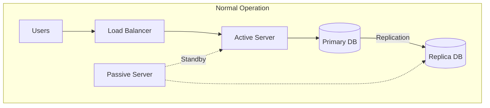
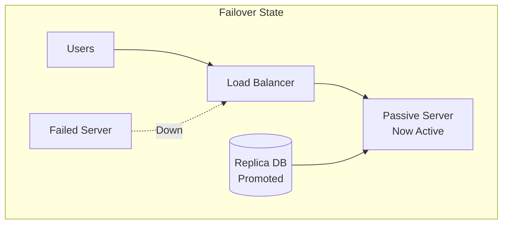
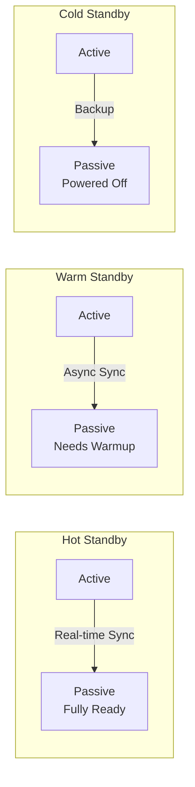
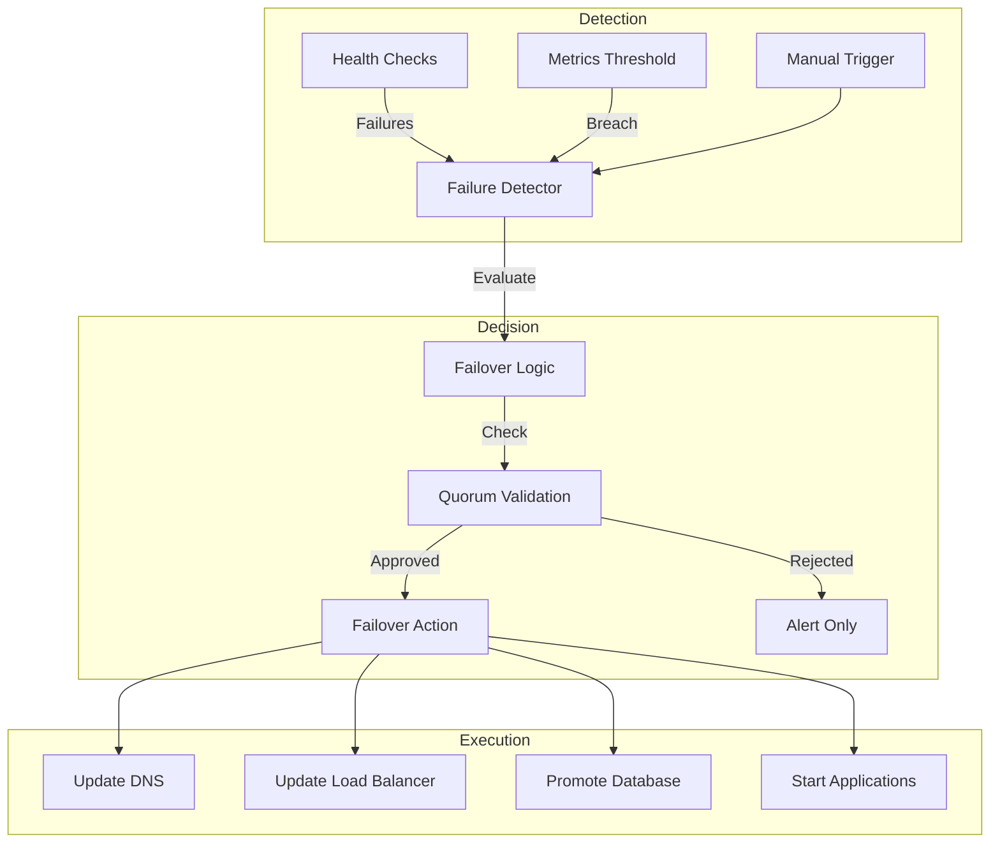
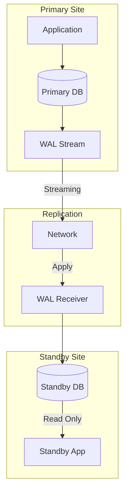
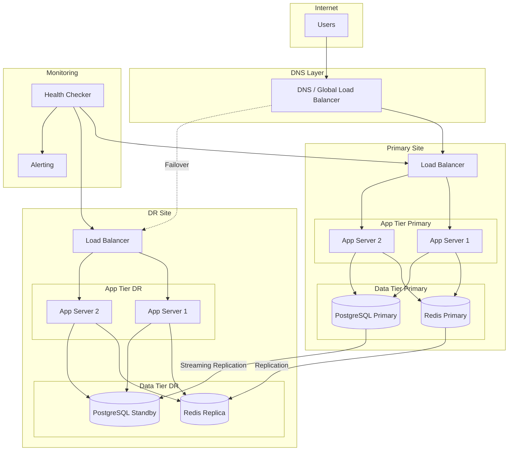

# How to Create Active-Passive Configuration

Author: [nawazdhandala](https://github.com/nawazdhandala)

Tags: High Availability, Architecture, Infrastructure, SRE

Description: Learn how to implement active-passive configurations for failover and disaster recovery.

---

Active-passive configuration is a high availability pattern where one system handles all traffic (active) while another waits on standby (passive). When the active system fails, the passive system takes over. This guide covers standby types, failover mechanisms, and database replication strategies for building robust active-passive architectures.

## Active-Passive Architecture Overview





## Standby Types: Hot, Warm, and Cold

The standby type determines how quickly your passive system can take over. Choose based on your Recovery Time Objective (RTO) and budget.

### Standby Comparison

| Type | State | RTO | Cost | Data Sync | Use Case |
|------|-------|-----|------|-----------|----------|
| Hot | Running, ready | Seconds | High | Real-time | Mission-critical |
| Warm | Running, not serving | Minutes | Medium | Near real-time | Business-critical |
| Cold | Powered off | Hours | Low | Periodic | Non-critical |



### Hot Standby Configuration

Hot standby systems are fully operational and can take over within seconds. They receive real-time data synchronization and maintain an identical state to the active system.

```yaml
# Kubernetes StatefulSet for hot standby application
apiVersion: apps/v1
kind: StatefulSet
metadata:
  name: app-hot-standby
  namespace: production
spec:
  serviceName: app-standby
  replicas: 1
  selector:
    matchLabels:
      app: myapp
      role: standby
  template:
    metadata:
      labels:
        app: myapp
        role: standby
    spec:
      containers:
        - name: app
          image: myapp:latest
          # Hot standby runs the full application
          # but does not receive traffic until promotion
          env:
            - name: MODE
              value: "standby"
            - name: SYNC_INTERVAL
              value: "1s"  # Real-time sync for hot standby
          ports:
            - containerPort: 8080
          # Health check ensures standby is ready
          readinessProbe:
            httpGet:
              path: /healthz
              port: 8080
            initialDelaySeconds: 5
            periodSeconds: 5
          # Resource allocation matches active node
          resources:
            requests:
              cpu: "2"
              memory: "4Gi"
            limits:
              cpu: "4"
              memory: "8Gi"
          volumeMounts:
            - name: data
              mountPath: /data
  volumeClaimTemplates:
    - metadata:
        name: data
      spec:
        accessModes: ["ReadWriteOnce"]
        storageClassName: fast-ssd
        resources:
          requests:
            storage: 100Gi
```

### Warm Standby Configuration

Warm standby systems are running but not fully loaded. They require a brief initialization period before taking traffic.

```yaml
# Kubernetes Deployment for warm standby
apiVersion: apps/v1
kind: Deployment
metadata:
  name: app-warm-standby
  namespace: dr-site
spec:
  replicas: 1
  selector:
    matchLabels:
      app: myapp
      role: warm-standby
  template:
    metadata:
      labels:
        app: myapp
        role: warm-standby
    spec:
      containers:
        - name: app
          image: myapp:latest
          env:
            - name: MODE
              value: "warm-standby"
            # Reduced sync frequency saves resources
            - name: SYNC_INTERVAL
              value: "60s"
            # Pre-warm caches on startup
            - name: PREWARM_CACHES
              value: "true"
          ports:
            - containerPort: 8080
          # Warm standby uses fewer resources until activated
          resources:
            requests:
              cpu: "500m"
              memory: "1Gi"
            limits:
              cpu: "2"
              memory: "4Gi"
          # Startup probe allows time for cache warming
          startupProbe:
            httpGet:
              path: /healthz
              port: 8080
            initialDelaySeconds: 30
            periodSeconds: 10
            failureThreshold: 30
```

### Cold Standby Configuration

Cold standby systems are not running. They require infrastructure provisioning and data restoration before becoming active.

```bash
#!/bin/bash
# cold-standby-activation.sh
# Script to activate cold standby infrastructure

set -euo pipefail

# Configuration
DR_REGION="us-west-2"
BACKUP_BUCKET="s3://myapp-backups"
CLUSTER_NAME="myapp-dr"

echo "Starting cold standby activation..."

# Step 1: Provision infrastructure using Terraform
echo "Provisioning DR infrastructure..."
cd /terraform/dr-environment
terraform init
terraform apply -auto-approve \
  -var="region=${DR_REGION}" \
  -var="cluster_name=${CLUSTER_NAME}"

# Step 2: Wait for cluster to be ready
echo "Waiting for Kubernetes cluster..."
aws eks wait cluster-active --name "${CLUSTER_NAME}" --region "${DR_REGION}"
aws eks update-kubeconfig --name "${CLUSTER_NAME}" --region "${DR_REGION}"

# Step 3: Restore latest backup
echo "Finding latest backup..."
LATEST_BACKUP=$(aws s3 ls "${BACKUP_BUCKET}/daily/" | sort | tail -n 1 | awk '{print $4}')

echo "Restoring from backup: ${LATEST_BACKUP}"
velero restore create "cold-restore-$(date +%s)" \
  --from-backup "${LATEST_BACKUP}" \
  --wait

# Step 4: Start application deployments
echo "Scaling up deployments..."
kubectl scale deployment --all --replicas=3 -n production

# Step 5: Run health checks
echo "Running health checks..."
for i in {1..30}; do
  if kubectl get pods -n production | grep -v Running | grep -v Completed | grep -c .; then
    echo "Waiting for pods to be ready... (attempt $i/30)"
    sleep 10
  else
    echo "All pods running"
    break
  fi
done

# Step 6: Update DNS
echo "Updating DNS to point to DR site..."
# This would integrate with your DNS provider API
# Example with Cloudflare:
# curl -X PATCH "https://api.cloudflare.com/client/v4/zones/${ZONE_ID}/dns_records/${RECORD_ID}" \
#   -H "Authorization: Bearer ${CF_TOKEN}" \
#   -d '{"content":"'${DR_IP}'"}'

echo "Cold standby activation complete"
echo "Total activation time: $SECONDS seconds"
```

## Failover Triggers and Mechanisms

Failover can be triggered manually, automatically, or through a combination of both. Proper trigger configuration prevents false positives while ensuring rapid response to real failures.



### Health Check Configuration

```yaml
# Comprehensive health check configuration
apiVersion: v1
kind: ConfigMap
metadata:
  name: failover-config
  namespace: monitoring
data:
  config.yaml: |
    # Health check settings
    health_checks:
      # Primary endpoint check
      - name: primary-http
        type: http
        endpoint: https://primary.example.com/healthz
        interval: 10s
        timeout: 5s
        # Number of consecutive failures before marking unhealthy
        failure_threshold: 3
        # Number of consecutive successes before marking healthy
        success_threshold: 2

      # Database connectivity check
      - name: primary-database
        type: tcp
        host: primary-db.example.com
        port: 5432
        interval: 5s
        timeout: 3s
        failure_threshold: 3

      # Application-level health check
      - name: primary-deep-health
        type: http
        endpoint: https://primary.example.com/health/deep
        interval: 30s
        timeout: 15s
        failure_threshold: 2
        # Deep health checks dependencies (database, cache, queues)
        expected_response:
          status_code: 200
          body_contains: '"status":"healthy"'

    # Failover triggers
    failover:
      # Automatic failover settings
      auto_failover:
        enabled: true
        # Require all critical checks to fail
        required_failures:
          - primary-http
          - primary-database
        # Minimum time in unhealthy state before failover
        min_unhealthy_duration: 60s
        # Cooldown between failover attempts
        cooldown: 300s

      # Manual failover always available
      manual_failover:
        enabled: true
        # Require confirmation for manual failover
        require_confirmation: true
```

### Automatic Failover Controller

```python
#!/usr/bin/env python3
"""
Automatic failover controller for active-passive configuration.
Monitors health checks and triggers failover when conditions are met.
"""

import time
import logging
from dataclasses import dataclass
from datetime import datetime, timedelta
from enum import Enum
from typing import Dict, List, Optional
import requests

# Configure logging
logging.basicConfig(
    level=logging.INFO,
    format='%(asctime)s - %(levelname)s - %(message)s'
)
logger = logging.getLogger(__name__)


class HealthStatus(Enum):
    """Health status of a monitored endpoint."""
    HEALTHY = "healthy"
    UNHEALTHY = "unhealthy"
    UNKNOWN = "unknown"


@dataclass
class HealthCheck:
    """Configuration for a health check."""
    name: str
    endpoint: str
    interval_seconds: int
    timeout_seconds: int
    failure_threshold: int
    success_threshold: int


@dataclass
class HealthCheckResult:
    """Result of a health check execution."""
    check_name: str
    status: HealthStatus
    response_time_ms: float
    timestamp: datetime
    error_message: Optional[str] = None


class FailoverController:
    """
    Controller that monitors health checks and manages failover.

    The controller continuously monitors the primary system and
    triggers failover to the passive system when failure conditions
    are met.
    """

    def __init__(
        self,
        health_checks: List[HealthCheck],
        min_unhealthy_duration_seconds: int = 60,
        cooldown_seconds: int = 300
    ):
        self.health_checks = health_checks
        self.min_unhealthy_duration = timedelta(seconds=min_unhealthy_duration_seconds)
        self.cooldown = timedelta(seconds=cooldown_seconds)

        # Track consecutive failures for each check
        self.failure_counts: Dict[str, int] = {hc.name: 0 for hc in health_checks}
        self.success_counts: Dict[str, int] = {hc.name: 0 for hc in health_checks}

        # Track when system first became unhealthy
        self.unhealthy_since: Optional[datetime] = None

        # Track last failover time to enforce cooldown
        self.last_failover: Optional[datetime] = None

        # Current system status
        self.current_status = HealthStatus.UNKNOWN

    def execute_health_check(self, check: HealthCheck) -> HealthCheckResult:
        """
        Execute a single health check and return the result.

        Args:
            check: The health check configuration to execute

        Returns:
            HealthCheckResult with status and timing information
        """
        start_time = time.time()

        try:
            # Make HTTP request to health endpoint
            response = requests.get(
                check.endpoint,
                timeout=check.timeout_seconds
            )

            response_time_ms = (time.time() - start_time) * 1000

            # Check if response indicates healthy status
            if response.status_code == 200:
                return HealthCheckResult(
                    check_name=check.name,
                    status=HealthStatus.HEALTHY,
                    response_time_ms=response_time_ms,
                    timestamp=datetime.now()
                )
            else:
                return HealthCheckResult(
                    check_name=check.name,
                    status=HealthStatus.UNHEALTHY,
                    response_time_ms=response_time_ms,
                    timestamp=datetime.now(),
                    error_message=f"HTTP {response.status_code}"
                )

        except requests.Timeout:
            return HealthCheckResult(
                check_name=check.name,
                status=HealthStatus.UNHEALTHY,
                response_time_ms=check.timeout_seconds * 1000,
                timestamp=datetime.now(),
                error_message="Request timeout"
            )
        except requests.RequestException as e:
            return HealthCheckResult(
                check_name=check.name,
                status=HealthStatus.UNHEALTHY,
                response_time_ms=(time.time() - start_time) * 1000,
                timestamp=datetime.now(),
                error_message=str(e)
            )

    def update_status(self, result: HealthCheckResult, check: HealthCheck) -> None:
        """
        Update failure and success counts based on health check result.

        Args:
            result: The result of the health check
            check: The health check configuration
        """
        if result.status == HealthStatus.HEALTHY:
            # Reset failure count, increment success count
            self.failure_counts[check.name] = 0
            self.success_counts[check.name] += 1

            logger.debug(
                f"Health check {check.name} passed "
                f"(consecutive successes: {self.success_counts[check.name]})"
            )
        else:
            # Reset success count, increment failure count
            self.success_counts[check.name] = 0
            self.failure_counts[check.name] += 1

            logger.warning(
                f"Health check {check.name} failed: {result.error_message} "
                f"(consecutive failures: {self.failure_counts[check.name]})"
            )

    def should_trigger_failover(self) -> bool:
        """
        Determine if failover should be triggered based on current state.

        Returns:
            True if failover conditions are met, False otherwise
        """
        # Check cooldown period
        if self.last_failover:
            time_since_failover = datetime.now() - self.last_failover
            if time_since_failover < self.cooldown:
                logger.info(
                    f"Failover blocked by cooldown. "
                    f"Time remaining: {self.cooldown - time_since_failover}"
                )
                return False

        # Check if all health checks have exceeded failure threshold
        all_checks_failed = all(
            self.failure_counts[hc.name] >= hc.failure_threshold
            for hc in self.health_checks
        )

        if not all_checks_failed:
            # Reset unhealthy timestamp if system is partially healthy
            if self.unhealthy_since:
                logger.info("System partially recovered, resetting unhealthy timer")
                self.unhealthy_since = None
            return False

        # Track when system first became unhealthy
        if self.unhealthy_since is None:
            self.unhealthy_since = datetime.now()
            logger.warning("System entered unhealthy state")

        # Check if minimum unhealthy duration has passed
        unhealthy_duration = datetime.now() - self.unhealthy_since
        if unhealthy_duration < self.min_unhealthy_duration:
            logger.info(
                f"Waiting for minimum unhealthy duration. "
                f"Elapsed: {unhealthy_duration}, Required: {self.min_unhealthy_duration}"
            )
            return False

        logger.critical(
            f"Failover conditions met. "
            f"System unhealthy for {unhealthy_duration}"
        )
        return True

    def execute_failover(self) -> bool:
        """
        Execute the failover procedure.

        Returns:
            True if failover succeeded, False otherwise
        """
        logger.critical("Initiating failover to passive system...")

        try:
            # Step 1: Update load balancer
            logger.info("Step 1: Updating load balancer configuration...")
            # self._update_load_balancer()

            # Step 2: Promote database replica
            logger.info("Step 2: Promoting database replica...")
            # self._promote_database()

            # Step 3: Update DNS records
            logger.info("Step 3: Updating DNS records...")
            # self._update_dns()

            # Step 4: Verify passive system health
            logger.info("Step 4: Verifying passive system health...")
            # self._verify_passive_health()

            # Record failover time
            self.last_failover = datetime.now()
            self.unhealthy_since = None

            logger.critical("Failover completed successfully")
            return True

        except Exception as e:
            logger.error(f"Failover failed: {e}")
            return False

    def run(self) -> None:
        """
        Main loop that continuously monitors health and triggers failover.
        """
        logger.info("Starting failover controller...")

        while True:
            for check in self.health_checks:
                # Execute health check
                result = self.execute_health_check(check)

                # Update status tracking
                self.update_status(result, check)

            # Check if failover should be triggered
            if self.should_trigger_failover():
                self.execute_failover()

            # Wait before next check cycle
            time.sleep(min(hc.interval_seconds for hc in self.health_checks))


# Example usage
if __name__ == "__main__":
    # Define health checks for primary system
    checks = [
        HealthCheck(
            name="primary-api",
            endpoint="https://primary.example.com/healthz",
            interval_seconds=10,
            timeout_seconds=5,
            failure_threshold=3,
            success_threshold=2
        ),
        HealthCheck(
            name="primary-database",
            endpoint="https://primary.example.com/health/db",
            interval_seconds=10,
            timeout_seconds=5,
            failure_threshold=3,
            success_threshold=2
        )
    ]

    # Create and run controller
    controller = FailoverController(
        health_checks=checks,
        min_unhealthy_duration_seconds=60,
        cooldown_seconds=300
    )

    controller.run()
```

## Database Replication for Active-Passive

Database replication is the foundation of active-passive high availability. The passive database must have up-to-date data to minimize data loss during failover.



### PostgreSQL Streaming Replication

```sql
-- On Primary Server: Configure replication settings
-- postgresql.conf

-- Enable WAL archiving for point-in-time recovery
wal_level = replica
archive_mode = on
archive_command = 'cp %p /var/lib/postgresql/archive/%f'

-- Allow replication connections
max_wal_senders = 10
wal_keep_size = 1GB

-- Synchronous replication for zero data loss (optional)
-- This adds latency but guarantees no data loss
synchronous_standby_names = 'standby1'
synchronous_commit = on
```

```sql
-- On Primary Server: Create replication user
-- Connect to PostgreSQL and run:

-- Create dedicated replication user with minimal privileges
CREATE USER replicator WITH REPLICATION ENCRYPTED PASSWORD 'secure_password';

-- Grant necessary permissions
GRANT USAGE ON SCHEMA public TO replicator;
```

```bash
# pg_hba.conf on Primary - Allow replication connections
# TYPE  DATABASE        USER            ADDRESS                 METHOD
host    replication     replicator      10.0.0.0/8              scram-sha-256
host    replication     replicator      standby.example.com     scram-sha-256
```

```bash
#!/bin/bash
# setup-standby.sh
# Initialize PostgreSQL standby server from primary

set -euo pipefail

PRIMARY_HOST="primary.example.com"
REPLICATION_USER="replicator"
REPLICATION_PASSWORD="secure_password"
DATA_DIR="/var/lib/postgresql/data"

# Stop PostgreSQL on standby
sudo systemctl stop postgresql

# Remove existing data directory
sudo rm -rf "${DATA_DIR}"/*

# Take base backup from primary
# This copies all data files and starts streaming replication
pg_basebackup \
    --host="${PRIMARY_HOST}" \
    --username="${REPLICATION_USER}" \
    --pgdata="${DATA_DIR}" \
    --wal-method=stream \
    --write-recovery-conf \
    --progress \
    --verbose

# Set correct ownership
sudo chown -R postgres:postgres "${DATA_DIR}"

# The --write-recovery-conf flag creates standby.signal and
# configures primary_conninfo in postgresql.auto.conf

# Start PostgreSQL in standby mode
sudo systemctl start postgresql

# Verify replication status
psql -c "SELECT pg_is_in_recovery();"
# Should return: t (true)
```

### PostgreSQL Standby Configuration

```yaml
# Kubernetes ConfigMap for PostgreSQL standby settings
apiVersion: v1
kind: ConfigMap
metadata:
  name: postgres-standby-config
  namespace: database
data:
  postgresql.conf: |
    # Standby server configuration

    # Hot standby allows read-only queries on standby
    hot_standby = on

    # Feedback to primary about query conflicts
    hot_standby_feedback = on

    # Maximum delay before canceling conflicting queries
    max_standby_streaming_delay = 30s

    # Recovery target settings (for PITR)
    # recovery_target_time = '2024-01-15 10:00:00'
    # recovery_target_action = 'promote'

    # Monitoring and logging
    log_min_messages = info
    log_connections = on
    log_disconnections = on

  primary_conninfo: |
    host=primary-db.example.com
    port=5432
    user=replicator
    password=secure_password
    application_name=standby1
    sslmode=require
```

### Database Failover Procedure

```bash
#!/bin/bash
# database-failover.sh
# Promote PostgreSQL standby to primary during failover

set -euo pipefail

STANDBY_HOST="standby-db.example.com"
STANDBY_USER="postgres"

echo "Starting database failover procedure..."

# Step 1: Verify standby is in recovery mode
echo "Step 1: Verifying standby status..."
IS_STANDBY=$(psql -h "${STANDBY_HOST}" -U "${STANDBY_USER}" -t -c \
    "SELECT pg_is_in_recovery();")

if [[ "${IS_STANDBY}" != *"t"* ]]; then
    echo "ERROR: Target server is not in standby mode"
    exit 1
fi

# Step 2: Check replication lag before promotion
echo "Step 2: Checking replication lag..."
LAG_BYTES=$(psql -h "${STANDBY_HOST}" -U "${STANDBY_USER}" -t -c \
    "SELECT pg_wal_lsn_diff(pg_last_wal_receive_lsn(), pg_last_wal_replay_lsn());")

echo "Current replication lag: ${LAG_BYTES} bytes"

# Warn if lag is significant
if [[ "${LAG_BYTES}" -gt 16777216 ]]; then  # 16MB
    echo "WARNING: Significant replication lag detected"
    echo "Data loss may occur. Continue? (yes/no)"
    read -r CONFIRM
    if [[ "${CONFIRM}" != "yes" ]]; then
        echo "Failover aborted"
        exit 1
    fi
fi

# Step 3: Promote standby to primary
echo "Step 3: Promoting standby to primary..."

# Method 1: Using pg_ctl (if on the server)
# pg_ctl promote -D /var/lib/postgresql/data

# Method 2: Using SQL (PostgreSQL 12+)
psql -h "${STANDBY_HOST}" -U "${STANDBY_USER}" -c "SELECT pg_promote();"

# Step 4: Wait for promotion to complete
echo "Step 4: Waiting for promotion to complete..."
for i in {1..30}; do
    IS_PRIMARY=$(psql -h "${STANDBY_HOST}" -U "${STANDBY_USER}" -t -c \
        "SELECT pg_is_in_recovery();")

    if [[ "${IS_PRIMARY}" == *"f"* ]]; then
        echo "Promotion successful - server is now primary"
        break
    fi

    echo "Waiting for promotion... (attempt ${i}/30)"
    sleep 2
done

# Step 5: Verify write capability
echo "Step 5: Verifying write capability..."
psql -h "${STANDBY_HOST}" -U "${STANDBY_USER}" -c \
    "CREATE TABLE IF NOT EXISTS failover_test (id serial, ts timestamp default now());
     INSERT INTO failover_test DEFAULT VALUES;
     SELECT * FROM failover_test ORDER BY id DESC LIMIT 1;
     DROP TABLE failover_test;"

echo "Database failover completed successfully"
echo "New primary: ${STANDBY_HOST}"

# Step 6: Update application connection strings
echo "Step 6: Reminder - Update application connection strings to point to new primary"
```

### MySQL Replication Setup

```sql
-- On Primary MySQL Server: Enable binary logging
-- my.cnf configuration

-- [mysqld]
-- server-id = 1
-- log_bin = mysql-bin
-- binlog_format = ROW
-- gtid_mode = ON
-- enforce_gtid_consistency = ON
-- log_slave_updates = ON

-- Create replication user
CREATE USER 'replicator'@'%' IDENTIFIED BY 'secure_password';
GRANT REPLICATION SLAVE ON *.* TO 'replicator'@'%';
FLUSH PRIVILEGES;
```

```sql
-- On Standby MySQL Server: Configure as replica
-- my.cnf configuration

-- [mysqld]
-- server-id = 2
-- relay_log = relay-bin
-- read_only = ON
-- gtid_mode = ON
-- enforce_gtid_consistency = ON
-- log_slave_updates = ON

-- Configure replication source
CHANGE REPLICATION SOURCE TO
    SOURCE_HOST='primary.example.com',
    SOURCE_USER='replicator',
    SOURCE_PASSWORD='secure_password',
    SOURCE_AUTO_POSITION=1;

-- Start replication
START REPLICA;

-- Verify replication status
SHOW REPLICA STATUS\G
```

### MySQL Failover Procedure

```bash
#!/bin/bash
# mysql-failover.sh
# Promote MySQL replica to primary

set -euo pipefail

REPLICA_HOST="replica-db.example.com"
MYSQL_USER="admin"
MYSQL_PASS="admin_password"

MYSQL_CMD="mysql -h ${REPLICA_HOST} -u ${MYSQL_USER} -p${MYSQL_PASS}"

echo "Starting MySQL failover..."

# Step 1: Stop replication
echo "Step 1: Stopping replication..."
${MYSQL_CMD} -e "STOP REPLICA;"

# Step 2: Check for replication lag
echo "Step 2: Checking replication status..."
SECONDS_BEHIND=$(${MYSQL_CMD} -N -e \
    "SHOW REPLICA STATUS\G" | grep "Seconds_Behind_Source" | awk '{print $2}')

if [[ "${SECONDS_BEHIND}" != "0" && "${SECONDS_BEHIND}" != "NULL" ]]; then
    echo "WARNING: Replication lag detected: ${SECONDS_BEHIND} seconds"
    echo "Some transactions may be lost. Continue? (yes/no)"
    read -r CONFIRM
    if [[ "${CONFIRM}" != "yes" ]]; then
        echo "Failover aborted"
        exit 1
    fi
fi

# Step 3: Reset replica configuration
echo "Step 3: Resetting replica configuration..."
${MYSQL_CMD} -e "RESET REPLICA ALL;"

# Step 4: Disable read-only mode
echo "Step 4: Enabling writes..."
${MYSQL_CMD} -e "SET GLOBAL read_only = OFF;"
${MYSQL_CMD} -e "SET GLOBAL super_read_only = OFF;"

# Step 5: Verify write capability
echo "Step 5: Verifying write capability..."
${MYSQL_CMD} -e "
    CREATE DATABASE IF NOT EXISTS failover_test;
    USE failover_test;
    CREATE TABLE IF NOT EXISTS test (id INT AUTO_INCREMENT PRIMARY KEY, ts TIMESTAMP DEFAULT CURRENT_TIMESTAMP);
    INSERT INTO test VALUES ();
    SELECT * FROM test;
    DROP DATABASE failover_test;
"

echo "MySQL failover completed successfully"
echo "New primary: ${REPLICA_HOST}"
```

## Load Balancer Configuration

The load balancer directs traffic to the active system and switches to passive during failover.

### HAProxy Active-Passive Configuration

```haproxy
# /etc/haproxy/haproxy.cfg
# HAProxy configuration for active-passive failover

global
    log /dev/log local0
    maxconn 4096
    user haproxy
    group haproxy
    daemon

    # Stats socket for runtime commands
    stats socket /run/haproxy/admin.sock mode 660 level admin

defaults
    log     global
    mode    http
    option  httplog
    option  dontlognull
    timeout connect 5000ms
    timeout client  50000ms
    timeout server  50000ms

    # Enable health check logging
    option log-health-checks

# Frontend - receives all incoming traffic
frontend app_frontend
    bind *:80
    bind *:443 ssl crt /etc/ssl/certs/app.pem

    # Redirect HTTP to HTTPS
    http-request redirect scheme https unless { ssl_fc }

    # Add headers for backend identification
    http-request set-header X-Forwarded-Proto https if { ssl_fc }

    default_backend app_servers

# Backend - active-passive server pool
backend app_servers
    # Use round-robin but with backup server
    balance roundrobin

    # Health check configuration
    option httpchk GET /healthz
    http-check expect status 200

    # Primary server (active)
    # Weight 100 means all traffic goes here when healthy
    server primary 10.0.1.10:8080 check weight 100 inter 5s fall 3 rise 2

    # Secondary server (passive/backup)
    # backup keyword means it only receives traffic when primary is down
    server secondary 10.0.2.10:8080 check backup inter 5s fall 3 rise 2

# Stats page for monitoring
frontend stats
    bind *:8404
    mode http
    stats enable
    stats uri /stats
    stats refresh 10s
    stats admin if LOCALHOST
```

### NGINX Active-Passive Configuration

```nginx
# /etc/nginx/nginx.conf
# NGINX configuration for active-passive failover

upstream app_backend {
    # Primary server
    server 10.0.1.10:8080 weight=100;

    # Backup server - only used when primary is down
    server 10.0.2.10:8080 backup;

    # Health check settings (NGINX Plus or nginx_upstream_check_module)
    # check interval=5000 rise=2 fall=3 timeout=3000 type=http;
    # check_http_send "GET /healthz HTTP/1.0\r\n\r\n";
    # check_http_expect_alive http_2xx http_3xx;
}

server {
    listen 80;
    listen 443 ssl;
    server_name app.example.com;

    ssl_certificate /etc/ssl/certs/app.crt;
    ssl_certificate_key /etc/ssl/private/app.key;

    # Redirect HTTP to HTTPS
    if ($scheme != "https") {
        return 301 https://$server_name$request_uri;
    }

    location / {
        proxy_pass http://app_backend;
        proxy_http_version 1.1;

        # Headers for backend
        proxy_set_header Host $host;
        proxy_set_header X-Real-IP $remote_addr;
        proxy_set_header X-Forwarded-For $proxy_add_x_forwarded_for;
        proxy_set_header X-Forwarded-Proto $scheme;

        # Timeout settings
        proxy_connect_timeout 5s;
        proxy_send_timeout 60s;
        proxy_read_timeout 60s;

        # Retry on failure
        proxy_next_upstream error timeout http_502 http_503 http_504;
        proxy_next_upstream_tries 2;
    }

    # Health check endpoint
    location /nginx-health {
        access_log off;
        return 200 "healthy\n";
        add_header Content-Type text/plain;
    }
}
```

### Kubernetes Service for Active-Passive

```yaml
# Active-passive using Kubernetes Service with manual endpoint management
apiVersion: v1
kind: Service
metadata:
  name: app-service
  namespace: production
spec:
  type: ClusterIP
  ports:
    - port: 80
      targetPort: 8080
  # No selector - we manage endpoints manually for failover control
---
# Endpoints pointing to active server
apiVersion: v1
kind: Endpoints
metadata:
  name: app-service
  namespace: production
subsets:
  - addresses:
      # Primary/active pod IP
      - ip: 10.244.1.10
    ports:
      - port: 8080
---
# ConfigMap to store passive server info for failover
apiVersion: v1
kind: ConfigMap
metadata:
  name: failover-endpoints
  namespace: production
data:
  passive_ip: "10.244.2.10"
  passive_port: "8080"
```

```bash
#!/bin/bash
# kubernetes-failover.sh
# Switch Kubernetes service endpoints from active to passive

set -euo pipefail

NAMESPACE="production"
SERVICE_NAME="app-service"

# Get passive server details
PASSIVE_IP=$(kubectl get configmap failover-endpoints -n "${NAMESPACE}" \
    -o jsonpath='{.data.passive_ip}')
PASSIVE_PORT=$(kubectl get configmap failover-endpoints -n "${NAMESPACE}" \
    -o jsonpath='{.data.passive_port}')

# Get current active IP for rollback
CURRENT_IP=$(kubectl get endpoints "${SERVICE_NAME}" -n "${NAMESPACE}" \
    -o jsonpath='{.subsets[0].addresses[0].ip}')

echo "Current active IP: ${CURRENT_IP}"
echo "Switching to passive IP: ${PASSIVE_IP}"

# Update endpoints to point to passive server
kubectl patch endpoints "${SERVICE_NAME}" -n "${NAMESPACE}" --type='json' \
    -p='[
        {
            "op": "replace",
            "path": "/subsets/0/addresses/0/ip",
            "value": "'"${PASSIVE_IP}"'"
        }
    ]'

# Update configmap with new passive (old active) for future failback
kubectl patch configmap failover-endpoints -n "${NAMESPACE}" --type='json' \
    -p='[
        {
            "op": "replace",
            "path": "/data/passive_ip",
            "value": "'"${CURRENT_IP}"'"
        }
    ]'

echo "Failover complete. Service now pointing to ${PASSIVE_IP}"

# Verify
kubectl get endpoints "${SERVICE_NAME}" -n "${NAMESPACE}" -o wide
```

## Complete Active-Passive Architecture



## Testing Your Active-Passive Setup

Regular testing ensures your failover works when you need it most.

```bash
#!/bin/bash
# failover-drill.sh
# Monthly failover drill script

set -euo pipefail

DRILL_DATE=$(date +%Y-%m-%d)
LOG_FILE="/var/log/failover-drill-${DRILL_DATE}.log"

log() {
    echo "[$(date '+%Y-%m-%d %H:%M:%S')] $1" | tee -a "${LOG_FILE}"
}

log "Starting failover drill..."
START_TIME=$(date +%s)

# Step 1: Verify current state
log "Step 1: Verifying current state"
ACTIVE_SERVER=$(curl -s https://app.example.com/server-id)
log "Current active server: ${ACTIVE_SERVER}"

# Step 2: Verify replication lag
log "Step 2: Checking replication lag"
LAG=$(psql -h standby-db.example.com -U monitor -t -c \
    "SELECT EXTRACT(EPOCH FROM (now() - pg_last_xact_replay_timestamp()))::int;")
log "Database replication lag: ${LAG} seconds"

if [[ "${LAG}" -gt 60 ]]; then
    log "ERROR: Replication lag too high for drill"
    exit 1
fi

# Step 3: Simulate primary failure
log "Step 3: Simulating primary failure"
# Option A: Stop sending traffic (safer)
# kubectl scale deployment app --replicas=0 -n production
# Option B: Actually stop the primary (more realistic)
# ssh primary.example.com "sudo systemctl stop app"

# Step 4: Wait for failover
log "Step 4: Waiting for automatic failover..."
sleep 30

# Step 5: Verify failover occurred
log "Step 5: Verifying failover"
NEW_ACTIVE=$(curl -s https://app.example.com/server-id || echo "UNREACHABLE")

if [[ "${NEW_ACTIVE}" == "${ACTIVE_SERVER}" ]]; then
    log "ERROR: Failover did not occur"
    exit 1
elif [[ "${NEW_ACTIVE}" == "UNREACHABLE" ]]; then
    log "ERROR: Service is unreachable after failover"
    exit 1
else
    log "Failover successful. New active: ${NEW_ACTIVE}"
fi

# Step 6: Run smoke tests
log "Step 6: Running smoke tests"
curl -sf https://app.example.com/healthz || { log "ERROR: Health check failed"; exit 1; }
curl -sf https://app.example.com/api/ping || { log "ERROR: API check failed"; exit 1; }

# Step 7: Restore primary
log "Step 7: Restoring primary"
# kubectl scale deployment app --replicas=3 -n production
# ssh primary.example.com "sudo systemctl start app"

# Step 8: Failback (optional)
log "Step 8: Initiating failback..."
# Run failback procedure here

# Calculate metrics
END_TIME=$(date +%s)
TOTAL_TIME=$((END_TIME - START_TIME))
RTO=$((END_TIME - START_TIME - 60))  # Subtract intentional wait time

log "Drill completed"
log "Total drill time: ${TOTAL_TIME} seconds"
log "Measured RTO: ${RTO} seconds"
log "Drill log saved to: ${LOG_FILE}"
```

## Best Practices

1. **Choose the right standby type** - Match hot, warm, or cold standby to your RTO requirements and budget
2. **Test failover regularly** - Run drills monthly to catch configuration drift
3. **Monitor replication lag** - Alert when lag exceeds acceptable RPO thresholds
4. **Automate where possible** - Manual failover introduces human error and delay
5. **Document procedures** - Runbooks should be clear enough for anyone to execute
6. **Use quorum-based decisions** - Prevent split-brain scenarios with proper consensus
7. **Plan for failback** - Getting back to primary is often harder than failover
8. **Keep configurations in sync** - Use infrastructure as code to prevent drift

---

Active-passive configuration provides a reliable foundation for high availability. While it does not eliminate downtime completely, it significantly reduces recovery time and data loss. Start with the standby type that matches your requirements, implement comprehensive health checks, and test your failover procedures regularly. The investment in proper active-passive architecture pays dividends when incidents occur.
