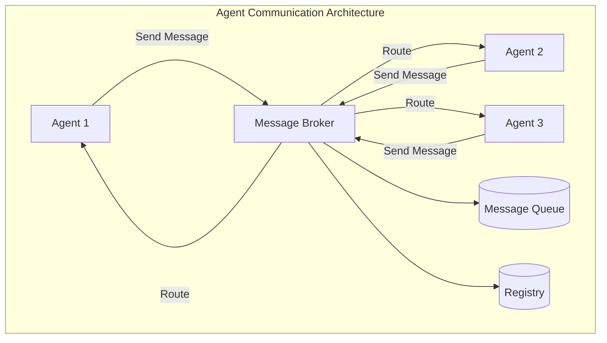
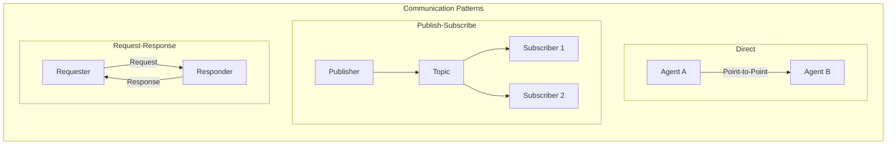
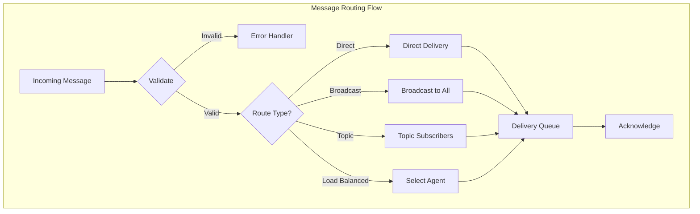
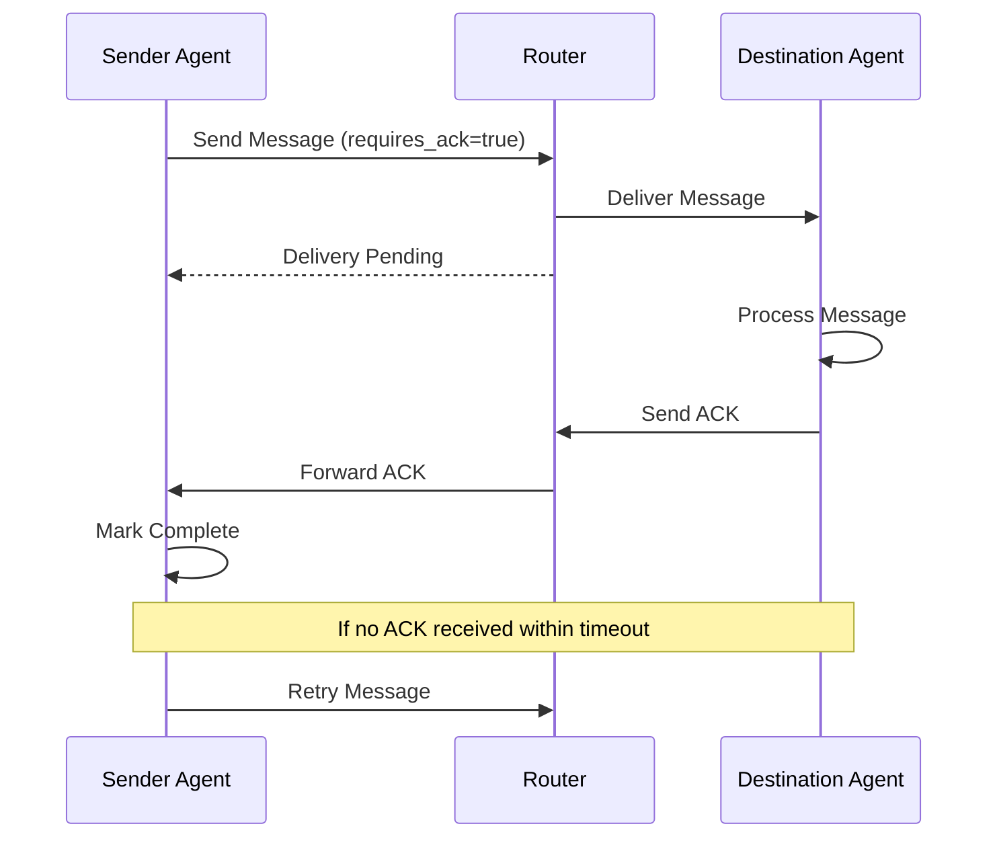
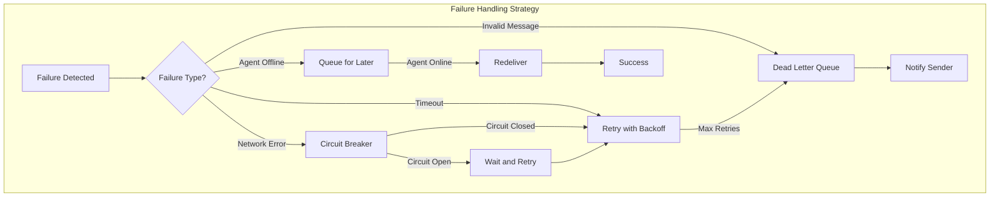

# How to Implement Agent Communication

Author: [nawazdhandala](https://github.com/nawazdhandala)

Tags: AI Agents, Multi-Agent Systems, Message Passing, Coordination

Description: Learn to implement communication protocols for multi-agent systems with message passing, shared memory, and broadcast patterns for collaborative AI.

---

Building effective multi-agent systems requires robust communication mechanisms that allow agents to coordinate, share information, and work together toward common goals. In this guide, we will explore practical approaches to implementing agent communication - from basic message passing to advanced routing and failure handling strategies.

## Understanding Agent Communication Fundamentals

Before diving into implementation details, let us understand the core components of agent communication systems.



Agent communication systems typically consist of:

- **Agents**: Autonomous entities that send and receive messages
- **Message Broker**: Central component that routes messages between agents
- **Message Queue**: Stores messages for asynchronous delivery
- **Registry**: Tracks available agents and their capabilities

## Designing Message Formats

A well-structured message format is the foundation of reliable agent communication. Here is a comprehensive message schema:

```python
from dataclasses import dataclass, field
from typing import Any, Optional
from datetime import datetime
from enum import Enum
import uuid


class MessageType(Enum):
    REQUEST = "request"
    RESPONSE = "response"
    BROADCAST = "broadcast"
    ACKNOWLEDGMENT = "ack"
    ERROR = "error"


class Priority(Enum):
    LOW = 1
    NORMAL = 2
    HIGH = 3
    CRITICAL = 4


@dataclass
class AgentMessage:
    """Standard message format for agent communication."""

    # Core fields
    message_id: str = field(default_factory=lambda: str(uuid.uuid4()))
    message_type: MessageType = MessageType.REQUEST
    sender_id: str = ""
    recipient_id: str = ""  # Empty for broadcast messages

    # Content
    action: str = ""
    payload: dict = field(default_factory=dict)

    # Metadata
    timestamp: datetime = field(default_factory=datetime.utcnow)
    priority: Priority = Priority.NORMAL
    correlation_id: Optional[str] = None  # Links related messages
    reply_to: Optional[str] = None  # For request-response patterns

    # Delivery options
    ttl_seconds: int = 300  # Time to live
    requires_ack: bool = True
    retry_count: int = 0
    max_retries: int = 3

    def to_dict(self) -> dict:
        """Serialize message for transmission."""
        return {
            "message_id": self.message_id,
            "message_type": self.message_type.value,
            "sender_id": self.sender_id,
            "recipient_id": self.recipient_id,
            "action": self.action,
            "payload": self.payload,
            "timestamp": self.timestamp.isoformat(),
            "priority": self.priority.value,
            "correlation_id": self.correlation_id,
            "reply_to": self.reply_to,
            "ttl_seconds": self.ttl_seconds,
            "requires_ack": self.requires_ack,
            "retry_count": self.retry_count,
            "max_retries": self.max_retries
        }

    @classmethod
    def from_dict(cls, data: dict) -> "AgentMessage":
        """Deserialize message from transmission format."""
        return cls(
            message_id=data["message_id"],
            message_type=MessageType(data["message_type"]),
            sender_id=data["sender_id"],
            recipient_id=data["recipient_id"],
            action=data["action"],
            payload=data["payload"],
            timestamp=datetime.fromisoformat(data["timestamp"]),
            priority=Priority(data["priority"]),
            correlation_id=data.get("correlation_id"),
            reply_to=data.get("reply_to"),
            ttl_seconds=data.get("ttl_seconds", 300),
            requires_ack=data.get("requires_ack", True),
            retry_count=data.get("retry_count", 0),
            max_retries=data.get("max_retries", 3)
        )
```

The message format includes several important features:

- **Unique identifiers**: Every message has a UUID for tracking
- **Correlation IDs**: Link related messages in request-response chains
- **Priority levels**: Enable urgent messages to be processed first
- **TTL (Time to Live)**: Prevents stale messages from clogging the system
- **Retry metadata**: Supports automatic retry mechanisms

## Building Communication Channels

Communication channels define how messages flow between agents. Let us implement three common patterns.



### Channel Implementation

```python
from abc import ABC, abstractmethod
from typing import Callable, List, Dict
from collections import defaultdict
import asyncio
import json


class Channel(ABC):
    """Abstract base class for communication channels."""

    @abstractmethod
    async def send(self, message: AgentMessage) -> bool:
        """Send a message through the channel."""
        pass

    @abstractmethod
    async def receive(self) -> AgentMessage:
        """Receive a message from the channel."""
        pass

    @abstractmethod
    async def close(self) -> None:
        """Close the channel and cleanup resources."""
        pass


class DirectChannel(Channel):
    """Point-to-point communication channel."""

    def __init__(self, buffer_size: int = 100):
        self._queue: asyncio.Queue = asyncio.Queue(maxsize=buffer_size)
        self._closed = False

    async def send(self, message: AgentMessage) -> bool:
        if self._closed:
            raise ChannelClosedError("Channel is closed")

        try:
            await asyncio.wait_for(
                self._queue.put(message),
                timeout=5.0
            )
            return True
        except asyncio.TimeoutError:
            return False

    async def receive(self) -> AgentMessage:
        if self._closed and self._queue.empty():
            raise ChannelClosedError("Channel is closed")

        return await self._queue.get()

    async def close(self) -> None:
        self._closed = True


class PubSubChannel(Channel):
    """Publish-subscribe communication channel."""

    def __init__(self):
        self._topics: Dict[str, List[asyncio.Queue]] = defaultdict(list)
        self._subscriber_queues: Dict[str, asyncio.Queue] = {}

    def subscribe(self, subscriber_id: str, topic: str) -> None:
        """Subscribe an agent to a topic."""
        if subscriber_id not in self._subscriber_queues:
            self._subscriber_queues[subscriber_id] = asyncio.Queue()

        self._topics[topic].append(self._subscriber_queues[subscriber_id])

    def unsubscribe(self, subscriber_id: str, topic: str) -> None:
        """Unsubscribe an agent from a topic."""
        if subscriber_id in self._subscriber_queues:
            queue = self._subscriber_queues[subscriber_id]
            if queue in self._topics[topic]:
                self._topics[topic].remove(queue)

    async def publish(self, topic: str, message: AgentMessage) -> int:
        """Publish a message to all subscribers of a topic."""
        subscribers = self._topics.get(topic, [])
        delivered = 0

        for queue in subscribers:
            try:
                await queue.put(message)
                delivered += 1
            except asyncio.QueueFull:
                continue

        return delivered

    async def send(self, message: AgentMessage) -> bool:
        # For pub-sub, use publish() with a topic instead
        raise NotImplementedError("Use publish() for PubSubChannel")

    async def receive(self) -> AgentMessage:
        raise NotImplementedError("Use subscriber-specific queue")

    async def receive_for(self, subscriber_id: str) -> AgentMessage:
        """Receive a message for a specific subscriber."""
        queue = self._subscriber_queues.get(subscriber_id)
        if not queue:
            raise ValueError(f"Unknown subscriber: {subscriber_id}")
        return await queue.get()

    async def close(self) -> None:
        self._topics.clear()
        self._subscriber_queues.clear()


class ChannelClosedError(Exception):
    """Raised when operations are attempted on a closed channel."""
    pass
```

## Implementing Message Routing

The message router is responsible for directing messages to their intended recipients. Here is an implementation that supports multiple routing strategies.



```python
from typing import Dict, Set, Optional, Callable
from collections import defaultdict
import asyncio
import random


class MessageRouter:
    """Routes messages between agents based on various strategies."""

    def __init__(self):
        self._agents: Dict[str, DirectChannel] = {}
        self._agent_capabilities: Dict[str, Set[str]] = defaultdict(set)
        self._topic_subscribers: Dict[str, Set[str]] = defaultdict(set)
        self._pending_acks: Dict[str, asyncio.Future] = {}
        self._message_handlers: Dict[str, Callable] = {}

    def register_agent(
        self,
        agent_id: str,
        channel: DirectChannel,
        capabilities: Optional[Set[str]] = None
    ) -> None:
        """Register an agent with the router."""
        self._agents[agent_id] = channel
        if capabilities:
            self._agent_capabilities[agent_id] = capabilities

    def unregister_agent(self, agent_id: str) -> None:
        """Remove an agent from the router."""
        self._agents.pop(agent_id, None)
        self._agent_capabilities.pop(agent_id, None)

        # Remove from all topic subscriptions
        for subscribers in self._topic_subscribers.values():
            subscribers.discard(agent_id)

    def subscribe_to_topic(self, agent_id: str, topic: str) -> None:
        """Subscribe an agent to a topic."""
        self._topic_subscribers[topic].add(agent_id)

    async def route(self, message: AgentMessage) -> bool:
        """Route a message to its destination(s)."""

        # Validate message
        if not self._validate_message(message):
            return False

        # Determine routing strategy
        if message.message_type == MessageType.BROADCAST:
            return await self._broadcast(message)
        elif message.recipient_id:
            return await self._direct_send(message)
        elif message.action.startswith("topic:"):
            topic = message.action.split(":", 1)[1]
            return await self._topic_send(message, topic)
        else:
            return await self._capability_route(message)

    def _validate_message(self, message: AgentMessage) -> bool:
        """Validate message before routing."""
        if not message.sender_id:
            return False
        if message.ttl_seconds <= 0:
            return False
        return True

    async def _direct_send(self, message: AgentMessage) -> bool:
        """Send message directly to a specific agent."""
        channel = self._agents.get(message.recipient_id)
        if not channel:
            return False

        success = await channel.send(message)

        if success and message.requires_ack:
            await self._wait_for_ack(message)

        return success

    async def _broadcast(self, message: AgentMessage) -> bool:
        """Broadcast message to all registered agents."""
        tasks = []
        for agent_id, channel in self._agents.items():
            if agent_id != message.sender_id:
                tasks.append(channel.send(message))

        results = await asyncio.gather(*tasks, return_exceptions=True)
        return any(r is True for r in results)

    async def _topic_send(self, message: AgentMessage, topic: str) -> bool:
        """Send message to all subscribers of a topic."""
        subscribers = self._topic_subscribers.get(topic, set())
        if not subscribers:
            return False

        tasks = []
        for agent_id in subscribers:
            if agent_id != message.sender_id:
                channel = self._agents.get(agent_id)
                if channel:
                    tasks.append(channel.send(message))

        results = await asyncio.gather(*tasks, return_exceptions=True)
        return any(r is True for r in results)

    async def _capability_route(self, message: AgentMessage) -> bool:
        """Route message to an agent with matching capability."""
        required_capability = message.action

        eligible_agents = [
            agent_id for agent_id, caps in self._agent_capabilities.items()
            if required_capability in caps and agent_id != message.sender_id
        ]

        if not eligible_agents:
            return False

        # Simple load balancing - random selection
        selected_agent = random.choice(eligible_agents)
        message.recipient_id = selected_agent

        return await self._direct_send(message)

    async def _wait_for_ack(
        self,
        message: AgentMessage,
        timeout: float = 30.0
    ) -> bool:
        """Wait for acknowledgment of a message."""
        future = asyncio.get_event_loop().create_future()
        self._pending_acks[message.message_id] = future

        try:
            await asyncio.wait_for(future, timeout=timeout)
            return True
        except asyncio.TimeoutError:
            return False
        finally:
            self._pending_acks.pop(message.message_id, None)

    def acknowledge(self, message_id: str) -> None:
        """Mark a message as acknowledged."""
        future = self._pending_acks.get(message_id)
        if future and not future.done():
            future.set_result(True)
```

## Implementing Acknowledgments

Acknowledgments ensure reliable message delivery. Here is a complete acknowledgment system.



```python
from dataclasses import dataclass
from datetime import datetime, timedelta
from typing import Dict, Optional
import asyncio


@dataclass
class AckTracker:
    """Tracks acknowledgment status for a message."""
    message: AgentMessage
    sent_at: datetime
    ack_received: bool = False
    ack_at: Optional[datetime] = None
    retries: int = 0


class AcknowledgmentManager:
    """Manages message acknowledgments and retries."""

    def __init__(self, router: MessageRouter):
        self._router = router
        self._pending: Dict[str, AckTracker] = {}
        self._ack_timeout = 30.0  # seconds
        self._check_interval = 5.0  # seconds
        self._running = False

    async def start(self) -> None:
        """Start the acknowledgment manager."""
        self._running = True
        asyncio.create_task(self._monitor_pending())

    async def stop(self) -> None:
        """Stop the acknowledgment manager."""
        self._running = False

    async def send_with_ack(self, message: AgentMessage) -> bool:
        """Send a message and track its acknowledgment."""
        message.requires_ack = True

        tracker = AckTracker(
            message=message,
            sent_at=datetime.utcnow()
        )
        self._pending[message.message_id] = tracker

        success = await self._router.route(message)
        if not success:
            self._pending.pop(message.message_id, None)

        return success

    def receive_ack(self, ack_message: AgentMessage) -> None:
        """Process an incoming acknowledgment."""
        original_id = ack_message.correlation_id
        if not original_id:
            return

        tracker = self._pending.get(original_id)
        if tracker:
            tracker.ack_received = True
            tracker.ack_at = datetime.utcnow()
            self._pending.pop(original_id, None)
            self._router.acknowledge(original_id)

    def create_ack(self, original_message: AgentMessage) -> AgentMessage:
        """Create an acknowledgment message."""
        return AgentMessage(
            message_type=MessageType.ACKNOWLEDGMENT,
            sender_id=original_message.recipient_id,
            recipient_id=original_message.sender_id,
            action="ack",
            correlation_id=original_message.message_id,
            requires_ack=False
        )

    async def _monitor_pending(self) -> None:
        """Monitor pending messages and retry if needed."""
        while self._running:
            await asyncio.sleep(self._check_interval)

            now = datetime.utcnow()
            expired = []

            for msg_id, tracker in self._pending.items():
                age = (now - tracker.sent_at).total_seconds()

                if age > self._ack_timeout:
                    if tracker.retries < tracker.message.max_retries:
                        # Retry the message
                        await self._retry_message(tracker)
                    else:
                        # Max retries exceeded
                        expired.append(msg_id)

            # Clean up expired messages
            for msg_id in expired:
                tracker = self._pending.pop(msg_id, None)
                if tracker:
                    await self._handle_delivery_failure(tracker)

    async def _retry_message(self, tracker: AckTracker) -> None:
        """Retry sending a message."""
        tracker.retries += 1
        tracker.message.retry_count = tracker.retries
        tracker.sent_at = datetime.utcnow()

        await self._router.route(tracker.message)

    async def _handle_delivery_failure(self, tracker: AckTracker) -> None:
        """Handle a message that failed to deliver after all retries."""
        error_message = AgentMessage(
            message_type=MessageType.ERROR,
            sender_id="system",
            recipient_id=tracker.message.sender_id,
            action="delivery_failed",
            payload={
                "original_message_id": tracker.message.message_id,
                "reason": "Max retries exceeded",
                "retries": tracker.retries
            },
            correlation_id=tracker.message.message_id,
            requires_ack=False
        )

        await self._router.route(error_message)
```

## Handling Failures

Robust failure handling is essential for production multi-agent systems. Let us implement a comprehensive failure handling strategy.



```python
from enum import Enum
from typing import Callable, Optional, List
from datetime import datetime, timedelta
import asyncio
import logging


class CircuitState(Enum):
    CLOSED = "closed"  # Normal operation
    OPEN = "open"      # Failing, reject requests
    HALF_OPEN = "half_open"  # Testing if service recovered


class CircuitBreaker:
    """Circuit breaker for agent communication."""

    def __init__(
        self,
        failure_threshold: int = 5,
        recovery_timeout: float = 60.0,
        half_open_max_calls: int = 3
    ):
        self._failure_threshold = failure_threshold
        self._recovery_timeout = recovery_timeout
        self._half_open_max_calls = half_open_max_calls

        self._state = CircuitState.CLOSED
        self._failure_count = 0
        self._last_failure_time: Optional[datetime] = None
        self._half_open_calls = 0

    @property
    def state(self) -> CircuitState:
        """Get current circuit state, updating if needed."""
        if self._state == CircuitState.OPEN:
            if self._should_attempt_reset():
                self._state = CircuitState.HALF_OPEN
                self._half_open_calls = 0
        return self._state

    def _should_attempt_reset(self) -> bool:
        """Check if enough time has passed to try resetting."""
        if not self._last_failure_time:
            return True

        elapsed = (datetime.utcnow() - self._last_failure_time).total_seconds()
        return elapsed >= self._recovery_timeout

    async def call(self, func: Callable, *args, **kwargs):
        """Execute a function through the circuit breaker."""
        state = self.state

        if state == CircuitState.OPEN:
            raise CircuitOpenError("Circuit breaker is open")

        try:
            result = await func(*args, **kwargs)
            self._on_success()
            return result
        except Exception as e:
            self._on_failure()
            raise

    def _on_success(self) -> None:
        """Handle successful call."""
        if self._state == CircuitState.HALF_OPEN:
            self._half_open_calls += 1
            if self._half_open_calls >= self._half_open_max_calls:
                self._state = CircuitState.CLOSED
                self._failure_count = 0
        else:
            self._failure_count = 0

    def _on_failure(self) -> None:
        """Handle failed call."""
        self._failure_count += 1
        self._last_failure_time = datetime.utcnow()

        if self._state == CircuitState.HALF_OPEN:
            self._state = CircuitState.OPEN
        elif self._failure_count >= self._failure_threshold:
            self._state = CircuitState.OPEN


class CircuitOpenError(Exception):
    """Raised when circuit breaker is open."""
    pass


class DeadLetterQueue:
    """Stores messages that could not be delivered."""

    def __init__(self, max_size: int = 10000):
        self._queue: List[tuple] = []
        self._max_size = max_size
        self._logger = logging.getLogger(__name__)

    def add(
        self,
        message: AgentMessage,
        reason: str,
        error: Optional[Exception] = None
    ) -> None:
        """Add a failed message to the dead letter queue."""
        if len(self._queue) >= self._max_size:
            # Remove oldest entry
            self._queue.pop(0)

        entry = (
            datetime.utcnow(),
            message,
            reason,
            str(error) if error else None
        )
        self._queue.append(entry)

        self._logger.warning(
            f"Message {message.message_id} added to DLQ: {reason}"
        )

    def get_all(self) -> List[tuple]:
        """Get all messages in the dead letter queue."""
        return list(self._queue)

    def retry_all(self, router: MessageRouter) -> int:
        """Attempt to redeliver all messages in the queue."""
        retried = 0
        remaining = []

        for entry in self._queue:
            timestamp, message, reason, error = entry
            try:
                asyncio.create_task(router.route(message))
                retried += 1
            except Exception:
                remaining.append(entry)

        self._queue = remaining
        return retried


class FailureHandler:
    """Centralized failure handling for agent communication."""

    def __init__(self, router: MessageRouter):
        self._router = router
        self._circuit_breakers: Dict[str, CircuitBreaker] = {}
        self._dlq = DeadLetterQueue()
        self._retry_delays = [1, 2, 4, 8, 16, 32]  # Exponential backoff

    def get_circuit_breaker(self, agent_id: str) -> CircuitBreaker:
        """Get or create circuit breaker for an agent."""
        if agent_id not in self._circuit_breakers:
            self._circuit_breakers[agent_id] = CircuitBreaker()
        return self._circuit_breakers[agent_id]

    async def send_with_retry(
        self,
        message: AgentMessage,
        max_retries: int = 3
    ) -> bool:
        """Send a message with automatic retry and circuit breaker."""
        circuit = self.get_circuit_breaker(message.recipient_id)

        for attempt in range(max_retries + 1):
            try:
                # Check circuit breaker
                if circuit.state == CircuitState.OPEN:
                    raise CircuitOpenError(
                        f"Circuit open for {message.recipient_id}"
                    )

                # Attempt to send
                success = await self._router.route(message)

                if success:
                    circuit._on_success()
                    return True
                else:
                    raise DeliveryError("Router returned failure")

            except CircuitOpenError:
                # Don't retry if circuit is open
                self._dlq.add(message, "Circuit breaker open")
                return False

            except Exception as e:
                circuit._on_failure()

                if attempt < max_retries:
                    # Calculate backoff delay
                    delay = self._retry_delays[
                        min(attempt, len(self._retry_delays) - 1)
                    ]
                    await asyncio.sleep(delay)
                    message.retry_count = attempt + 1
                else:
                    # Max retries exceeded
                    self._dlq.add(message, "Max retries exceeded", e)
                    return False

        return False


class DeliveryError(Exception):
    """Raised when message delivery fails."""
    pass
```

## Putting It All Together

Here is a complete example showing how to use all the components together.

```python
import asyncio


class Agent:
    """Base agent class with communication capabilities."""

    def __init__(
        self,
        agent_id: str,
        router: MessageRouter,
        ack_manager: AcknowledgmentManager,
        failure_handler: FailureHandler
    ):
        self.agent_id = agent_id
        self._router = router
        self._ack_manager = ack_manager
        self._failure_handler = failure_handler
        self._channel = DirectChannel()
        self._running = False

        # Register with router
        router.register_agent(agent_id, self._channel)

    async def start(self) -> None:
        """Start the agent's message processing loop."""
        self._running = True
        asyncio.create_task(self._process_messages())

    async def stop(self) -> None:
        """Stop the agent."""
        self._running = False
        await self._channel.close()

    async def send(
        self,
        recipient_id: str,
        action: str,
        payload: dict,
        require_ack: bool = True
    ) -> bool:
        """Send a message to another agent."""
        message = AgentMessage(
            sender_id=self.agent_id,
            recipient_id=recipient_id,
            action=action,
            payload=payload,
            requires_ack=require_ack
        )

        if require_ack:
            return await self._ack_manager.send_with_ack(message)
        else:
            return await self._failure_handler.send_with_retry(message)

    async def broadcast(self, action: str, payload: dict) -> bool:
        """Broadcast a message to all agents."""
        message = AgentMessage(
            message_type=MessageType.BROADCAST,
            sender_id=self.agent_id,
            action=action,
            payload=payload,
            requires_ack=False
        )

        return await self._router.route(message)

    async def _process_messages(self) -> None:
        """Process incoming messages."""
        while self._running:
            try:
                message = await asyncio.wait_for(
                    self._channel.receive(),
                    timeout=1.0
                )
                await self._handle_message(message)
            except asyncio.TimeoutError:
                continue
            except ChannelClosedError:
                break

    async def _handle_message(self, message: AgentMessage) -> None:
        """Handle an incoming message."""
        # Send acknowledgment if required
        if message.requires_ack:
            ack = self._ack_manager.create_ack(message)
            await self._router.route(ack)

        # Process based on message type
        if message.message_type == MessageType.ACKNOWLEDGMENT:
            self._ack_manager.receive_ack(message)
        elif message.message_type == MessageType.ERROR:
            await self.on_error(message)
        else:
            await self.on_message(message)

    async def on_message(self, message: AgentMessage) -> None:
        """Override this to handle incoming messages."""
        pass

    async def on_error(self, message: AgentMessage) -> None:
        """Override this to handle error messages."""
        pass


# Example usage
async def main():
    # Create infrastructure
    router = MessageRouter()
    ack_manager = AcknowledgmentManager(router)
    failure_handler = FailureHandler(router)

    # Start acknowledgment manager
    await ack_manager.start()

    # Create agents
    class WorkerAgent(Agent):
        async def on_message(self, message: AgentMessage):
            print(f"[{self.agent_id}] Received: {message.action}")
            print(f"  Payload: {message.payload}")

            # Process and respond
            if message.action == "compute":
                result = sum(message.payload.get("numbers", []))
                await self.send(
                    message.sender_id,
                    "result",
                    {"sum": result},
                    require_ack=False
                )

    agent_a = WorkerAgent("agent-a", router, ack_manager, failure_handler)
    agent_b = WorkerAgent("agent-b", router, ack_manager, failure_handler)

    # Start agents
    await agent_a.start()
    await agent_b.start()

    # Send a message
    await agent_a.send(
        "agent-b",
        "compute",
        {"numbers": [1, 2, 3, 4, 5]}
    )

    # Wait for processing
    await asyncio.sleep(2)

    # Broadcast a message
    await agent_a.broadcast("status", {"status": "healthy"})

    # Cleanup
    await agent_a.stop()
    await agent_b.stop()
    await ack_manager.stop()


if __name__ == "__main__":
    asyncio.run(main())
```

## Best Practices

When implementing agent communication, keep these best practices in mind:

1. **Use correlation IDs**: Always include correlation IDs to track request-response chains and debug issues.

2. **Implement timeouts everywhere**: Never wait indefinitely for responses - use timeouts with appropriate values.

3. **Design for failure**: Assume messages can be lost, duplicated, or delayed. Implement idempotency where possible.

4. **Monitor your queues**: Track queue depths and processing times to identify bottlenecks early.

5. **Version your messages**: Include a version field in your message format to handle schema evolution.

6. **Use structured logging**: Log all message events with consistent fields for easier debugging.

7. **Test failure scenarios**: Regularly test circuit breakers, retries, and dead letter queue processing.

## Conclusion

Effective agent communication is the backbone of any multi-agent system. By implementing robust message formats, flexible communication channels, intelligent routing, reliable acknowledgments, and comprehensive failure handling, you can build systems where agents collaborate efficiently and reliably.

The patterns and code examples in this guide provide a solid foundation. As your system grows, you may need to add features like message compression, encryption, or distributed tracing - but the core principles remain the same.

Start simple, measure everything, and iterate based on real-world behavior. Your agents will thank you for it.
