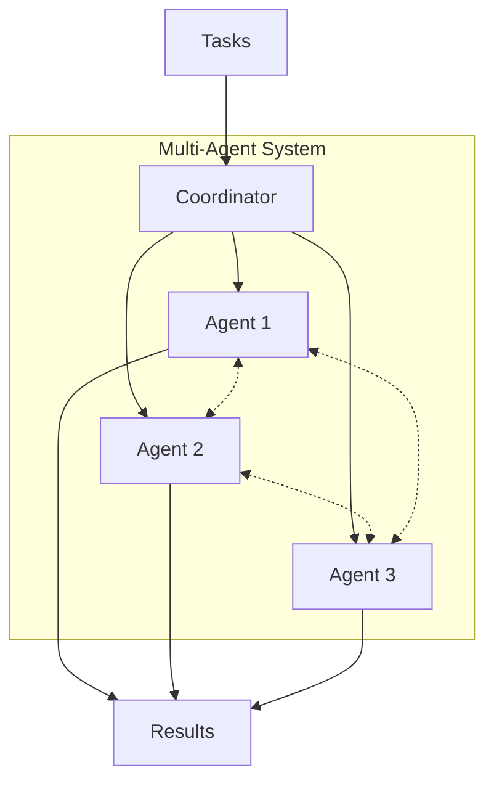
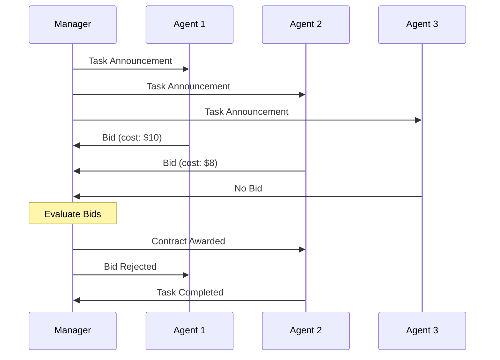
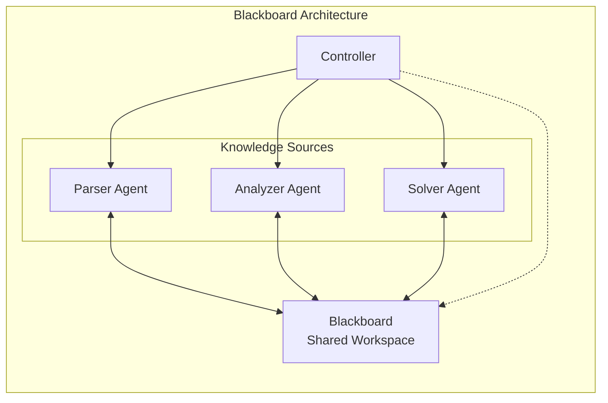
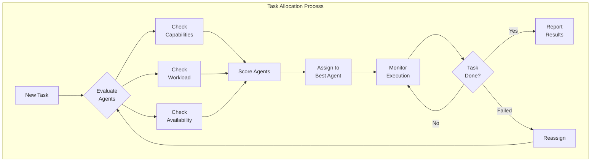
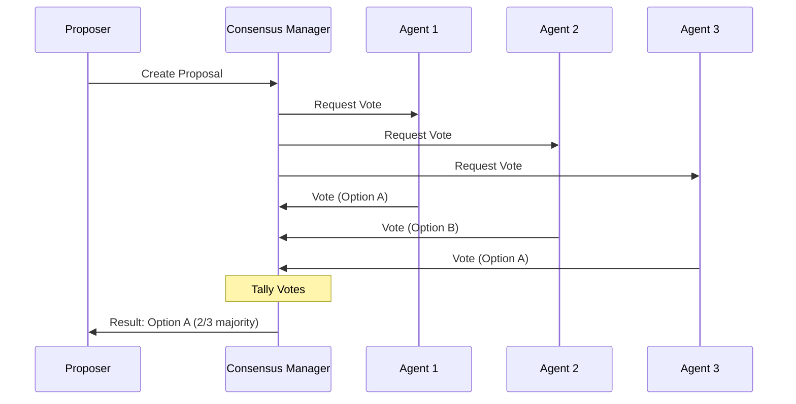
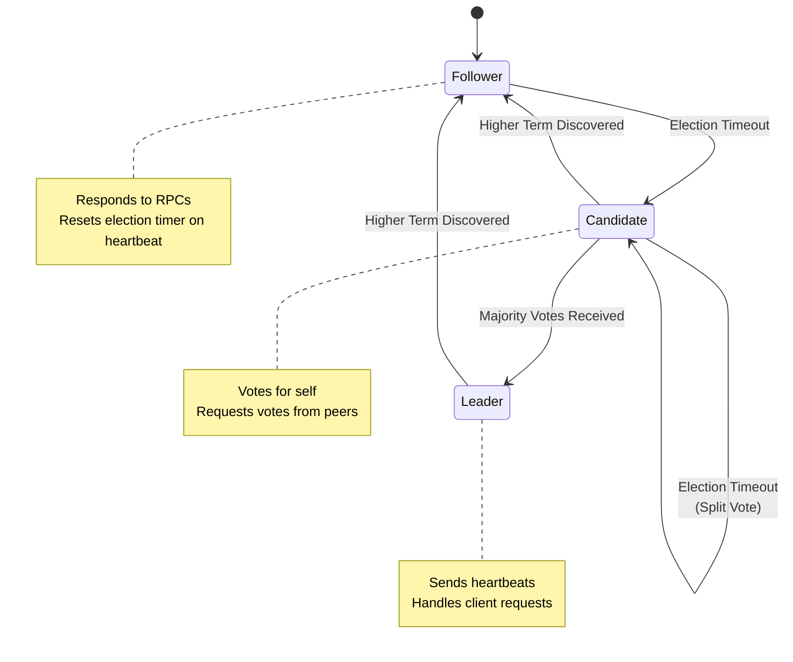
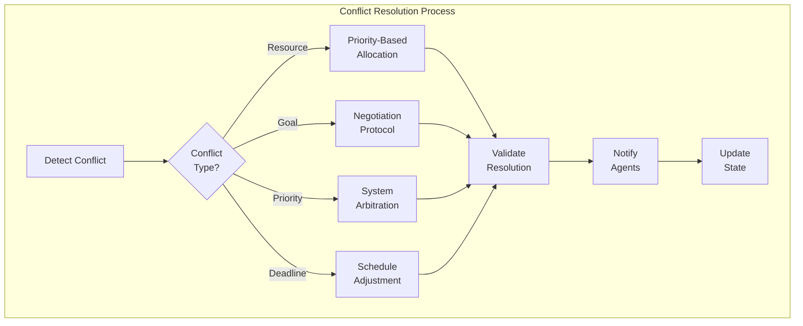
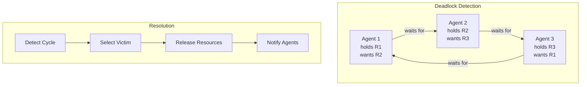
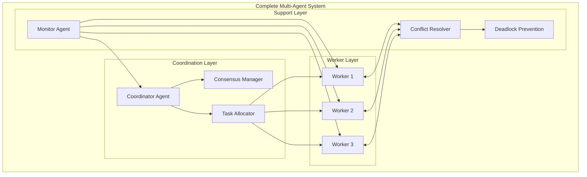

# How to Create Agent Coordination

Author: [nawazdhandala](https://github.com/nawazdhandala)

Tags: AI Agents, Multi-Agent Systems, Coordination, Orchestration

Description: Learn to implement coordination patterns for multi-agent systems with task allocation, consensus building, and conflict resolution for collaborative problem-solving.

---

Multi-agent systems are becoming increasingly important as AI applications grow in complexity. When multiple agents work together, they need robust coordination mechanisms to avoid conflicts, share resources efficiently, and achieve collective goals. This guide explores practical patterns and implementations for agent coordination.

## Understanding Agent Coordination

Agent coordination refers to the mechanisms that enable multiple autonomous agents to work together effectively. Without proper coordination, agents may duplicate work, conflict over resources, or fail to achieve system-wide objectives.



## Core Coordination Protocols

### 1. Contract Net Protocol

The Contract Net Protocol (CNP) is a market-based approach where agents bid on tasks. A manager announces tasks, agents submit bids, and the manager awards contracts to the best bidders.

```python
from dataclasses import dataclass
from typing import List, Optional
from enum import Enum
import asyncio

class TaskStatus(Enum):
    ANNOUNCED = "announced"
    AWARDED = "awarded"
    COMPLETED = "completed"
    FAILED = "failed"

@dataclass
class Task:
    id: str
    description: str
    requirements: dict
    deadline: float
    status: TaskStatus = TaskStatus.ANNOUNCED

@dataclass
class Bid:
    agent_id: str
    task_id: str
    cost: float
    estimated_time: float
    capabilities: List[str]

class ContractNetManager:
    def __init__(self):
        self.tasks: dict[str, Task] = {}
        self.bids: dict[str, List[Bid]] = {}
        self.awards: dict[str, str] = {}

    async def announce_task(self, task: Task, agents: List['Agent']) -> None:
        """Announce a task to all available agents."""
        self.tasks[task.id] = task
        self.bids[task.id] = []

        # Broadcast task announcement to all agents
        announcement_tasks = [
            agent.receive_announcement(task)
            for agent in agents
        ]
        await asyncio.gather(*announcement_tasks)

    async def collect_bids(self, task_id: str, timeout: float = 5.0) -> List[Bid]:
        """Collect bids from agents within a timeout period."""
        await asyncio.sleep(timeout)
        return self.bids.get(task_id, [])

    def evaluate_bids(self, bids: List[Bid], task: Task) -> Optional[Bid]:
        """Select the best bid based on cost and capability match."""
        if not bids:
            return None

        def score_bid(bid: Bid) -> float:
            # Lower cost is better
            cost_score = 1.0 / (bid.cost + 1)
            # Faster completion is better
            time_score = 1.0 / (bid.estimated_time + 1)
            # More matching capabilities is better
            required_caps = set(task.requirements.get('capabilities', []))
            cap_match = len(set(bid.capabilities) & required_caps)
            cap_score = cap_match / max(len(required_caps), 1)

            return (cost_score * 0.3) + (time_score * 0.3) + (cap_score * 0.4)

        return max(bids, key=score_bid)

    async def award_contract(self, task_id: str, winning_bid: Bid) -> None:
        """Award the contract to the winning bidder."""
        self.awards[task_id] = winning_bid.agent_id
        self.tasks[task_id].status = TaskStatus.AWARDED


class Agent:
    def __init__(self, agent_id: str, capabilities: List[str], base_cost: float):
        self.agent_id = agent_id
        self.capabilities = capabilities
        self.base_cost = base_cost
        self.current_tasks: List[str] = []

    async def receive_announcement(self, task: Task) -> Optional[Bid]:
        """Evaluate a task announcement and submit a bid if capable."""
        required_caps = set(task.requirements.get('capabilities', []))
        my_caps = set(self.capabilities)

        # Only bid if we have at least 50% of required capabilities
        if len(my_caps & required_caps) >= len(required_caps) * 0.5:
            workload_factor = 1 + (len(self.current_tasks) * 0.2)
            bid = Bid(
                agent_id=self.agent_id,
                task_id=task.id,
                cost=self.base_cost * workload_factor,
                estimated_time=2.0 * workload_factor,
                capabilities=self.capabilities
            )
            return bid
        return None
```

The Contract Net Protocol flow:



### 2. Blackboard Architecture

The blackboard pattern uses a shared workspace where agents read problems and post partial solutions. A controller manages access and triggers agents based on the blackboard state.

```python
from dataclasses import dataclass, field
from typing import Any, Callable, List, Dict
from datetime import datetime
import threading

@dataclass
class BlackboardEntry:
    key: str
    value: Any
    source_agent: str
    timestamp: datetime = field(default_factory=datetime.now)
    confidence: float = 1.0

class Blackboard:
    def __init__(self):
        self._data: Dict[str, BlackboardEntry] = {}
        self._lock = threading.RLock()
        self._subscribers: Dict[str, List[Callable]] = {}

    def write(self, key: str, value: Any, agent_id: str, confidence: float = 1.0) -> None:
        """Write an entry to the blackboard."""
        with self._lock:
            entry = BlackboardEntry(
                key=key,
                value=value,
                source_agent=agent_id,
                confidence=confidence
            )
            self._data[key] = entry
            self._notify_subscribers(key, entry)

    def read(self, key: str) -> Optional[BlackboardEntry]:
        """Read an entry from the blackboard."""
        with self._lock:
            return self._data.get(key)

    def read_pattern(self, pattern: str) -> List[BlackboardEntry]:
        """Read all entries matching a pattern prefix."""
        with self._lock:
            return [
                entry for key, entry in self._data.items()
                if key.startswith(pattern)
            ]

    def subscribe(self, pattern: str, callback: Callable) -> None:
        """Subscribe to changes matching a pattern."""
        if pattern not in self._subscribers:
            self._subscribers[pattern] = []
        self._subscribers[pattern].append(callback)

    def _notify_subscribers(self, key: str, entry: BlackboardEntry) -> None:
        """Notify subscribers of a change."""
        for pattern, callbacks in self._subscribers.items():
            if key.startswith(pattern):
                for callback in callbacks:
                    callback(key, entry)


class BlackboardAgent:
    def __init__(self, agent_id: str, blackboard: Blackboard):
        self.agent_id = agent_id
        self.blackboard = blackboard
        self.expertise_areas: List[str] = []

    def can_contribute(self, key: str) -> bool:
        """Check if this agent can contribute to a topic."""
        return any(key.startswith(area) for area in self.expertise_areas)

    def contribute(self, key: str, value: Any, confidence: float = 1.0) -> None:
        """Add a contribution to the blackboard."""
        self.blackboard.write(key, value, self.agent_id, confidence)


class BlackboardController:
    def __init__(self, blackboard: Blackboard):
        self.blackboard = blackboard
        self.agents: List[BlackboardAgent] = []
        self.activation_rules: List[Callable] = []

    def register_agent(self, agent: BlackboardAgent) -> None:
        """Register an agent with the controller."""
        self.agents.append(agent)

    def add_activation_rule(self, rule: Callable[[Blackboard], Optional[str]]) -> None:
        """Add a rule that determines which agent should be activated."""
        self.activation_rules.append(rule)

    def run_cycle(self) -> bool:
        """Run one control cycle, activating appropriate agents."""
        for rule in self.activation_rules:
            agent_id = rule(self.blackboard)
            if agent_id:
                agent = next((a for a in self.agents if a.agent_id == agent_id), None)
                if agent:
                    # Agent processes and contributes
                    return True
        return False


# Example usage for a problem-solving system
def create_problem_solving_system():
    blackboard = Blackboard()
    controller = BlackboardController(blackboard)

    # Create specialized agents
    parser_agent = BlackboardAgent("parser", blackboard)
    parser_agent.expertise_areas = ["input", "parsed"]

    analyzer_agent = BlackboardAgent("analyzer", blackboard)
    analyzer_agent.expertise_areas = ["parsed", "analysis"]

    solver_agent = BlackboardAgent("solver", blackboard)
    solver_agent.expertise_areas = ["analysis", "solution"]

    # Register agents
    controller.register_agent(parser_agent)
    controller.register_agent(analyzer_agent)
    controller.register_agent(solver_agent)

    return blackboard, controller
```



## Task Allocation Strategies

### Auction-Based Allocation

In auction-based allocation, tasks are auctioned to agents who bid based on their capabilities and current workload.

```python
from dataclasses import dataclass
from typing import List, Dict, Tuple
from enum import Enum
import heapq

class AuctionType(Enum):
    FIRST_PRICE = "first_price"
    SECOND_PRICE = "second_price"
    COMBINATORIAL = "combinatorial"

@dataclass
class TaskBundle:
    tasks: List[Task]
    combined_value: float

class TaskAuctioneer:
    def __init__(self, auction_type: AuctionType = AuctionType.FIRST_PRICE):
        self.auction_type = auction_type
        self.pending_tasks: List[Task] = []
        self.agent_bids: Dict[str, Dict[str, float]] = {}

    def add_task(self, task: Task) -> None:
        """Add a task to be auctioned."""
        self.pending_tasks.append(task)

    def submit_bid(self, agent_id: str, task_id: str, bid_amount: float) -> None:
        """Submit a bid for a specific task."""
        if agent_id not in self.agent_bids:
            self.agent_bids[agent_id] = {}
        self.agent_bids[agent_id][task_id] = bid_amount

    def run_auction(self) -> Dict[str, str]:
        """Run the auction and return task-to-agent assignments."""
        assignments = {}

        for task in self.pending_tasks:
            task_bids = [
                (agent_id, bids.get(task.id, float('inf')))
                for agent_id, bids in self.agent_bids.items()
            ]

            if not task_bids:
                continue

            # Sort by bid amount (lower is better for cost-based auctions)
            task_bids.sort(key=lambda x: x[1])

            if self.auction_type == AuctionType.FIRST_PRICE:
                winner, _ = task_bids[0]
            elif self.auction_type == AuctionType.SECOND_PRICE:
                winner, _ = task_bids[0]
                # Winner pays second-highest bid

            assignments[task.id] = winner

        return assignments


class WorkloadBalancer:
    def __init__(self, agents: List['WorkerAgent']):
        self.agents = {agent.agent_id: agent for agent in agents}

    def allocate_task(self, task: Task) -> Optional[str]:
        """Allocate a task to the least loaded capable agent."""
        capable_agents = [
            agent for agent in self.agents.values()
            if self._is_capable(agent, task)
        ]

        if not capable_agents:
            return None

        # Select agent with lowest current workload
        selected = min(capable_agents, key=lambda a: a.current_workload)
        selected.assign_task(task)
        return selected.agent_id

    def _is_capable(self, agent: 'WorkerAgent', task: Task) -> bool:
        """Check if an agent can handle a task."""
        required = set(task.requirements.get('capabilities', []))
        available = set(agent.capabilities)
        return required.issubset(available)


class WorkerAgent:
    def __init__(self, agent_id: str, capabilities: List[str], capacity: int = 5):
        self.agent_id = agent_id
        self.capabilities = capabilities
        self.capacity = capacity
        self.assigned_tasks: List[Task] = []

    @property
    def current_workload(self) -> float:
        """Calculate current workload as a fraction of capacity."""
        return len(self.assigned_tasks) / self.capacity

    def assign_task(self, task: Task) -> bool:
        """Assign a task to this agent."""
        if len(self.assigned_tasks) >= self.capacity:
            return False
        self.assigned_tasks.append(task)
        return True

    def complete_task(self, task_id: str) -> Optional[Task]:
        """Mark a task as completed and remove it."""
        for i, task in enumerate(self.assigned_tasks):
            if task.id == task_id:
                return self.assigned_tasks.pop(i)
        return None
```



## Consensus Building

When agents need to agree on a shared decision, consensus protocols ensure all agents reach the same conclusion.

### Voting-Based Consensus

```python
from dataclasses import dataclass
from typing import List, Dict, Optional, Set
from enum import Enum
from collections import Counter

class VotingMethod(Enum):
    MAJORITY = "majority"
    UNANIMOUS = "unanimous"
    WEIGHTED = "weighted"
    RANKED_CHOICE = "ranked_choice"

@dataclass
class Vote:
    agent_id: str
    choice: str
    weight: float = 1.0
    ranking: Optional[List[str]] = None

class ConsensusManager:
    def __init__(self, voting_method: VotingMethod = VotingMethod.MAJORITY):
        self.voting_method = voting_method
        self.proposals: Dict[str, List[str]] = {}  # proposal_id -> options
        self.votes: Dict[str, List[Vote]] = {}     # proposal_id -> votes

    def create_proposal(self, proposal_id: str, options: List[str]) -> None:
        """Create a new proposal with voting options."""
        self.proposals[proposal_id] = options
        self.votes[proposal_id] = []

    def cast_vote(self, proposal_id: str, vote: Vote) -> bool:
        """Cast a vote for a proposal."""
        if proposal_id not in self.proposals:
            return False

        # Check for duplicate votes
        existing_voter_ids = {v.agent_id for v in self.votes[proposal_id]}
        if vote.agent_id in existing_voter_ids:
            return False

        self.votes[proposal_id].append(vote)
        return True

    def resolve(self, proposal_id: str, required_voters: Set[str]) -> Optional[str]:
        """Resolve a proposal and return the winning choice."""
        if proposal_id not in self.proposals:
            return None

        votes = self.votes[proposal_id]
        voter_ids = {v.agent_id for v in votes}

        # Check if all required voters have voted
        if not required_voters.issubset(voter_ids):
            return None

        if self.voting_method == VotingMethod.MAJORITY:
            return self._majority_vote(votes)
        elif self.voting_method == VotingMethod.UNANIMOUS:
            return self._unanimous_vote(votes)
        elif self.voting_method == VotingMethod.WEIGHTED:
            return self._weighted_vote(votes)
        elif self.voting_method == VotingMethod.RANKED_CHOICE:
            return self._ranked_choice_vote(votes, self.proposals[proposal_id])

        return None

    def _majority_vote(self, votes: List[Vote]) -> Optional[str]:
        """Simple majority wins."""
        choices = [v.choice for v in votes]
        if not choices:
            return None
        counter = Counter(choices)
        winner, count = counter.most_common(1)[0]
        if count > len(votes) / 2:
            return winner
        return None

    def _unanimous_vote(self, votes: List[Vote]) -> Optional[str]:
        """All votes must be the same."""
        choices = set(v.choice for v in votes)
        if len(choices) == 1:
            return choices.pop()
        return None

    def _weighted_vote(self, votes: List[Vote]) -> str:
        """Weighted voting based on agent weights."""
        weighted_counts: Dict[str, float] = {}
        for vote in votes:
            weighted_counts[vote.choice] = weighted_counts.get(vote.choice, 0) + vote.weight
        return max(weighted_counts.items(), key=lambda x: x[1])[0]

    def _ranked_choice_vote(self, votes: List[Vote], options: List[str]) -> str:
        """Instant runoff voting with ranked choices."""
        remaining_options = set(options)
        current_votes = votes.copy()

        while len(remaining_options) > 1:
            # Count first-choice votes
            first_choices = Counter()
            for vote in current_votes:
                if vote.ranking:
                    for choice in vote.ranking:
                        if choice in remaining_options:
                            first_choices[choice] += 1
                            break

            # Check for majority
            total = sum(first_choices.values())
            for choice, count in first_choices.items():
                if count > total / 2:
                    return choice

            # Eliminate lowest
            if first_choices:
                lowest = min(first_choices.items(), key=lambda x: x[1])[0]
                remaining_options.remove(lowest)

        return remaining_options.pop() if remaining_options else options[0]


class ConsensusAgent:
    def __init__(self, agent_id: str, weight: float = 1.0):
        self.agent_id = agent_id
        self.weight = weight
        self.preferences: Dict[str, List[str]] = {}

    def evaluate_options(self, proposal_id: str, options: List[str]) -> Vote:
        """Evaluate options and create a vote."""
        # Agents can implement their own evaluation logic
        # This is a simple example that ranks randomly
        import random
        ranked = options.copy()
        random.shuffle(ranked)

        return Vote(
            agent_id=self.agent_id,
            choice=ranked[0],
            weight=self.weight,
            ranking=ranked
        )
```



### Raft-Style Leader Election

For systems requiring a single coordinator, leader election ensures one agent takes charge.

```python
from dataclasses import dataclass
from typing import Dict, Optional, List
from enum import Enum
import asyncio
import random
import time

class NodeState(Enum):
    FOLLOWER = "follower"
    CANDIDATE = "candidate"
    LEADER = "leader"

@dataclass
class LogEntry:
    term: int
    command: str
    data: dict

class RaftNode:
    def __init__(self, node_id: str, peers: List[str]):
        self.node_id = node_id
        self.peers = peers
        self.state = NodeState.FOLLOWER

        # Persistent state
        self.current_term = 0
        self.voted_for: Optional[str] = None
        self.log: List[LogEntry] = []

        # Volatile state
        self.commit_index = 0
        self.last_applied = 0
        self.leader_id: Optional[str] = None

        # Timing
        self.election_timeout = random.uniform(150, 300) / 1000  # 150-300ms
        self.last_heartbeat = time.time()

    async def start_election(self) -> bool:
        """Start a leader election."""
        self.state = NodeState.CANDIDATE
        self.current_term += 1
        self.voted_for = self.node_id
        votes_received = 1  # Vote for self

        # Request votes from all peers
        vote_requests = []
        for peer in self.peers:
            vote_requests.append(self.request_vote(peer))

        results = await asyncio.gather(*vote_requests, return_exceptions=True)

        for result in results:
            if isinstance(result, bool) and result:
                votes_received += 1

        # Check if we won the election
        if votes_received > (len(self.peers) + 1) / 2:
            self.state = NodeState.LEADER
            self.leader_id = self.node_id
            return True

        self.state = NodeState.FOLLOWER
        return False

    async def request_vote(self, peer_id: str) -> bool:
        """Request a vote from a peer."""
        # In a real implementation, this would be a network call
        # Simulating vote response
        await asyncio.sleep(0.01)
        return random.random() > 0.3  # 70% chance of getting vote

    async def send_heartbeat(self) -> None:
        """Send heartbeat to all followers."""
        if self.state != NodeState.LEADER:
            return

        for peer in self.peers:
            # Send append entries (heartbeat) to each peer
            await self.append_entries(peer, [])

    async def append_entries(self, peer_id: str, entries: List[LogEntry]) -> bool:
        """Send append entries RPC to a peer."""
        # In a real implementation, this would be a network call
        await asyncio.sleep(0.01)
        return True

    def receive_heartbeat(self, leader_id: str, term: int) -> bool:
        """Receive a heartbeat from the leader."""
        if term >= self.current_term:
            self.current_term = term
            self.state = NodeState.FOLLOWER
            self.leader_id = leader_id
            self.last_heartbeat = time.time()
            return True
        return False

    def check_election_timeout(self) -> bool:
        """Check if election timeout has elapsed."""
        if self.state == NodeState.LEADER:
            return False
        return (time.time() - self.last_heartbeat) > self.election_timeout


class RaftCluster:
    def __init__(self, node_ids: List[str]):
        self.nodes: Dict[str, RaftNode] = {}
        for node_id in node_ids:
            peers = [nid for nid in node_ids if nid != node_id]
            self.nodes[node_id] = RaftNode(node_id, peers)

    def get_leader(self) -> Optional[str]:
        """Get the current leader."""
        for node_id, node in self.nodes.items():
            if node.state == NodeState.LEADER:
                return node_id
        return None

    async def run_election_cycle(self) -> Optional[str]:
        """Run an election cycle and return the winner."""
        # Find a candidate
        for node_id, node in self.nodes.items():
            if node.check_election_timeout():
                if await node.start_election():
                    # Notify other nodes
                    for other_id, other_node in self.nodes.items():
                        if other_id != node_id:
                            other_node.receive_heartbeat(node_id, node.current_term)
                    return node_id
        return None
```



## Conflict Resolution

Conflicts arise when agents compete for resources or have incompatible goals. Effective conflict resolution maintains system stability.

```python
from dataclasses import dataclass
from typing import List, Dict, Optional, Callable
from enum import Enum
from datetime import datetime

class ConflictType(Enum):
    RESOURCE = "resource"
    GOAL = "goal"
    PRIORITY = "priority"
    DEADLINE = "deadline"

@dataclass
class Conflict:
    conflict_id: str
    conflict_type: ConflictType
    agents_involved: List[str]
    resource_or_goal: str
    timestamp: datetime
    resolved: bool = False
    resolution: Optional[str] = None

class ConflictResolver:
    def __init__(self):
        self.conflicts: Dict[str, Conflict] = {}
        self.resolution_strategies: Dict[ConflictType, Callable] = {
            ConflictType.RESOURCE: self._resolve_resource_conflict,
            ConflictType.GOAL: self._resolve_goal_conflict,
            ConflictType.PRIORITY: self._resolve_priority_conflict,
            ConflictType.DEADLINE: self._resolve_deadline_conflict,
        }
        self.agent_priorities: Dict[str, int] = {}

    def register_conflict(self, conflict: Conflict) -> None:
        """Register a new conflict."""
        self.conflicts[conflict.conflict_id] = conflict

    def resolve(self, conflict_id: str) -> Optional[str]:
        """Resolve a conflict using the appropriate strategy."""
        conflict = self.conflicts.get(conflict_id)
        if not conflict or conflict.resolved:
            return None

        strategy = self.resolution_strategies.get(conflict.conflict_type)
        if strategy:
            resolution = strategy(conflict)
            conflict.resolved = True
            conflict.resolution = resolution
            return resolution

        return None

    def _resolve_resource_conflict(self, conflict: Conflict) -> str:
        """Resolve resource conflicts using priority and waiting time."""
        # Higher priority agents get the resource
        agents = conflict.agents_involved
        priorities = [(a, self.agent_priorities.get(a, 0)) for a in agents]
        winner = max(priorities, key=lambda x: x[1])[0]
        return f"Resource {conflict.resource_or_goal} assigned to {winner}"

    def _resolve_goal_conflict(self, conflict: Conflict) -> str:
        """Resolve goal conflicts through negotiation or hierarchy."""
        # Could implement negotiation protocol here
        return f"Goal conflict resolved through negotiation"

    def _resolve_priority_conflict(self, conflict: Conflict) -> str:
        """Resolve priority conflicts using system-level arbitration."""
        return f"Priority reassigned by system arbiter"

    def _resolve_deadline_conflict(self, conflict: Conflict) -> str:
        """Resolve deadline conflicts by adjusting schedules."""
        return f"Deadlines adjusted to resolve conflict"


class ResourceManager:
    def __init__(self):
        self.resources: Dict[str, 'Resource'] = {}
        self.conflict_resolver = ConflictResolver()
        self.waiting_queues: Dict[str, List[str]] = {}

    def request_resource(self, agent_id: str, resource_id: str) -> bool:
        """Request access to a resource."""
        resource = self.resources.get(resource_id)
        if not resource:
            return False

        if resource.is_available():
            resource.acquire(agent_id)
            return True

        # Add to waiting queue
        if resource_id not in self.waiting_queues:
            self.waiting_queues[resource_id] = []
        self.waiting_queues[resource_id].append(agent_id)

        # Register conflict
        conflict = Conflict(
            conflict_id=f"conflict_{resource_id}_{datetime.now().timestamp()}",
            conflict_type=ConflictType.RESOURCE,
            agents_involved=[resource.held_by, agent_id] if resource.held_by else [agent_id],
            resource_or_goal=resource_id,
            timestamp=datetime.now()
        )
        self.conflict_resolver.register_conflict(conflict)

        return False

    def release_resource(self, agent_id: str, resource_id: str) -> Optional[str]:
        """Release a resource and assign to next in queue."""
        resource = self.resources.get(resource_id)
        if not resource or resource.held_by != agent_id:
            return None

        resource.release()

        # Check waiting queue
        queue = self.waiting_queues.get(resource_id, [])
        if queue:
            next_agent = queue.pop(0)
            resource.acquire(next_agent)
            return next_agent

        return None


@dataclass
class Resource:
    resource_id: str
    resource_type: str
    held_by: Optional[str] = None

    def is_available(self) -> bool:
        return self.held_by is None

    def acquire(self, agent_id: str) -> bool:
        if self.is_available():
            self.held_by = agent_id
            return True
        return False

    def release(self) -> None:
        self.held_by = None
```



## Deadlock Prevention

Deadlocks occur when agents wait indefinitely for resources held by each other. Prevention strategies include resource ordering and timeout mechanisms.

```python
from dataclasses import dataclass
from typing import Dict, List, Set, Optional
from enum import Enum
import asyncio

class LockState(Enum):
    FREE = "free"
    HELD = "held"
    WAITING = "waiting"

@dataclass
class ResourceLock:
    resource_id: str
    order: int  # For ordered locking
    holder: Optional[str] = None
    waiters: List[str] = None

    def __post_init__(self):
        if self.waiters is None:
            self.waiters = []

class DeadlockPrevention:
    def __init__(self):
        self.locks: Dict[str, ResourceLock] = {}
        self.agent_holdings: Dict[str, Set[str]] = {}
        self.wait_for_graph: Dict[str, Set[str]] = {}

    def register_resource(self, resource_id: str, order: int) -> None:
        """Register a resource with its ordering for deadlock prevention."""
        self.locks[resource_id] = ResourceLock(resource_id=resource_id, order=order)

    def can_acquire(self, agent_id: str, resource_id: str) -> bool:
        """Check if acquiring would violate ordering (deadlock prevention)."""
        lock = self.locks.get(resource_id)
        if not lock:
            return False

        # Get all resources currently held by this agent
        held = self.agent_holdings.get(agent_id, set())

        # Check ordering constraint - can only acquire higher-ordered resources
        for held_resource_id in held:
            held_lock = self.locks.get(held_resource_id)
            if held_lock and held_lock.order >= lock.order:
                # Would violate ordering - potential deadlock
                return False

        return True

    async def acquire_with_timeout(
        self,
        agent_id: str,
        resource_id: str,
        timeout: float = 5.0
    ) -> bool:
        """Attempt to acquire a resource with timeout (deadlock avoidance)."""
        lock = self.locks.get(resource_id)
        if not lock:
            return False

        # Check ordering first
        if not self.can_acquire(agent_id, resource_id):
            return False

        start_time = asyncio.get_event_loop().time()

        while True:
            if lock.holder is None:
                # Acquire the lock
                lock.holder = agent_id
                if agent_id not in self.agent_holdings:
                    self.agent_holdings[agent_id] = set()
                self.agent_holdings[agent_id].add(resource_id)

                # Remove from wait-for graph
                if agent_id in self.wait_for_graph:
                    self.wait_for_graph[agent_id].discard(lock.holder)

                return True

            # Check timeout
            elapsed = asyncio.get_event_loop().time() - start_time
            if elapsed >= timeout:
                # Timeout - remove from waiters
                if agent_id in lock.waiters:
                    lock.waiters.remove(agent_id)
                return False

            # Add to waiters and wait-for graph
            if agent_id not in lock.waiters:
                lock.waiters.append(agent_id)

            if agent_id not in self.wait_for_graph:
                self.wait_for_graph[agent_id] = set()
            self.wait_for_graph[agent_id].add(lock.holder)

            await asyncio.sleep(0.1)

    def release(self, agent_id: str, resource_id: str) -> bool:
        """Release a resource."""
        lock = self.locks.get(resource_id)
        if not lock or lock.holder != agent_id:
            return False

        lock.holder = None

        if agent_id in self.agent_holdings:
            self.agent_holdings[agent_id].discard(resource_id)

        return True

    def detect_deadlock(self) -> Optional[List[str]]:
        """Detect deadlock by finding cycles in wait-for graph."""
        visited = set()
        rec_stack = set()
        cycle = []

        def dfs(node: str) -> bool:
            visited.add(node)
            rec_stack.add(node)

            for neighbor in self.wait_for_graph.get(node, set()):
                if neighbor not in visited:
                    if dfs(neighbor):
                        cycle.append(node)
                        return True
                elif neighbor in rec_stack:
                    cycle.append(neighbor)
                    cycle.append(node)
                    return True

            rec_stack.remove(node)
            return False

        for node in self.wait_for_graph:
            if node not in visited:
                if dfs(node):
                    return cycle

        return None

    def resolve_deadlock(self, cycle: List[str]) -> str:
        """Resolve deadlock by aborting one agent's request."""
        # Choose victim - typically the one with least work done
        victim = cycle[0]  # Simple strategy: first in cycle

        # Release all resources held by victim
        held = self.agent_holdings.get(victim, set()).copy()
        for resource_id in held:
            self.release(victim, resource_id)

        # Remove from all wait queues
        for lock in self.locks.values():
            if victim in lock.waiters:
                lock.waiters.remove(victim)

        # Clear wait-for graph entry
        if victim in self.wait_for_graph:
            del self.wait_for_graph[victim]

        return victim


class OrderedLockManager:
    """Ensures locks are always acquired in a consistent order."""

    def __init__(self):
        self.resource_order: Dict[str, int] = {}
        self.locks: Dict[str, asyncio.Lock] = {}

    def register_resources(self, resources: List[str]) -> None:
        """Register resources with automatic ordering."""
        for i, resource in enumerate(sorted(resources)):
            self.resource_order[resource] = i
            self.locks[resource] = asyncio.Lock()

    async def acquire_multiple(self, agent_id: str, resources: List[str]) -> bool:
        """Acquire multiple resources in order to prevent deadlock."""
        # Sort by order to ensure consistent acquisition
        sorted_resources = sorted(resources, key=lambda r: self.resource_order.get(r, 0))

        acquired = []
        try:
            for resource in sorted_resources:
                lock = self.locks.get(resource)
                if lock:
                    await lock.acquire()
                    acquired.append(resource)
            return True
        except Exception:
            # Release all acquired locks on failure
            for resource in acquired:
                lock = self.locks.get(resource)
                if lock and lock.locked():
                    lock.release()
            return False

    def release_multiple(self, resources: List[str]) -> None:
        """Release multiple resources."""
        for resource in resources:
            lock = self.locks.get(resource)
            if lock and lock.locked():
                lock.release()
```



## Putting It All Together

Here is a complete example of a coordinated multi-agent system:

```python
import asyncio
from dataclasses import dataclass
from typing import List, Dict, Optional
from enum import Enum

class AgentRole(Enum):
    COORDINATOR = "coordinator"
    WORKER = "worker"
    MONITOR = "monitor"

@dataclass
class AgentConfig:
    agent_id: str
    role: AgentRole
    capabilities: List[str]
    priority: int = 0

class CoordinatedAgent:
    def __init__(self, config: AgentConfig):
        self.config = config
        self.message_queue: asyncio.Queue = asyncio.Queue()
        self.running = False

    async def start(self) -> None:
        """Start the agent's main loop."""
        self.running = True
        while self.running:
            try:
                message = await asyncio.wait_for(
                    self.message_queue.get(),
                    timeout=1.0
                )
                await self.handle_message(message)
            except asyncio.TimeoutError:
                await self.idle_behavior()

    async def handle_message(self, message: dict) -> None:
        """Handle an incoming message."""
        msg_type = message.get('type')
        if msg_type == 'task_assignment':
            await self.execute_task(message.get('task'))
        elif msg_type == 'vote_request':
            await self.cast_vote(message.get('proposal'))
        elif msg_type == 'status_request':
            await self.report_status(message.get('requester'))

    async def execute_task(self, task: dict) -> None:
        """Execute an assigned task."""
        # Task execution logic
        pass

    async def cast_vote(self, proposal: dict) -> None:
        """Cast a vote for a proposal."""
        # Voting logic
        pass

    async def report_status(self, requester: str) -> None:
        """Report current status."""
        # Status reporting logic
        pass

    async def idle_behavior(self) -> None:
        """Behavior when no messages are pending."""
        pass

    def stop(self) -> None:
        """Stop the agent."""
        self.running = False


class MultiAgentSystem:
    def __init__(self):
        self.agents: Dict[str, CoordinatedAgent] = {}
        self.coordinator: Optional[CoordinatedAgent] = None
        self.task_allocator: WorkloadBalancer = None
        self.consensus_manager: ConsensusManager = ConsensusManager()
        self.conflict_resolver: ConflictResolver = ConflictResolver()
        self.deadlock_prevention: DeadlockPrevention = DeadlockPrevention()

    def add_agent(self, config: AgentConfig) -> CoordinatedAgent:
        """Add an agent to the system."""
        agent = CoordinatedAgent(config)
        self.agents[config.agent_id] = agent

        if config.role == AgentRole.COORDINATOR:
            self.coordinator = agent

        self.conflict_resolver.agent_priorities[config.agent_id] = config.priority

        return agent

    async def broadcast(self, message: dict, exclude: List[str] = None) -> None:
        """Broadcast a message to all agents."""
        exclude = exclude or []
        for agent_id, agent in self.agents.items():
            if agent_id not in exclude:
                await agent.message_queue.put(message)

    async def send_to(self, agent_id: str, message: dict) -> bool:
        """Send a message to a specific agent."""
        agent = self.agents.get(agent_id)
        if agent:
            await agent.message_queue.put(message)
            return True
        return False

    async def allocate_task(self, task: Task) -> Optional[str]:
        """Allocate a task to an appropriate agent."""
        if self.task_allocator:
            return self.task_allocator.allocate_task(task)

        # Fallback: send to coordinator
        if self.coordinator:
            await self.coordinator.message_queue.put({
                'type': 'task_assignment',
                'task': task
            })
            return self.coordinator.config.agent_id

        return None

    async def request_consensus(
        self,
        proposal_id: str,
        options: List[str]
    ) -> Optional[str]:
        """Request consensus from all agents on a proposal."""
        self.consensus_manager.create_proposal(proposal_id, options)

        # Request votes from all agents
        await self.broadcast({
            'type': 'vote_request',
            'proposal': {'id': proposal_id, 'options': options}
        })

        # Wait for votes (with timeout)
        await asyncio.sleep(5.0)

        required_voters = set(self.agents.keys())
        return self.consensus_manager.resolve(proposal_id, required_voters)

    async def run(self) -> None:
        """Run all agents concurrently."""
        tasks = [agent.start() for agent in self.agents.values()]
        await asyncio.gather(*tasks)

    def shutdown(self) -> None:
        """Shutdown all agents."""
        for agent in self.agents.values():
            agent.stop()


# Example usage
async def main():
    # Create the multi-agent system
    system = MultiAgentSystem()

    # Add a coordinator
    system.add_agent(AgentConfig(
        agent_id="coordinator",
        role=AgentRole.COORDINATOR,
        capabilities=["coordination", "planning"],
        priority=10
    ))

    # Add worker agents
    for i in range(3):
        system.add_agent(AgentConfig(
            agent_id=f"worker_{i}",
            role=AgentRole.WORKER,
            capabilities=["processing", "analysis"],
            priority=5
        ))

    # Add a monitor
    system.add_agent(AgentConfig(
        agent_id="monitor",
        role=AgentRole.MONITOR,
        capabilities=["monitoring", "alerting"],
        priority=7
    ))

    # Start the system
    print("Starting multi-agent system...")

    # In practice, you would run the system with:
    # await system.run()

    print("System initialized with", len(system.agents), "agents")

if __name__ == "__main__":
    asyncio.run(main())
```



## Key Takeaways

1. **Choose the right coordination protocol**: Contract Net works well for task allocation, while blackboard systems excel at collaborative problem-solving.

2. **Implement robust consensus mechanisms**: Voting protocols ensure agents can make collective decisions without deadlock.

3. **Plan for conflicts**: Resource conflicts are inevitable - implement priority-based resolution and negotiation protocols.

4. **Prevent deadlocks proactively**: Use resource ordering and timeout mechanisms rather than relying on detection and recovery.

5. **Monitor and adapt**: Include monitoring agents that can detect coordination failures and trigger recovery procedures.

## Conclusion

Effective agent coordination is essential for building reliable multi-agent systems. By implementing the patterns discussed - contract nets, blackboard systems, consensus protocols, and deadlock prevention - you can create systems where multiple agents collaborate efficiently toward shared goals.

The key is to match coordination mechanisms to your specific requirements. Simple task distribution may only need basic load balancing, while complex collaborative problem-solving might require sophisticated blackboard architectures with multiple knowledge sources.

Start with simple coordination patterns and add complexity only as needed. Always include monitoring and recovery mechanisms to handle the inevitable coordination failures in distributed systems.
