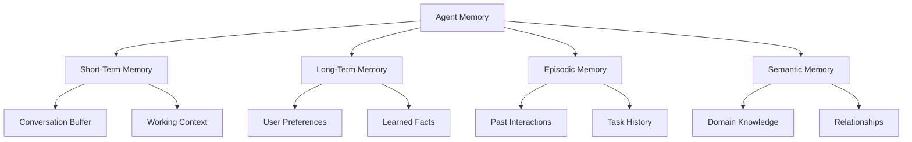
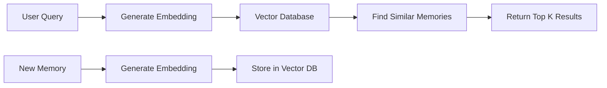
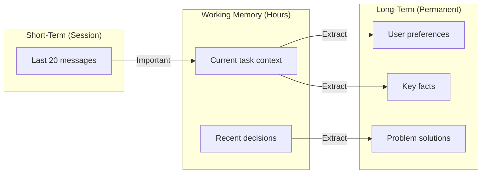

# How to Create Agent Memory

Author: [nawazdhandala](https://github.com/nawazdhandala)

Tags: AI Agents, LLM, Memory, AI

Description: Learn how to build effective memory systems for AI agents that enable context retention, long-term learning, and personalized interactions across conversations.

---

AI agents are transforming how we interact with software. But without memory, agents are like meeting someone who forgets you exist after every conversation. They cannot learn from past interactions, recall user preferences, or build upon previous work. Memory turns a stateless chatbot into an intelligent assistant that grows more useful over time.

This guide covers practical approaches to implementing memory in AI agents, from simple conversation buffers to sophisticated semantic retrieval systems.

## Why Agents Need Memory

Consider an AI coding assistant. Without memory, every session starts from zero:

- "What programming language do you prefer?" (asked for the hundredth time)
- "Can you explain your project structure again?"
- "What was that bug we fixed yesterday?"

With memory, the agent knows your tech stack, remembers past debugging sessions, and can reference previous solutions. It becomes a collaborator, not just a tool.

## Types of Agent Memory



| Memory Type | Purpose | Retention | Example |
|-------------|---------|-----------|---------|
| Short-Term | Current conversation context | Session | Recent messages in chat |
| Long-Term | Persistent facts and preferences | Permanent | User prefers TypeScript |
| Episodic | Specific past events | Selective | "Last week we debugged the auth issue" |
| Semantic | General knowledge and relationships | Permanent | "React is a frontend framework" |

## Building a Simple Memory System

Let us start with a basic implementation that handles conversation history and stores important facts. This foundation can be extended with more sophisticated retrieval later.

### Memory Store Architecture

The memory system has three core components: a conversation buffer for recent context, a facts store for extracted knowledge, and a retrieval mechanism to find relevant memories.

```python
from dataclasses import dataclass, field
from datetime import datetime
from typing import Optional
import json
import hashlib


@dataclass
class Memory:
    """Single memory unit that can be stored and retrieved."""
    content: str
    memory_type: str  # "conversation", "fact", "episode"
    timestamp: datetime = field(default_factory=datetime.now)
    importance: float = 0.5  # 0-1 scale for prioritization
    metadata: dict = field(default_factory=dict)

    @property
    def id(self) -> str:
        """Generate unique ID based on content hash."""
        return hashlib.sha256(
            f"{self.content}{self.timestamp.isoformat()}".encode()
        ).hexdigest()[:16]

    def to_dict(self) -> dict:
        """Serialize memory for storage."""
        return {
            "id": self.id,
            "content": self.content,
            "memory_type": self.memory_type,
            "timestamp": self.timestamp.isoformat(),
            "importance": self.importance,
            "metadata": self.metadata,
        }


class MemoryStore:
    """
    Core memory storage with retrieval capabilities.
    Handles both short-term conversation buffer and long-term storage.
    """

    def __init__(self, max_short_term: int = 20):
        # Short-term: recent conversation turns
        self.short_term: list[Memory] = []
        self.max_short_term = max_short_term

        # Long-term: persisted facts and episodes
        self.long_term: dict[str, Memory] = {}

    def add_conversation(self, role: str, content: str) -> Memory:
        """
        Add a conversation turn to short-term memory.
        Automatically manages buffer size using sliding window.
        """
        memory = Memory(
            content=f"{role}: {content}",
            memory_type="conversation",
            metadata={"role": role},
        )

        self.short_term.append(memory)

        # Sliding window: remove oldest when buffer is full
        if len(self.short_term) > self.max_short_term:
            # Before removing, check if old memory should be promoted to long-term
            old_memory = self.short_term.pop(0)
            if old_memory.importance > 0.7:
                self.promote_to_long_term(old_memory)

        return memory

    def add_fact(self, content: str, importance: float = 0.5) -> Memory:
        """
        Store an extracted fact in long-term memory.
        Facts persist across sessions and can be retrieved by relevance.
        """
        memory = Memory(
            content=content,
            memory_type="fact",
            importance=importance,
        )
        self.long_term[memory.id] = memory
        return memory

    def add_episode(self, content: str, metadata: dict = None) -> Memory:
        """
        Store a specific event or interaction as an episode.
        Episodes capture what happened, when, and relevant context.
        """
        memory = Memory(
            content=content,
            memory_type="episode",
            importance=0.6,
            metadata=metadata or {},
        )
        self.long_term[memory.id] = memory
        return memory

    def promote_to_long_term(self, memory: Memory) -> None:
        """Move important short-term memories to long-term storage."""
        memory.memory_type = "promoted"
        self.long_term[memory.id] = memory

    def get_conversation_context(self, n_recent: int = 10) -> list[Memory]:
        """Get recent conversation turns for context window."""
        return self.short_term[-n_recent:]

    def search_long_term(
        self,
        query: str,
        memory_type: Optional[str] = None,
        limit: int = 5
    ) -> list[Memory]:
        """
        Search long-term memory using simple keyword matching.
        For production, replace with vector similarity search.
        """
        results = []
        query_lower = query.lower()

        for memory in self.long_term.values():
            # Filter by type if specified
            if memory_type and memory.memory_type != memory_type:
                continue

            # Simple relevance: keyword presence
            if query_lower in memory.content.lower():
                results.append(memory)

        # Sort by importance, then recency
        results.sort(
            key=lambda m: (m.importance, m.timestamp),
            reverse=True
        )

        return results[:limit]

    def save(self, filepath: str) -> None:
        """Persist memory store to disk."""
        data = {
            "short_term": [m.to_dict() for m in self.short_term],
            "long_term": {k: v.to_dict() for k, v in self.long_term.items()},
        }
        with open(filepath, "w") as f:
            json.dump(data, f, indent=2)

    def load(self, filepath: str) -> None:
        """Load memory store from disk."""
        with open(filepath, "r") as f:
            data = json.load(f)

        # Reconstruct Memory objects from serialized data
        self.short_term = [
            Memory(
                content=m["content"],
                memory_type=m["memory_type"],
                timestamp=datetime.fromisoformat(m["timestamp"]),
                importance=m["importance"],
                metadata=m["metadata"],
            )
            for m in data["short_term"]
        ]

        for key, m in data["long_term"].items():
            self.long_term[key] = Memory(
                content=m["content"],
                memory_type=m["memory_type"],
                timestamp=datetime.fromisoformat(m["timestamp"]),
                importance=m["importance"],
                metadata=m["metadata"],
            )
```

## Adding Semantic Search with Embeddings

Keyword matching is limited. For real-world agents, you need semantic search that understands meaning. Vector embeddings convert text into numerical representations where similar concepts are close together in vector space.



### Vector Memory Store

This implementation uses embeddings for semantic retrieval. You can swap in any embedding provider like OpenAI, Cohere, or local models.

```python
import numpy as np
from typing import Callable


class VectorMemoryStore:
    """
    Memory store with vector similarity search.
    Uses embeddings to find semantically similar memories.
    """

    def __init__(
        self,
        embed_fn: Callable[[str], list[float]],
        similarity_threshold: float = 0.7
    ):
        """
        Initialize with an embedding function.

        Args:
            embed_fn: Function that converts text to embedding vector
            similarity_threshold: Minimum similarity score to return results
        """
        self.embed_fn = embed_fn
        self.similarity_threshold = similarity_threshold

        self.memories: list[Memory] = []
        self.embeddings: list[np.ndarray] = []

    def add(self, memory: Memory) -> None:
        """Add memory with its embedding vector."""
        embedding = self.embed_fn(memory.content)
        self.memories.append(memory)
        self.embeddings.append(np.array(embedding))

    def search(self, query: str, limit: int = 5) -> list[tuple[Memory, float]]:
        """
        Find memories semantically similar to query.
        Returns list of (memory, similarity_score) tuples.
        """
        if not self.memories:
            return []

        # Generate query embedding
        query_embedding = np.array(self.embed_fn(query))

        # Calculate cosine similarity with all memories
        similarities = []
        for i, mem_embedding in enumerate(self.embeddings):
            similarity = self._cosine_similarity(query_embedding, mem_embedding)
            if similarity >= self.similarity_threshold:
                similarities.append((self.memories[i], similarity))

        # Sort by similarity descending
        similarities.sort(key=lambda x: x[1], reverse=True)

        return similarities[:limit]

    def _cosine_similarity(self, a: np.ndarray, b: np.ndarray) -> float:
        """Calculate cosine similarity between two vectors."""
        dot_product = np.dot(a, b)
        norm_a = np.linalg.norm(a)
        norm_b = np.linalg.norm(b)

        if norm_a == 0 or norm_b == 0:
            return 0.0

        return dot_product / (norm_a * norm_b)


# Example: Using OpenAI embeddings
def create_openai_embed_fn(api_key: str) -> Callable[[str], list[float]]:
    """Create embedding function using OpenAI API."""
    from openai import OpenAI
    client = OpenAI(api_key=api_key)

    def embed(text: str) -> list[float]:
        response = client.embeddings.create(
            model="text-embedding-3-small",
            input=text
        )
        return response.data[0].embedding

    return embed


# Usage example
# embed_fn = create_openai_embed_fn("your-api-key")
# vector_store = VectorMemoryStore(embed_fn)
# vector_store.add(Memory(content="User prefers Python", memory_type="fact"))
# results = vector_store.search("What programming language does the user like?")
```

## Implementing Memory Extraction

Raw conversations are verbose. Extract key facts and insights to store efficiently. This reduces storage and improves retrieval quality.

```python
from openai import OpenAI


class MemoryExtractor:
    """
    Extract structured memories from conversations.
    Uses LLM to identify facts, preferences, and important events.
    """

    EXTRACTION_PROMPT = """Analyze this conversation and extract important information to remember.

Conversation:
{conversation}

Extract the following (if present):
1. User preferences (language, tools, style)
2. Facts about the user or their project
3. Important decisions made
4. Tasks completed or in progress
5. Problems encountered and solutions found

Format as JSON:
{{
    "preferences": ["preference1", "preference2"],
    "facts": ["fact1", "fact2"],
    "decisions": ["decision1"],
    "tasks": ["task1"],
    "problems_solutions": [{{"problem": "...", "solution": "..."}}]
}}

Only include categories with actual content. Be concise."""

    def __init__(self, client: OpenAI):
        self.client = client

    def extract(self, conversation: list[dict]) -> dict:
        """
        Extract memories from conversation history.

        Args:
            conversation: List of {"role": "user/assistant", "content": "..."}

        Returns:
            Extracted memories categorized by type
        """
        # Format conversation for prompt
        conv_text = "\n".join(
            f"{msg['role'].upper()}: {msg['content']}"
            for msg in conversation
        )

        response = self.client.chat.completions.create(
            model="gpt-4o",
            messages=[
                {
                    "role": "system",
                    "content": "You extract key information from conversations for long-term memory storage."
                },
                {
                    "role": "user",
                    "content": self.EXTRACTION_PROMPT.format(conversation=conv_text)
                }
            ],
            response_format={"type": "json_object"},
            temperature=0,
        )

        import json
        return json.loads(response.choices[0].message.content)

    def extract_and_store(
        self,
        conversation: list[dict],
        memory_store: MemoryStore
    ) -> list[Memory]:
        """Extract memories and add them to store."""
        extracted = self.extract(conversation)
        stored = []

        # Store preferences with high importance
        for pref in extracted.get("preferences", []):
            mem = memory_store.add_fact(f"User preference: {pref}", importance=0.8)
            stored.append(mem)

        # Store facts
        for fact in extracted.get("facts", []):
            mem = memory_store.add_fact(fact, importance=0.6)
            stored.append(mem)

        # Store decisions as episodes
        for decision in extracted.get("decisions", []):
            mem = memory_store.add_episode(
                f"Decision made: {decision}",
                metadata={"type": "decision"}
            )
            stored.append(mem)

        # Store problem-solution pairs with high importance
        for ps in extracted.get("problems_solutions", []):
            mem = memory_store.add_episode(
                f"Problem: {ps['problem']}\nSolution: {ps['solution']}",
                metadata={"type": "problem_solution"}
            )
            mem.importance = 0.9  # High importance for debugging knowledge
            stored.append(mem)

        return stored
```

## Building the Complete Agent

Now let us put everything together into a complete agent with memory capabilities. This agent maintains context, extracts knowledge, and retrieves relevant memories for each interaction.

```python
from openai import OpenAI
from typing import Generator


class MemoryAgent:
    """
    AI agent with integrated memory system.
    Maintains conversation context and learns from interactions.
    """

    SYSTEM_PROMPT = """You are a helpful AI assistant with memory capabilities.

You have access to:
1. Recent conversation history
2. Long-term memories about the user and past interactions
3. The ability to remember important information for future conversations

When relevant memories are provided, use them to personalize your responses.
Be proactive about referencing past interactions when helpful.

Current memories:
{memories}"""

    def __init__(self, api_key: str, user_id: str):
        self.client = OpenAI(api_key=api_key)
        self.user_id = user_id

        # Initialize memory components
        self.memory_store = MemoryStore(max_short_term=20)
        self.extractor = MemoryExtractor(self.client)

        # Optional: Vector store for semantic search
        self.vector_store = None

        # Load existing memories if available
        self._load_user_memories()

    def _load_user_memories(self) -> None:
        """Load persisted memories for this user."""
        import os
        filepath = f"memories/{self.user_id}.json"
        if os.path.exists(filepath):
            self.memory_store.load(filepath)

    def _save_user_memories(self) -> None:
        """Persist memories to disk."""
        import os
        os.makedirs("memories", exist_ok=True)
        self.memory_store.save(f"memories/{self.user_id}.json")

    def _get_relevant_memories(self, user_message: str) -> str:
        """Retrieve memories relevant to the current message."""
        memories = []

        # Search long-term memory
        relevant = self.memory_store.search_long_term(user_message, limit=5)
        for mem in relevant:
            memories.append(f"- {mem.content}")

        # If vector store is configured, search semantically too
        if self.vector_store:
            semantic_results = self.vector_store.search(user_message, limit=3)
            for mem, score in semantic_results:
                if mem.content not in [m.content for m in relevant]:
                    memories.append(f"- {mem.content} (relevance: {score:.2f})")

        if not memories:
            return "No relevant memories found."

        return "\n".join(memories)

    def chat(self, user_message: str) -> str:
        """
        Process a user message and return agent response.
        Handles memory retrieval, context building, and storage.
        """
        # Add user message to conversation memory
        self.memory_store.add_conversation("user", user_message)

        # Retrieve relevant long-term memories
        relevant_memories = self._get_relevant_memories(user_message)

        # Build conversation context from short-term memory
        recent_context = self.memory_store.get_conversation_context(n_recent=10)
        messages = [
            {
                "role": "system",
                "content": self.SYSTEM_PROMPT.format(memories=relevant_memories)
            }
        ]

        # Add recent conversation turns
        for mem in recent_context:
            role = mem.metadata.get("role", "user")
            content = mem.content.split(": ", 1)[1] if ": " in mem.content else mem.content
            messages.append({"role": role, "content": content})

        # Generate response
        response = self.client.chat.completions.create(
            model="gpt-4o",
            messages=messages,
            temperature=0.7,
        )

        assistant_message = response.choices[0].message.content

        # Add response to conversation memory
        self.memory_store.add_conversation("assistant", assistant_message)

        # Periodically extract and store important information
        if len(self.memory_store.short_term) % 10 == 0:
            self._extract_memories()

        # Save memories after each interaction
        self._save_user_memories()

        return assistant_message

    def _extract_memories(self) -> None:
        """Extract important information from recent conversation."""
        recent = self.memory_store.get_conversation_context(n_recent=10)

        # Format for extractor
        conversation = []
        for mem in recent:
            role = mem.metadata.get("role", "user")
            content = mem.content.split(": ", 1)[1] if ": " in mem.content else mem.content
            conversation.append({"role": role, "content": content})

        # Extract and store
        self.extractor.extract_and_store(conversation, self.memory_store)

    def remember(self, fact: str, importance: float = 0.7) -> None:
        """Manually add a fact to long-term memory."""
        self.memory_store.add_fact(fact, importance)
        self._save_user_memories()

    def forget(self, memory_id: str) -> bool:
        """Remove a specific memory by ID."""
        if memory_id in self.memory_store.long_term:
            del self.memory_store.long_term[memory_id]
            self._save_user_memories()
            return True
        return False

    def get_memories(self) -> dict:
        """Return all stored memories for inspection."""
        return {
            "short_term": [m.to_dict() for m in self.memory_store.short_term],
            "long_term": [m.to_dict() for m in self.memory_store.long_term.values()],
        }
```

## Memory Management Strategies

### Importance-Based Retention

Not all memories are equal. Implement a scoring system to prioritize what to keep.

```python
class MemoryManager:
    """
    Manages memory lifecycle: scoring, pruning, and consolidation.
    Prevents memory bloat while retaining valuable information.
    """

    def __init__(self, memory_store: MemoryStore, max_long_term: int = 1000):
        self.memory_store = memory_store
        self.max_long_term = max_long_term

    def calculate_importance(self, memory: Memory) -> float:
        """
        Calculate memory importance based on multiple factors.
        Higher scores mean the memory is more valuable to retain.
        """
        score = memory.importance

        # Boost for frequently accessed memories
        access_count = memory.metadata.get("access_count", 0)
        score += min(0.2, access_count * 0.02)

        # Boost for memories with solutions (high value)
        if memory.metadata.get("type") == "problem_solution":
            score += 0.2

        # Decay based on age (older memories less relevant)
        from datetime import datetime
        age_days = (datetime.now() - memory.timestamp).days
        decay = min(0.3, age_days * 0.01)
        score -= decay

        return max(0.0, min(1.0, score))

    def prune(self) -> list[Memory]:
        """
        Remove lowest-importance memories when over capacity.
        Returns list of pruned memories for logging.
        """
        if len(self.memory_store.long_term) <= self.max_long_term:
            return []

        # Score all memories
        scored = [
            (mem_id, self.calculate_importance(mem))
            for mem_id, mem in self.memory_store.long_term.items()
        ]

        # Sort by importance ascending
        scored.sort(key=lambda x: x[1])

        # Remove lowest scoring until under limit
        to_remove = len(self.memory_store.long_term) - self.max_long_term
        pruned = []

        for mem_id, score in scored[:to_remove]:
            pruned.append(self.memory_store.long_term[mem_id])
            del self.memory_store.long_term[mem_id]

        return pruned

    def consolidate(self) -> None:
        """
        Merge similar memories to reduce redundancy.
        Groups related facts and creates summary memories.
        """
        # Group memories by type
        by_type: dict[str, list[Memory]] = {}
        for memory in self.memory_store.long_term.values():
            mem_type = memory.memory_type
            if mem_type not in by_type:
                by_type[mem_type] = []
            by_type[mem_type].append(memory)

        # For each type, look for duplicates or very similar memories
        # This is a simplified version - production would use embeddings
        for mem_type, memories in by_type.items():
            seen_content = set()
            for memory in memories:
                # Simple deduplication by content prefix
                prefix = memory.content[:50].lower()
                if prefix in seen_content:
                    # Remove duplicate
                    del self.memory_store.long_term[memory.id]
                else:
                    seen_content.add(prefix)
```

### Time-Based Context Windows

Different memory types need different retention strategies.



## Production Considerations

### Using a Vector Database

For production systems with thousands of memories, use a dedicated vector database instead of in-memory storage.

```python
# Example using Pinecone
from pinecone import Pinecone


class PineconeMemoryStore:
    """Production-ready vector memory store using Pinecone."""

    def __init__(self, api_key: str, index_name: str, embed_fn):
        self.pc = Pinecone(api_key=api_key)
        self.index = self.pc.Index(index_name)
        self.embed_fn = embed_fn

    def add(self, memory: Memory, user_id: str) -> None:
        """Store memory with user namespace isolation."""
        embedding = self.embed_fn(memory.content)

        self.index.upsert(
            vectors=[{
                "id": memory.id,
                "values": embedding,
                "metadata": {
                    "content": memory.content,
                    "memory_type": memory.memory_type,
                    "timestamp": memory.timestamp.isoformat(),
                    "importance": memory.importance,
                    "user_id": user_id,
                }
            }],
            namespace=user_id  # Isolate memories by user
        )

    def search(
        self,
        query: str,
        user_id: str,
        limit: int = 5
    ) -> list[dict]:
        """Search memories for a specific user."""
        embedding = self.embed_fn(query)

        results = self.index.query(
            vector=embedding,
            top_k=limit,
            namespace=user_id,
            include_metadata=True
        )

        return [
            {
                "content": match.metadata["content"],
                "score": match.score,
                "memory_type": match.metadata["memory_type"],
            }
            for match in results.matches
        ]
```

### Memory Privacy and Security

User memories contain sensitive information. Implement proper safeguards:

1. **Encryption at rest**: Encrypt memory files before storage
2. **User isolation**: Never mix memories between users
3. **Retention policies**: Allow users to delete their data
4. **Access logging**: Track who accesses memories

```python
from cryptography.fernet import Fernet
import base64


class SecureMemoryStore:
    """Memory store with encryption for sensitive data."""

    def __init__(self, encryption_key: bytes):
        self.cipher = Fernet(encryption_key)
        self.memory_store = MemoryStore()

    def encrypt_content(self, content: str) -> str:
        """Encrypt memory content before storage."""
        encrypted = self.cipher.encrypt(content.encode())
        return base64.b64encode(encrypted).decode()

    def decrypt_content(self, encrypted: str) -> str:
        """Decrypt memory content for retrieval."""
        decoded = base64.b64decode(encrypted.encode())
        return self.cipher.decrypt(decoded).decode()

    def add_fact(self, content: str, importance: float = 0.5) -> Memory:
        """Add encrypted fact to memory."""
        encrypted = self.encrypt_content(content)
        memory = self.memory_store.add_fact(encrypted, importance)
        memory.metadata["encrypted"] = True
        return memory

    def get_fact(self, memory_id: str) -> str:
        """Retrieve and decrypt a fact."""
        memory = self.memory_store.long_term.get(memory_id)
        if not memory:
            return None

        if memory.metadata.get("encrypted"):
            return self.decrypt_content(memory.content)
        return memory.content
```

## Testing Your Memory System

Verify that your agent correctly stores and retrieves memories.

```python
import unittest


class TestMemoryAgent(unittest.TestCase):
    """Tests for the memory agent system."""

    def setUp(self):
        """Create a fresh agent for each test."""
        self.agent = MemoryAgent(
            api_key="test-key",
            user_id="test-user"
        )

    def test_conversation_memory(self):
        """Verify conversation history is maintained."""
        self.agent.memory_store.add_conversation("user", "Hello")
        self.agent.memory_store.add_conversation("assistant", "Hi there!")

        context = self.agent.memory_store.get_conversation_context(n_recent=5)

        self.assertEqual(len(context), 2)
        self.assertIn("Hello", context[0].content)

    def test_fact_storage(self):
        """Verify facts are stored in long-term memory."""
        self.agent.remember("User prefers Python", importance=0.8)

        results = self.agent.memory_store.search_long_term("Python")

        self.assertEqual(len(results), 1)
        self.assertIn("Python", results[0].content)

    def test_memory_persistence(self):
        """Verify memories survive save/load cycle."""
        self.agent.remember("Test fact for persistence")
        self.agent._save_user_memories()

        # Create new agent instance
        new_agent = MemoryAgent(
            api_key="test-key",
            user_id="test-user"
        )

        results = new_agent.memory_store.search_long_term("persistence")
        self.assertEqual(len(results), 1)

    def test_importance_scoring(self):
        """Verify high-importance memories are prioritized."""
        manager = MemoryManager(self.agent.memory_store, max_long_term=2)

        # Add memories with different importance
        self.agent.memory_store.add_fact("Low importance", importance=0.2)
        self.agent.memory_store.add_fact("High importance", importance=0.9)
        self.agent.memory_store.add_fact("Medium importance", importance=0.5)

        # Prune should remove lowest importance
        pruned = manager.prune()

        self.assertEqual(len(pruned), 1)
        self.assertIn("Low importance", pruned[0].content)


if __name__ == "__main__":
    unittest.main()
```

## Summary

| Component | Purpose | Key Consideration |
|-----------|---------|-------------------|
| Short-term buffer | Current conversation | Size limit with sliding window |
| Long-term store | Persistent facts | Importance scoring for retention |
| Memory extraction | Distill conversations | Run periodically, not every message |
| Vector search | Semantic retrieval | Choose embedding model carefully |
| Memory manager | Lifecycle management | Balance retention vs. storage costs |

Effective agent memory transforms stateless interactions into ongoing relationships. Start simple with a conversation buffer and fact store, then add semantic search and extraction as your needs grow. The key is matching memory complexity to your use case - not every agent needs vector embeddings and advanced consolidation.

Remember: the best memory system is one that helps users without them noticing it. When your agent naturally references past conversations and learned preferences, that is when memory truly succeeds.
