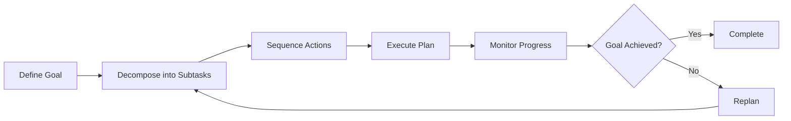
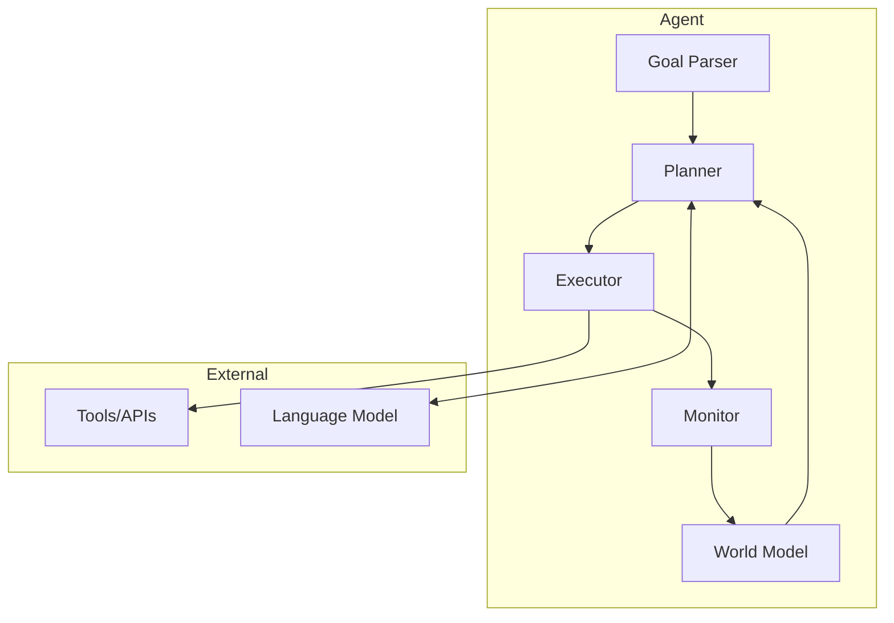
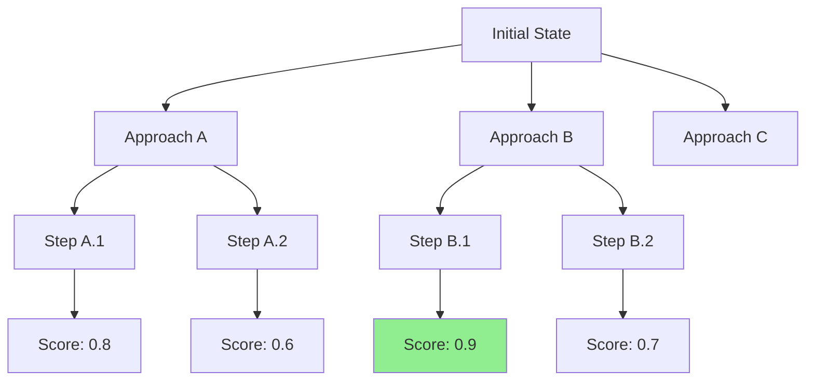
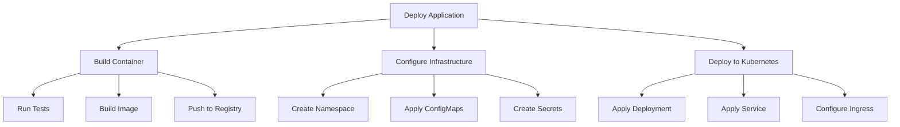

# How to Implement Agent Planning

Author: [nawazdhandala](https://github.com/nawazdhandala)

Tags: AI Agents, LLM, Planning, AI

Description: A practical guide to implementing planning capabilities in AI agents, covering goal decomposition, action sequencing, and adaptive replanning strategies that enable agents to solve complex multi-step tasks.

---

Planning is what separates a simple chatbot from a true AI agent. While a chatbot responds to individual prompts, an agent with planning capabilities can break down complex goals, sequence actions, and adapt when things go wrong. This guide walks through the core concepts and provides working implementations you can build on.

## What is Agent Planning?

Agent planning is the process by which an AI agent decides what actions to take to achieve a goal. Instead of reacting to each input independently, a planning agent:

1. Understands the goal state
2. Assesses the current state
3. Generates a sequence of actions to bridge the gap
4. Executes actions while monitoring progress
5. Replans when obstacles arise



## Core Components of a Planning Agent

A planning agent typically consists of these core modules:

| Component | Purpose | Example |
|-----------|---------|---------|
| Goal Parser | Interprets user intent and desired end state | "Deploy the app" becomes structured goal object |
| World Model | Represents current state and possible actions | Available APIs, system state, constraints |
| Planner | Generates action sequences | ReAct, Tree of Thoughts, STRIPS-style |
| Executor | Runs individual actions | API calls, tool invocations |
| Monitor | Tracks progress and detects failures | Validates outputs, checks preconditions |



## Implementation: A Basic Planning Agent

Let's build a planning agent step by step. We will start with the data structures, then implement each component.

### Define the Core Data Structures

These classes represent goals, actions, and plans that the agent will work with.

```python
from dataclasses import dataclass, field
from enum import Enum
from typing import Optional, Callable, Any

class ActionStatus(Enum):
    PENDING = "pending"
    IN_PROGRESS = "in_progress"
    COMPLETED = "completed"
    FAILED = "failed"

@dataclass
class Action:
    """Represents a single action the agent can take."""
    name: str
    description: str
    parameters: dict
    preconditions: list[str] = field(default_factory=list)
    effects: list[str] = field(default_factory=list)
    status: ActionStatus = ActionStatus.PENDING
    result: Optional[Any] = None
    error: Optional[str] = None

@dataclass
class Goal:
    """Represents what the agent is trying to achieve."""
    description: str
    success_criteria: list[str]
    priority: int = 1
    achieved: bool = False

@dataclass
class Plan:
    """A sequence of actions to achieve a goal."""
    goal: Goal
    actions: list[Action] = field(default_factory=list)
    current_step: int = 0

    def is_complete(self) -> bool:
        return self.current_step >= len(self.actions)

    def current_action(self) -> Optional[Action]:
        if self.is_complete():
            return None
        return self.actions[self.current_step]

    def advance(self):
        self.current_step += 1
```

### Implement the Planner

The planner uses an LLM to decompose goals into actionable steps. This implementation uses a structured prompt to guide the LLM.

```python
import json
from openai import OpenAI

class Planner:
    """Generates plans to achieve goals using an LLM."""

    def __init__(self, client: OpenAI, available_actions: list[dict]):
        self.client = client
        self.available_actions = available_actions

    def create_plan(self, goal: Goal, world_state: dict) -> Plan:
        """Generate a plan to achieve the given goal."""

        # Build the planning prompt with available actions and current state
        prompt = self._build_planning_prompt(goal, world_state)

        response = self.client.chat.completions.create(
            model="gpt-4",
            messages=[
                {"role": "system", "content": self._system_prompt()},
                {"role": "user", "content": prompt}
            ],
            response_format={"type": "json_object"}
        )

        # Parse the LLM response into a structured plan
        plan_data = json.loads(response.choices[0].message.content)
        actions = self._parse_actions(plan_data)

        return Plan(goal=goal, actions=actions)

    def _system_prompt(self) -> str:
        return """You are a planning agent. Given a goal and current state,
        create a step-by-step plan using only the available actions.

        Output a JSON object with this structure:
        {
            "reasoning": "Your analysis of how to achieve the goal",
            "steps": [
                {
                    "action": "action_name",
                    "parameters": {"param1": "value1"},
                    "purpose": "Why this step is needed"
                }
            ]
        }

        Consider preconditions and ensure actions are properly sequenced."""

    def _build_planning_prompt(self, goal: Goal, world_state: dict) -> str:
        actions_desc = json.dumps(self.available_actions, indent=2)
        state_desc = json.dumps(world_state, indent=2)

        return f"""
Goal: {goal.description}

Success Criteria:
{chr(10).join(f"- {c}" for c in goal.success_criteria)}

Current State:
{state_desc}

Available Actions:
{actions_desc}

Create a plan to achieve this goal."""

    def _parse_actions(self, plan_data: dict) -> list[Action]:
        """Convert LLM output into Action objects."""
        actions = []
        for step in plan_data.get("steps", []):
            action = Action(
                name=step["action"],
                description=step.get("purpose", ""),
                parameters=step.get("parameters", {})
            )
            actions.append(action)
        return actions
```

### Implement the Executor

The executor runs actions and handles errors. It maintains a registry of action implementations.

```python
class Executor:
    """Executes actions and tracks their results."""

    def __init__(self):
        self.action_handlers: dict[str, Callable] = {}

    def register_action(self, name: str, handler: Callable):
        """Register a function to handle a specific action type."""
        self.action_handlers[name] = handler

    def execute(self, action: Action) -> bool:
        """Execute an action and update its status."""
        action.status = ActionStatus.IN_PROGRESS

        handler = self.action_handlers.get(action.name)
        if not handler:
            action.status = ActionStatus.FAILED
            action.error = f"No handler registered for action: {action.name}"
            return False

        try:
            result = handler(**action.parameters)
            action.result = result
            action.status = ActionStatus.COMPLETED
            return True
        except Exception as e:
            action.status = ActionStatus.FAILED
            action.error = str(e)
            return False
```

### Implement the Monitor

The monitor checks whether goals are achieved and detects when replanning is needed.

```python
class Monitor:
    """Monitors plan execution and detects when replanning is needed."""

    def __init__(self, client: OpenAI):
        self.client = client

    def check_goal_achieved(self, goal: Goal, world_state: dict) -> bool:
        """Use LLM to assess if the goal has been achieved."""

        prompt = f"""
Goal: {goal.description}

Success Criteria:
{chr(10).join(f"- {c}" for c in goal.success_criteria)}

Current State:
{json.dumps(world_state, indent=2)}

Has the goal been achieved? Respond with JSON:
{{"achieved": true/false, "reasoning": "explanation"}}
"""

        response = self.client.chat.completions.create(
            model="gpt-4",
            messages=[{"role": "user", "content": prompt}],
            response_format={"type": "json_object"}
        )

        result = json.loads(response.choices[0].message.content)
        return result.get("achieved", False)

    def should_replan(self, plan: Plan, world_state: dict) -> tuple[bool, str]:
        """Determine if the current plan needs adjustment."""

        # Check for failed actions
        current = plan.current_action()
        if current and current.status == ActionStatus.FAILED:
            return True, f"Action '{current.name}' failed: {current.error}"

        # Check if preconditions for next action are met
        if current:
            for precondition in current.preconditions:
                if not self._check_precondition(precondition, world_state):
                    return True, f"Precondition not met: {precondition}"

        return False, ""

    def _check_precondition(self, precondition: str, world_state: dict) -> bool:
        """Evaluate if a precondition is satisfied."""
        # Simple key-value check; could be extended with LLM evaluation
        if ":" in precondition:
            key, expected = precondition.split(":", 1)
            return str(world_state.get(key.strip())) == expected.strip()
        return precondition in world_state
```

### Put It All Together: The Planning Agent

This class orchestrates all components into a cohesive agent.

```python
class PlanningAgent:
    """A complete planning agent that can achieve complex goals."""

    def __init__(self, client: OpenAI, available_actions: list[dict]):
        self.client = client
        self.planner = Planner(client, available_actions)
        self.executor = Executor()
        self.monitor = Monitor(client)
        self.world_state = {}
        self.max_replans = 3

    def run(self, goal: Goal) -> bool:
        """Execute until the goal is achieved or max retries exceeded."""
        replan_count = 0

        # Generate initial plan
        plan = self.planner.create_plan(goal, self.world_state)
        print(f"Created plan with {len(plan.actions)} steps")

        while not plan.is_complete() and replan_count < self.max_replans:
            action = plan.current_action()
            print(f"Executing: {action.name}")

            # Execute the current action
            success = self.executor.execute(action)

            if success:
                # Update world state based on action effects
                self._apply_effects(action)
                plan.advance()

            # Check if we need to replan
            needs_replan, reason = self.monitor.should_replan(plan, self.world_state)
            if needs_replan:
                print(f"Replanning due to: {reason}")
                plan = self.planner.create_plan(goal, self.world_state)
                replan_count += 1

            # Check if goal is achieved early
            if self.monitor.check_goal_achieved(goal, self.world_state):
                goal.achieved = True
                return True

        # Final goal check
        goal.achieved = self.monitor.check_goal_achieved(goal, self.world_state)
        return goal.achieved

    def _apply_effects(self, action: Action):
        """Update world state based on action effects."""
        for effect in action.effects:
            if ":" in effect:
                key, value = effect.split(":", 1)
                self.world_state[key.strip()] = value.strip()
```

## Advanced Planning Strategies

### Tree of Thoughts Planning

For complex problems, a linear plan may not be sufficient. Tree of Thoughts explores multiple reasoning paths and selects the most promising one.



This implementation generates multiple plan candidates and scores them.

```python
class TreeOfThoughtsPlanner(Planner):
    """Explores multiple planning paths and selects the best one."""

    def __init__(self, client: OpenAI, available_actions: list[dict], num_branches: int = 3):
        super().__init__(client, available_actions)
        self.num_branches = num_branches

    def create_plan(self, goal: Goal, world_state: dict) -> Plan:
        """Generate multiple plans and select the best one."""

        # Generate multiple candidate plans
        candidates = []
        for i in range(self.num_branches):
            prompt = self._build_planning_prompt(goal, world_state)
            prompt += f"\n\nGenerate approach #{i+1}, different from previous approaches."

            response = self.client.chat.completions.create(
                model="gpt-4",
                messages=[
                    {"role": "system", "content": self._system_prompt()},
                    {"role": "user", "content": prompt}
                ],
                response_format={"type": "json_object"},
                temperature=0.8  # Higher temperature for diversity
            )

            plan_data = json.loads(response.choices[0].message.content)
            actions = self._parse_actions(plan_data)
            candidates.append((plan_data, actions))

        # Score each candidate and select the best
        best_score = -1
        best_actions = candidates[0][1]

        for plan_data, actions in candidates:
            score = self._score_plan(plan_data, actions, goal, world_state)
            if score > best_score:
                best_score = score
                best_actions = actions

        return Plan(goal=goal, actions=best_actions)

    def _score_plan(self, plan_data: dict, actions: list[Action],
                    goal: Goal, world_state: dict) -> float:
        """Score a plan based on various criteria."""

        prompt = f"""
Rate this plan on a scale of 0-1 based on:
- Likelihood of achieving the goal
- Efficiency (fewer steps is better)
- Robustness (handles potential failures)

Plan:
{json.dumps(plan_data, indent=2)}

Goal: {goal.description}

Current State: {json.dumps(world_state)}

Respond with JSON: {{"score": 0.X, "reasoning": "explanation"}}
"""

        response = self.client.chat.completions.create(
            model="gpt-4",
            messages=[{"role": "user", "content": prompt}],
            response_format={"type": "json_object"}
        )

        result = json.loads(response.choices[0].message.content)
        return result.get("score", 0.5)
```

### Hierarchical Planning

For very complex goals, break them down into subgoals that can be planned independently.



This planner decomposes high-level goals into manageable subgoals.

```python
class HierarchicalPlanner(Planner):
    """Decomposes complex goals into subgoals."""

    def create_plan(self, goal: Goal, world_state: dict) -> Plan:
        """Create a hierarchical plan with subgoals."""

        # First, decompose into subgoals
        subgoals = self._decompose_goal(goal, world_state)

        # Create plans for each subgoal
        all_actions = []
        for subgoal in subgoals:
            subplan = super().create_plan(subgoal, world_state)
            all_actions.extend(subplan.actions)

            # Simulate effects for planning subsequent subgoals
            for action in subplan.actions:
                self._simulate_effects(action, world_state)

        return Plan(goal=goal, actions=all_actions)

    def _decompose_goal(self, goal: Goal, world_state: dict) -> list[Goal]:
        """Break a complex goal into subgoals."""

        prompt = f"""
Decompose this goal into 2-5 sequential subgoals:

Goal: {goal.description}
Success Criteria: {goal.success_criteria}
Current State: {json.dumps(world_state)}

Respond with JSON:
{{
    "subgoals": [
        {{
            "description": "subgoal description",
            "success_criteria": ["criterion1", "criterion2"],
            "depends_on": []
        }}
    ]
}}
"""

        response = self.client.chat.completions.create(
            model="gpt-4",
            messages=[{"role": "user", "content": prompt}],
            response_format={"type": "json_object"}
        )

        result = json.loads(response.choices[0].message.content)

        return [
            Goal(
                description=sg["description"],
                success_criteria=sg["success_criteria"]
            )
            for sg in result.get("subgoals", [])
        ]

    def _simulate_effects(self, action: Action, world_state: dict):
        """Simulate the effects of an action on world state."""
        for effect in action.effects:
            if ":" in effect:
                key, value = effect.split(":", 1)
                world_state[key.strip()] = value.strip()
```

## Practical Example: DevOps Automation Agent

Let's build a practical agent that can handle deployment tasks.

First, define the available actions for the agent to use.

```python
# Define available actions for a DevOps agent
devops_actions = [
    {
        "name": "run_tests",
        "description": "Run the test suite",
        "parameters": {"test_path": "string"},
        "preconditions": ["code_checked_out: true"],
        "effects": ["tests_passed: true"]
    },
    {
        "name": "build_container",
        "description": "Build a Docker container image",
        "parameters": {"dockerfile": "string", "tag": "string"},
        "preconditions": ["tests_passed: true"],
        "effects": ["image_built: true"]
    },
    {
        "name": "push_image",
        "description": "Push container image to registry",
        "parameters": {"image": "string", "registry": "string"},
        "preconditions": ["image_built: true"],
        "effects": ["image_pushed: true"]
    },
    {
        "name": "apply_kubernetes",
        "description": "Apply Kubernetes manifests",
        "parameters": {"manifest_path": "string", "namespace": "string"},
        "preconditions": ["image_pushed: true"],
        "effects": ["deployment_applied: true"]
    },
    {
        "name": "verify_deployment",
        "description": "Verify the deployment is healthy",
        "parameters": {"deployment_name": "string", "namespace": "string"},
        "preconditions": ["deployment_applied: true"],
        "effects": ["deployment_verified: true"]
    }
]
```

Next, implement the action handlers that do the actual work.

```python
import subprocess

def run_tests(test_path: str) -> dict:
    """Run pytest on the specified path."""
    result = subprocess.run(
        ["pytest", test_path, "-v"],
        capture_output=True,
        text=True
    )
    return {
        "passed": result.returncode == 0,
        "output": result.stdout,
        "errors": result.stderr
    }

def build_container(dockerfile: str, tag: str) -> dict:
    """Build a Docker image."""
    result = subprocess.run(
        ["docker", "build", "-f", dockerfile, "-t", tag, "."],
        capture_output=True,
        text=True
    )
    return {
        "success": result.returncode == 0,
        "image_tag": tag
    }

def push_image(image: str, registry: str) -> dict:
    """Push image to container registry."""
    full_tag = f"{registry}/{image}"
    subprocess.run(["docker", "tag", image, full_tag])
    result = subprocess.run(
        ["docker", "push", full_tag],
        capture_output=True,
        text=True
    )
    return {"success": result.returncode == 0}

def apply_kubernetes(manifest_path: str, namespace: str) -> dict:
    """Apply Kubernetes manifests."""
    result = subprocess.run(
        ["kubectl", "apply", "-f", manifest_path, "-n", namespace],
        capture_output=True,
        text=True
    )
    return {
        "success": result.returncode == 0,
        "output": result.stdout
    }

def verify_deployment(deployment_name: str, namespace: str) -> dict:
    """Wait for deployment to be ready."""
    result = subprocess.run(
        ["kubectl", "rollout", "status",
         f"deployment/{deployment_name}", "-n", namespace,
         "--timeout=300s"],
        capture_output=True,
        text=True
    )
    return {"healthy": result.returncode == 0}
```

Now wire everything together and run the agent.

```python
# Create and configure the agent
client = OpenAI()
agent = PlanningAgent(client, devops_actions)

# Register action handlers
agent.executor.register_action("run_tests", run_tests)
agent.executor.register_action("build_container", build_container)
agent.executor.register_action("push_image", push_image)
agent.executor.register_action("apply_kubernetes", apply_kubernetes)
agent.executor.register_action("verify_deployment", verify_deployment)

# Set initial state
agent.world_state = {
    "code_checked_out": True,
    "environment": "staging"
}

# Define the goal
goal = Goal(
    description="Deploy the application to the staging Kubernetes cluster",
    success_criteria=[
        "All tests pass",
        "Container image is pushed to registry",
        "Deployment is running and healthy"
    ]
)

# Run the agent
success = agent.run(goal)
print(f"Deployment {'succeeded' if success else 'failed'}")
```

## Best Practices for Agent Planning

### 1. Keep Actions Atomic

Each action should do one thing. This makes replanning easier when something fails.

```python
# Good: atomic actions
actions = ["create_namespace", "apply_configmap", "apply_deployment"]

# Bad: monolithic action
actions = ["deploy_everything"]
```

### 2. Define Clear Preconditions and Effects

Make the dependencies between actions explicit.

```python
action = {
    "name": "apply_deployment",
    "preconditions": [
        "namespace_exists: true",
        "configmap_applied: true",
        "secrets_created: true"
    ],
    "effects": [
        "deployment_exists: true",
        "pods_scheduled: true"
    ]
}
```

### 3. Implement Graceful Degradation

Not every failure requires starting over. Consider partial rollbacks or alternative paths.

```python
class ResilientAgent(PlanningAgent):
    """Agent that handles failures gracefully."""

    def handle_failure(self, action: Action, plan: Plan) -> str:
        """Decide how to handle a failed action."""

        # Check if there's an alternative action
        if action.name == "push_to_primary_registry":
            return "try_backup_registry"

        # Check if we can skip this action
        if not action.parameters.get("required", True):
            return "skip"

        # Otherwise, replan
        return "replan"
```

### 4. Add Observability

Track what your agent is doing for debugging and improvement.

```python
import logging
from datetime import datetime

class ObservableAgent(PlanningAgent):
    """Agent with comprehensive logging."""

    def __init__(self, *args, **kwargs):
        super().__init__(*args, **kwargs)
        self.execution_log = []

    def run(self, goal: Goal) -> bool:
        self.execution_log.append({
            "event": "goal_started",
            "timestamp": datetime.now().isoformat(),
            "goal": goal.description
        })

        result = super().run(goal)

        self.execution_log.append({
            "event": "goal_completed",
            "timestamp": datetime.now().isoformat(),
            "success": result
        })

        return result

    def get_execution_summary(self) -> dict:
        """Return a summary of the execution."""
        return {
            "total_actions": len([e for e in self.execution_log if e["event"] == "action_executed"]),
            "failures": len([e for e in self.execution_log if e.get("status") == "failed"]),
            "replans": len([e for e in self.execution_log if e["event"] == "replan"]),
            "duration": self._calculate_duration()
        }
```

## Common Pitfalls to Avoid

| Pitfall | Problem | Solution |
|---------|---------|----------|
| Infinite replanning | Agent gets stuck retrying the same failed approach | Limit replan attempts, track failed approaches |
| Overly optimistic plans | LLM generates plans that skip necessary steps | Validate preconditions before execution |
| State drift | World state becomes inconsistent with reality | Periodically refresh state from actual sources |
| Hallucinated actions | LLM invents actions that do not exist | Validate actions against registered handlers |
| Missing rollback | Failed deployments leave partial state | Implement cleanup in failure handlers |

---

Agent planning transforms LLMs from simple question answerers into capable problem solvers. Start with the basic loop of plan, execute, and monitor. Then add sophistication with tree search, hierarchical decomposition, and robust error handling. The key is keeping actions atomic, state explicit, and always having a path to recovery when things go wrong.
