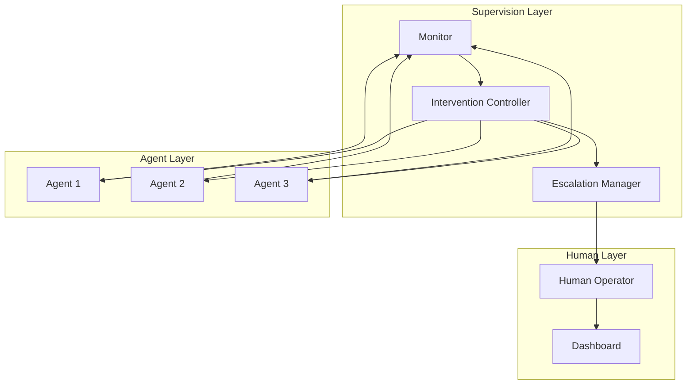
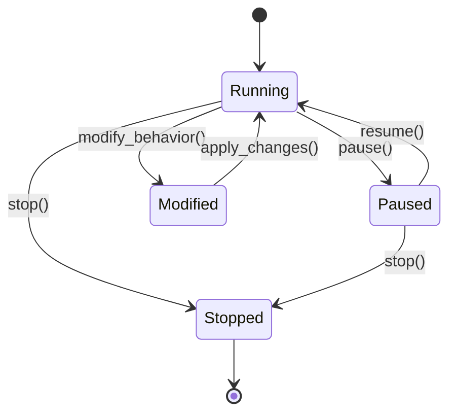
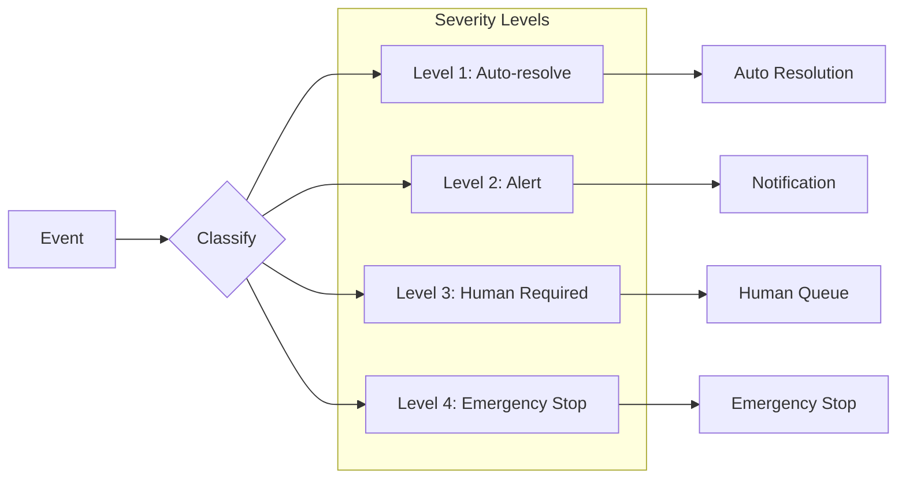
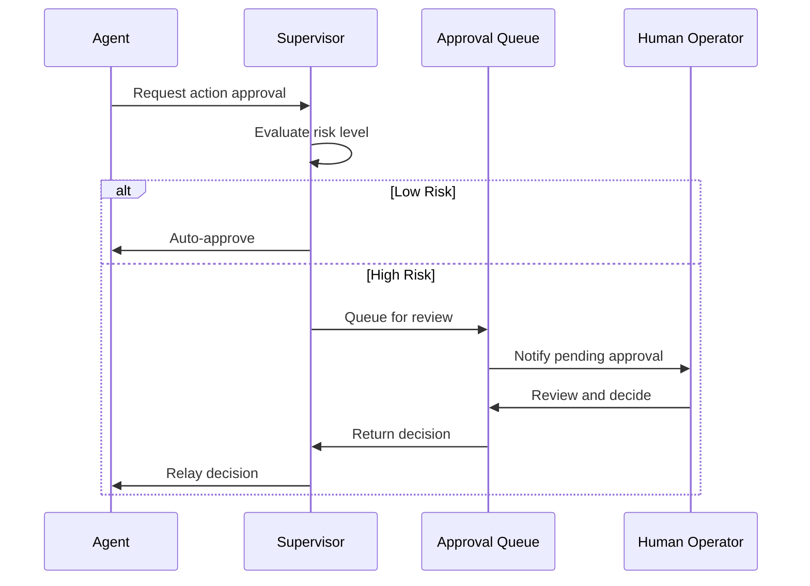
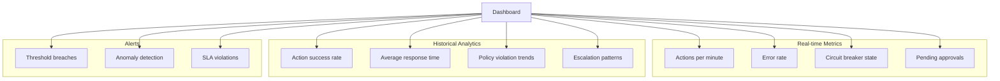

# How to Build Agent Supervision

Author: [nawazdhandala](https://github.com/nawazdhandala)

Tags: AI Agents, Supervision, Multi-Agent Systems, Safety

Description: Learn to implement agent supervision with monitoring, intervention controls, and escalation paths for safe and controllable AI agent execution.

---

## Introduction

As AI agents become more autonomous and capable, the need for robust supervision mechanisms grows critical. Agent supervision is the practice of monitoring, controlling, and intervening in agent behavior to ensure safe, predictable, and aligned outcomes. In multi-agent systems, where multiple AI agents collaborate or compete, supervision becomes even more essential.

This guide covers the key patterns and practical implementations for building effective agent supervision systems.

## Why Agent Supervision Matters

Without proper supervision, AI agents can:

- Execute unintended actions that cause harm
- Drift from their original objectives
- Create cascading failures in multi-agent environments
- Make decisions that require human judgment
- Consume excessive resources or get stuck in loops

A well-designed supervision system provides visibility, control, and safety guarantees while preserving agent autonomy where appropriate.

## Core Supervision Architecture

The foundation of agent supervision rests on three pillars: monitoring, intervention, and escalation.



## Supervision Patterns

### 1. The Observer Pattern

The observer pattern provides passive monitoring without direct intervention. It collects telemetry, logs decisions, and tracks agent state.

```python
from dataclasses import dataclass, field
from datetime import datetime
from typing import Callable
from enum import Enum

class EventType(Enum):
    ACTION = "action"
    DECISION = "decision"
    ERROR = "error"
    STATE_CHANGE = "state_change"

@dataclass
class AgentEvent:
    agent_id: str
    event_type: EventType
    payload: dict
    timestamp: datetime = field(default_factory=datetime.now)

class AgentObserver:
    def __init__(self):
        self.event_log: list[AgentEvent] = []
        self.subscribers: list[Callable[[AgentEvent], None]] = []

    def record(self, event: AgentEvent) -> None:
        """Record an agent event and notify subscribers."""
        self.event_log.append(event)
        for subscriber in self.subscribers:
            subscriber(event)

    def subscribe(self, callback: Callable[[AgentEvent], None]) -> None:
        """Add a subscriber to receive event notifications."""
        self.subscribers.append(callback)

    def get_agent_history(self, agent_id: str) -> list[AgentEvent]:
        """Retrieve all events for a specific agent."""
        return [e for e in self.event_log if e.agent_id == agent_id]

    def get_events_by_type(self, event_type: EventType) -> list[AgentEvent]:
        """Filter events by type for analysis."""
        return [e for e in self.event_log if e.event_type == event_type]
```

### 2. The Guardian Pattern

The guardian pattern wraps agent actions with validation and policy checks before execution.

```python
from abc import ABC, abstractmethod
from typing import Any

class Policy(ABC):
    @abstractmethod
    def validate(self, action: dict, context: dict) -> tuple[bool, str]:
        """Return (is_valid, reason) for the proposed action."""
        pass

class ResourceLimitPolicy(Policy):
    def __init__(self, max_cost: float, max_api_calls: int):
        self.max_cost = max_cost
        self.max_api_calls = max_api_calls

    def validate(self, action: dict, context: dict) -> tuple[bool, str]:
        current_cost = context.get("total_cost", 0)
        current_calls = context.get("api_calls", 0)

        if current_cost + action.get("estimated_cost", 0) > self.max_cost:
            return False, f"Action would exceed cost limit of {self.max_cost}"

        if current_calls >= self.max_api_calls:
            return False, f"API call limit of {self.max_api_calls} reached"

        return True, "Action permitted"

class SensitiveDataPolicy(Policy):
    def __init__(self, blocked_patterns: list[str]):
        self.blocked_patterns = blocked_patterns

    def validate(self, action: dict, context: dict) -> tuple[bool, str]:
        action_str = str(action).lower()
        for pattern in self.blocked_patterns:
            if pattern.lower() in action_str:
                return False, f"Action contains blocked pattern: {pattern}"
        return True, "No sensitive data detected"

class Guardian:
    def __init__(self, policies: list[Policy]):
        self.policies = policies

    def check_action(self, action: dict, context: dict) -> tuple[bool, list[str]]:
        """Validate action against all policies."""
        violations = []
        for policy in self.policies:
            is_valid, reason = policy.validate(action, context)
            if not is_valid:
                violations.append(reason)
        return len(violations) == 0, violations
```

### 3. The Circuit Breaker Pattern

The circuit breaker pattern prevents cascading failures by stopping agent execution when error thresholds are exceeded.

```python
from enum import Enum
from datetime import datetime, timedelta

class CircuitState(Enum):
    CLOSED = "closed"      # Normal operation
    OPEN = "open"          # Blocking all actions
    HALF_OPEN = "half_open"  # Testing recovery

class CircuitBreaker:
    def __init__(
        self,
        failure_threshold: int = 5,
        recovery_timeout: timedelta = timedelta(minutes=5),
        half_open_max_calls: int = 3
    ):
        self.failure_threshold = failure_threshold
        self.recovery_timeout = recovery_timeout
        self.half_open_max_calls = half_open_max_calls

        self.state = CircuitState.CLOSED
        self.failure_count = 0
        self.last_failure_time: datetime | None = None
        self.half_open_calls = 0

    def can_execute(self) -> bool:
        """Check if execution is allowed."""
        if self.state == CircuitState.CLOSED:
            return True

        if self.state == CircuitState.OPEN:
            if self._should_attempt_recovery():
                self.state = CircuitState.HALF_OPEN
                self.half_open_calls = 0
                return True
            return False

        if self.state == CircuitState.HALF_OPEN:
            return self.half_open_calls < self.half_open_max_calls

        return False

    def record_success(self) -> None:
        """Record a successful execution."""
        if self.state == CircuitState.HALF_OPEN:
            self.half_open_calls += 1
            if self.half_open_calls >= self.half_open_max_calls:
                self._reset()
        elif self.state == CircuitState.CLOSED:
            self.failure_count = 0

    def record_failure(self) -> None:
        """Record a failed execution."""
        self.failure_count += 1
        self.last_failure_time = datetime.now()

        if self.state == CircuitState.HALF_OPEN:
            self.state = CircuitState.OPEN
        elif self.failure_count >= self.failure_threshold:
            self.state = CircuitState.OPEN

    def _should_attempt_recovery(self) -> bool:
        if self.last_failure_time is None:
            return True
        return datetime.now() - self.last_failure_time > self.recovery_timeout

    def _reset(self) -> None:
        self.state = CircuitState.CLOSED
        self.failure_count = 0
        self.half_open_calls = 0
```

## Building the Intervention System

Intervention allows supervisors to modify, pause, or stop agent behavior in real-time.



Here is a practical implementation:

```python
from enum import Enum
from threading import Lock
from typing import Callable, Any

class AgentState(Enum):
    RUNNING = "running"
    PAUSED = "paused"
    STOPPED = "stopped"

class InterventionController:
    def __init__(self, agent_id: str):
        self.agent_id = agent_id
        self.state = AgentState.RUNNING
        self.lock = Lock()
        self.pending_modifications: list[dict] = []
        self.on_state_change: Callable[[AgentState], None] | None = None

    def pause(self, reason: str) -> bool:
        """Pause agent execution."""
        with self.lock:
            if self.state == AgentState.RUNNING:
                self.state = AgentState.PAUSED
                self._notify_state_change()
                print(f"Agent {self.agent_id} paused: {reason}")
                return True
            return False

    def resume(self) -> bool:
        """Resume agent execution."""
        with self.lock:
            if self.state == AgentState.PAUSED:
                self.state = AgentState.RUNNING
                self._notify_state_change()
                print(f"Agent {self.agent_id} resumed")
                return True
            return False

    def stop(self, reason: str) -> bool:
        """Permanently stop agent execution."""
        with self.lock:
            if self.state != AgentState.STOPPED:
                self.state = AgentState.STOPPED
                self._notify_state_change()
                print(f"Agent {self.agent_id} stopped: {reason}")
                return True
            return False

    def inject_modification(self, modification: dict) -> None:
        """Queue a behavior modification for the agent."""
        with self.lock:
            self.pending_modifications.append(modification)

    def get_pending_modifications(self) -> list[dict]:
        """Retrieve and clear pending modifications."""
        with self.lock:
            mods = self.pending_modifications.copy()
            self.pending_modifications.clear()
            return mods

    def is_execution_allowed(self) -> bool:
        """Check if the agent is allowed to execute."""
        return self.state == AgentState.RUNNING

    def _notify_state_change(self) -> None:
        if self.on_state_change:
            self.on_state_change(self.state)
```

## Escalation Paths

Escalation routes critical decisions or anomalies to appropriate handlers - whether automated systems or human operators.



```python
from enum import IntEnum
from dataclasses import dataclass
from typing import Callable
from abc import ABC, abstractmethod

class EscalationLevel(IntEnum):
    AUTO_RESOLVE = 1
    ALERT = 2
    HUMAN_REQUIRED = 3
    EMERGENCY_STOP = 4

@dataclass
class EscalationEvent:
    agent_id: str
    level: EscalationLevel
    description: str
    context: dict
    recommended_action: str | None = None

class EscalationHandler(ABC):
    @abstractmethod
    def handle(self, event: EscalationEvent) -> bool:
        """Handle the escalation. Returns True if resolved."""
        pass

class AutoResolveHandler(EscalationHandler):
    def __init__(self, resolution_strategies: dict[str, Callable]):
        self.strategies = resolution_strategies

    def handle(self, event: EscalationEvent) -> bool:
        strategy_key = event.context.get("issue_type")
        if strategy_key in self.strategies:
            return self.strategies[strategy_key](event)
        return False

class AlertHandler(EscalationHandler):
    def __init__(self, notification_service):
        self.notification_service = notification_service

    def handle(self, event: EscalationEvent) -> bool:
        self.notification_service.send_alert(
            title=f"Agent Alert: {event.agent_id}",
            message=event.description,
            severity="warning"
        )
        return True

class HumanQueueHandler(EscalationHandler):
    def __init__(self, queue_service):
        self.queue_service = queue_service

    def handle(self, event: EscalationEvent) -> bool:
        ticket_id = self.queue_service.create_ticket(
            agent_id=event.agent_id,
            description=event.description,
            context=event.context,
            recommended_action=event.recommended_action
        )
        print(f"Human review ticket created: {ticket_id}")
        return True

class EmergencyStopHandler(EscalationHandler):
    def __init__(self, intervention_controllers: dict[str, InterventionController]):
        self.controllers = intervention_controllers

    def handle(self, event: EscalationEvent) -> bool:
        if event.agent_id in self.controllers:
            self.controllers[event.agent_id].stop(
                f"Emergency stop: {event.description}"
            )
            return True
        return False

class EscalationManager:
    def __init__(self):
        self.handlers: dict[EscalationLevel, EscalationHandler] = {}

    def register_handler(
        self,
        level: EscalationLevel,
        handler: EscalationHandler
    ) -> None:
        self.handlers[level] = handler

    def escalate(self, event: EscalationEvent) -> bool:
        """Process an escalation event."""
        handler = self.handlers.get(event.level)
        if handler:
            return handler.handle(event)
        # If no handler for this level, escalate to the next level
        for level in EscalationLevel:
            if level > event.level and level in self.handlers:
                event.level = level
                return self.handlers[level].handle(event)
        return False
```

## Human-in-the-Loop Controls

For high-stakes decisions, human oversight is essential. This section covers patterns for integrating human judgment into agent workflows.



```python
from enum import Enum
from dataclasses import dataclass, field
from datetime import datetime, timedelta
from typing import Callable
import asyncio
from queue import Queue

class ApprovalStatus(Enum):
    PENDING = "pending"
    APPROVED = "approved"
    REJECTED = "rejected"
    TIMEOUT = "timeout"

@dataclass
class ApprovalRequest:
    request_id: str
    agent_id: str
    action: dict
    risk_score: float
    justification: str
    created_at: datetime = field(default_factory=datetime.now)
    status: ApprovalStatus = ApprovalStatus.PENDING
    reviewer: str | None = None
    review_notes: str | None = None

class HumanApprovalGate:
    def __init__(
        self,
        auto_approve_threshold: float = 0.3,
        timeout: timedelta = timedelta(hours=1)
    ):
        self.auto_approve_threshold = auto_approve_threshold
        self.timeout = timeout
        self.pending_requests: dict[str, ApprovalRequest] = {}
        self.request_queue: Queue = Queue()
        self.on_decision: Callable[[ApprovalRequest], None] | None = None

    def submit_for_approval(
        self,
        request_id: str,
        agent_id: str,
        action: dict,
        risk_score: float,
        justification: str
    ) -> ApprovalRequest:
        """Submit an action for human approval."""
        request = ApprovalRequest(
            request_id=request_id,
            agent_id=agent_id,
            action=action,
            risk_score=risk_score,
            justification=justification
        )

        # Auto-approve low-risk actions
        if risk_score < self.auto_approve_threshold:
            request.status = ApprovalStatus.APPROVED
            request.reviewer = "auto"
            request.review_notes = "Auto-approved due to low risk score"
        else:
            self.pending_requests[request_id] = request
            self.request_queue.put(request)

        return request

    def approve(
        self,
        request_id: str,
        reviewer: str,
        notes: str = ""
    ) -> bool:
        """Approve a pending request."""
        if request_id in self.pending_requests:
            request = self.pending_requests[request_id]
            request.status = ApprovalStatus.APPROVED
            request.reviewer = reviewer
            request.review_notes = notes
            del self.pending_requests[request_id]
            if self.on_decision:
                self.on_decision(request)
            return True
        return False

    def reject(
        self,
        request_id: str,
        reviewer: str,
        notes: str
    ) -> bool:
        """Reject a pending request."""
        if request_id in self.pending_requests:
            request = self.pending_requests[request_id]
            request.status = ApprovalStatus.REJECTED
            request.reviewer = reviewer
            request.review_notes = notes
            del self.pending_requests[request_id]
            if self.on_decision:
                self.on_decision(request)
            return True
        return False

    def check_timeouts(self) -> list[ApprovalRequest]:
        """Check for and handle timed-out requests."""
        timed_out = []
        now = datetime.now()
        for request_id, request in list(self.pending_requests.items()):
            if now - request.created_at > self.timeout:
                request.status = ApprovalStatus.TIMEOUT
                request.review_notes = "Request timed out awaiting review"
                timed_out.append(request)
                del self.pending_requests[request_id]
        return timed_out

    def get_pending_count(self) -> int:
        """Get the number of pending approval requests."""
        return len(self.pending_requests)
```

## Putting It All Together: Supervised Agent

Here is how to combine all the patterns into a complete supervised agent system:

```python
from dataclasses import dataclass
from typing import Any
import uuid

@dataclass
class SupervisedAgentConfig:
    agent_id: str
    max_cost: float = 100.0
    max_api_calls: int = 1000
    failure_threshold: int = 5
    auto_approve_threshold: float = 0.3
    blocked_patterns: list[str] = None

    def __post_init__(self):
        if self.blocked_patterns is None:
            self.blocked_patterns = ["password", "api_key", "secret"]

class SupervisedAgent:
    def __init__(self, config: SupervisedAgentConfig):
        self.config = config
        self.context = {"total_cost": 0, "api_calls": 0}

        # Initialize supervision components
        self.observer = AgentObserver()
        self.guardian = Guardian([
            ResourceLimitPolicy(config.max_cost, config.max_api_calls),
            SensitiveDataPolicy(config.blocked_patterns)
        ])
        self.circuit_breaker = CircuitBreaker(
            failure_threshold=config.failure_threshold
        )
        self.intervention = InterventionController(config.agent_id)
        self.approval_gate = HumanApprovalGate(
            auto_approve_threshold=config.auto_approve_threshold
        )
        self.escalation_manager = EscalationManager()

    def execute_action(self, action: dict) -> dict[str, Any]:
        """Execute an action with full supervision."""
        result = {"success": False, "data": None, "error": None}

        # Check intervention state
        if not self.intervention.is_execution_allowed():
            result["error"] = "Agent execution is paused or stopped"
            return result

        # Check circuit breaker
        if not self.circuit_breaker.can_execute():
            result["error"] = "Circuit breaker is open - too many failures"
            self._escalate(
                EscalationLevel.ALERT,
                "Circuit breaker open",
                action
            )
            return result

        # Validate against policies
        is_valid, violations = self.guardian.check_action(action, self.context)
        if not is_valid:
            result["error"] = f"Policy violations: {violations}"
            self._escalate(
                EscalationLevel.ALERT,
                f"Policy violation: {violations}",
                action
            )
            return result

        # Check for human approval if needed
        risk_score = self._calculate_risk(action)
        if risk_score >= self.config.auto_approve_threshold:
            approval = self.approval_gate.submit_for_approval(
                request_id=str(uuid.uuid4()),
                agent_id=self.config.agent_id,
                action=action,
                risk_score=risk_score,
                justification=f"Risk score: {risk_score}"
            )
            if approval.status != ApprovalStatus.APPROVED:
                result["error"] = "Awaiting human approval"
                result["approval_request"] = approval
                return result

        # Record the action attempt
        self.observer.record(AgentEvent(
            agent_id=self.config.agent_id,
            event_type=EventType.ACTION,
            payload=action
        ))

        # Execute the action
        try:
            result["data"] = self._perform_action(action)
            result["success"] = True
            self.circuit_breaker.record_success()

            # Update context
            self.context["api_calls"] += 1
            self.context["total_cost"] += action.get("estimated_cost", 0)

        except Exception as e:
            result["error"] = str(e)
            self.circuit_breaker.record_failure()

            self.observer.record(AgentEvent(
                agent_id=self.config.agent_id,
                event_type=EventType.ERROR,
                payload={"error": str(e), "action": action}
            ))

            self._escalate(
                EscalationLevel.ALERT,
                f"Action failed: {e}",
                action
            )

        return result

    def _calculate_risk(self, action: dict) -> float:
        """Calculate risk score for an action (0.0 to 1.0)."""
        risk = 0.0

        # Higher cost actions are riskier
        cost = action.get("estimated_cost", 0)
        if cost > 10:
            risk += 0.3
        elif cost > 5:
            risk += 0.1

        # Certain action types are riskier
        risky_types = ["delete", "modify", "execute", "deploy"]
        if action.get("type", "").lower() in risky_types:
            risk += 0.3

        # External actions are riskier
        if action.get("external", False):
            risk += 0.2

        return min(risk, 1.0)

    def _perform_action(self, action: dict) -> Any:
        """Actually perform the action (implementation specific)."""
        # This would contain the actual agent logic
        pass

    def _escalate(
        self,
        level: EscalationLevel,
        description: str,
        action: dict
    ) -> None:
        """Escalate an issue."""
        event = EscalationEvent(
            agent_id=self.config.agent_id,
            level=level,
            description=description,
            context={"action": action, "agent_context": self.context}
        )
        self.escalation_manager.escalate(event)
```

## Monitoring Dashboard Considerations

A good supervision system needs visibility. Consider tracking these metrics:



Key metrics to monitor:

1. **Throughput**: Actions executed per time period
2. **Latency**: Time from action request to completion
3. **Error Rate**: Percentage of failed actions
4. **Policy Violations**: Count and types of violations
5. **Human Intervention Rate**: How often humans need to intervene
6. **Escalation Frequency**: Distribution across escalation levels
7. **Circuit Breaker Trips**: Frequency and recovery times

## Best Practices

### Design Principles

1. **Fail Safe**: When in doubt, stop or escalate rather than proceed
2. **Least Privilege**: Grant agents only the permissions they need
3. **Defense in Depth**: Layer multiple supervision mechanisms
4. **Transparency**: Log everything for audit and debugging
5. **Graceful Degradation**: Handle supervision failures gracefully

### Implementation Tips

1. **Start Strict**: Begin with tight controls and loosen as you gain confidence
2. **Test Failure Modes**: Verify your supervision handles edge cases
3. **Monitor the Monitors**: Ensure your supervision system itself is healthy
4. **Version Policies**: Track policy changes over time
5. **Regular Reviews**: Periodically audit supervision effectiveness

### Common Pitfalls to Avoid

1. **Over-automation**: Not every decision should be automated
2. **Alert Fatigue**: Too many low-priority alerts reduce effectiveness
3. **Single Points of Failure**: Redundancy in critical supervision paths
4. **Rigid Policies**: Build in flexibility for legitimate edge cases
5. **Ignoring Context**: Supervision should understand agent goals

## Conclusion

Building effective agent supervision requires balancing autonomy with control. The patterns presented here - observation, guardianship, circuit breaking, intervention, escalation, and human-in-the-loop controls - provide a comprehensive toolkit for managing AI agents safely.

Start with strong supervision and gradually adjust based on observed behavior and gained trust. Remember that supervision is not just about preventing bad outcomes - it is about building systems that humans can understand, trust, and effectively oversee.

As AI agents become more capable, robust supervision will become not just a best practice but a necessity for responsible deployment in production environments.

## Further Reading

- Multi-agent coordination patterns
- Formal verification for agent policies
- Observability and distributed tracing for AI systems
- Safety engineering principles for autonomous systems
