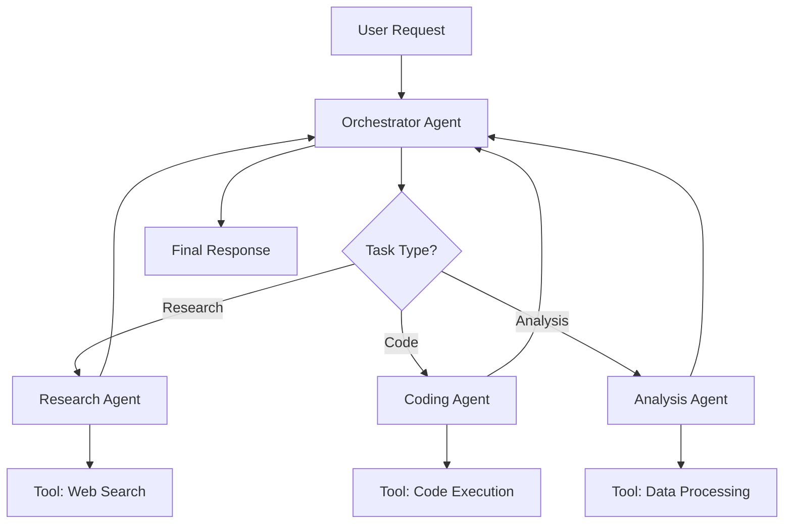

# How to Build AI Agent Architecture

Author: [nawazdhandala](https://www.github.com/nawazdhandala)

Tags: AI, Agents, LLM, Architecture, Machine Learning

Description: Design AI agent systems with planning, tool use, memory, and orchestration for autonomous task completion and multi-agent collaboration.

---

AI agents are autonomous systems that can perceive their environment, make decisions, and take actions to accomplish goals. Unlike simple chatbots that respond to individual prompts, agents maintain state, use tools, and work through multi-step problems. This guide walks you through building a production-ready agent architecture from the ground up.

## What Makes an AI Agent Different?

A traditional LLM call is stateless: you send a prompt, you get a response. An agent, on the other hand, operates in a loop. It observes the current state, reasons about what to do next, executes an action, and repeats until the goal is achieved. This fundamental difference requires a completely different architecture.

The core components of an agent system include:

- **Planner**: Breaks down complex goals into actionable steps
- **Memory**: Maintains context across interactions
- **Tools**: Interfaces with external systems and APIs
- **Orchestrator**: Coordinates the execution loop
- **Evaluator**: Assesses progress and determines completion

## The Agent Loop

At the heart of every agent is the execution loop. Here is a basic implementation:

```python
# agent_loop.py - Core agent execution loop
from dataclasses import dataclass
from typing import List, Dict, Any, Optional
import json

@dataclass
class AgentState:
    """Holds the current state of the agent's execution."""
    goal: str
    messages: List[Dict[str, str]]
    tool_results: List[Dict[str, Any]]
    is_complete: bool = False

class Agent:
    def __init__(self, llm_client, tools: Dict[str, callable]):
        self.llm = llm_client
        self.tools = tools
        self.max_iterations = 10

    def run(self, goal: str) -> str:
        """Execute the agent loop until goal is achieved."""
        state = AgentState(
            goal=goal,
            messages=[{"role": "user", "content": goal}],
            tool_results=[]
        )

        iteration = 0
        while not state.is_complete and iteration < self.max_iterations:
            # Step 1: Get next action from LLM
            action = self._think(state)

            # Step 2: Execute the action
            if action["type"] == "tool_call":
                result = self._execute_tool(action)
                state.tool_results.append(result)
                state.messages.append({
                    "role": "assistant",
                    "content": f"Tool {action['name']} returned: {result}"
                })
            elif action["type"] == "final_answer":
                state.is_complete = True
                return action["content"]

            iteration += 1

        return "Max iterations reached without completing goal."

    def _think(self, state: AgentState) -> Dict[str, Any]:
        """Determine the next action based on current state."""
        system_prompt = self._build_system_prompt()
        response = self.llm.chat(
            system=system_prompt,
            messages=state.messages
        )
        return self._parse_action(response)

    def _execute_tool(self, action: Dict[str, Any]) -> Any:
        """Execute a tool and return its result."""
        tool_name = action["name"]
        tool_args = action["arguments"]

        if tool_name not in self.tools:
            return {"error": f"Unknown tool: {tool_name}"}

        try:
            return self.tools[tool_name](**tool_args)
        except Exception as e:
            return {"error": str(e)}
```

## Building a Planning System

Complex tasks require breaking down into smaller steps. The planner component handles this decomposition:

```python
# planner.py - Task decomposition and planning
from typing import List
from pydantic import BaseModel

class Step(BaseModel):
    """Represents a single step in the execution plan."""
    id: int
    description: str
    dependencies: List[int]  # IDs of steps that must complete first
    tool_hint: str | None = None

class Plan(BaseModel):
    """A structured plan for accomplishing a goal."""
    goal: str
    steps: List[Step]

class Planner:
    def __init__(self, llm_client):
        self.llm = llm_client

    def create_plan(self, goal: str, available_tools: List[str]) -> Plan:
        """Generate a structured plan for the given goal."""
        prompt = f"""
        Create a step-by-step plan to accomplish this goal: {goal}

        Available tools: {', '.join(available_tools)}

        Return a JSON object with:
        - goal: the original goal
        - steps: array of objects with id, description, dependencies, tool_hint

        Keep steps atomic and actionable. Include dependencies between steps.
        """

        response = self.llm.chat(
            messages=[{"role": "user", "content": prompt}],
            response_format={"type": "json_object"}
        )

        return Plan.model_validate_json(response.content)

    def replan(self, original_plan: Plan, failed_step: Step, error: str) -> Plan:
        """Adjust the plan when a step fails."""
        prompt = f"""
        The following plan failed at step {failed_step.id}:
        Original plan: {original_plan.model_dump_json()}

        Error: {error}

        Create a revised plan that works around this failure.
        """

        response = self.llm.chat(
            messages=[{"role": "user", "content": prompt}],
            response_format={"type": "json_object"}
        )

        return Plan.model_validate_json(response.content)
```

## Implementing Memory

Agents need both short-term and long-term memory. Short-term memory holds the current conversation context, while long-term memory stores information that persists across sessions:

```python
# memory.py - Agent memory systems
from typing import List, Dict, Any
import numpy as np
from datetime import datetime

class MemoryStore:
    """Vector-based memory store for semantic search."""

    def __init__(self, embedding_client):
        self.embeddings = embedding_client
        self.memories: List[Dict[str, Any]] = []
        self.vectors: List[np.ndarray] = []

    def add(self, content: str, metadata: Dict[str, Any] = None):
        """Store a new memory with its embedding."""
        vector = self.embeddings.create(content)

        self.memories.append({
            "content": content,
            "metadata": metadata or {},
            "timestamp": datetime.now().isoformat()
        })
        self.vectors.append(np.array(vector))

    def search(self, query: str, top_k: int = 5) -> List[Dict[str, Any]]:
        """Find memories most relevant to the query."""
        if not self.memories:
            return []

        query_vector = np.array(self.embeddings.create(query))

        # Calculate cosine similarity with all stored memories
        similarities = []
        for vec in self.vectors:
            similarity = np.dot(query_vector, vec) / (
                np.linalg.norm(query_vector) * np.linalg.norm(vec)
            )
            similarities.append(similarity)

        # Return top-k most similar memories
        indices = np.argsort(similarities)[-top_k:][::-1]
        return [self.memories[i] for i in indices]

class ConversationMemory:
    """Manages conversation history with summarization."""

    def __init__(self, llm_client, max_messages: int = 20):
        self.llm = llm_client
        self.max_messages = max_messages
        self.messages: List[Dict[str, str]] = []
        self.summary: str = ""

    def add_message(self, role: str, content: str):
        """Add a message, summarizing if history gets too long."""
        self.messages.append({"role": role, "content": content})

        if len(self.messages) > self.max_messages:
            self._compress_history()

    def _compress_history(self):
        """Summarize older messages to save context space."""
        # Keep recent messages, summarize the rest
        to_summarize = self.messages[:-5]
        self.messages = self.messages[-5:]

        summary_prompt = f"""
        Summarize this conversation, preserving key facts and decisions:
        {to_summarize}

        Previous summary: {self.summary}
        """

        response = self.llm.chat(
            messages=[{"role": "user", "content": summary_prompt}]
        )
        self.summary = response.content
```

## Tool Integration

Tools give agents the ability to interact with the outside world. Here is a pattern for defining and registering tools:

```python
# tools.py - Tool definitions and registry
from typing import Callable, Dict, Any
from pydantic import BaseModel, Field
import inspect

class ToolDefinition(BaseModel):
    """Schema for tool metadata."""
    name: str
    description: str
    parameters: Dict[str, Any]

class ToolRegistry:
    """Registry for agent tools with automatic schema generation."""

    def __init__(self):
        self.tools: Dict[str, Callable] = {}
        self.schemas: Dict[str, ToolDefinition] = {}

    def register(self, name: str = None, description: str = ""):
        """Decorator to register a function as an agent tool."""
        def decorator(func: Callable):
            tool_name = name or func.__name__

            # Extract parameter info from type hints
            sig = inspect.signature(func)
            params = {}
            for param_name, param in sig.parameters.items():
                param_type = "string"
                if param.annotation == int:
                    param_type = "integer"
                elif param.annotation == bool:
                    param_type = "boolean"
                elif param.annotation == float:
                    param_type = "number"

                params[param_name] = {"type": param_type}

            self.tools[tool_name] = func
            self.schemas[tool_name] = ToolDefinition(
                name=tool_name,
                description=description or func.__doc__ or "",
                parameters={"type": "object", "properties": params}
            )

            return func
        return decorator

    def get_schemas_for_llm(self) -> List[Dict[str, Any]]:
        """Format tool schemas for LLM function calling."""
        return [schema.model_dump() for schema in self.schemas.values()]

# Example tool registration
registry = ToolRegistry()

@registry.register(description="Search the web for information")
def web_search(query: str, max_results: int = 5) -> str:
    """Search the web and return relevant results."""
    # Implementation would call an actual search API
    pass

@registry.register(description="Read contents of a file")
def read_file(path: str) -> str:
    """Read and return the contents of a file."""
    with open(path, 'r') as f:
        return f.read()
```

## Multi-Agent Orchestration

For complex tasks, multiple specialized agents can work together. Here is an orchestration pattern:



```python
# orchestrator.py - Multi-agent coordination
from typing import Dict, List
from enum import Enum

class AgentRole(Enum):
    RESEARCHER = "researcher"
    CODER = "coder"
    ANALYST = "analyst"
    WRITER = "writer"

class Orchestrator:
    """Coordinates multiple specialized agents."""

    def __init__(self, agents: Dict[AgentRole, 'Agent']):
        self.agents = agents
        self.conversation_history: List[Dict] = []

    def route_task(self, task: str) -> AgentRole:
        """Determine which agent should handle the task."""
        # In practice, use an LLM to classify the task
        task_lower = task.lower()

        if any(word in task_lower for word in ["search", "find", "research"]):
            return AgentRole.RESEARCHER
        elif any(word in task_lower for word in ["code", "implement", "build"]):
            return AgentRole.CODER
        elif any(word in task_lower for word in ["analyze", "compare", "evaluate"]):
            return AgentRole.ANALYST
        else:
            return AgentRole.WRITER

    def run(self, goal: str) -> str:
        """Execute a complex task using multiple agents."""
        # Break goal into subtasks
        subtasks = self._decompose_goal(goal)

        results = []
        for subtask in subtasks:
            role = self.route_task(subtask)
            agent = self.agents[role]

            # Pass context from previous results
            context = "\n".join(results) if results else ""
            result = agent.run(f"{subtask}\n\nContext: {context}")
            results.append(result)

            self.conversation_history.append({
                "subtask": subtask,
                "agent": role.value,
                "result": result
            })

        # Synthesize final response
        return self._synthesize_results(goal, results)

    def _decompose_goal(self, goal: str) -> List[str]:
        """Break a complex goal into subtasks."""
        # Use planner or LLM to decompose
        pass

    def _synthesize_results(self, goal: str, results: List[str]) -> str:
        """Combine agent results into a coherent response."""
        pass
```

## Error Handling and Recovery

Robust agents need to handle failures gracefully:

```python
# recovery.py - Error handling strategies
from typing import Optional
import time

class RetryStrategy:
    """Configurable retry logic for agent operations."""

    def __init__(
        self,
        max_retries: int = 3,
        base_delay: float = 1.0,
        exponential_backoff: bool = True
    ):
        self.max_retries = max_retries
        self.base_delay = base_delay
        self.exponential_backoff = exponential_backoff

    def execute_with_retry(self, func, *args, **kwargs) -> Optional[Any]:
        """Execute a function with automatic retries."""
        last_error = None

        for attempt in range(self.max_retries):
            try:
                return func(*args, **kwargs)
            except Exception as e:
                last_error = e

                if attempt < self.max_retries - 1:
                    delay = self.base_delay
                    if self.exponential_backoff:
                        delay *= (2 ** attempt)

                    time.sleep(delay)

        raise last_error
```

## Putting It All Together

Here is how all the components come together in a complete agent system:

```python
# main.py - Complete agent setup
from agent_loop import Agent
from planner import Planner
from memory import MemoryStore, ConversationMemory
from tools import ToolRegistry, registry
from orchestrator import Orchestrator

def create_agent(llm_client, embedding_client):
    """Factory function to create a fully configured agent."""

    # Initialize memory systems
    long_term_memory = MemoryStore(embedding_client)
    conversation_memory = ConversationMemory(llm_client)

    # Initialize planner
    planner = Planner(llm_client)

    # Create the agent with all components
    agent = Agent(
        llm_client=llm_client,
        tools=registry.tools,
        planner=planner,
        memory=long_term_memory,
        conversation=conversation_memory
    )

    return agent

# Usage example
if __name__ == "__main__":
    from your_llm_client import LLMClient, EmbeddingClient

    llm = LLMClient(api_key="your-key")
    embeddings = EmbeddingClient(api_key="your-key")

    agent = create_agent(llm, embeddings)

    result = agent.run(
        "Research the latest developments in quantum computing "
        "and write a summary of the top 3 breakthroughs this year."
    )
    print(result)
```

## Best Practices

When building agent systems, keep these principles in mind:

1. **Start Simple**: Begin with a basic loop and add complexity as needed. Over-engineering early leads to debugging nightmares.

2. **Limit Tool Access**: Give agents only the tools they need. More tools mean more ways things can go wrong.

3. **Set Clear Boundaries**: Define maximum iterations, token limits, and allowed actions. Agents without guardrails can run up costs quickly.

4. **Log Everything**: Comprehensive logging is essential for debugging agent behavior. Store the full reasoning trace.

5. **Test Incrementally**: Test each component in isolation before integrating. Agent bugs compound quickly.

6. **Plan for Failure**: Agents will fail. Build in recovery mechanisms and graceful degradation from the start.

Building AI agents is as much about software engineering as it is about prompt engineering. The architecture decisions you make early will determine how maintainable and reliable your agent becomes as it grows in capability.
