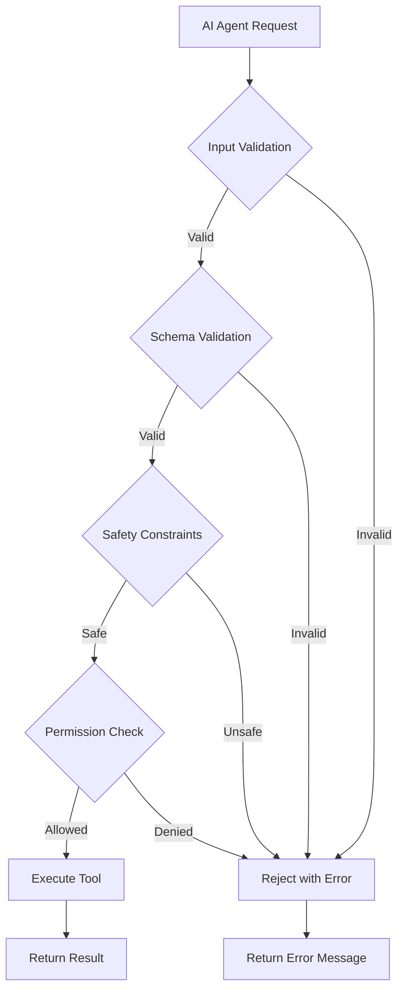
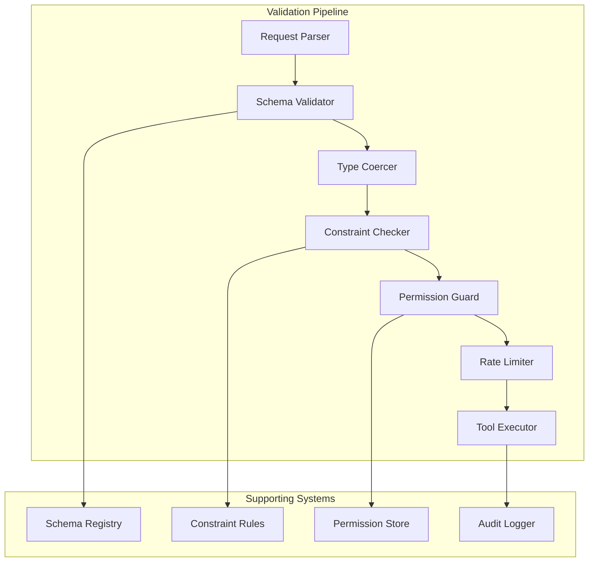
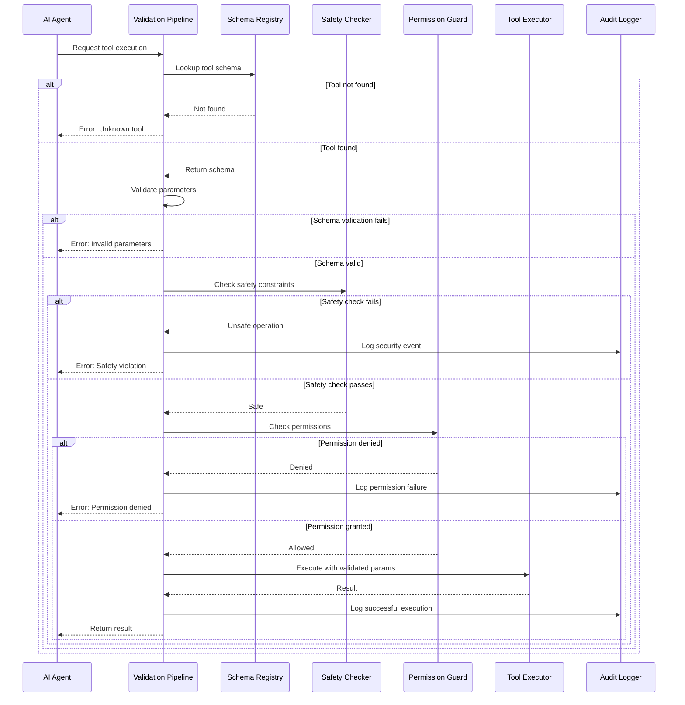

# How to Create Tool Validation

Author: [nawazdhandala](https://github.com/nawazdhandala)

Tags: AI Agents, Tool Use, Validation, Safety

Description: Learn to create tool validation for ensuring safe and correct tool usage by AI agents.

---

AI agents are becoming increasingly powerful, with the ability to execute tools, call APIs, and interact with external systems. However, with great power comes great responsibility. Without proper validation, an AI agent could execute dangerous commands, pass malformed data, or bypass critical safety constraints.

In this comprehensive guide, we will explore how to build robust tool validation systems that ensure AI agents use tools safely and correctly.

## Why Tool Validation Matters

When an AI agent has access to tools like file operations, database queries, or API calls, improper validation can lead to:

- **Data corruption**: Invalid inputs can corrupt databases or files
- **Security breaches**: Unvalidated paths could lead to directory traversal attacks
- **System crashes**: Malformed parameters can cause unexpected failures
- **Resource exhaustion**: Unbounded operations can consume excessive memory or CPU



## Architecture Overview

A comprehensive tool validation system consists of multiple layers working together:



## Step 1: Define Tool Schemas

The foundation of tool validation is a well-defined schema. We will use JSON Schema to define what parameters each tool accepts.

### Basic Schema Definition

```typescript
// tool-schema.ts
// This module defines the schema structure for AI agent tools

import Ajv, { JSONSchemaType } from 'ajv';
import addFormats from 'ajv-formats';

// Initialize the JSON Schema validator with strict mode
const ajv = new Ajv({
  allErrors: true,      // Collect all validation errors, not just the first
  coerceTypes: true,    // Automatically convert types when possible
  useDefaults: true     // Apply default values from schema
});

// Add format validators for common patterns (email, uri, date, etc.)
addFormats(ajv);

// Define the structure for a tool parameter
interface ToolParameter {
  type: string;
  description: string;
  required?: boolean;
  default?: unknown;
  enum?: unknown[];
  minimum?: number;
  maximum?: number;
  minLength?: number;
  maxLength?: number;
  pattern?: string;
  format?: string;
}

// Define the complete tool schema structure
interface ToolSchema {
  name: string;
  description: string;
  parameters: {
    type: 'object';
    properties: Record<string, ToolParameter>;
    required?: string[];
    additionalProperties?: boolean;
  };
  returns: {
    type: string;
    description: string;
  };
}

// Example: Schema for a file read tool
const fileReadSchema: ToolSchema = {
  name: 'read_file',
  description: 'Reads content from a file at the specified path',
  parameters: {
    type: 'object',
    properties: {
      file_path: {
        type: 'string',
        description: 'Absolute path to the file to read',
        minLength: 1,
        maxLength: 4096,
        // Pattern ensures the path starts with / and contains no null bytes
        pattern: '^/[^\\x00]*$'
      },
      encoding: {
        type: 'string',
        description: 'Character encoding for reading the file',
        enum: ['utf-8', 'ascii', 'latin1', 'base64'],
        default: 'utf-8'
      },
      max_bytes: {
        type: 'integer',
        description: 'Maximum number of bytes to read',
        minimum: 1,
        maximum: 10485760,  // 10MB limit
        default: 1048576   // 1MB default
      }
    },
    required: ['file_path'],
    additionalProperties: false  // Reject unknown parameters
  },
  returns: {
    type: 'string',
    description: 'The content of the file'
  }
};

export { ajv, ToolSchema, ToolParameter, fileReadSchema };
```

### Schema Registry

Maintain a centralized registry of all tool schemas:

```typescript
// schema-registry.ts
// Centralized registry for managing tool schemas

import { ToolSchema, ajv } from './tool-schema';
import { ValidateFunction } from 'ajv';

class SchemaRegistry {
  // Store schemas indexed by tool name
  private schemas: Map<string, ToolSchema> = new Map();

  // Cache compiled validators for performance
  private validators: Map<string, ValidateFunction> = new Map();

  /**
   * Register a new tool schema
   * @param schema - The tool schema to register
   * @throws Error if schema with same name already exists
   */
  register(schema: ToolSchema): void {
    if (this.schemas.has(schema.name)) {
      throw new Error(`Schema already registered for tool: ${schema.name}`);
    }

    // Compile the JSON Schema validator
    const validator = ajv.compile(schema.parameters);

    this.schemas.set(schema.name, schema);
    this.validators.set(schema.name, validator);

    console.log(`Registered schema for tool: ${schema.name}`);
  }

  /**
   * Get the schema for a specific tool
   * @param toolName - Name of the tool
   * @returns The tool schema or undefined if not found
   */
  getSchema(toolName: string): ToolSchema | undefined {
    return this.schemas.get(toolName);
  }

  /**
   * Get the compiled validator for a tool
   * @param toolName - Name of the tool
   * @returns The validator function or undefined if not found
   */
  getValidator(toolName: string): ValidateFunction | undefined {
    return this.validators.get(toolName);
  }

  /**
   * List all registered tool names
   * @returns Array of registered tool names
   */
  listTools(): string[] {
    return Array.from(this.schemas.keys());
  }

  /**
   * Remove a tool schema from the registry
   * @param toolName - Name of the tool to unregister
   */
  unregister(toolName: string): void {
    this.schemas.delete(toolName);
    this.validators.delete(toolName);
  }
}

// Export a singleton instance
export const schemaRegistry = new SchemaRegistry();
```

## Step 2: Implement Parameter Validation

With schemas defined, we need a validation engine that checks incoming parameters:

```typescript
// parameter-validator.ts
// Validates tool parameters against their schemas

import { schemaRegistry } from './schema-registry';
import { ErrorObject } from 'ajv';

// Result type for validation operations
interface ValidationResult {
  valid: boolean;
  errors: ValidationError[];
  coercedParams?: Record<string, unknown>;
}

// Structured error information
interface ValidationError {
  field: string;
  message: string;
  value?: unknown;
  constraint?: string;
}

class ParameterValidator {
  /**
   * Validate parameters for a specific tool
   * @param toolName - Name of the tool being called
   * @param params - Parameters provided by the AI agent
   * @returns Validation result with any errors or coerced parameters
   */
  validate(toolName: string, params: Record<string, unknown>): ValidationResult {
    // Check if the tool is registered
    const validator = schemaRegistry.getValidator(toolName);
    if (!validator) {
      return {
        valid: false,
        errors: [{
          field: '_tool',
          message: `Unknown tool: ${toolName}`,
          value: toolName
        }]
      };
    }

    // Create a copy to avoid mutating the original (for type coercion)
    const paramsCopy = JSON.parse(JSON.stringify(params));

    // Run the JSON Schema validation
    const valid = validator(paramsCopy);

    if (!valid) {
      // Transform AJV errors into our error format
      const errors = this.formatErrors(validator.errors || []);
      return { valid: false, errors };
    }

    // Return the possibly coerced parameters
    return {
      valid: true,
      errors: [],
      coercedParams: paramsCopy
    };
  }

  /**
   * Convert AJV error objects to our ValidationError format
   * @param ajvErrors - Errors from AJV validator
   * @returns Array of formatted validation errors
   */
  private formatErrors(ajvErrors: ErrorObject[]): ValidationError[] {
    return ajvErrors.map(error => {
      // Extract the field name from the instance path
      const field = error.instancePath
        ? error.instancePath.slice(1).replace(/\//g, '.')
        : error.params?.missingProperty || 'unknown';

      return {
        field,
        message: this.getErrorMessage(error),
        value: error.data,
        constraint: error.keyword
      };
    });
  }

  /**
   * Generate a human-readable error message
   * @param error - AJV error object
   * @returns Formatted error message string
   */
  private getErrorMessage(error: ErrorObject): string {
    switch (error.keyword) {
      case 'required':
        return `Missing required parameter: ${error.params.missingProperty}`;
      case 'type':
        return `Expected ${error.params.type}, got ${typeof error.data}`;
      case 'minimum':
        return `Value must be >= ${error.params.limit}`;
      case 'maximum':
        return `Value must be <= ${error.params.limit}`;
      case 'minLength':
        return `String must be at least ${error.params.limit} characters`;
      case 'maxLength':
        return `String must be at most ${error.params.limit} characters`;
      case 'pattern':
        return `Value does not match required pattern`;
      case 'enum':
        return `Value must be one of: ${error.params.allowedValues.join(', ')}`;
      case 'format':
        return `Invalid format, expected ${error.params.format}`;
      case 'additionalProperties':
        return `Unknown parameter: ${error.params.additionalProperty}`;
      default:
        return error.message || 'Validation failed';
    }
  }
}

export const parameterValidator = new ParameterValidator();
```

## Step 3: Add Safety Constraints

Beyond schema validation, we need safety constraints that prevent dangerous operations:

```typescript
// safety-constraints.ts
// Implements safety rules that go beyond schema validation

import * as path from 'path';

// Result of a safety check
interface SafetyCheckResult {
  safe: boolean;
  reason?: string;
  severity?: 'warning' | 'error' | 'critical';
}

// Definition of a safety constraint
interface SafetyConstraint {
  name: string;
  description: string;
  check: (toolName: string, params: Record<string, unknown>) => SafetyCheckResult;
}

class SafetyConstraintChecker {
  private constraints: SafetyConstraint[] = [];

  constructor() {
    // Register default safety constraints
    this.registerDefaults();
  }

  /**
   * Register the built-in safety constraints
   */
  private registerDefaults(): void {
    // Constraint: Prevent path traversal attacks
    this.addConstraint({
      name: 'path_traversal_prevention',
      description: 'Prevents directory traversal attacks via .. sequences',
      check: (toolName, params) => {
        // Check all string parameters that might be paths
        for (const [key, value] of Object.entries(params)) {
          if (typeof value === 'string' &&
              (key.includes('path') || key.includes('file') || key.includes('dir'))) {

            // Normalize the path and check for traversal
            const normalized = path.normalize(value);

            // Check for .. sequences that could escape allowed directories
            if (value.includes('..') || normalized.includes('..')) {
              return {
                safe: false,
                reason: `Path traversal detected in ${key}: ${value}`,
                severity: 'critical'
              };
            }
          }
        }
        return { safe: true };
      }
    });

    // Constraint: Block access to sensitive paths
    this.addConstraint({
      name: 'sensitive_path_protection',
      description: 'Blocks access to sensitive system directories and files',
      check: (toolName, params) => {
        const sensitivePaths = [
          '/etc/passwd',
          '/etc/shadow',
          '/etc/ssh',
          '/root',
          '/var/log/auth',
          '/.ssh',
          '/.aws',
          '/.gnupg',
          '/proc',
          '/sys'
        ];

        for (const [key, value] of Object.entries(params)) {
          if (typeof value === 'string') {
            const normalizedValue = path.normalize(value).toLowerCase();

            for (const sensitivePath of sensitivePaths) {
              if (normalizedValue.startsWith(sensitivePath) ||
                  normalizedValue.includes(sensitivePath)) {
                return {
                  safe: false,
                  reason: `Access to sensitive path blocked: ${value}`,
                  severity: 'critical'
                };
              }
            }
          }
        }
        return { safe: true };
      }
    });

    // Constraint: Limit resource consumption
    this.addConstraint({
      name: 'resource_limits',
      description: 'Ensures operations stay within resource limits',
      check: (toolName, params) => {
        // Check for suspiciously large numeric values
        const limits: Record<string, number> = {
          max_bytes: 100 * 1024 * 1024,      // 100MB
          limit: 10000,                       // 10K records
          timeout: 300000,                    // 5 minutes
          max_depth: 20,                      // Directory depth
          batch_size: 1000                    // Batch operations
        };

        for (const [key, value] of Object.entries(params)) {
          if (typeof value === 'number' && limits[key]) {
            if (value > limits[key]) {
              return {
                safe: false,
                reason: `${key} exceeds maximum allowed value of ${limits[key]}`,
                severity: 'error'
              };
            }
          }
        }
        return { safe: true };
      }
    });

    // Constraint: Prevent command injection
    this.addConstraint({
      name: 'command_injection_prevention',
      description: 'Blocks potential command injection patterns',
      check: (toolName, params) => {
        // Dangerous patterns that could indicate injection attempts
        const dangerousPatterns = [
          /[;&|`$]/,                    // Shell metacharacters
          /\$\([^)]+\)/,                // Command substitution
          /`[^`]+`/,                    // Backtick command substitution
          /\|\|/,                       // OR operator
          /&&/,                         // AND operator
          />\s*\/dev/,                  // Redirect to device
          /rm\s+-rf/,                   // Dangerous rm command
          /:(){ :|:& };:/               // Fork bomb pattern
        ];

        for (const [key, value] of Object.entries(params)) {
          if (typeof value === 'string') {
            for (const pattern of dangerousPatterns) {
              if (pattern.test(value)) {
                return {
                  safe: false,
                  reason: `Potential command injection detected in ${key}`,
                  severity: 'critical'
                };
              }
            }
          }
        }
        return { safe: true };
      }
    });
  }

  /**
   * Add a custom safety constraint
   * @param constraint - The constraint to add
   */
  addConstraint(constraint: SafetyConstraint): void {
    this.constraints.push(constraint);
  }

  /**
   * Run all safety checks on the given parameters
   * @param toolName - Name of the tool being validated
   * @param params - Parameters to check
   * @returns Combined result of all safety checks
   */
  checkAll(toolName: string, params: Record<string, unknown>): SafetyCheckResult {
    for (const constraint of this.constraints) {
      const result = constraint.check(toolName, params);

      if (!result.safe) {
        console.warn(`Safety constraint "${constraint.name}" failed:`, result.reason);
        return result;
      }
    }

    return { safe: true };
  }
}

export const safetyChecker = new SafetyConstraintChecker();
```

## Step 4: Implement Permission Guards

Different AI agents may have different permission levels:

```typescript
// permission-guard.ts
// Controls what tools and operations each agent can access

// Permission levels from least to most privileged
enum PermissionLevel {
  READ_ONLY = 1,
  READ_WRITE = 2,
  ADMIN = 3,
  SUPER_ADMIN = 4
}

// Categories of tool operations
enum ToolCategory {
  FILE_READ = 'file_read',
  FILE_WRITE = 'file_write',
  FILE_DELETE = 'file_delete',
  DATABASE_READ = 'database_read',
  DATABASE_WRITE = 'database_write',
  NETWORK = 'network',
  SYSTEM = 'system',
  ADMIN = 'admin'
}

// Agent permission configuration
interface AgentPermissions {
  agentId: string;
  level: PermissionLevel;
  allowedCategories: ToolCategory[];
  deniedTools: string[];      // Explicitly blocked tools
  allowedPaths: string[];     // Allowed file system paths
  rateLimit: number;          // Requests per minute
}

// Maps tools to their required categories
const toolCategoryMap: Record<string, ToolCategory> = {
  'read_file': ToolCategory.FILE_READ,
  'write_file': ToolCategory.FILE_WRITE,
  'delete_file': ToolCategory.FILE_DELETE,
  'list_directory': ToolCategory.FILE_READ,
  'query_database': ToolCategory.DATABASE_READ,
  'insert_record': ToolCategory.DATABASE_WRITE,
  'http_request': ToolCategory.NETWORK,
  'execute_command': ToolCategory.SYSTEM,
  'manage_users': ToolCategory.ADMIN
};

// Maps permission levels to allowed categories
const levelCategoryMap: Record<PermissionLevel, ToolCategory[]> = {
  [PermissionLevel.READ_ONLY]: [
    ToolCategory.FILE_READ,
    ToolCategory.DATABASE_READ
  ],
  [PermissionLevel.READ_WRITE]: [
    ToolCategory.FILE_READ,
    ToolCategory.FILE_WRITE,
    ToolCategory.DATABASE_READ,
    ToolCategory.DATABASE_WRITE,
    ToolCategory.NETWORK
  ],
  [PermissionLevel.ADMIN]: [
    ToolCategory.FILE_READ,
    ToolCategory.FILE_WRITE,
    ToolCategory.FILE_DELETE,
    ToolCategory.DATABASE_READ,
    ToolCategory.DATABASE_WRITE,
    ToolCategory.NETWORK,
    ToolCategory.SYSTEM
  ],
  [PermissionLevel.SUPER_ADMIN]: [
    ToolCategory.FILE_READ,
    ToolCategory.FILE_WRITE,
    ToolCategory.FILE_DELETE,
    ToolCategory.DATABASE_READ,
    ToolCategory.DATABASE_WRITE,
    ToolCategory.NETWORK,
    ToolCategory.SYSTEM,
    ToolCategory.ADMIN
  ]
};

class PermissionGuard {
  // Store agent permissions
  private agentPermissions: Map<string, AgentPermissions> = new Map();

  // Track request counts for rate limiting
  private requestCounts: Map<string, { count: number; resetTime: number }> = new Map();

  /**
   * Register permissions for an agent
   * @param permissions - The permission configuration
   */
  registerAgent(permissions: AgentPermissions): void {
    this.agentPermissions.set(permissions.agentId, permissions);
  }

  /**
   * Check if an agent is allowed to use a specific tool
   * @param agentId - The agent making the request
   * @param toolName - The tool being requested
   * @param params - The parameters being passed
   * @returns Whether the operation is permitted
   */
  checkPermission(
    agentId: string,
    toolName: string,
    params: Record<string, unknown>
  ): { allowed: boolean; reason?: string } {

    const permissions = this.agentPermissions.get(agentId);

    // Unknown agents are denied by default
    if (!permissions) {
      return {
        allowed: false,
        reason: 'Agent not registered in permission system'
      };
    }

    // Check if tool is explicitly denied
    if (permissions.deniedTools.includes(toolName)) {
      return {
        allowed: false,
        reason: `Tool "${toolName}" is explicitly denied for this agent`
      };
    }

    // Check rate limits
    const rateLimitResult = this.checkRateLimit(agentId, permissions.rateLimit);
    if (!rateLimitResult.allowed) {
      return rateLimitResult;
    }

    // Get the category for this tool
    const toolCategory = toolCategoryMap[toolName];
    if (!toolCategory) {
      return {
        allowed: false,
        reason: `Tool "${toolName}" has no category mapping`
      };
    }

    // Check if the agent's level allows this category
    const allowedByLevel = levelCategoryMap[permissions.level];
    if (!allowedByLevel.includes(toolCategory)) {
      return {
        allowed: false,
        reason: `Permission level ${PermissionLevel[permissions.level]} does not allow ${toolCategory}`
      };
    }

    // Check path permissions for file operations
    if (this.isFileOperation(toolCategory)) {
      const pathCheck = this.checkPathPermission(params, permissions.allowedPaths);
      if (!pathCheck.allowed) {
        return pathCheck;
      }
    }

    return { allowed: true };
  }

  /**
   * Check if the operation is within rate limits
   */
  private checkRateLimit(
    agentId: string,
    limit: number
  ): { allowed: boolean; reason?: string } {
    const now = Date.now();
    const record = this.requestCounts.get(agentId);

    if (!record || now > record.resetTime) {
      // Start a new rate limit window
      this.requestCounts.set(agentId, {
        count: 1,
        resetTime: now + 60000  // 1 minute window
      });
      return { allowed: true };
    }

    if (record.count >= limit) {
      return {
        allowed: false,
        reason: `Rate limit exceeded: ${limit} requests per minute`
      };
    }

    record.count++;
    return { allowed: true };
  }

  /**
   * Check if an operation involves file access
   */
  private isFileOperation(category: ToolCategory): boolean {
    return [
      ToolCategory.FILE_READ,
      ToolCategory.FILE_WRITE,
      ToolCategory.FILE_DELETE
    ].includes(category);
  }

  /**
   * Verify the requested path is within allowed directories
   */
  private checkPathPermission(
    params: Record<string, unknown>,
    allowedPaths: string[]
  ): { allowed: boolean; reason?: string } {
    // Extract path from common parameter names
    const pathValue = params.file_path || params.path || params.directory;

    if (typeof pathValue !== 'string') {
      return { allowed: true };  // No path to check
    }

    // Check if the path starts with any allowed path
    const isAllowed = allowedPaths.some(allowed =>
      pathValue.startsWith(allowed)
    );

    if (!isAllowed) {
      return {
        allowed: false,
        reason: `Path "${pathValue}" is not within allowed directories`
      };
    }

    return { allowed: true };
  }
}

export const permissionGuard = new PermissionGuard();
export { PermissionLevel, ToolCategory, AgentPermissions };
```

## Step 5: Build the Validation Pipeline

Now we combine all components into a unified validation pipeline:

```typescript
// validation-pipeline.ts
// Orchestrates all validation steps into a single pipeline

import { parameterValidator } from './parameter-validator';
import { safetyChecker } from './safety-constraints';
import { permissionGuard } from './permission-guard';
import { schemaRegistry } from './schema-registry';

// Complete result of the validation pipeline
interface PipelineResult {
  success: boolean;
  stage?: string;                        // Which stage failed
  errors?: Array<{
    code: string;
    message: string;
    details?: unknown;
  }>;
  validatedParams?: Record<string, unknown>;
  metadata?: {
    toolName: string;
    agentId: string;
    timestamp: number;
    validationTimeMs: number;
  };
}

// Options for pipeline execution
interface PipelineOptions {
  skipPermissionCheck?: boolean;   // For internal/system calls
  skipSafetyCheck?: boolean;       // For trusted inputs
  auditLog?: boolean;              // Whether to log this validation
}

class ToolValidationPipeline {
  /**
   * Run the complete validation pipeline
   * @param agentId - ID of the agent making the request
   * @param toolName - Name of the tool to validate
   * @param params - Parameters passed to the tool
   * @param options - Pipeline configuration options
   * @returns Complete validation result
   */
  async validate(
    agentId: string,
    toolName: string,
    params: Record<string, unknown>,
    options: PipelineOptions = {}
  ): Promise<PipelineResult> {
    const startTime = Date.now();

    try {
      // Stage 1: Verify tool exists
      const schema = schemaRegistry.getSchema(toolName);
      if (!schema) {
        return this.failure('tool_lookup', [{
          code: 'UNKNOWN_TOOL',
          message: `Tool "${toolName}" is not registered`,
          details: { availableTools: schemaRegistry.listTools() }
        }]);
      }

      // Stage 2: Schema validation
      const schemaResult = parameterValidator.validate(toolName, params);
      if (!schemaResult.valid) {
        return this.failure('schema_validation', schemaResult.errors.map(e => ({
          code: 'SCHEMA_ERROR',
          message: e.message,
          details: { field: e.field, value: e.value, constraint: e.constraint }
        })));
      }

      // Use coerced parameters from this point forward
      const validatedParams = schemaResult.coercedParams!;

      // Stage 3: Safety constraints
      if (!options.skipSafetyCheck) {
        const safetyResult = safetyChecker.checkAll(toolName, validatedParams);
        if (!safetyResult.safe) {
          return this.failure('safety_check', [{
            code: 'SAFETY_VIOLATION',
            message: safetyResult.reason || 'Safety check failed',
            details: { severity: safetyResult.severity }
          }]);
        }
      }

      // Stage 4: Permission check
      if (!options.skipPermissionCheck) {
        const permResult = permissionGuard.checkPermission(
          agentId,
          toolName,
          validatedParams
        );
        if (!permResult.allowed) {
          return this.failure('permission_check', [{
            code: 'PERMISSION_DENIED',
            message: permResult.reason || 'Permission denied',
            details: { agentId, toolName }
          }]);
        }
      }

      // All validations passed
      const validationTimeMs = Date.now() - startTime;

      // Log successful validation if auditing is enabled
      if (options.auditLog) {
        this.logAudit(agentId, toolName, validatedParams, 'success', validationTimeMs);
      }

      return {
        success: true,
        validatedParams,
        metadata: {
          toolName,
          agentId,
          timestamp: Date.now(),
          validationTimeMs
        }
      };

    } catch (error) {
      // Handle unexpected errors
      return this.failure('internal_error', [{
        code: 'INTERNAL_ERROR',
        message: error instanceof Error ? error.message : 'Unknown error',
        details: { error }
      }]);
    }
  }

  /**
   * Create a failure result
   */
  private failure(
    stage: string,
    errors: Array<{ code: string; message: string; details?: unknown }>
  ): PipelineResult {
    return { success: false, stage, errors };
  }

  /**
   * Log validation attempt for auditing
   */
  private logAudit(
    agentId: string,
    toolName: string,
    params: Record<string, unknown>,
    result: string,
    timeMs: number
  ): void {
    // In production, this would write to an audit log
    console.log(JSON.stringify({
      type: 'tool_validation_audit',
      timestamp: new Date().toISOString(),
      agentId,
      toolName,
      result,
      validationTimeMs: timeMs,
      // Redact sensitive parameter values
      parameterKeys: Object.keys(params)
    }));
  }
}

export const validationPipeline = new ToolValidationPipeline();
```

## Step 6: Implement Custom Validators

Sometimes you need validation logic specific to certain tools:

```typescript
// custom-validators.ts
// Tool-specific validation logic that goes beyond schema validation

// Type for custom validator functions
type CustomValidator = (
  params: Record<string, unknown>
) => { valid: boolean; error?: string };

// Registry for custom validators
const customValidators: Map<string, CustomValidator[]> = new Map();

/**
 * Register a custom validator for a specific tool
 * @param toolName - The tool this validator applies to
 * @param validator - The validation function
 */
function registerCustomValidator(
  toolName: string,
  validator: CustomValidator
): void {
  const existing = customValidators.get(toolName) || [];
  existing.push(validator);
  customValidators.set(toolName, existing);
}

/**
 * Run all custom validators for a tool
 * @param toolName - The tool being validated
 * @param params - Parameters to validate
 * @returns Combined validation result
 */
function runCustomValidators(
  toolName: string,
  params: Record<string, unknown>
): { valid: boolean; errors: string[] } {
  const validators = customValidators.get(toolName) || [];
  const errors: string[] = [];

  for (const validator of validators) {
    const result = validator(params);
    if (!result.valid && result.error) {
      errors.push(result.error);
    }
  }

  return { valid: errors.length === 0, errors };
}

// Example: Custom validator for database query tool
registerCustomValidator('query_database', (params) => {
  const query = params.query as string;

  // Prevent potentially dangerous SQL patterns
  const dangerousSqlPatterns = [
    /DROP\s+TABLE/i,
    /DROP\s+DATABASE/i,
    /TRUNCATE/i,
    /DELETE\s+FROM\s+\w+\s*$/i,  // DELETE without WHERE
    /UPDATE\s+\w+\s+SET\s+.*$/i, // UPDATE without WHERE
    /--/,                         // SQL comments (potential injection)
    /\/\*/                        // Block comments
  ];

  for (const pattern of dangerousSqlPatterns) {
    if (pattern.test(query)) {
      return {
        valid: false,
        error: 'Query contains potentially dangerous SQL pattern'
      };
    }
  }

  return { valid: true };
});

// Example: Custom validator for HTTP request tool
registerCustomValidator('http_request', (params) => {
  const url = params.url as string;

  // Parse the URL to check the host
  try {
    const parsed = new URL(url);

    // Block requests to internal networks
    const blockedHosts = [
      'localhost',
      '127.0.0.1',
      '0.0.0.0',
      '169.254.',      // Link-local
      '10.',           // Private network
      '172.16.',       // Private network
      '192.168.'       // Private network
    ];

    for (const blocked of blockedHosts) {
      if (parsed.hostname.startsWith(blocked) || parsed.hostname === blocked) {
        return {
          valid: false,
          error: `Requests to internal/private networks are not allowed: ${parsed.hostname}`
        };
      }
    }

    // Block dangerous protocols
    if (!['http:', 'https:'].includes(parsed.protocol)) {
      return {
        valid: false,
        error: `Protocol "${parsed.protocol}" is not allowed`
      };
    }

  } catch (e) {
    return { valid: false, error: 'Invalid URL format' };
  }

  return { valid: true };
});

// Example: Custom validator for file write operations
registerCustomValidator('write_file', (params) => {
  const content = params.content as string;
  const filePath = params.file_path as string;

  // Prevent writing executable code to certain extensions
  const dangerousExtensions = ['.sh', '.bash', '.exe', '.bat', '.cmd', '.ps1'];
  const extension = filePath.substring(filePath.lastIndexOf('.')).toLowerCase();

  if (dangerousExtensions.includes(extension)) {
    // Check if content contains shebang or executable patterns
    if (content.startsWith('#!') || content.includes('rm -rf')) {
      return {
        valid: false,
        error: 'Writing executable scripts with dangerous content is not allowed'
      };
    }
  }

  // Limit file size
  const maxSizeBytes = 10 * 1024 * 1024; // 10MB
  if (content.length > maxSizeBytes) {
    return {
      valid: false,
      error: `Content exceeds maximum size of ${maxSizeBytes} bytes`
    };
  }

  return { valid: true };
});

export { registerCustomValidator, runCustomValidators };
```

## Step 7: Add Error Handling and Logging

Proper error handling makes debugging easier:

```typescript
// error-handling.ts
// Structured error handling and logging for the validation system

// Base class for validation errors
class ValidationError extends Error {
  public readonly code: string;
  public readonly details: Record<string, unknown>;
  public readonly timestamp: Date;

  constructor(
    code: string,
    message: string,
    details: Record<string, unknown> = {}
  ) {
    super(message);
    this.name = 'ValidationError';
    this.code = code;
    this.details = details;
    this.timestamp = new Date();
  }

  /**
   * Convert error to a JSON-serializable format
   */
  toJSON(): Record<string, unknown> {
    return {
      name: this.name,
      code: this.code,
      message: this.message,
      details: this.details,
      timestamp: this.timestamp.toISOString()
    };
  }
}

// Specific error types for different validation failures
class SchemaValidationError extends ValidationError {
  constructor(field: string, message: string, value?: unknown) {
    super('SCHEMA_VALIDATION_ERROR', message, { field, value });
    this.name = 'SchemaValidationError';
  }
}

class SafetyConstraintError extends ValidationError {
  constructor(constraint: string, message: string, severity: string) {
    super('SAFETY_CONSTRAINT_ERROR', message, { constraint, severity });
    this.name = 'SafetyConstraintError';
  }
}

class PermissionDeniedError extends ValidationError {
  constructor(agentId: string, toolName: string, reason: string) {
    super('PERMISSION_DENIED_ERROR', reason, { agentId, toolName });
    this.name = 'PermissionDeniedError';
  }
}

class RateLimitError extends ValidationError {
  constructor(agentId: string, limit: number, windowMs: number) {
    super(
      'RATE_LIMIT_ERROR',
      `Rate limit of ${limit} requests per ${windowMs}ms exceeded`,
      { agentId, limit, windowMs }
    );
    this.name = 'RateLimitError';
  }
}

// Log levels for validation events
enum LogLevel {
  DEBUG = 'debug',
  INFO = 'info',
  WARN = 'warn',
  ERROR = 'error'
}

// Validation event logger
class ValidationLogger {
  private logLevel: LogLevel = LogLevel.INFO;

  /**
   * Set the minimum log level
   */
  setLevel(level: LogLevel): void {
    this.logLevel = level;
  }

  /**
   * Log a validation event
   */
  log(
    level: LogLevel,
    event: string,
    data: Record<string, unknown>
  ): void {
    // Check if this level should be logged
    const levels = [LogLevel.DEBUG, LogLevel.INFO, LogLevel.WARN, LogLevel.ERROR];
    if (levels.indexOf(level) < levels.indexOf(this.logLevel)) {
      return;
    }

    const logEntry = {
      timestamp: new Date().toISOString(),
      level,
      event,
      ...data
    };

    // In production, send to your logging system
    switch (level) {
      case LogLevel.DEBUG:
        console.debug(JSON.stringify(logEntry));
        break;
      case LogLevel.INFO:
        console.info(JSON.stringify(logEntry));
        break;
      case LogLevel.WARN:
        console.warn(JSON.stringify(logEntry));
        break;
      case LogLevel.ERROR:
        console.error(JSON.stringify(logEntry));
        break;
    }
  }

  /**
   * Log a successful validation
   */
  logSuccess(agentId: string, toolName: string, durationMs: number): void {
    this.log(LogLevel.INFO, 'validation_success', {
      agentId,
      toolName,
      durationMs
    });
  }

  /**
   * Log a validation failure
   */
  logFailure(
    agentId: string,
    toolName: string,
    error: ValidationError
  ): void {
    this.log(LogLevel.WARN, 'validation_failure', {
      agentId,
      toolName,
      error: error.toJSON()
    });
  }

  /**
   * Log a security-related event
   */
  logSecurityEvent(
    agentId: string,
    toolName: string,
    event: string,
    details: Record<string, unknown>
  ): void {
    this.log(LogLevel.ERROR, 'security_event', {
      agentId,
      toolName,
      event,
      details
    });
  }
}

export const validationLogger = new ValidationLogger();
export {
  ValidationError,
  SchemaValidationError,
  SafetyConstraintError,
  PermissionDeniedError,
  RateLimitError,
  LogLevel
};
```

## Complete Integration Example

Here is how everything comes together:

```typescript
// main.ts
// Complete example showing the validation system in action

import { schemaRegistry } from './schema-registry';
import { validationPipeline } from './validation-pipeline';
import { permissionGuard, PermissionLevel, ToolCategory } from './permission-guard';
import { fileReadSchema } from './tool-schema';

// Step 1: Register tool schemas
schemaRegistry.register(fileReadSchema);

schemaRegistry.register({
  name: 'write_file',
  description: 'Writes content to a file',
  parameters: {
    type: 'object',
    properties: {
      file_path: {
        type: 'string',
        description: 'Path to write the file',
        minLength: 1,
        maxLength: 4096,
        pattern: '^/[^\\x00]*$'
      },
      content: {
        type: 'string',
        description: 'Content to write',
        maxLength: 10485760  // 10MB
      },
      append: {
        type: 'boolean',
        description: 'Whether to append to existing file',
        default: false
      }
    },
    required: ['file_path', 'content'],
    additionalProperties: false
  },
  returns: {
    type: 'boolean',
    description: 'True if write was successful'
  }
});

// Step 2: Register agent permissions
permissionGuard.registerAgent({
  agentId: 'agent-001',
  level: PermissionLevel.READ_WRITE,
  allowedCategories: [
    ToolCategory.FILE_READ,
    ToolCategory.FILE_WRITE
  ],
  deniedTools: ['delete_file', 'execute_command'],
  allowedPaths: ['/home/user/projects/', '/tmp/'],
  rateLimit: 100  // 100 requests per minute
});

permissionGuard.registerAgent({
  agentId: 'agent-002',
  level: PermissionLevel.READ_ONLY,
  allowedCategories: [ToolCategory.FILE_READ],
  deniedTools: [],
  allowedPaths: ['/home/user/projects/'],
  rateLimit: 50
});

// Step 3: Validate tool calls
async function handleToolCall(
  agentId: string,
  toolName: string,
  params: Record<string, unknown>
): Promise<void> {
  console.log(`\n${'='.repeat(60)}`);
  console.log(`Agent: ${agentId}`);
  console.log(`Tool: ${toolName}`);
  console.log(`Params: ${JSON.stringify(params, null, 2)}`);

  const result = await validationPipeline.validate(
    agentId,
    toolName,
    params,
    { auditLog: true }
  );

  if (result.success) {
    console.log('VALIDATION PASSED');
    console.log(`Validated params: ${JSON.stringify(result.validatedParams, null, 2)}`);
    console.log(`Validation time: ${result.metadata?.validationTimeMs}ms`);

    // Here you would actually execute the tool
    // await executeTool(toolName, result.validatedParams);

  } else {
    console.log('VALIDATION FAILED');
    console.log(`Failed at stage: ${result.stage}`);
    console.log(`Errors: ${JSON.stringify(result.errors, null, 2)}`);
  }
}

// Test cases demonstrating validation scenarios
async function runTests(): Promise<void> {
  // Test 1: Valid read request
  await handleToolCall('agent-001', 'read_file', {
    file_path: '/home/user/projects/readme.md',
    encoding: 'utf-8'
  });

  // Test 2: Path traversal attempt (should fail)
  await handleToolCall('agent-001', 'read_file', {
    file_path: '/home/user/projects/../../../etc/passwd'
  });

  // Test 3: Unauthorized path (should fail)
  await handleToolCall('agent-001', 'read_file', {
    file_path: '/etc/shadow'
  });

  // Test 4: Read-only agent trying to write (should fail)
  await handleToolCall('agent-002', 'write_file', {
    file_path: '/home/user/projects/test.txt',
    content: 'Hello, World!'
  });

  // Test 5: Unknown tool (should fail)
  await handleToolCall('agent-001', 'hack_system', {
    target: 'mainframe'
  });

  // Test 6: Invalid parameter type (should fail)
  await handleToolCall('agent-001', 'read_file', {
    file_path: 12345  // Should be a string
  });

  // Test 7: Missing required parameter (should fail)
  await handleToolCall('agent-001', 'read_file', {
    encoding: 'utf-8'
    // Missing file_path
  });
}

// Run the tests
runTests().catch(console.error);
```

## Validation Flow Diagram

The complete validation flow can be visualized as:



## Best Practices

When implementing tool validation for AI agents, follow these best practices:

### 1. Defense in Depth

Never rely on a single validation layer. Combine multiple checks:

```typescript
// Always validate at multiple levels
const validateToolCall = async (agentId: string, toolName: string, params: unknown) => {
  // Layer 1: Input sanitization
  const sanitized = sanitizeInput(params);

  // Layer 2: Schema validation
  const schemaResult = validateSchema(toolName, sanitized);

  // Layer 3: Safety constraints
  const safetyResult = checkSafety(toolName, sanitized);

  // Layer 4: Permission verification
  const permResult = checkPermissions(agentId, toolName, sanitized);

  // Layer 5: Custom business rules
  const customResult = runCustomValidators(toolName, sanitized);

  // All layers must pass
  return schemaResult.valid &&
         safetyResult.safe &&
         permResult.allowed &&
         customResult.valid;
};
```

### 2. Fail Securely

When validation fails, always fail closed (deny access):

```typescript
// Good: Deny by default
if (!validationResult.success) {
  return { error: 'Validation failed', allowed: false };
}

// Bad: Allow on error
if (validationResult.error) {
  console.log('Validation had an error, allowing anyway');
  return { allowed: true };  // NEVER DO THIS
}
```

### 3. Log Everything

Maintain comprehensive audit logs for security analysis:

```typescript
// Log all validation attempts
const logValidation = (event: ValidationEvent) => {
  const entry = {
    timestamp: new Date().toISOString(),
    agentId: event.agentId,
    toolName: event.toolName,
    result: event.result,
    // Redact sensitive values but keep structure
    parameterKeys: Object.keys(event.params),
    duration: event.durationMs,
    errors: event.errors
  };

  // Send to your logging system
  auditLogger.log(entry);
};
```

### 4. Keep Schemas Updated

Regularly review and update tool schemas:

```typescript
// Version your schemas
const fileReadSchemaV2 = {
  name: 'read_file',
  version: '2.0.0',
  parameters: {
    // Updated schema with new constraints
  }
};

// Track schema changes
schemaRegistry.register(fileReadSchemaV2, {
  deprecates: 'read_file@1.0.0',
  migrationNotes: 'Added max_bytes limit'
});
```

## Conclusion

Building robust tool validation for AI agents requires multiple layers of protection working together. By implementing schema validation, safety constraints, permission guards, and comprehensive logging, you can ensure that AI agents use tools safely and correctly.

The key takeaways are:

1. **Define clear schemas** for all tools with proper constraints
2. **Implement safety checks** that go beyond basic schema validation
3. **Use permission systems** to control what agents can access
4. **Log everything** for auditing and debugging
5. **Fail securely** by denying access when validation fails
6. **Test thoroughly** with both valid and malicious inputs

With these practices in place, you can confidently give AI agents access to powerful tools while maintaining security and reliability.

---

*Want to learn more about AI agent development? Check out our other posts on [MCP Server integration](https://oneuptime.com/blog/post/2025-07-01-oneuptime-mcp-server-ai-observability/view) and [observability for AI systems](https://oneuptime.com/blog).*
