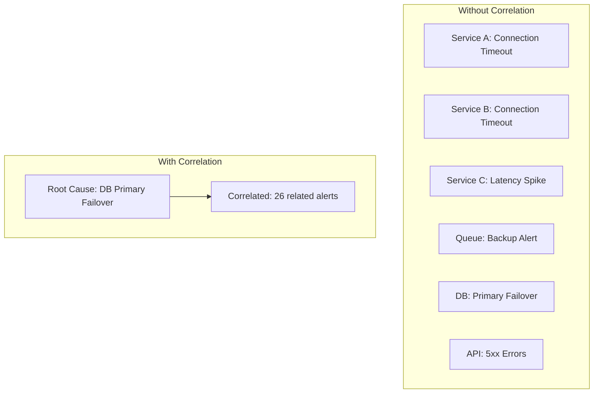
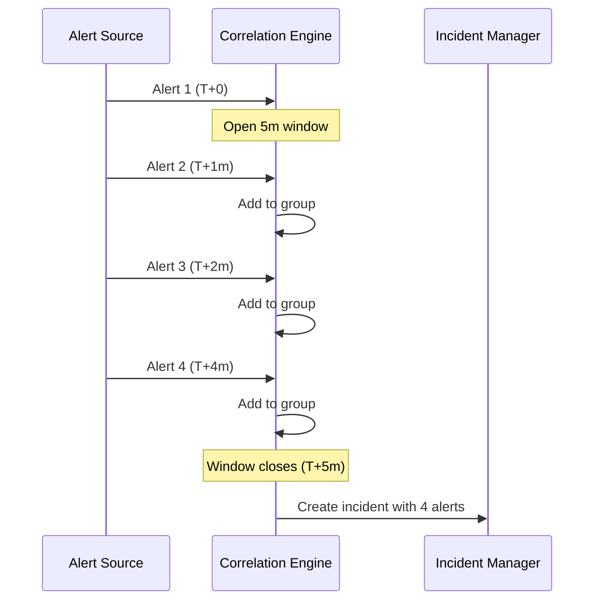
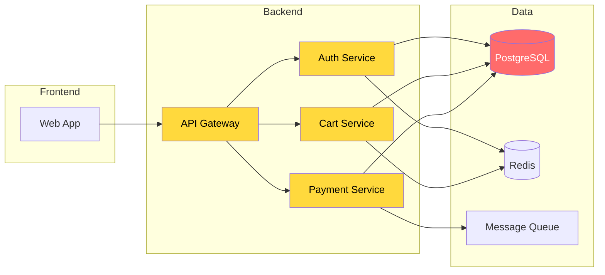
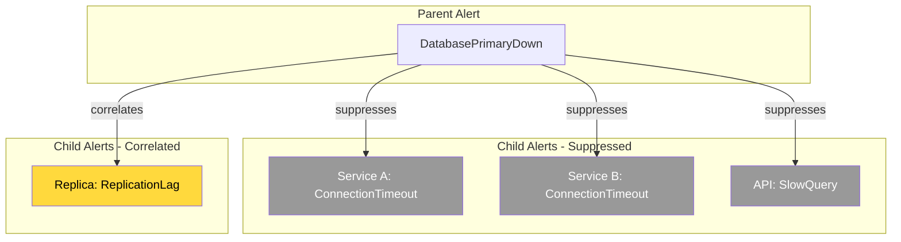
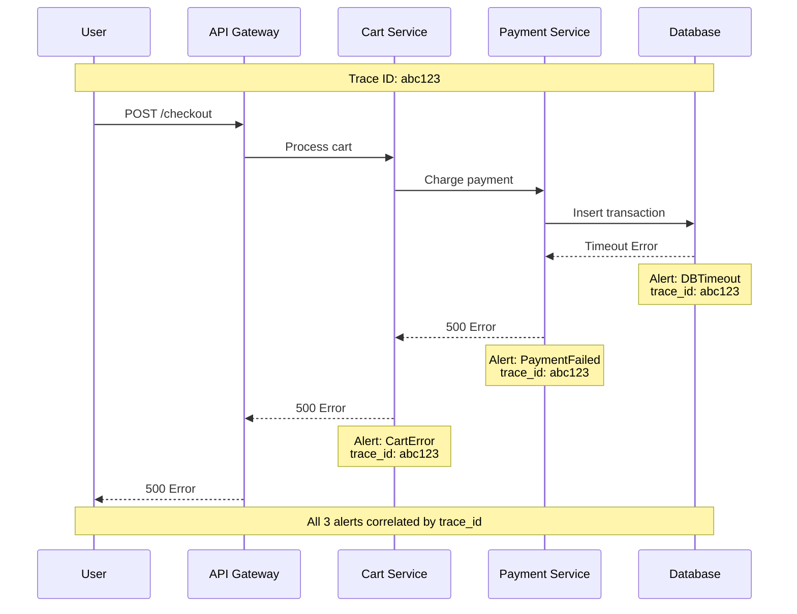
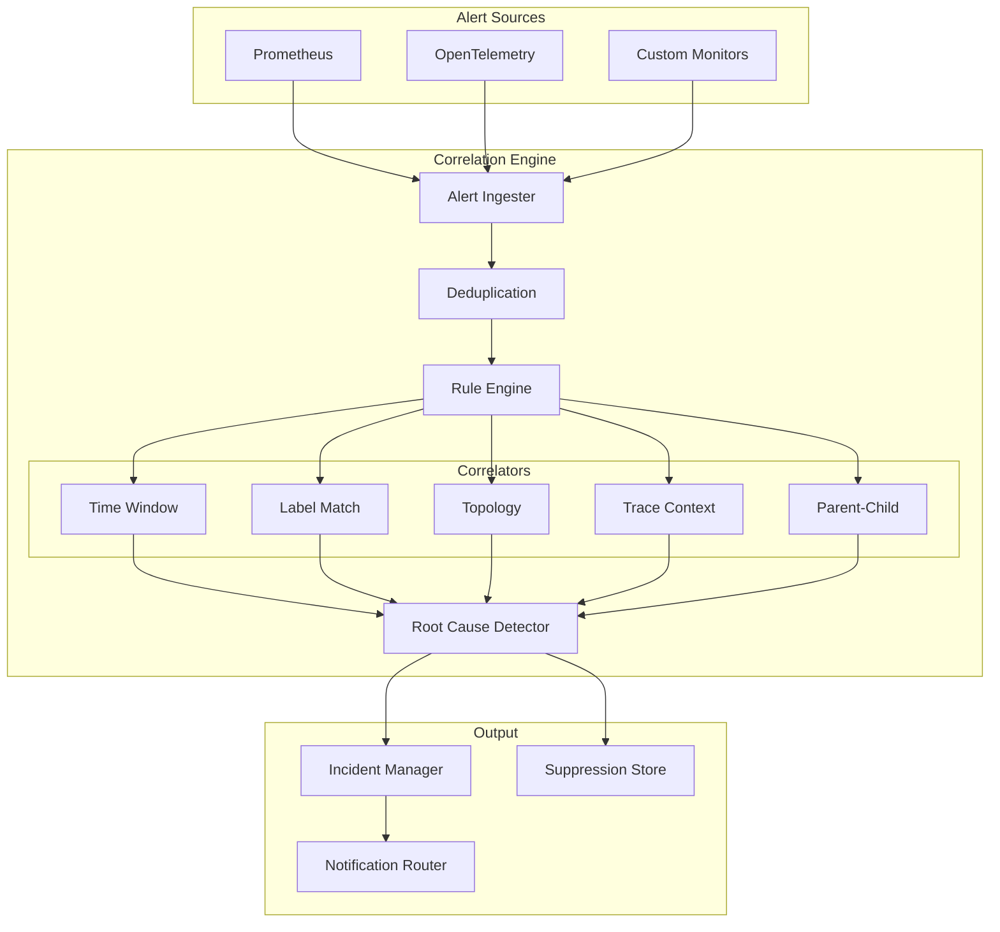

# How to Implement Alert Correlation Rules

Author: [nawazdhandala](https://github.com/nawazdhandala)

Tags: Alerting, Observability, SRE, Monitoring

Description: Learn how to correlate related alerts to reduce noise and identify root causes faster.

---

Alert fatigue is one of the biggest challenges facing on-call engineers today. When a single infrastructure issue triggers dozens of independent alerts, the signal gets buried in noise. Alert correlation is the practice of grouping related alerts together, identifying parent-child relationships, and surfacing the root cause instead of symptoms.

This guide covers practical strategies for implementing alert correlation rules in your alerting system, complete with configuration examples and architectural patterns.

---

## Why Alert Correlation Matters

Consider a database failover event. Without correlation, you might receive:

- 15 service health alerts (connection timeouts)
- 8 API latency alerts (slow queries)
- 3 queue backup alerts (blocked consumers)
- 1 database primary alert (the actual issue)

That's 27 alerts for a single incident. With proper correlation, you get one alert group with the database issue identified as the root cause.



---

## Core Correlation Strategies

### 1. Time-Window Correlation

The simplest form of correlation: alerts that fire within a defined time window are likely related.

```yaml
# Time-window correlation rule
correlation_rules:
  - name: time-window-basic
    type: time_window
    config:
      window_duration: 5m
      min_alerts: 3
      group_by:
        - severity
        - environment
    actions:
      - create_incident
      - suppress_duplicates
```

**How it works:**

1. Alert fires at T+0
2. System opens a correlation window (5 minutes)
3. Subsequent alerts matching criteria join the group
4. After window closes, group is finalized



**TypeScript implementation:**

```typescript
interface Alert {
  id: string;
  timestamp: Date;
  labels: Record<string, string>;
  severity: 'critical' | 'warning' | 'info';
  service: string;
  message: string;
}

interface CorrelationGroup {
  id: string;
  rootAlert: Alert;
  correlatedAlerts: Alert[];
  windowStart: Date;
  windowEnd: Date;
  status: 'open' | 'closed';
}

class TimeWindowCorrelator {
  private groups: Map<string, CorrelationGroup> = new Map();
  private windowDuration: number; // milliseconds

  constructor(windowDurationMs: number = 300000) { // 5 minutes default
    this.windowDuration = windowDurationMs;
  }

  private generateGroupKey(alert: Alert, groupBy: string[]): string {
    return groupBy
      .map(key => alert.labels[key] || alert[key as keyof Alert] || 'unknown')
      .join(':');
  }

  correlate(alert: Alert, groupBy: string[] = ['environment', 'severity']): CorrelationGroup {
    const groupKey = this.generateGroupKey(alert, groupBy);
    const now = new Date();

    // Check for existing open group
    const existingGroup = this.groups.get(groupKey);

    if (existingGroup && existingGroup.status === 'open') {
      // Check if within window
      if (now <= existingGroup.windowEnd) {
        existingGroup.correlatedAlerts.push(alert);
        return existingGroup;
      } else {
        // Window expired, close group
        existingGroup.status = 'closed';
      }
    }

    // Create new group
    const newGroup: CorrelationGroup = {
      id: `grp-${Date.now()}-${Math.random().toString(36).substr(2, 9)}`,
      rootAlert: alert,
      correlatedAlerts: [],
      windowStart: now,
      windowEnd: new Date(now.getTime() + this.windowDuration),
      status: 'open'
    };

    this.groups.set(groupKey, newGroup);
    return newGroup;
  }

  closeExpiredWindows(): CorrelationGroup[] {
    const now = new Date();
    const closed: CorrelationGroup[] = [];

    for (const [key, group] of this.groups.entries()) {
      if (group.status === 'open' && now > group.windowEnd) {
        group.status = 'closed';
        closed.push(group);
      }
    }

    return closed;
  }
}
```

---

### 2. Label-Based Correlation

Group alerts that share common labels or attributes. This is powerful for microservices architectures where alerts naturally share identifiers.

```yaml
# Label-based correlation rule
correlation_rules:
  - name: service-correlation
    type: label_match
    config:
      match_labels:
        - service
        - namespace
        - cluster
      match_threshold: 2  # At least 2 labels must match
      time_window: 10m
    actions:
      - group_alerts
      - identify_common_labels
```

**Common label patterns for correlation:**

| Label | Purpose | Example |
|-------|---------|---------|
| `service` | Group by microservice | `checkout-service` |
| `namespace` | Group by K8s namespace | `production` |
| `cluster` | Group by cluster | `us-east-1a` |
| `team` | Route to responsible team | `payments-team` |
| `dependency` | Track shared dependencies | `postgres-primary` |

```typescript
interface LabelCorrelationConfig {
  matchLabels: string[];
  matchThreshold: number;
  timeWindow: number;
}

class LabelCorrelator {
  private config: LabelCorrelationConfig;
  private alertBuffer: Alert[] = [];

  constructor(config: LabelCorrelationConfig) {
    this.config = config;
  }

  private calculateLabelOverlap(alert1: Alert, alert2: Alert): number {
    let matches = 0;
    for (const label of this.config.matchLabels) {
      if (
        alert1.labels[label] &&
        alert2.labels[label] &&
        alert1.labels[label] === alert2.labels[label]
      ) {
        matches++;
      }
    }
    return matches;
  }

  findCorrelatedAlerts(newAlert: Alert): Alert[] {
    const cutoff = new Date(Date.now() - this.config.timeWindow);

    // Filter to recent alerts only
    this.alertBuffer = this.alertBuffer.filter(a => a.timestamp > cutoff);

    // Find alerts with sufficient label overlap
    const correlated = this.alertBuffer.filter(existingAlert => {
      const overlap = this.calculateLabelOverlap(newAlert, existingAlert);
      return overlap >= this.config.matchThreshold;
    });

    // Add new alert to buffer
    this.alertBuffer.push(newAlert);

    return correlated;
  }

  getCommonLabels(alerts: Alert[]): Record<string, string> {
    if (alerts.length === 0) return {};

    const common: Record<string, string> = { ...alerts[0].labels };

    for (let i = 1; i < alerts.length; i++) {
      for (const key of Object.keys(common)) {
        if (alerts[i].labels[key] !== common[key]) {
          delete common[key];
        }
      }
    }

    return common;
  }
}
```

---

### 3. Topology-Aware Correlation

The most sophisticated approach: use your service dependency graph to correlate alerts along dependency paths.



When PostgreSQL fails, topology-aware correlation traces the impact upstream.

```yaml
# Topology-aware correlation rule
correlation_rules:
  - name: dependency-cascade
    type: topology
    config:
      topology_source: service_catalog  # or k8s_discovery, consul
      propagation_direction: upstream   # downstream, bidirectional
      max_hops: 3
      time_window: 15m
    root_cause_detection:
      strategy: deepest_dependency
      tiebreaker: earliest_timestamp
```

**TypeScript implementation:**

```typescript
interface ServiceNode {
  name: string;
  dependencies: string[];  // Services this node depends on
  dependents: string[];    // Services that depend on this node
}

interface ServiceTopology {
  services: Map<string, ServiceNode>;
}

class TopologyCorrelator {
  private topology: ServiceTopology;
  private alertsByService: Map<string, Alert[]> = new Map();

  constructor(topology: ServiceTopology) {
    this.topology = topology;
  }

  private getUpstreamServices(serviceName: string, maxHops: number): Set<string> {
    const upstream = new Set<string>();
    const queue: Array<{ service: string; hops: number }> = [{ service: serviceName, hops: 0 }];

    while (queue.length > 0) {
      const { service, hops } = queue.shift()!;

      if (hops >= maxHops) continue;

      const node = this.topology.services.get(service);
      if (!node) continue;

      for (const dependent of node.dependents) {
        if (!upstream.has(dependent)) {
          upstream.add(dependent);
          queue.push({ service: dependent, hops: hops + 1 });
        }
      }
    }

    return upstream;
  }

  private getDownstreamServices(serviceName: string, maxHops: number): Set<string> {
    const downstream = new Set<string>();
    const queue: Array<{ service: string; hops: number }> = [{ service: serviceName, hops: 0 }];

    while (queue.length > 0) {
      const { service, hops } = queue.shift()!;

      if (hops >= maxHops) continue;

      const node = this.topology.services.get(service);
      if (!node) continue;

      for (const dependency of node.dependencies) {
        if (!downstream.has(dependency)) {
          downstream.add(dependency);
          queue.push({ service: dependency, hops: hops + 1 });
        }
      }
    }

    return downstream;
  }

  correlateByTopology(alert: Alert, maxHops: number = 3): {
    correlatedAlerts: Alert[];
    likelyRootCause: Alert | null;
  } {
    const service = alert.service;

    // Get related services in topology
    const upstream = this.getUpstreamServices(service, maxHops);
    const downstream = this.getDownstreamServices(service, maxHops);
    const related = new Set([...upstream, ...downstream, service]);

    // Find alerts from related services
    const correlatedAlerts: Alert[] = [];
    const cutoff = new Date(Date.now() - 15 * 60 * 1000); // 15 minute window

    for (const relatedService of related) {
      const serviceAlerts = this.alertsByService.get(relatedService) || [];
      for (const serviceAlert of serviceAlerts) {
        if (serviceAlert.timestamp > cutoff) {
          correlatedAlerts.push(serviceAlert);
        }
      }
    }

    // Identify likely root cause (deepest in dependency tree with earliest alert)
    const likelyRootCause = this.identifyRootCause(correlatedAlerts);

    // Store this alert
    const existingAlerts = this.alertsByService.get(service) || [];
    existingAlerts.push(alert);
    this.alertsByService.set(service, existingAlerts);

    return { correlatedAlerts, likelyRootCause };
  }

  private identifyRootCause(alerts: Alert[]): Alert | null {
    if (alerts.length === 0) return null;

    // Score each alert by dependency depth (deeper = more likely root cause)
    const scored = alerts.map(alert => {
      const node = this.topology.services.get(alert.service);
      const depth = node ? this.calculateDependencyDepth(alert.service) : 0;
      return { alert, depth };
    });

    // Sort by depth (descending), then by timestamp (ascending)
    scored.sort((a, b) => {
      if (b.depth !== a.depth) return b.depth - a.depth;
      return a.alert.timestamp.getTime() - b.alert.timestamp.getTime();
    });

    return scored[0]?.alert || null;
  }

  private calculateDependencyDepth(serviceName: string): number {
    const node = this.topology.services.get(serviceName);
    if (!node || node.dependencies.length === 0) return 0;

    let maxDepth = 0;
    for (const dep of node.dependencies) {
      const depDepth = this.calculateDependencyDepth(dep);
      maxDepth = Math.max(maxDepth, depDepth + 1);
    }
    return maxDepth;
  }
}
```

---

### 4. Parent-Child Alert Relationships

Define explicit hierarchical relationships between alerts. When a parent alert fires, child alerts are automatically suppressed or correlated.

```yaml
# Parent-child relationship configuration
alert_hierarchy:
  - parent:
      alert_name: DatabasePrimaryDown
      labels:
        database: postgres-primary
    children:
      - alert_pattern: ".*ConnectionTimeout.*"
        suppress: true
      - alert_pattern: ".*SlowQuery.*"
        suppress: true
      - alert_pattern: ".*ReplicationLag.*"
        suppress: false  # Keep but correlate
    behavior:
      child_suppression_duration: 30m
      auto_resolve_children: true
```



**TypeScript implementation:**

```typescript
interface ParentChildRule {
  parentAlertName: string;
  parentLabels: Record<string, string>;
  childPatterns: Array<{
    pattern: RegExp;
    suppress: boolean;
  }>;
  suppressionDuration: number; // milliseconds
}

class ParentChildCorrelator {
  private rules: ParentChildRule[];
  private activeParents: Map<string, { alert: Alert; expiresAt: Date }> = new Map();
  private suppressedChildren: Map<string, Alert[]> = new Map();

  constructor(rules: ParentChildRule[]) {
    this.rules = rules;
  }

  private matchesParent(alert: Alert, rule: ParentChildRule): boolean {
    if (alert.message !== rule.parentAlertName) return false;

    for (const [key, value] of Object.entries(rule.parentLabels)) {
      if (alert.labels[key] !== value) return false;
    }
    return true;
  }

  private findMatchingRule(parentAlert: Alert): ParentChildRule | null {
    return this.rules.find(rule => this.matchesParent(parentAlert, rule)) || null;
  }

  private isChildOf(alert: Alert, rule: ParentChildRule): { isChild: boolean; suppress: boolean } {
    for (const childPattern of rule.childPatterns) {
      if (childPattern.pattern.test(alert.message)) {
        return { isChild: true, suppress: childPattern.suppress };
      }
    }
    return { isChild: false, suppress: false };
  }

  processAlert(alert: Alert): {
    action: 'fire' | 'suppress' | 'correlate';
    parentAlert?: Alert;
    correlationGroup?: string;
  } {
    // Check if this is a parent alert
    const matchingRule = this.findMatchingRule(alert);
    if (matchingRule) {
      const parentKey = `${alert.message}:${JSON.stringify(alert.labels)}`;
      this.activeParents.set(parentKey, {
        alert,
        expiresAt: new Date(Date.now() + matchingRule.suppressionDuration)
      });
      return { action: 'fire' };
    }

    // Check if this alert should be suppressed by an active parent
    for (const [parentKey, parentData] of this.activeParents.entries()) {
      if (parentData.expiresAt < new Date()) {
        this.activeParents.delete(parentKey);
        continue;
      }

      const rule = this.findMatchingRule(parentData.alert);
      if (!rule) continue;

      const { isChild, suppress } = this.isChildOf(alert, rule);
      if (isChild) {
        if (suppress) {
          // Track suppressed alert
          const suppressed = this.suppressedChildren.get(parentKey) || [];
          suppressed.push(alert);
          this.suppressedChildren.set(parentKey, suppressed);
          return {
            action: 'suppress',
            parentAlert: parentData.alert,
            correlationGroup: parentKey
          };
        } else {
          return {
            action: 'correlate',
            parentAlert: parentData.alert,
            correlationGroup: parentKey
          };
        }
      }
    }

    return { action: 'fire' };
  }

  getSuppressedCount(parentKey: string): number {
    return this.suppressedChildren.get(parentKey)?.length || 0;
  }
}
```

---

### 5. Cross-Service Alert Grouping

Group alerts across services that share a common transaction or request flow using distributed trace IDs.

```yaml
# Cross-service correlation using trace context
correlation_rules:
  - name: trace-based-correlation
    type: trace_context
    config:
      trace_id_label: trace_id
      span_id_label: span_id
      time_window: 30m
      require_trace_id: false  # Fall back to time window if no trace
    grouping:
      primary_key: trace_id
      fallback_keys:
        - request_id
        - correlation_id
```



**TypeScript implementation:**

```typescript
interface TraceCorrelationConfig {
  traceIdLabel: string;
  spanIdLabel: string;
  timeWindow: number;
  fallbackKeys: string[];
}

class TraceCorrelator {
  private config: TraceCorrelationConfig;
  private traceGroups: Map<string, Alert[]> = new Map();
  private fallbackGroups: Map<string, Alert[]> = new Map();

  constructor(config: TraceCorrelationConfig) {
    this.config = config;
  }

  private getCorrelationKey(alert: Alert): { key: string; type: 'trace' | 'fallback' | 'none' } {
    // Try trace ID first
    const traceId = alert.labels[this.config.traceIdLabel];
    if (traceId) {
      return { key: traceId, type: 'trace' };
    }

    // Try fallback keys
    for (const fallbackKey of this.config.fallbackKeys) {
      const value = alert.labels[fallbackKey];
      if (value) {
        return { key: `${fallbackKey}:${value}`, type: 'fallback' };
      }
    }

    return { key: '', type: 'none' };
  }

  correlate(alert: Alert): {
    correlatedAlerts: Alert[];
    correlationType: 'trace' | 'fallback' | 'none';
    traceId?: string;
  } {
    const { key, type } = this.getCorrelationKey(alert);
    const cutoff = new Date(Date.now() - this.config.timeWindow);

    if (type === 'none') {
      return { correlatedAlerts: [], correlationType: 'none' };
    }

    const groups = type === 'trace' ? this.traceGroups : this.fallbackGroups;

    // Get existing alerts for this correlation key
    let existingAlerts = groups.get(key) || [];

    // Filter to time window
    existingAlerts = existingAlerts.filter(a => a.timestamp > cutoff);

    // Add current alert
    existingAlerts.push(alert);
    groups.set(key, existingAlerts);

    return {
      correlatedAlerts: existingAlerts.filter(a => a.id !== alert.id),
      correlationType: type,
      traceId: type === 'trace' ? key : undefined
    };
  }

  getTraceTimeline(traceId: string): Alert[] {
    const alerts = this.traceGroups.get(traceId) || [];
    return [...alerts].sort((a, b) => a.timestamp.getTime() - b.timestamp.getTime());
  }
}
```

---

### 6. Correlation Rule Configuration

Putting it all together with a comprehensive configuration schema.

```yaml
# Complete correlation configuration
correlation:
  global:
    default_time_window: 5m
    max_group_size: 100
    deduplication_window: 1m

  rules:
    # Infrastructure-level correlation
    - name: infrastructure-cascade
      priority: 1
      type: topology
      enabled: true
      config:
        topology_source: kubernetes
        propagation: bidirectional
        max_hops: 4
      match:
        labels:
          layer: infrastructure
      actions:
        - identify_root_cause
        - suppress_symptoms
        - create_incident

    # Application-level correlation
    - name: service-errors
      priority: 2
      type: label_match
      enabled: true
      config:
        match_labels:
          - service
          - environment
          - error_type
        threshold: 2
        time_window: 10m
      match:
        severity:
          - critical
          - warning
      actions:
        - group_alerts
        - notify_team

    # Trace-based correlation
    - name: request-flow
      priority: 3
      type: trace_context
      enabled: true
      config:
        trace_id_label: trace_id
        time_window: 30m
      actions:
        - correlate_by_trace
        - link_to_traces

    # Time-window fallback
    - name: general-correlation
      priority: 10  # Lowest priority, catches remaining
      type: time_window
      enabled: true
      config:
        window: 5m
        min_alerts: 2
      match:
        labels:
          environment: production
      actions:
        - group_alerts

  # Root cause detection settings
  root_cause:
    strategies:
      - name: deepest_dependency
        weight: 0.4
      - name: earliest_timestamp
        weight: 0.3
      - name: highest_severity
        weight: 0.2
      - name: most_connections
        weight: 0.1
    confidence_threshold: 0.7

  # Suppression rules
  suppression:
    duration_multiplier: 2  # Suppress for 2x the correlation window
    max_duration: 60m
    excluded_severities:
      - critical  # Never suppress critical alerts
```

**Complete correlation engine:**

```typescript
interface CorrelationRule {
  name: string;
  priority: number;
  type: 'time_window' | 'label_match' | 'topology' | 'trace_context' | 'parent_child';
  enabled: boolean;
  config: Record<string, any>;
  match?: {
    labels?: Record<string, string>;
    severity?: string[];
  };
  actions: string[];
}

interface CorrelationResult {
  groupId: string;
  rootCause: Alert | null;
  correlatedAlerts: Alert[];
  suppressedAlerts: Alert[];
  ruleName: string;
  confidence: number;
}

class AlertCorrelationEngine {
  private rules: CorrelationRule[];
  private timeCorrelator: TimeWindowCorrelator;
  private labelCorrelator: LabelCorrelator;
  private topologyCorrelator: TopologyCorrelator;
  private traceCorrelator: TraceCorrelator;
  private parentChildCorrelator: ParentChildCorrelator;

  constructor(
    rules: CorrelationRule[],
    topology: ServiceTopology,
    parentChildRules: ParentChildRule[]
  ) {
    // Sort rules by priority
    this.rules = [...rules].sort((a, b) => a.priority - b.priority);

    // Initialize correlators
    this.timeCorrelator = new TimeWindowCorrelator(300000);
    this.labelCorrelator = new LabelCorrelator({
      matchLabels: ['service', 'environment', 'cluster'],
      matchThreshold: 2,
      timeWindow: 600000
    });
    this.topologyCorrelator = new TopologyCorrelator(topology);
    this.traceCorrelator = new TraceCorrelator({
      traceIdLabel: 'trace_id',
      spanIdLabel: 'span_id',
      timeWindow: 1800000,
      fallbackKeys: ['request_id', 'correlation_id']
    });
    this.parentChildCorrelator = new ParentChildCorrelator(parentChildRules);
  }

  private alertMatchesRule(alert: Alert, rule: CorrelationRule): boolean {
    if (!rule.match) return true;

    // Check label matches
    if (rule.match.labels) {
      for (const [key, value] of Object.entries(rule.match.labels)) {
        if (alert.labels[key] !== value) return false;
      }
    }

    // Check severity matches
    if (rule.match.severity && !rule.match.severity.includes(alert.severity)) {
      return false;
    }

    return true;
  }

  async processAlert(alert: Alert): Promise<CorrelationResult> {
    // First check parent-child relationships
    const parentChildResult = this.parentChildCorrelator.processAlert(alert);
    if (parentChildResult.action === 'suppress') {
      return {
        groupId: parentChildResult.correlationGroup!,
        rootCause: parentChildResult.parentAlert!,
        correlatedAlerts: [],
        suppressedAlerts: [alert],
        ruleName: 'parent-child',
        confidence: 1.0
      };
    }

    // Try each rule in priority order
    for (const rule of this.rules) {
      if (!rule.enabled) continue;
      if (!this.alertMatchesRule(alert, rule)) continue;

      const result = await this.applyRule(alert, rule);
      if (result && result.correlatedAlerts.length > 0) {
        return result;
      }
    }

    // No correlation found - return standalone
    return {
      groupId: `standalone-${alert.id}`,
      rootCause: alert,
      correlatedAlerts: [],
      suppressedAlerts: [],
      ruleName: 'none',
      confidence: 0
    };
  }

  private async applyRule(alert: Alert, rule: CorrelationRule): Promise<CorrelationResult | null> {
    switch (rule.type) {
      case 'time_window': {
        const group = this.timeCorrelator.correlate(alert);
        return {
          groupId: group.id,
          rootCause: group.rootAlert,
          correlatedAlerts: group.correlatedAlerts,
          suppressedAlerts: [],
          ruleName: rule.name,
          confidence: this.calculateConfidence(group.correlatedAlerts.length)
        };
      }

      case 'label_match': {
        const correlated = this.labelCorrelator.findCorrelatedAlerts(alert);
        const commonLabels = this.labelCorrelator.getCommonLabels([alert, ...correlated]);
        return {
          groupId: `label-${Object.values(commonLabels).join('-')}`,
          rootCause: this.findEarliestAlert([alert, ...correlated]),
          correlatedAlerts: correlated,
          suppressedAlerts: [],
          ruleName: rule.name,
          confidence: this.calculateConfidence(correlated.length)
        };
      }

      case 'topology': {
        const { correlatedAlerts, likelyRootCause } = this.topologyCorrelator.correlateByTopology(alert);
        return {
          groupId: `topology-${likelyRootCause?.service || alert.service}`,
          rootCause: likelyRootCause,
          correlatedAlerts,
          suppressedAlerts: [],
          ruleName: rule.name,
          confidence: likelyRootCause ? 0.85 : 0.5
        };
      }

      case 'trace_context': {
        const { correlatedAlerts, traceId } = this.traceCorrelator.correlate(alert);
        return {
          groupId: traceId ? `trace-${traceId}` : `notrace-${alert.id}`,
          rootCause: this.findEarliestAlert([alert, ...correlatedAlerts]),
          correlatedAlerts,
          suppressedAlerts: [],
          ruleName: rule.name,
          confidence: traceId ? 0.95 : 0.3
        };
      }

      default:
        return null;
    }
  }

  private calculateConfidence(correlatedCount: number): number {
    // More correlated alerts = higher confidence
    return Math.min(0.5 + (correlatedCount * 0.1), 0.95);
  }

  private findEarliestAlert(alerts: Alert[]): Alert | null {
    if (alerts.length === 0) return null;
    return alerts.reduce((earliest, current) =>
      current.timestamp < earliest.timestamp ? current : earliest
    );
  }
}
```

---

## Best Practices

### 1. Start Simple, Add Complexity

Begin with time-window correlation, then add label-based rules as you understand your alert patterns.

```yaml
# Phase 1: Basic time window
correlation_rules:
  - name: basic-grouping
    type: time_window
    config:
      window: 5m

# Phase 2: Add label matching
# Phase 3: Add topology awareness
# Phase 4: Add trace correlation
```

### 2. Monitor Correlation Effectiveness

Track metrics on your correlation rules:

```typescript
interface CorrelationMetrics {
  totalAlerts: number;
  groupedAlerts: number;
  suppressedAlerts: number;
  averageGroupSize: number;
  rootCauseAccuracy: number; // Validated post-incident
  falsePositiveRate: number;
}

function calculateCorrelationEfficiency(metrics: CorrelationMetrics): number {
  const noiseReduction = (metrics.groupedAlerts + metrics.suppressedAlerts) / metrics.totalAlerts;
  return noiseReduction * (1 - metrics.falsePositiveRate);
}
```

### 3. Tune Window Sizes Per Service

Different services have different failure characteristics:

| Service Type | Recommended Window | Rationale |
|--------------|-------------------|-----------|
| Database | 10-15m | Cascading failures are slow |
| API Gateway | 2-5m | Fast propagation |
| Batch Jobs | 30-60m | Long-running processes |
| Message Queue | 5-10m | Consumer lag varies |

### 4. Preserve Alert Context

Never lose information when correlating:

```typescript
interface CorrelatedIncident {
  id: string;
  rootCause: Alert;
  correlatedAlerts: Alert[];
  suppressedAlerts: Alert[];  // Keep these!
  timeline: Array<{
    timestamp: Date;
    event: string;
    alert?: Alert;
  }>;

  // Preserve for post-incident review
  metadata: {
    totalAlertCount: number;
    uniqueServices: string[];
    correlationRules: string[];
    timespan: { start: Date; end: Date };
  };
}
```

---

## Architecture Overview



---

## Key Takeaways

1. **Correlation reduces noise**: Group related alerts to surface root causes, not symptoms.

2. **Layer your strategies**: Combine time-window, label-based, topology-aware, and trace-based correlation for comprehensive coverage.

3. **Topology is powerful**: Understanding service dependencies enables accurate root cause detection.

4. **Parent-child rules prevent cascades**: Explicitly define hierarchies to suppress known symptom alerts.

5. **Trace context is the gold standard**: When available, trace IDs provide the most accurate correlation.

6. **Tune continuously**: Monitor correlation effectiveness and adjust windows, thresholds, and rules based on real incidents.

---

## Related Resources

- [How to reduce noise in OpenTelemetry](https://oneuptime.com/blog/post/2025-08-25-how-to-reduce-noise-in-opentelemetry/view)
- [SRE On-Call Rotation Design](https://oneuptime.com/blog/post/2025-11-28-sre-on-call-rotation-design/view)
- [Effective Incident Postmortem Templates](https://oneuptime.com/blog/post/2025-09-09-effective-incident-postmortem-templates-ready-to-use-examples/view)
