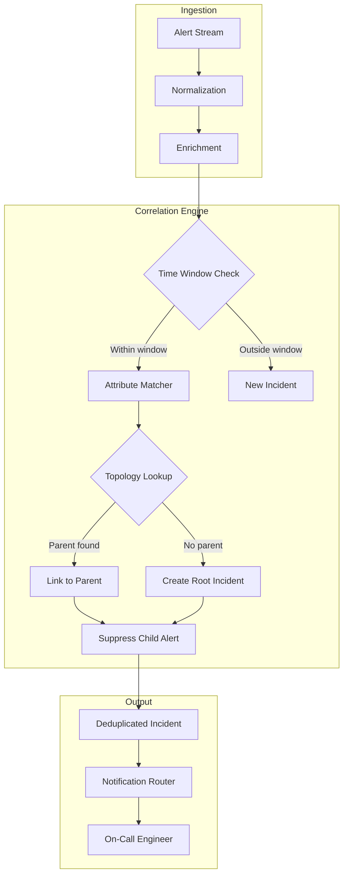
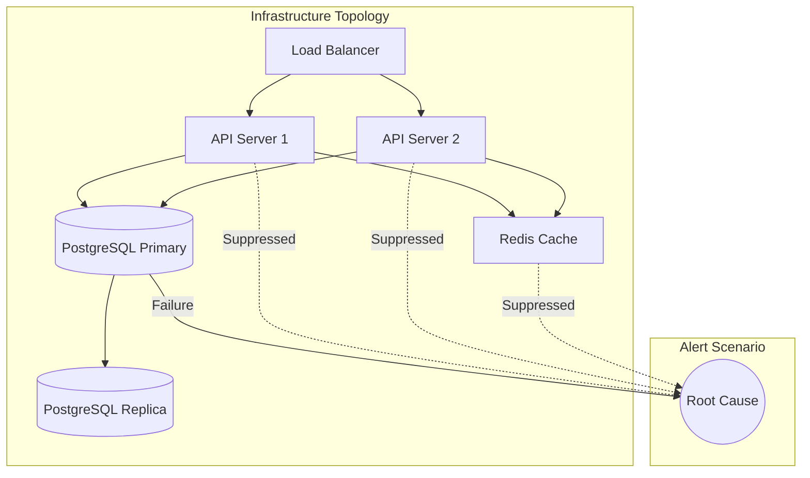
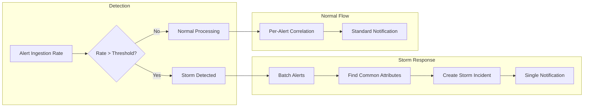

# How to Implement Alert Correlation

Author: [nawazdhandala](https://github.com/nawazdhandala)

Tags: SRE, Alerting, Correlation, AIOps

Description: A practical guide to implementing alert correlation strategies that reduce noise, suppress alert storms, and surface actionable incidents faster.

---

## Why Alert Correlation Matters

Modern distributed systems generate thousands of alerts per hour. When a database server goes down, you do not need 50 separate alerts for the web servers, cache layers, and API gateways that depend on it. You need one actionable alert pointing to the root cause.

Alert correlation groups related alerts into a single incident, identifies parent-child relationships, and suppresses downstream noise. The result: fewer pages, faster MTTR, and engineers who trust the pager.

---

## Correlation Strategies Overview

| Strategy | Best For | Complexity |
|----------|----------|------------|
| **Time-based** | Alerts firing within a window | Low |
| **Topology-based** | Infrastructure with known dependencies | Medium |
| **Attribute-based** | Alerts sharing labels (host, service, region) | Low |
| **Rule-based** | Custom business logic | Medium |
| **ML/AIOps** | High-volume, dynamic environments | High |

Most production systems benefit from layering multiple strategies rather than relying on one.

---

## How a Correlation Engine Works



---

## Time-Based Correlation

Time-based correlation groups alerts that fire within a configurable window. If an alert arrives within N seconds of an existing open alert for the same entity, they merge.

### Configuration Example

```yaml
# correlation-rules.yaml
# Group alerts firing within 60 seconds for the same host
time_based:
  enabled: true
  window_seconds: 60
  group_by:
    - host
    - service
  merge_strategy: first_wins  # Keep the first alert as primary
```

### Python Implementation

```python
from datetime import datetime, timedelta
from typing import Dict, List, Optional
from dataclasses import dataclass, field


@dataclass
class Alert:
    """Represents a single alert from the monitoring system."""
    id: str
    host: str
    service: str
    severity: str
    message: str
    timestamp: datetime
    labels: Dict[str, str] = field(default_factory=dict)


@dataclass
class Incident:
    """A correlated incident containing one or more alerts."""
    id: str
    root_alert: Alert
    correlated_alerts: List[Alert] = field(default_factory=list)
    created_at: datetime = field(default_factory=datetime.utcnow)


class TimeBasedCorrelator:
    """
    Groups alerts that fire within a time window for the same entity.

    Alerts with matching group_by keys arriving within window_seconds
    of an open incident are merged rather than creating new incidents.
    """

    def __init__(self, window_seconds: int = 60, group_by: List[str] = None):
        self.window = timedelta(seconds=window_seconds)
        self.group_by = group_by or ["host", "service"]
        self.open_incidents: Dict[str, Incident] = {}

    def _build_correlation_key(self, alert: Alert) -> str:
        """
        Build a key from the alert's grouping attributes.
        Alerts with the same key within the time window correlate together.
        """
        parts = []
        for attr in self.group_by:
            value = getattr(alert, attr, alert.labels.get(attr, "unknown"))
            parts.append(f"{attr}={value}")
        return "|".join(parts)

    def process(self, alert: Alert) -> Optional[Incident]:
        """
        Process an incoming alert and return an incident if one should fire.

        Returns:
            Incident if this alert creates or updates an actionable incident,
            None if the alert was suppressed by correlation.
        """
        key = self._build_correlation_key(alert)

        # Check for existing open incident within the time window
        if key in self.open_incidents:
            incident = self.open_incidents[key]
            time_since_root = alert.timestamp - incident.root_alert.timestamp

            if time_since_root <= self.window:
                # Correlate: add to existing incident, suppress notification
                incident.correlated_alerts.append(alert)
                print(f"[CORRELATED] Alert {alert.id} merged into incident {incident.id}")
                return None

        # No match found: create new incident
        incident = Incident(
            id=f"INC-{alert.id}",
            root_alert=alert,
            created_at=alert.timestamp
        )
        self.open_incidents[key] = incident
        print(f"[NEW INCIDENT] {incident.id} created from alert {alert.id}")
        return incident


# Example usage
if __name__ == "__main__":
    correlator = TimeBasedCorrelator(window_seconds=60, group_by=["host", "service"])

    # Simulate a burst of alerts from the same host
    alerts = [
        Alert("a1", "db-primary", "postgres", "critical", "Connection refused", datetime.utcnow()),
        Alert("a2", "db-primary", "postgres", "critical", "Replication lag", datetime.utcnow() + timedelta(seconds=5)),
        Alert("a3", "db-primary", "postgres", "warning", "High CPU", datetime.utcnow() + timedelta(seconds=10)),
    ]

    for alert in alerts:
        correlator.process(alert)

    # Output:
    # [NEW INCIDENT] INC-a1 created from alert a1
    # [CORRELATED] Alert a2 merged into incident INC-a1
    # [CORRELATED] Alert a3 merged into incident INC-a1
```

---

## Topology-Based Correlation

Topology-based correlation uses your infrastructure dependency graph to identify parent-child relationships. When a parent node fails, child alerts are automatically suppressed.

### Dependency Graph Example



When PostgreSQL Primary fails, the API servers and cache will generate connection errors. Topology correlation identifies the database as the root cause and suppresses the downstream alerts.

### Python Implementation

```python
from dataclasses import dataclass, field
from typing import Dict, List, Set, Optional
from datetime import datetime


@dataclass
class Alert:
    """Represents a single alert from the monitoring system."""
    id: str
    node: str  # The infrastructure node (host, service, etc.)
    severity: str
    message: str
    timestamp: datetime


@dataclass
class CorrelatedIncident:
    """An incident with parent-child alert relationships."""
    id: str
    root_cause_alert: Alert
    child_alerts: List[Alert] = field(default_factory=list)
    suppressed_count: int = 0


class TopologyCorrelator:
    """
    Uses a dependency graph to identify root cause alerts.

    When a parent node has an active alert, child node alerts
    are suppressed and linked to the parent incident.
    """

    def __init__(self):
        # Adjacency list: parent -> list of children
        self.dependencies: Dict[str, List[str]] = {}
        # Reverse lookup: child -> list of parents
        self.parents: Dict[str, List[str]] = {}
        # Currently active alerts by node
        self.active_alerts: Dict[str, Alert] = {}
        # Open incidents
        self.incidents: Dict[str, CorrelatedIncident] = {}

    def add_dependency(self, parent: str, child: str) -> None:
        """
        Register a dependency: child depends on parent.
        If parent fails, child alerts should be suppressed.
        """
        if parent not in self.dependencies:
            self.dependencies[parent] = []
        self.dependencies[parent].append(child)

        if child not in self.parents:
            self.parents[child] = []
        self.parents[child].append(parent)

    def _find_root_cause(self, node: str, visited: Set[str] = None) -> Optional[str]:
        """
        Walk up the dependency tree to find the highest failing ancestor.
        Returns the root cause node if found, None otherwise.
        """
        if visited is None:
            visited = set()

        if node in visited:
            return None  # Cycle detection
        visited.add(node)

        # Check if any parent has an active alert
        for parent in self.parents.get(node, []):
            if parent in self.active_alerts:
                # Recurse upward to find the true root cause
                higher_root = self._find_root_cause(parent, visited)
                return higher_root or parent

        return None

    def process(self, alert: Alert) -> Optional[CorrelatedIncident]:
        """
        Process an alert using topology-based correlation.

        Returns:
            CorrelatedIncident if this is a root cause alert,
            None if the alert was suppressed (linked to parent).
        """
        node = alert.node
        self.active_alerts[node] = alert

        # Check if a parent node is already failing
        root_cause = self._find_root_cause(node)

        if root_cause:
            # This alert is a symptom, not the root cause
            incident_id = f"INC-{root_cause}"
            if incident_id in self.incidents:
                self.incidents[incident_id].child_alerts.append(alert)
                self.incidents[incident_id].suppressed_count += 1
                print(f"[SUPPRESSED] Alert {alert.id} on {node} linked to root cause {root_cause}")
                return None

        # This alert is a potential root cause
        incident = CorrelatedIncident(
            id=f"INC-{node}",
            root_cause_alert=alert
        )
        self.incidents[incident.id] = incident
        print(f"[ROOT CAUSE] Incident {incident.id} created for {node}")
        return incident


# Example: Build topology and process alerts
if __name__ == "__main__":
    correlator = TopologyCorrelator()

    # Define infrastructure dependencies
    correlator.add_dependency("postgres-primary", "api-server-1")
    correlator.add_dependency("postgres-primary", "api-server-2")
    correlator.add_dependency("api-server-1", "load-balancer")
    correlator.add_dependency("api-server-2", "load-balancer")

    now = datetime.utcnow()

    # Simulate database failure cascade
    alerts = [
        Alert("a1", "postgres-primary", "critical", "Connection refused", now),
        Alert("a2", "api-server-1", "critical", "Database timeout", now),
        Alert("a3", "api-server-2", "critical", "Database timeout", now),
        Alert("a4", "load-balancer", "warning", "Upstream unhealthy", now),
    ]

    for alert in alerts:
        correlator.process(alert)

    # Output:
    # [ROOT CAUSE] Incident INC-postgres-primary created for postgres-primary
    # [SUPPRESSED] Alert a2 on api-server-1 linked to root cause postgres-primary
    # [SUPPRESSED] Alert a3 on api-server-2 linked to root cause postgres-primary
    # [SUPPRESSED] Alert a4 on load-balancer linked to root cause postgres-primary
```

---

## Parent-Child Alert Relationships

Establishing clear parent-child relationships between alerts enables powerful suppression and drill-down capabilities.

### Relationship Types

| Relationship | Description | Example |
|-------------|-------------|---------|
| **Infrastructure** | Physical/logical dependencies | Host down suppresses container alerts |
| **Service** | Application dependencies | Auth service down suppresses checkout alerts |
| **Causal** | One failure causes another | Disk full causes database crash |
| **Temporal** | Alerts within the same time window | Deployment-related alerts cluster |

### Data Model for Alert Relationships

```python
from dataclasses import dataclass, field
from typing import Optional, List, Dict
from enum import Enum
from datetime import datetime


class RelationshipType(Enum):
    """Types of parent-child relationships between alerts."""
    INFRASTRUCTURE = "infrastructure"  # Physical/logical dependency
    SERVICE = "service"                 # Application-level dependency
    CAUSAL = "causal"                   # One failure causes another
    TEMPORAL = "temporal"               # Time-based grouping


@dataclass
class AlertNode:
    """
    An alert with relationship tracking.
    Supports building a tree structure for incident visualization.
    """
    alert_id: str
    node_name: str
    severity: str
    message: str
    timestamp: datetime
    parent: Optional["AlertNode"] = None
    children: List["AlertNode"] = field(default_factory=list)
    relationship_type: Optional[RelationshipType] = None
    is_root_cause: bool = False
    is_suppressed: bool = False

    def add_child(self, child: "AlertNode", rel_type: RelationshipType) -> None:
        """Link a child alert to this parent."""
        child.parent = self
        child.relationship_type = rel_type
        child.is_suppressed = True
        self.children.append(child)

    def get_tree_depth(self) -> int:
        """Calculate depth of the alert tree rooted at this node."""
        if not self.children:
            return 1
        return 1 + max(child.get_tree_depth() for child in self.children)

    def to_dict(self) -> Dict:
        """Serialize the alert tree for API responses or storage."""
        return {
            "alert_id": self.alert_id,
            "node": self.node_name,
            "severity": self.severity,
            "message": self.message,
            "is_root_cause": self.is_root_cause,
            "is_suppressed": self.is_suppressed,
            "relationship": self.relationship_type.value if self.relationship_type else None,
            "children": [child.to_dict() for child in self.children],
            "child_count": len(self.children),
        }


def build_incident_tree(root_alert: AlertNode, child_alerts: List[AlertNode]) -> AlertNode:
    """
    Build a hierarchical incident tree from correlated alerts.

    The root alert is marked as the root cause, and child alerts
    are linked based on their relationship type.
    """
    root_alert.is_root_cause = True

    for child in child_alerts:
        # Determine relationship type based on alert properties
        if child.node_name.startswith(root_alert.node_name):
            rel_type = RelationshipType.INFRASTRUCTURE
        else:
            rel_type = RelationshipType.SERVICE

        root_alert.add_child(child, rel_type)

    return root_alert


# Example usage
if __name__ == "__main__":
    now = datetime.utcnow()

    # Create alerts
    root = AlertNode("a1", "postgres-primary", "critical", "Connection refused", now)
    child1 = AlertNode("a2", "api-server-1", "critical", "DB connection failed", now)
    child2 = AlertNode("a3", "api-server-2", "critical", "DB connection failed", now)
    child3 = AlertNode("a4", "checkout-service", "critical", "Upstream error", now)

    # Build tree
    incident_tree = build_incident_tree(root, [child1, child2, child3])

    # Output structure
    import json
    print(json.dumps(incident_tree.to_dict(), indent=2))
```

---

## Reducing Alert Storms

Alert storms occur when a single failure triggers a cascade of alerts across dependent systems. Without correlation, an engineer receives dozens of pages for what is essentially one incident.

### Storm Detection Algorithm



### Storm Suppression Implementation

```python
from dataclasses import dataclass, field
from datetime import datetime, timedelta
from typing import Dict, List, Optional
from collections import defaultdict
import statistics


@dataclass
class Alert:
    """Incoming alert from monitoring system."""
    id: str
    host: str
    service: str
    severity: str
    message: str
    timestamp: datetime
    labels: Dict[str, str] = field(default_factory=dict)


@dataclass
class StormIncident:
    """Represents a detected alert storm."""
    id: str
    started_at: datetime
    alerts: List[Alert] = field(default_factory=list)
    common_attributes: Dict[str, str] = field(default_factory=dict)
    is_active: bool = True

    @property
    def alert_count(self) -> int:
        return len(self.alerts)


class AlertStormDetector:
    """
    Detects and suppresses alert storms.

    When the alert ingestion rate exceeds a threshold within a time window,
    the detector batches alerts into a single storm incident.
    """

    def __init__(
        self,
        rate_threshold: int = 20,      # Alerts per minute to trigger storm
        window_seconds: int = 60,       # Detection window
        cooldown_seconds: int = 300     # Time before storm ends
    ):
        self.rate_threshold = rate_threshold
        self.window = timedelta(seconds=window_seconds)
        self.cooldown = timedelta(seconds=cooldown_seconds)

        # Rolling window of recent alerts
        self.recent_alerts: List[Alert] = []
        self.current_storm: Optional[StormIncident] = None
        self.storm_count = 0

    def _calculate_rate(self, now: datetime) -> int:
        """Count alerts received in the last window."""
        cutoff = now - self.window
        self.recent_alerts = [a for a in self.recent_alerts if a.timestamp > cutoff]
        return len(self.recent_alerts)

    def _find_common_attributes(self, alerts: List[Alert]) -> Dict[str, str]:
        """
        Find attributes shared by all alerts in a storm.
        These hint at the common root cause.
        """
        if not alerts:
            return {}

        common = {}

        # Check common hosts
        hosts = [a.host for a in alerts]
        if len(set(hosts)) == 1:
            common["host"] = hosts[0]

        # Check common services
        services = [a.service for a in alerts]
        if len(set(services)) == 1:
            common["service"] = services[0]

        # Check common label values
        all_label_keys = set()
        for alert in alerts:
            all_label_keys.update(alert.labels.keys())

        for key in all_label_keys:
            values = [a.labels.get(key) for a in alerts if key in a.labels]
            if values and len(set(values)) == 1:
                common[f"label:{key}"] = values[0]

        return common

    def process(self, alert: Alert) -> Optional[StormIncident]:
        """
        Process an alert and detect/handle storms.

        Returns:
            StormIncident if a storm is detected or updated,
            None if alert should be processed normally.
        """
        now = alert.timestamp
        self.recent_alerts.append(alert)

        current_rate = self._calculate_rate(now)

        # Check if we are in an active storm
        if self.current_storm and self.current_storm.is_active:
            # Add alert to existing storm
            self.current_storm.alerts.append(alert)
            self.current_storm.common_attributes = self._find_common_attributes(
                self.current_storm.alerts
            )

            # Check if storm should end (rate dropped)
            if current_rate < self.rate_threshold / 2:
                last_alert_time = self.current_storm.alerts[-1].timestamp
                if now - last_alert_time > self.cooldown:
                    self.current_storm.is_active = False
                    print(f"[STORM ENDED] {self.current_storm.id} with {self.current_storm.alert_count} alerts")

            return None  # Suppress individual notification

        # Check if we should start a new storm
        if current_rate >= self.rate_threshold:
            self.storm_count += 1
            self.current_storm = StormIncident(
                id=f"STORM-{self.storm_count}",
                started_at=now,
                alerts=list(self.recent_alerts),  # Include buffered alerts
            )
            self.current_storm.common_attributes = self._find_common_attributes(
                self.current_storm.alerts
            )

            print(f"[STORM DETECTED] {self.current_storm.id} - {current_rate} alerts/min")
            print(f"  Common attributes: {self.current_storm.common_attributes}")
            return self.current_storm

        # Normal processing - no storm
        return None


# Example: Simulate an alert storm
if __name__ == "__main__":
    detector = AlertStormDetector(rate_threshold=5, window_seconds=60)

    base_time = datetime.utcnow()

    # Simulate rapid-fire alerts (storm scenario)
    for i in range(25):
        alert = Alert(
            id=f"a{i}",
            host=f"api-server-{i % 3}",
            service="payment-service",
            severity="critical",
            message="Connection timeout",
            timestamp=base_time + timedelta(seconds=i * 2),
            labels={"region": "us-east-1", "env": "prod"}
        )
        result = detector.process(alert)

        if result:
            print(f"  Suppressed {result.alert_count} alerts into single incident")
```

---

## Complete Correlation Engine

Combining all strategies into a production-ready correlation engine.

```python
from dataclasses import dataclass, field
from datetime import datetime, timedelta
from typing import Dict, List, Optional, Set
from enum import Enum
import hashlib


class CorrelationType(Enum):
    """How alerts were correlated."""
    TIME_BASED = "time"
    TOPOLOGY = "topology"
    ATTRIBUTE = "attribute"
    STORM = "storm"


@dataclass
class Alert:
    """Normalized alert from any monitoring source."""
    id: str
    source: str          # Monitoring system that generated the alert
    host: str
    service: str
    severity: str
    message: str
    timestamp: datetime
    labels: Dict[str, str] = field(default_factory=dict)

    def fingerprint(self) -> str:
        """Generate a unique fingerprint for deduplication."""
        content = f"{self.host}|{self.service}|{self.severity}|{self.message}"
        return hashlib.md5(content.encode()).hexdigest()[:12]


@dataclass
class Incident:
    """A correlated incident grouping related alerts."""
    id: str
    root_alert: Alert
    correlation_type: CorrelationType
    correlated_alerts: List[Alert] = field(default_factory=list)
    created_at: datetime = field(default_factory=datetime.utcnow)
    is_notified: bool = False
    suppressed_count: int = 0

    @property
    def total_alerts(self) -> int:
        return 1 + len(self.correlated_alerts)


class CorrelationEngine:
    """
    Production-ready alert correlation engine.

    Combines time-based, topology-based, and attribute-based correlation
    with storm detection to minimize alert noise.
    """

    def __init__(
        self,
        time_window_seconds: int = 60,
        storm_threshold: int = 20,
        group_by_attributes: List[str] = None
    ):
        self.time_window = timedelta(seconds=time_window_seconds)
        self.storm_threshold = storm_threshold
        self.group_by = group_by_attributes or ["host", "service"]

        # State
        self.open_incidents: Dict[str, Incident] = {}
        self.dependencies: Dict[str, Set[str]] = defaultdict(set)
        self.recent_alerts: List[Alert] = []
        self.seen_fingerprints: Set[str] = set()

        # Metrics
        self.total_received = 0
        self.total_suppressed = 0

    def register_dependency(self, parent: str, child: str) -> None:
        """Register that child depends on parent."""
        self.dependencies[parent].add(child)

    def _build_correlation_key(self, alert: Alert) -> str:
        """Build grouping key from alert attributes."""
        parts = [f"{attr}={getattr(alert, attr, 'unknown')}" for attr in self.group_by]
        return "|".join(sorted(parts))

    def _check_topology(self, alert: Alert) -> Optional[Incident]:
        """Check if alert should be suppressed due to parent failure."""
        # Check if any parent of this node has an open incident
        for parent, children in self.dependencies.items():
            if alert.host in children or alert.service in children:
                parent_key = f"host={parent}|service={parent}"
                for key, incident in self.open_incidents.items():
                    if parent in key:
                        return incident
        return None

    def _check_storm(self, now: datetime) -> bool:
        """Check if we are in an alert storm."""
        cutoff = now - timedelta(seconds=60)
        recent_count = sum(1 for a in self.recent_alerts if a.timestamp > cutoff)
        return recent_count >= self.storm_threshold

    def _deduplicate(self, alert: Alert) -> bool:
        """Check if this exact alert was already seen."""
        fp = alert.fingerprint()
        if fp in self.seen_fingerprints:
            return True
        self.seen_fingerprints.add(fp)

        # Cleanup old fingerprints periodically
        if len(self.seen_fingerprints) > 10000:
            self.seen_fingerprints = set(list(self.seen_fingerprints)[-5000:])

        return False

    def process(self, alert: Alert) -> Optional[Incident]:
        """
        Process an incoming alert through all correlation strategies.

        Returns:
            Incident if a new actionable incident is created,
            None if the alert was correlated/suppressed.
        """
        self.total_received += 1
        self.recent_alerts.append(alert)

        # Step 1: Deduplication
        if self._deduplicate(alert):
            self.total_suppressed += 1
            return None

        # Step 2: Topology-based correlation
        parent_incident = self._check_topology(alert)
        if parent_incident:
            parent_incident.correlated_alerts.append(alert)
            parent_incident.suppressed_count += 1
            self.total_suppressed += 1
            print(f"[TOPOLOGY] Alert {alert.id} suppressed by {parent_incident.id}")
            return None

        # Step 3: Time and attribute-based correlation
        correlation_key = self._build_correlation_key(alert)

        if correlation_key in self.open_incidents:
            existing = self.open_incidents[correlation_key]
            time_delta = alert.timestamp - existing.root_alert.timestamp

            if time_delta <= self.time_window:
                existing.correlated_alerts.append(alert)
                existing.suppressed_count += 1
                self.total_suppressed += 1
                print(f"[TIME+ATTR] Alert {alert.id} merged into {existing.id}")
                return None

        # Step 4: Storm detection
        is_storm = self._check_storm(alert.timestamp)
        correlation_type = CorrelationType.STORM if is_storm else CorrelationType.TIME_BASED

        # Create new incident
        incident = Incident(
            id=f"INC-{alert.id}",
            root_alert=alert,
            correlation_type=correlation_type,
            created_at=alert.timestamp
        )
        self.open_incidents[correlation_key] = incident

        if is_storm:
            print(f"[STORM] New incident {incident.id} (storm conditions detected)")
        else:
            print(f"[NEW] Incident {incident.id} created")

        return incident

    def get_metrics(self) -> Dict[str, int]:
        """Return correlation effectiveness metrics."""
        return {
            "total_received": self.total_received,
            "total_suppressed": self.total_suppressed,
            "suppression_rate_percent": round(
                (self.total_suppressed / max(1, self.total_received)) * 100, 2
            ),
            "open_incidents": len(self.open_incidents),
        }


# Example: Full correlation pipeline
if __name__ == "__main__":
    engine = CorrelationEngine(
        time_window_seconds=60,
        storm_threshold=10,
        group_by_attributes=["host", "service"]
    )

    # Register infrastructure dependencies
    engine.register_dependency("postgres-primary", "api-server-1")
    engine.register_dependency("postgres-primary", "api-server-2")
    engine.register_dependency("api-server-1", "checkout-service")
    engine.register_dependency("api-server-2", "checkout-service")

    base_time = datetime.utcnow()

    # Simulate incident cascade
    alerts = [
        # Root cause
        Alert("a1", "prometheus", "postgres-primary", "postgres", "critical",
              "Connection refused", base_time),
        # Dependent failures (should be suppressed)
        Alert("a2", "prometheus", "api-server-1", "api", "critical",
              "DB connection timeout", base_time + timedelta(seconds=2)),
        Alert("a3", "prometheus", "api-server-2", "api", "critical",
              "DB connection timeout", base_time + timedelta(seconds=3)),
        Alert("a4", "prometheus", "checkout-service", "checkout", "critical",
              "Upstream error", base_time + timedelta(seconds=5)),
        # Duplicate (should be deduplicated)
        Alert("a5", "prometheus", "postgres-primary", "postgres", "critical",
              "Connection refused", base_time + timedelta(seconds=10)),
    ]

    print("Processing alerts...")
    print("-" * 50)

    for alert in alerts:
        engine.process(alert)

    print("-" * 50)
    print(f"Metrics: {engine.get_metrics()}")
```

---

## Configuration Best Practices

### Tuning Correlation Windows

```yaml
# correlation-config.yaml
correlation:
  # Time-based settings
  time_window_seconds: 60          # Group alerts within 60 seconds
  dedup_window_seconds: 300        # Deduplicate identical alerts for 5 minutes

  # Attribute grouping
  group_by:
    - host
    - service
    - severity

  # Storm detection
  storm:
    enabled: true
    threshold_per_minute: 20       # Alerts/min to trigger storm mode
    cooldown_seconds: 300          # Time before storm ends

  # Topology correlation
  topology:
    enabled: true
    source: service_catalog        # Pull dependencies from service catalog
    refresh_interval_seconds: 300  # Refresh topology every 5 minutes

  # Suppression rules
  suppression:
    maintenance_windows: true      # Auto-suppress during maintenance
    flapping_threshold: 5          # Suppress if alert flaps > 5 times in 10 min
```

### Integration with OneUptime

```yaml
# oneuptime-correlation.yaml
alerting:
  correlation:
    enabled: true
    strategies:
      - time_based
      - topology
      - attribute

    # Link to service catalog for topology
    service_catalog_integration: true

    # Notification behavior
    notify_on:
      - root_cause_only           # Only page for root cause alerts
      - storm_summary             # Single page for storm incidents

    # Incident enrichment
    enrichment:
      attach_related_alerts: true
      include_topology_path: true
      link_runbooks: true
```

---

## Key Takeaways

1. **Layer your strategies.** Combine time, topology, and attribute correlation for best results.

2. **Know your topology.** Maintain an accurate service catalog and dependency graph.

3. **Tune your windows.** Start with 60-second correlation windows and adjust based on your incident patterns.

4. **Measure suppression rate.** Track what percentage of alerts are correlated vs. fired. Aim for 80%+ during cascading failures.

5. **Preserve context.** Suppressed alerts should still be visible in the incident timeline for post-incident analysis.

6. **Automate topology discovery.** Use service mesh, Kubernetes labels, or tracing data to keep dependencies current.

---

## Related Reading

- [How to reduce noise in OpenTelemetry](https://oneuptime.com/blog/post/2025-08-25-how-to-reduce-noise-in-opentelemetry/view)
- [Designing an SRE On-Call Rotation](https://oneuptime.com/blog/post/2025-11-28-sre-on-call-rotation-design/view)
- [The Five Stages of SRE Maturity](https://oneuptime.com/blog/post/2025-09-01-the-five-stages-of-sre-maturity/view)
