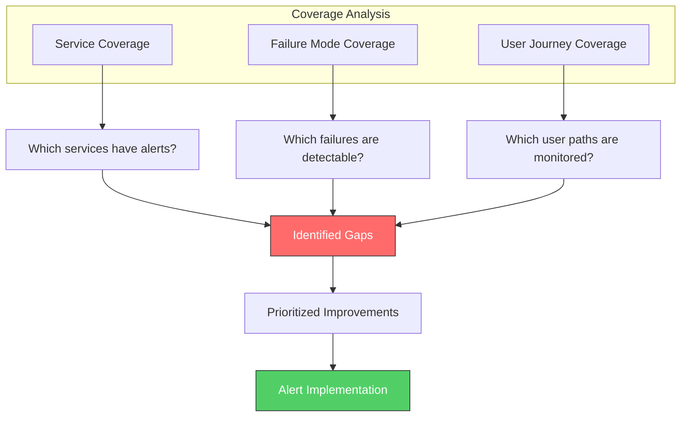
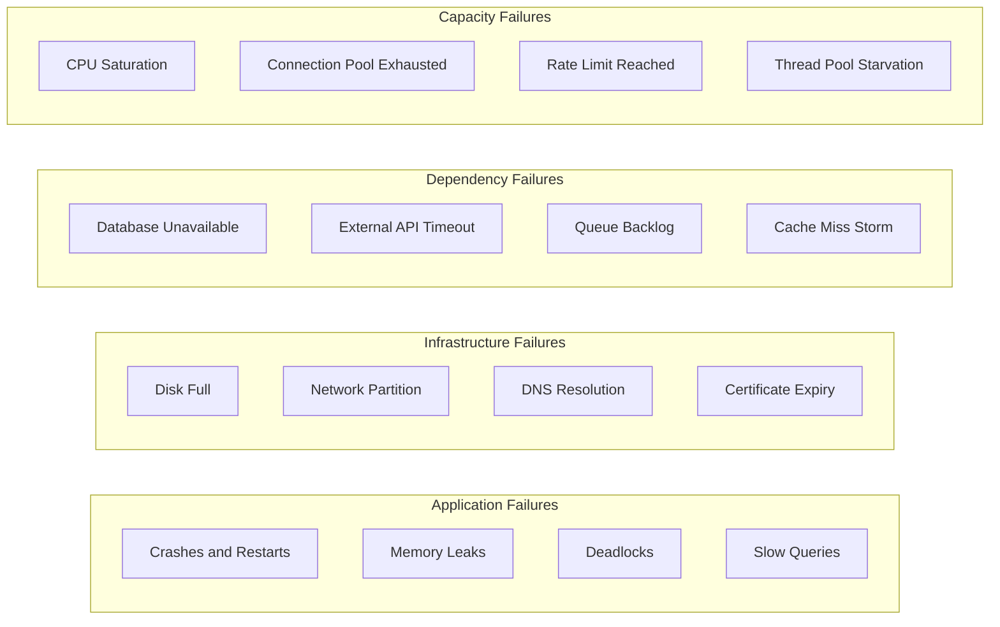
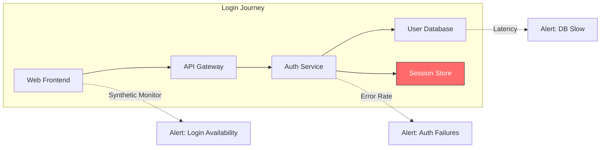
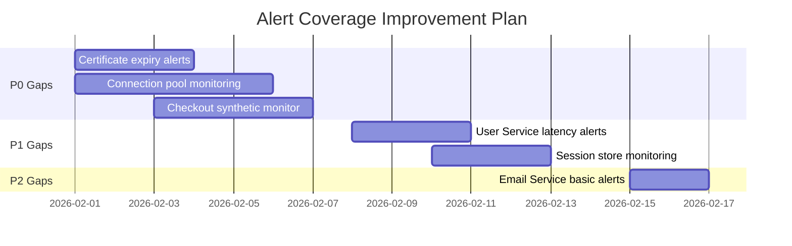
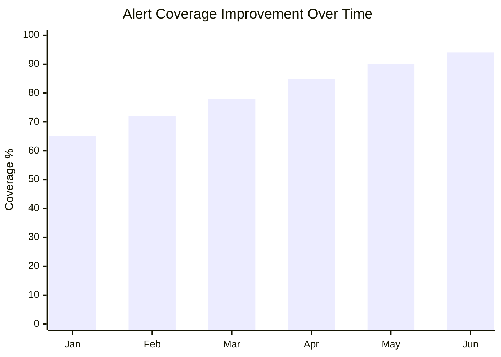

# How to Implement Alert Coverage Analysis

Author: [nawazdhandala](https://github.com/nawazdhandala)

Tags: Alerting, Coverage, Analysis, SRE

Description: A practical methodology for identifying alerting gaps and ensuring your monitoring catches real failures before users do.

---

You have dashboards. You have metrics. You have alerts firing at 3 AM. But here is the uncomfortable question: are you actually monitoring the things that matter? Alert coverage analysis is the practice of systematically evaluating whether your alerting strategy catches the failures that hurt users.

Most teams discover their monitoring gaps the hard way, during an incident when everyone is asking "why did nobody get paged for this?" This guide shows you how to find those gaps before they find you.

## What is Alert Coverage Analysis?

Alert coverage analysis maps your alerting rules against your services, failure modes, and user journeys. The goal is to answer three questions:

1. Which services have adequate alerting?
2. Which failure modes can happen silently?
3. Where should you invest in better monitoring?

Think of it like test coverage for your alerting. You would not ship code without knowing how much of it is tested. You should not run production without knowing how much of it is monitored.

## The Coverage Assessment Framework

A complete alert coverage analysis looks at three dimensions: service coverage, failure mode coverage, and user journey coverage. Each dimension catches different types of gaps.



## Step 1: Service Coverage Assessment

Start by building a complete inventory of your services and their current alerting status. This is often more revealing than teams expect.

### Building Your Service Inventory

For each service, document:

- Service name and owner
- Criticality tier (P0 through P3)
- Current alert count
- Last alert review date
- Dependencies (upstream and downstream)

### Coverage Matrix Template

| Service | Tier | Availability Alert | Latency Alert | Error Rate Alert | Saturation Alert | Last Review |
|---------|------|-------------------|---------------|------------------|------------------|-------------|
| API Gateway | P0 | Yes | Yes | Yes | Yes | 2025-12 |
| User Service | P0 | Yes | No | Yes | No | Never |
| Payment Service | P0 | Yes | Yes | Yes | Yes | 2025-11 |
| Email Service | P2 | No | No | No | No | Never |
| Analytics Service | P3 | No | No | No | No | N/A |

The matrix immediately reveals gaps. In this example, the User Service, a P0 critical service, is missing latency and saturation alerts and has never been reviewed.

### Service Coverage Scoring

Calculate a coverage score for each service tier:

```
Coverage Score = (Services with adequate alerts / Total services in tier) x 100
```

What counts as "adequate" depends on the tier:

- **P0 services:** Must have availability, latency, error rate, and saturation alerts
- **P1 services:** Must have availability and error rate alerts
- **P2 services:** Should have availability alerts
- **P3 services:** Optional, based on team capacity

A healthy organization targets 100% coverage for P0, 90%+ for P1, and 70%+ for P2.

## Step 2: Failure Mode Coverage

Service-level coverage is necessary but not sufficient. You also need to verify that your alerts can detect specific failure modes that occur in production.

### Common Failure Mode Categories



### Failure Mode Mapping Exercise

For each critical service, list out the failure modes that could happen and check whether each one would trigger an alert.

| Failure Mode | Would Alert Fire? | Detection Method | Gap? |
|--------------|-------------------|------------------|------|
| Database connection failure | Yes | Error rate spike | No |
| Slow database queries | No | Not monitored | Yes |
| Memory leak (gradual) | No | Only OOMKill alert | Yes |
| Third-party API timeout | Yes | Latency alert | No |
| SSL certificate expiry | No | Not monitored | Yes |
| Connection pool exhaustion | No | Not monitored | Yes |

This exercise often uncovers entire categories of failures that could happen silently.

### The Pre-Mortem Technique

For each critical service, run a quick pre-mortem: imagine the service is down and users are complaining. Walk through how you would find out:

1. Would an alert fire?
2. How long would it take?
3. Would the alert clearly indicate the problem?
4. Would the right person get paged?

If the answer to any of these is "no" or "I am not sure," you have found a gap.

## Step 3: User Journey Coverage

Technical metrics are not enough. You need to verify that the journeys users actually care about are monitored end-to-end.

### Identifying Critical User Journeys

List the user-facing flows that matter most to your business:

- User login
- Checkout and payment
- Search and browse
- Content upload
- Notification delivery
- Report generation

Each journey typically spans multiple services. A gap in any service along the path can cause silent failures.

### Journey Coverage Map



In this example, the Session Store (L5) is highlighted as a gap. If the session store fails, logins will break, but there is no alert specifically watching it.

### Synthetic Monitoring for Journey Coverage

The most reliable way to ensure user journey coverage is synthetic monitoring. Synthetic tests simulate real user actions and alert when the journey fails.

For each critical journey:

1. Create a synthetic test that performs the entire flow
2. Run it at regular intervals (every 1-5 minutes for critical paths)
3. Alert when the synthetic fails or degrades

Synthetic monitors catch failures that technical metrics miss, like JavaScript errors that break the frontend but do not generate backend errors.

## Identifying and Prioritizing Gaps

Once you have completed the assessment, you will have a list of gaps. Not all gaps are equal. Prioritize based on risk.

### Gap Prioritization Matrix

| Gap | Service Tier | Failure Likelihood | User Impact | Priority |
|-----|--------------|-------------------|-------------|----------|
| No latency alert for User Service | P0 | Medium | High | P1 |
| No alerts for Email Service | P2 | Low | Low | P3 |
| No cert expiry monitoring | All | High | Critical | P0 |
| No connection pool alerts | P0 | High | High | P0 |
| No synthetic for checkout | P0 | Medium | Critical | P0 |

### Priority Calculation

Calculate priority using this formula:

```
Priority = Service Tier + Failure Likelihood + User Impact
```

Where each factor is scored 1-3:
- Service Tier: P0=3, P1=2, P2=1, P3=0
- Failure Likelihood: High=3, Medium=2, Low=1
- User Impact: Critical=3, High=2, Medium=1, Low=0

Gaps scoring 7+ are P0. Gaps scoring 5-6 are P1. Everything else is P2/P3.

## Building a Coverage Improvement Plan

With prioritized gaps, create a concrete plan to close them.

### Sample Improvement Roadmap



### Alert Implementation Checklist

For each new alert, verify:

- [ ] Alert has a clear, actionable name
- [ ] Threshold is based on historical data, not guesswork
- [ ] Alert includes a runbook link
- [ ] Alert has an owner and escalation path
- [ ] Alert was tested (manually triggered or via chaos engineering)
- [ ] Alert noise was evaluated over a 1-week period

### Continuous Coverage Tracking

Alert coverage is not a one-time exercise. Build it into your regular operations:

**Weekly:** Review new services and deployments for coverage
**Monthly:** Check coverage scores by tier
**Quarterly:** Full coverage assessment and gap analysis
**After incidents:** Verify the failure mode had alerting (if not, add it)

## Common Coverage Anti-Patterns

### The Dashboard-Only Trap

Having a metric on a dashboard is not the same as having an alert. Dashboards are for humans to look at. Alerts are for systems to notify humans. If a failure only shows up on a dashboard, it will go unnoticed until someone happens to look.

### The Alert Storm Problem

Some teams overcorrect by alerting on everything. This creates alert fatigue, and ironically reduces coverage because engineers start ignoring pages. Every alert should be actionable. If you would not wake someone up for it, do not alert on it.

### The Copy-Paste Problem

Copying alert configurations between services without tuning thresholds leads to either too many false positives or missed real issues. Each service has different baseline behavior. Thresholds need to match reality.

### The Static Threshold Problem

Static thresholds break when traffic patterns change. A 500ms latency threshold might be fine during peak hours but miss problems during low-traffic periods when latency should be 100ms. Use relative thresholds (X% above baseline) or burn-rate alerts where possible.

## Measuring Coverage Improvement

Track these metrics to verify your coverage analysis is working:

**Coverage Score by Tier:** Target increasing percentages over time

**Time to Detection (TTD):** How long between failure start and alert firing

**Detection Rate:** Percentage of incidents caught by alerts vs discovered by users

**Coverage Debt:** Number of known gaps weighted by priority



## Integrating with Incident Response

Alert coverage analysis should feed into your incident process:

**During incidents:** Note whether an alert caught the issue. If not, why?

**During postmortems:** Add a standard question: "Was this failure mode covered by alerting?"

**For action items:** Missing coverage is a valid postmortem action item

Over time, this creates a feedback loop where every incident improves your coverage.

## Tools and Automation

Manual coverage analysis does not scale. Look for ways to automate:

**Service discovery integration:** Automatically flag new services without alerts

**Alert coverage reports:** Generate weekly reports showing coverage by tier

**Dependency mapping:** Use distributed tracing to auto-discover service dependencies

**Synthetic test generation:** Some platforms can auto-generate synthetics from production traffic

OneUptime provides built-in service catalogs, alert management, and synthetic monitoring that can help automate much of this process.

## Conclusion

Alert coverage analysis bridges the gap between "we have monitoring" and "we catch failures before users do." It takes real effort to build and maintain, but the payoff is fewer silent failures, faster incident detection, and more confidence in your systems.

Start small. Pick your three most critical services and run through the coverage assessment. Fix the most obvious gaps. Then expand from there.

The goal is not 100% coverage of every possible failure. That is impossible. The goal is deliberate coverage of the failures that matter most, and a systematic process for improving over time.

Your future on-call self will thank you.

**Related Reading:**

- [The Ultimate SRE Reliability Checklist](https://oneuptime.com/blog/post/2025-09-10-sre-checklist/view)
- [SRE Best Practices](https://oneuptime.com/blog/post/2025-11-28-sre-best-practices/view)
- [Root Cause Analysis](https://oneuptime.com/blog/post/2026-01-30-root-cause-analysis/view)
