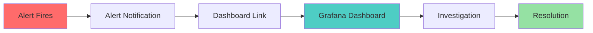
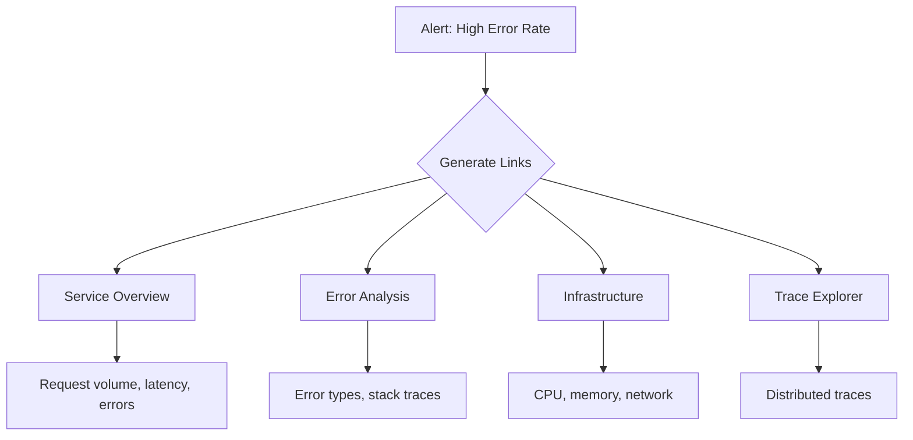
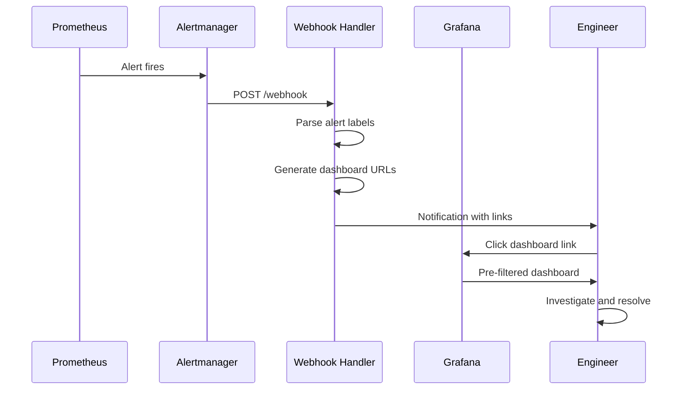

# How to Implement Alert Dashboard Links

Author: [nawazdhandala](https://github.com/nawazdhandala)

Tags: Alerting, Dashboards, Grafana, Observability

Description: Learn how to generate dashboard links from alerts for quick investigation.

---

When an alert fires, the clock starts ticking. Engineers need to get from notification to investigation as fast as possible. Alert dashboard links bridge this gap by providing one-click access to relevant dashboards with the right time range and context already set.

This guide covers practical implementations for generating dashboard links from alerts, including URL construction, time range passing, variable substitution, and multi-dashboard linking strategies.

## The Alert-to-Dashboard Flow

When an alert triggers, the engineer needs context. A well-crafted dashboard link provides:

- Pre-filtered data for the affected service or resource
- Time range centered on the alert window
- Related metrics visible without manual navigation



## Dashboard URL Generation

### Basic URL Structure

Grafana dashboard URLs follow a predictable pattern:

```
https://grafana.example.com/d/{dashboard-uid}/{dashboard-slug}?{parameters}
```

Here is a Python function to generate dashboard links:

```python
from urllib.parse import urlencode
from datetime import datetime, timedelta

def generate_dashboard_link(
    base_url: str,
    dashboard_uid: str,
    dashboard_slug: str,
    time_from: datetime,
    time_to: datetime,
    variables: dict = None,
    panel_id: int = None
) -> str:
    """
    Generate a Grafana dashboard link with time range and variables.

    Args:
        base_url: Grafana instance URL (e.g., https://grafana.example.com)
        dashboard_uid: Dashboard unique identifier
        dashboard_slug: Human-readable dashboard name in URL
        time_from: Start time for the dashboard view
        time_to: End time for the dashboard view
        variables: Dictionary of template variables to set
        panel_id: Optional panel ID to focus on

    Returns:
        Complete dashboard URL with parameters
    """
    # Build base path
    path = f"/d/{dashboard_uid}/{dashboard_slug}"

    # Convert times to milliseconds since epoch
    params = {
        "from": int(time_from.timestamp() * 1000),
        "to": int(time_to.timestamp() * 1000),
    }

    # Add template variables with var- prefix
    if variables:
        for key, value in variables.items():
            params[f"var-{key}"] = value

    # Add panel focus if specified
    if panel_id:
        params["viewPanel"] = panel_id

    return f"{base_url}{path}?{urlencode(params)}"


# Example usage
alert_time = datetime.now()
link = generate_dashboard_link(
    base_url="https://grafana.example.com",
    dashboard_uid="abc123",
    dashboard_slug="service-overview",
    time_from=alert_time - timedelta(hours=1),
    time_to=alert_time + timedelta(minutes=15),
    variables={
        "service": "payment-api",
        "environment": "production"
    }
)
# Result: https://grafana.example.com/d/abc123/service-overview?from=1706644800000&to=1706649300000&var-service=payment-api&var-environment=production
```

### Time Range Strategies

Different alert types benefit from different time windows:

```python
from enum import Enum
from datetime import timedelta

class AlertSeverity(Enum):
    CRITICAL = "critical"
    WARNING = "warning"
    INFO = "info"

def get_time_window(severity: AlertSeverity, alert_time: datetime) -> tuple:
    """
    Determine appropriate time window based on alert severity.

    Critical alerts need narrow focus for immediate diagnosis.
    Warning alerts benefit from broader context to spot trends.
    """
    windows = {
        AlertSeverity.CRITICAL: {
            "before": timedelta(minutes=30),
            "after": timedelta(minutes=10)
        },
        AlertSeverity.WARNING: {
            "before": timedelta(hours=2),
            "after": timedelta(minutes=30)
        },
        AlertSeverity.INFO: {
            "before": timedelta(hours=6),
            "after": timedelta(hours=1)
        }
    }

    window = windows[severity]
    return (
        alert_time - window["before"],
        alert_time + window["after"]
    )
```

## Time Range Parameter Passing

Grafana supports multiple time range formats. Understanding each helps you build robust integrations.

### Absolute Time (Milliseconds)

Most precise, ideal for alert links:

```
?from=1706644800000&to=1706648400000
```

### Relative Time

Useful for dashboards that should always show recent data:

```
?from=now-1h&to=now
```

### ISO 8601 Format

Human-readable alternative:

```
?from=2026-01-30T10:00:00Z&to=2026-01-30T11:00:00Z
```

### Time Zone Handling

```python
from datetime import datetime, timezone
import pytz

def format_time_param(dt: datetime, use_utc: bool = True) -> int:
    """
    Convert datetime to Grafana-compatible milliseconds.

    Grafana interprets times as UTC by default.
    """
    if dt.tzinfo is None:
        # Assume UTC if no timezone
        dt = dt.replace(tzinfo=timezone.utc)
    elif use_utc:
        # Convert to UTC
        dt = dt.astimezone(timezone.utc)

    return int(dt.timestamp() * 1000)


# Example with different time zones
pst = pytz.timezone('US/Pacific')
alert_time_pst = pst.localize(datetime(2026, 1, 30, 10, 0, 0))

# Both produce the same UTC timestamp
utc_millis = format_time_param(alert_time_pst)
```

## Variable Substitution in Links

Template variables make dashboards reusable. Alert links should populate these variables automatically.

### Single Value Variables

```python
def build_variable_params(variables: dict) -> dict:
    """
    Convert variables to Grafana URL parameters.

    Single values become: var-name=value
    """
    params = {}
    for name, value in variables.items():
        params[f"var-{name}"] = value
    return params


# Example
variables = {
    "service": "payment-api",
    "region": "us-west-2",
    "instance": "i-0abc123def456"
}
params = build_variable_params(variables)
# {"var-service": "payment-api", "var-region": "us-west-2", "var-instance": "i-0abc123def456"}
```

### Multi-Value Variables

When a variable accepts multiple values:

```python
from urllib.parse import urlencode

def build_multi_value_params(variables: dict) -> str:
    """
    Handle multi-value variables for Grafana.

    Multiple values for same variable repeat the parameter:
    var-host=host1&var-host=host2
    """
    params = []
    for name, value in variables.items():
        key = f"var-{name}"
        if isinstance(value, list):
            for v in value:
                params.append((key, v))
        else:
            params.append((key, value))

    return urlencode(params)


# Example
variables = {
    "service": "payment-api",
    "host": ["host1.example.com", "host2.example.com", "host3.example.com"]
}
query_string = build_multi_value_params(variables)
# var-service=payment-api&var-host=host1.example.com&var-host=host2.example.com&var-host=host3.example.com
```

### Extracting Variables from Alert Labels

Prometheus alerts include labels that map directly to dashboard variables:

```python
def extract_dashboard_variables(alert_labels: dict, mapping: dict) -> dict:
    """
    Map alert labels to dashboard variables.

    Args:
        alert_labels: Labels from the firing alert
        mapping: Dict mapping label names to variable names

    Returns:
        Variables dict for dashboard URL
    """
    variables = {}
    for label_name, var_name in mapping.items():
        if label_name in alert_labels:
            variables[var_name] = alert_labels[label_name]
    return variables


# Example
alert_labels = {
    "alertname": "HighErrorRate",
    "service": "payment-api",
    "namespace": "production",
    "pod": "payment-api-7d4f8b6c9-x2k4m"
}

label_to_variable = {
    "service": "service",
    "namespace": "environment",
    "pod": "pod"
}

variables = extract_dashboard_variables(alert_labels, label_to_variable)
# {"service": "payment-api", "environment": "production", "pod": "payment-api-7d4f8b6c9-x2k4m"}
```

## Multi-Dashboard Linking

Complex incidents require multiple perspectives. Generate links to several dashboards:



### Dashboard Link Configuration

```python
from dataclasses import dataclass
from typing import Optional

@dataclass
class DashboardConfig:
    """Configuration for a dashboard link."""
    uid: str
    slug: str
    name: str
    description: str
    variables_mapping: dict
    panel_id: Optional[int] = None
    time_window_minutes: int = 60

class AlertDashboardLinker:
    """Generate multiple dashboard links from a single alert."""

    def __init__(self, grafana_url: str):
        self.grafana_url = grafana_url
        self.dashboards = self._configure_dashboards()

    def _configure_dashboards(self) -> dict:
        """Define dashboard configurations by alert type."""
        return {
            "service_error_rate": [
                DashboardConfig(
                    uid="svc-overview",
                    slug="service-overview",
                    name="Service Overview",
                    description="Request volume, latency percentiles, error rates",
                    variables_mapping={"service": "service", "namespace": "environment"}
                ),
                DashboardConfig(
                    uid="error-analysis",
                    slug="error-analysis",
                    name="Error Analysis",
                    description="Error breakdown by type, endpoint, and status code",
                    variables_mapping={"service": "service"},
                    panel_id=4
                ),
                DashboardConfig(
                    uid="infra-pods",
                    slug="infrastructure-pods",
                    name="Pod Resources",
                    description="CPU, memory, restarts for affected pods",
                    variables_mapping={"namespace": "namespace", "pod": "pod"}
                ),
            ],
            "high_latency": [
                DashboardConfig(
                    uid="latency-deep",
                    slug="latency-analysis",
                    name="Latency Deep Dive",
                    description="P50/P95/P99 latency by endpoint",
                    variables_mapping={"service": "service"},
                    time_window_minutes=120
                ),
                DashboardConfig(
                    uid="db-perf",
                    slug="database-performance",
                    name="Database Performance",
                    description="Query latency, connection pool, slow queries",
                    variables_mapping={"service": "service"}
                ),
            ]
        }

    def generate_links(
        self,
        alert_name: str,
        alert_labels: dict,
        alert_time: datetime
    ) -> list:
        """
        Generate dashboard links for an alert.

        Returns list of dicts with name, description, and URL.
        """
        # Determine which dashboards to link
        dashboards = self.dashboards.get(alert_name, [])

        links = []
        for config in dashboards:
            # Map labels to variables
            variables = {}
            for label, var in config.variables_mapping.items():
                if label in alert_labels:
                    variables[var] = alert_labels[label]

            # Calculate time window
            window = timedelta(minutes=config.time_window_minutes)
            time_from = alert_time - window
            time_to = alert_time + timedelta(minutes=15)

            # Build URL
            url = generate_dashboard_link(
                base_url=self.grafana_url,
                dashboard_uid=config.uid,
                dashboard_slug=config.slug,
                time_from=time_from,
                time_to=time_to,
                variables=variables,
                panel_id=config.panel_id
            )

            links.append({
                "name": config.name,
                "description": config.description,
                "url": url
            })

        return links


# Usage
linker = AlertDashboardLinker("https://grafana.example.com")
links = linker.generate_links(
    alert_name="service_error_rate",
    alert_labels={
        "service": "payment-api",
        "namespace": "production",
        "pod": "payment-api-7d4f8b6c9-x2k4m"
    },
    alert_time=datetime.now()
)

for link in links:
    print(f"{link['name']}: {link['url']}")
```

## Grafana Explore Links

Explore mode provides ad-hoc querying. Link directly to pre-built queries:

```python
import json
from urllib.parse import quote

def generate_explore_link(
    grafana_url: str,
    datasource: str,
    query: str,
    time_from: datetime,
    time_to: datetime
) -> str:
    """
    Generate a Grafana Explore link with a pre-built query.

    Useful for logs, traces, and ad-hoc metric exploration.
    """
    # Explore state is JSON encoded in the URL
    explore_state = {
        "datasource": datasource,
        "queries": [{"refId": "A", "expr": query}],
        "range": {
            "from": str(int(time_from.timestamp() * 1000)),
            "to": str(int(time_to.timestamp() * 1000))
        }
    }

    # Encode as JSON and URL-encode
    state_json = json.dumps(explore_state)
    encoded_state = quote(state_json)

    return f"{grafana_url}/explore?left={encoded_state}"


# Example: Link to logs for a specific service
log_query = '{namespace="production", app="payment-api"} |= "error"'
explore_url = generate_explore_link(
    grafana_url="https://grafana.example.com",
    datasource="Loki",
    query=log_query,
    time_from=datetime.now() - timedelta(hours=1),
    time_to=datetime.now()
)
```

### Trace Explorer Links

Link to specific traces from alerts:

```python
def generate_trace_link(
    grafana_url: str,
    trace_id: str,
    datasource: str = "Tempo"
) -> str:
    """
    Generate a direct link to a specific trace.
    """
    return f"{grafana_url}/explore?orgId=1&left=%5B%22now-1h%22,%22now%22,%22{datasource}%22,%7B%22query%22:%22{trace_id}%22%7D%5D"


# Example
trace_link = generate_trace_link(
    grafana_url="https://grafana.example.com",
    trace_id="abc123def456789"
)
```

## Dashboard Deep Linking

Navigate directly to specific panels or rows:

### Panel Focus

```python
def generate_panel_link(
    base_url: str,
    dashboard_uid: str,
    dashboard_slug: str,
    panel_id: int,
    time_from: datetime,
    time_to: datetime,
    full_screen: bool = False
) -> str:
    """
    Generate link that focuses on a specific panel.

    Args:
        panel_id: ID of the panel to focus
        full_screen: If True, opens panel in full screen view
    """
    params = {
        "from": int(time_from.timestamp() * 1000),
        "to": int(time_to.timestamp() * 1000),
        "viewPanel": panel_id
    }

    if full_screen:
        params["fullscreen"] = "true"

    return f"{base_url}/d/{dashboard_uid}/{dashboard_slug}?{urlencode(params)}"
```

### Row Expansion

```python
def generate_row_link(
    base_url: str,
    dashboard_uid: str,
    dashboard_slug: str,
    row_title: str,
    time_from: datetime,
    time_to: datetime
) -> str:
    """
    Generate link that expands a specific row.

    Rows are identified by title in the URL.
    """
    params = {
        "from": int(time_from.timestamp() * 1000),
        "to": int(time_to.timestamp() * 1000),
    }

    # Row anchor uses lowercase, hyphenated title
    row_anchor = row_title.lower().replace(" ", "-")

    return f"{base_url}/d/{dashboard_uid}/{dashboard_slug}?{urlencode(params)}#{row_anchor}"
```

## Integration with Alert Managers

### Alertmanager Configuration

Configure Alertmanager to include dashboard links in notifications:

```yaml
# alertmanager.yml
global:
  resolve_timeout: 5m

templates:
  - '/etc/alertmanager/templates/*.tmpl'

route:
  receiver: 'slack-notifications'
  group_by: ['alertname', 'service']
  group_wait: 30s
  group_interval: 5m
  repeat_interval: 4h

receivers:
  - name: 'slack-notifications'
    slack_configs:
      - api_url: 'https://hooks.slack.com/services/xxx/yyy/zzz'
        channel: '#alerts'
        title: '{{ .Status | toUpper }}: {{ .CommonLabels.alertname }}'
        text: |
          *Service:* {{ .CommonLabels.service }}
          *Environment:* {{ .CommonLabels.namespace }}
          *Summary:* {{ .CommonAnnotations.summary }}

          *Dashboard Links:*
          - <{{ .CommonAnnotations.dashboard_url }}|Service Overview>
          - <{{ .CommonAnnotations.runbook_url }}|Runbook>
        actions:
          - type: button
            text: 'View Dashboard'
            url: '{{ .CommonAnnotations.dashboard_url }}'
```

### Prometheus Alert Rules with Dashboard Links

```yaml
# prometheus-rules.yml
groups:
  - name: service-alerts
    rules:
      - alert: HighErrorRate
        expr: |
          sum(rate(http_requests_total{status=~"5.."}[5m])) by (service, namespace)
          /
          sum(rate(http_requests_total[5m])) by (service, namespace)
          > 0.05
        for: 5m
        labels:
          severity: critical
        annotations:
          summary: "High error rate on {{ $labels.service }}"
          description: "Error rate is {{ $value | humanizePercentage }} for {{ $labels.service }}"
          dashboard_url: >-
            https://grafana.example.com/d/svc-overview/service-overview?var-service={{ $labels.service }}&var-environment={{ $labels.namespace }}&from=now-1h&to=now
          runbook_url: "https://wiki.example.com/runbooks/high-error-rate"
```

## Complete Implementation Example

Here is a full implementation that integrates with webhooks:

```python
from dataclasses import dataclass
from datetime import datetime, timedelta
from typing import Optional
from urllib.parse import urlencode
import json


@dataclass
class AlertPayload:
    """Parsed alert from webhook."""
    name: str
    status: str
    severity: str
    labels: dict
    annotations: dict
    starts_at: datetime
    ends_at: Optional[datetime]


class DashboardLinkGenerator:
    """Generate contextual dashboard links for alerts."""

    def __init__(self, config: dict):
        self.grafana_url = config["grafana_url"]
        self.default_dashboards = config["default_dashboards"]
        self.alert_dashboards = config.get("alert_dashboards", {})

    def generate_all_links(self, alert: AlertPayload) -> dict:
        """
        Generate all relevant dashboard links for an alert.

        Returns dict with categorized links.
        """
        # Get alert-specific dashboards or fall back to defaults
        dashboards = self.alert_dashboards.get(
            alert.name,
            self.default_dashboards
        )

        # Calculate time window
        time_from, time_to = self._get_time_window(alert)

        links = {
            "primary": None,
            "secondary": [],
            "explore": None
        }

        for i, dashboard in enumerate(dashboards):
            url = self._build_dashboard_url(
                dashboard=dashboard,
                labels=alert.labels,
                time_from=time_from,
                time_to=time_to
            )

            link_data = {
                "name": dashboard["name"],
                "url": url,
                "description": dashboard.get("description", "")
            }

            if i == 0:
                links["primary"] = link_data
            else:
                links["secondary"].append(link_data)

        # Add explore link for logs
        if "service" in alert.labels:
            links["explore"] = self._build_explore_url(
                service=alert.labels["service"],
                namespace=alert.labels.get("namespace", "default"),
                time_from=time_from,
                time_to=time_to
            )

        return links

    def _get_time_window(self, alert: AlertPayload) -> tuple:
        """Calculate appropriate time window based on alert."""
        windows = {
            "critical": (timedelta(minutes=30), timedelta(minutes=10)),
            "warning": (timedelta(hours=1), timedelta(minutes=30)),
            "info": (timedelta(hours=3), timedelta(hours=1))
        }

        before, after = windows.get(
            alert.severity,
            (timedelta(hours=1), timedelta(minutes=30))
        )

        return (alert.starts_at - before, alert.starts_at + after)

    def _build_dashboard_url(
        self,
        dashboard: dict,
        labels: dict,
        time_from: datetime,
        time_to: datetime
    ) -> str:
        """Build complete dashboard URL with variables."""
        params = {
            "from": int(time_from.timestamp() * 1000),
            "to": int(time_to.timestamp() * 1000)
        }

        # Map labels to variables
        for label, var in dashboard.get("variables", {}).items():
            if label in labels:
                params[f"var-{var}"] = labels[label]

        # Add panel focus if specified
        if "panel_id" in dashboard:
            params["viewPanel"] = dashboard["panel_id"]

        path = f"/d/{dashboard['uid']}/{dashboard['slug']}"
        return f"{self.grafana_url}{path}?{urlencode(params)}"

    def _build_explore_url(
        self,
        service: str,
        namespace: str,
        time_from: datetime,
        time_to: datetime
    ) -> str:
        """Build Explore URL for log investigation."""
        query = f'{{namespace="{namespace}", app="{service}"}}'

        explore_state = {
            "datasource": "Loki",
            "queries": [{"refId": "A", "expr": query}],
            "range": {
                "from": str(int(time_from.timestamp() * 1000)),
                "to": str(int(time_to.timestamp() * 1000))
            }
        }

        from urllib.parse import quote
        encoded = quote(json.dumps(explore_state))
        return f"{self.grafana_url}/explore?left={encoded}"


# Example configuration
config = {
    "grafana_url": "https://grafana.example.com",
    "default_dashboards": [
        {
            "uid": "svc-overview",
            "slug": "service-overview",
            "name": "Service Overview",
            "description": "Request rate, latency, and errors",
            "variables": {"service": "service", "namespace": "environment"}
        },
        {
            "uid": "infra-k8s",
            "slug": "kubernetes-pods",
            "name": "Kubernetes Resources",
            "description": "Pod CPU, memory, and restarts",
            "variables": {"namespace": "namespace", "pod": "pod"}
        }
    ],
    "alert_dashboards": {
        "HighMemoryUsage": [
            {
                "uid": "memory-deep",
                "slug": "memory-analysis",
                "name": "Memory Deep Dive",
                "variables": {"service": "service"},
                "panel_id": 7
            }
        ]
    }
}

# Usage in webhook handler
generator = DashboardLinkGenerator(config)

def handle_alert_webhook(payload: dict):
    alert = AlertPayload(
        name=payload["labels"]["alertname"],
        status=payload["status"],
        severity=payload["labels"].get("severity", "warning"),
        labels=payload["labels"],
        annotations=payload["annotations"],
        starts_at=datetime.fromisoformat(payload["startsAt"].replace("Z", "+00:00")),
        ends_at=None
    )

    links = generator.generate_all_links(alert)

    # Include in notification
    return {
        "alert": alert.name,
        "primary_dashboard": links["primary"]["url"],
        "additional_dashboards": [l["url"] for l in links["secondary"]],
        "log_explorer": links["explore"]
    }
```

## Data Flow Architecture



## Best Practices

### URL Stability

Dashboard UIDs are more stable than URLs based on titles:

```python
# Good - uses UID
"https://grafana.example.com/d/abc123/service-overview"

# Fragile - title can change
"https://grafana.example.com/dashboard/db/service-overview"
```

### Variable Validation

Ensure variables exist before including them:

```python
def safe_variable_params(labels: dict, mapping: dict) -> dict:
    """Only include variables that have values."""
    params = {}
    for label, var in mapping.items():
        value = labels.get(label)
        if value and value != "":
            params[f"var-{var}"] = value
    return params
```

### Time Zone Consistency

Always convert to UTC for URLs:

```python
def to_utc_millis(dt: datetime) -> int:
    """Convert any datetime to UTC milliseconds."""
    if dt.tzinfo is None:
        # Assume local time
        dt = dt.astimezone()
    utc_dt = dt.astimezone(timezone.utc)
    return int(utc_dt.timestamp() * 1000)
```

### Link Testing

Verify links work before deploying:

```python
import requests

def validate_dashboard_link(url: str, api_key: str) -> bool:
    """
    Verify a dashboard link resolves correctly.
    """
    headers = {"Authorization": f"Bearer {api_key}"}

    try:
        response = requests.head(url, headers=headers, allow_redirects=True)
        return response.status_code == 200
    except requests.RequestException:
        return False
```

## Summary

| Component | Purpose |
|-----------|---------|
| **URL Generation** | Build valid Grafana URLs with parameters |
| **Time Range Passing** | Center view on alert window |
| **Variable Substitution** | Pre-filter by service, pod, region |
| **Multi-Dashboard Links** | Provide multiple investigation angles |
| **Explore Links** | Enable ad-hoc log and trace queries |
| **Deep Links** | Jump to specific panels or rows |

Effective alert dashboard links reduce mean time to diagnosis by eliminating manual navigation. When an engineer receives an alert notification, one click should take them directly to the relevant data with the correct time range and filters already applied.

Implement dashboard links systematically across your alerting pipeline, and your team will spend less time finding data and more time fixing problems.
