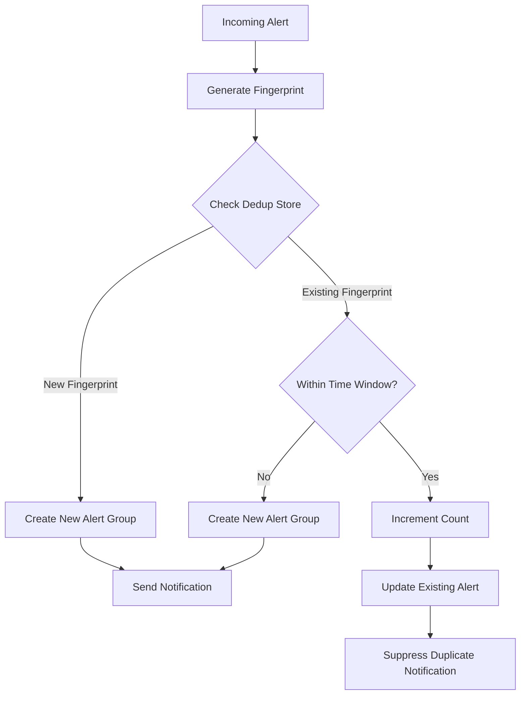
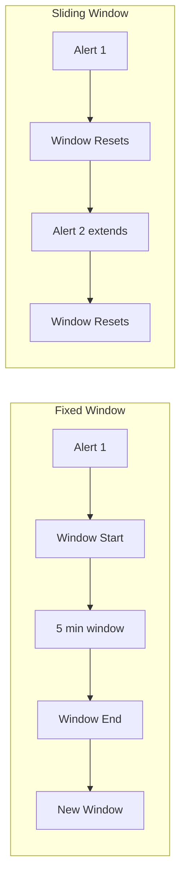
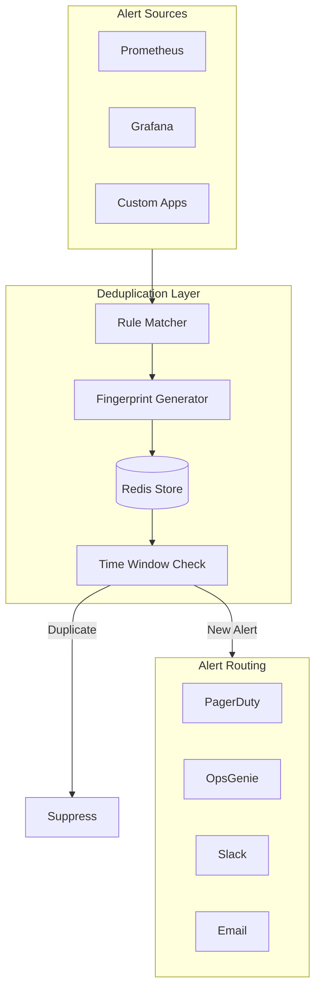

# How to Build Alert Deduplication Logic

Author: [nawazdhandala](https://github.com/nawazdhandala)

Tags: Observability, Alerting, Incident Management, SRE

Description: Learn how to implement alert deduplication to prevent duplicate notifications for the same issue.

---

Alert fatigue is one of the biggest challenges facing SRE and DevOps teams today. When a single incident triggers hundreds of identical alerts, it becomes nearly impossible to identify what actually needs attention. Alert deduplication is the practice of consolidating multiple alerts that represent the same underlying issue into a single actionable notification.

In this guide, we will explore how to build robust alert deduplication logic from scratch, covering fingerprinting strategies, deduplication keys, time windows, and integration with popular alerting platforms.

## Why Alert Deduplication Matters

Consider a scenario where your database server experiences high CPU usage. Without deduplication, you might receive:

- An alert every minute from your monitoring system
- Multiple alerts from different services that depend on the database
- Alerts from different monitoring tools watching the same metric

This can result in hundreds of notifications for a single root cause, leading to:

- **Alert fatigue**: Engineers start ignoring alerts
- **Slower response times**: Finding the real issue becomes difficult
- **Wasted resources**: Time spent triaging duplicate alerts

## How Alert Deduplication Works



The deduplication process follows these steps:

1. **Generate a fingerprint** from incoming alert attributes
2. **Check the deduplication store** for existing alerts with the same fingerprint
3. **Apply time window logic** to determine if this is a new incident or continuation
4. **Either create a new alert group or merge** into an existing one

## Building Deduplication Keys (Fingerprints)

The fingerprint is the foundation of alert deduplication. A good fingerprint should:

- Be consistent for the same underlying issue
- Be unique enough to distinguish different issues
- Include relevant context without being overly specific

### Basic Fingerprint Generation

```python
import hashlib
import json
from typing import Dict, List, Optional

def generate_fingerprint(
    alert: Dict,
    key_fields: List[str]
) -> str:
    """
    Generate a consistent fingerprint for an alert based on specified fields.

    Args:
        alert: The alert payload as a dictionary
        key_fields: List of field names to include in the fingerprint

    Returns:
        A hex string representing the alert fingerprint
    """
    # Extract values for the specified fields
    # Sort to ensure consistent ordering
    fingerprint_data = {}
    for field in sorted(key_fields):
        if field in alert:
            fingerprint_data[field] = alert[field]

    # Create a deterministic string representation
    fingerprint_string = json.dumps(fingerprint_data, sort_keys=True)

    # Generate SHA256 hash for the fingerprint
    return hashlib.sha256(fingerprint_string.encode()).hexdigest()


# Example usage
alert = {
    "source": "prometheus",
    "alertname": "HighCPUUsage",
    "host": "db-server-01",
    "severity": "critical",
    "value": 95.5,
    "timestamp": "2026-01-30T10:15:00Z"
}

# Include only fields that identify the issue, not its current state
key_fields = ["source", "alertname", "host"]
fingerprint = generate_fingerprint(alert, key_fields)
print(f"Fingerprint: {fingerprint}")
# Output: Fingerprint: 8f4e3d2c1b0a9f8e7d6c5b4a3f2e1d0c...
```

### Advanced Fingerprint Strategies

Different types of alerts require different fingerprinting approaches:

```python
from dataclasses import dataclass
from enum import Enum
from typing import Callable, Dict, List

class FingerprintStrategy(Enum):
    """Different strategies for generating alert fingerprints."""
    EXACT = "exact"           # Use exact field values
    NORMALIZED = "normalized" # Normalize values before hashing
    HIERARCHICAL = "hierarchical"  # Include parent/child relationships

@dataclass
class FingerprintConfig:
    """Configuration for fingerprint generation."""
    key_fields: List[str]
    strategy: FingerprintStrategy
    normalizers: Dict[str, Callable] = None

    def __post_init__(self):
        if self.normalizers is None:
            self.normalizers = {}


def normalize_hostname(hostname: str) -> str:
    """
    Normalize hostname to handle variations.
    Converts 'db-server-01.prod.example.com' to 'db-server-01'
    """
    # Remove domain suffixes
    return hostname.split('.')[0].lower()


def normalize_error_message(message: str) -> str:
    """
    Normalize error messages by removing dynamic parts.
    Converts 'Connection timeout after 30.5s' to 'Connection timeout after Xs'
    """
    import re
    # Replace numbers with placeholder
    normalized = re.sub(r'\d+\.?\d*', 'X', message)
    # Replace UUIDs with placeholder
    normalized = re.sub(
        r'[a-f0-9]{8}-[a-f0-9]{4}-[a-f0-9]{4}-[a-f0-9]{4}-[a-f0-9]{12}',
        'UUID',
        normalized,
        flags=re.IGNORECASE
    )
    return normalized


def generate_advanced_fingerprint(
    alert: Dict,
    config: FingerprintConfig
) -> str:
    """
    Generate fingerprint using advanced strategies.

    Args:
        alert: The alert payload
        config: Fingerprint configuration

    Returns:
        Alert fingerprint as hex string
    """
    fingerprint_data = {}

    for field in sorted(config.key_fields):
        if field not in alert:
            continue

        value = alert[field]

        # Apply normalizer if configured for this field
        if field in config.normalizers:
            value = config.normalizers[field](value)

        fingerprint_data[field] = value

    fingerprint_string = json.dumps(fingerprint_data, sort_keys=True)
    return hashlib.sha256(fingerprint_string.encode()).hexdigest()


# Example: Configure fingerprinting for infrastructure alerts
infra_config = FingerprintConfig(
    key_fields=["alertname", "host", "service"],
    strategy=FingerprintStrategy.NORMALIZED,
    normalizers={
        "host": normalize_hostname,
    }
)

# Example: Configure fingerprinting for application errors
app_error_config = FingerprintConfig(
    key_fields=["service", "error_type", "error_message"],
    strategy=FingerprintStrategy.NORMALIZED,
    normalizers={
        "error_message": normalize_error_message,
    }
)
```

## Implementing Time Windows

Time windows determine how long an alert fingerprint remains "active" for deduplication. There are several approaches:



### Time Window Implementation

```python
import time
from dataclasses import dataclass, field
from datetime import datetime, timedelta
from typing import Dict, Optional
from threading import Lock
import logging

logger = logging.getLogger(__name__)

@dataclass
class AlertGroup:
    """Represents a group of deduplicated alerts."""
    fingerprint: str
    first_seen: datetime
    last_seen: datetime
    count: int = 1
    sample_alert: Dict = field(default_factory=dict)

    def is_expired(self, window_seconds: int) -> bool:
        """Check if this alert group has expired based on time window."""
        return (datetime.utcnow() - self.last_seen).total_seconds() > window_seconds


class DeduplicationStore:
    """
    In-memory store for alert deduplication with time window support.

    For production use, consider Redis or another distributed cache
    to support multiple instances.
    """

    def __init__(
        self,
        window_seconds: int = 300,  # 5 minute default window
        sliding_window: bool = True
    ):
        """
        Initialize the deduplication store.

        Args:
            window_seconds: Duration of the deduplication window
            sliding_window: If True, reset window on each new alert
        """
        self.window_seconds = window_seconds
        self.sliding_window = sliding_window
        self.alert_groups: Dict[str, AlertGroup] = {}
        self.lock = Lock()

    def process_alert(self, fingerprint: str, alert: Dict) -> tuple[bool, AlertGroup]:
        """
        Process an incoming alert and determine if it should be deduplicated.

        Args:
            fingerprint: The alert fingerprint
            alert: The alert payload

        Returns:
            Tuple of (is_new_alert, alert_group)
        """
        with self.lock:
            now = datetime.utcnow()

            # Check if we have an existing group for this fingerprint
            if fingerprint in self.alert_groups:
                group = self.alert_groups[fingerprint]

                # Check if the group has expired
                if group.is_expired(self.window_seconds):
                    # Create new group
                    logger.info(f"Alert group expired, creating new group: {fingerprint[:16]}...")
                    new_group = AlertGroup(
                        fingerprint=fingerprint,
                        first_seen=now,
                        last_seen=now,
                        count=1,
                        sample_alert=alert
                    )
                    self.alert_groups[fingerprint] = new_group
                    return True, new_group

                # Update existing group
                group.count += 1
                if self.sliding_window:
                    group.last_seen = now

                logger.info(
                    f"Deduplicated alert: {fingerprint[:16]}... "
                    f"(count: {group.count})"
                )
                return False, group

            # Create new alert group
            new_group = AlertGroup(
                fingerprint=fingerprint,
                first_seen=now,
                last_seen=now,
                count=1,
                sample_alert=alert
            )
            self.alert_groups[fingerprint] = new_group
            logger.info(f"New alert group created: {fingerprint[:16]}...")
            return True, new_group

    def cleanup_expired(self) -> int:
        """
        Remove expired alert groups from the store.

        Returns:
            Number of groups removed
        """
        with self.lock:
            expired = [
                fp for fp, group in self.alert_groups.items()
                if group.is_expired(self.window_seconds)
            ]
            for fp in expired:
                del self.alert_groups[fp]

            if expired:
                logger.info(f"Cleaned up {len(expired)} expired alert groups")
            return len(expired)
```

### Redis-Based Deduplication Store

For production environments with multiple instances, use Redis:

```python
import redis
import json
from typing import Dict, Optional, Tuple

class RedisDeduplicationStore:
    """
    Redis-backed deduplication store for distributed environments.

    Uses Redis sorted sets for efficient time-based expiration
    and atomic operations for thread safety.
    """

    def __init__(
        self,
        redis_client: redis.Redis,
        window_seconds: int = 300,
        key_prefix: str = "alert:dedup:"
    ):
        """
        Initialize Redis deduplication store.

        Args:
            redis_client: Redis client instance
            window_seconds: Deduplication window duration
            key_prefix: Prefix for all Redis keys
        """
        self.redis = redis_client
        self.window_seconds = window_seconds
        self.key_prefix = key_prefix

    def _get_key(self, fingerprint: str) -> str:
        """Generate Redis key for a fingerprint."""
        return f"{self.key_prefix}{fingerprint}"

    def process_alert(
        self,
        fingerprint: str,
        alert: Dict
    ) -> Tuple[bool, Dict]:
        """
        Process alert with atomic Redis operations.

        Uses Redis transactions to ensure consistency
        across multiple application instances.
        """
        key = self._get_key(fingerprint)

        # Use Lua script for atomic check-and-update
        lua_script = """
        local key = KEYS[1]
        local alert_json = ARGV[1]
        local window_seconds = tonumber(ARGV[2])
        local now = tonumber(ARGV[3])

        local existing = redis.call('GET', key)

        if existing then
            -- Parse existing data
            local data = cjson.decode(existing)

            -- Check if expired
            if (now - data.last_seen) > window_seconds then
                -- Create new group
                local new_data = {
                    first_seen = now,
                    last_seen = now,
                    count = 1,
                    sample_alert = cjson.decode(alert_json)
                }
                redis.call('SETEX', key, window_seconds * 2, cjson.encode(new_data))
                return {1, cjson.encode(new_data)}
            end

            -- Update existing group
            data.count = data.count + 1
            data.last_seen = now
            redis.call('SETEX', key, window_seconds * 2, cjson.encode(data))
            return {0, cjson.encode(data)}
        end

        -- Create new group
        local new_data = {
            first_seen = now,
            last_seen = now,
            count = 1,
            sample_alert = cjson.decode(alert_json)
        }
        redis.call('SETEX', key, window_seconds * 2, cjson.encode(new_data))
        return {1, cjson.encode(new_data)}
        """

        import time
        result = self.redis.eval(
            lua_script,
            1,
            key,
            json.dumps(alert),
            self.window_seconds,
            int(time.time())
        )

        is_new = bool(result[0])
        group_data = json.loads(result[1])

        return is_new, group_data
```

## Complete Deduplication Pipeline

Here is a complete implementation that ties everything together:

```python
from dataclasses import dataclass
from typing import Dict, List, Callable, Optional
from enum import Enum
import logging

logger = logging.getLogger(__name__)

@dataclass
class DeduplicationRule:
    """
    Defines how alerts should be deduplicated.

    Different alert types may require different deduplication strategies.
    """
    name: str
    match_conditions: Dict[str, str]  # Field: value patterns to match
    key_fields: List[str]             # Fields to include in fingerprint
    window_seconds: int               # Deduplication time window
    normalizers: Dict[str, Callable] = None


class AlertDeduplicator:
    """
    Main class for alert deduplication.

    Supports multiple deduplication rules for different alert types
    and integrates with various notification backends.
    """

    def __init__(self, store: DeduplicationStore):
        """
        Initialize the deduplicator.

        Args:
            store: Backend store for deduplication state
        """
        self.store = store
        self.rules: List[DeduplicationRule] = []
        self.default_key_fields = ["source", "alertname", "host"]

    def add_rule(self, rule: DeduplicationRule) -> None:
        """Add a deduplication rule."""
        self.rules.append(rule)
        logger.info(f"Added deduplication rule: {rule.name}")

    def _match_rule(self, alert: Dict) -> Optional[DeduplicationRule]:
        """Find the first matching rule for an alert."""
        for rule in self.rules:
            matches = True
            for field, pattern in rule.match_conditions.items():
                if field not in alert:
                    matches = False
                    break
                # Simple pattern matching (can be extended to regex)
                if alert[field] != pattern and pattern != "*":
                    matches = False
                    break
            if matches:
                return rule
        return None

    def _generate_fingerprint(
        self,
        alert: Dict,
        key_fields: List[str],
        normalizers: Dict[str, Callable] = None
    ) -> str:
        """Generate fingerprint for an alert."""
        if normalizers is None:
            normalizers = {}

        fingerprint_data = {}
        for field in sorted(key_fields):
            if field in alert:
                value = alert[field]
                if field in normalizers:
                    value = normalizers[field](value)
                fingerprint_data[field] = value

        import hashlib
        import json
        fingerprint_string = json.dumps(fingerprint_data, sort_keys=True)
        return hashlib.sha256(fingerprint_string.encode()).hexdigest()

    def process(self, alert: Dict) -> Dict:
        """
        Process an incoming alert through the deduplication pipeline.

        Args:
            alert: The incoming alert payload

        Returns:
            Processed alert with deduplication metadata
        """
        # Find matching rule or use defaults
        rule = self._match_rule(alert)

        if rule:
            key_fields = rule.key_fields
            normalizers = rule.normalizers or {}
            logger.debug(f"Using rule '{rule.name}' for alert")
        else:
            key_fields = self.default_key_fields
            normalizers = {}
            logger.debug("Using default deduplication settings")

        # Generate fingerprint
        fingerprint = self._generate_fingerprint(alert, key_fields, normalizers)

        # Check deduplication store
        is_new, group = self.store.process_alert(fingerprint, alert)

        # Enrich alert with deduplication metadata
        result = {
            **alert,
            "dedup": {
                "fingerprint": fingerprint,
                "is_new": is_new,
                "count": group.count if hasattr(group, 'count') else group.get('count', 1),
                "first_seen": str(group.first_seen) if hasattr(group, 'first_seen') else group.get('first_seen'),
            }
        }

        return result


# Example usage
def main():
    # Initialize store and deduplicator
    store = DeduplicationStore(window_seconds=300, sliding_window=True)
    deduplicator = AlertDeduplicator(store)

    # Add custom rules for different alert types
    deduplicator.add_rule(DeduplicationRule(
        name="database_alerts",
        match_conditions={"service": "database"},
        key_fields=["service", "alertname", "instance"],
        window_seconds=600,  # 10 minute window for DB alerts
    ))

    deduplicator.add_rule(DeduplicationRule(
        name="application_errors",
        match_conditions={"source": "application"},
        key_fields=["service", "error_type", "error_message"],
        window_seconds=300,
        normalizers={"error_message": normalize_error_message},
    ))

    # Process alerts
    alerts = [
        {"source": "prometheus", "alertname": "HighCPU", "host": "web-01", "value": 95},
        {"source": "prometheus", "alertname": "HighCPU", "host": "web-01", "value": 97},
        {"source": "prometheus", "alertname": "HighCPU", "host": "web-02", "value": 92},
    ]

    for alert in alerts:
        result = deduplicator.process(alert)
        print(f"Alert: {alert['alertname']} on {alert['host']}")
        print(f"  New: {result['dedup']['is_new']}, Count: {result['dedup']['count']}")


if __name__ == "__main__":
    main()
```

## Integration with PagerDuty

PagerDuty uses a concept called `dedup_key` (also known as `incident_key`) to group related alerts:

```python
import requests
from typing import Dict, Optional

class PagerDutyIntegration:
    """
    Integration with PagerDuty Events API v2.

    PagerDuty automatically deduplicates alerts that share the same
    dedup_key within the same service.
    """

    def __init__(self, routing_key: str):
        """
        Initialize PagerDuty integration.

        Args:
            routing_key: Integration key from PagerDuty service
        """
        self.routing_key = routing_key
        self.api_url = "https://events.pagerduty.com/v2/enqueue"

    def send_alert(
        self,
        alert: Dict,
        dedup_key: str,
        action: str = "trigger"
    ) -> Dict:
        """
        Send alert to PagerDuty with deduplication.

        Args:
            alert: Alert payload with title, details, etc.
            dedup_key: Key for deduplication (max 255 characters)
            action: One of 'trigger', 'acknowledge', 'resolve'

        Returns:
            PagerDuty API response
        """
        # Build PagerDuty event payload
        payload = {
            "routing_key": self.routing_key,
            "event_action": action,
            "dedup_key": dedup_key[:255],  # PagerDuty limit
            "payload": {
                "summary": alert.get("title", "Alert"),
                "severity": self._map_severity(alert.get("severity", "warning")),
                "source": alert.get("source", "monitoring"),
                "custom_details": alert
            }
        }

        # Send to PagerDuty
        response = requests.post(
            self.api_url,
            json=payload,
            headers={"Content-Type": "application/json"}
        )
        response.raise_for_status()

        return response.json()

    def _map_severity(self, severity: str) -> str:
        """Map internal severity to PagerDuty severity levels."""
        mapping = {
            "critical": "critical",
            "error": "error",
            "warning": "warning",
            "info": "info",
        }
        return mapping.get(severity.lower(), "warning")

    def resolve_alert(self, dedup_key: str) -> Dict:
        """
        Resolve an existing PagerDuty incident.

        Automatically resolves all incidents with the matching dedup_key.
        """
        return self.send_alert({}, dedup_key, action="resolve")


# Example: Using PagerDuty deduplication
def send_to_pagerduty(alert: Dict, fingerprint: str):
    """
    Send deduplicated alert to PagerDuty.

    The fingerprint from our deduplication logic becomes
    the PagerDuty dedup_key.
    """
    pd = PagerDutyIntegration(routing_key="your-routing-key")

    # Use our fingerprint as PagerDuty's dedup_key
    # This ensures consistency between our dedup and PagerDuty's
    response = pd.send_alert(
        alert=alert,
        dedup_key=fingerprint
    )

    print(f"PagerDuty response: {response}")
```

## Integration with OpsGenie

OpsGenie uses an `alias` field for deduplication:

```python
import requests
from typing import Dict, List, Optional

class OpsGenieIntegration:
    """
    Integration with OpsGenie Alert API.

    OpsGenie deduplicates alerts based on the 'alias' field.
    Alerts with the same alias are grouped into a single alert.
    """

    def __init__(self, api_key: str, region: str = "us"):
        """
        Initialize OpsGenie integration.

        Args:
            api_key: OpsGenie API key
            region: API region ('us' or 'eu')
        """
        self.api_key = api_key
        if region == "eu":
            self.api_url = "https://api.eu.opsgenie.com/v2/alerts"
        else:
            self.api_url = "https://api.opsgenie.com/v2/alerts"

    def create_alert(
        self,
        alert: Dict,
        alias: str,
        tags: List[str] = None
    ) -> Dict:
        """
        Create or update an alert in OpsGenie.

        If an open alert with the same alias exists, OpsGenie
        increments the count instead of creating a new alert.

        Args:
            alert: Alert payload
            alias: Unique identifier for deduplication (max 512 chars)
            tags: Optional list of tags

        Returns:
            OpsGenie API response
        """
        payload = {
            "message": alert.get("title", "Alert")[:130],  # OpsGenie limit
            "alias": alias[:512],  # OpsGenie limit
            "description": alert.get("description", ""),
            "priority": self._map_priority(alert.get("severity", "warning")),
            "source": alert.get("source", "monitoring"),
            "tags": tags or [],
            "details": alert  # Custom fields
        }

        response = requests.post(
            self.api_url,
            json=payload,
            headers={
                "Content-Type": "application/json",
                "Authorization": f"GenieKey {self.api_key}"
            }
        )
        response.raise_for_status()

        return response.json()

    def _map_priority(self, severity: str) -> str:
        """Map internal severity to OpsGenie priority."""
        mapping = {
            "critical": "P1",
            "error": "P2",
            "warning": "P3",
            "info": "P4",
        }
        return mapping.get(severity.lower(), "P3")

    def close_alert(self, alias: str) -> Dict:
        """
        Close an alert by its alias.

        Automatically closes the alert and stops notifications.
        """
        response = requests.post(
            f"{self.api_url}/{alias}/close",
            params={"identifierType": "alias"},
            json={"source": "monitoring"},
            headers={
                "Content-Type": "application/json",
                "Authorization": f"GenieKey {self.api_key}"
            }
        )
        response.raise_for_status()

        return response.json()


# Example: Integrated workflow with OpsGenie
def process_and_notify_opsgenie(
    alert: Dict,
    deduplicator: AlertDeduplicator,
    opsgenie: OpsGenieIntegration
):
    """
    Process alert through deduplication and send to OpsGenie.

    Only sends new alerts to OpsGenie. OpsGenie handles
    subsequent deduplication on its end using the alias.
    """
    # Process through our deduplication
    result = deduplicator.process(alert)

    # Only send if this is a new alert
    # OpsGenie will handle any remaining duplicates
    if result["dedup"]["is_new"]:
        opsgenie.create_alert(
            alert=alert,
            alias=result["dedup"]["fingerprint"],
            tags=["deduplicated", alert.get("severity", "warning")]
        )
        print(f"New alert sent to OpsGenie: {alert.get('title')}")
    else:
        print(
            f"Alert deduplicated locally "
            f"(count: {result['dedup']['count']})"
        )
```

## Deduplication Architecture Diagram



## Best Practices

### 1. Choose the Right Key Fields

Select fields that identify the issue without being too specific:

```python
# Good: Identifies the issue without timestamp
key_fields = ["alertname", "host", "service"]

# Bad: Too specific, will never deduplicate
key_fields = ["alertname", "host", "service", "timestamp", "value"]

# Bad: Too broad, will over-deduplicate
key_fields = ["alertname"]
```

### 2. Tune Time Windows Per Alert Type

Different alerts need different windows:

```python
# Short window for transient issues
network_rule = DeduplicationRule(
    name="network_alerts",
    match_conditions={"category": "network"},
    key_fields=["alertname", "host", "interface"],
    window_seconds=60,  # 1 minute
)

# Longer window for persistent issues
database_rule = DeduplicationRule(
    name="database_alerts",
    match_conditions={"category": "database"},
    key_fields=["alertname", "instance", "database"],
    window_seconds=900,  # 15 minutes
)
```

### 3. Implement Alert Count Thresholds

Send notifications based on occurrence count:

```python
def should_notify(alert_group: AlertGroup) -> bool:
    """
    Determine if an alert group should trigger a notification.

    Uses count thresholds to filter out transient issues.
    """
    count = alert_group.count

    # Always notify on first occurrence
    if count == 1:
        return True

    # Notify again at certain thresholds
    # This prevents notification storms while keeping teams informed
    notification_thresholds = [1, 5, 10, 50, 100, 500, 1000]

    return count in notification_thresholds
```

### 4. Handle Alert Resolution

Track when issues resolve to close deduplicated alerts:

```python
def process_resolution(
    fingerprint: str,
    store: DeduplicationStore,
    pagerduty: PagerDutyIntegration
) -> None:
    """
    Handle alert resolution and close related incidents.

    When the underlying issue is resolved, we need to:
    1. Remove the fingerprint from our store
    2. Resolve the incident in downstream systems
    """
    # Remove from deduplication store
    if fingerprint in store.alert_groups:
        del store.alert_groups[fingerprint]

    # Resolve in PagerDuty
    pagerduty.resolve_alert(dedup_key=fingerprint)
```

## Testing Your Deduplication Logic

```python
import unittest
from datetime import datetime, timedelta
from unittest.mock import Mock, patch

class TestAlertDeduplication(unittest.TestCase):
    """Unit tests for alert deduplication logic."""

    def setUp(self):
        """Set up test fixtures."""
        self.store = DeduplicationStore(
            window_seconds=300,
            sliding_window=True
        )
        self.deduplicator = AlertDeduplicator(self.store)

    def test_identical_alerts_are_deduplicated(self):
        """Verify that identical alerts produce the same fingerprint."""
        alert1 = {"alertname": "HighCPU", "host": "web-01"}
        alert2 = {"alertname": "HighCPU", "host": "web-01"}

        result1 = self.deduplicator.process(alert1)
        result2 = self.deduplicator.process(alert2)

        # Same fingerprint
        self.assertEqual(
            result1["dedup"]["fingerprint"],
            result2["dedup"]["fingerprint"]
        )
        # First is new, second is deduplicated
        self.assertTrue(result1["dedup"]["is_new"])
        self.assertFalse(result2["dedup"]["is_new"])
        # Count increments
        self.assertEqual(result2["dedup"]["count"], 2)

    def test_different_alerts_not_deduplicated(self):
        """Verify that different alerts have different fingerprints."""
        alert1 = {"alertname": "HighCPU", "host": "web-01"}
        alert2 = {"alertname": "HighCPU", "host": "web-02"}

        result1 = self.deduplicator.process(alert1)
        result2 = self.deduplicator.process(alert2)

        # Different fingerprints
        self.assertNotEqual(
            result1["dedup"]["fingerprint"],
            result2["dedup"]["fingerprint"]
        )
        # Both are new
        self.assertTrue(result1["dedup"]["is_new"])
        self.assertTrue(result2["dedup"]["is_new"])

    def test_window_expiration(self):
        """Verify that expired windows create new alert groups."""
        alert = {"alertname": "HighCPU", "host": "web-01"}

        result1 = self.deduplicator.process(alert)

        # Simulate window expiration
        fingerprint = result1["dedup"]["fingerprint"]
        self.store.alert_groups[fingerprint].last_seen = (
            datetime.utcnow() - timedelta(seconds=400)
        )

        result2 = self.deduplicator.process(alert)

        # Should be treated as new after expiration
        self.assertTrue(result2["dedup"]["is_new"])


if __name__ == "__main__":
    unittest.main()
```

## Conclusion

Alert deduplication is essential for maintaining effective incident response as your infrastructure grows. Key takeaways:

1. **Design fingerprints carefully**: Include fields that identify the issue without being overly specific
2. **Use appropriate time windows**: Different alert types need different deduplication windows
3. **Leverage platform features**: PagerDuty and OpsGenie have built-in deduplication that complements your logic
4. **Test thoroughly**: Deduplication bugs can either flood teams with duplicates or suppress important alerts
5. **Monitor your deduplication**: Track metrics like deduplication ratio and window effectiveness

By implementing these patterns, you can significantly reduce alert noise while ensuring that critical issues still get the attention they deserve.

## Further Reading

- [PagerDuty Events API v2 Documentation](https://developer.pagerduty.com/docs/events-api-v2/overview/)
- [OpsGenie Alert API Documentation](https://docs.opsgenie.com/docs/alert-api)
- [Google SRE Book: Monitoring Distributed Systems](https://sre.google/sre-book/monitoring-distributed-systems/)
- [Prometheus Alerting Best Practices](https://prometheus.io/docs/practices/alerting/)
