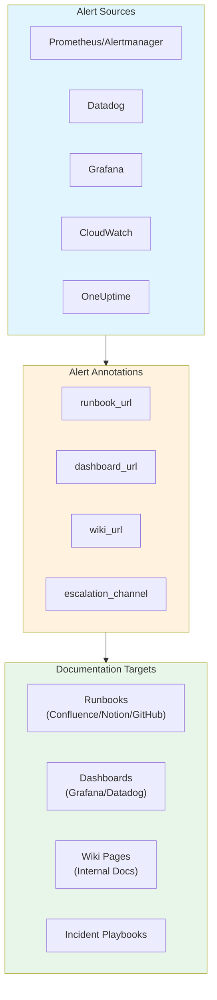
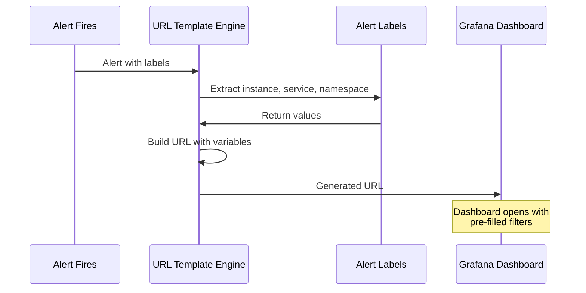
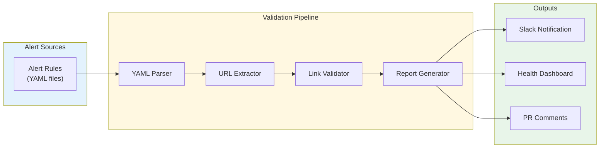

# How to Create Alert Documentation Links

Author: [nawazdhandala](https://github.com/nawazdhandala)

Tags: Alerting, Documentation, SRE, Observability

Description: Learn how to link alerts to relevant documentation for faster incident response.

> The difference between a 5-minute resolution and a 2-hour firefight often comes down to one thing: **can the on-call engineer immediately find the right documentation?**

When an alert fires at 3 AM, the on-call engineer needs context fast. Alert documentation links transform cryptic notifications into actionable incidents by connecting alerts directly to runbooks, dashboards, and relevant wiki pages. This guide covers practical patterns for implementing documentation links across popular alerting systems.

---

## Why Alert Documentation Links Matter

| Without Doc Links | With Doc Links |
|-------------------|----------------|
| Engineer searches wiki/Confluence | Direct link to runbook in alert |
| Context switching between tools | One-click access to relevant dashboard |
| Tribal knowledge required | Self-service incident response |
| Longer MTTR | Faster time-to-context |
| On-call burnout | Empowered responders |

The goal: **Every alert should answer "What do I do next?" within the notification itself.**

---

## Alert Documentation Link Architecture



---

## 1. Alert Annotation Patterns

Alert annotations are metadata fields attached to alerts that provide additional context. The most powerful use is embedding documentation links.

### Standard Annotation Fields

| Field | Purpose | Example |
|-------|---------|---------|
| `runbook_url` | Link to troubleshooting steps | `https://wiki.company.com/runbooks/high-cpu` |
| `dashboard_url` | Link to relevant dashboard | `https://grafana.company.com/d/abc123` |
| `description` | Human-readable alert context | "CPU usage exceeded 90% for 5 minutes" |
| `summary` | Brief alert title | "High CPU on payment-service" |
| `wiki_url` | Background documentation | `https://docs.company.com/services/payment` |

### Prometheus Alerting Rules with Annotations

```yaml
# prometheus/alerts/infrastructure.yml
groups:
  - name: infrastructure
    rules:
      - alert: HighCPUUsage
        expr: 100 - (avg by(instance) (rate(node_cpu_seconds_total{mode="idle"}[5m])) * 100) > 90
        for: 5m
        labels:
          severity: warning
          team: platform
        annotations:
          summary: "High CPU usage on {{ $labels.instance }}"
          description: |
            CPU usage is {{ printf "%.1f" $value }}% on {{ $labels.instance }}.
            This may indicate resource contention or a runaway process.
          runbook_url: "https://wiki.company.com/runbooks/high-cpu-usage"
          dashboard_url: "https://grafana.company.com/d/node-exporter/node-exporter?var-instance={{ $labels.instance }}"
          wiki_url: "https://docs.company.com/infrastructure/compute-resources"

      - alert: HighMemoryUsage
        expr: (1 - (node_memory_MemAvailable_bytes / node_memory_MemTotal_bytes)) * 100 > 85
        for: 5m
        labels:
          severity: warning
          team: platform
        annotations:
          summary: "High memory usage on {{ $labels.instance }}"
          description: |
            Memory usage is {{ printf "%.1f" $value }}% on {{ $labels.instance }}.
          runbook_url: "https://wiki.company.com/runbooks/high-memory-usage"
          dashboard_url: "https://grafana.company.com/d/node-exporter/node-exporter?var-instance={{ $labels.instance }}&var-job={{ $labels.job }}"

      - alert: DiskSpaceLow
        expr: (node_filesystem_avail_bytes{fstype!~"tmpfs|overlay"} / node_filesystem_size_bytes) * 100 < 15
        for: 10m
        labels:
          severity: critical
          team: platform
        annotations:
          summary: "Low disk space on {{ $labels.instance }} ({{ $labels.mountpoint }})"
          description: |
            Disk space is {{ printf "%.1f" $value }}% free on {{ $labels.mountpoint }}.
            Immediate action required to prevent service disruption.
          runbook_url: "https://wiki.company.com/runbooks/disk-space-low"
          dashboard_url: "https://grafana.company.com/d/disk-usage/disk-usage?var-instance={{ $labels.instance }}"
          escalation_channel: "#platform-oncall"
```

### Application-Level Alert Rules

```yaml
# prometheus/alerts/application.yml
groups:
  - name: payment-service
    rules:
      - alert: PaymentServiceHighLatency
        expr: histogram_quantile(0.95, rate(http_request_duration_seconds_bucket{service="payment-service"}[5m])) > 2
        for: 3m
        labels:
          severity: critical
          team: payments
          service: payment-service
        annotations:
          summary: "Payment service p95 latency is {{ printf \"%.2f\" $value }}s"
          description: |
            The payment service is experiencing elevated latency.
            P95 latency: {{ printf "%.2f" $value }} seconds (threshold: 2s)
            This may impact checkout completion rates.
          runbook_url: "https://wiki.company.com/runbooks/payment-service-latency"
          dashboard_url: "https://grafana.company.com/d/payment-service/payment-service-overview"
          traces_url: "https://jaeger.company.com/search?service=payment-service&lookback=1h&minDuration=2s"
          wiki_url: "https://docs.company.com/services/payment-service"

      - alert: PaymentServiceHighErrorRate
        expr: rate(http_requests_total{service="payment-service",status=~"5.."}[5m]) / rate(http_requests_total{service="payment-service"}[5m]) > 0.05
        for: 2m
        labels:
          severity: critical
          team: payments
          service: payment-service
        annotations:
          summary: "Payment service error rate is {{ printf \"%.1f\" (mul $value 100) }}%"
          description: |
            Error rate has exceeded 5% threshold.
            Current rate: {{ printf "%.1f" (mul $value 100) }}%
            Check for upstream dependency failures or deployment issues.
          runbook_url: "https://wiki.company.com/runbooks/payment-service-errors"
          dashboard_url: "https://grafana.company.com/d/payment-service/payment-service-overview?viewPanel=error-rate"
          logs_url: "https://logs.company.com/app/discover#/?_g=(filters:!((query:(match_phrase:(service:'payment-service')))))&_a=(query:(language:kuery,query:'level:error'))"
```

---

## 2. Runbook URL Integration

Runbooks are step-by-step guides for resolving specific incidents. The key is making them discoverable at alert time.

### Runbook URL Naming Convention

Establish a predictable URL pattern so engineers can guess URLs even without the link:

```
https://wiki.company.com/runbooks/{alert-name-kebab-case}
https://wiki.company.com/runbooks/{service}/{alert-category}
```

### Alertmanager Configuration for Runbook Links

```yaml
# alertmanager/alertmanager.yml
global:
  resolve_timeout: 5m

route:
  receiver: 'default'
  group_by: ['alertname', 'service']
  group_wait: 30s
  group_interval: 5m
  repeat_interval: 4h
  routes:
    - match:
        severity: critical
      receiver: 'pagerduty-critical'
    - match:
        severity: warning
      receiver: 'slack-warnings'

receivers:
  - name: 'default'
    slack_configs:
      - api_url: '${SLACK_WEBHOOK_URL}'
        channel: '#alerts'
        title: '{{ .GroupLabels.alertname }}'
        text: |
          {{ range .Alerts }}
          *Summary:* {{ .Annotations.summary }}
          *Description:* {{ .Annotations.description }}
          *Severity:* {{ .Labels.severity }}

          *Documentation:*
          {{ if .Annotations.runbook_url }}:book: <{{ .Annotations.runbook_url }}|Runbook>{{ end }}
          {{ if .Annotations.dashboard_url }}:chart_with_upwards_trend: <{{ .Annotations.dashboard_url }}|Dashboard>{{ end }}
          {{ if .Annotations.wiki_url }}:page_facing_up: <{{ .Annotations.wiki_url }}|Service Docs>{{ end }}
          {{ if .Annotations.logs_url }}:scroll: <{{ .Annotations.logs_url }}|Logs>{{ end }}
          {{ if .Annotations.traces_url }}:mag: <{{ .Annotations.traces_url }}|Traces>{{ end }}
          {{ end }}

  - name: 'pagerduty-critical'
    pagerduty_configs:
      - service_key: '${PAGERDUTY_SERVICE_KEY}'
        severity: critical
        description: '{{ .GroupLabels.alertname }}: {{ .CommonAnnotations.summary }}'
        details:
          description: '{{ .CommonAnnotations.description }}'
          runbook_url: '{{ .CommonAnnotations.runbook_url }}'
          dashboard_url: '{{ .CommonAnnotations.dashboard_url }}'
          firing_alerts: '{{ len .Alerts.Firing }}'
        links:
          - href: '{{ .CommonAnnotations.runbook_url }}'
            text: 'Runbook'
          - href: '{{ .CommonAnnotations.dashboard_url }}'
            text: 'Dashboard'

  - name: 'slack-warnings'
    slack_configs:
      - api_url: '${SLACK_WEBHOOK_URL}'
        channel: '#alerts-warnings'
        color: 'warning'
        title: ':warning: {{ .GroupLabels.alertname }}'
        text: |
          {{ .CommonAnnotations.summary }}

          {{ if .CommonAnnotations.runbook_url }}:book: <{{ .CommonAnnotations.runbook_url }}|View Runbook>{{ end }}
```

### Runbook Template Structure

```markdown
# Runbook: High CPU Usage

## Alert Details
- **Alert Name:** HighCPUUsage
- **Severity:** Warning/Critical
- **Team:** Platform
- **Escalation:** #platform-oncall

## Overview
This alert fires when CPU usage exceeds 90% for more than 5 minutes
on any monitored instance.

## Impact
- Service degradation and increased latency
- Potential request timeouts
- Risk of OOM kills if memory pressure follows

## Investigation Steps

### 1. Identify the Cause
```bash
# SSH to affected instance
ssh ${INSTANCE}

# Check top processes by CPU
top -bn1 | head -20

# Check for runaway processes
ps aux --sort=-%cpu | head -10
```

### 2. Check Recent Deployments
- Review deployment history in ArgoCD
- Check if alert correlates with recent releases

### 3. Analyze Application Metrics
- [Dashboard: Node Exporter](https://grafana.company.com/d/node-exporter)
- [Dashboard: Application Metrics](https://grafana.company.com/d/app-overview)

## Remediation Steps

### Quick Fixes
1. **Scale horizontally:** Add more replicas if using Kubernetes
2. **Restart service:** If a process is stuck/leaking
3. **Rollback:** If correlated with recent deployment

### Long-term Fixes
1. Profile application for CPU hotspots
2. Implement caching for expensive computations
3. Review and optimize database queries

## Escalation
If unresolved after 15 minutes:
1. Page secondary on-call
2. Notify #platform-oncall Slack channel
3. Create incident in PagerDuty

## Related Documentation
- [Service Architecture](https://docs.company.com/architecture)
- [Scaling Guidelines](https://docs.company.com/scaling)
- [Incident Response Process](https://docs.company.com/incident-response)
```

---

## 3. Dashboard Link Generation

Dynamic dashboard links with pre-filled filters dramatically reduce time-to-context.

### Grafana Dashboard Link Patterns

```yaml
# Dynamic dashboard URL with variable substitution
annotations:
  dashboard_url: "https://grafana.company.com/d/{{ $labels.dashboard_id }}/{{ $labels.service }}?orgId=1&var-instance={{ $labels.instance }}&var-namespace={{ $labels.namespace }}&from=now-1h&to=now"
```

### Dashboard Link Flow



### Grafana Alert Rule with Dashboard Links (Grafana 9+)

```yaml
# grafana/provisioning/alerting/alerts.yml
apiVersion: 1
groups:
  - orgId: 1
    name: service-alerts
    folder: Alerts
    interval: 1m
    rules:
      - uid: high-latency-alert
        title: High Service Latency
        condition: C
        data:
          - refId: A
            relativeTimeRange:
              from: 300
              to: 0
            datasourceUid: prometheus
            model:
              expr: histogram_quantile(0.95, rate(http_request_duration_seconds_bucket[5m]))
              intervalMs: 1000
              maxDataPoints: 43200
              refId: A
          - refId: C
            datasourceUid: __expr__
            model:
              conditions:
                - evaluator:
                    params: [2]
                    type: gt
                  operator:
                    type: and
                  query:
                    params: [A]
                  reducer:
                    type: last
              refId: C
              type: threshold
        noDataState: NoData
        execErrState: Error
        for: 5m
        annotations:
          summary: "Service latency is elevated"
          description: "P95 latency has exceeded 2 seconds"
          runbook_url: "https://wiki.company.com/runbooks/high-latency"
          __dashboardUid__: "service-overview"
          __panelId__: "latency-panel"
        labels:
          severity: warning
```

### Multi-Dashboard Link Strategy

For complex services, link to multiple relevant dashboards:

```yaml
annotations:
  summary: "Database connection pool exhausted"
  dashboard_url: "https://grafana.company.com/d/db-connections/database-connections?var-instance={{ $labels.instance }}"
  dashboard_app_url: "https://grafana.company.com/d/app-overview/application-overview?var-service={{ $labels.service }}"
  dashboard_infra_url: "https://grafana.company.com/d/infra/infrastructure?var-node={{ $labels.node }}"
```

---

## 4. Wiki Documentation Links

Wiki links provide broader context about services, architecture, and ownership.

### Service Catalog Integration

```yaml
# alerts/service-alerts.yml
groups:
  - name: order-service-alerts
    rules:
      - alert: OrderServiceDown
        expr: up{job="order-service"} == 0
        for: 1m
        labels:
          severity: critical
          team: orders
        annotations:
          summary: "Order service is down"
          description: "The order service has been unreachable for over 1 minute."
          runbook_url: "https://wiki.company.com/runbooks/order-service-down"
          dashboard_url: "https://grafana.company.com/d/order-service/order-service-overview"
          wiki_url: "https://wiki.company.com/services/order-service"
          architecture_url: "https://wiki.company.com/architecture/order-processing"
          team_url: "https://wiki.company.com/teams/orders"
          oncall_url: "https://pagerduty.company.com/schedules/orders-oncall"
```

### Documentation Link Categories

| Link Type | Purpose | When to Include |
|-----------|---------|-----------------|
| `wiki_url` | Service documentation | Always |
| `architecture_url` | System design docs | For complex interactions |
| `team_url` | Team ownership page | For escalation |
| `oncall_url` | On-call schedule | Critical alerts |
| `postmortem_url` | Related past incidents | If recurring issue |
| `slo_url` | SLO dashboard | SLO-related alerts |

### Confluence/Notion Integration Pattern

```yaml
# Use consistent wiki URL structure
annotations:
  # Confluence pattern
  wiki_url: "https://company.atlassian.net/wiki/spaces/ENG/pages/{{ $labels.service_page_id }}"

  # Notion pattern
  wiki_url: "https://notion.so/company/{{ $labels.service }}-{{ $labels.service_notion_id }}"

  # GitHub Wiki pattern
  wiki_url: "https://github.com/company/{{ $labels.repo }}/wiki/{{ $labels.service }}-Operations"
```

---

## 5. Dynamic Link Templating

Dynamic templates allow alert links to adapt based on alert context.

### Template Variables in Prometheus

```yaml
# Available template variables in Prometheus alerting rules
annotations:
  summary: "{{ $labels.alertname }} on {{ $labels.instance }}"

  # Use $value for the current metric value
  description: "Current value: {{ printf \"%.2f\" $value }}"

  # Use $labels for any label on the metric
  runbook_url: "https://wiki.company.com/runbooks/{{ $labels.alertname | toLower | replace \" \" \"-\" }}"

  # Build complex URLs with multiple labels
  dashboard_url: |
    https://grafana.company.com/d/{{ $labels.dashboard_uid }}/{{ $labels.service }}?
    var-instance={{ $labels.instance }}&
    var-namespace={{ $labels.namespace }}&
    var-pod={{ $labels.pod }}&
    from=now-1h&to=now
```

### Advanced Templating with Alertmanager

```yaml
# alertmanager/templates/custom.tmpl
{{ define "slack.custom.title" }}
[{{ .Status | toUpper }}] {{ .GroupLabels.alertname }}
{{ end }}

{{ define "slack.custom.text" }}
{{ range .Alerts }}
*Alert:* {{ .Labels.alertname }}
*Severity:* {{ .Labels.severity }}
*Instance:* {{ .Labels.instance }}

{{ .Annotations.description }}

*Quick Links:*
{{ if .Annotations.runbook_url }}* <{{ .Annotations.runbook_url }}|Runbook>{{ end }}
{{ if .Annotations.dashboard_url }}* <{{ .Annotations.dashboard_url }}|Dashboard>{{ end }}
{{ if .Annotations.logs_url }}* <{{ .Annotations.logs_url }}|Logs>{{ end }}

{{ if eq .Labels.severity "critical" }}
*Escalation:* <{{ .Annotations.oncall_url }}|View On-Call Schedule>
{{ end }}
{{ end }}
{{ end }}

{{ define "pagerduty.custom.links" }}
[
  {{ if .CommonAnnotations.runbook_url }}
  {"href": "{{ .CommonAnnotations.runbook_url }}", "text": "Runbook"},
  {{ end }}
  {{ if .CommonAnnotations.dashboard_url }}
  {"href": "{{ .CommonAnnotations.dashboard_url }}", "text": "Dashboard"},
  {{ end }}
  {{ if .CommonAnnotations.logs_url }}
  {"href": "{{ .CommonAnnotations.logs_url }}", "text": "Logs"}
  {{ end }}
]
{{ end }}
```

### Environment-Aware Links

```yaml
# alerts/environment-aware.yml
groups:
  - name: api-alerts
    rules:
      - alert: APIHighLatency
        expr: histogram_quantile(0.95, rate(http_request_duration_seconds_bucket[5m])) > 1
        labels:
          severity: warning
        annotations:
          summary: "API latency elevated in {{ $labels.environment }}"
          # Environment-specific dashboard URLs
          dashboard_url: >-
            {{- if eq $labels.environment "production" -}}
            https://grafana.company.com/d/api-prod/api-production
            {{- else if eq $labels.environment "staging" -}}
            https://grafana-staging.company.com/d/api-stage/api-staging
            {{- else -}}
            https://grafana-dev.company.com/d/api-dev/api-development
            {{- end -}}
          # Environment-specific logs
          logs_url: >-
            https://logs.company.com/app/discover#/?_g=()&_a=(query:(match:(environment:'{{ $labels.environment }}')))
```

---

## 6. Link Validation and Maintenance

Broken links erode trust in alert documentation. Implement validation to keep links healthy.

### Link Validation Architecture



### Link Validation Script

```python
#!/usr/bin/env python3
"""
validate_alert_links.py
Validates all documentation links in Prometheus alert rules.
"""

import yaml
import requests
import sys
from pathlib import Path
from concurrent.futures import ThreadPoolExecutor, as_completed
from dataclasses import dataclass
from typing import List, Optional
import re


@dataclass
class LinkValidationResult:
    alert_name: str
    link_type: str
    url: str
    status_code: Optional[int]
    is_valid: bool
    error: Optional[str] = None


def extract_urls_from_annotations(annotations: dict, alert_name: str) -> List[tuple]:
    """Extract URLs from alert annotations."""
    url_fields = ['runbook_url', 'dashboard_url', 'wiki_url', 'logs_url',
                  'traces_url', 'architecture_url', 'oncall_url']
    urls = []

    for field in url_fields:
        if field in annotations:
            url = annotations[field]
            # Skip template variables (contain {{ }})
            if '{{' not in url:
                urls.append((alert_name, field, url))

    return urls


def validate_url(alert_name: str, link_type: str, url: str,
                 timeout: int = 10) -> LinkValidationResult:
    """Validate a single URL."""
    try:
        # Handle internal URLs that might need auth
        headers = {'User-Agent': 'AlertLinkValidator/1.0'}

        response = requests.head(url, timeout=timeout, headers=headers,
                                 allow_redirects=True)

        is_valid = response.status_code < 400
        return LinkValidationResult(
            alert_name=alert_name,
            link_type=link_type,
            url=url,
            status_code=response.status_code,
            is_valid=is_valid
        )
    except requests.exceptions.Timeout:
        return LinkValidationResult(
            alert_name=alert_name,
            link_type=link_type,
            url=url,
            status_code=None,
            is_valid=False,
            error="Timeout"
        )
    except requests.exceptions.RequestException as e:
        return LinkValidationResult(
            alert_name=alert_name,
            link_type=link_type,
            url=url,
            status_code=None,
            is_valid=False,
            error=str(e)
        )


def load_alert_rules(path: Path) -> List[dict]:
    """Load alert rules from YAML files."""
    rules = []

    for yaml_file in path.rglob('*.yml'):
        with open(yaml_file) as f:
            try:
                content = yaml.safe_load(f)
                if content and 'groups' in content:
                    for group in content['groups']:
                        if 'rules' in group:
                            rules.extend(group['rules'])
            except yaml.YAMLError as e:
                print(f"Error parsing {yaml_file}: {e}", file=sys.stderr)

    return rules


def main():
    alerts_path = Path(sys.argv[1]) if len(sys.argv) > 1 else Path('./alerts')

    print(f"Loading alert rules from {alerts_path}...")
    rules = load_alert_rules(alerts_path)

    # Extract all URLs
    urls_to_validate = []
    for rule in rules:
        if 'alert' in rule and 'annotations' in rule:
            urls_to_validate.extend(
                extract_urls_from_annotations(rule['annotations'], rule['alert'])
            )

    print(f"Found {len(urls_to_validate)} URLs to validate...")

    # Validate URLs in parallel
    results = []
    with ThreadPoolExecutor(max_workers=10) as executor:
        futures = {
            executor.submit(validate_url, alert, link_type, url): (alert, link_type, url)
            for alert, link_type, url in urls_to_validate
        }

        for future in as_completed(futures):
            results.append(future.result())

    # Report results
    valid_count = sum(1 for r in results if r.is_valid)
    invalid_count = len(results) - valid_count

    print(f"\nValidation Results:")
    print(f"  Valid: {valid_count}")
    print(f"  Invalid: {invalid_count}")

    if invalid_count > 0:
        print(f"\nBroken Links:")
        for result in results:
            if not result.is_valid:
                error_detail = result.error or f"HTTP {result.status_code}"
                print(f"  - [{result.alert_name}] {result.link_type}: {result.url}")
                print(f"    Error: {error_detail}")

        sys.exit(1)

    print("\nAll links are valid!")
    sys.exit(0)


if __name__ == '__main__':
    main()
```

### CI/CD Integration

```yaml
# .github/workflows/validate-alert-links.yml
name: Validate Alert Documentation Links

on:
  pull_request:
    paths:
      - 'alerts/**/*.yml'
      - 'prometheus/**/*.yml'
  schedule:
    # Run weekly to catch broken links from wiki changes
    - cron: '0 9 * * 1'

jobs:
  validate-links:
    runs-on: ubuntu-latest
    steps:
      - uses: actions/checkout@v4

      - name: Set up Python
        uses: actions/setup-python@v5
        with:
          python-version: '3.11'

      - name: Install dependencies
        run: |
          pip install pyyaml requests

      - name: Validate alert documentation links
        run: |
          python scripts/validate_alert_links.py ./alerts

      - name: Post results to PR
        if: failure() && github.event_name == 'pull_request'
        uses: actions/github-script@v7
        with:
          script: |
            github.rest.issues.createComment({
              issue_number: context.issue.number,
              owner: context.repo.owner,
              repo: context.repo.repo,
              body: '## Alert Link Validation Failed\n\nSome documentation links in the alert rules are broken. Please check the workflow logs for details.'
            })
```

### Link Health Dashboard

```yaml
# prometheus/alerts/meta-alerts.yml
groups:
  - name: alert-health
    rules:
      - alert: AlertLinkValidationFailed
        expr: alert_link_validation_failures > 0
        for: 1h
        labels:
          severity: warning
          team: platform
        annotations:
          summary: "{{ $value }} alert documentation links are broken"
          description: |
            The weekly link validation found broken documentation links.
            This degrades incident response quality.
          runbook_url: "https://wiki.company.com/runbooks/fix-alert-links"
          dashboard_url: "https://grafana.company.com/d/alert-health/alert-infrastructure-health"
```

---

## Best Practices Summary

### Do

1. **Use consistent URL patterns** - Make URLs predictable and guessable
2. **Include multiple link types** - Runbook, dashboard, logs, traces
3. **Use dynamic templating** - Pre-fill dashboard filters with alert context
4. **Validate links regularly** - Automate link checking in CI/CD
5. **Keep runbooks actionable** - Step-by-step troubleshooting, not essays
6. **Version control alert rules** - Track changes to documentation links

### Avoid

1. **Generic links** - Don't link to wiki home pages
2. **Stale documentation** - Review and update quarterly
3. **Missing links** - Every alert should have at least a runbook link
4. **Hard-coded values** - Use templates for environment/instance specifics
5. **Overly complex URLs** - Keep them readable and debuggable

---

## Complete Alert Rule Example

```yaml
# alerts/complete-example.yml
groups:
  - name: checkout-service
    rules:
      - alert: CheckoutServiceHighErrorRate
        expr: |
          sum(rate(http_requests_total{service="checkout",status=~"5.."}[5m]))
          /
          sum(rate(http_requests_total{service="checkout"}[5m])) > 0.02
        for: 3m
        labels:
          severity: critical
          team: checkout
          service: checkout
          slo: checkout-availability
        annotations:
          summary: "Checkout error rate is {{ printf \"%.1f\" (mul $value 100) }}%"
          description: |
            The checkout service error rate has exceeded the 2% threshold.
            Current error rate: {{ printf "%.1f" (mul $value 100) }}%

            This directly impacts revenue and customer experience.
            Immediate investigation required.

          # Primary documentation
          runbook_url: "https://wiki.company.com/runbooks/checkout-high-error-rate"

          # Dashboards
          dashboard_url: "https://grafana.company.com/d/checkout/checkout-service?orgId=1&from=now-1h&to=now"
          slo_dashboard_url: "https://grafana.company.com/d/slos/slo-overview?var-slo=checkout-availability"

          # Observability deep links
          logs_url: "https://logs.company.com/app/discover#/?_g=(time:(from:now-1h,to:now))&_a=(query:(language:kuery,query:'service:checkout AND level:error'))"
          traces_url: "https://jaeger.company.com/search?service=checkout&tags=%7B%22error%22%3A%22true%22%7D&lookback=1h"

          # Context documentation
          wiki_url: "https://wiki.company.com/services/checkout"
          architecture_url: "https://wiki.company.com/architecture/checkout-flow"

          # Escalation
          oncall_url: "https://pagerduty.company.com/schedules/checkout-oncall"
          slack_channel: "#checkout-incidents"
```

---

## Key Takeaways

- **Every alert needs documentation links** - Runbook URL is mandatory, dashboard and logs are highly recommended
- **Dynamic templating reduces MTTR** - Pre-filled dashboard filters save precious minutes during incidents
- **Link validation prevents degradation** - Automate checks to catch broken links before they impact incident response
- **Consistent patterns enable muscle memory** - Engineers should be able to predict URL structures
- **Documentation is part of the alert** - If you change the alert, update the linked documentation

> The goal of alert documentation links is simple: **when an alert fires, the engineer should never wonder "where do I start?"**

Invest time in your alert documentation infrastructure. It pays dividends every time an incident occurs.

---

### Related Reading

- [The Five Stages of SRE Maturity](https://oneuptime.com/blog/post/2025-09-01-the-five-stages-of-sre-maturity/view)
- [SRE On-Call Rotation Design](https://oneuptime.com/blog/post/2025-11-28-sre-on-call-rotation-design/view)
- [Effective Incident Postmortem Templates](https://oneuptime.com/blog/post/2025-09-09-effective-incident-postmortem-templates-ready-to-use-examples/view)
- [How to Reduce Noise in OpenTelemetry](https://oneuptime.com/blog/post/2025-08-25-how-to-reduce-noise-in-opentelemetry/view)
