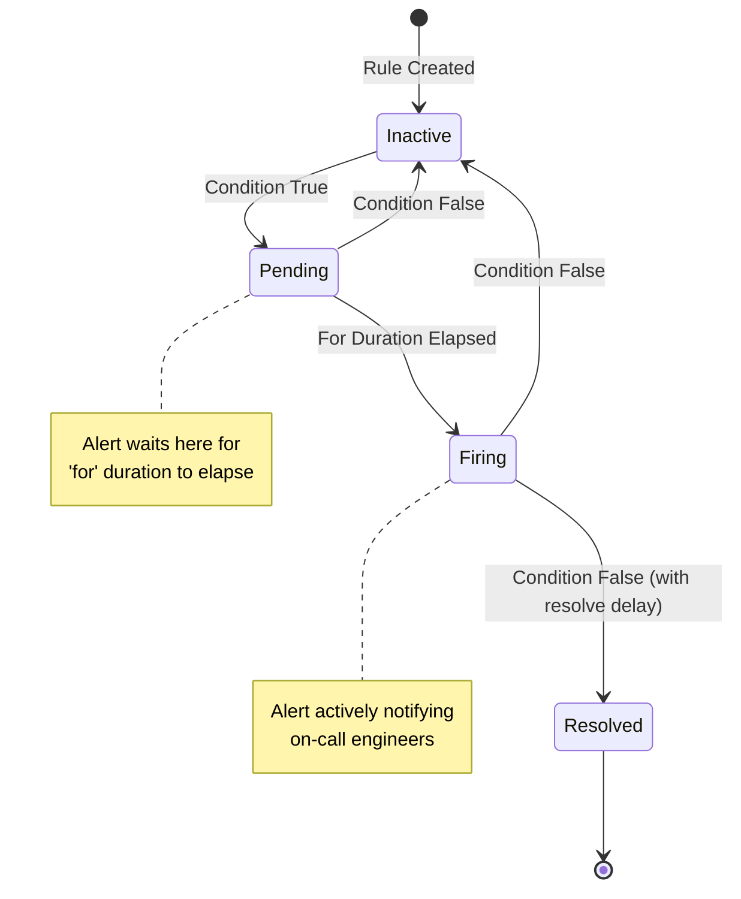
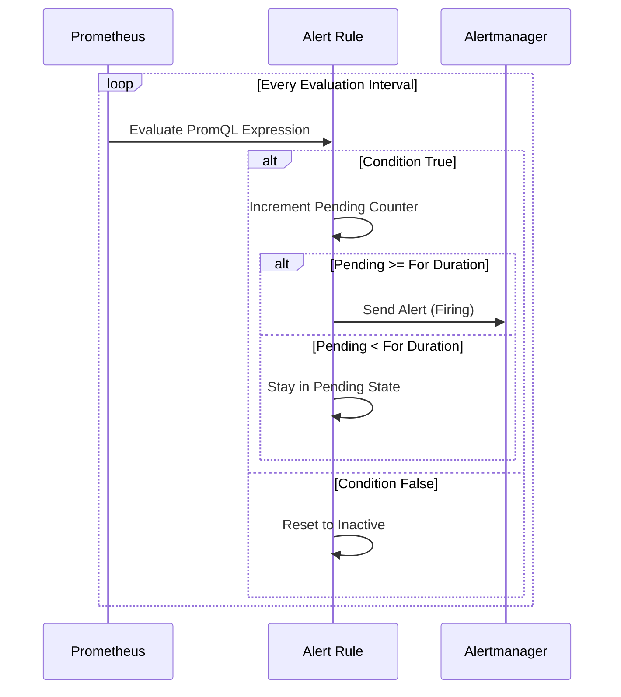
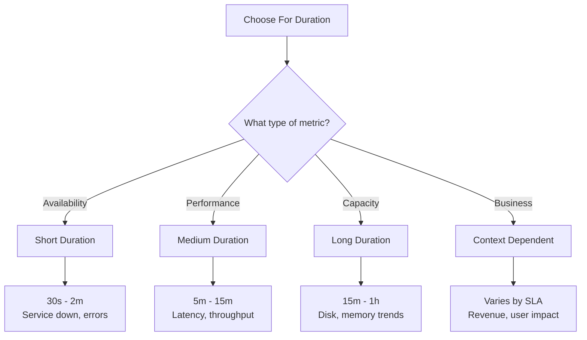
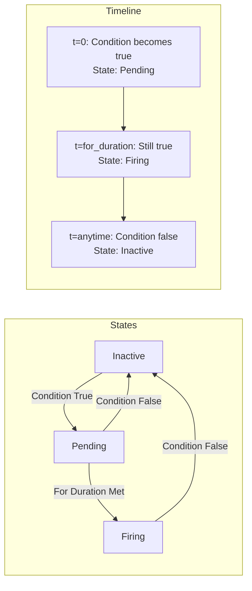
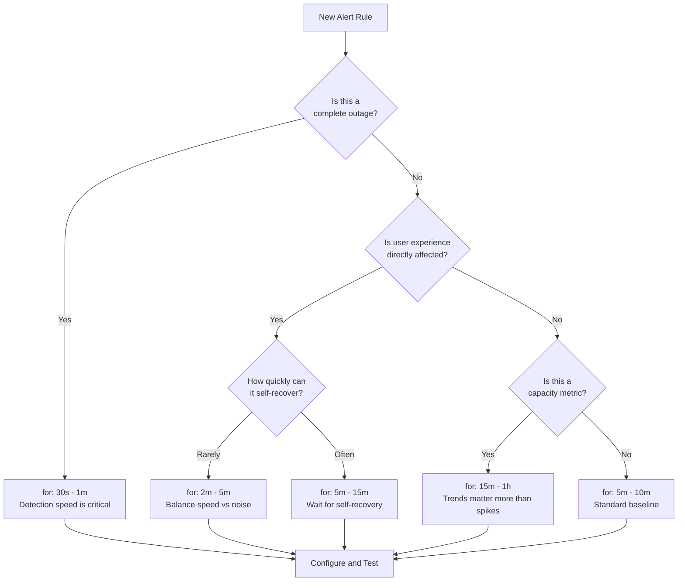

# How to Create Alert Duration Configuration

Author: [nawazdhandala](https://github.com/nawazdhandala)

Tags: Observability, Alerting, Monitoring, SRE

Description: Learn how to configure alert durations to reduce noise while catching real incidents.

---

> Alert fatigue is the silent killer of effective incident response. When every spike triggers a page, teams start ignoring alerts. The solution is not fewer alerts, but smarter duration configuration.

Properly configured alert durations are the difference between a well-rested on-call engineer and one who gets paged at 3 AM for a CPU spike that resolved itself in 30 seconds. This guide covers the essential concepts and practical configurations for alert duration management.

---

## Understanding Alert Duration Concepts

Before diving into configuration, let's understand the three core concepts that control when alerts fire:

| Concept | Description | Purpose |
|---------|-------------|---------|
| **For Duration** | How long a condition must be true before alerting | Filters out brief spikes |
| **Pending Period** | Time an alert spends in pending state before firing | Confirms the issue persists |
| **Evaluation Interval** | How often the alerting rule is checked | Determines detection granularity |

These three settings work together to determine alert timing and accuracy.

---

## How Alert Duration Works

The relationship between evaluation interval, for duration, and alert state transitions is critical to understand:



---

## Evaluation Interval Deep Dive

The evaluation interval determines how frequently Prometheus checks your alerting rules. This setting has direct implications on detection latency and system load.

### How Evaluation Works



### Configuring Global Evaluation Interval

```yaml
# prometheus.yml
# Global configuration for all alerting rules
global:
  # How often Prometheus evaluates alerting rules
  # Lower values = faster detection but higher CPU usage
  # Higher values = slower detection but lower resource consumption
  evaluation_interval: 15s

  # How often Prometheus scrapes metrics from targets
  # This should be <= evaluation_interval
  scrape_interval: 15s
```

### Rule Group Specific Intervals

You can override the global evaluation interval for specific rule groups:

```yaml
# alert_rules.yml
groups:
  # Critical alerts evaluated more frequently
  - name: critical_alerts
    # Override global interval for this group
    # Evaluate every 10 seconds for faster detection
    interval: 10s
    rules:
      - alert: ServiceDown
        expr: up == 0
        for: 30s
        labels:
          severity: critical
        annotations:
          summary: "Service {{ $labels.instance }} is down"

  # Non-critical alerts can use longer intervals
  - name: capacity_alerts
    # Evaluate every 60 seconds to reduce load
    interval: 60s
    rules:
      - alert: DiskSpaceWarning
        expr: node_filesystem_avail_bytes / node_filesystem_size_bytes < 0.2
        for: 10m
        labels:
          severity: warning
        annotations:
          summary: "Disk space low on {{ $labels.instance }}"
```

---

## For Duration Configuration

The `for` clause is your primary defense against alert noise. It specifies how long a condition must remain true before the alert fires.

### Basic For Duration Example

```yaml
# alert_rules.yml
groups:
  - name: application_alerts
    rules:
      # This alert requires high CPU for 5 minutes before firing
      - alert: HighCPUUsage
        # PromQL expression that defines the alert condition
        expr: |
          (
            100 - (avg by(instance) (rate(node_cpu_seconds_total{mode="idle"}[5m])) * 100)
          ) > 80
        # CRITICAL: The condition must be true for 5 minutes
        # This filters out brief CPU spikes from deployments or batch jobs
        for: 5m
        labels:
          severity: warning
          team: platform
        annotations:
          summary: "High CPU usage detected on {{ $labels.instance }}"
          description: "CPU usage is above 80% for more than 5 minutes"
          # Include current value for context
          value: "{{ $value | printf \"%.2f\" }}%"
```

### Duration Selection Guidelines

Different scenarios require different duration settings:



### Practical Duration Examples

```yaml
# alert_rules.yml
groups:
  - name: service_health
    rules:
      # AVAILABILITY: Short duration for critical service checks
      # We want to know quickly if a service is actually down
      - alert: ServiceDown
        expr: up == 0
        # Short duration: 1 minute catches real outages
        # but ignores brief restart windows during deployments
        for: 1m
        labels:
          severity: critical
        annotations:
          summary: "{{ $labels.job }} service is down"

      # ERROR RATE: Medium duration for error spikes
      # Errors often come in bursts during releases
      - alert: HighErrorRate
        expr: |
          (
            sum(rate(http_requests_total{status=~"5.."}[5m])) by (service)
            /
            sum(rate(http_requests_total[5m])) by (service)
          ) > 0.05
        # 5 minutes filters deployment-related errors
        # while still catching persistent issues quickly
        for: 5m
        labels:
          severity: warning
        annotations:
          summary: "High error rate on {{ $labels.service }}"
          description: "Error rate is {{ $value | printf \"%.2f\" }}%"

      # LATENCY: Medium duration for performance issues
      # Latency can spike during traffic bursts
      - alert: HighLatency
        expr: |
          histogram_quantile(0.95,
            sum(rate(http_request_duration_seconds_bucket[5m])) by (le, service)
          ) > 0.5
        # 10 minutes ensures the latency issue is persistent
        # not just a temporary traffic spike
        for: 10m
        labels:
          severity: warning
        annotations:
          summary: "High P95 latency on {{ $labels.service }}"

      # CAPACITY: Long duration for resource exhaustion
      # These trends develop slowly and recover slowly
      - alert: DiskSpaceCritical
        expr: |
          (
            node_filesystem_avail_bytes{mountpoint="/"}
            /
            node_filesystem_size_bytes{mountpoint="/"}
          ) < 0.1
        # 30 minutes confirms this is a real trend
        # not a temporary spike from log rotation
        for: 30m
        labels:
          severity: critical
        annotations:
          summary: "Disk space critically low on {{ $labels.instance }}"
```

---

## Pending Period Mechanics

Understanding the pending state helps you debug why alerts are or are not firing.

### Alert State Transitions



### Monitoring Pending Alerts

You can query pending alerts in Prometheus:

```promql
# View all currently pending alerts
ALERTS{alertstate="pending"}

# View firing alerts
ALERTS{alertstate="firing"}

# Count alerts by state
count by (alertstate) (ALERTS)
```

### Example: Tracking Alert Duration

```yaml
# alert_rules.yml
groups:
  - name: meta_alerts
    rules:
      # Alert if another alert has been pending too long
      # This helps identify flapping conditions
      - alert: AlertPendingTooLong
        expr: |
          (
            time() - ALERTS_FOR_STATE{alertstate="pending"}
          ) > 3600
        for: 5m
        labels:
          severity: info
        annotations:
          summary: "Alert {{ $labels.alertname }} stuck in pending state"
          description: "Consider adjusting the for duration or investigating the condition"
```

---

## Advanced Configuration Patterns

### Pattern 1: Graduated Severity Based on Duration

Create multiple alerts with different severities based on how long the condition persists:

```yaml
# alert_rules.yml
groups:
  - name: graduated_alerts
    rules:
      # WARNING: Issue persists for 5 minutes
      - alert: HighMemoryUsageWarning
        expr: |
          (
            node_memory_MemTotal_bytes - node_memory_MemAvailable_bytes
          ) / node_memory_MemTotal_bytes > 0.85
        for: 5m
        labels:
          severity: warning
        annotations:
          summary: "Memory usage above 85% on {{ $labels.instance }}"

      # CRITICAL: Issue persists for 15 minutes
      - alert: HighMemoryUsageCritical
        expr: |
          (
            node_memory_MemTotal_bytes - node_memory_MemAvailable_bytes
          ) / node_memory_MemTotal_bytes > 0.85
        for: 15m
        labels:
          severity: critical
        annotations:
          summary: "Memory usage critically high on {{ $labels.instance }}"
          description: "Memory has been above 85% for 15 minutes. Immediate action required."
```

### Pattern 2: Business Hours Aware Alerting

Adjust duration based on business impact timing:

```yaml
# alert_rules.yml
groups:
  - name: business_aware_alerts
    rules:
      # During business hours: Alert quickly
      - alert: PaymentServiceDegradedBusinessHours
        expr: |
          (
            # Business hours: 9 AM to 6 PM UTC, Monday to Friday
            hour() >= 9 and hour() < 18
            and day_of_week() >= 1 and day_of_week() <= 5
          )
          and
          (
            histogram_quantile(0.99,
              sum(rate(payment_duration_seconds_bucket[5m])) by (le)
            ) > 2
          )
        # Short duration during business hours
        for: 2m
        labels:
          severity: critical
          hours: business
        annotations:
          summary: "Payment service degraded during business hours"

      # Outside business hours: Longer duration to avoid noise
      - alert: PaymentServiceDegradedOffHours
        expr: |
          (
            # Outside business hours
            not (hour() >= 9 and hour() < 18
                 and day_of_week() >= 1 and day_of_week() <= 5)
          )
          and
          (
            histogram_quantile(0.99,
              sum(rate(payment_duration_seconds_bucket[5m])) by (le)
            ) > 2
          )
        # Longer duration outside business hours
        for: 15m
        labels:
          severity: warning
          hours: off_hours
        annotations:
          summary: "Payment service degraded outside business hours"
```

### Pattern 3: Rate of Change Alerts

Alert on rapid changes rather than absolute thresholds:

```yaml
# alert_rules.yml
groups:
  - name: rate_of_change_alerts
    rules:
      # Alert if error rate increases rapidly
      - alert: ErrorRateSpiking
        expr: |
          (
            # Current 5-minute error rate
            sum(rate(http_requests_total{status=~"5.."}[5m])) by (service)
            -
            # Error rate 15 minutes ago
            sum(rate(http_requests_total{status=~"5.."}[5m] offset 15m)) by (service)
          )
          /
          # Normalize by the baseline rate (avoid division by zero)
          (sum(rate(http_requests_total{status=~"5.."}[5m] offset 15m)) by (service) + 0.001)
          > 2
        # Shorter duration since we're looking at rate of change
        for: 2m
        labels:
          severity: warning
        annotations:
          summary: "Error rate spiking on {{ $labels.service }}"
          description: "Error rate has more than doubled in the last 15 minutes"
```

---

## Alertmanager Integration

Configure Alertmanager to handle alerts based on their duration and severity:

```yaml
# alertmanager.yml
global:
  # How long to wait before sending a notification
  # after an alert starts firing
  resolve_timeout: 5m

  smtp_smarthost: 'smtp.example.com:587'
  smtp_from: 'alerts@example.com'

route:
  # Default receiver
  receiver: 'default-receiver'

  # How long to wait for additional alerts to group
  group_wait: 30s

  # How long to wait before sending notifications
  # for new alerts in an existing group
  group_interval: 5m

  # How long to wait before resending a notification
  repeat_interval: 4h

  routes:
    # Critical alerts: Notify immediately
    - match:
        severity: critical
      receiver: 'pagerduty-critical'
      # Shorter group wait for critical alerts
      group_wait: 10s
      group_interval: 1m
      repeat_interval: 1h

    # Warning alerts: Batch and send less frequently
    - match:
        severity: warning
      receiver: 'slack-warnings'
      group_wait: 1m
      group_interval: 10m
      repeat_interval: 6h

receivers:
  - name: 'default-receiver'
    email_configs:
      - to: 'team@example.com'

  - name: 'pagerduty-critical'
    pagerduty_configs:
      - service_key: '<your-pagerduty-key>'
        severity: critical

  - name: 'slack-warnings'
    slack_configs:
      - api_url: '<your-slack-webhook>'
        channel: '#alerts'
        title: '{{ .GroupLabels.alertname }}'
        text: '{{ range .Alerts }}{{ .Annotations.summary }}{{ end }}'
```

---

## Complete Configuration Example

Here is a complete, production-ready configuration:

```yaml
# prometheus.yml
global:
  scrape_interval: 15s
  evaluation_interval: 15s
  external_labels:
    cluster: 'production'
    region: 'us-east-1'

alerting:
  alertmanagers:
    - static_configs:
        - targets:
          - alertmanager:9093

rule_files:
  - /etc/prometheus/rules/*.yml
```

```yaml
# /etc/prometheus/rules/infrastructure.yml
groups:
  # High-priority infrastructure alerts
  - name: infrastructure_critical
    # Evaluate every 10 seconds for quick detection
    interval: 10s
    rules:
      # Node down alert
      - alert: NodeDown
        expr: up{job="node"} == 0
        for: 1m
        labels:
          severity: critical
          team: infrastructure
        annotations:
          summary: "Node {{ $labels.instance }} is down"
          description: "Node has been unreachable for more than 1 minute"
          runbook_url: "https://wiki.example.com/runbooks/node-down"

      # Out of memory
      - alert: OutOfMemory
        expr: |
          (
            node_memory_MemAvailable_bytes / node_memory_MemTotal_bytes
          ) < 0.05
        for: 2m
        labels:
          severity: critical
          team: infrastructure
        annotations:
          summary: "Out of memory on {{ $labels.instance }}"
          description: "Less than 5% memory available for {{ $value | printf \"%.0f\" }} seconds"

  # Medium-priority infrastructure alerts
  - name: infrastructure_warning
    interval: 30s
    rules:
      # High CPU usage
      - alert: HighCPU
        expr: |
          100 - (avg by(instance) (rate(node_cpu_seconds_total{mode="idle"}[5m])) * 100) > 80
        for: 10m
        labels:
          severity: warning
          team: infrastructure
        annotations:
          summary: "High CPU on {{ $labels.instance }}"
          description: "CPU usage is {{ $value | printf \"%.2f\" }}%"

      # Disk space warning
      - alert: DiskSpaceLow
        expr: |
          (
            node_filesystem_avail_bytes{fstype!~"tmpfs|overlay"}
            /
            node_filesystem_size_bytes
          ) < 0.15
        for: 15m
        labels:
          severity: warning
          team: infrastructure
        annotations:
          summary: "Disk space low on {{ $labels.instance }}"
          description: "{{ $labels.mountpoint }} has {{ $value | printf \"%.0f\" }}% free"
```

```yaml
# /etc/prometheus/rules/application.yml
groups:
  # Application health alerts
  - name: application_health
    interval: 15s
    rules:
      # Service error rate
      - alert: HighErrorRate
        expr: |
          (
            sum by(service) (rate(http_requests_total{status=~"5.."}[5m]))
            /
            sum by(service) (rate(http_requests_total[5m]))
          ) > 0.01
        for: 5m
        labels:
          severity: warning
        annotations:
          summary: "High error rate on {{ $labels.service }}"
          description: "{{ $value | printf \"%.2f\" }}% of requests are failing"

      # Request latency
      - alert: HighLatencyP95
        expr: |
          histogram_quantile(0.95,
            sum by(le, service) (rate(http_request_duration_seconds_bucket[5m]))
          ) > 1
        for: 10m
        labels:
          severity: warning
        annotations:
          summary: "High P95 latency on {{ $labels.service }}"
          description: "P95 latency is {{ $value | printf \"%.2f\" }}s"

      # Request latency critical
      - alert: HighLatencyP99
        expr: |
          histogram_quantile(0.99,
            sum by(le, service) (rate(http_request_duration_seconds_bucket[5m]))
          ) > 5
        for: 5m
        labels:
          severity: critical
        annotations:
          summary: "Critical P99 latency on {{ $labels.service }}"
          description: "P99 latency is {{ $value | printf \"%.2f\" }}s"
```

---

## Duration Configuration Decision Tree

Use this decision tree when configuring alert durations:



---

## Testing Your Configuration

### Validate Configuration Syntax

```bash
# Check Prometheus configuration
promtool check config /etc/prometheus/prometheus.yml

# Check alerting rules
promtool check rules /etc/prometheus/rules/*.yml

# Output example:
# Checking /etc/prometheus/rules/infrastructure.yml
#   SUCCESS: 5 rules found
```

### Test Alert Expressions

```bash
# Test a specific rule expression
promtool test rules /etc/prometheus/rules/test_cases.yml
```

Create test cases to verify alert behavior:

```yaml
# test_cases.yml
rule_files:
  - infrastructure.yml

tests:
  # Test that NodeDown fires after 1 minute
  - interval: 1m
    input_series:
      # Simulate node going down
      - series: 'up{job="node",instance="server1:9100"}'
        values: '1 1 1 0 0 0 0 0'

    alert_rule_test:
      # Check alert state at different times
      - eval_time: 3m
        alertname: NodeDown
        exp_alerts: []  # Not yet firing (needs 1m)

      - eval_time: 5m
        alertname: NodeDown
        exp_alerts:
          - exp_labels:
              severity: critical
              instance: server1:9100
            exp_annotations:
              summary: "Node server1:9100 is down"
```

---

## Common Pitfalls and Solutions

### Pitfall 1: Duration Too Short

```yaml
# BAD: Too short, will cause alert fatigue
- alert: HighCPU
  expr: node_cpu_usage > 80
  for: 30s  # Brief spikes will trigger alerts

# GOOD: Appropriate duration for CPU metric
- alert: HighCPU
  expr: node_cpu_usage > 80
  for: 10m  # Only persistent high CPU triggers alert
```

### Pitfall 2: Duration Too Long

```yaml
# BAD: Too long for availability alert
- alert: ServiceDown
  expr: up == 0
  for: 30m  # Outage will be very long before alert

# GOOD: Short duration for availability
- alert: ServiceDown
  expr: up == 0
  for: 1m  # Quick detection of real outages
```

### Pitfall 3: Mismatched Intervals

```yaml
# BAD: Evaluation interval longer than for duration
groups:
  - name: bad_config
    interval: 5m  # Evaluates every 5 minutes
    rules:
      - alert: QuickAlert
        expr: some_metric > 100
        for: 1m  # Can never fire! Checked only every 5m

# GOOD: Evaluation interval shorter than for duration
groups:
  - name: good_config
    interval: 15s  # Frequent evaluation
    rules:
      - alert: QuickAlert
        expr: some_metric > 100
        for: 1m  # Will fire after 4+ evaluations
```

---

## Summary

Effective alert duration configuration requires balancing three key factors:

1. **Detection Speed**: How quickly you need to know about issues
2. **False Positive Rate**: How often alerts fire for non-issues
3. **System Resources**: The computational cost of frequent evaluation

The general guidelines are:

| Alert Type | Recommended For Duration | Evaluation Interval |
|------------|-------------------------|---------------------|
| Complete Outage | 30s - 1m | 10s - 15s |
| Degraded Service | 2m - 5m | 15s - 30s |
| Performance Issues | 5m - 15m | 15s - 30s |
| Capacity Warnings | 15m - 1h | 30s - 60s |

Start conservative with longer durations, then tune down based on actual incident data. Track your alert-to-incident ratio and adjust accordingly.

---

*Want to simplify your alert configuration? [OneUptime](https://oneuptime.com) provides intuitive alert management with built-in duration configuration, intelligent grouping, and seamless escalation policies for modern SRE teams.*

**Related Reading:**
- [How to Add Custom Metrics to Python Applications with Prometheus](https://oneuptime.com/blog/post/2025-01-06-python-custom-metrics-prometheus)
- [Understanding SLI, SLA, and SLO](https://oneuptime.com/blog/post/2023-06-12-sli-sla-slo)
