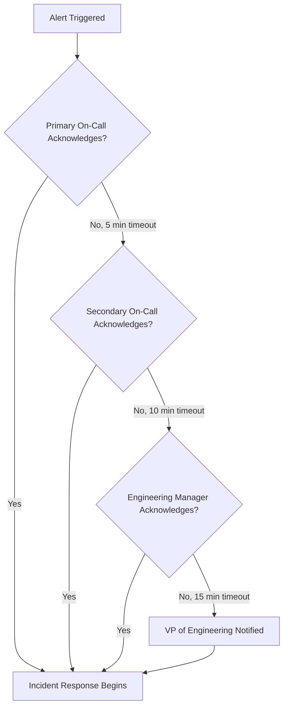
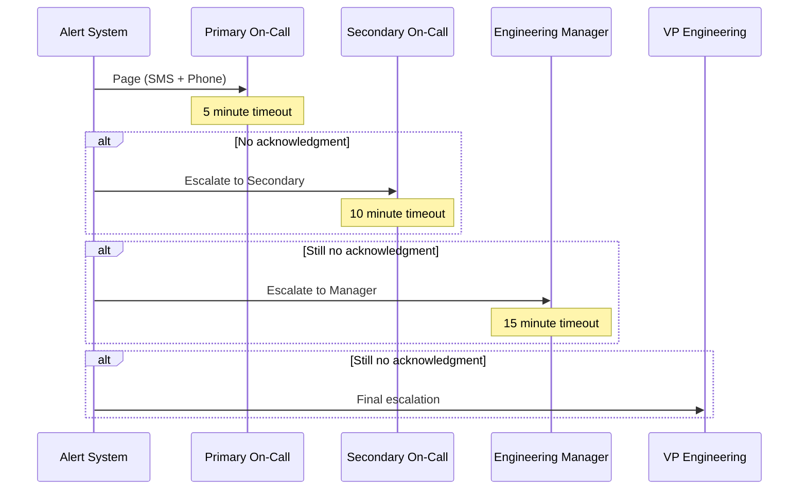
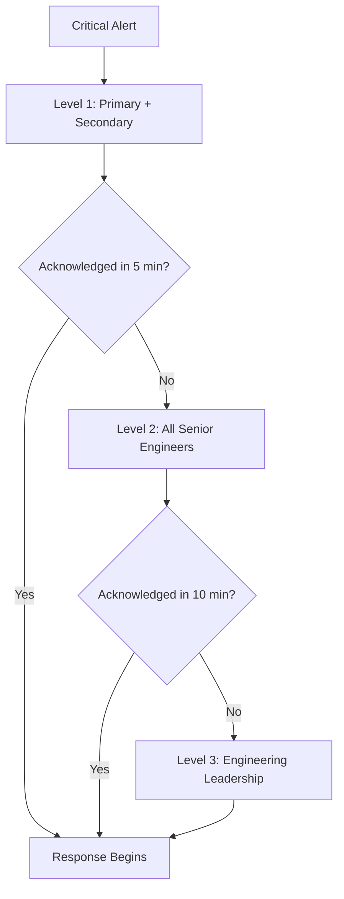
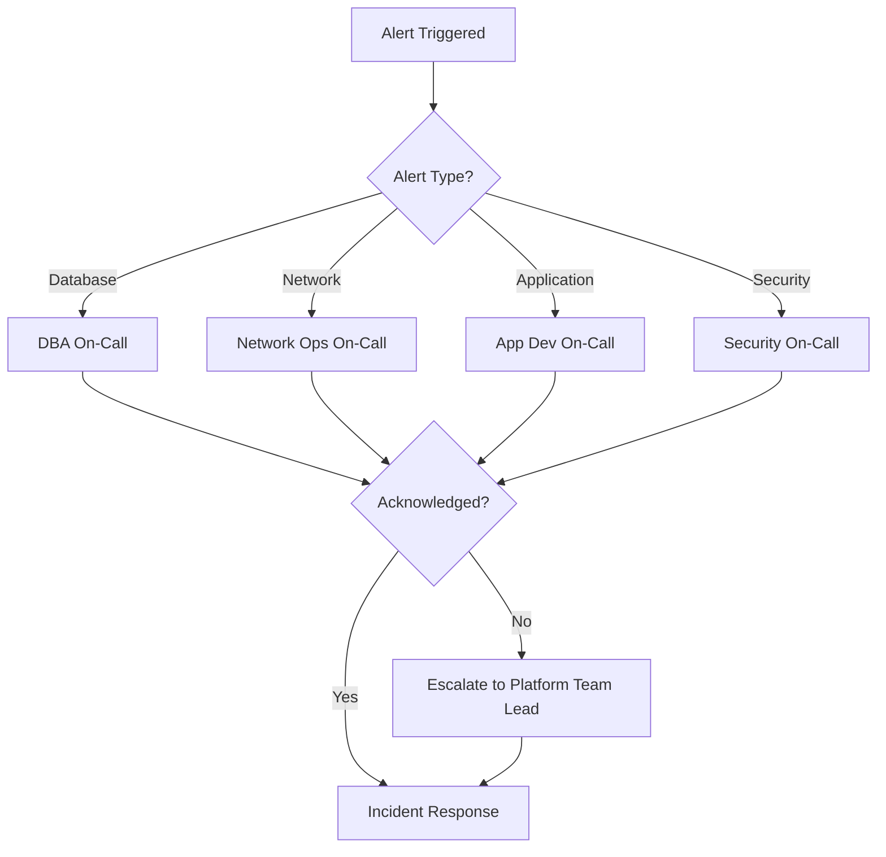
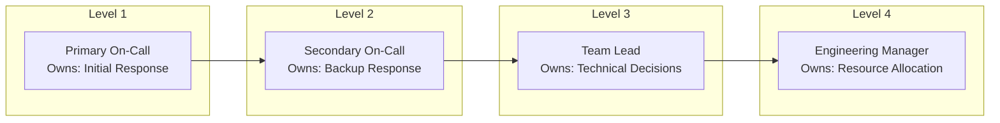
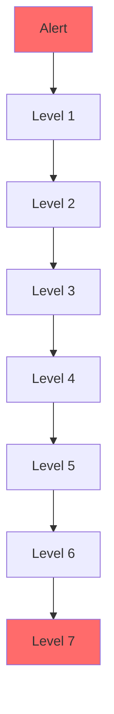

# How to Create Alert Escalation Paths

Author: [nawazdhandala](https://github.com/nawazdhandala)

Tags: Observability, Alerting, Incident Management, SRE

Description: Learn how to design escalation paths to ensure alerts reach the right people at the right time.

---

When an alert fires at 3 AM and nobody responds, your customers feel the pain. Alert escalation paths are the safety net that ensures critical issues never slip through the cracks. In this guide, we will walk through how to design escalation paths that balance urgency with engineer well-being.

## What Is an Alert Escalation Path?

An escalation path defines who gets notified about an alert and in what order. When the primary responder does not acknowledge an alert within a set time, the system automatically notifies the next person or group in the chain.



## Why Escalation Paths Matter

Without proper escalation:

- **Alerts go unnoticed**: A single point of failure means missed incidents
- **Response times increase**: Manual handoffs add precious minutes during outages
- **Engineer burnout**: One person carries the entire burden of on-call
- **Customer impact grows**: Every minute without response compounds the damage

## Time-Based Escalation

Time-based escalation automatically moves alerts up the chain when acknowledgment does not happen within a defined window.

### Designing Time Windows

Consider these factors when setting escalation timeouts:

| Factor | Recommended Timeout | Rationale |
|--------|---------------------|-----------|
| Critical production alerts | 5 minutes | Immediate user impact requires fast response |
| High-severity alerts | 10-15 minutes | Significant impact but allows time for response |
| Medium-severity alerts | 30 minutes | Important but not immediately damaging |
| Low-severity alerts | 1-2 hours | Can wait for business hours if needed |

### Time-Based Escalation Flow



## Multi-Level Escalation Strategies

### Strategy 1: Linear Escalation

The simplest approach where alerts move sequentially through a defined chain.

```yaml
# Example escalation policy configuration
escalation_policy:
  name: "Production Critical"
  description: "Escalation path for critical production alerts"

  levels:
    # Level 1: Primary on-call engineer
    - level: 1
      timeout_minutes: 5
      targets:
        - type: schedule
          schedule_id: "primary-oncall"
      notification_channels:
        - sms
        - phone_call
        - push_notification

    # Level 2: Secondary on-call engineer
    - level: 2
      timeout_minutes: 10
      targets:
        - type: schedule
          schedule_id: "secondary-oncall"
      notification_channels:
        - sms
        - phone_call

    # Level 3: Engineering manager
    - level: 3
      timeout_minutes: 15
      targets:
        - type: user
          user_id: "eng-manager"
      notification_channels:
        - sms
        - phone_call

    # Level 4: VP of Engineering (final escalation)
    - level: 4
      timeout_minutes: 0  # No timeout, end of chain
      targets:
        - type: user
          user_id: "vp-engineering"
      notification_channels:
        - sms
        - phone_call
```

### Strategy 2: Parallel Escalation

Notify multiple people simultaneously at certain levels for faster response.



### Strategy 3: Functional Escalation

Route alerts to different teams based on the type of issue.



## PagerDuty Escalation Policy Examples

### Basic Escalation Policy

```python
# Python example using PagerDuty API
# This creates a basic linear escalation policy

import requests
import json

def create_escalation_policy(api_key: str) -> dict:
    """
    Creates a basic escalation policy in PagerDuty.

    The policy has three levels:
    1. Primary on-call (5 min timeout)
    2. Secondary on-call (10 min timeout)
    3. Engineering manager (no timeout - final level)
    """

    headers = {
        "Authorization": f"Token token={api_key}",
        "Content-Type": "application/json"
    }

    # Define the escalation policy structure
    policy_data = {
        "escalation_policy": {
            "type": "escalation_policy",
            "name": "Production Services",
            "description": "Escalation for production service alerts",

            # Number of times to loop through the policy
            # before stopping escalation
            "num_loops": 2,

            # Escalation rules define each level
            "escalation_rules": [
                {
                    # Level 1: Primary on-call
                    "escalation_delay_in_minutes": 5,
                    "targets": [
                        {
                            "type": "schedule_reference",
                            "id": "PRIMARY_SCHEDULE_ID"
                        }
                    ]
                },
                {
                    # Level 2: Secondary on-call
                    "escalation_delay_in_minutes": 10,
                    "targets": [
                        {
                            "type": "schedule_reference",
                            "id": "SECONDARY_SCHEDULE_ID"
                        }
                    ]
                },
                {
                    # Level 3: Engineering Manager
                    # No delay needed as this is the final level
                    "escalation_delay_in_minutes": 0,
                    "targets": [
                        {
                            "type": "user_reference",
                            "id": "MANAGER_USER_ID"
                        }
                    ]
                }
            ]
        }
    }

    response = requests.post(
        "https://api.pagerduty.com/escalation_policies",
        headers=headers,
        data=json.dumps(policy_data)
    )

    return response.json()
```

### Advanced Escalation with Multiple Notification Channels

```python
# Configure user notification rules for multi-channel alerting
# This ensures responders are notified through multiple channels

def configure_user_notifications(
    api_key: str,
    user_id: str
) -> dict:
    """
    Configures notification rules for a user.

    Sets up a sequence of notifications:
    - Immediate: Push notification
    - After 1 minute: SMS
    - After 3 minutes: Phone call
    """

    headers = {
        "Authorization": f"Token token={api_key}",
        "Content-Type": "application/json"
    }

    # Define notification rules
    notification_rules = [
        {
            # Immediate push notification
            "type": "assignment_notification_rule",
            "start_delay_in_minutes": 0,
            "contact_method": {
                "type": "push_notification_contact_method_reference",
                "id": "PUSH_CONTACT_ID"
            },
            "urgency": "high"
        },
        {
            # SMS after 1 minute if not acknowledged
            "type": "assignment_notification_rule",
            "start_delay_in_minutes": 1,
            "contact_method": {
                "type": "sms_contact_method_reference",
                "id": "SMS_CONTACT_ID"
            },
            "urgency": "high"
        },
        {
            # Phone call after 3 minutes if still not acknowledged
            "type": "assignment_notification_rule",
            "start_delay_in_minutes": 3,
            "contact_method": {
                "type": "phone_contact_method_reference",
                "id": "PHONE_CONTACT_ID"
            },
            "urgency": "high"
        }
    ]

    # Apply each notification rule
    for rule in notification_rules:
        requests.post(
            f"https://api.pagerduty.com/users/{user_id}/notification_rules",
            headers=headers,
            data=json.dumps({"notification_rule": rule})
        )

    return {"status": "configured", "rules_count": len(notification_rules)}
```

### Terraform Configuration for PagerDuty Escalation

```hcl
# Terraform configuration for PagerDuty escalation policy
# This provides infrastructure-as-code for your alerting setup

# Define the primary on-call schedule
resource "pagerduty_schedule" "primary_oncall" {
  name      = "Primary On-Call"
  time_zone = "America/New_York"

  # Weekly rotation layer
  layer {
    name                         = "Weekly Rotation"
    start                        = "2026-01-01T00:00:00-05:00"
    rotation_virtual_start       = "2026-01-01T00:00:00-05:00"
    rotation_turn_length_seconds = 604800  # 1 week in seconds

    users = [
      pagerduty_user.engineer_1.id,
      pagerduty_user.engineer_2.id,
      pagerduty_user.engineer_3.id,
      pagerduty_user.engineer_4.id,
    ]
  }
}

# Define the secondary on-call schedule
resource "pagerduty_schedule" "secondary_oncall" {
  name      = "Secondary On-Call"
  time_zone = "America/New_York"

  layer {
    name                         = "Weekly Rotation"
    start                        = "2026-01-01T00:00:00-05:00"
    rotation_virtual_start       = "2026-01-01T00:00:00-05:00"
    rotation_turn_length_seconds = 604800

    # Offset by one position from primary
    users = [
      pagerduty_user.engineer_2.id,
      pagerduty_user.engineer_3.id,
      pagerduty_user.engineer_4.id,
      pagerduty_user.engineer_1.id,
    ]
  }
}

# Create the escalation policy
resource "pagerduty_escalation_policy" "production" {
  name        = "Production Critical Services"
  description = "Escalation policy for production service alerts"
  num_loops   = 2  # Repeat the policy twice before stopping

  # Level 1: Primary on-call with 5 minute timeout
  rule {
    escalation_delay_in_minutes = 5

    target {
      type = "schedule_reference"
      id   = pagerduty_schedule.primary_oncall.id
    }
  }

  # Level 2: Secondary on-call with 10 minute timeout
  rule {
    escalation_delay_in_minutes = 10

    target {
      type = "schedule_reference"
      id   = pagerduty_schedule.secondary_oncall.id
    }
  }

  # Level 3: Engineering manager with 15 minute timeout
  rule {
    escalation_delay_in_minutes = 15

    target {
      type = "user_reference"
      id   = pagerduty_user.eng_manager.id
    }
  }

  # Level 4: VP Engineering (final level)
  rule {
    escalation_delay_in_minutes = 0

    target {
      type = "user_reference"
      id   = pagerduty_user.vp_engineering.id
    }
  }
}

# Create the PagerDuty service and attach the escalation policy
resource "pagerduty_service" "production_api" {
  name              = "Production API"
  description       = "Main production API service"
  escalation_policy = pagerduty_escalation_policy.production.id

  # Alert settings
  alert_creation = "create_alerts_and_incidents"

  # Auto-resolve after 4 hours if not manually resolved
  auto_resolve_timeout = 14400

  # Acknowledgment timeout (re-trigger if not resolved)
  acknowledgement_timeout = 1800  # 30 minutes

  incident_urgency_rule {
    type    = "constant"
    urgency = "high"
  }
}
```

## Best Practices for Escalation Paths

### 1. Define Clear Ownership

Every escalation level should have a clearly defined owner:



### 2. Match Escalation to Severity

Not all alerts need the same escalation path:

```yaml
# Severity-based escalation routing
severity_policies:
  critical:
    # P1: Customer-facing outage
    policy: "executive-escalation"
    initial_timeout: 5
    final_escalation_level: "vp-engineering"

  high:
    # P2: Degraded performance affecting users
    policy: "standard-escalation"
    initial_timeout: 10
    final_escalation_level: "engineering-manager"

  medium:
    # P3: Internal system issues
    policy: "team-escalation"
    initial_timeout: 30
    final_escalation_level: "team-lead"

  low:
    # P4: Non-urgent issues
    policy: "business-hours-only"
    initial_timeout: 60
    final_escalation_level: "on-call-engineer"
```

### 3. Include Contact Redundancy

Always have backup contact methods:

```python
# Example contact method configuration
def setup_contact_redundancy(user_config: dict) -> list:
    """
    Configure multiple contact methods for redundancy.

    Each user should have at least three contact methods
    to ensure they can be reached during incidents.
    """

    contact_methods = [
        {
            # Primary: Mobile phone
            "type": "phone",
            "number": user_config["mobile_phone"],
            "priority": 1
        },
        {
            # Secondary: SMS to same mobile
            "type": "sms",
            "number": user_config["mobile_phone"],
            "priority": 2
        },
        {
            # Tertiary: Push notification via app
            "type": "push",
            "device_id": user_config["device_id"],
            "priority": 3
        },
        {
            # Fallback: Work phone (if available)
            "type": "phone",
            "number": user_config.get("work_phone"),
            "priority": 4
        },
        {
            # Final fallback: Email
            "type": "email",
            "address": user_config["email"],
            "priority": 5
        }
    ]

    # Filter out any None values
    return [c for c in contact_methods if c.get("number") or c.get("device_id") or c.get("address")]
```

### 4. Test Your Escalation Paths

Regular testing ensures your escalation paths work when you need them:

```bash
#!/bin/bash
# Script to test escalation path functionality

# Configuration
PAGERDUTY_API_KEY="${PAGERDUTY_API_KEY}"
SERVICE_ID="YOUR_SERVICE_ID"
TEST_ROUTING_KEY="YOUR_INTEGRATION_KEY"

# Create a test incident
echo "Creating test incident..."

curl -X POST \
  -H "Authorization: Token token=${PAGERDUTY_API_KEY}" \
  -H "Content-Type: application/json" \
  -d '{
    "incident": {
      "type": "incident",
      "title": "[TEST] Escalation Path Verification",
      "service": {
        "id": "'${SERVICE_ID}'",
        "type": "service_reference"
      },
      "urgency": "high",
      "body": {
        "type": "incident_body",
        "details": "This is a test incident to verify escalation paths are working correctly. Please acknowledge and resolve."
      }
    }
  }' \
  "https://api.pagerduty.com/incidents"

echo ""
echo "Test incident created. Verify that:"
echo "1. Primary on-call received notification"
echo "2. After timeout, secondary on-call receives notification"
echo "3. All notification channels are working"
```

### 5. Document Escalation Procedures

Keep your escalation documentation up to date:

```markdown
## Escalation Runbook

### When to Escalate

- Primary on-call has not acknowledged within 5 minutes
- Incident severity increases during response
- Additional expertise is needed
- Incident duration exceeds 30 minutes without resolution

### How to Manually Escalate

1. In PagerDuty, click "Escalate" on the incident
2. Select the next escalation level or specific person
3. Add a note explaining why escalation is needed
4. Continue working the incident until handoff is complete

### Escalation Contact Information

| Role | Primary Contact | Backup Contact |
|------|-----------------|----------------|
| Primary On-Call | See schedule | See schedule |
| Secondary On-Call | See schedule | See schedule |
| Engineering Manager | @eng-manager | @backup-manager |
| VP Engineering | @vp-eng | @cto |
```

## Common Escalation Anti-Patterns to Avoid

### Anti-Pattern 1: Too Many Levels



**Problem**: By the time you reach level 7, the incident has been ongoing for too long.

**Solution**: Limit escalation to 3-4 levels maximum. If you need more, your initial routing is probably wrong.

### Anti-Pattern 2: Single Point of Failure

**Problem**: Only one person at each level means vacations and illness break your escalation.

**Solution**: Always have at least two people who can respond at each level.

### Anti-Pattern 3: No Timeout Variation

**Problem**: Using the same timeout for all alert types leads to either too slow response for critical issues or alert fatigue for minor ones.

**Solution**: Match timeouts to severity and expected response times.

## Measuring Escalation Effectiveness

Track these metrics to improve your escalation paths:

| Metric | Target | Why It Matters |
|--------|--------|----------------|
| Escalation Rate | < 20% | High rates indicate primary coverage issues |
| Time to Acknowledgment | < 5 min for P1 | Measures initial response speed |
| Escalation Depth | Average < 2 levels | Deep escalations suggest routing problems |
| False Escalations | < 5% | Alerts that did not need escalation |

## Conclusion

Effective alert escalation paths are the backbone of reliable incident response. By implementing time-based escalation, multi-level strategies, and following best practices, you ensure that every alert reaches the right person at the right time.

Remember these key principles:

1. **Start simple**: Begin with a basic linear escalation and add complexity only when needed
2. **Test regularly**: Run escalation drills to verify your paths work
3. **Iterate based on data**: Use metrics to continuously improve your escalation design
4. **Balance urgency and well-being**: Fast response should not come at the cost of engineer burnout

With the right escalation paths in place, your team can respond to incidents confidently, knowing that no alert will ever fall through the cracks.
