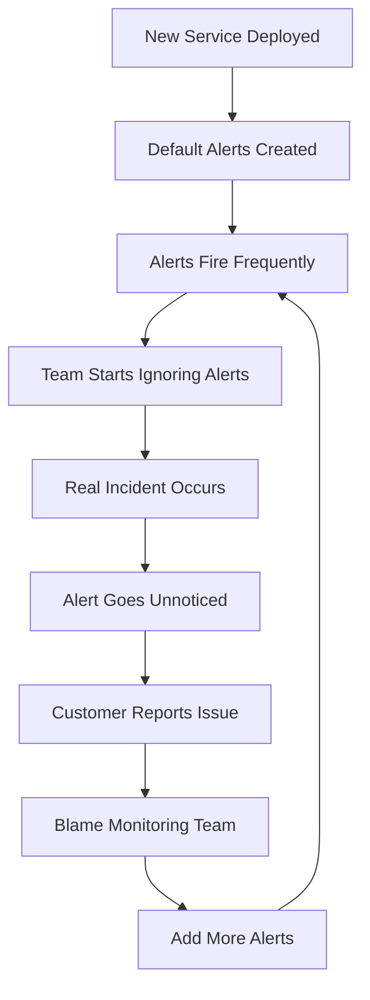
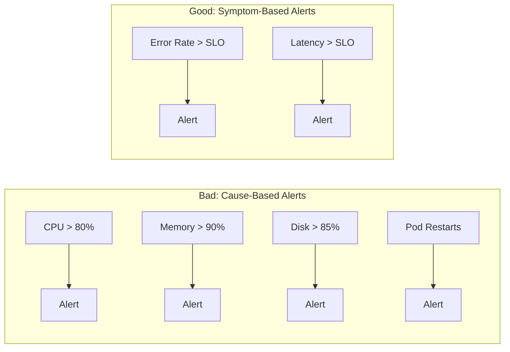
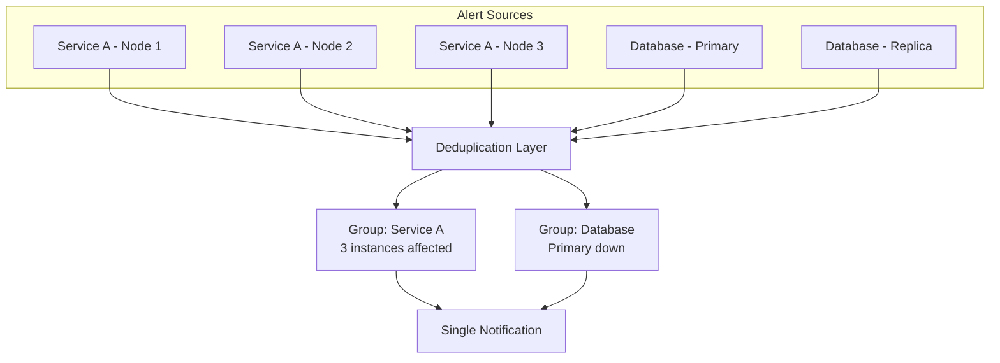
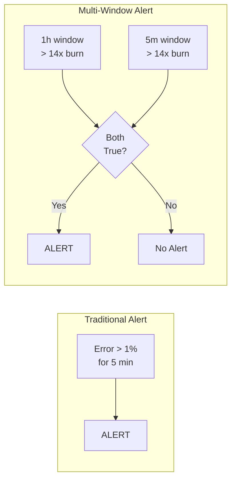
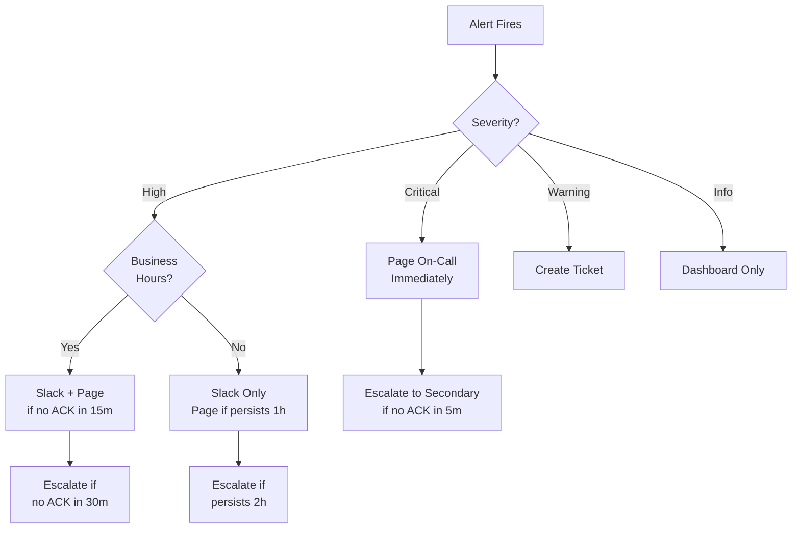
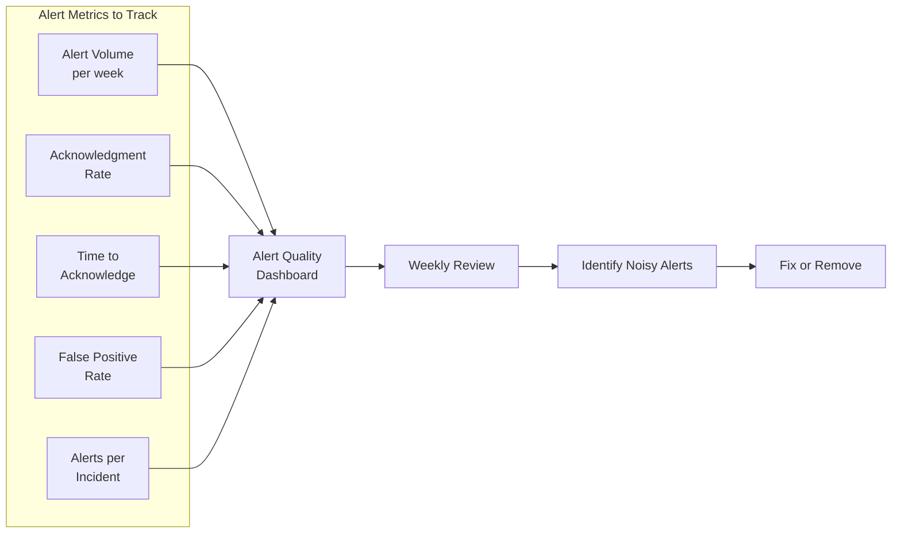
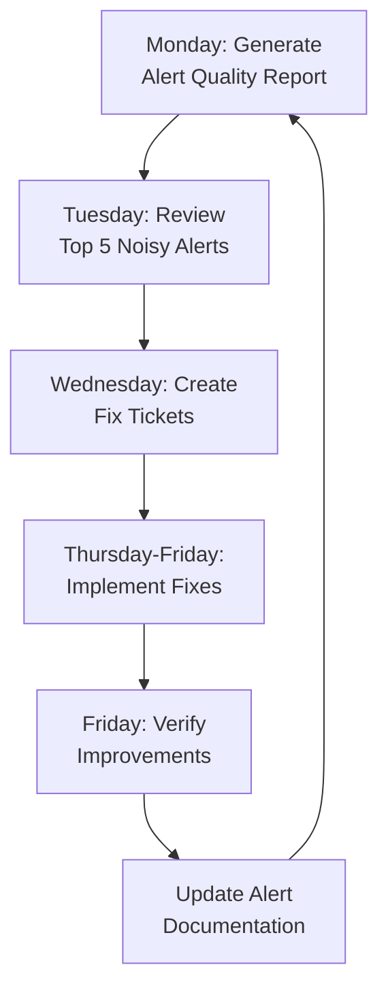

# How to Create Alert Fatigue Prevention

Author: [nawazdhandala](https://github.com/nawazdhandala)

Tags: Alerting, SRE, Monitoring, DevOps

Description: A practical guide to preventing alert fatigue through intelligent alert design, deduplication strategies, and escalation policies that keep your on-call team effective.

---

Alert fatigue happens when engineers receive so many alerts that they start ignoring them. The consequence is predictable: when a real incident occurs, the signal gets lost in noise. Teams become desensitized, response times increase, and critical issues slip through unnoticed.

This guide provides actionable strategies to prevent alert fatigue while maintaining visibility into system health. You will learn how to design alerts that matter, implement intelligent routing, and build sustainable on-call practices.

## The Cost of Alert Fatigue

Before diving into solutions, let us quantify the problem:

| Metric | Fatigued Team | Healthy Team |
|--------|---------------|--------------|
| Alert acknowledgment rate | 40-60% | 95%+ |
| Mean time to acknowledge | 15+ minutes | 2-3 minutes |
| False positive rate | 60-80% | Under 15% |
| On-call burnout | High turnover | Sustainable |
| Missed incidents | Common | Rare |

When more than half your alerts are noise, your monitoring system becomes a liability rather than an asset.

## The Alert Fatigue Cycle

Understanding how alert fatigue develops helps prevent it:



Breaking this cycle requires intentional alert design from the start.

## Strategy 1: Alert on Symptoms, Not Causes

The most common mistake is alerting on every metric that might indicate a problem. Instead, alert on user-facing symptoms.



Cause-based alerts often fire without user impact. A service running at 95% CPU might be perfectly healthy if latency remains acceptable. Symptom-based alerts tell you when users are actually affected.

### Prometheus Rule: Symptom-Based Alert

This alert fires only when users experience elevated error rates, not when infrastructure metrics look concerning:

```yaml
# prometheus/rules/symptom-alerts.yaml
# Alert on user-visible symptoms, not infrastructure metrics

groups:
  - name: symptom-based-alerts
    rules:
      # Alert when error rate exceeds SLO threshold
      # This directly correlates with user experience
      - alert: HighErrorRate
        expr: |
          (
            sum(rate(http_requests_total{status=~"5.."}[5m])) by (service)
            /
            sum(rate(http_requests_total[5m])) by (service)
          ) > 0.01
        for: 5m
        labels:
          severity: critical
        annotations:
          summary: "{{ $labels.service }} error rate exceeds 1%"
          description: |
            Users are experiencing errors. Current error rate: {{ printf "%.2f" $value | float64 | mulf 100 }}%
          runbook: "https://wiki.example.com/runbooks/high-error-rate"

      # Alert when latency exceeds SLO threshold
      # P95 latency is a better user experience metric than average
      - alert: HighLatency
        expr: |
          histogram_quantile(0.95,
            sum(rate(http_request_duration_seconds_bucket[5m])) by (service, le)
          ) > 2.0
        for: 5m
        labels:
          severity: high
        annotations:
          summary: "{{ $labels.service }} P95 latency exceeds 2 seconds"
          description: |
            Users are experiencing slow responses. Current P95: {{ printf "%.2f" $value }}s
```

## Strategy 2: Implement Alert Deduplication

Multiple alerts firing for the same root cause create noise and confusion. Implement deduplication at multiple levels.



### Alertmanager Configuration for Deduplication

Group related alerts together to reduce notification volume:

```yaml
# alertmanager/config.yaml
# Configure alert grouping to reduce notification spam

global:
  resolve_timeout: 5m

route:
  # Group alerts by service and alertname
  # This prevents multiple notifications for the same issue
  group_by: ['alertname', 'service', 'severity']

  # Wait 30 seconds to batch alerts that fire together
  group_wait: 30s

  # Wait 5 minutes before sending updates for existing groups
  group_interval: 5m

  # Wait 4 hours before re-notifying for the same alert
  repeat_interval: 4h

  # Default receiver for all alerts
  receiver: 'default-receiver'

  routes:
    # Critical alerts go to PagerDuty with shorter intervals
    - match:
        severity: critical
      receiver: 'pagerduty-critical'
      group_wait: 10s
      repeat_interval: 1h

    # High severity alerts during business hours only
    - match:
        severity: high
      receiver: 'slack-oncall'
      group_wait: 30s
      repeat_interval: 2h

      # After hours, only page for critical
      mute_time_intervals:
        - outside-business-hours

    # Warning alerts create tickets, no paging
    - match:
        severity: warning
      receiver: 'ticket-system'
      group_wait: 5m
      repeat_interval: 24h

receivers:
  - name: 'default-receiver'
    slack_configs:
      - channel: '#alerts-all'

  - name: 'pagerduty-critical'
    pagerduty_configs:
      - service_key: '${PAGERDUTY_KEY}'
        severity: critical

  - name: 'slack-oncall'
    slack_configs:
      - channel: '#oncall'
        send_resolved: true

  - name: 'ticket-system'
    webhook_configs:
      - url: 'https://tickets.example.com/api/create'

# Define time periods for muting
time_intervals:
  - name: outside-business-hours
    time_intervals:
      - weekdays: ['saturday', 'sunday']
      - times:
          - start_time: '00:00'
            end_time: '09:00'
          - start_time: '18:00'
            end_time: '24:00'
```

## Strategy 3: Use Multi-Window Burn Rates

Single-threshold alerts are either too sensitive (false positives) or too slow (missed incidents). Multi-window burn rate alerts solve this by requiring both short-term and long-term thresholds to be exceeded.



### Multi-Window Alert Implementation

This configuration catches both sudden spikes and gradual degradation without false positives:

```yaml
# prometheus/rules/burn-rate-alerts.yaml
# Multi-window burn rate alerts for SLO-based monitoring

groups:
  - name: slo-burn-rates
    rules:
      # Pre-compute burn rates for different windows
      # Burn rate = current_error_rate / allowed_error_rate
      # For 99.9% SLO, allowed error rate is 0.1% (0.001)

      - record: slo:burn_rate:5m
        expr: |
          (
            sum(rate(http_requests_total{status=~"5.."}[5m])) by (service)
            /
            sum(rate(http_requests_total[5m])) by (service)
          ) / 0.001

      - record: slo:burn_rate:1h
        expr: |
          (
            sum(rate(http_requests_total{status=~"5.."}[1h])) by (service)
            /
            sum(rate(http_requests_total[1h])) by (service)
          ) / 0.001

      - record: slo:burn_rate:6h
        expr: |
          (
            sum(rate(http_requests_total{status=~"5.."}[6h])) by (service)
            /
            sum(rate(http_requests_total[6h])) by (service)
          ) / 0.001

      # Critical: Fast burn - exhausts monthly budget in 5 days
      # Requires BOTH windows to exceed threshold
      - alert: SLOFastBurn
        expr: |
          slo:burn_rate:1h > 14.4
          and
          slo:burn_rate:5m > 14.4
        for: 2m
        labels:
          severity: critical
        annotations:
          summary: "Fast SLO burn detected for {{ $labels.service }}"
          description: |
            Error budget being consumed rapidly.
            1h burn rate: {{ printf "%.1f" (query "slo:burn_rate:1h") }}x
            5m burn rate: {{ printf "%.1f" (query "slo:burn_rate:5m") }}x

      # High: Slow burn - exhausts budget in 12.5 days
      - alert: SLOSlowBurn
        expr: |
          slo:burn_rate:6h > 6
          and
          slo:burn_rate:1h > 6
        for: 5m
        labels:
          severity: high
        annotations:
          summary: "Slow SLO burn detected for {{ $labels.service }}"
```

## Strategy 4: Implement Intelligent Escalation

Not every alert needs to wake someone up at 3 AM. Build escalation policies that match urgency to response:



### Escalation Policy Configuration

Define clear escalation paths based on severity and time:

```yaml
# oneuptime/escalation-policy.yaml
# Escalation policy that respects on-call sanity

policies:
  - name: critical-incidents
    description: "For user-impacting outages"
    rules:
      - step: 1
        delay_minutes: 0
        targets:
          - type: on_call_schedule
            id: primary-oncall
        channels:
          - pagerduty
          - phone
          - sms

      - step: 2
        delay_minutes: 5
        condition: not_acknowledged
        targets:
          - type: on_call_schedule
            id: secondary-oncall
        channels:
          - pagerduty
          - phone

      - step: 3
        delay_minutes: 15
        condition: not_acknowledged
        targets:
          - type: user
            id: engineering-manager
        channels:
          - phone
          - sms

  - name: high-priority
    description: "For degraded but functional services"
    rules:
      - step: 1
        delay_minutes: 0
        targets:
          - type: on_call_schedule
            id: primary-oncall
        channels:
          - slack
          - email

      - step: 2
        delay_minutes: 15
        condition: not_acknowledged
        targets:
          - type: on_call_schedule
            id: primary-oncall
        channels:
          - pagerduty

      - step: 3
        delay_minutes: 30
        condition: not_acknowledged
        targets:
          - type: on_call_schedule
            id: secondary-oncall
        channels:
          - pagerduty

  - name: warning-level
    description: "For non-urgent issues"
    rules:
      - step: 1
        delay_minutes: 0
        targets:
          - type: slack_channel
            id: '#team-alerts'
        channels:
          - slack

      - step: 2
        delay_minutes: 60
        condition: not_acknowledged
        targets:
          - type: ticket_system
            project: OPS
        channels:
          - jira
```

## Strategy 5: Build Alert Quality Metrics

You cannot improve what you do not measure. Track alert quality to identify and fix problematic alerts:



### Alert Quality Tracking Implementation

This TypeScript module tracks alert metrics for continuous improvement:

```typescript
// src/alerting/alert-quality-tracker.ts
// Track alert quality metrics to identify and fix noisy alerts

interface AlertEvent {
  alertName: string;
  service: string;
  severity: 'critical' | 'high' | 'warning' | 'info';
  firedAt: Date;
  acknowledgedAt?: Date;
  resolvedAt?: Date;
  wasActionable: boolean;
  incidentId?: string;
}

interface AlertQualityMetrics {
  alertName: string;
  totalFirings: number;
  acknowledgedCount: number;
  meanTimeToAcknowledge: number;
  falsePositiveRate: number;
  alertsPerIncident: number;
}

class AlertQualityTracker {
  private events: AlertEvent[] = [];
  private readonly retentionDays: number;

  constructor(retentionDays: number = 30) {
    this.retentionDays = retentionDays;
  }

  // Record a new alert event
  recordAlert(event: AlertEvent): void {
    this.events.push(event);
    this.pruneOldEvents();
  }

  // Update an existing alert with acknowledgment
  acknowledgeAlert(alertName: string, firedAt: Date, acknowledgedAt: Date): void {
    const event = this.events.find(
      e => e.alertName === alertName && e.firedAt.getTime() === firedAt.getTime()
    );
    if (event) {
      event.acknowledgedAt = acknowledgedAt;
    }
  }

  // Mark an alert as actionable or false positive after review
  markActionability(alertName: string, firedAt: Date, wasActionable: boolean): void {
    const event = this.events.find(
      e => e.alertName === alertName && e.firedAt.getTime() === firedAt.getTime()
    );
    if (event) {
      event.wasActionable = wasActionable;
    }
  }

  // Calculate quality metrics for each alert type
  calculateMetrics(): AlertQualityMetrics[] {
    const alertGroups = this.groupByAlertName();
    const metrics: AlertQualityMetrics[] = [];

    for (const [alertName, events] of alertGroups) {
      const acknowledgedEvents = events.filter(e => e.acknowledgedAt);
      const actionableEvents = events.filter(e => e.wasActionable);
      const uniqueIncidents = new Set(events.filter(e => e.incidentId).map(e => e.incidentId));

      // Calculate mean time to acknowledge in minutes
      const ttaValues = acknowledgedEvents
        .map(e => (e.acknowledgedAt!.getTime() - e.firedAt.getTime()) / 60000);
      const meanTTA = ttaValues.length > 0
        ? ttaValues.reduce((a, b) => a + b, 0) / ttaValues.length
        : 0;

      metrics.push({
        alertName,
        totalFirings: events.length,
        acknowledgedCount: acknowledgedEvents.length,
        meanTimeToAcknowledge: Math.round(meanTTA * 10) / 10,
        falsePositiveRate: events.length > 0
          ? (events.length - actionableEvents.length) / events.length
          : 0,
        alertsPerIncident: uniqueIncidents.size > 0
          ? events.length / uniqueIncidents.size
          : events.length
      });
    }

    return metrics.sort((a, b) => b.falsePositiveRate - a.falsePositiveRate);
  }

  // Identify alerts that need attention based on quality thresholds
  identifyProblematicAlerts(): AlertQualityMetrics[] {
    const metrics = this.calculateMetrics();

    return metrics.filter(m =>
      // High false positive rate
      m.falsePositiveRate > 0.3 ||
      // Low acknowledgment rate suggests people ignore it
      (m.acknowledgedCount / m.totalFirings) < 0.5 ||
      // Too many alerts per incident suggests poor deduplication
      m.alertsPerIncident > 5
    );
  }

  // Generate a weekly quality report
  generateReport(): string {
    const metrics = this.calculateMetrics();
    const problematic = this.identifyProblematicAlerts();

    let report = '# Weekly Alert Quality Report\n\n';

    report += '## Summary\n';
    report += `- Total alerts: ${this.events.length}\n`;
    report += `- Unique alert types: ${metrics.length}\n`;
    report += `- Problematic alerts: ${problematic.length}\n\n`;

    report += '## Alerts Needing Attention\n\n';
    report += '| Alert | Firings | False Positive % | Ack Rate | Alerts/Incident |\n';
    report += '|-------|---------|------------------|----------|----------------|\n';

    for (const m of problematic) {
      report += `| ${m.alertName} `;
      report += `| ${m.totalFirings} `;
      report += `| ${(m.falsePositiveRate * 100).toFixed(1)}% `;
      report += `| ${((m.acknowledgedCount / m.totalFirings) * 100).toFixed(1)}% `;
      report += `| ${m.alertsPerIncident.toFixed(1)} |\n`;
    }

    report += '\n## Recommendations\n\n';
    for (const m of problematic) {
      if (m.falsePositiveRate > 0.5) {
        report += `- **${m.alertName}**: Consider raising threshold or adding conditions\n`;
      }
      if ((m.acknowledgedCount / m.totalFirings) < 0.3) {
        report += `- **${m.alertName}**: Team ignoring this alert - review necessity\n`;
      }
      if (m.alertsPerIncident > 10) {
        report += `- **${m.alertName}**: Improve deduplication or grouping\n`;
      }
    }

    return report;
  }

  private groupByAlertName(): Map<string, AlertEvent[]> {
    const groups = new Map<string, AlertEvent[]>();
    for (const event of this.events) {
      const existing = groups.get(event.alertName) || [];
      existing.push(event);
      groups.set(event.alertName, existing);
    }
    return groups;
  }

  private pruneOldEvents(): void {
    const cutoff = new Date();
    cutoff.setDate(cutoff.getDate() - this.retentionDays);
    this.events = this.events.filter(e => e.firedAt >= cutoff);
  }
}

export { AlertQualityTracker };
export type { AlertEvent, AlertQualityMetrics };
```

## Strategy 6: Implement Alert Suppression Rules

Some alerts should be temporarily silenced during known conditions. Build suppression rules that prevent expected noise:

```yaml
# alertmanager/inhibition-rules.yaml
# Suppress downstream alerts when root cause is known

inhibit_rules:
  # When database is down, suppress all service alerts that depend on it
  # This prevents alert storms from cascading failures
  - source_match:
      alertname: 'DatabaseDown'
      severity: 'critical'
    target_match:
      depends_on: 'database'
    equal: ['environment']

  # When a node is down, suppress all pod alerts on that node
  - source_match:
      alertname: 'NodeDown'
    target_match:
      alertname: 'PodNotReady'
    equal: ['node']

  # Suppress warning when critical of same type is firing
  # Avoids duplicate notifications at different severity levels
  - source_match:
      severity: 'critical'
    target_match:
      severity: 'warning'
    equal: ['alertname', 'service']

  # During maintenance windows, suppress non-critical alerts
  - source_match:
      alertname: 'MaintenanceActive'
    target_match_re:
      severity: 'warning|info'
    equal: ['service']
```

## Strategy 7: Create Runbooks for Every Alert

Alerts without runbooks create confusion and delay response. Every alert should link to actionable documentation:

```yaml
# Example alert with complete runbook reference
- alert: HighMemoryUsage
  expr: |
    container_memory_usage_bytes / container_spec_memory_limit_bytes > 0.9
  for: 10m
  labels:
    severity: high
    team: platform
  annotations:
    summary: "Container {{ $labels.container }} memory above 90%"
    description: |
      Memory usage is at {{ printf "%.1f" $value | mulf 100 }}% of limit.
      This may lead to OOM kills if not addressed.
    runbook_url: "https://wiki.example.com/runbooks/high-memory"
    dashboard_url: "https://grafana.example.com/d/memory?var-container={{ $labels.container }}"
    escalation: "platform-oncall"
```

### Runbook Template

Every runbook should follow a consistent structure:

```markdown
# Alert: HighMemoryUsage

## Overview
This alert fires when a container's memory usage exceeds 90% of its limit.

## Impact
- Service may become slow or unresponsive
- Container may be OOM killed, causing restarts
- User requests may fail during restart

## Investigation Steps

1. Check current memory usage:
   ```bash
   kubectl top pods -l app=<service-name>
   ```

2. Review memory trends in Grafana:
   - [Memory Dashboard](https://grafana.example.com/d/memory)

3. Check for memory leaks:
   ```bash
   kubectl exec -it <pod-name> -- pprof -http=:8080 /debug/pprof/heap
   ```

4. Review recent deployments:
   ```bash
   kubectl rollout history deployment/<service-name>
   ```

## Resolution

### Option 1: Scale horizontally
```bash
kubectl scale deployment/<service-name> --replicas=<new-count>
```

### Option 2: Increase memory limit
Update the deployment manifest and apply:
```yaml
resources:
  limits:
    memory: "2Gi"  # Increase from current
```

### Option 3: Rollback recent deployment
```bash
kubectl rollout undo deployment/<service-name>
```

## Escalation
If unresolved after 30 minutes, escalate to: platform-oncall
```

## Putting It All Together: Alert Fatigue Prevention Checklist

Use this checklist when designing new alerts or auditing existing ones:

| Criterion | Question | Target |
|-----------|----------|--------|
| Actionability | Can someone take action when this fires? | 100% of alerts |
| Symptom-based | Does this alert on user impact, not causes? | 80%+ of alerts |
| Threshold tuning | Has the threshold been validated against real data? | All alerts |
| Deduplication | Is this alert grouped with related alerts? | All alerts |
| Runbook | Does this alert link to a runbook? | 100% of alerts |
| Severity | Is the severity appropriate for the impact? | All alerts |
| Escalation | Is the escalation path defined? | All critical/high alerts |
| Review date | When was this alert last reviewed? | Within 90 days |

## Weekly Alert Review Process

Establish a regular cadence for alert quality improvement:



Each week, identify the noisiest alerts and either:

1. **Tune thresholds** - Adjust to reduce false positives
2. **Add conditions** - Make alerts more specific
3. **Consolidate** - Merge redundant alerts
4. **Remove** - Delete alerts that are never actionable

## Summary

Preventing alert fatigue requires intentional design and continuous improvement:

1. **Alert on symptoms** - Focus on user-visible impact, not internal metrics
2. **Deduplicate aggressively** - Group related alerts to reduce noise
3. **Use multi-window burn rates** - Catch both fast and slow failures without false positives
4. **Build smart escalation** - Match urgency to severity and time of day
5. **Track alert quality** - Measure and improve alert effectiveness
6. **Suppress intelligently** - Silence expected noise during known conditions
7. **Document everything** - Every alert needs a runbook

The goal is not zero alerts, but zero noise. When your pager goes off, it should mean something. Your on-call team should trust that alerts require action, and they should have the context they need to respond effectively.

Use OneUptime to implement these patterns with built-in alert grouping, escalation policies, and integrations with your existing monitoring stack. Combine symptom-based SLO alerts with intelligent routing to keep your team rested and your services reliable.

---

### Related Reading

- [How to reduce noise in OpenTelemetry](https://oneuptime.com/blog/post/2025-08-25-how-to-reduce-noise-in-opentelemetry/view)
- [How to Implement Multi-Window Alerts](https://oneuptime.com/blog/post/2026-01-30-multi-window-alerts/view)
- [Designing an SRE On-Call Rotation Without Burning Out Your Team](https://oneuptime.com/blog/post/2025-11-28-sre-on-call-rotation-design/view)
