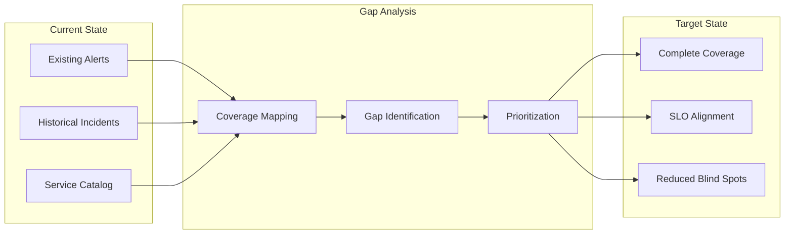
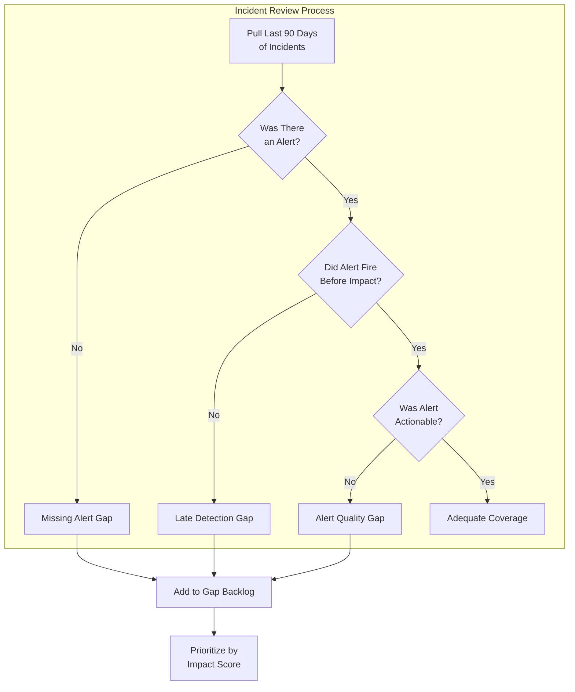
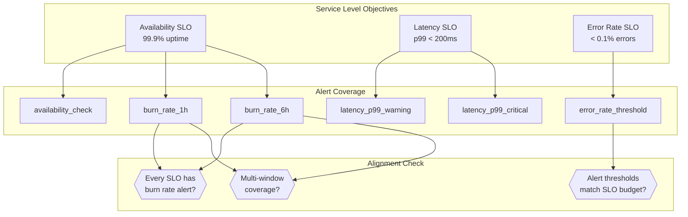
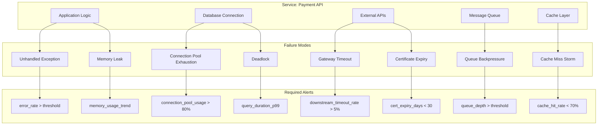
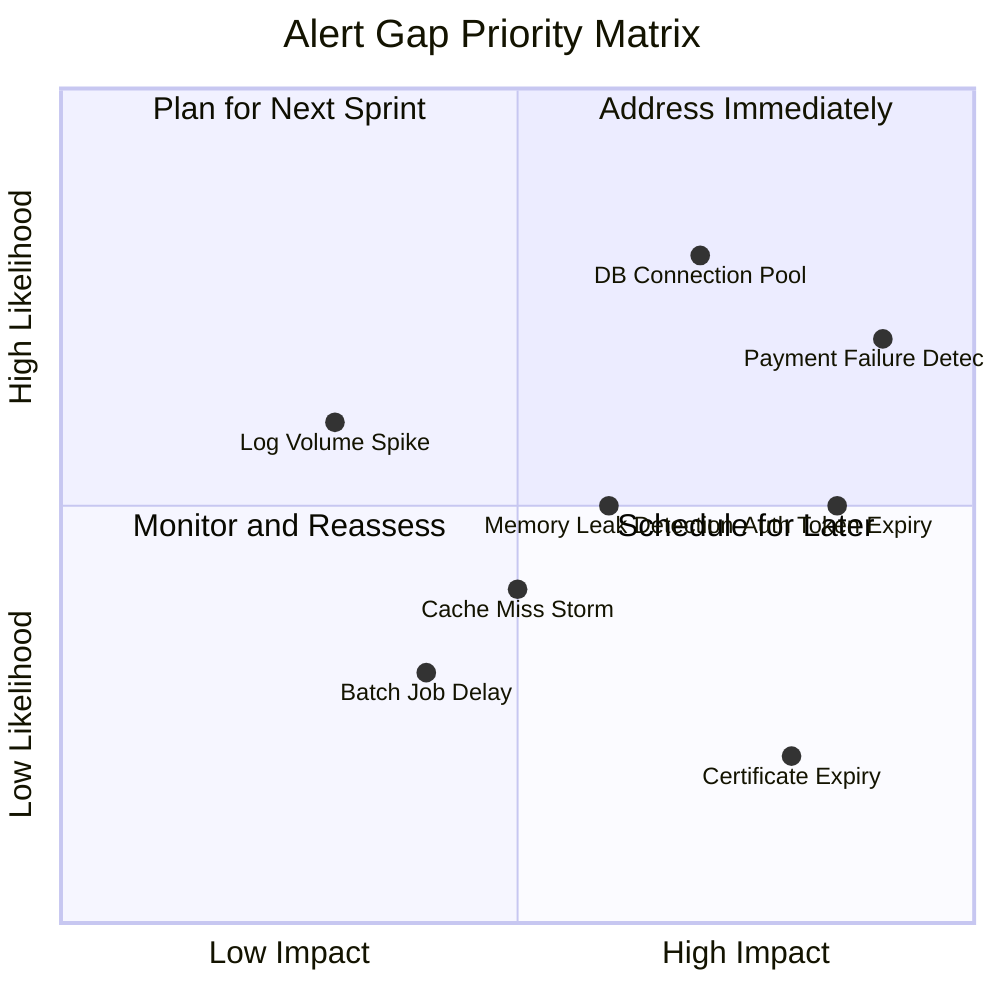
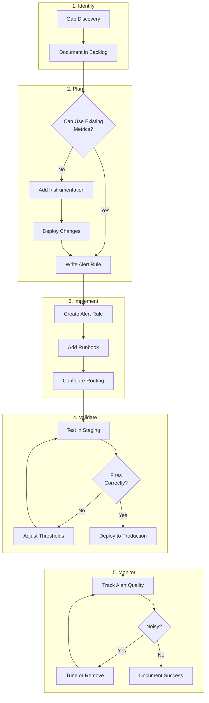
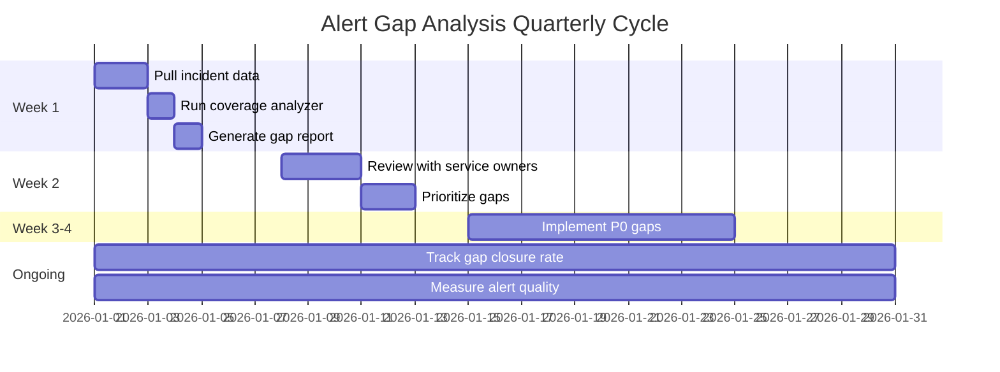

# How to Create Alert Gap Analysis

Author: [nawazdhandala](https://github.com/nawazdhandala)

Tags: Alerting, SRE, Analysis, Monitoring

Description: Learn how to identify and address gaps in your alerting coverage.

---

## What Is Alert Gap Analysis?

Alert gap analysis is the systematic process of identifying missing, inadequate, or misaligned alerts in your monitoring infrastructure. The goal is to ensure every critical failure mode has appropriate detection and notification before users experience impact.

Most teams accumulate alerts reactively: an incident happens, someone adds an alert, and the cycle repeats. This approach leaves blind spots until they become outages. A structured gap analysis flips that script by proactively mapping what should be monitored against what actually is.



---

## 1. Coverage Mapping by Service

The first step is building a complete picture of what alerts exist for each service. This requires correlating your service catalog with your alerting rules.

### Building a Service-Alert Matrix

Create a matrix that maps every service to its associated alerts. This reveals services with no coverage and services with excessive (often noisy) coverage.

```yaml
# service-alert-inventory.yaml
services:
  - name: payment-api
    tier: critical
    owner: payments-team
    alerts:
      - name: payment_api_error_rate_high
        type: error_rate
        threshold: "> 1%"
        window: 5m
        severity: critical
      - name: payment_api_latency_p99
        type: latency
        threshold: "> 500ms"
        window: 5m
        severity: warning
      - name: payment_api_availability
        type: availability
        threshold: "< 99.9%"
        window: 1h
        severity: critical
    missing_coverage:
      - database_connection_pool
      - downstream_timeout_rate

  - name: user-auth
    tier: critical
    owner: identity-team
    alerts:
      - name: auth_failure_rate
        type: error_rate
        threshold: "> 0.5%"
        window: 5m
        severity: critical
    missing_coverage:
      - token_refresh_failures
      - session_store_latency
      - rate_limit_breaches

  - name: recommendation-engine
    tier: standard
    owner: ml-team
    alerts: []  # No alerts configured
    missing_coverage:
      - model_inference_latency
      - feature_store_availability
      - prediction_error_rate
```

### Automation Script for Coverage Discovery

Use this script to automatically discover alert coverage gaps by comparing your service catalog against existing alert rules.

```python
#!/usr/bin/env python3
"""
Alert Coverage Analyzer
Discovers gaps between services and their alert coverage.
"""

import json
from dataclasses import dataclass, field
from typing import Optional
from collections import defaultdict


@dataclass
class Alert:
    name: str
    service: str
    signal_type: str  # error_rate, latency, availability, saturation
    severity: str
    threshold: str
    window: str


@dataclass
class Service:
    name: str
    tier: str  # critical, standard, best-effort
    owner: str
    dependencies: list[str] = field(default_factory=list)


@dataclass
class CoverageGap:
    service: str
    gap_type: str
    description: str
    priority: str
    recommendation: str


class AlertCoverageAnalyzer:
    # Minimum alert types required per service tier
    REQUIRED_COVERAGE = {
        "critical": {
            "error_rate": True,
            "latency": True,
            "availability": True,
            "saturation": True,
        },
        "standard": {
            "error_rate": True,
            "latency": True,
            "availability": False,
            "saturation": False,
        },
        "best-effort": {
            "error_rate": True,
            "latency": False,
            "availability": False,
            "saturation": False,
        },
    }

    def __init__(self):
        self.services: dict[str, Service] = {}
        self.alerts: list[Alert] = []
        self.service_alerts: dict[str, list[Alert]] = defaultdict(list)

    def load_services(self, services_data: list[dict]) -> None:
        """Load service definitions from configuration."""
        for svc in services_data:
            service = Service(
                name=svc["name"],
                tier=svc.get("tier", "standard"),
                owner=svc.get("owner", "unknown"),
                dependencies=svc.get("dependencies", []),
            )
            self.services[service.name] = service

    def load_alerts(self, alerts_data: list[dict]) -> None:
        """Load existing alert definitions."""
        for alert_def in alerts_data:
            alert = Alert(
                name=alert_def["name"],
                service=alert_def["service"],
                signal_type=alert_def["signal_type"],
                severity=alert_def["severity"],
                threshold=alert_def["threshold"],
                window=alert_def["window"],
            )
            self.alerts.append(alert)
            self.service_alerts[alert.service].append(alert)

    def analyze_coverage(self) -> list[CoverageGap]:
        """Identify all coverage gaps across services."""
        gaps = []

        for service_name, service in self.services.items():
            service_gaps = self._analyze_service_coverage(service)
            gaps.extend(service_gaps)

        # Sort by priority
        priority_order = {"critical": 0, "high": 1, "medium": 2, "low": 3}
        gaps.sort(key=lambda g: priority_order.get(g.priority, 99))

        return gaps

    def _analyze_service_coverage(self, service: Service) -> list[CoverageGap]:
        """Analyze coverage for a single service."""
        gaps = []
        alerts = self.service_alerts.get(service.name, [])
        covered_types = {a.signal_type for a in alerts}
        required = self.REQUIRED_COVERAGE.get(service.tier, {})

        # Check for missing signal types
        for signal_type, is_required in required.items():
            if is_required and signal_type not in covered_types:
                priority = "critical" if service.tier == "critical" else "high"
                gaps.append(
                    CoverageGap(
                        service=service.name,
                        gap_type="missing_signal",
                        description=f"No {signal_type} alert configured",
                        priority=priority,
                        recommendation=f"Add {signal_type} monitoring for {service.name}",
                    )
                )

        # Check for missing dependency alerts
        for dep in service.dependencies:
            dep_error_alert = any(
                a.signal_type == "error_rate"
                and dep.lower() in a.name.lower()
                for a in alerts
            )
            if not dep_error_alert:
                gaps.append(
                    CoverageGap(
                        service=service.name,
                        gap_type="missing_dependency",
                        description=f"No alert for dependency: {dep}",
                        priority="medium",
                        recommendation=f"Add downstream error monitoring for {dep}",
                    )
                )

        # Check for services with no alerts at all
        if not alerts:
            gaps.append(
                CoverageGap(
                    service=service.name,
                    gap_type="no_coverage",
                    description="Service has zero alerts configured",
                    priority="critical" if service.tier == "critical" else "high",
                    recommendation="Implement baseline alerting for all golden signals",
                )
            )

        return gaps

    def generate_report(self, gaps: list[CoverageGap]) -> dict:
        """Generate a structured coverage report."""
        report = {
            "summary": {
                "total_services": len(self.services),
                "total_alerts": len(self.alerts),
                "total_gaps": len(gaps),
                "gaps_by_priority": defaultdict(int),
                "gaps_by_type": defaultdict(int),
            },
            "coverage_by_service": {},
            "gaps": [vars(g) for g in gaps],
        }

        for gap in gaps:
            report["summary"]["gaps_by_priority"][gap.priority] += 1
            report["summary"]["gaps_by_type"][gap.gap_type] += 1

        for service_name, service in self.services.items():
            alerts = self.service_alerts.get(service_name, [])
            service_gaps = [g for g in gaps if g.service == service_name]
            coverage_pct = self._calculate_coverage_percentage(service, alerts)

            report["coverage_by_service"][service_name] = {
                "tier": service.tier,
                "alert_count": len(alerts),
                "gap_count": len(service_gaps),
                "coverage_percentage": coverage_pct,
            }

        return report

    def _calculate_coverage_percentage(
        self, service: Service, alerts: list[Alert]
    ) -> float:
        """Calculate what percentage of required signals are covered."""
        required = self.REQUIRED_COVERAGE.get(service.tier, {})
        required_count = sum(1 for v in required.values() if v)
        if required_count == 0:
            return 100.0

        covered_types = {a.signal_type for a in alerts}
        covered_required = sum(
            1 for signal, req in required.items() if req and signal in covered_types
        )

        return round((covered_required / required_count) * 100, 1)


# Example usage
if __name__ == "__main__":
    analyzer = AlertCoverageAnalyzer()

    # Sample service data
    services = [
        {
            "name": "payment-api",
            "tier": "critical",
            "owner": "payments-team",
            "dependencies": ["stripe-gateway", "fraud-detection"],
        },
        {
            "name": "user-auth",
            "tier": "critical",
            "owner": "identity-team",
            "dependencies": ["redis-sessions", "ldap"],
        },
        {"name": "recommendations", "tier": "standard", "owner": "ml-team"},
    ]

    # Sample existing alerts
    alerts = [
        {
            "name": "payment_api_errors",
            "service": "payment-api",
            "signal_type": "error_rate",
            "severity": "critical",
            "threshold": "> 1%",
            "window": "5m",
        },
        {
            "name": "payment_api_latency",
            "service": "payment-api",
            "signal_type": "latency",
            "severity": "warning",
            "threshold": "> 500ms",
            "window": "5m",
        },
    ]

    analyzer.load_services(services)
    analyzer.load_alerts(alerts)
    gaps = analyzer.analyze_coverage()
    report = analyzer.generate_report(gaps)

    print(json.dumps(report, indent=2, default=dict))
```

---

## 2. Missing Critical Alert Detection

Once you have a coverage map, the next step is identifying which missing alerts represent the highest risk. Not all gaps are equal; focus on failure modes that have caused incidents or could cause significant user impact.

### Historical Incident Analysis

Review past incidents to find patterns where alerts were missing or fired too late.



### Gap Detection Query

If you use a structured incident tracking system, query for gaps programmatically.

```sql
-- Find incidents without corresponding pre-alert
WITH incident_alerts AS (
    SELECT
        i.incident_id,
        i.service_name,
        i.detected_at,
        i.user_impact_started_at,
        i.severity,
        i.root_cause_category,
        a.alert_id,
        a.fired_at,
        EXTRACT(EPOCH FROM (i.user_impact_started_at - a.fired_at)) / 60
            AS minutes_before_impact
    FROM incidents i
    LEFT JOIN alerts a ON
        a.service = i.service_name
        AND a.fired_at BETWEEN
            i.user_impact_started_at - INTERVAL '30 minutes'
            AND i.user_impact_started_at
    WHERE i.created_at > NOW() - INTERVAL '90 days'
)
SELECT
    service_name,
    COUNT(*) AS total_incidents,
    COUNT(*) FILTER (WHERE alert_id IS NULL) AS incidents_without_alert,
    COUNT(*) FILTER (WHERE minutes_before_impact < 0) AS alerts_after_impact,
    ROUND(
        100.0 * COUNT(*) FILTER (WHERE alert_id IS NULL) / COUNT(*),
        1
    ) AS missing_alert_pct,
    ARRAY_AGG(DISTINCT root_cause_category)
        FILTER (WHERE alert_id IS NULL) AS uncovered_failure_modes
FROM incident_alerts
GROUP BY service_name
HAVING COUNT(*) FILTER (WHERE alert_id IS NULL) > 0
ORDER BY incidents_without_alert DESC;
```

### Critical Path Identification

Map your critical user journeys and verify each step has alert coverage.

```python
"""
Critical path alert coverage checker.
Ensures every step in critical user journeys has monitoring.
"""

from dataclasses import dataclass


@dataclass
class JourneyStep:
    name: str
    service: str
    expected_alerts: list[str]
    actual_alerts: list[str]

    @property
    def coverage_gap(self) -> list[str]:
        return [a for a in self.expected_alerts if a not in self.actual_alerts]

    @property
    def is_covered(self) -> bool:
        return len(self.coverage_gap) == 0


def analyze_critical_journey(
    journey_name: str, steps: list[JourneyStep]
) -> dict:
    """Analyze alert coverage for a critical user journey."""
    uncovered_steps = [s for s in steps if not s.is_covered]
    total_expected = sum(len(s.expected_alerts) for s in steps)
    total_covered = sum(
        len(set(s.expected_alerts) & set(s.actual_alerts)) for s in steps
    )

    return {
        "journey": journey_name,
        "total_steps": len(steps),
        "covered_steps": len(steps) - len(uncovered_steps),
        "coverage_percentage": round(100 * total_covered / total_expected, 1)
        if total_expected > 0
        else 100,
        "gaps": [
            {
                "step": s.name,
                "service": s.service,
                "missing_alerts": s.coverage_gap,
            }
            for s in uncovered_steps
        ],
    }


# Example: Checkout flow analysis
checkout_journey = [
    JourneyStep(
        name="Add to Cart",
        service="cart-service",
        expected_alerts=["cart_error_rate", "cart_latency_p99"],
        actual_alerts=["cart_error_rate"],  # Missing latency
    ),
    JourneyStep(
        name="Apply Discount",
        service="promotions-service",
        expected_alerts=["promo_error_rate", "promo_validation_failures"],
        actual_alerts=[],  # No coverage
    ),
    JourneyStep(
        name="Calculate Tax",
        service="tax-service",
        expected_alerts=["tax_error_rate", "tax_api_timeout"],
        actual_alerts=["tax_error_rate", "tax_api_timeout"],  # Fully covered
    ),
    JourneyStep(
        name="Process Payment",
        service="payment-api",
        expected_alerts=[
            "payment_error_rate",
            "payment_latency_p99",
            "payment_gateway_failures",
        ],
        actual_alerts=["payment_error_rate", "payment_latency_p99"],
    ),
    JourneyStep(
        name="Send Confirmation",
        service="notification-service",
        expected_alerts=["notification_delivery_rate", "email_queue_depth"],
        actual_alerts=["notification_delivery_rate"],
    ),
]

result = analyze_critical_journey("Checkout Flow", checkout_journey)
print(f"Coverage: {result['coverage_percentage']}%")
for gap in result["gaps"]:
    print(f"  {gap['step']}: missing {gap['missing_alerts']}")
```

---

## 3. SLO-Alert Alignment Checking

Your alerts should directly support your Service Level Objectives. If an SLO can be breached without an alert firing, you have a dangerous gap.

### SLO-Alert Mapping Diagram



### SLO Alignment Validator

```python
"""
Validates that alerts are properly aligned with SLO definitions.
Ensures burn rate alerts exist and thresholds are calibrated.
"""

from dataclasses import dataclass
from typing import Optional
import math


@dataclass
class SLO:
    name: str
    service: str
    target: float  # e.g., 99.9
    window_days: int  # e.g., 30
    sli_type: str  # availability, latency, error_rate

    @property
    def error_budget_percent(self) -> float:
        """Calculate the error budget as a percentage."""
        return 100 - self.target

    @property
    def error_budget_minutes(self) -> float:
        """Calculate error budget in minutes for the window."""
        return (self.error_budget_percent / 100) * self.window_days * 24 * 60


@dataclass
class BurnRateAlert:
    name: str
    service: str
    slo_name: str
    short_window_minutes: int
    long_window_minutes: int
    burn_rate_threshold: float
    severity: str


@dataclass
class AlignmentIssue:
    slo_name: str
    issue_type: str
    description: str
    recommendation: str


class SLOAlertAlignmentChecker:
    """Checks that alerts properly protect SLO budgets."""

    # Recommended burn rate configurations
    # (burn_rate, short_window_hours, long_window_hours, budget_consumed)
    RECOMMENDED_BURN_RATES = [
        (14.4, 1, 6, 0.02),    # 2% budget in 1 hour
        (6, 1, 6, 0.05),       # 5% budget in 6 hours
        (3, 6, 24, 0.10),      # 10% budget in 1 day
        (1, 24, 72, 0.10),     # 10% budget in 3 days
    ]

    def __init__(self):
        self.slos: dict[str, SLO] = {}
        self.alerts: dict[str, list[BurnRateAlert]] = {}

    def add_slo(self, slo: SLO) -> None:
        self.slos[slo.name] = slo

    def add_alert(self, alert: BurnRateAlert) -> None:
        if alert.slo_name not in self.alerts:
            self.alerts[alert.slo_name] = []
        self.alerts[alert.slo_name].append(alert)

    def check_alignment(self) -> list[AlignmentIssue]:
        """Check all SLOs for proper alert alignment."""
        issues = []

        for slo_name, slo in self.slos.items():
            slo_alerts = self.alerts.get(slo_name, [])

            # Check: Does SLO have any burn rate alerts?
            if not slo_alerts:
                issues.append(
                    AlignmentIssue(
                        slo_name=slo_name,
                        issue_type="no_alerts",
                        description=f"SLO '{slo_name}' has no burn rate alerts",
                        recommendation="Add multi-window burn rate alerts",
                    )
                )
                continue

            # Check: Are there multi-window alerts?
            has_short_window = any(
                a.short_window_minutes <= 60 for a in slo_alerts
            )
            has_long_window = any(
                a.long_window_minutes >= 360 for a in slo_alerts
            )

            if not has_short_window:
                issues.append(
                    AlignmentIssue(
                        slo_name=slo_name,
                        issue_type="missing_short_window",
                        description="No short-window (1h) burn rate alert",
                        recommendation="Add 1h window alert for fast burn detection",
                    )
                )

            if not has_long_window:
                issues.append(
                    AlignmentIssue(
                        slo_name=slo_name,
                        issue_type="missing_long_window",
                        description="No long-window (6h+) burn rate alert",
                        recommendation="Add 6h+ window alert for slow burn detection",
                    )
                )

            # Check: Are burn rates calibrated correctly?
            for alert in slo_alerts:
                expected_burn = self._calculate_expected_burn_rate(
                    slo, alert.short_window_minutes
                )
                if alert.burn_rate_threshold < expected_burn * 0.5:
                    issues.append(
                        AlignmentIssue(
                            slo_name=slo_name,
                            issue_type="burn_rate_too_low",
                            description=f"Alert '{alert.name}' burn rate "
                            f"({alert.burn_rate_threshold}) may be too low",
                            recommendation=f"Consider burn rate of {expected_burn:.1f}",
                        )
                    )

        return issues

    def _calculate_expected_burn_rate(
        self, slo: SLO, window_minutes: int
    ) -> float:
        """Calculate expected burn rate for budget exhaustion in window."""
        total_budget_minutes = slo.error_budget_minutes
        # Burn rate = how many times faster than normal we're consuming budget
        # If we want to detect 2% budget burn in window_minutes
        budget_at_risk = 0.02  # Alert at 2% budget consumption
        expected_burn = (budget_at_risk * total_budget_minutes) / window_minutes
        return expected_burn

    def generate_recommended_alerts(self, slo: SLO) -> list[dict]:
        """Generate recommended alert configurations for an SLO."""
        recommendations = []

        for burn_rate, short_h, long_h, budget_pct in self.RECOMMENDED_BURN_RATES:
            severity = "critical" if burn_rate >= 10 else "warning"
            recommendations.append(
                {
                    "name": f"{slo.service}_{slo.sli_type}_burn_{int(burn_rate)}x",
                    "burn_rate": burn_rate,
                    "short_window": f"{short_h}h",
                    "long_window": f"{long_h}h",
                    "severity": severity,
                    "budget_consumed_before_alert": f"{budget_pct * 100:.0f}%",
                    "time_to_exhaustion_at_rate": f"{slo.window_days / burn_rate:.1f} days",
                }
            )

        return recommendations


# Example usage
checker = SLOAlertAlignmentChecker()

# Define SLOs
api_availability_slo = SLO(
    name="api-availability",
    service="api-gateway",
    target=99.9,
    window_days=30,
    sli_type="availability",
)
checker.add_slo(api_availability_slo)

# Define existing alerts
checker.add_alert(
    BurnRateAlert(
        name="api_burn_rate_fast",
        service="api-gateway",
        slo_name="api-availability",
        short_window_minutes=60,
        long_window_minutes=360,
        burn_rate_threshold=14.4,
        severity="critical",
    )
)

# Check alignment
issues = checker.check_alignment()
for issue in issues:
    print(f"[{issue.issue_type}] {issue.slo_name}: {issue.description}")

# Get recommendations
recommendations = checker.generate_recommended_alerts(api_availability_slo)
for rec in recommendations:
    print(f"  Recommended: {rec['name']} (burn {rec['burn_rate']}x)")
```

---

## 4. Failure Mode Coverage Analysis

Beyond standard signals, analyze specific failure modes that could affect your services. This requires understanding how each service can fail and ensuring detection exists.

### Failure Mode Enumeration



### Failure Mode Catalog

Create a catalog of known failure modes and their detection requirements.

```yaml
# failure-mode-catalog.yaml
failure_modes:
  # Infrastructure Failures
  - id: FM001
    name: Connection Pool Exhaustion
    category: infrastructure
    services_affected: [database-clients, api-services]
    detection:
      metric: connection_pool_active / connection_pool_max
      condition: "> 0.8"
      for: 5m
    impact: Service unable to handle new requests
    alert_template: |
      - alert: ConnectionPoolExhaustion
        expr: (db_pool_active_connections / db_pool_max_connections) > 0.8
        for: 5m
        labels:
          severity: warning
        annotations:
          summary: Connection pool near capacity

  - id: FM002
    name: Memory Leak
    category: application
    services_affected: [all-services]
    detection:
      metric: process_resident_memory_bytes
      condition: "monotonic increase over 1h"
      for: 1h
    impact: OOM kill, service restart, request failures
    alert_template: |
      - alert: MemoryLeakSuspected
        expr: |
          (process_resident_memory_bytes -
           process_resident_memory_bytes offset 1h) /
          process_resident_memory_bytes offset 1h > 0.2
        for: 30m
        labels:
          severity: warning

  - id: FM003
    name: Certificate Expiration
    category: security
    services_affected: [tls-termination, api-gateway]
    detection:
      metric: ssl_certificate_expiry_seconds
      condition: "< 30 days"
      for: 0m
    impact: Service unavailable, trust errors
    alert_template: |
      - alert: CertificateExpiringSoon
        expr: ssl_certificate_expiry_seconds < 30 * 24 * 3600
        for: 1h
        labels:
          severity: warning

  - id: FM004
    name: Downstream Service Degradation
    category: dependency
    services_affected: [all-services-with-dependencies]
    detection:
      metric: http_client_request_duration_seconds
      condition: "p99 > SLA threshold"
      for: 5m
    impact: Cascading latency, timeout errors
    alert_template: |
      - alert: DownstreamLatencyHigh
        expr: |
          histogram_quantile(0.99,
            rate(http_client_request_duration_seconds_bucket[5m])
          ) > 1.0
        for: 5m
        labels:
          severity: warning

  - id: FM005
    name: Queue Consumer Lag
    category: messaging
    services_affected: [async-processors, event-handlers]
    detection:
      metric: kafka_consumer_lag / kafka_message_rate
      condition: "> 5 minutes"
      for: 10m
    impact: Delayed processing, stale data
    alert_template: |
      - alert: ConsumerLagHigh
        expr: |
          kafka_consumergroup_lag /
          rate(kafka_topic_messages_in_total[5m]) > 300
        for: 10m
        labels:
          severity: warning
```

### Failure Mode Coverage Checker

```python
"""
Checks that all documented failure modes have corresponding alerts.
"""

from dataclasses import dataclass
import yaml
import re


@dataclass
class FailureMode:
    id: str
    name: str
    category: str
    services_affected: list[str]
    detection_metric: str
    condition: str
    alert_template: str


@dataclass
class ExistingAlert:
    name: str
    expr: str
    labels: dict


def load_failure_modes(catalog_path: str) -> list[FailureMode]:
    """Load failure mode definitions from YAML catalog."""
    with open(catalog_path) as f:
        data = yaml.safe_load(f)

    modes = []
    for fm in data.get("failure_modes", []):
        modes.append(
            FailureMode(
                id=fm["id"],
                name=fm["name"],
                category=fm["category"],
                services_affected=fm["services_affected"],
                detection_metric=fm["detection"]["metric"],
                condition=fm["detection"]["condition"],
                alert_template=fm.get("alert_template", ""),
            )
        )
    return modes


def load_existing_alerts(alerts_path: str) -> list[ExistingAlert]:
    """Load existing Prometheus alert rules."""
    with open(alerts_path) as f:
        data = yaml.safe_load(f)

    alerts = []
    for group in data.get("groups", []):
        for rule in group.get("rules", []):
            if "alert" in rule:
                alerts.append(
                    ExistingAlert(
                        name=rule["alert"],
                        expr=rule.get("expr", ""),
                        labels=rule.get("labels", {}),
                    )
                )
    return alerts


def check_failure_mode_coverage(
    failure_modes: list[FailureMode], existing_alerts: list[ExistingAlert]
) -> dict:
    """Check which failure modes have alert coverage."""
    coverage_report = {
        "covered": [],
        "uncovered": [],
        "partial": [],
    }

    for fm in failure_modes:
        # Check if any existing alert references the failure mode's metric
        matching_alerts = [
            a for a in existing_alerts if fm.detection_metric in a.expr
        ]

        if matching_alerts:
            coverage_report["covered"].append(
                {
                    "failure_mode": fm.id,
                    "name": fm.name,
                    "matched_alerts": [a.name for a in matching_alerts],
                }
            )
        else:
            # Check for partial matches (metric family without exact name)
            metric_base = fm.detection_metric.split("{")[0].split("[")[0]
            partial_matches = [
                a for a in existing_alerts if metric_base in a.expr
            ]

            if partial_matches:
                coverage_report["partial"].append(
                    {
                        "failure_mode": fm.id,
                        "name": fm.name,
                        "similar_alerts": [a.name for a in partial_matches],
                        "recommendation": f"Verify alerts cover: {fm.condition}",
                    }
                )
            else:
                coverage_report["uncovered"].append(
                    {
                        "failure_mode": fm.id,
                        "name": fm.name,
                        "category": fm.category,
                        "services": fm.services_affected,
                        "recommended_alert": fm.alert_template,
                    }
                )

    return coverage_report


# Summary statistics
def print_coverage_summary(report: dict) -> None:
    total = len(report["covered"]) + len(report["uncovered"]) + len(report["partial"])
    print(f"\nFailure Mode Coverage Summary")
    print(f"{'=' * 40}")
    print(f"Total failure modes: {total}")
    print(f"Fully covered: {len(report['covered'])} ({100*len(report['covered'])/total:.0f}%)")
    print(f"Partially covered: {len(report['partial'])}")
    print(f"Uncovered: {len(report['uncovered'])}")

    if report["uncovered"]:
        print(f"\nUncovered Failure Modes:")
        for fm in report["uncovered"]:
            print(f"  - [{fm['failure_mode']}] {fm['name']} ({fm['category']})")
```

---

## 5. Alert Gap Prioritization

Not all gaps need immediate attention. Prioritize based on impact, likelihood, and detection difficulty.

### Prioritization Matrix



### Prioritization Scoring System

```python
"""
Gap prioritization scoring system.
Ranks alert gaps by urgency and impact.
"""

from dataclasses import dataclass
from enum import IntEnum
from typing import Optional


class ImpactLevel(IntEnum):
    CRITICAL = 4  # Revenue/user-facing outage
    HIGH = 3      # Significant degradation
    MEDIUM = 2    # Partial functionality loss
    LOW = 1       # Minor inconvenience


class LikelihoodLevel(IntEnum):
    VERY_LIKELY = 4   # Happens regularly
    LIKELY = 3        # Has happened before
    POSSIBLE = 2      # Could happen
    UNLIKELY = 1      # Rare edge case


class DetectionDifficulty(IntEnum):
    EASY = 1     # Standard metrics available
    MODERATE = 2 # Requires new instrumentation
    HARD = 3     # Complex correlation needed
    VERY_HARD = 4  # May need new tooling


@dataclass
class AlertGap:
    id: str
    description: str
    service: str
    failure_mode: str
    impact: ImpactLevel
    likelihood: LikelihoodLevel
    detection_difficulty: DetectionDifficulty
    past_incidents: int = 0
    estimated_effort_hours: float = 0
    slo_affected: Optional[str] = None

    @property
    def risk_score(self) -> float:
        """Calculate risk score (higher = more urgent)."""
        base_score = self.impact * self.likelihood
        # Boost for past incidents
        incident_multiplier = 1 + (self.past_incidents * 0.2)
        # Reduce slightly for hard-to-implement items
        difficulty_factor = 1 / (1 + self.detection_difficulty * 0.1)
        # Boost for SLO-affecting gaps
        slo_multiplier = 1.5 if self.slo_affected else 1.0

        return base_score * incident_multiplier * difficulty_factor * slo_multiplier

    @property
    def priority_tier(self) -> str:
        """Classify into priority tiers."""
        score = self.risk_score
        if score >= 12:
            return "P0 - Immediate"
        elif score >= 8:
            return "P1 - This Sprint"
        elif score >= 4:
            return "P2 - Next Quarter"
        else:
            return "P3 - Backlog"


def prioritize_gaps(gaps: list[AlertGap]) -> list[AlertGap]:
    """Sort gaps by priority score descending."""
    return sorted(gaps, key=lambda g: g.risk_score, reverse=True)


def generate_priority_report(gaps: list[AlertGap]) -> dict:
    """Generate a priority report for stakeholders."""
    prioritized = prioritize_gaps(gaps)

    report = {
        "total_gaps": len(gaps),
        "by_tier": {
            "P0 - Immediate": [],
            "P1 - This Sprint": [],
            "P2 - Next Quarter": [],
            "P3 - Backlog": [],
        },
        "total_effort_hours": sum(g.estimated_effort_hours for g in gaps),
        "top_5_gaps": [],
    }

    for gap in prioritized:
        report["by_tier"][gap.priority_tier].append(
            {
                "id": gap.id,
                "description": gap.description,
                "service": gap.service,
                "score": round(gap.risk_score, 2),
                "effort_hours": gap.estimated_effort_hours,
            }
        )

    report["top_5_gaps"] = [
        {
            "id": g.id,
            "description": g.description,
            "priority": g.priority_tier,
            "score": round(g.risk_score, 2),
            "reason": f"Impact: {g.impact.name}, Likelihood: {g.likelihood.name}, "
                     f"Past incidents: {g.past_incidents}",
        }
        for g in prioritized[:5]
    ]

    return report


# Example usage
gaps = [
    AlertGap(
        id="GAP-001",
        description="No payment gateway timeout detection",
        service="payment-api",
        failure_mode="downstream_timeout",
        impact=ImpactLevel.CRITICAL,
        likelihood=LikelihoodLevel.LIKELY,
        detection_difficulty=DetectionDifficulty.EASY,
        past_incidents=3,
        estimated_effort_hours=2,
        slo_affected="payment-availability",
    ),
    AlertGap(
        id="GAP-002",
        description="Missing memory leak detection",
        service="user-service",
        failure_mode="memory_leak",
        impact=ImpactLevel.HIGH,
        likelihood=LikelihoodLevel.POSSIBLE,
        detection_difficulty=DetectionDifficulty.MODERATE,
        past_incidents=1,
        estimated_effort_hours=4,
    ),
    AlertGap(
        id="GAP-003",
        description="No certificate expiry warning",
        service="api-gateway",
        failure_mode="cert_expiry",
        impact=ImpactLevel.CRITICAL,
        likelihood=LikelihoodLevel.UNLIKELY,
        detection_difficulty=DetectionDifficulty.EASY,
        past_incidents=0,
        estimated_effort_hours=1,
    ),
]

report = generate_priority_report(gaps)
print(f"Top Priority Gaps:")
for gap in report["top_5_gaps"]:
    print(f"  [{gap['priority']}] {gap['id']}: {gap['description']}")
    print(f"    Score: {gap['score']}, {gap['reason']}")
```

---

## 6. Gap Remediation Strategies

Once gaps are identified and prioritized, you need a systematic approach to close them.

### Remediation Workflow



### Remediation Template

For each gap, create a remediation plan following this structure:

```yaml
# gap-remediation-template.yaml
remediation:
  gap_id: "GAP-001"
  gap_description: "No payment gateway timeout detection"

  current_state:
    detection_exists: false
    metrics_available: true
    metrics_needed:
      - http_client_request_duration_seconds

  target_state:
    alert_name: payment_gateway_timeout_rate
    objective: "Detect when > 5% of payment gateway calls timeout"
    slo_protected: "payment-availability-99.9"

  implementation:
    steps:
      - task: "Verify metrics are being collected"
        owner: platform-team
        effort: 1h

      - task: "Write Prometheus alert rule"
        owner: payments-sre
        effort: 2h
        deliverable: |
          - alert: PaymentGatewayTimeoutRate
            expr: |
              sum(rate(http_client_request_duration_seconds_count{
                service="payment-api",
                target="stripe-gateway",
                status="timeout"
              }[5m])) /
              sum(rate(http_client_request_duration_seconds_count{
                service="payment-api",
                target="stripe-gateway"
              }[5m])) > 0.05
            for: 2m
            labels:
              severity: critical
              team: payments
            annotations:
              summary: "High timeout rate to payment gateway"
              runbook: "https://wiki/runbooks/payment-gateway-timeout"

      - task: "Write runbook"
        owner: payments-sre
        effort: 2h
        template: |
          ## Payment Gateway Timeout Runbook

          ### Symptoms
          - Alert: PaymentGatewayTimeoutRate
          - > 5% of payment API calls to Stripe are timing out

          ### Likely Causes
          1. Stripe service degradation
          2. Network issues between our DC and Stripe
          3. Request payload issues (large carts)

          ### Investigation Steps
          1. Check Stripe status page
          2. Review timeout distribution by endpoint
          3. Check for recent deployments

          ### Mitigation
          1. If Stripe-side: Enable degraded mode (cached responses)
          2. If network: Fail over to backup payment processor

      - task: "Configure alert routing"
        owner: platform-team
        effort: 30m

      - task: "Test in staging"
        owner: payments-sre
        effort: 1h

      - task: "Deploy to production"
        owner: payments-sre
        effort: 30m

  validation:
    acceptance_criteria:
      - "Alert fires within 2 minutes of 5% timeout rate"
      - "Alert resolves when rate drops below 5%"
      - "PagerDuty routes to payments on-call"
      - "Runbook link is accessible and accurate"

    test_plan:
      - method: "Inject artificial timeouts via chaos testing"
        expected: "Alert fires, runbook is followed"

  rollout:
    schedule: "2026-02-01"
    owner: payments-sre
    review_date: "2026-02-15"
```

### Batch Remediation Script

For organizations with many gaps, automate the creation of standard alerts.

```python
"""
Batch alert generation for common gap patterns.
Generates Prometheus alert rules from gap definitions.
"""

from dataclasses import dataclass
from typing import Optional
import yaml


@dataclass
class GapTemplate:
    pattern: str
    description: str
    expr_template: str
    severity: str
    for_duration: str
    annotations_template: dict


# Common gap patterns with templates
GAP_TEMPLATES = {
    "error_rate": GapTemplate(
        pattern="error_rate",
        description="High error rate detection",
        expr_template="""
sum(rate(http_server_requests_total{{service="{service}", status=~"5.."}}[5m])) /
sum(rate(http_server_requests_total{{service="{service}"}}[5m])) > {threshold}
""".strip(),
        severity="critical",
        for_duration="5m",
        annotations_template={
            "summary": "High error rate on {service}",
            "description": "Error rate is above {threshold_pct}% for 5 minutes",
        },
    ),
    "latency_p99": GapTemplate(
        pattern="latency_p99",
        description="High P99 latency detection",
        expr_template="""
histogram_quantile(0.99,
  sum(rate(http_server_request_duration_seconds_bucket{{service="{service}"}}[5m])) by (le)
) > {threshold}
""".strip(),
        severity="warning",
        for_duration="5m",
        annotations_template={
            "summary": "High P99 latency on {service}",
            "description": "P99 latency is above {threshold}s for 5 minutes",
        },
    ),
    "availability": GapTemplate(
        pattern="availability",
        description="Service availability check",
        expr_template="""
avg_over_time(up{{service="{service}"}}[5m]) < {threshold}
""".strip(),
        severity="critical",
        for_duration="2m",
        annotations_template={
            "summary": "Service {service} is down",
            "description": "Service availability below {threshold_pct}%",
        },
    ),
    "saturation_cpu": GapTemplate(
        pattern="saturation_cpu",
        description="High CPU utilization",
        expr_template="""
avg(rate(process_cpu_seconds_total{{service="{service}"}}[5m])) > {threshold}
""".strip(),
        severity="warning",
        for_duration="10m",
        annotations_template={
            "summary": "High CPU usage on {service}",
            "description": "CPU utilization above {threshold_pct}% for 10 minutes",
        },
    ),
}


def generate_alert_rule(
    service: str,
    pattern: str,
    threshold: float,
    team: str,
    runbook_base: str = "https://wiki/runbooks",
) -> Optional[dict]:
    """Generate a Prometheus alert rule from a template."""
    template = GAP_TEMPLATES.get(pattern)
    if not template:
        return None

    alert_name = f"{service.replace('-', '_')}_{pattern}"
    threshold_pct = threshold * 100 if threshold < 1 else threshold

    annotations = {}
    for key, value in template.annotations_template.items():
        annotations[key] = value.format(
            service=service, threshold=threshold, threshold_pct=threshold_pct
        )
    annotations["runbook"] = f"{runbook_base}/{service}/{pattern}"

    return {
        "alert": alert_name,
        "expr": template.expr_template.format(service=service, threshold=threshold),
        "for": template.for_duration,
        "labels": {
            "severity": template.severity,
            "team": team,
            "service": service,
        },
        "annotations": annotations,
    }


def batch_generate_alerts(gaps: list[dict], output_path: str) -> None:
    """Generate alert rules for multiple gaps and write to file."""
    rules = []

    for gap in gaps:
        rule = generate_alert_rule(
            service=gap["service"],
            pattern=gap["pattern"],
            threshold=gap["threshold"],
            team=gap["team"],
        )
        if rule:
            rules.append(rule)

    output = {
        "groups": [
            {
                "name": "gap-remediation-alerts",
                "rules": rules,
            }
        ]
    }

    with open(output_path, "w") as f:
        yaml.dump(output, f, default_flow_style=False)

    print(f"Generated {len(rules)} alert rules to {output_path}")


# Example: Generate alerts for identified gaps
gaps_to_remediate = [
    {"service": "payment-api", "pattern": "error_rate", "threshold": 0.01, "team": "payments"},
    {"service": "payment-api", "pattern": "latency_p99", "threshold": 0.5, "team": "payments"},
    {"service": "user-auth", "pattern": "error_rate", "threshold": 0.005, "team": "identity"},
    {"service": "user-auth", "pattern": "availability", "threshold": 0.999, "team": "identity"},
    {"service": "recommendations", "pattern": "latency_p99", "threshold": 1.0, "team": "ml"},
]

batch_generate_alerts(gaps_to_remediate, "/tmp/remediation-alerts.yaml")
```

---

## Continuous Gap Analysis Process

Alert gap analysis is not a one-time activity. Establish a recurring process.

### Quarterly Review Cadence



### Key Metrics to Track

| Metric | Target | Description |
|--------|--------|-------------|
| Coverage Percentage | > 90% | Services with complete golden signal alerts |
| Gap Closure Rate | > 80% | P0/P1 gaps closed within quarter |
| Mean Time to Detect (MTTD) | < 5 min | Time from failure to alert |
| Incidents Without Alert | < 10% | Incidents where no alert fired first |
| SLO-Alert Alignment | 100% | SLOs with proper burn rate alerts |

---

## Conclusion

Alert gap analysis transforms reactive firefighting into proactive reliability engineering. By systematically mapping coverage, identifying missing alerts, aligning with SLOs, analyzing failure modes, and prioritizing remediation, you build a monitoring system that catches problems before users do.

Key takeaways:

1. **Map coverage first** - You cannot fix what you cannot see
2. **Learn from incidents** - Past failures reveal future gaps
3. **Align alerts to SLOs** - Every objective needs protection
4. **Catalog failure modes** - Think beyond the happy path
5. **Prioritize ruthlessly** - Focus on high-impact, high-likelihood gaps
6. **Remediate systematically** - Use templates and automation
7. **Review continuously** - Gaps appear as systems evolve

A platform like OneUptime can centralize your alerts, SLOs, and incident data, making gap analysis easier to perform and track over time.

Start with your most critical service. Map what exists, find what is missing, and close one gap this week. Repeat until your on-call rotation is calm and your users are happy.
