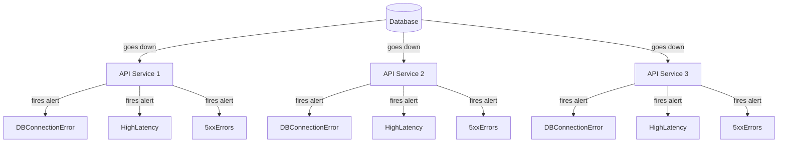
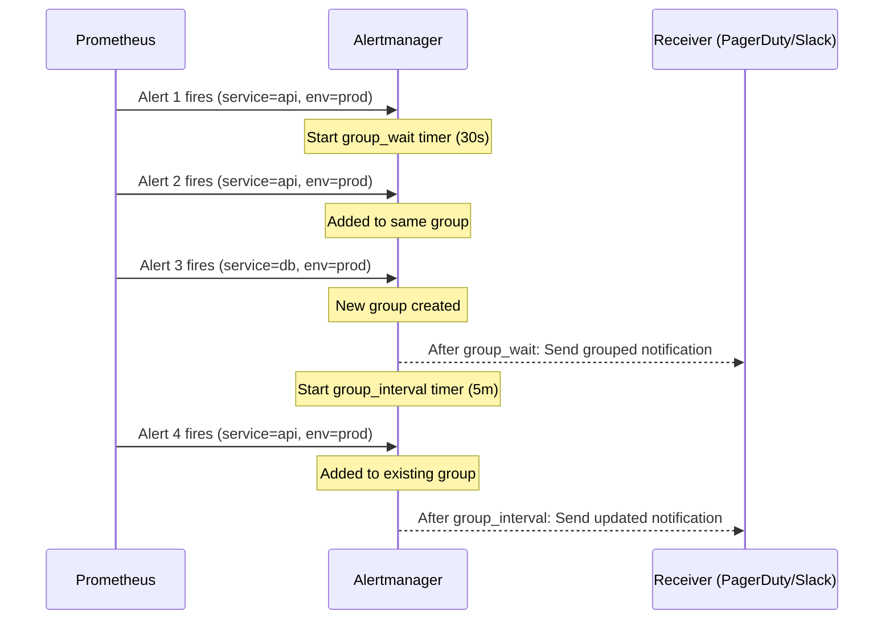
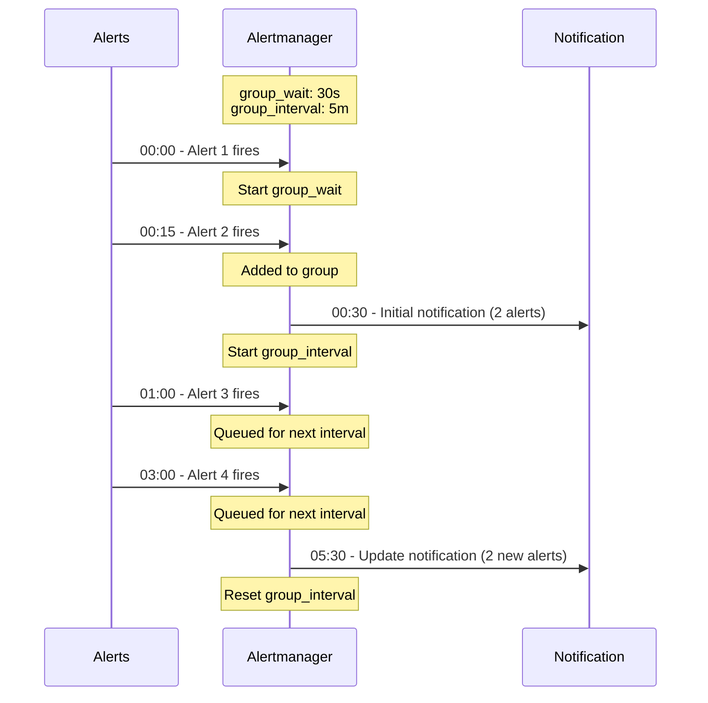
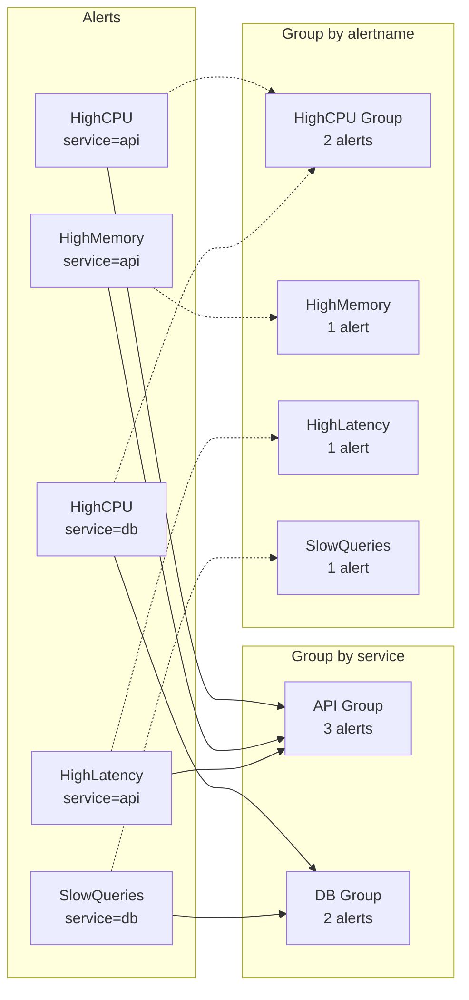

# How to Create Alert Grouping Strategies

Author: [nawazdhandala](https://github.com/nawazdhandala)

Tags: Observability, Alerting, Alertmanager, SRE

Description: Learn how to group related alerts to reduce noise and improve incident response efficiency.

---

It is 3 AM. Your phone lights up. Then again. And again. Within minutes, you have 47 notifications from your monitoring system. All of them are essentially telling you the same thing: your database is down. But instead of one clear signal, you are drowning in a flood of derivative alerts from every service that depends on that database.

This is alert fatigue in action. And it is killing your team's effectiveness.

The solution is not fewer alerts. It is smarter alert grouping. By intelligently consolidating related alerts, you can transform a notification avalanche into a single, actionable incident. This guide walks you through creating effective alert grouping strategies using Prometheus Alertmanager and related tooling.

---

## Why Alert Grouping Matters

Consider a typical microservices architecture. When your primary database goes down:



Without grouping, you receive 9+ separate notifications. With proper grouping, you receive one notification that says: "Database connectivity issues affecting API Services 1, 2, and 3."

The benefits of alert grouping include:

- **Reduced notification volume**: Fewer pages mean less fatigue
- **Faster incident recognition**: One clear signal beats scattered noise
- **Better context**: Grouped alerts show the scope and impact
- **Improved response time**: Engineers focus on fixing, not filtering

---

## Understanding Alertmanager Grouping

Prometheus Alertmanager is the de facto standard for alert routing and grouping in cloud-native environments. Its grouping mechanism uses three key configuration parameters:

| Parameter | Purpose | Default |
|-----------|---------|---------|
| `group_by` | Labels used to aggregate alerts into groups | `[alertname]` |
| `group_wait` | How long to wait before sending the first notification for a new group | 30s |
| `group_interval` | How long to wait before sending notifications about new alerts added to an existing group | 5m |

These three parameters work together to control how alerts are batched and when notifications are sent.

---

## The Grouping Flow

Here is how alerts flow through the grouping pipeline:



---

## Configuring group_by Labels

The `group_by` parameter defines which label combinations create distinct alert groups. Alerts sharing the same values for all `group_by` labels are aggregated together.

### Basic Grouping Configuration

```yaml
# alertmanager.yml
# Basic configuration showing route structure with grouping

route:
  # Default receiver for all alerts
  receiver: 'default-receiver'

  # Labels used to group alerts together
  # Alerts with identical values for these labels form one group
  group_by: ['alertname', 'cluster', 'service']

  # Wait 30 seconds before sending first notification
  # This allows time for related alerts to arrive
  group_wait: 30s

  # Wait 5 minutes before sending updates about new alerts
  # Prevents notification spam during ongoing incidents
  group_interval: 5m

  # Wait 4 hours before re-sending a notification
  # For alerts that remain firing
  repeat_interval: 4h

receivers:
  - name: 'default-receiver'
    slack_configs:
      - api_url: 'https://hooks.slack.com/services/YOUR/WEBHOOK/URL'
        channel: '#alerts'
```

### Grouping Strategy Examples

**Strategy 1: Group by Service**

Best for: Service-oriented teams where each team owns specific services.

```yaml
# Group all alerts for a service together
# A database issue affecting the checkout service creates one notification
# regardless of how many alert types fire

route:
  group_by: ['service', 'env']
  group_wait: 30s
  group_interval: 5m
  repeat_interval: 4h
  receiver: 'team-notifications'
```

**Strategy 2: Group by Alert Type**

Best for: Operations teams that handle alerts by category (database alerts, network alerts, etc.).

```yaml
# Group alerts by their type across all services
# All database connection errors go to the DBA team as one notification

route:
  group_by: ['alertname', 'env']
  group_wait: 45s
  group_interval: 5m
  repeat_interval: 4h
  receiver: 'ops-team'
```

**Strategy 3: Group by Cluster/Region**

Best for: Infrastructure teams managing multi-region deployments.

```yaml
# Group alerts by infrastructure location
# A regional outage creates one notification per affected region

route:
  group_by: ['cluster', 'region', 'env']
  group_wait: 30s
  group_interval: 5m
  repeat_interval: 4h
  receiver: 'infra-team'
```

---

## Tuning group_wait

The `group_wait` parameter controls how long Alertmanager waits before sending the first notification for a new alert group. This delay allows related alerts to arrive and be included in the initial notification.

```mermaid
gantt
    title group_wait Timing
    dateFormat ss
    axisFormat %S

    section Alert Arrival
    Alert 1 fires           :a1, 00, 1s
    Alert 2 fires           :a2, 05, 1s
    Alert 3 fires           :a3, 15, 1s
    Alert 4 fires           :a4, 25, 1s

    section Grouping
    group_wait period       :gw, 00, 30s

    section Notification
    Send grouped alert      :milestone, 30, 0s
```



### Choosing the Right group_wait Value

```yaml
# alertmanager.yml with context-aware group_wait settings

route:
  receiver: 'default'
  group_by: ['alertname', 'service']

  # Default: 30 seconds works for most cases
  group_wait: 30s
  group_interval: 5m
  repeat_interval: 4h

  routes:
    # Critical alerts: shorter wait for faster response
    # Trade-off: may send multiple notifications for cascading failures
    - match:
        severity: critical
      group_wait: 10s
      receiver: 'pagerduty-critical'

    # Batch processing alerts: longer wait to collect related issues
    # These run on schedules, so a 2 minute wait is acceptable
    - match:
        type: batch_job
      group_wait: 2m
      receiver: 'batch-team'

    # Infrastructure alerts: medium wait for correlation
    # Allows time for dependent service alerts to group together
    - match:
        category: infrastructure
      group_wait: 45s
      receiver: 'infra-team'
```

**Guidelines for group_wait:**

| Scenario | Recommended Value | Rationale |
|----------|-------------------|-----------|
| Critical production alerts | 10-15s | Fast response outweighs perfect grouping |
| Standard service alerts | 30s | Balance between speed and grouping |
| Infrastructure alerts | 45-60s | Allow cascade effects to appear |
| Batch job alerts | 1-2m | Jobs run on schedules, some delay acceptable |
| Development/staging | 1m | Lower urgency, better grouping |

---

## Tuning group_interval

The `group_interval` parameter controls how frequently Alertmanager sends notifications about new alerts that have been added to an existing group. Once the initial notification is sent (after `group_wait`), subsequent alerts are batched for `group_interval` duration.



### Configuration Examples

```yaml
# alertmanager.yml with tuned group_interval settings

route:
  receiver: 'default'
  group_by: ['alertname', 'cluster']
  group_wait: 30s

  # Default group_interval: 5 minutes
  # Good balance for most production environments
  group_interval: 5m
  repeat_interval: 4h

  routes:
    # High-severity: shorter interval for visibility
    # Engineers need to know scope is expanding quickly
    - match:
        severity: critical
      group_interval: 1m
      receiver: 'pagerduty'

    # Warning alerts: longer interval reduces noise
    # These are important but not urgent
    - match:
        severity: warning
      group_interval: 10m
      receiver: 'slack-warnings'

    # Noisy alert sources: aggressive batching
    # Kubernetes pod restarts can be very chatty
    - match:
        alertname: PodRestartingFrequently
      group_interval: 15m
      receiver: 'slack-k8s'
```

**Guidelines for group_interval:**

| Scenario | Recommended Value | Rationale |
|----------|-------------------|-----------|
| Critical incidents | 1-2m | Need real-time scope awareness |
| Production alerts | 5m | Standard batching period |
| Warning/info alerts | 10-15m | Reduce notification frequency |
| Noisy known issues | 15-30m | Aggressive batching for chatty alerts |

---

## Complete Production Configuration

Here is a comprehensive Alertmanager configuration that demonstrates grouping best practices:

```yaml
# alertmanager.yml
# Production-ready configuration with hierarchical routing

global:
  # Default timeout for HTTP requests to receivers
  http_config:
    follow_redirects: true

  # SMTP configuration for email alerts
  smtp_smarthost: 'smtp.example.com:587'
  smtp_from: 'alertmanager@example.com'
  smtp_auth_username: 'alertmanager'
  smtp_auth_password: '${SMTP_PASSWORD}'

# Inhibition rules prevent notification spam
# When a critical alert fires, suppress related warnings
inhibit_rules:
  # If a cluster is down, suppress individual service alerts
  - source_match:
      severity: 'critical'
      alertname: 'ClusterDown'
    target_match:
      severity: 'warning'
    # Only inhibit if the cluster label matches
    equal: ['cluster']

  # If database is down, suppress connection errors from services
  - source_match:
      alertname: 'DatabaseDown'
    target_match:
      alertname: 'DatabaseConnectionError'
    equal: ['database', 'env']

route:
  # Default receiver catches anything not matched below
  receiver: 'default-slack'

  # Primary grouping: by service and environment
  # This ensures all alerts for a specific service deployment
  # are grouped together
  group_by: ['alertname', 'service', 'env']

  # Wait 30 seconds to collect initial burst of related alerts
  group_wait: 30s

  # Send updates every 5 minutes for ongoing incidents
  group_interval: 5m

  # Re-notify every 4 hours if alert remains firing
  repeat_interval: 4h

  # Child routes for specific alert handling
  routes:
    # Critical production alerts go to PagerDuty
    - match:
        severity: critical
        env: production
      receiver: 'pagerduty-critical'
      # Faster response for critical issues
      group_wait: 15s
      group_interval: 2m
      # Continue matching other routes (for slack notification)
      continue: true

    # Database team handles all database alerts
    - match_re:
        alertname: '^(Database|MySQL|PostgreSQL|Redis).*'
      receiver: 'database-team'
      group_by: ['alertname', 'database', 'cluster']
      group_wait: 30s
      group_interval: 5m

    # Infrastructure alerts grouped by cluster
    - match:
        category: infrastructure
      receiver: 'infrastructure-team'
      group_by: ['cluster', 'region']
      group_wait: 45s
      group_interval: 5m

    # Warning alerts go to Slack with longer intervals
    - match:
        severity: warning
      receiver: 'slack-warnings'
      group_wait: 1m
      group_interval: 10m
      repeat_interval: 12h

receivers:
  # Default Slack channel for general alerts
  - name: 'default-slack'
    slack_configs:
      - api_url: '${SLACK_WEBHOOK_URL}'
        channel: '#alerts-general'
        title: '{{ .GroupLabels.alertname }} - {{ .GroupLabels.service }}'
        text: |
          *Environment:* {{ .GroupLabels.env }}
          *Alerts:* {{ len .Alerts.Firing }} firing, {{ len .Alerts.Resolved }} resolved

          {{ range .Alerts.Firing }}
          - {{ .Annotations.summary }}
          {{ end }}

  # PagerDuty for critical alerts
  - name: 'pagerduty-critical'
    pagerduty_configs:
      - service_key: '${PAGERDUTY_SERVICE_KEY}'
        severity: critical
        description: '{{ .GroupLabels.alertname }}: {{ .Annotations.summary }}'
        details:
          service: '{{ .GroupLabels.service }}'
          environment: '{{ .GroupLabels.env }}'
          firing_alerts: '{{ len .Alerts.Firing }}'

  # Database team Slack channel
  - name: 'database-team'
    slack_configs:
      - api_url: '${SLACK_WEBHOOK_URL}'
        channel: '#database-alerts'
        title: 'Database Alert: {{ .GroupLabels.alertname }}'
        text: |
          *Database:* {{ .GroupLabels.database }}
          *Cluster:* {{ .GroupLabels.cluster }}
          {{ range .Alerts.Firing }}
          - {{ .Annotations.description }}
          {{ end }}

  # Infrastructure team Slack channel
  - name: 'infrastructure-team'
    slack_configs:
      - api_url: '${SLACK_WEBHOOK_URL}'
        channel: '#infra-alerts'
        title: 'Infrastructure Alert: {{ .GroupLabels.cluster }}'

  # Warning alerts channel
  - name: 'slack-warnings'
    slack_configs:
      - api_url: '${SLACK_WEBHOOK_URL}'
        channel: '#alerts-warnings'
        color: 'warning'
```

---

## Grouping Visualization

Here is how different grouping strategies affect notification flow:



---

## Testing Your Configuration

Before deploying grouping changes to production, validate your configuration:

```bash
# Validate Alertmanager configuration syntax
# This catches YAML errors and invalid field values
amtool check-config alertmanager.yml

# Test alert routing without sending notifications
# Shows which receiver and route each alert would match
amtool config routes test \
  --config.file=alertmanager.yml \
  --tree \
  alertname=HighCPU service=api-gateway env=production severity=critical

# Simulate alert grouping behavior
# Use the Alertmanager API to see how alerts would be grouped
curl -X POST http://localhost:9093/api/v2/alerts \
  -H "Content-Type: application/json" \
  -d '[
    {
      "labels": {
        "alertname": "HighCPU",
        "service": "api-gateway",
        "env": "production",
        "severity": "warning"
      },
      "annotations": {
        "summary": "CPU usage above 80%"
      }
    },
    {
      "labels": {
        "alertname": "HighMemory",
        "service": "api-gateway",
        "env": "production",
        "severity": "warning"
      },
      "annotations": {
        "summary": "Memory usage above 85%"
      }
    }
  ]'

# Check the resulting alert groups
curl -s http://localhost:9093/api/v2/alerts/groups | jq '.[] | {groupKey: .groupKey, alertCount: (.alerts | length)}'
```

---

## Common Pitfalls and Solutions

### Pitfall 1: Over-Grouping

**Problem**: Grouping by too few labels combines unrelated alerts.

```yaml
# Bad: Groups ALL alerts together
route:
  group_by: ['env']  # Only environment
```

**Solution**: Include enough labels to create meaningful groups.

```yaml
# Better: Groups by service within environment
route:
  group_by: ['env', 'service', 'alertname']
```

### Pitfall 2: Under-Grouping

**Problem**: Grouping by too many labels creates separate notifications for related alerts.

```yaml
# Bad: Each unique instance gets its own notification
route:
  group_by: ['alertname', 'instance', 'pod', 'container']
```

**Solution**: Group by logical boundaries, not infrastructure details.

```yaml
# Better: Group by service, let the alert body contain instance details
route:
  group_by: ['alertname', 'service', 'env']
```

### Pitfall 3: Ignoring Cardinality

**Problem**: Using high-cardinality labels causes group explosion.

```yaml
# Bad: user_id creates thousands of groups
route:
  group_by: ['alertname', 'user_id']
```

**Solution**: Use low-cardinality labels for grouping; put high-cardinality data in alert annotations.

```yaml
# Better: Group by service, include user context in annotations
route:
  group_by: ['alertname', 'service']

# In your alert rule, use annotations for context
# annotations:
#   description: "Error for user {{ $labels.user_id }}"
```

---

## Measuring Grouping Effectiveness

Track these metrics to evaluate your grouping strategy:

| Metric | Target | How to Measure |
|--------|--------|----------------|
| Notifications per incident | 1-3 | Count pages per unique incident |
| Alert-to-notification ratio | > 5:1 | Total alerts / total notifications |
| Time to acknowledge | < 5 min | PagerDuty/OpsGenie metrics |
| Duplicate pages per on-call shift | < 5 | Survey on-call engineers |

---

## Key Takeaways

1. **Start with service-based grouping**: Group by `['alertname', 'service', 'env']` as your baseline.

2. **Tune timing based on urgency**: Critical alerts need shorter `group_wait` (10-15s), while warnings can tolerate longer waits (1-2m).

3. **Use inhibition rules**: Prevent cascading alerts by suppressing downstream notifications when root cause alerts fire.

4. **Test before deploying**: Use `amtool` to validate configuration and simulate routing.

5. **Iterate based on feedback**: Track metrics and adjust grouping based on on-call experience.

Effective alert grouping transforms your monitoring from a source of stress into a reliable incident detection system. The goal is not to eliminate alerts but to ensure each notification carries maximum signal with minimum noise.

---

**Related Reading:**

- [How to reduce noise in OpenTelemetry? Keep What Matters, Drop the Rest.](https://oneuptime.com/blog/post/2025-08-25-how-to-reduce-noise-in-opentelemetry/view)
- [The Five Stages of SRE Maturity: From Chaos to Operational Excellence](https://oneuptime.com/blog/post/2025-09-01-the-five-stages-of-sre-maturity/view)
- [SRE Metrics to Track: A Complete Guide](https://oneuptime.com/blog/post/2025-11-28-sre-metrics-to-track/view)
